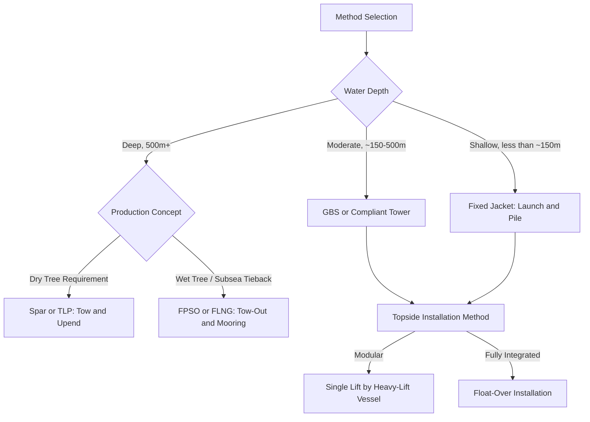

## Notable Offshore Platform Installation Projects

### Overview

Offshore platform installation is one of the highest-stakes categories of heavy-lift logistics: single lifts or float-overs routinely involve structures weighing 10,000–50,000+ tonnes, installed in open water with narrow weather windows and zero tolerance for positioning error. This item surveys landmark projects that established or advanced the dominant installation methods still referenced as industry benchmarks: gravity-base structure (GBS) tow-and-ballast, jacket lift/launch, float-over topside installation, and large-scale floating production unit tow-out.

### Installation Method Taxonomy

| Method | Description | Representative Structure Type |
| --- | --- | --- |
| **GBS Tow and Ballast-Down** | Concrete or steel gravity-base structure floated to site, then ballasted with seawater to settle onto the seabed | Troll A, Statfjord B/C |
| **Jacket Launch and Upend** | Steel jacket built horizontally onshore, loaded onto a barge, launched (slid) into the water, then upended and set on piled foundations | Most fixed steel platforms globally |
| **Single Lift (Heavy-Lift Vessel)** | A crane vessel lifts the jacket or topside as a single unit directly onto pre-installed piles or the substructure | Maureen, later Ekofisk-area platforms |
| **Float-Over Topside Installation** | A pre-fabricated, fully commissioned topside is floated on a barge between the legs of an already-installed jacket, then transferred by ballasting the barge down | Malampaya, ONGC platforms, ExxonMobil Julia |
| **Spar/TLP Tow-Out and Upending** | A cylindrical spar or tension-leg platform hull is towed horizontally, then upended offshore using controlled flooding before mooring | Perdido, Mad Dog, Heidrun TLP |
| **FPSO/FLNG Tow-Out** | A floating production, storage, and offloading vessel or floating LNG facility is constructed at a shipyard and towed to field location without a fixed substructure | Shell Prelude FLNG, Petrobras P-series FPSOs |

### Case Study: Troll A (Norwegian North Sea, 1995)

Troll A remains one of the most frequently cited GBS installation case studies due to the scale of the structure moved as a single unit.

**Key Points**

- Concrete gravity-base structure with skirts extending to a total height exceeding 300 meters, making it one of the tallest structures ever moved by humans at the time of installation
- Constructed in a purpose-built dry dock in a Norwegian fjord, then floated out and towed approximately 200 km to the field location
- Installation used controlled ballasting: seawater was progressively pumped into the base caisson compartments to lower the structure onto the seabed at a precisely surveyed location, with real-time monitoring of tilt and descent rate to avoid uneven seabed contact
- [Inference] The extreme height-to-base ratio of the structure required unusually tight tolerance on tow-out weather windows and tug configuration, though exact operational parameters used during the specific tow are not independently verifiable from general references

### Case Study: Perdido Spar (Gulf of Mexico, 2008–2010)

Perdido illustrates the spar tow-out and upending method for deepwater production.

- Truss spar hull fabricated at a shipyard, then towed horizontally across open ocean to the Gulf of Mexico field location
- Upended offshore through a sequential flooding process of internal buoyancy compartments, rotating the structure from horizontal tow orientation to vertical operating orientation
- At time of installation, it was among the deepest-water spar developments, requiring mooring line and riser installation coordinated closely with the upending sequence
- Demonstrates the interdependency between naval architecture (hull ballast design) and heavy-lift logistics planning (tow route selection, weather routing)

### Case Study: Malampaya Float-Over (Philippines, 2001)

A frequently referenced early large-scale float-over installation in Asia-Pacific waters.

- Topside module constructed and pre-commissioned onshore/on a fabrication yard, minimizing offshore hook-up work
- Transported on a submersible barge to the field location, then floated between the legs of the pre-installed jacket structure
- Installation executed by ballasting the transport barge down, transferring the topside load progressively onto pre-installed support structures on the jacket, followed by de-ballasting and barge removal
- Float-over methods of this type substantially reduce offshore installation duration compared to piece-by-piece module lifts, at the cost of requiring highly precise barge positioning (typically assisted by DGPS-guided winch and tug systems) during the transfer window

### Case Study: Shell Prelude FLNG (Australia, 2017)

Prelude represents the floating production category rather than fixed/GBS/spar installation, illustrating a different heavy-lift logistics profile: the "installation" is largely a tow-out and mooring exercise rather than a lift or ballast-down.

- Constructed at a shipyard in South Korea, then towed to the Browse Basin offshore Western Australia
- At approximately 488 meters in length, it is frequently cited as one of the largest floating structures ever built, though the largest-scale case for logistics purposes is the tow-out and station-keeping (turret mooring) installation rather than a discrete "installation lift"
- [Unverified] Specific published tonnage figures for Prelude vary across sources depending on whether hull-only displacement or fully loaded operating displacement is cited; exact figures should be verified against the operator's technical documentation for any application requiring precision

### Comparative Installation Complexity

### Common Lessons Across Landmark Projects

- **Weather window criticality** — nearly every major float-over, tow-out, or ballast-down installation is scheduled around narrow multi-day weather windows identified through long-lead metocean forecasting, with contingency plans for aborting and re-attempting the operation
- **Simulation and dry-run modeling** — large-scale float-over and upending operations are near-universally preceded by extensive computational hydrodynamic modeling and physical scale-model basin testing before execution
- **Redundant positioning systems** — DGPS/RTK positioning combined with laser tracking and visual reference points is standard for float-over transfer operations, given the consequence of misalignment during barge-to-jacket transfer
- **Integration of onshore pre-commissioning** — the trend across float-over case studies (Malampaya onward) has been toward maximizing onshore/yard completion of topsides to minimize offshore installation duration and associated weather risk exposure

### Illustrative Timeline Comparison

<svg xmlns="http://www.w3.org/2000/svg" viewBox="0 0 700 320">
<title>Notable Offshore Platform Installation Projects Timeline (svg_diagram)</title>
<text x="350" y="30" text-anchor="middle" font-size="18" font-weight="bold" fill="#1a1a1a">Installation Method Timeline (svg_diagram)</text>
<line x1="60" y1="280" x2="640" y2="280" stroke="#333" stroke-width="2" />
<g font-family="sans-serif" font-size="12">
<circle cx="120" cy="280" r="6" fill="#2b6cb0" />
<text x="120" y="260" text-anchor="middle">1995</text>
<text x="120" y="240" text-anchor="middle">Troll A</text>
<text x="120" y="225" text-anchor="middle">(GBS Ballast-Down)</text>
<circle cx="260" cy="280" r="6" fill="#2c7a7b" />
<text x="260" y="260" text-anchor="middle">2001</text>
<text x="260" y="240" text-anchor="middle">Malampaya</text>
<text x="260" y="225" text-anchor="middle">(Float-Over)</text>
<circle cx="420" cy="280" r="6" fill="#6b46c1" />
<text x="420" y="260" text-anchor="middle">2008-2010</text>
<text x="420" y="240" text-anchor="middle">Perdido</text>
<text x="420" y="225" text-anchor="middle">(Spar Tow/Upend)</text>
<circle cx="580" cy="280" r="6" fill="#c05621" />
<text x="580" y="260" text-anchor="middle">2017</text>
<text x="580" y="240" text-anchor="middle">Shell Prelude</text>
<text x="580" y="225" text-anchor="middle">(FLNG Tow-Out)</text>
</g>
</svg>

**Related Topics**

- Float-Over Installation Engineering and Barge Ballasting Sequences
- Metocean Forecasting and Weather Window Planning for Offshore Operations
- Heavy-Lift Vessel Fleet Overview (Saipem 7000, Thialf, Sleipnir class)
- Spar and TLP Upending Hydrodynamics
- Physical Model Basin Testing for Marine Operations