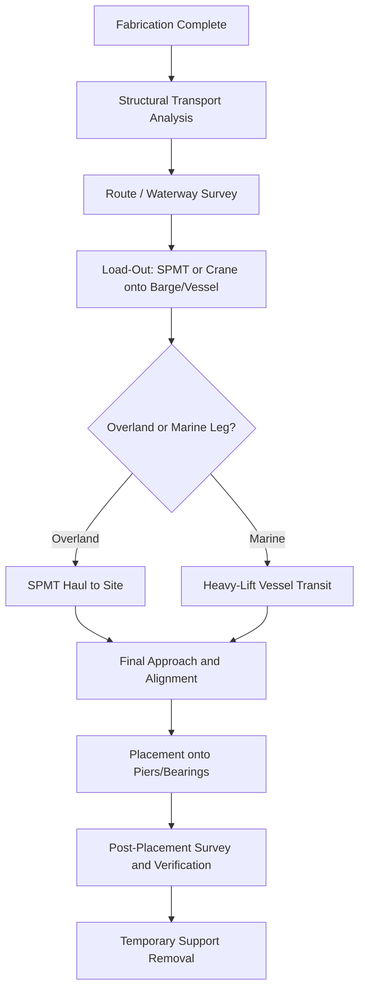

## Landmark Bridge Segment Transport Operations

### Overview

Landmark bridge segment transport refers to the engineering discipline of moving prefabricated, oversized, and overweight bridge components — deck sections, box girders, pylon segments, precast piers — from a fabrication yard to their final installation position. These operations sit at the intersection of heavy-lift marine transport, self-propelled modular transporter (SPMT) overland haulage, structural engineering, and marine/inland logistics. Segment weights routinely range from several hundred tonnes to over 8,000 tonnes, and dimensions frequently exceed standard transport envelopes by an order of magnitude, requiring purpose-built transport solutions rather than off-the-shelf trucking or shipping.

The core technical problem is consistent across projects: a structural element engineered for its *final* support conditions (bearings, piers, cables) must survive an entirely different set of loading conditions during transport — dynamic marine motion, uneven ground bearing, wind loading while suspended or cantilevered, and support reactions at temporary pick points rather than design bearings.

### Engineering Challenges

- **Weight and dimensional extremes**: Segments often exceed 500–8,000+ tonnes and can exceed 100 m in length, requiring multi-point load distribution systems.
- **Structural redesign for transport loading**: Temporary support points rarely align with final bearing locations, so the segment must be checked for bending, shear, and torsion under transport-induced reactions — a condition not present in the final in-service structure.
- **Route/waterway constraints**: Overland routes must clear bridges, utility lines, and intersections; waterways must have sufficient draft, air draft (vertical clearance), and channel width.
- **Environmental sensitivity**: Marine operations are constrained by tidal windows, wave height, current, and wind; overland moves are constrained by ground bearing capacity and thermal expansion tolerances of temporary structures.
- **Precision placement**: Final tolerances for pier seating, expansion joint alignment, and cable/anchor alignment are frequently in the range of millimeters despite segment masses in the thousands of tonnes.
- **Schedule and traffic disruption**: Many operations occur during narrow closure windows (overnight, weekend, or seasonal navigation windows) to minimize impact on live traffic or shipping lanes.

### Transport Methods

#### Self-Propelled Modular Transporters (SPMT)

SPMTs are multi-axle platform vehicles with independently steerable, hydraulically adjustable axle lines. They are used for:

- Moving segments from fabrication yard to load-out point (marine quay or launch position)
- "Slide-in" or Accelerated Bridge Construction (ABC) techniques, where an entire pre-built span is rolled into final position over a closure window measured in hours

Key characteristics:

- Modular axle lines can be combined side-by-side and end-to-end to match load footprint
- Hydraulic suspension self-levels across uneven ground, keeping the transported structure's geometry undistorted
- Onboard computer control synchronizes steering and load-sharing across hundreds of tires

#### Heavy-Lift Marine Vessels and Barges

For segments fabricated overseas or moved along coastal/river routes, heavy-lift ships (semi-submersible or deck-cargo type) or flat-deck barges carry the segment by water. Barges are frequently paired with SPMTs (SPMT drives onto barge, ballast is adjusted to match deck height, then reversed at destination).

#### Heavy-Lift Floating Cranes and Catamarans

Purpose-built catamaran-hulled crane vessels can lift and place precast segments directly, combining transport and erection in a single marine operation. This avoids a separate crane-lift step at the pier location.

#### Incremental Launching

For segments built on land adjacent to the final alignment, incremental launching pushes the assembled deck horizontally over temporary and permanent piers using hydraulic strand jacks or push rams, often assisted by a lightweight steel "launching nose" that reduces cantilever bending during the push sequence.

**Comparison of primary methods:**

| Method | Typical Segment Size | Key Constraint | Precision |
| --- | --- | --- | --- |
| SPMT overland | Up to ~2,000–3,000 t per unit | Ground bearing, route geometry | High (mm-level with GPS/laser guidance) |
| Barge/heavy-lift vessel | Up to 8,000+ t | Draft, tide, wave state | Moderate–high with ballast trim control |
| Floating crane/catamaran | Up to ~8,000 t single lift | Vessel stability, crane capacity curve | High |
| Incremental launching | Continuous deck, no upper mass limit per push | Push-force capacity, pier friction | High (continuous guidance) |

### Load Distribution and Ground Bearing Engineering

Before any overland move, engineers calculate axle-line load and ground bearing pressure to confirm the route (bridges, culverts, pavement) can support the transient load.

Average load per axle line:

$$L_{axle} = \frac{W_{total}}{n_{axle}}$$

where $W_{total}$ is total transported weight (segment plus SPMT self-weight) and $n_{axle}$ is the number of active axle lines.

Ground bearing pressure under a mat or crane pad:

$$P = \frac{W}{A}$$

where $W$ is the applied load and $A$ is the effective contact area of the mat or track.

**Example**

A precast box-girder segment weighs 4,200 t; the SPMT combination (trailers plus power pack units) adds 380 t, for $W_{total}=4{,}580$ t. Using 26 axle lines:

$$L_{axle} = \frac{4{,}580}{26} \approx 176.2\text{ t per axle line}$$

If each axle line's tire footprint plus mat distributes load over $9\ \text{m}^2$:

$$P = \frac{176.2}{9} \approx 19.6\ \text{t/m}^2$$

This figure is then checked against the allowable bearing capacity of the pavement, temporary mats, or barge deck at that point in the route — if it exceeds capacity, additional axle lines, wider mats, or a rerouted path are required.

### Route and Corridor Engineering

Overland transport requires a full corridor survey:

- Swept-path analysis for turning radii given the segment's overall length and width
- Vertical clearance survey (overhead utilities, gantries, existing bridges)
- Temporary removal/relocation of signage, guardrails, and utility lines
- Identification of "pinch points" requiring specialized maneuvers (e.g., SPMT crab-steering or segment rotation)
- Structural check of any existing bridges the route crosses, since SPMT loads may exceed the design live load of an in-service structure

### Case Studies

#### San Francisco–Oakland Bay Bridge — Self-Anchored Suspension (SAS) Span Deck Segments

The SAS replacement span's orthotropic steel box-girder deck segments were fabricated in Shanghai and transported across the Pacific Ocean on heavy-lift cargo vessels to the Bay Area construction site, where they were offloaded and lifted into position along the single-tower suspension structure. The Self-Anchored Suspension (SAS) is the world's largest of its kind. The exact tonnage of individual deck lifts varied by segment [Unverified]; the operation required close coordination between trans-oceanic marine transport schedules, US Coast Guard channel clearance, and crane capacity at the erection site.

#### Confederation Bridge (Canada) — Heavy-Lift Catamaran "Svanen"

The Confederation Bridge, linking Prince Edward Island to New Brunswick, was constructed using precast concrete piers, ice shields, and main-span box-girder segments cast on shore and transported to their final position by the purpose-modified floating catamaran crane vessel *Svanen*. Main pier segments and box girders were among the heaviest single lifts undertaken in bridge construction at the time, reported in the range of several thousand tonnes per lift [Inference — exact per-segment tonnage varies by source and segment type]. The vessel's twin-hull design provided the stability needed to lift and precisely lower segments onto pre-installed bearing shims in open water subject to Northumberland Strait currents and ice conditions.

#### Millau Viaduct (France) — Incremental Launching

The Millau Viaduct deck was assembled in sections at each valley abutment and launched horizontally out over temporary and permanent piers using hydraulic push systems, with a lightweight steel launching nose extending ahead of the deck to reduce cantilever bending moments during each push increment. The two half-decks were launched from opposite valley sides and met at midspan. This method avoided the need to lift the entire deck mass by crane over the valley's extreme height.

#### Overland SPMT Slide-In / Accelerated Bridge Construction (ABC)

A widely used U.S. and international practice involves building an entire replacement span adjacent to its final alignment, then using synchronized SPMT combinations to slide the completed span laterally onto permanent bearings during a short closure window (often a single weekend). This reduces live-traffic disruption from months to days, at the cost of intensive pre-move engineering to verify axle-line loads against temporary support towers and final bearing seating tolerances.

### Rigging, Lift Points, and Structural Verification

- **Lift/pick point design**: Temporary lifting lugs or strand-jack anchor points are engineered specifically for transport loads and verified by finite element analysis (FEA) against the segment's as-fabricated geometry, not just its in-service design.
- **Load path continuity**: Engineers verify that transport-induced stresses do not exceed material allowables at any stage, including partial-support conditions (e.g., segment resting on only two of four planned support points during a barge-to-SPMT transfer).
- **Motion monitoring**: For marine transport, accelerometers and inclinometers monitor vessel motion in real time; transport proceeds only within pre-approved sea-state and wind envelopes.
- **Ballast and trim control**: Barge or vessel ballast tanks are adjusted to keep the deck level and to match quay or SPMT ramp height precisely during load-in/load-out (RO-RO) operations.

### Risk Management and Contingency Planning

- **Weather routing**: Marine legs are planned around forecast weather windows, with defined go/no-go criteria for wave height, wind speed, and visibility.
- **Redundant support**: SPMT combinations are specified with reserve capacity (commonly 15–25% above calculated load) [Inference — margin varies by project specification and contractor standard] to accommodate load imbalance during dynamic maneuvers.
- **Emergency stop and jacking procedures**: Predefined procedures exist for setting the segment down safely at any point in the route should a mechanical or structural issue arise.
- **Stakeholder coordination**: Marine operations require coordination with port authorities and vessel traffic services; overland moves require coordination with utility companies, emergency services, and local traffic authorities.

### Process Flow Diagram

### Load Spreading Diagram

<svg xmlns="http://www.w3.org/2000/svg" viewBox="0 0 720 260" font-family="sans-serif">
<text x="360" y="22" text-anchor="middle" font-size="16" font-weight="bold">SPMT Axle Line Load Spreading (svg_diagram)</text>
<rect x="120" y="50" width="480" height="50" fill="#b0c4de" stroke="#333" stroke-width="2" />
<text x="360" y="80" text-anchor="middle" font-size="13">Bridge Segment (W_total)</text>
<line x1="150" y1="100" x2="150" y2="130" stroke="#333" stroke-width="2" />
<line x1="230" y1="100" x2="230" y2="130" stroke="#333" stroke-width="2" />
<line x1="310" y1="100" x2="310" y2="130" stroke="#333" stroke-width="2" />
<line x1="390" y1="100" x2="390" y2="130" stroke="#333" stroke-width="2" />
<line x1="470" y1="100" x2="470" y2="130" stroke="#333" stroke-width="2" />
<line x1="550" y1="100" x2="550" y2="130" stroke="#333" stroke-width="2" />
<rect x="120" y="130" width="480" height="20" fill="#888" stroke="#333" />
<text x="360" y="145" text-anchor="middle" font-size="11" fill="white">SPMT Trailer Deck</text>
<g fill="#444">
<rect x="140" y="155" width="20" height="30" rx="4" />
<rect x="220" y="155" width="20" height="30" rx="4" />
<rect x="300" y="155" width="20" height="30" rx="4" />
<rect x="380" y="155" width="20" height="30" rx="4" />
<rect x="460" y="155" width="20" height="30" rx="4" />
<rect x="540" y="155" width="20" height="30" rx="4" />
</g>
<text x="150" y="200" text-anchor="middle" font-size="10">L_axle</text>
<text x="230" y="200" text-anchor="middle" font-size="10">L_axle</text>
<text x="310" y="200" text-anchor="middle" font-size="10">L_axle</text>
<text x="390" y="200" text-anchor="middle" font-size="10">L_axle</text>
<text x="470" y="200" text-anchor="middle" font-size="10">L_axle</text>
<text x="550" y="200" text-anchor="middle" font-size="10">L_axle</text>
<line x1="120" y1="215" x2="600" y2="215" stroke="#000" stroke-dasharray="4,2" />
<text x="360" y="235" text-anchor="middle" font-size="12">Ground / Mat Bearing Surface (P = W / A)</text>
</svg>

**Key Points**

- Bridge segment transport combines structural, marine, and overland logistics engineering into a single integrated operation.
- Temporary support conditions during transport often govern structural design checks more critically than the final in-service load case.
- SPMTs, heavy-lift vessels, floating catamaran cranes, and incremental launching each suit different segment sizes, site geometries, and schedule constraints.
- Ground bearing pressure and axle-line load calculations determine route feasibility for overland moves.
- Weather routing, ballast control, and real-time motion monitoring are essential for marine legs.

**Conclusion**

Landmark bridge segment transport operations demonstrate the convergence of heavy-lift marine engineering, overland modular transport, and precision structural analysis. Success depends less on any single piece of equipment and more on the integrated engineering process: verifying the segment's structural adequacy under transient loading, confirming route and waterway feasibility, and executing within tightly controlled environmental and schedule windows. Behavior of specific transport equipment (SPMT load-sharing response, vessel ballast response) may vary by manufacturer, model, and site condition, so all figures presented here should be treated as illustrative rather than universal specifications.

**Related Topics**

- Self-Propelled Modular Transporter (SPMT) system design and control
- Heavy-lift vessel ballast and trim engineering
- Incremental launching method and launching nose design
- Accelerated Bridge Construction (ABC) and slide-in bridge techniques
- Marine cargo securing and lashing calculations
- Route survey and swept-path analysis for abnormal loads
- Structural finite element analysis for transient/transport load cases
- Weather routing and sea-state decision criteria for marine heavy-lift