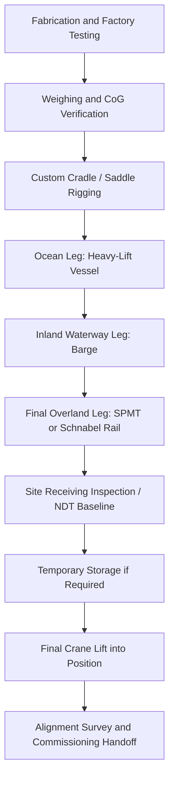

## Major Power Plant Equipment Delivery Case Studies

### Overview

Power plant equipment delivery encompasses the transport and installation of the largest, heaviest, and most schedule-critical components in industrial logistics: steam turbine rotors, generator stators, HRSGs (heat recovery steam generators), nuclear reactor pressure vessels, steam generators, transformers, and boiler modules. These items frequently exceed 300–500 tonnes as single, non-divisible pieces, cannot be disassembled without voiding warranty or damaging precision-machined internals, and are typically manufactured at a small number of specialized foundries/fabricators worldwide — meaning a single shipment often travels intercontinentally before reaching a landlocked plant site by inland heavy-haul transport.

The defining technical challenge is that these components combine extreme mass with extreme sensitivity: a generator stator's air-gap tolerances or a reactor vessel's internal cladding can be damaged by shock loads well below what would harm a structural steel girder of similar weight. This drives the use of shock-logging instrumentation, specialized cradles, and highly conservative transport engineering throughout the entire door-to-door route.

### Equipment Categories and Transport Profiles

| Equipment | Typical Weight Range | Key Sensitivity | Common Mode |
| --- | --- | --- | --- |
| Steam turbine rotor | 50–300 t | Bearing journals, blade tips | Rail/SPMT, custom cradle |
| Generator stator | 200–500 t | Winding insulation, air gap | Barge/SPMT, low-shock rigging |
| HRSG modules | 100–800 t each | Tube bundle alignment | Modular SPMT, barge |
| Nuclear reactor pressure vessel | 300–500 t | Internal cladding, nozzle alignment | Heavy-lift vessel, SPMT, specialized cradle |
| Nuclear steam generator | 300–700 t | Tube bundle integrity | Heavy-lift vessel, SPMT |
| Power transformers | 150–450 t | Winding/core insulation, oil seals | Rail (Schnabel car), SPMT |
| Boiler drums | 100–300 t | Weld integrity, internal baffles | Barge, SPMT |

### Route Engineering for Landlocked Plants

Most power plants are inland, requiring a multi-modal chain:

1. **Ocean leg**: Heavy-lift or deck-cargo vessel from the manufacturing port to the nearest suitable receiving port.
2. **Inland waterway leg** (where available): Barge transport up a navigable river to a point closest to the site.
3. **Final overland leg**: SPMT or specialized rail cars (Schnabel cars for transformers) covering the last, often most difficult, miles — frequently requiring temporary road widening, bridge reinforcement, or bypass construction.

Route engineering for the final overland leg is often the schedule-critical path, since it can require months of civil works (culvert reinforcement, roundabout removal, temporary bridges over creeks) before the shipment ever arrives at the port.

### Shock and Vibration Management

Precision equipment such as turbine rotors and generator stators are transported with shock data recorders that log acceleration in three axes throughout the journey. Contracts frequently specify maximum allowable g-force thresholds; an exceedance triggers manufacturer inspection before installation proceeds.

Typical specified limits (illustrative, verify against manufacturer/OEM shipping specification for the specific unit) [Inference — values vary significantly by OEM and equipment class]:

- Longitudinal: 2–3 g
- Lateral: 1–2 g
- Vertical: 2–4 g

**Example**

A generator stator's shock recorder logs a peak lateral acceleration of 2.6 g during an SPMT transfer over an uneven rail crossing, against a contract limit of 2.0 g. This exceedance requires the OEM to conduct a borescope and megger (insulation resistance) inspection of the stator windings before the unit is accepted for installation, potentially adding days to the schedule even though no visible damage exists.

### Rigging and Lift Engineering for Sensitive Components

- **Trunnion and lift-lug design**: Reactor vessels and turbine rotors typically ship with dedicated lifting trunnions engineered to the specific component's center of gravity, verified against the actual as-built weight (not nameplate estimate) via weighing prior to lift.
- **Spreader bar and tandem lift configurations**: Long components (rotors, HRSG modules) use spreader bars to maintain vertical sling angles and avoid inducing bending moments into the component.
- **Cradle and saddle design**: Cylindrical components (reactor vessels, steam generators) are transported in custom-fabricated saddles matching the vessel's outer diameter to distribute support load and avoid point-loading the shell.
- **Center-of-gravity verification**: Because internals (tube bundles, rotor windings) are not visible externally, CoG is calculated from design documents and verified by trial lift or load-cell weighing before final rigging plans are locked.

### Case Studies

#### AP1000 Reactor Vessel and Steam Generator Delivery (Vogtle Units 3 & 4, Georgia, USA)

The AP1000 reactor pressure vessels and steam generators for the Vogtle nuclear expansion were fabricated overseas (Doosan Heavy Industries, South Korea, among other suppliers) and delivered to the U.S. Savannah River port system, then moved inland by barge and SPMT to the plant site. Given the components' size and schedule criticality to the overall nuclear construction sequence, delivery windows were tightly coordinated with on-site crane availability, since the reactor vessel installation into the containment structure required a large ring crane erected specifically for this and similar heavy nuclear lifts. Exact tonnage and shock-limit specifications for the Vogtle components are proprietary to the project and OEM [Unverified].

#### Generator Stator Delivery to Inland Combined-Cycle Plants (General Pattern)

A common delivery pattern for combined-cycle power plants involves the generator stator — often the single heaviest, most schedule-critical component of the plant — being manufactured at a specialized electrical machinery works, shipped by heavy-lift vessel to the nearest deep-water port, transferred to a barge for the inland waterway leg (e.g., along major river systems), and completing the final leg via SPMT directly into the powerhouse building through a dedicated construction opening left in the building envelope specifically for this delivery. The construction schedule for the powerhouse structure is frequently sequenced around this single delivery event, since closing the building envelope before the stator arrives would require costly demolition and reconstruction.

#### Large Power Transformer Delivery via Schnabel Rail Car

Large power transformers (e.g., generator step-up transformers at 300+ t) are frequently transported over long inland distances by specialized Schnabel railcars, a rail car design in which the transformer's own body forms part of the load-bearing structure between two rail bogies, effectively making the transformer "part of the train." This design distributes the transformer's weight across a longer wheelbase than a standard flatcar could achieve, keeping axle loads within rail infrastructure limits. Final delivery from the rail siding to the substation/plant location is typically completed via SPMT or heavy-duty low-boy trailer for the last mile.

#### HRSG Module Delivery for Combined-Cycle Plants

Heat recovery steam generator modules are increasingly fabricated as large pre-assembled modules (rather than stick-built on site) to reduce field labor and schedule risk, then transported by barge or heavy-haul trailer to the plant site in sections that are craned into position and joined. This modularization trend shifts technical risk from field erection quality control to transport engineering, since each module must survive transport loading without misaligning the internal tube bundles that were precisely assembled and tested in the fabrication shop.

### Weighing and Load Verification

Before final rigging or SPMT loading, actual weight and center of gravity are frequently verified using load cells integrated into the lifting slings or SPMT hydraulic system, since nameplate/design weights can differ from as-built weight by several percent due to fabrication tolerances, coatings, or last-minute design changes.

$$W_{actual} = \sum_{i=1}^{n} F_i$$

where $F_i$ is the load-cell reading at each of $n$ support/lift points, and the CoG offset is back-calculated from the relative distribution of $F_i$ across known point locations.

### Site Receiving and Final Placement

- **Pre-installation inspection**: Precision components undergo dimensional and NDT (non-destructive testing) inspection immediately upon site arrival to establish a baseline condition record before final installation, protecting both OEM and owner in the event of a later warranty dispute.
- **Temporary storage engineering**: If the plant's civil works are not ready to receive the component upon arrival, temporary storage must account for ground bearing, weather protection (especially for components with sensitive insulation or bearings), and continued security/monitoring.
- **Final rigging into position**: Heavy lift cranes (crawler or ring cranes) place the component onto its foundation, often to alignment tolerances of a few millimeters, verified by laser survey.

### Process Flow Diagram

**Key Points**

- Power plant equipment combines extreme mass with extreme sensitivity, requiring shock monitoring and specialized cradles beyond what standard heavy-lift cargo needs.
- Landlocked plants typically require a three-leg journey: ocean vessel, inland barge, and final SPMT/rail overland leg.
- Shock exceedances during transport can trigger costly OEM re-inspection even without visible damage.
- Schnabel railcars are a specialized solution for long-distance transformer transport, using the transformer body itself as part of the load-bearing structure.
- Powerhouse construction schedules are frequently sequenced around the single delivery event of the heaviest component (commonly the generator stator).

**Conclusion**

Major power plant equipment delivery represents one of the highest-stakes categories of heavy-lift logistics, where transport engineering must protect both structural integrity and precision manufacturing tolerances simultaneously. The reliance on a small number of global fabricators for reactor vessels, stators, and large transformers means that transport routing, shock management, and schedule contingency planning are treated as core engineering disciplines rather than logistics afterthoughts. Specific shock limits, weights, and routing details vary by OEM, project, and jurisdiction, so figures presented here should be treated as illustrative of general industry practice rather than universal standards.

**Related Topics**

- Shock and vibration data logging standards for sensitive cargo
- Schnabel railcar design and axle-load distribution
- Ring crane erection for nuclear reactor vessel installation
- Modularization trends in HRSG and boiler fabrication
- Load-cell based center-of-gravity verification methods
- Inland waterway barge transport engineering
- Construction sequencing around critical equipment delivery windows
- Non-destructive testing (NDT) baseline inspection protocols for heavy equipment