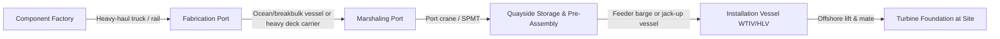

## Complex Multimodal Wind Farm Delivery Projects

### Overview

Wind farm delivery projects — both onshore and offshore — represent one of the most demanding case studies in heavy-lift and specialized logistics. A single project integrates ocean freight, port marshaling, heavy-haul road transport, rail, barge feeder operations, and offshore installation into one continuous, schedule-critical supply chain. Component dimensions and weights routinely exceed standard freight envelopes: blades can run past 100 meters, nacelles can weigh several hundred tonnes, and monopile foundations for next-generation turbines can weigh over 2,000 tonnes. Nacelles house the generator, gearbox, and control systems, making them the heaviest single component on the truck, with weight varying widely by manufacturer and turbine class. The logistics discipline required is not simply "big freight" — it is the orchestration of engineering, permitting, vessel chartering, and installation sequencing as a single system. [shipsims](https://www.shipsims.com/feeds/blog/transportation-wind-turbines)

### Core Components and Their Transport Profiles

**Blades**

Vestas has documented a roughly 115.5-meter blade for its offshore V236 model, tested at its Osterild facility ahead of commercial deployment. Blades are long, aerodynamically fragile, and asymmetrically loaded (root end heavy, tip end light), which drives specialized handling. [shipsims](https://www.shipsims.com/feeds/blog/transportation-wind-turbines)

- **Key Points**
  - Extendable flatbed trailers stretch to accommodate blade length while preventing the bending or shifting that a fixed-length deck cannot control. [shipsims](https://www.shipsims.com/feeds/blog/transportation-wind-turbines)
  - Root-end lifting points and trunnions are engineered by the OEM; field-improvised lift points are not permitted.
  - Leading/trailing edge surfaces are highly sensitive to point-loading and require custom cradles.
  - A detailed inventory is required for every component — length, gross and center-of-gravity weights, lifting points and insert types, fragility notes such as leading/trailing edge blade sensitivity, and maximum allowable sea state for movement. [beardown-logistics](https://beardown-logistics.com/blog/transport-offshore-wind-farm-components/)

**Tower Sections**

- Schnabel trailers cradle tower sections directly, removing the need for a separate deck and reducing structural stress on the cylindrical shell. [shipsims](https://www.shipsims.com/feeds/blog/transportation-wind-turbines)
- Towers are typically shipped in 2–4 sections per turbine depending on hub height and road/rail clearance constraints.

**Nacelles**

- Multi-axle lowboy combinations distribute nacelle weight across more wheels, lowering the center of gravity for better stability on grades and turns. [shipsims](https://www.shipsims.com/feeds/blog/transportation-wind-turbines)
- [Inference] Nacelle mass and CoG vary significantly by OEM and turbine class, so route/lift engineering must be based on the manufacturer's certified transport data sheet rather than a generic class assumption.

**Foundations (Monopiles, Jackets, Transition Pieces, Floating Foundations)**

Common foundation types include monopiles, jackets, gravity-based structures, and floating foundations, each anchoring the turbine to the seabed. These are the heaviest single lifts in the project and are almost always moved by sea. [projectcargojournal](https://www.projectcargojournal.com/knowledge-base/2025/08/07/offshore-wind-the-terms-you-need-to-know/)

### Multimodal Chain: Factory to Foundation

**Leg-by-Leg Breakdown**

1. **Factory to Fabrication Port (Inland Heavy Haul)**

   Moving components from factories to ports is often the longest leg in time and logistical complexity, demanding specialist over-dimensional hauling equipment and careful coordination with local and state authorities. Heavy-duty truck systems haul components to the nearest port, handled with care to avoid damage on this first leg, where they are staged, stored, labeled, and organized so the right component loads in the correct sequence onto the vessel. [beardown-logistics](https://beardown-logistics.com/blog/transport-offshore-wind-farm-components/)[txintlfreight](https://www.txintlfreight.com/product/wind-turbine-transportation-companies/)
2. **Port-to-Port Ocean Transport**

   Purpose-built heavy deck carriers or breakbulk vessels move completed components internationally. Dajin Heavy Industry's King One vessel completed its maiden voyage shipping monopiles for Ørsted's 2.9 GW Hornsea 3 offshore wind farm from China to the UK, and its sister vessel King Two can transport components for turbines up to 25 MW. This illustrates the trend toward dedicated, ultra-heavy-lift newbuilds purpose-designed for a single cargo class rather than repurposed general breakbulk tonnage. [offshorewind](https://www.offshorewind.biz/2026/04/20/chinese-company-launches-second-vessel-designed-to-transport-25-mw-wind-turbine-components/)
3. **Marshaling Port Operations**

   Marshaling ports stage major components — blades, towers, nacelles, and foundations — and load them onto installation vessels; the complex logistics of maneuvering and loading these components mean marshaling ports face the most challenging spatial requirements of any offshore wind port type. A select few components such as blades, jackets, and monopiles require up to 100 acres of laydown and handling space, and facilities for blades, nacelles, towers, monopiles, transition pieces, cables, and steel plates each require capital investment exceeding $200 million. [nlr](https://docs.nlr.gov/docs/fy23osti/84710.pdf)[nrel](https://docs.nrel.gov/docs/fy23osti/84710.pdf)
   - [Unverified] Regional port capacity constraints (e.g., available acreage relative to component footprint) are project- and jurisdiction-specific and should be verified against the current marshaling port register for the target region.
4. **Feeder Vessel / Barge Transfer**

   A feeder vessel transports components from port to the installation vessel. Feeder barges may be jack-up vessels that lift themselves off the seafloor while a WTIV or HLV picks components from the deck, and a project using a feeder strategy will typically require two to three vessels to keep the installation vessel continuously supplied. [projectcargojournal](https://www.projectcargojournal.com/knowledge-base/2025/08/07/offshore-wind-the-terms-you-need-to-know/)[nrel](https://docs.nrel.gov/docs/fy23osti/84710.pdf)
5. **Offshore Installation**

   A self-elevating (jack-up) vessel lowers legs to the seabed to lift the hull clear of the water, providing a stable platform for heavy-lift operations, and specialized installation vessels handle the transport and erection of foundations, towers, nacelles, and blades. [projectcargojournal](https://www.projectcargojournal.com/knowledge-base/2025/08/07/offshore-wind-the-terms-you-need-to-know/)

### Pre-Transport Engineering and Packaging

Reducing offshore lift count and vessel dwell time is a primary cost lever, since crane-hours at sea are the most expensive part of the chain.

- **Nacelle-Tower Mating**: Many projects ship the nacelle pre-mounted on one tower section where crane reach, capacity, and trailer geometry allow, reducing both the number of offshore lifts and the time a large crane must hold a heavy load on a vessel. [beardown-logistics](https://beardown-logistics.com/blog/transport-offshore-wind-farm-components/)
- **Blade Segment Handling**: For extremely long blades, modular segments may be bonded or fitted at the staging area, or blades may be transported whole using specially designed cradles and fixtures, with pre-inspection and torque-verification of blade root connections completed prior to marine loadout. [beardown-logistics](https://beardown-logistics.com/blog/transport-offshore-wind-farm-components/)
- [Inference] Sequencing pre-assembly work at the marshaling port (rather than at the factory or offshore) is generally preferred because it shortens the highest-cost, weather-exposed offshore installation window, though the optimal split depends on port crane capacity and vessel schedule.

### Case Study: Port-Based XXL Nacelle Logistics (Saint-Nazaire / Block Island)

A logistics operation at Nantes–Saint Nazaire Port loaded five 400-tonne General Electric offshore wind turbine nacelles onto the jack-up vessel Brave Tern, operated by Fred Olsen Wind Carrier, for shipment to Block Island in the USA. The operation — including in-factory loading by jacking and storage of cargo at the Louis Joubert sluice dock — was orchestrated by OCTRA, a transport services and engineering provider specializing in the management of very heavy component projects, moving components measuring 10 metres in height from the General Electric factory at Montoir de Bretagne to the port logistics hub with precision handling throughout. [sogebras](https://www.sogebras.com/shipment-of-offshore-wind-turbine-nacelles-fully-operational-xxl-sized-port-based-logistics/)[sogebras](https://www.sogebras.com/shipment-of-offshore-wind-turbine-nacelles-fully-operational-xxl-sized-port-based-logistics/)

**What this illustrates for the case-study framework:**

- A dedicated third-party heavy-lift engineering contractor (not the OEM or the shipping line) coordinated the interface between factory jacking, port storage, and vessel loadout.
- The "logistics hub" concept — a staging area purpose-built to buffer components between factory output rate and vessel loading rate — is a recurring pattern across major projects.
- Jack-up vessels function in a dual role: as a feeder/carrier and, later, as the installation platform.

### Regulatory and Jurisdictional Constraints

- **Cabotage Law (U.S. Jones Act)**: The Jones Act requires vessels transporting merchandise between U.S. ports, including offshore wind turbine locations, to be U.S.-flagged, which is a key factor in vessel selection for American projects. [Inference] This constraint is a primary driver behind the U.S. feeder-barge model, since foreign-flagged installation vessels can operate at the offshore site but cannot legally shuttle components directly between two U.S. ports. [nlr](https://docs.nlr.gov/docs/fy23osti/84710.pdf)
- **Supply Chain Bottlenecks**: European supply chains are expected to be stretched thin to support local offshore wind development, and while some underlying components (steel plates, rare-earth metals, permanent magnets, balsa wood and carbon for blades, hub castings, gearboxes, and generators) may be supplied to the U.S. market, existing production capacity is unlikely to fully meet national offshore wind targets. [nlr](https://docs.nlr.gov/docs/fy23osti/84710.pdf)
- **Route and Border Coordination (Onshore Legs)**: Oversized components, heavy-lift requirements, port and road limitations, weather, and customs clearance are consistently cited as the biggest challenges in wind turbine logistics. [yqn](https://www.yqn.com/intro/blog/post/how-to-ship-wind-turbines)

### Fleet Trends: Purpose-Built Heavy-Lift Tonnage

The offshore wind sector is driving a wave of newbuild vessels purpose-designed for turbine-scale cargo rather than adapted oil-and-gas tonnage. Heavy-lift vessels active in the oil-and-gas market would likely require significant retrofits to accommodate the different crane, pile-driving, and lift types needed to install offshore wind foundations, especially as next-generation monopiles grow larger. This is reflected in the emergence of dedicated deck carriers such as the King One/King Two class, purpose-built for 25 MW-class turbine components on the China–Europe corridor. [nrel](https://docs.nrel.gov/docs/fy23osti/84710.pdf)

### Risk Factors Specific to Wind Farm Delivery

**Example**

| Risk Category | Failure Mode | Mitigation |
| --- | --- | --- |
| Weather window | Blade/nacelle lift aborted mid-operation due to sea state | Pre-defined maximum allowable sea state per component; weather routing buffers |
| Port congestion | Marshaling port laydown space exceeded, delaying vessel loadout | Sequenced factory delivery scheduling matched to vessel loading rate |
| Fragility damage | Blade leading-edge or root-connection damage from improper lift point use | OEM-certified lifting fixtures only; torque-verification pre-loadout |
| Vessel availability | Installation vessel (WTIV) schedule slip cascades across feeder fleet | Feeder-barge buffer strategy (2–3 vessels per WTIV) |
| Regulatory | Cabotage violation on inter-port component moves | Confirm vessel flag state against jurisdictional cabotage law before charter |

### Illustrative Diagram: Component Lift-Point and Fragility Zones (Blade)

<svg xmlns="http://www.w3.org/2000/svg" viewBox="0 0 800 260">
<title>Blade Lift-Point and Fragility Zone Map (svg_diagram)</title>
<rect x="0" y="0" width="800" height="260" fill="#ffffff" />
<polygon points="60,150 600,140 760,148 760,158 600,152 60,160" fill="#cbd5e1" stroke="#334155" stroke-width="2" />
<circle cx="140" cy="152" r="10" fill="#ef4444" />
<text x="120" y="185" font-size="13" fill="#334155">Root Lift Point</text>
<circle cx="400" cy="146" r="8" fill="#f59e0b" />
<text x="360" y="185" font-size="13" fill="#334155">Mid-Span Support Cradle</text>
<circle cx="700" cy="150" r="5" fill="#22c55e" />
<text x="670" y="185" font-size="13" fill="#334155">Tip (fragile)</text>
<rect x="60" y="100" width="120" height="30" fill="none" stroke="#dc2626" stroke-dasharray="4,3" />
<text x="60" y="95" font-size="12" fill="#dc2626">High CoG / Heavy Zone</text>
<rect x="550" y="130" width="200" height="30" fill="none" stroke="#16a34a" stroke-dasharray="4,3" />
<text x="550" y="125" font-size="12" fill="#16a34a">Leading/Trailing Edge Fragility Zone</text>
<text x="300" y="30" font-size="16" fill="#0f172a" font-weight="bold">Offshore Wind Blade — Transport Lift-Point Map</text>
</svg>

### Metrics and Formulas Relevant to Load Planning

Axle load distribution for multi-axle trailer configurations (simplified static case, uniform CoG offset):

$$W_i = W_{total} \times \frac{d_i}{\sum_{j=1}^{n} d_j}$$

Where $W_i$ is the load on axle group $i$, $W_{total}$ is total component weight, and $d_i$ is the distance-weighted contribution of that axle group relative to the component's center of gravity. [Inference] Actual axle-load engineering for a specific haul requires the OEM's certified CoG report and jurisdiction-specific bridge formula compliance — this equation is illustrative of the underlying static-load principle, not a substitute for a professional route-survey calculation.

### Related Topics

- Marshaling port design and laydown-area capacity planning
- Jack-up vessel mechanics and leg-penetration seabed assessment
- Jones Act / cabotage law impact on U.S. offshore wind logistics
- Blade root connection engineering and torque-verification procedures
- Feeder barge fleet sizing models for continuous WTIV supply
- Route survey and permitting for oversized inland heavy-haul corridors
- Floating foundation transport and tow-out logistics
- Heavy deck carrier fleet economics (newbuild vs. retrofit oil-and-gas tonnage)
- Weather-window risk modeling for offshore lift operations
- Cross-border customs clearance for multinational component supply chains