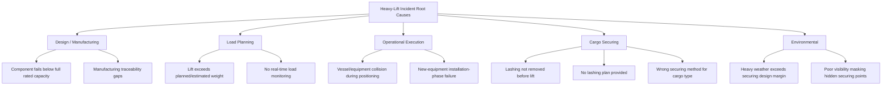

## Lessons Learned from Heavy-Lift Incidents

### Overview

Heavy-lift incidents — crane failures, cargo securing failures, vessel/structure collisions, and overload events — recur across the industry with a consistent pattern of root causes: exceeded design margins, inadequate rigging or securing verification, communication breakdowns between engineering and field crews, and environmental factors treated as secondary rather than primary risk drivers. Studying documented incidents is standard practice in heavy-lift risk management because failure modes repeat across unrelated operators, cargo types, and regions. This item synthesizes verified incident case studies with the structural lessons the industry has extracted from them.

### Case Study 1: Crane Hook Failure — Rostock Heavy-Lift Crane Collapse

**Incident Summary**

A major heavy-lift crane collapse at Rostock was determined by Liebherr, in agreement with responsible authorities and experts, to have been caused by a broken crane hook. According to hook manufacturer Ropeblock, hook failure occurred at a provisionally determined load of approximately 2,600 tonnes, on a crane designed for a maximum lifting capacity of 5,000 tonnes at a 35 m outreach. Ropeblock stated that it had designed the crane's lifting blocks including the hook, that manufacture was sourced from a certified supplier experienced with parts of similar and larger sizes, and that the design had been verified by the authorized notified body prior to manufacture. The investigation was described as an integrated one that would also examine the hook's manufacture in detail, since the hook stem breaking was the immediately apparent failure point but the exact course of events and root cause remained unknown at the time of reporting.

**Lessons Learned**

- A component operating at roughly half its rated capacity (2,600 t against a 5,000 t design limit) can still fail catastrophically — meaning working-load-limit compliance alone does not guarantee against material or manufacturing defects.
- Design verification by a notified body and sourcing from a certified supplier are necessary but not sufficient controls; traceability of the manufacturing process itself must be independently auditable after any failure.
- [Inference] Post-incident investigations of this kind typically examine the full chain — design, material certification, manufacturing process, and in-service inspection history — rather than assuming the immediately visible failure point (the hook stem) is the sole causal factor.

### Case Study 2: Overloaded Lift Exceeding Planned Weight — Crane Barge Boom Failure

**Incident Summary**

The U.S. National Transportation Safety Board investigated a crane failure aboard the crane barge Atlantic Giant II, which occurred when the main boom failed while moving a section of a vessel being dismantled in the Brownsville Ship Channel, Texas, on August 9, 2018, at approximately 20:30 local time. The load and crane boom fell into the harbor; two shipyard employees on the barge and a third aboard an assisting tugboat were injured, no pollution was reported, and damage to the barge and crane was estimated at $6.4 million. The failure occurred as a result of a lift that exceeded the planned weight.

**Lessons Learned**

- **Key Points**
  - Weight estimation for lift planning must use verified, documented mass data rather than estimated or assumed figures — a lift executed against an inaccurate weight plan removes the engineered safety margin without any visible warning to the crew.
  - Ship-dismantling and salvage-adjacent heavy-lift work carries elevated weight-uncertainty risk because components (unlike factory-built cargo) frequently lack certified mass documentation.
  - Real-time load monitoring instrumentation (load cells, moment limiters) functions as a critical last line of defense specifically against the failure mode of "planned weight exceeded" — a control gap this incident exposed.

### Case Study 3: Vessel-to-Crane Collision During Delivery Operations — Keelung Port

**Incident Summary**

An STS (ship-to-shore) crane collapsed at Keelung Port's Pier 20 on October 14, at approximately 2:00 p.m. local time, after the Chinese-flagged heavy-load carrier Yuzhou Qi Hang, which was delivering a new BC-207 STS crane, collided with an existing onshore crane during the delivery operation, causing the existing crane to collapse. The incident occurred during crane delivery operations for China Container Terminal Corporation; no injuries were reported, though several containers were damaged, and authorities and insurers launched an investigation into the collision and site conditions.

**Lessons Learned**

- Heavy-load carrier vessel maneuvering near an active, equipped quay is itself a distinct hazard category separate from the lift/discharge operation — clearance planning must treat vessel approach and berthing as a controlled phase with its own risk assessment.
- Delivery of new heavy equipment (a crane, in this case) to a live port environment introduces collision exposure to *existing* fixed infrastructure that a generic lift plan may not account for.
- [Inference] Pre-arrival simulation or physical clearance verification between an inbound heavy-load carrier's superstructure/cargo profile and fixed quay equipment appears to be an underused control relative to its demonstrated failure consequence.

### Case Study 4: New Equipment Failure During Installation — Tuas Port STS Crane Collapse

**Incident Summary**

On June 15, 2025, at 13:20 local time, a brand-new SANY ship-to-shore (STS) crane collapsed at Singapore's Tuas Port during delivery and installation procedures, at a non-operational berth within the Tuas Port expansion project; no injuries were reported and port operations continued uninterrupted. The Maritime and Port Authority of Singapore and PSA Singapore issued a joint statement confirming the incident, and the double-trolley STS crane tipped over during positioning operations.

**Lessons Learned**

- Installation/positioning of brand-new, not-yet-commissioned heavy equipment is a distinct high-risk phase — the equipment has no operating history, and installation-stage load paths (jacking, temporary supports, partial ballast/counterweight states) often differ from its designed in-service configuration.
- [Unverified] The specific root cause (foundation, ballast condition, wind loading, or structural defect) had not been publicly confirmed at time of the cited reporting; this case illustrates incident *pattern* (new-equipment positioning failure) rather than a confirmed root-cause lesson.

### Case Study 5: Cargo Securing Failure — Lashing Left in Place During Offshore Discharge

**Incident Summary**

The Marine Safety Forum published an incident report describing lashings that remained on cargo as it was being discharged offshore, creating high potential for a serious incident. While offloading a slip joint from a vessel's starboard side aft, the forward lashing was not removed; as the crane took up the weight on the wire, the securing lashing parted while remaining wrapped around the slip joint, creating a rocking movement that brought the slip joint into contact with a previously back-loaded lift, damaging its construction. The forward lashing was on the underside of the riser, hard up against risers forward of it, making it very difficult to see in the dark despite deck spotlights being on — it was not noticed until the lift was already a few meters above the deck.

**Lessons Learned**

- A pre-lift securing-removal checklist must be physically verified item-by-item, not visually scanned, particularly for lashing points located on the underside or hidden face of irregularly shaped cargo.
- Lighting adequacy assessments for night lifts must account for shadow zones created by the cargo geometry itself, not just overall deck illumination levels.
- The resulting corrective actions from this investigation were procedural and cultural: raising the incident at the next safety meeting, verifying deck lighting function, and having all concerned personnel re-read cargo securing information — illustrating that many heavy-lift near-misses trace back to documentation/procedure reinforcement rather than equipment redesign.

### Case Study 6: Lashing Plan Absence Leading to Cargo Loss in Heavy Weather

**Incident Summary**

The Swedish Club's Monthly Safety Scenario described an incident in which a general cargo vessel loading at three ports secured and lashed cargo at all three ports without a lashing plan from the charterers; only one port had a supercargo present to supervise loading, and that supervision was absent at the final port. Despite weather routing, the vessel encountered heavy weather in the Pacific with Beaufort 9 winds, and the resulting rolling and pitching led to cargo damage from broken lashings.

**Lessons Learned**

- A documented, charterer-provided lashing plan is a control point in its own right — securing cargo competently but "ad hoc," without an engineered lashing plan matched to the specific voyage's expected sea states, removes an entire layer of defense before the vessel ever leaves port.
- Supervisory presence (supercargo) at some but not all loading ports creates inconsistent quality control across an otherwise identical securing process — the *absence* of supervision at even one port in a multi-port loading sequence is a documented risk factor.
- Weather routing reduces but does not eliminate heavy-weather exposure; lashing engineering must be sized to credible worst-case sea states for the voyage, not the routed/optimized forecast.

### Case Study 7: Incorrect Securing Method for Cargo Type — Deck Cargo Loss

**Incident Summary**

The UK Marine Accident Investigation Branch (MAIB) documented a case in which a coaster lost a significant quantity of deck-stowed logs overboard due to improper securing methods during rough weather on a UK-to-UK passage. The vessel's crew was accustomed to carrying sawn timber, which can be tightly stowed and secured with nylon lashing straps, but the vessel's cargo securing manual required a different method — wiggle wires to tighten and compress the stow — for cargoes of logs, before lashing straps or hog wires/chains were applied. Overnight, in bad weather, the logs worked loose within the lashing straps despite initially appearing tightly stowed; the lashings and stanchions ultimately could not prevent the loss.

**Lessons Learned**

- Applying a securing method that is correct for one cargo type (sawn timber) to a geometrically different cargo type (logs) is a documented, specific failure mode — cargo securing manuals must be followed by cargo-type-specific procedure, not by crew habit or prior experience with a similar-looking cargo.
- A stow that "appears tightly stowed" at loading is not verification that it will remain so under dynamic sea loads; compression method (wiggle wires) versus restraint method (straps alone) addresses fundamentally different physics and cannot substitute for one another.

### Consolidated Root-Cause Taxonomy

### Cross-Case Pattern Analysis

**Key Points**

- **Verification gap, not knowledge gap**: In nearly every case above, the correct procedure or design standard existed on paper (lift plans, cargo securing manuals, notified-body design verification). The failure occurred in the *execution or verification* of that standard, not in its absence from institutional knowledge.
- **Hidden/concealed conditions are a recurring physical factor**: The Rostock hook failure (internal material condition), the lashing-left-on-cargo incident (hidden underside lashing point), and the log-securing failure (stow appearing tight but not compressed) all share a pattern where the failure condition was not visible through normal inspection.
- **New/transitional operations carry elevated risk**: Both crane collapse cases at ports (Keelung, Tuas) occurred during *delivery or installation* of equipment rather than during routine operation — a phase where standard operating procedures for the equipment's normal service life do not yet fully apply.
- **Weight and mass data integrity is foundational**: The Atlantic Giant II failure demonstrates that an otherwise well-engineered crane system fails when fed inaccurate input data (actual vs. planned weight) — lift engineering is only as reliable as the mass/CoG data supplied to it.

### Corrective Action Framework Derived from Incident Patterns

**Example**

| Lesson Category | Corrective Control | Applies To |
| --- | --- | --- |
| Concealed securing points | Physical (not visual) verification checklist, sign-off per lashing point | Offshore/night discharge operations |
| Weight data integrity | Certified mass/CoG documentation mandatory before lift plan approval | Salvage, dismantling, non-OEM cargo |
| New equipment installation | Distinct risk assessment for installation/positioning phase, separate from in-service SOPs | Crane delivery, commissioning |
| Vessel maneuvering near infrastructure | Pre-arrival clearance simulation between vessel profile and fixed quay equipment | Heavy-load carrier port calls |
| Cargo-specific securing method | Mandatory cross-check of cargo securing manual against actual cargo geometry, not crew habit | Deck cargo, irregular loads |
| Manufacturing traceability | Independent post-incident audit trail covering design, certification, and manufacture | Critical lifting components (hooks, blocks) |

Regular audits and inspections assessing equipment integrity, safety protocol adherence, and regulatory compliance are considered essential to continuous improvement in heavy-lift cargo handling, and post-lift debriefings are cited as a standard mechanism allowing teams to reflect on strategy effectiveness and capture lessons learned for future operations.

### Institutional Reporting Mechanisms Referenced

- **Marine Safety Forum** — publishes incident alerts (e.g., the lashing-left-on-cargo case) specifically to prevent recurrence across member operators.
- **The Swedish Club** — issues Monthly Safety Scenarios synthesizing P&I claims data into structured lessons-learned case studies.
- **UK MAIB Safety Digest** — publishes investigated cases (e.g., the log-securing failure) with direct crew-facing lessons-learned sections.
- **The Nautical Institute (MARS reports)** — anonymized incident reporting system used industry-wide for near-miss and incident lesson dissemination.
- **U.S. NTSB** — formal government investigation authority for major marine casualty events including heavy-lift crane failures.
- [Inference] Cross-referencing multiple independent reporting bodies (P&I clubs, flag-state investigators, industry safety forums) for the same incident category is standard practice for building a comprehensive lessons-learned library, since each body tends to emphasize different causal factors (technical/engineering vs. procedural/human factors).

### Related Topics

- Crane hook and lifting-block certification standards (design verification vs. manufacturing traceability)
- Load monitoring instrumentation: load cells, moment limiters, and real-time weight verification systems
- Cargo securing manual (CSM) development per ISO/IMO Code of Safe Practice for Cargo Stowage and Securing
- Pre-lift checklist design for concealed/hidden securing point verification
- Heavy-load carrier vessel clearance planning for port delivery operations
- New-equipment installation-phase risk assessment methodology
- P&I club claims data as a heavy-lift risk intelligence source
- Root-cause analysis frameworks (5 Whys, fishbone/Ishikawa) applied to heavy-lift failures
- Weather routing limitations and heavy-weather lashing design margins
- Post-incident investigation governance: notified bodies, flag-state authorities, and manufacturer liability