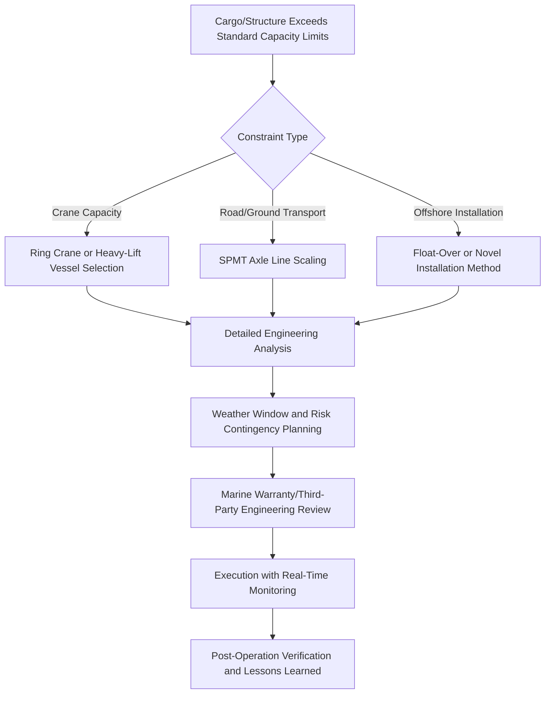

## Record-Breaking Lifts and Transport Operations

### Overview

Record-breaking lifts and transport operations serve as reference points for the heavy-lift and specialized logistics industry, pushing the boundaries of crane capacity, SPMT configuration, vessel deadweight, and engineering methodology. These operations are valuable case studies not merely for their scale, but for the engineering innovations, risk management approaches, and cross-disciplinary coordination they required. Studying them illustrates how theoretical engineering principles translate into practice at the limits of current technology.

### Categories of Records in Heavy-Lift Logistics

- **Heaviest single lift by crane** — typically ring cranes or crawler cranes used in module installation, refinery, and power plant construction
- **Heaviest self-propelled modular transporter (SPMT) move** — multi-thousand-axle-line configurations moving entire structures, ships, or industrial modules
- **Heaviest offshore lift/installation** — single-lift platform topsides installations using specialized heavy-lift vessels
- **Largest float-over installation** — installing platform topsides onto substructures without conventional crane lifting
- **Heaviest cargo carried by ship** — breakbulk or semi-submersible vessel records for individual cargo pieces
- **Longest abnormal load road transport** — distance-based records for indivisible loads moved by road

### Case Study Framework for Analysis

When studying any record-breaking operation, a consistent analytical framework helps extract transferable lessons:

**Key Points**

- **Engineering constraint that drove the record** — was it crane capacity, vessel deadweight, road infrastructure, or a combination requiring a novel solution?
- **Method selection rationale** — why was this lift/transport method chosen over alternatives (e.g., float-over vs. crane lift for platform installation)?
- **Risk mitigation approach** — what redundancy, contingency planning, and weather/environmental risk management was built into the operation?
- **Stakeholder coordination complexity** — how many parties (engineering, marine warranty surveyors, port authorities, local governments) had to align for approval and execution?
- **Innovation or technology introduced** — did the operation require new equipment, software, or engineering methodology not previously used at this scale?

### Illustrative Case Study Type: Ring Crane Module Lift

A common record-setting scenario in refinery and petrochemical construction involves ring crane installation of pre-assembled modules, where modularization reduces on-site labor and schedule risk by shifting fabrication to a controlled yard environment before a single massive lift places the completed module.

**Example**

A refinery expansion project pre-fabricates a distillation column module offsite, assembling piping, structural steel, and instrumentation into a single unit exceeding several thousand tonnes. A ring crane — a crane type that distributes load over a circular track rather than relying solely on outrigger/counterweight configurations like conventional crawler cranes — is selected specifically because its load capacity scales more favorably with reach and height than a standard crawler crane at this weight class. The lift requires weeks of foundation preparation for the ring track, detailed rigging engineering to select lift points on the module structure, wind speed limit calculations for the lift window, and close coordination between the crane engineering team, the module fabricator's structural engineers, and site construction management.

### Illustrative Case Study Type: SPMT Structure Relocation

Self-propelled modular transporters are frequently used to set records for the heaviest object moved overland, particularly in shipyard, offshore module, and power plant transport applications.

**Example**

A shipyard needs to relocate a fully assembled vessel section or an entire small vessel between construction bays. Engineers calculate the required number of SPMT axle lines based on total weight, distributing load across the trailer bed to remain within per-axle-line capacity limits, and configure the SPMT units in a computer-controlled formation that allows synchronized steering and load equalization across uneven yard surfaces. Hydraulic suspension on each axle line automatically compensates for surface irregularities, keeping load distribution even throughout the move — a critical requirement since an uneven distribution could exceed local structural capacity at specific points on the cargo.

### Illustrative Case Study Type: Float-Over Platform Installation

Float-over installation has enabled some of the heaviest single-piece offshore installations by avoiding the crane capacity ceiling entirely.

**Example**

An offshore platform topside, too heavy for available heavy-lift crane vessels, is instead installed via float-over: a barge carrying the fully assembled topside is maneuvered between the legs of the jacket substructure, then ballasted down (or the substructure's buoyancy/jacking system is used) so the topside settles onto the substructure's support points without a crane lift at all. This method requires exceptionally precise vessel positioning (often using dynamic positioning systems), careful tidal and weather window planning, and rigorous motion analysis to ensure the barge's controlled descent stays within tolerances that prevent structural shock loading on touchdown.

### General Engineering Themes Across Record Operations

### Common Success Factors in Record-Setting Operations

- Extensive pre-planning periods, often spanning months to years for the largest operations, disproportionate to the execution time itself (which may be measured in hours or days)
- Redundant engineering review, frequently involving both the contractor's own engineering team and an independent third party (e.g., marine warranty surveyor) for sign-off
- Conservative weather and environmental thresholds, with defined abort criteria established well before the operation window
- Real-time monitoring instrumentation (strain gauges, motion reference units, load cells) providing live data during execution rather than relying solely on pre-calculated predictions
- Detailed contingency and recovery planning for partial-failure scenarios (e.g., what happens if a lift must be paused mid-operation)

### Common Failure Modes and Lessons Learned

- Underestimation of dynamic loads (wind gusts, wave action, vessel motion) versus static load calculations, leading to safety margins that prove narrower in practice than in theory
- Inadequate contingency planning for weather window closure mid-operation, creating schedule and cost pressure that can compromise decision-making
- Communication breakdowns between multiple specialized teams (crane engineering, marine, structural, geotechnical) operating with different assumptions or data sets
- Ground/foundation bearing capacity issues discovered only during execution despite pre-lift geotechnical surveys, particularly for very heavy ring crane and SPMT operations [Inference: the frequency of this specific failure mode relative to other causes is not something that can be quantified without a formal industry incident database]

### Why Record Operations Matter as Learning Cases

**Key Points**

- They represent the current edge of what standard equipment and methodology can achieve, making them useful benchmarks for evaluating whether a new project falls within "proven" capability or requires novel engineering
- They generate detailed post-project documentation and lessons-learned reports that inform industry guidelines and best practices used well beyond the specific project
- They often drive equipment innovation — cranes, SPMTs, and vessels are sometimes purpose-built or significantly modified to achieve a specific record, with that innovation later becoming available for broader industry use
- They illustrate the full cross-disciplinary coordination required at scale: engineering, marine warranty surveying, route surveying, project cargo management, and regulatory approval all converge in a single operation

### Researching Specific Record Operations

**Next Steps**

When researching a specific record-breaking operation for detailed case study work, prioritize primary sources: the engineering contractor's own project documentation or published case studies, marine warranty surveyor guideline publications referencing the operation, and industry association technical papers (e.g., from heavy-lift or offshore installation industry bodies), since general news coverage of "world's heaviest lift" claims often lacks the engineering detail needed for genuine technical study, and specific numerical records are frequently superseded — verify current record holders against up-to-date industry sources rather than treating any single figure as permanently authoritative. [Unverified: no specific record figures or named projects are asserted in this overview, since verifying current record holders requires searching for up-to-date sources rather than relying on potentially outdated figures.]

### Related Topics

- Ring Crane and Crawler Crane Engineering Fundamentals
- SPMT Configuration and Hydraulic Load Equalization
- Float-Over Installation Engineering and Ballast Control
- Dynamic Positioning Systems for Heavy-Lift Vessels
- Marine Warranty Surveyor Approval Processes
- Geotechnical Assessment for Heavy Lift Foundation Design
- Weather Window Risk Analysis for Critical Marine Operations
- Modularization Strategy in Industrial Construction