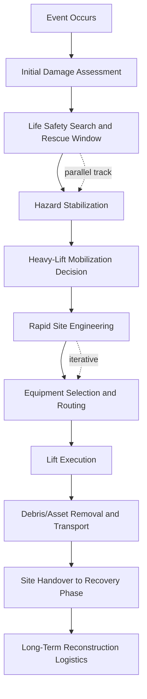
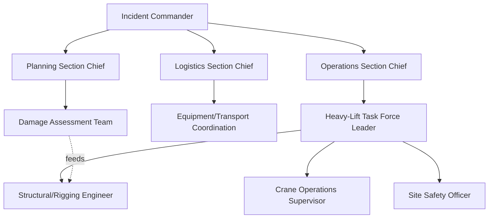

## Disaster Recovery and Emergency Heavy-Lift Response


### Overview

Disaster recovery and emergency heavy-lift response is the discipline of mobilizing cranes, specialized transport, rigging assets, and engineering judgment under compressed timelines, incomplete information, and degraded infrastructure. It differs fundamentally from planned heavy-lift operations: engineering that normally takes weeks (soil bearing analysis, structural surveys, permit acquisition) must be compressed into hours or days, often while the failure mechanism is still active (aftershocks, secondary collapse risk, fire, flooding) and while site access, power, and communications are unreliable.

The discipline spans natural disasters (earthquakes, hurricanes, floods, tsunamis), industrial catastrophes (refinery explosions, bridge collapses, building failures), and transportation incidents (grounded vessels, derailed freight, aircraft recovery). The unifying thread is that the lift plan must be developed against a moving target: loads may be unstable, unpredictably weighted (saturated with water, partially collapsed), or contaminated (chemical, biological, radiological).

**Key Points**

- Speed and safety are in direct tension; disaster response heavy-lift work has a disproportionately high incident rate compared to planned lifts
- The "recovery" phase is distinct from "response" — response stabilizes and removes immediate hazards; recovery restores function and rebuilds
- Command structure (typically ICS — Incident Command System — in the US, or equivalent) governs who can authorize a lift, not just engineering judgment
- Load data is frequently unknown or unreliable, forcing conservative "worst-case assumption" engineering
- Redundant capacity margins are non-negotiable given unknown-unknowns in the load state

### The Response Lifecycle

Emergency heavy-lift operations generally follow a recognizable sequence, even though real events compress or overlap these phases.



- **Initial Damage Assessment** — often via aerial/drone survey, satellite imagery, or first responders; establishes rough load geometry and site accessibility before any heavy equipment is committed.
- **Search and Rescue Window** (the "golden 72 hours" in structural collapse events) — heavy-lift decisions here prioritize controlled, incremental load removal over speed, since uncontrolled movement can crush survivors or trigger secondary collapse.
- **Hazard Stabilization** — shoring, cribbing, and temporary bracing precede any lift to prevent progressive collapse.
- **Mobilization Decision** — a go/no-go call balancing equipment availability, route access, and site bearing capacity.

### Rapid Engineering Assessment Under Uncertainty

Standard heavy-lift engineering (per ASME B30.5, B30.23, and related crane/rigging standards) assumes known load weight, known center of gravity, and known ground bearing capacity. Disaster response inverts this: none of these are reliably known at the outset.

**Practical mitigation techniques:**

- **Weight estimation via displacement/volume method** — for water-saturated debris, engineers estimate dry weight from as-built drawings or manufacturer data, then apply a saturation factor (commonly 1.2–1.5x for concrete/masonry debris, higher for absorbent materials) rather than attempting precise field measurement.
- **Load cell verification lifts** — a short "test lift" of a few centimeters using an integrated load cell on the hook confirms actual weight before full extraction, catching gross estimation errors before the load is airborne.
- **Conservative center-of-gravity assumption** — rigging is planned assuming the CG could be anywhere within the debris envelope, using multi-point rigging (4-point or greater) with load-sharing shackles rather than single-point picks.
- **Ground bearing via rapid plate load test or historical soil data** — full geotechnical borings are impractical; responders instead use portable plate bearing testers or pull soil classification from pre-event municipal GIS/soil survey databases.

[Inference] The saturation factor ranges cited above reflect common field-engineering heuristics used by heavy-lift and structural collapse specialists; exact factors are project- and material-specific and should be validated against site-specific testing where time permits.

### Equipment Classes for Emergency Response

| Equipment Class | Typical Role | Mobilization Characteristics |
| --- | --- | --- |
| All-Terrain Cranes (AT) | Rapid-deployment lifts on damaged/uneven terrain | Self-propelled highway travel, outrigger setup in confined spaces, capacities typically 40–500+ tonnes |
| Rough-Terrain Cranes (RT) | Off-road debris fields, unpaved sites | Requires low-bed transport, superior traction and ground clearance |
| Crawler Cranes | Sustained heavy picks (bridge sections, collapsed structures) | Slow mobilization (days), but highest capacity and stability without outrigger dependency |
| Heavy-Haul SPMTs (Self-Propelled Modular Transporters) | Moving oversized/collapsed structural sections, damaged vessels | Modular — can be reconfigured on-site to match irregular load geometry |
| Military/Air-Mobile Cranes | Austere or inaccessible sites (post-hurricane islands, mountainous terrain) | Airlift-deployable, lower capacity, prioritized for speed over tonnage |
| Marine Heavy-Lift Vessels/Floating Cranes | Vessel salvage, offshore platform incidents, port infrastructure recovery | Long transit times but essential where land access is severed |

**Example**

Following a bridge span collapse, initial response typically uses two or more crawler cranes in tandem-lift configuration (synchronized dual-crane picks) to control the load without inducing torsional stress on a partially fractured girder, since a single-crane pick point would concentrate stress at the point of attachment.

### Tandem and Multi-Crane Lift Engineering in Disaster Contexts

Tandem lifts — already one of the higher-risk categories of planned heavy-lift work — carry elevated risk in disaster response because the load's structural integrity is often already compromised.

**Standard tandem-lift design margins are tightened further:**

- Load distribution assumptions shift from the typical 60/40 planned-lift allowance to worst-case 75/25 or greater, since damaged structures cannot be assumed to distribute weight evenly to rigging points.
- Synchronization is prioritized via radio-linked crane operators or a single signal person with sightlines to both cranes; asynchronous movement on a already-cracked structural member can propagate failure.
- A "controlled failure zone" is often designated — an exclusion perimeter sized to the potential swing/drop radius if a rigging point fails — before the lift begins.

$$W_{point} = W_{total} \times f_{distribution} \times f_{dynamic}$$

Where $f_{distribution}$ is the (often asymmetric) load-share factor per rigging point and $f_{dynamic}$ is an amplification factor (commonly 1.15–1.25 for planned lifts, frequently raised to 1.3–1.5 in emergency response) accounting for unpredictable dynamic loading from an unstable or damaged structure.

### Route and Access Logistics in Degraded Infrastructure

Heavy-haul transport to and from a disaster site faces obstacles absent in planned logistics: damaged bridges, debris-blocked roads, washed-out embankments, and loss of normal permitting authority.

**Route survey adaptations:**

- **Bridge load capacity re-verification** — a bridge's pre-event posted rating may no longer be valid after seismic or flood damage; engineers reassess before routing loads exceeding a conservative fraction (often 50%) of the original rating.
- **Emergency permitting** — many jurisdictions activate expedited or waived permitting under declared emergency status, but this shifts liability and engineering verification entirely onto the contractor.
- **Alternate mode staging** — when road access is severed, loads are staged via rail, barge, or airlift to the nearest viable point, then transloaded to heavy-haul trailers for final approach.
- **Real-time route reconnaissance** — drone or helicopter survey immediately ahead of a convoy move, since static route surveys become unreliable within hours in an active disaster zone (further collapses, flooding progression, debris shifting).

### Command Structure and Authorization

Unlike planned heavy-lift projects governed primarily by engineering sign-off, emergency response operates within a formal incident command structure.



- The **Site Safety Officer** holds stop-work authority independent of the chain of command — any single qualified safety observer can halt a lift regardless of operational pressure.
- The **Heavy-Lift Task Force Leader** typically requires sign-off from both the structural/rigging engineer and safety officer before a lift proceeds, even under time pressure from the Operations Section Chief.
- Multi-agency response (military, civilian contractors, mutual-aid crane operators from other regions) requires a unified lift plan format so crews unfamiliar with each other can execute safely together — many response frameworks standardize on a one-page "Critical Lift Plan" regardless of contractor origin.

### Case Study Patterns Across Event Types

**Earthquake structural collapse (e.g., building/parking structure pancake collapse)**

- Heavy-lift work is sequenced with void-space search operations; lifts proceed in small increments (often under 30 cm) with continuous monitoring for survivor sounds/movement before each subsequent lift stage.
- Secondary collapse risk from aftershocks requires continuous structural monitoring (tiltmeters, crack gauges) during lift operations, not just pre-lift assessment.

**Hurricane/flood debris and vessel recovery**

- Grounded vessels often require combined heavy-lift crane and pneumatic/hydraulic lift-bag systems (particularly for partially submerged loads) since crane capacity alone cannot account for suction and hydrodynamic resistance during extraction.
- Debris fields frequently contain hazardous materials (ruptured fuel tanks, chemical storage) requiring hazmat clearance before crane crews can approach — this often becomes the longest-duration bottleneck, exceeding the mechanical lift time itself.

**Industrial incident (refinery/plant explosion, bridge collapse)**

- Fire suppression and structural cooling frequently must be maintained concurrently with lift operations, requiring coordination between heavy-lift crews and fire/hazmat teams sharing the same physical space.
- Post-incident structural members often retain residual stress from the failure event; rigging engineers assume stored energy may release suddenly during lift (a known hazard pattern in collapsed steel structures), and plan attachment points and personnel positioning accordingly.

[Unverified] Specific incident response times and equipment deployment figures vary significantly by region, jurisdiction, and available mutual-aid agreements; general patterns above reflect commonly documented practice rather than universal standards.

### Structural and Rigging Risk Diagram



```
Emergency Multi-Point Rigging Configuration (svg_diagram)
```

<svg xmlns="http://www.w3.org/2000/svg" viewBox="0 0 700 420">
<text x="350" y="30" text-anchor="middle" font-size="18" font-weight="bold" fill="#1a1a1a">Emergency Multi-Point Rigging Configuration (svg_diagram)</text>

<circle cx="350" cy="70" r="10" fill="#333" />
<line x1="350" y1="80" x2="350" y2="110" stroke="#333" stroke-width="3" />

<rect x="230" y="110" width="240" height="14" fill="#555" />
<text x="350" y="105" text-anchor="middle" font-size="12" fill="#333">Spreader Bar (load equalization)</text>

<line x1="240" y1="124" x2="150" y2="230" stroke="#444" stroke-width="2" />
<line x1="290" y1="124" x2="230" y2="230" stroke="#444" stroke-width="2" />
<line x1="410" y1="124" x2="470" y2="230" stroke="#444" stroke-width="2" />
<line x1="460" y1="124" x2="550" y2="230" stroke="#444" stroke-width="2" />

<circle cx="150" cy="235" r="6" fill="#666" />
<circle cx="230" cy="235" r="6" fill="#666" />
<circle cx="470" cy="235" r="6" fill="#666" />
<circle cx="550" cy="235" r="6" fill="#666" />

<polygon points="100,240 600,240 580,340 130,350" fill="#c9b8a8" stroke="#7a6a5a" stroke-width="2" />
<text x="350" y="295" text-anchor="middle" font-size="13" fill="#3a2a1a">Damaged Structural Element</text>
<text x="350" y="315" text-anchor="middle" font-size="11" fill="#7a3a1a">Unknown CG — worst-case rigging assumed</text>

<line x1="320" y1="245" x2="340" y2="270" stroke="#a02020" stroke-width="2" stroke-dasharray="4,3" />
<line x1="340" y1="270" x2="325" y2="300" stroke="#a02020" stroke-width="2" stroke-dasharray="4,3" />
<text x="345" y="260" font-size="10" fill="#a02020">stress crack</text>

<ellipse cx="350" cy="300" rx="320" ry="100" fill="none" stroke="#c0392b" stroke-width="2" stroke-dasharray="8,5" />
<text x="350" y="405" text-anchor="middle" font-size="12" fill="#c0392b">Exclusion / Controlled Failure Zone</text>
</svg>

### Common Failure Modes in Emergency Heavy-Lift Operations

- **Underestimated load weight** — the single most common cause of overload incidents in disaster response, due to saturation, embedded debris, or incomplete as-built data.
- **Progressive/secondary collapse during lift** — removing one structural element shifts load paths onto adjacent damaged members not accounted for in the lift plan.
- **Ground failure under outriggers** — saturated or disturbed soil (common post-flood/earthquake) has significantly reduced bearing capacity compared to baseline soil surveys.
- **Communication breakdown in multi-agency operations** — differing terminology, signal conventions, or radio frequencies between military, civilian, and mutual-aid crews.
- **Fatigue-driven error** — extended shift lengths during sustained response operations are a well-documented contributor to incident rates; many response frameworks now mandate maximum continuous shift limits for crane operators and riggers.

**Conclusion**

Emergency heavy-lift response sits at the intersection of structural engineering, crane operations, incident command, and rapid-decision risk management. Its defining characteristic is not the equipment used — which largely mirrors planned heavy-lift fleets — but the compressed, uncertainty-laden engineering process wrapped around it. Success depends less on raw lifting capacity and more on disciplined conservative assumption-making, redundant verification (test lifts, load cells, real-time monitoring), and clear command authority that empowers safety officers to halt operations regardless of time pressure.

**Related Topics**

- Search and rescue heavy-lift coordination (USAR/urban search and rescue integration)
- Marine salvage and vessel righting operations
- Tandem and multi-crane lift engineering fundamentals
- Rapid geotechnical assessment methods for crane ground-bearing
- Incident Command System (ICS) structures for specialized contractor integration
- Hazmat-constrained rigging and lift operations
- Bridge and structural load rating reassessment after seismic/flood events
- SPMT (Self-Propelled Modular Transporter) reconfiguration for irregular loads
- Fatigue management and shift-limit policy in sustained emergency operations
- Post-incident structural residual stress and stored-energy hazards