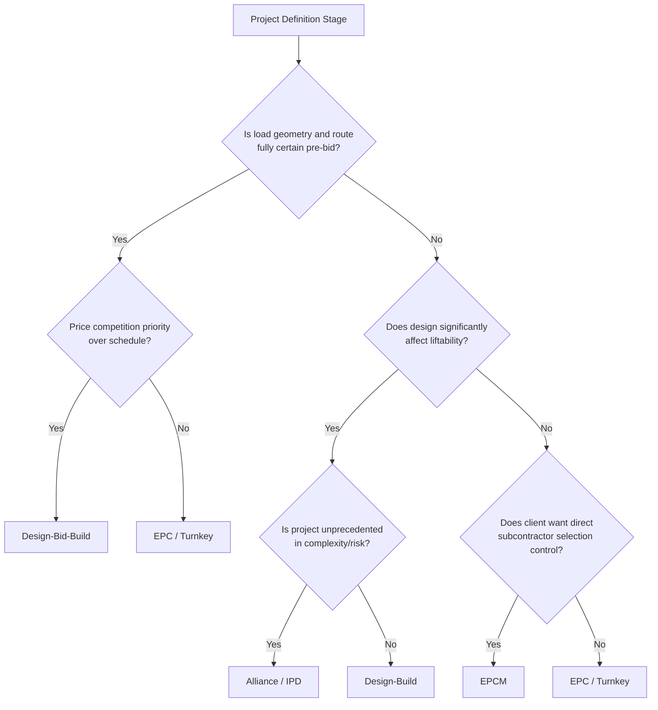

## Comparative Analysis of Project Execution Strategies


### Overview

Project execution strategy in heavy-lift and specialized logistics is the framework governing how a project is contractually structured, resourced, and sequenced from award through completion. The choice of strategy shapes risk allocation, engineering ownership, equipment procurement timing, and ultimately cost and schedule outcomes. Unlike general logistics, heavy-lift execution strategy decisions are disproportionately influenced by irreversible early commitments — crane and transport equipment often has multi-month lead times and cannot be easily reallocated once mobilized, making the upfront strategic choice higher-stakes than in most other logistics domains.

**Key Points**

- Execution strategy is chosen before detailed engineering is complete, based on project risk profile, client capability, and market conditions
- The core trade-off across all strategies is control versus risk transfer — more contractor control typically means more contractor risk (and higher price), and vice versa
- Heavy-lift-specific factors (route feasibility, equipment availability, single-point-of-failure lifts) weigh more heavily on strategy choice than in general freight logistics
- No single strategy is universally superior; selection depends on project complexity, schedule certainty, and client risk appetite

### Major Execution Strategy Models

**1. Engineering, Procurement, and Construction (EPC) / Turnkey**

A single contractor (or consortium) holds full responsibility for engineering, equipment procurement, and physical execution, typically under a lump-sum or fixed-price arrangement.

- **Risk allocation**: Contractor bears the majority of cost and schedule risk; client risk is largely limited to scope-change costs.
- **Heavy-lift application**: Common for large industrial module transport and installation (refinery modules, power plant components) where the EPC contractor controls both the fabrication yard and the transport/installation scope, minimizing interface risk between parties.
- **Advantage**: Single point of accountability; reduces coordination overhead between engineering, procurement, and execution teams.
- **Disadvantage**: Contractor pricing includes significant risk premium for heavy-lift-specific uncertainties (route surveys not yet complete at bid stage, permitting timelines, weather windows); client has less visibility into and control over route/method selection.

**2. Engineering, Procurement, and Construction Management (EPCM)**

The contractor manages engineering and procurement but does not directly execute construction/transport — physical work is subcontracted, typically to specialized heavy-lift operators, with the EPCM contractor acting as owner's agent.

- **Risk allocation**: Client retains more risk than under EPC, since the EPCM contractor is compensated for services (often cost-plus-fee) rather than guaranteeing outcomes.
- **Heavy-lift application**: Favored when the client wants direct selection of specialized heavy-lift subcontractors (e.g., choosing a specific marine heavy-lift operator based on vessel availability) rather than delegating that choice to a general EPC contractor.
- **Advantage**: Greater client control over critical subcontractor selection and method statements for high-risk lifts.
- **Disadvantage**: Client bears schedule and cost risk if heavy-lift subcontractors underperform; interface risk between multiple subcontractors falls to the client/EPCM team to manage.

**3. Design-Bid-Build (DBB) / Traditional Sequential**

Engineering is completed and fully defined before heavy-lift execution is competitively bid, with distinct, sequential phases.

- **Risk allocation**: Client bears design risk; heavy-lift contractor bears execution risk against a fixed, pre-defined scope.
- **Heavy-lift application**: Used where load geometry and site conditions are highly certain in advance (e.g., moving a known, fully engineered bridge girder along a pre-surveyed route) and price competition is prioritized over schedule compression.
- **Advantage**: Maximizes price competition since bidders price a fully defined scope with minimal ambiguity.
- **Disadvantage**: Slowest strategy overall due to sequential (non-overlapping) phases; heavy-lift contractor has no input into engineering decisions that affect liftability (rigging point placement, module weight distribution) since design is already frozen.

**4. Design-Build (DB)**

A single contractor holds both design and execution responsibility, allowing engineering to be developed with constructability/liftability in mind from the outset.

- **Risk allocation**: Contractor bears both design and execution risk, typically under a negotiated guaranteed maximum price (GMP) or lump sum.
- **Heavy-lift application**: Effective where early heavy-lift contractor involvement can meaningfully reduce cost (e.g., input on module weight limits, rigging point placement during structural design) — a load engineered without lift constraints in mind often costs significantly more to transport than one co-designed with the heavy-lift method in view.
- **Advantage**: Enables "design for liftability" — engineering decisions account for crane capacity, transport route constraints, and rigging feasibility from the start rather than retrofitting a lift plan to a fixed design.
- **Disadvantage**: Reduced price competition since design and execution aren't separately competed; client oversight of design decisions is comparatively reduced.

**5. Alliance / Integrated Project Delivery (IPD)**

Multiple parties (client, engineer, heavy-lift contractor, and often key subcontractors) share risk and reward under a single commercial framework, typically with a shared pain/gain mechanism tied to overall project outcomes.

- **Risk allocation**: Risk is pooled across parties rather than transferred to a single party; commercial incentives are aligned toward collective project success rather than individual contract performance.
- **Heavy-lift application**: Used on megaprojects with exceptional complexity or novel engineering challenges (first-of-a-kind lifts, offshore installation of unprecedented scale) where risk cannot be reliably priced by any single party in advance.
- **Advantage**: Encourages open disclosure of problems (no incentive to hide issues to avoid contractual penalty) and collaborative problem-solving on novel technical challenges.
- **Disadvantage**: Requires unusually high trust and sophisticated commercial structuring; not well-suited to price-sensitive, well-understood, repeatable lift scopes.

### Comparative Matrix

| Strategy | Design/Execution Overlap | Client Risk Exposure | Price Competitiveness | Best Fit for Heavy-Lift Context |
| --- | --- | --- | --- | --- |
| EPC / Turnkey | Low–Medium | Low | Medium | Repeatable module transport with well-understood routes |
| EPCM | Medium | Medium–High | Medium–High | Client wants control over specialized subcontractor choice |
| Design-Bid-Build | None (sequential) | Medium | High | Fully certain, pre-surveyed route and load geometry |
| Design-Build | High | Medium | Medium–Low | Novel structures where liftability should shape design |
| Alliance / IPD | Very High | Shared | Low | First-of-kind, high-complexity, high-uncertainty lifts |

### Selection Logic



### Case Comparison: Industrial Module Transport Project

**Example**

Consider a hypothetical (but representative) refinery expansion requiring transport and installation of 12 pre-fabricated process modules, each weighing 400–900 tonnes, moved via SPMT from a fabrication yard to final position.

- **Under EPC**: The EPC contractor controls both module fabrication and transport engineering, allowing rigging lug placement to be optimized during module design — commonly reducing the number of required lift points and simplifying SPMT loading configuration. Total price is fixed, but includes a risk premium (commonly cited in industry practice as 10–20% above best-estimate cost) for route and soil uncertainty not yet fully surveyed at contract signing.
- **Under EPCM**: The client separately selects a heavy-haul specialist based on specific SPMT fleet availability and experience with similar modules, potentially securing better technical fit, but assumes schedule risk if the fabrication yard (a separate contractor) delivers modules with as-built weights exceeding the engineered SPMT capacity.
- **Under Design-Bid-Build**: Module design is frozen before heavy-lift bidding begins; if as-built module weight exceeds the original design assumption (common in practice due to field modifications), the heavy-lift contractor may issue a variation order, since the route/equipment plan was priced against the original design weight.

[Inference] The 10–20% risk premium figure reflects commonly cited industry heuristics for EPC contracts involving route/soil uncertainty at signing; actual premiums vary substantially by project complexity, market conditions, and contractor risk appetite, and should not be treated as a fixed benchmark.

### Risk Allocation Spectrum



```
Execution Strategy Risk Spectrum (svg_diagram)
```

<svg xmlns="http://www.w3.org/2000/svg" viewBox="0 0 700 260">
<text x="350" y="28" text-anchor="middle" font-size="18" font-weight="bold" fill="#1a1a1a">Execution Strategy Risk Spectrum (svg_diagram)</text>
<line x1="60" y1="130" x2="640" y2="130" stroke="#333" stroke-width="3" />
<polygon points="640,130 625,122 625,138" fill="#333" />

<text x="60" y="115" font-size="12" fill="`#2a6a2a`" text-anchor="start">Client bears more risk</text>

<text x="640" y="115" font-size="12" fill="`#a02020`" text-anchor="end">Contractor bears more risk</text>


<circle cx="120" cy="130" r="7" fill="#2a6a2a" />
<text x="120" y="160" text-anchor="middle" font-size="12">DBB</text>
<circle cx="260" cy="130" r="7" fill="#4a7a4a" />
<text x="260" y="160" text-anchor="middle" font-size="12">Alliance/IPD</text>
<text x="260" y="176" text-anchor="middle" font-size="10" fill="#555">(shared, pooled)</text>
<circle cx="380" cy="130" r="7" fill="#8a7a3a" />
<text x="380" y="160" text-anchor="middle" font-size="12">EPCM</text>
<circle cx="500" cy="130" r="7" fill="#a05a2a" />
<text x="500" y="160" text-anchor="middle" font-size="12">Design-Build</text>
<circle cx="600" cy="130" r="7" fill="#a02020" />
<text x="600" y="160" text-anchor="middle" font-size="12">EPC / Turnkey</text>

<text x="350" y="220" text-anchor="middle" font-size="11" fill="#555">Note: Alliance/IPD sits off-axis — risk is pooled rather than</text>

<text x="350" y="236" text-anchor="middle" font-size="11" fill="#555">positioned on a single-party spectrum; shown here for reference only.</text>

</svg>

### Heavy-Lift-Specific Strategic Considerations

Beyond the general project delivery models above, several factors weigh more heavily in heavy-lift contexts than in typical construction or logistics procurement:

- **Equipment lead-time lock-in** — specialized crane or marine heavy-lift vessel booking often must occur before final engineering is complete, forcing early commercial commitment regardless of which delivery model is chosen; this compresses the practical difference between "sequential" and "overlapping" models in the equipment procurement dimension specifically.
- **Single-point-of-failure lift sequencing** — projects with one or a small number of critical, irreversible lifts (a single crane pick of a reactor vessel, for example) favor delivery models that maximize risk-sharing or contractor control over method statement development, since a failed critical lift has outsized cost/schedule consequences compared to distributed, repeatable lift scopes.
- **Route and permitting uncertainty** — in EPC/turnkey models, contractors frequently price significant contingency for permitting delays and route feasibility unknowns that cannot be fully resolved before contract signing; EPCM/client-controlled models allow permitting risk to be actively managed by the client's own regulatory relationships rather than passed through as contractor contingency.
- **Weather window dependency** — marine and outdoor heavy-lift operations are exposed to seasonal weather windows; strategies with longer sequential phases (DBB) risk missing weather windows between design completion and execution mobilization, a risk largely absent in general construction procurement decisions.

### Common Pitfalls in Strategy Selection

- **Selecting DBB for projects with significant load/route uncertainty** — locks in a lift method against a design that may not reflect as-built conditions, generating costly variation orders.
- **Selecting Design-Build without genuine heavy-lift contractor early involvement** — nominally "design-build" projects sometimes retain sequential engineering-then-execution workflows internally, forfeiting the liftability-optimization benefit the model is meant to provide.
- **Underestimating EPCM interface risk** — when multiple specialized subcontractors (fabricator, heavy-haul transporter, installation crane operator) interface directly, unclear responsibility boundaries at handoff points are a frequently cited source of schedule slippage.
- **Applying Alliance/IPD structures to well-understood, repeatable scopes** — the commercial complexity and trust requirements of alliance models are difficult to justify when risk is already well-priced by conventional means.

**Conclusion**

Execution strategy selection in heavy-lift logistics is fundamentally a risk allocation decision shaped by how well load characteristics, routes, and site conditions are understood before commercial commitment. EPC/turnkey and Design-Bid-Build sit at opposite ends of a risk-transfer spectrum suited to well-defined, repeatable scopes; Design-Build and Alliance/IPD models trade price competitiveness for the ability to co-develop engineering and execution in genuinely uncertain or first-of-kind projects. The heavy-lift-specific realities of long equipment lead times, irreversible critical lifts, and route/permitting uncertainty mean that strategy choice carries more schedule and cost consequence than in general construction or logistics procurement, making early, deliberate strategy selection — rather than default use of a familiar model — a material driver of project outcomes.

**Related Topics**

- Risk allocation frameworks and contingency pricing in heavy-lift contracts
- Method statement development and critical lift plan approval processes
- Equipment procurement lead-time management and fleet booking strategy
- Interface management in multi-subcontractor heavy-lift projects
- Constructability/liftability reviews during early-stage engineering
- Contract forms specific to heavy transport (FIDIC, NEC, and industry-specific frameworks)
- Weather window planning for marine and outdoor heavy-lift operations
- Variation order and change management in fixed-price heavy-lift contracts