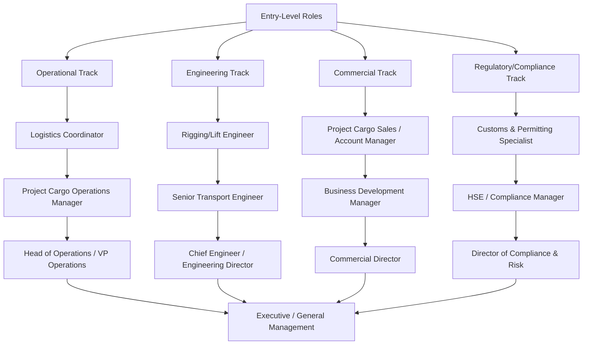

## Career Roles in Project Cargo and Heavy-Lift Logistics

<syllabot_broad_topic/>

### Overview

Project cargo and heavy-lift logistics is a specialized field within the broader supply chain and freight industry, distinguished by the scale, complexity, and engineering demands of the cargo handled — wind turbine components, refinery modules, transformers, yachts, aircraft sections, and military equipment, among others. Because a single shipment can involve multi-modal transport, custom engineering, regulatory navigation across jurisdictions, and multi-million-dollar liability exposure, the career roles supporting this work are more technically specialized and cross-disciplinary than in general freight forwarding.

Career paths in this field typically fall into four broad clusters: **operational/execution roles** (those who plan and physically move cargo), **engineering roles** (those who calculate loads, stresses, and rigging), **commercial roles** (those who sell, quote, and manage client relationships), and **regulatory/compliance roles** (those who manage permits, customs, and safety certification). Most practitioners move between these clusters over a career, since deep competence in one area (e.g., route engineering) is difficult without practical exposure to adjacent ones (e.g., commercial quoting or on-site operations).

**Key Points**

- Entry typically occurs via general freight forwarding, marine/maritime operations, mechanical/structural engineering, or military logistics backgrounds — there is no single standard entry pathway
- Certifications (rigging, crane operation, professional engineering licensure) become increasingly important for advancement into senior technical roles
- Field experience (time physically present during lifts and transport moves) is widely regarded as a prerequisite for credibility in senior planning and engineering roles, even for staff who later move to office-based planning
- Compensation and seniority scale strongly with the ability to independently sign off on lift plans and assume liability for method statements

### Career Role Taxonomy

### Operational and Execution Roles

**Logistics/Project Cargo Coordinator (Entry-Level)**

- Handles documentation, booking coordination, and communication between shippers, carriers, and receiving ports.
- Typically the first role for graduates entering the field, often from logistics, supply chain, or business backgrounds.
- Builds foundational knowledge of Incoterms, bill of lading types, and multi-modal booking processes specific to oversized/overweight cargo.

**Project Manager / Operations Manager**

- Owns end-to-end execution of a shipment or project — coordinating engineering, transport, customs, and on-site execution teams.
- Requires strong cross-functional coordination skill since project cargo moves rarely stay within a single mode or jurisdiction.
- Often holds or works toward project management certification (PMP or equivalent), though industry-specific experience is generally weighted more heavily than formal PM credentials.

**Site Superintendent / Field Operations Supervisor**

- Physically present during loading, transport, and offloading operations; the role with the most direct exposure to real-time risk and decision-making.
- Responsible for on-the-ground go/no-go decisions when field conditions diverge from the plan (weather, ground conditions, equipment issues).
- Frequently the most physically demanding and travel-intensive role in the field, and commonly viewed as a proving ground for later engineering or senior operations roles.

**Heavy-Haul Transport Manager / Fleet Manager**

- Manages the specialized trailer and prime mover fleet (SPMTs, modular trailers, extendable trailers) — scheduling, maintenance, and route allocation.
- Requires working knowledge of axle load distribution, trailer configuration options, and jurisdiction-specific weight/dimension regulations.

### Engineering Roles

**Rigging Engineer / Lift Engineer**

- Calculates load weights, center of gravity, sling angles, and crane capacity charts to produce method statements and lift plans.
- Typically requires a mechanical or structural engineering background; many practitioners also hold rigging-specific certifications (e.g., NCCCO — National Commission for the Certification of Crane Operators — rigger certifications in the US, or equivalent regional bodies).
- Entry point is often as a junior engineer supporting senior lift engineers on documentation and calculation checking before taking independent sign-off responsibility.

**Transport Engineer / Route Engineer**

- Conducts route surveys, bridge/culvert load analysis, and swept-path (turning radius) studies for oversized loads.
- Works closely with permitting specialists, since route feasibility and permit approval are tightly linked.
- [Inference] In many organizations, this role and the rigging engineer role are combined into a single "heavy transport engineer" position on small-to-mid-sized teams, with separation into distinct roles typically occurring only at larger firms or on the largest projects; role structures vary by company size and market.

**Structural/Marine Engineer (specialized)**

- For roles involving vessel loading (roll-on/roll-off, float-on/float-off operations) or barge transport, structural and naval architecture expertise is required to assess vessel stability and deck loading.
- Often requires formal licensure (Professional Engineer or equivalent regional certification) for sign-off authority on stability calculations.

**Chief Engineer / Engineering Director**

- Senior technical authority with final sign-off responsibility across a firm's project portfolio.
- Typically requires 15+ years of progressive experience and, in most jurisdictions, professional engineering licensure.
- Bears significant personal and organizational liability exposure, making this one of the most senior and compensated technical roles in the field.

### Commercial and Client-Facing Roles

**Project Cargo Sales Representative / Account Manager**

- Develops and manages client relationships, prepares commercial quotations, and coordinates with engineering/operations teams to price complex moves.
- Requires enough technical literacy to accurately scope a shipment's complexity during the sales process, even without hands-on engineering responsibility.

**Business Development Manager**

- Focuses on securing new project cargo contracts, often for large industrial clients (EPC contractors, energy companies, mining operators) with recurring heavy-lift needs.
- Success in this role depends heavily on industry relationships and reputation, given the high-trust, high-liability nature of heavy-lift contracting.

**Commercial Director / VP of Commercial**

- Sets pricing strategy, contract terms, and risk allocation policy across the firm's project cargo portfolio.
- Works closely with legal and engineering leadership to ensure commercial commitments align with what engineering can actually deliver within acceptable risk tolerances.

### Regulatory, Compliance, and Safety Roles

**Customs and Permitting Specialist**

- Manages the (often extensive) permitting process for oversized/overweight road, rail, and marine movements across multiple jurisdictions.
- Requires detailed knowledge of jurisdiction-specific regulations, which vary significantly by country, state/province, and even municipality.

**Health, Safety, and Environment (HSE) Manager**

- Oversees safety compliance across lift and transport operations, often holding authority to halt operations independent of commercial or schedule pressure.
- Frequently requires certification in occupational health and safety standards relevant to the region and modes of transport involved.

**Quality Assurance / Compliance Manager**

- Ensures conformance to industry standards (e.g., ASME B30 series for rigging/lifting equipment, ISO management system standards) and internal method statement approval processes.

### Typical Career Progression Pathways

| Starting Background | Common Entry Role | Typical Mid-Career Role | Potential Senior Role |
| --- | --- | --- | --- |
| Logistics/Supply Chain degree | Project Cargo Coordinator | Operations Manager | VP of Operations |
| Mechanical/Structural Engineering | Junior Rigging Engineer | Senior Lift/Transport Engineer | Chief Engineer |
| Military logistics/engineering | Field Operations Supervisor | Project Manager | Director of Operations |
| Maritime/Naval architecture | Marine Cargo Specialist | Marine Operations Engineer | Head of Marine Projects |
| Sales/Business background | Junior Account Manager | Business Development Manager | Commercial Director |
| Regulatory/legal background | Permitting Coordinator | Compliance Manager | Director of Compliance & Risk |

**Example**

A common progression pattern: a mechanical engineering graduate joins as a junior rigging engineer, spends 3–5 years developing lift plans under senior engineer supervision while gaining field exposure during execution, becomes an independently sign-off-authorized senior transport engineer after obtaining relevant certification/licensure, and after 10–15 years is positioned for chief engineer or engineering director roles — often having also spent time in a field operations capacity to build practical execution judgment that pure office-based engineering experience does not provide.

### Certifications and Credentials Relevant to Advancement

- **Rigging/crane certifications** (e.g., NCCCO in the US, or equivalent bodies such as LEEA — Lifting Equipment Engineers Association — in the UK/Europe) — relevant for both engineering and field operations roles.
- **Professional Engineer (PE) licensure or regional equivalent** — typically required for independent structural/lift sign-off authority in senior engineering roles.
- **Project Management Professional (PMP) or equivalent** — valued in operations/project management tracks, though generally supplementary to direct industry experience rather than a substitute for it.
- **Dangerous goods and hazmat certifications** — relevant for compliance and operations roles handling cargo with hazardous material classifications.
- **Naval architecture/marine engineering credentials** — relevant specifically for roles involving vessel-based transport and load-out operations.

[Unverified] Specific certification requirements and their relative weight in hiring/advancement decisions vary considerably by country, regulatory jurisdiction, and individual employer; the certifications listed reflect commonly referenced industry credentials rather than a universal requirement set.

### Skills That Transfer Across Roles

- **Load and weight literacy** — even commercial and regulatory roles benefit from being able to sanity-check engineering figures, since miscommunication between technical and non-technical staff is a recurring source of costly errors.
- **Cross-jurisdictional regulatory awareness** — relevant to engineering (route feasibility), commercial (accurate quoting), and compliance roles alike.
- **Risk communication** — clearly conveying technical risk to non-technical stakeholders (clients, executives) is a differentiator for advancement into senior and client-facing roles.
- **Field-to-office translation** — professionals who have worked in field roles bring practical judgment to office-based planning that is difficult to develop from desk-based experience alone, making field rotations a common (though not universal) feature of senior-track development programs.

**Conclusion**

Career pathways in project cargo and heavy-lift logistics are notably cross-disciplinary compared to general logistics careers, reflecting the field's blend of engineering precision, operational risk management, and complex commercial and regulatory navigation. While entry points vary widely — from logistics degrees to mechanical engineering to military service — progression toward senior roles consistently rewards practitioners who combine technical credibility (often via certification or licensure) with direct field exposure to real lift and transport operations. The absence of a single standardized entry pathway means the field remains accessible from multiple educational and professional backgrounds, but advancement to the most senior technical and leadership roles typically requires years of progressive, hands-on responsibility rather than credentials alone.

**Related Topics**

- Rigging and crane operator certification pathways (NCCCO, LEEA, and regional equivalents)
- Professional Engineer licensure requirements for lift plan sign-off authority
- Field-to-office career rotation models in heavy-lift organizations
- Commercial quoting and risk-based pricing for project cargo shipments
- Cross-jurisdictional permitting and customs compliance career specialization
- Marine and naval architecture career tracks within heavy-lift logistics
- Mentorship and technical sign-off authority progression in engineering tracks
- Industry associations and professional development bodies for project cargo professionals