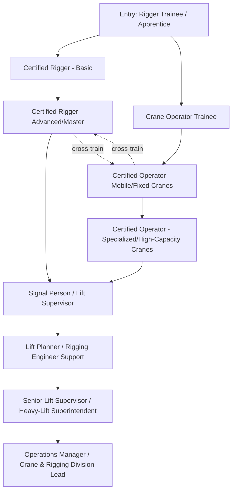

## Rigger and Crane Operator Career Progression

### Overview

Rigger and crane operator career progression is one of the most structured pathways in heavy-lift logistics, built around a formal ladder of certifications, supervised hours, and demonstrated competency at each successive lift complexity level. Unlike many logistics career tracks where advancement is judgment-based, progression in rigging and crane operation is heavily gated by third-party certification bodies and regulatory hour/experience requirements, reflecting the direct life-safety consequences of operator error.

The pathway generally bifurcates early into two related but distinct tracks — **rigging** (the science of attaching, slinging, and controlling the load) and **crane operation** (the mechanical operation of the lifting machine itself) — though many senior professionals hold competency and certification in both, since effective lift planning requires understanding both disciplines.

**Key Points**

- Progression is certification-gated: each level typically requires passing written and practical exams administered by accredited bodies, not simply time-in-role
- Rigging and crane operation are related but distinct skill sets, often certified separately even when performed by the same individual
- Logged hours/lifts at each capacity and complexity tier are commonly required before advancement to the next certification level
- Incident-free safety record is a de facto (and sometimes formal) prerequisite for advancement, particularly toward supervisory and signal-person authority
- Specialization (tower crane, mobile crane, marine crane, heavy-lift-specific rigging) typically occurs after achieving general competency, not before

### Career Ladder Structure

### Rigging Track Progression

**Rigger Trainee / Apprentice**

- Entry point, typically requiring no prior certification but often a basic safety orientation (e.g., OSHA 10/30-hour equivalent in the US, or regional equivalent).
- Works under direct supervision of a certified rigger; not authorized to independently select rigging configurations or direct lifts.
- Focus is on learning hardware (shackles, slings, spreader bars), hitch types, and basic load angle/sling tension concepts.

**Certified Rigger — Basic**

- Requires passing a written exam (covering rigging hardware ratings, sling angle calculations, hitch configurations) and a practical/performance exam demonstrating safe rigging of standard loads.
- In the US, commonly certified through bodies such as NCCCO (National Commission for the Certification of Crane Operators, which also certifies riggers) or NCCER (National Center for Construction Education and Research); other regions use equivalent bodies (e.g., LEEA in the UK/Europe, or national OH&S-linked certification schemes elsewhere).
- Authorized to independently rig standard, well-understood loads within defined weight/complexity limits.

**Certified Rigger — Advanced / Master Rigger**

- Requires substantially more logged rigging hours across a wider variety of load types (irregular loads, multi-crane picks, loads with unknown/uncertain center of gravity).
- Often includes competency in engineered lift calculations — reading and verifying rigging engineering drawings rather than only executing pre-engineered configurations.
- May include specialization certifications for niche rigging contexts: below-the-hook lifting devices, personnel lifting (rare and heavily regulated), or marine rigging.

[Inference] Exact certification body names, exam structures, and hour requirements vary substantially by country and regional regulatory framework; the bodies and structures referenced above (NCCCO, NCCER, LEEA) are commonly cited examples rather than a universal global standard, since crane/rigging certification is regulated at the national or sub-national level in most jurisdictions.

### Crane Operator Track Progression

**Crane Operator Trainee**

- Entry point; operates under direct supervision of a certified operator and does not yet hold independent operating authority.
- Builds foundational understanding of load charts, outrigger/counterweight configuration, and basic machine controls under close oversight.

**Certified Operator — Mobile/Fixed Cranes**

- Requires passing written exams (load chart interpretation, site set-up principles, safety regulations) and a practical operating exam on the specific crane category being certified (e.g., mobile telescopic boom, lattice boom crawler, tower crane — each often certified separately).
- Certification is frequently capacity- and/or type-specific rather than a single blanket "crane operator" credential — an operator certified on a mobile telescopic crane is not automatically certified to operate a crawler crane or tower crane without additional certification.

**Certified Operator — Specialized / High-Capacity Cranes**

- Progression into higher-capacity classes (typically several hundred tonnes and above) and specialized types (heavy-lift crawler cranes, marine/floating cranes, gantry systems).
- Often requires a minimum number of logged hours on lower-capacity equipment before an employer or certification body will support the individual sitting for high-capacity certification exams.
- Marine and offshore crane operation frequently requires additional certification layers addressing vessel motion compensation and offshore-specific safety protocols.

### Cross-Cutting Supervisory and Planning Roles

**Signal Person**

- Certified separately from both rigging and operating credentials in many jurisdictions; responsible for directing crane movements via standardized hand signals or radio communication when the operator's view of the load is obstructed.
- A common near-term advancement step for experienced riggers, since it builds directly on rigging floor experience while adding a distinct communication/authority skill set.

**Lift Supervisor / Lift Planner**

- Coordinates the overall lift plan, often working directly with rigging engineers to translate engineering calculations into field-executable rigging and crane configurations.
- Typically requires several years of combined rigging and/or operating experience, since credible lift planning depends on practical understanding of what is achievable in the field, not just theoretical calculation.
- May require or benefit from formal qualification in crane and rigging inspection, enabling the individual to also assess equipment condition and compliance before lifts.

**Senior Lift Supervisor / Heavy-Lift Superintendent**

- Oversees multiple simultaneous lift operations or an entire project's crane and rigging scope; holds ultimate field authority for lift execution decisions.
- Often the role with final sign-off authority for whether a lift proceeds under marginal conditions (weather, ground bearing uncertainty), making judgment developed through extensive field experience the primary qualifying factor, layered on top of formal certification.

**Crane & Rigging Division Lead / Operations Manager**

- Senior management role overseeing equipment fleet, operator/rigger staffing, training programs, and overall safety compliance across an organization's crane and rigging operations.
- Typically requires a blend of deep technical background (often having progressed through the rigger or operator track personally) and general management competency.

### Certification and Experience Requirements Comparison

| Level | Typical Prerequisite | Certification Type | Independent Authority |
| --- | --- | --- | --- |
| Trainee/Apprentice | None (basic safety orientation) | None (supervised) | No |
| Certified Rigger — Basic | Trainee period + written/practical exam | Third-party certification | Yes, within defined load limits |
| Certified Rigger — Advanced | Logged advanced-complexity hours | Third-party certification (higher tier) | Yes, including engineered lifts |
| Certified Operator — Standard | Trainee period + written/practical exam per crane type | Third-party, type-specific certification | Yes, for certified crane type/capacity |
| Certified Operator — High-Capacity | Logged hours on lower-capacity equipment | Third-party, capacity-tier certification | Yes, for certified capacity tier |
| Signal Person | Rigging or operating experience + separate exam | Third-party certification | Yes, for directing crane movement |
| Lift Supervisor/Planner | Combined rigging/operating experience (commonly 5+ years) | Often employer-driven, sometimes formal qualification | Yes, for lift plan development |
| Heavy-Lift Superintendent | Extensive field experience (commonly 10+ years) | Employer-driven; may hold multiple certifications | Yes, final field sign-off authority |

[Unverified] The specific years-of-experience figures shown above (5+, 10+) reflect commonly referenced industry norms rather than universally codified regulatory requirements; actual requirements vary by employer, jurisdiction, and specific certifying body.

### Specialization Pathways

Beyond the core vertical progression, experienced riggers and operators commonly branch into specialized niches:

- **Marine/offshore rigging and crane operation** — vessel-based lifts, floating crane operation, and offshore installation work; requires additional certification addressing motion compensation and marine safety protocols.
- **Tower crane specialization** — construction-focused, distinct skill set from mobile/crawler crane operation, often pursued as a dedicated career track rather than a rotation.
- **Heavy-lift engineered rigging** — focus on complex, multi-point, or tandem-lift configurations for oversized/overweight industrial loads; typically the domain of advanced/master riggers supporting rigging engineers.
- **Crane and rigging equipment inspection** — a parallel specialization focused on certifying equipment (wire rope, slings, hooks, crane structural components) rather than operating it; often pursued by experienced riggers/operators moving toward a quality/compliance-oriented role.
- **Training and assessment** — senior riggers/operators frequently transition into training roles, becoming certified assessors or instructors for the next generation of trainees.

**Example**

A representative 15-year progression: an individual enters as a rigger trainee, achieves basic rigger certification within the first one to two years, spends several years building diverse rigging experience while cross-training toward mobile crane operator certification, achieves signal person certification as a natural extension of rigging floor experience, transitions into lift supervisor responsibilities around year 8–10 after demonstrating consistent safe execution across increasingly complex lifts, and by year 15 holds heavy-lift superintendent responsibility overseeing multiple concurrent projects — having accumulated both rigging and crane operating certifications along the way, which is common among senior supervisory personnel even though the two tracks are formally distinct.

### Safety Record and Advancement

Unlike many career fields where advancement is driven primarily by tenure or demonstrated technical skill alone, rigging and crane operator progression places unusually heavy weight on documented safety performance:

- Incident-free operating/rigging history is frequently a stated or unstated prerequisite for advancement into signal person, supervisory, or planning roles, since these roles carry authority over others' safety.
- Near-miss reporting participation (rather than penalization) is increasingly emphasized in industry training programs as a positive indicator of safety judgment, on the reasoning that operators who proactively report near-misses demonstrate the situational awareness valued in supervisory roles.
- Many employers and certification bodies require periodic recertification (commonly every few years) rather than treating certification as a permanent, one-time credential, reflecting the perishable nature of both physical skill and awareness of evolving safety regulations.

**Conclusion**

Rigger and crane operator career progression is distinguished by its formality: advancement is gated by third-party certification, logged experience at defined complexity tiers, and — more than in most logistics careers — a demonstrated safety record, reflecting the direct life-safety stakes of the work. While rigging and crane operation begin as related but distinct tracks, most senior professionals in lift supervision and planning roles accumulate competency and certification across both disciplines over time, since effective senior judgment depends on understanding the full scope of what makes a lift safe and executable, not just one half of the equation.

**Related Topics**

- Rigging hardware inspection and below-the-hook lifting device certification
- Load chart interpretation and crane capacity calculation fundamentals
- Signal person communication standards and radio/hand-signal protocols
- Marine and offshore crane operation certification requirements
- Near-miss reporting culture and safety leading-indicator programs
- Tandem and multi-crane lift rigging configuration principles
- Crane and rigging equipment periodic inspection and recertification cycles
- Training and assessor pathways for experienced riggers and operators