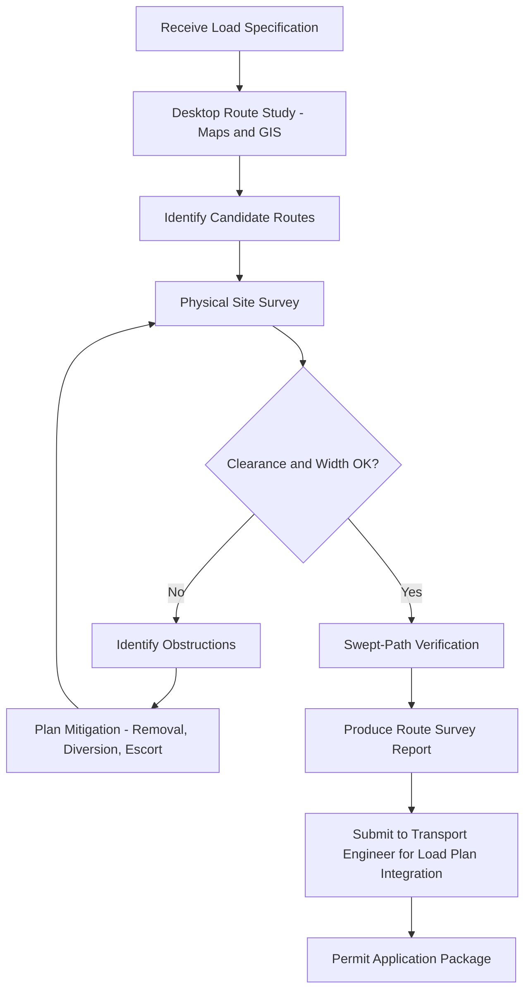

## Transport Engineer and Route Surveyor Career Paths

### Overview

Transport engineers and route surveyors form the technical backbone of heavy-lift and abnormal load logistics, responsible for determining whether a given cargo can physically and legally move from origin to destination, and for designing the specific path it will follow. These two roles are distinct but tightly coupled: the transport engineer handles the engineering analysis (loads, stresses, vehicle configuration, structural capacity), while the route surveyor handles the physical and geometric feasibility of the path itself (clearances, swept-path geometry, obstacles, infrastructure limits). In smaller organizations, one person may perform both functions; in larger heavy-haul firms, they are separate career tracks that intersect constantly.

### Role Definitions

**Transport Engineer**

- Designs and validates the engineering solution for moving abnormal or heavy-indivisible loads
- Performs load calculations, axle weight distribution, and trailer/prime-mover configuration selection
- Analyzes structural capacity of bridges, culverts, and pavements against imposed loads
- Produces engineering certificates, method statements, and lift/transport plans
- Works closely with structural engineers on bridge assessments and temporary works (e.g., trestles, steel plating)

**Route Surveyor**

- Physically surveys the proposed route for geometric and clearance constraints
- Measures overhead clearances (bridges, power lines, signage, canopies), width restrictions (traffic islands, roundabouts, pinch points), and turning radii
- Documents obstacles requiring removal, relocation, or temporary modification (traffic lights, street furniture, overhead cables)
- Produces route survey reports, swept-path diagrams, and photographic/video route records
- Coordinates with utility companies and local authorities on obstruction removal

### Core Technical Competencies

**Transport Engineer**

- Vehicle dynamics and axle load distribution calculations
- Bridge and culvert load rating assessment (or interpretation of assessments from structural engineers)
- Modular trailer configuration (SPMT axle line selection, hydraulic load equalization)
- Permit application engineering justification (weight/dimension exemption technical backup)
- Understanding of relevant vehicle regulations (e.g., STGO categories in the UK, oversize/overweight permit frameworks elsewhere)

**Route Surveyor**

- Swept-path analysis software (AutoTrack, Vehicle Tracking within AutoCAD/Civil 3D)
- GPS/GNSS survey equipment and mapping tools
- Interpretation of highway drawings, as-built plans, and utility maps
- Manual clearance measurement techniques (laser rangefinders, clearance poles)
- GIS-based route planning and constraint mapping

### Typical Career Progression

**Route Surveyor Track**

1. **Junior/Trainee Route Surveyor** — assists on site surveys, learns measurement techniques and reporting formats, typically 0–2 years
2. **Route Surveyor** — independently surveys and documents routes, produces survey packs, 2–5 years
3. **Senior Route Surveyor** — manages complex multi-route surveys, mentors juniors, liaises directly with authorities and utility providers, 5–8 years
4. **Route Survey Manager / Lead Surveyor** — oversees survey teams and standards across a region or business unit, 8+ years

**Transport Engineer Track**

1. **Graduate/Junior Transport Engineer** — supports load calculations and documentation under supervision, often holds a civil/mechanical/transport engineering degree, 0–2 years
2. **Transport Engineer** — independently produces transport plans and engineering certificates, 2–6 years
3. **Senior Transport Engineer** — leads engineering on complex/critical lifts (large SPMT moves, multi-piece structural transports), 6–10 years
4. **Principal Engineer / Engineering Manager** — sets technical standards, approves high-risk transport plans, manages engineering teams, 10+ years

Both tracks can converge into roles such as **Operations Director**, **Head of Engineering**, or independent **Heavy Transport Consultant**.

### Entry Requirements and Qualifications

**Educational Background**

- Transport Engineer: degree in civil, mechanical, structural, or transport engineering is common though not always mandatory; some enter via a technician pathway with relevant HNC/HND-level qualifications
- Route Surveyor: background in surveying, civil engineering technician training, or highways/traffic engineering; some enter directly from driving/escort roles with strong route knowledge

**Professional Certifications** [region-dependent — refer to local regulatory bodies for specifics]

- Chartered status through relevant engineering institutions (e.g., ICE, IMechE in the UK) for senior transport engineering roles
- CAD/swept-path software certifications (vendor-provided, e.g., AutoTrack training)
- Traffic management and street works qualifications (often required to work on public highways, e.g., NRSWA in the UK)
- Escort/pilot vehicle operator certification is common as a complementary or prerequisite skill

**Practical Prerequisites**

- Valid driving license, frequently including LGV/HGV categories for surveyors who drive escort or survey vehicles
- Familiarity with permit and notification processes for abnormal loads in the relevant jurisdiction
- Site safety certifications appropriate to construction/highway environments

### Day-to-Day Responsibilities Comparison

| Aspect | Transport Engineer | Route Surveyor |
| --- | --- | --- |
| Primary output | Engineering certificates, transport/lift plans | Route survey reports, clearance data |
| Tools | Load calculation software, structural analysis tools | Swept-path software, GPS/laser survey tools |
| Field time | Moderate (bridge inspections, load verification) | High (physical route driving/walking) |
| Key stakeholders | Structural engineers, permit authorities | Local councils, utility companies, police/escort services |
| Risk focus | Structural failure, overload | Collision, clearance strike, obstruction |

### Route Survey Workflow

### Key Skills for Career Advancement

**Key Points**

- Cross-disciplinary fluency: senior professionals in both tracks understand enough of the other's discipline to communicate effectively — a transport engineer who understands survey constraints avoids designing an unroutable load configuration
- Regulatory literacy: deep familiarity with permit regimes, notification periods, and authority approval processes is a major differentiator at senior levels
- Stakeholder management: senior surveyors and engineers spend significant time negotiating with councils, utilities, and police, making communication and negotiation skills as valuable as technical skill
- Software proficiency: modern route surveying is increasingly digital, with drone-based surveys, LiDAR clearance capture, and GIS integration becoming standard rather than optional
- Risk assessment judgment: distinguishing a genuinely blocking constraint from one that is manageable with mitigation is a skill developed primarily through field experience

### Emerging Tools and Technology Trends

- **LiDAR and drone survey**: increasingly used to capture clearance data (bridge heights, overhead line sag) more precisely and safely than manual pole measurement
- **Digital twin route models**: some heavy-haul firms are building persistent 3D route databases that are updated survey-by-survey rather than resurveyed from scratch each time
- **Automated swept-path/permit integration**: software that links swept-path analysis directly to permit application systems, reducing manual re-entry of route data [Inference: adoption varies significantly by region and company size, as this integration is not yet a universal industry standard]
- **Telematics-based post-move validation**: GPS logging of actual vehicle path during the move, compared against the planned swept path, used increasingly for compliance records and insurance purposes

### Example Career Path Narrative

**Example**

A graduate joins a heavy-haul contractor as a Junior Route Surveyor, spending the first year shadowing senior surveyors on site visits, learning to use clearance poles and laser rangefinders, and drafting basic survey reports. Over the next three years, they take ownership of full route surveys independently, gain AutoTrack certification, and begin handling relationships with local highway authorities directly. By year six, they are leading surveys for multi-piece wind turbine transport projects, mentoring two junior surveyors, and beginning to cross-train in transport engineering fundamentals — eventually moving into a hybrid Senior Route Surveyor/Transport Engineer role that oversees both survey and engineering sign-off for a regional business unit.

### Common Challenges in These Careers

- Balancing engineering rigor against commercial pressure to approve tight-margin routes
- Managing liability exposure when survey data becomes outdated between survey date and actual move date (seasonal vegetation growth, temporary roadworks, construction cranes)
- Coordinating multi-party permission chains where a single route may cross several local authority jurisdictions with differing requirements
- Keeping pace with regulatory changes across multiple jurisdictions for firms operating internationally

### Related Topics

- Abnormal Load Permit Application Processes
- Swept-Path Analysis Software Fundamentals (AutoTrack/Vehicle Tracking)
- Bridge and Structure Load Rating for Heavy Transport
- SPMT (Self-Propelled Modular Transporter) Configuration and Operation
- Escort and Pilot Vehicle Operations
- STGO and International Abnormal Load Regulatory Frameworks
- GIS and Digital Route Planning Systems
- Stakeholder Management with Highway Authorities and Utility Companies