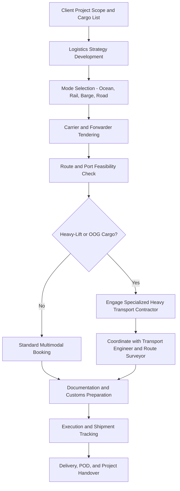

## Project Cargo Manager and Freight Forwarder Roles

<syllabot_broad_topic/>

### Overview

Project cargo managers and freight forwarders occupy the commercial and logistical coordination layer of heavy-lift and specialized logistics, sitting between the client's project requirements and the physical execution performed by transport engineers, route surveyors, riggers, and carriers. While transport engineers and surveyors answer "can this load physically move on this route," project cargo managers and freight forwarders answer "how do we get this cargo from factory to site, on time, on budget, and through every regulatory and contractual step in between." These roles are central to EPC (Engineering, Procurement, Construction) projects, oil and gas, renewable energy, mining, and power generation logistics.

### Role Definitions

**Project Cargo Manager**

- Owns end-to-end logistics strategy for a specific project or portfolio of shipments
- Coordinates multiple transport modes (ocean, barge, rail, road, air) into a single integrated plan
- Manages the interface between client, EPC contractor, carriers, and specialized transport subcontractors
- Responsible for schedule integrity, cost control, and risk management across the full cargo journey
- Often embedded within an EPC project team rather than a pure logistics provider

**Freight Forwarder (Project/Heavy-Lift Specialization)**

- Acts as an intermediary arranging carriage of goods on behalf of a shipper, without necessarily owning transport assets
- Books vessel space, negotiates carrier rates, and manages documentation (bills of lading, customs paperwork, letters of credit compliance)
- For project cargo specifically, coordinates breakbulk and heavy-lift vessel bookings, out-of-gauge (OOG) cargo handling, and port operations
- Manages customs clearance, insurance arrangements, and multimodal handoffs
- May operate as an independent forwarder, part of a global logistics network, or as an in-house function within a larger contractor

### Core Distinctions Between the Roles

| Aspect | Project Cargo Manager | Freight Forwarder |
| --- | --- | --- |
| Employer type | Typically EPC contractor, owner/operator, or dedicated project logistics firm | Freight forwarding company, logistics network, or in-house forwarding team |
| Scope | Full project lifecycle logistics strategy | Specific shipment/booking execution |
| Asset ownership | Rarely owns transport assets | Rarely owns assets, but manages carrier relationships directly |
| Client relationship | Direct, ongoing, embedded in project | Transactional or contractual, shipment-by-shipment or contract-based |
| Risk exposure | Project schedule and budget overall | Individual shipment liability, customs compliance, documentation accuracy |

In practice, these roles frequently overlap, and many professionals move between them over a career — a freight forwarder specializing in project cargo may transition into a project cargo manager role once they gain enough end-to-end project exposure.

### Core Technical Competencies

**Project Cargo Manager**

- Multimodal logistics planning (ocean freight, barge, rail, heavy-haul road)
- Incoterms application and contractual risk allocation
- Schedule integration with EPC project timelines (critical path awareness)
- Vendor and subcontractor management (carriers, forwarders, port agents, heavy transport contractors)
- Budget and cost control across a multi-shipment program
- Risk and insurance management (marine cargo insurance, delay-in-startup considerations)

**Freight Forwarder**

- Ocean freight booking and breakbulk/heavy-lift vessel chartering knowledge
- Customs documentation and compliance (import/export regulations, tariff classification)
- Bill of lading types and their legal implications (straight, order, sea waybill)
- Port operations knowledge (crane capacities, quay strength, storage/laydown constraints)
- Letter of credit and trade finance documentation
- Out-of-gauge (OOG) and breakbulk cargo handling procedures

### Typical Career Progression

**Freight Forwarder Track**

1. **Freight Forwarding Coordinator/Operator** — handles booking, documentation, and shipment tracking under supervision, 0–2 years
2. **Freight Forwarder / Project Forwarding Specialist** — independently manages shipments, begins specializing in breakbulk/project cargo, 2–5 years
3. **Senior Freight Forwarder / Project Logistics Coordinator** — manages complex multi-leg project shipments, mentors juniors, 5–8 years
4. **Branch Manager / Regional Project Logistics Manager** — oversees forwarding operations for a region or major account, 8+ years

**Project Cargo Manager Track**

1. **Logistics Coordinator/Analyst** — supports project logistics planning, tracks shipments, compiles reports, 0–3 years
2. **Project Cargo Manager (Junior/Assistant)** — manages logistics for a defined scope or sub-project, 3–6 years
3. **Senior Project Cargo Manager** — owns full project logistics strategy for major capital projects, 6–10 years
4. **Head of Project Logistics / Logistics Director** — sets logistics strategy across a company's project portfolio, manages teams, negotiates master service agreements, 10+ years

### Entry Requirements and Qualifications

**Educational Background**

- Common entry degrees include supply chain management, logistics, international business, or engineering
- Many professionals enter via operational roles (forwarding coordinator, customs clerk) without a directly relevant degree and build expertise on the job

**Professional Certifications** [region-dependent — refer to local industry bodies for specifics]

- FIATA-recognized freight forwarding qualifications (international)
- Chartered logistics/transport body membership (e.g., CILT — Chartered Institute of Logistics and Transport)
- Customs brokerage certification where applicable to the jurisdiction
- Incoterms and trade documentation training (frequently offered by ICC or logistics associations)
- Dangerous goods handling certification (IMDG Code for sea, IATA DGR for air) where relevant to cargo type

**Practical Prerequisites**

- Strong contractual literacy (Incoterms, charter party agreements, subcontract terms)
- Familiarity with project cargo-specific documentation beyond standard containerized freight
- Cross-cultural and multi-jurisdictional communication skills for international project work

### Project Cargo Logistics Workflow

### Key Skills for Career Advancement

**Key Points**

- Commercial acumen matters as much as logistics knowledge: negotiating carrier rates, managing claims, and controlling project budgets are core to senior roles
- Documentation precision is critical — errors in bills of lading, customs declarations, or letters of credit can delay shipments by weeks and create significant financial exposure
- Cross-functional coordination skill is a major differentiator; senior project cargo managers effectively function as project managers whose deliverable happens to be logistics
- Understanding of technical transport constraints (even without being a transport engineer) allows better early-stage planning and avoids late-stage routing surprises
- Crisis management experience — port congestion, vessel delays, customs holds, route obstruction — is often what separates senior professionals from mid-level ones, since project cargo rarely moves exactly to plan

### Example Career Path Narrative

**Example**

An analyst joins a global freight forwarding company as a Logistics Coordinator, handling documentation for containerized shipments. After eighteen months, they move into the company's project cargo division, learning breakbulk vessel booking and OOG cargo procedures on an LNG plant construction project. Over the next four years, they take ownership of increasingly complex shipments — eventually managing the full ocean-to-site logistics chain for a wind farm component delivery, coordinating directly with the client's project cargo manager, a heavy-haul road contractor, and port authorities in three countries. Recognizing the client-side role offers broader strategic scope, they move into an in-house Project Cargo Manager position with an EPC contractor, where they now own logistics strategy for an entire capital project rather than individual shipments.

### Common Challenges in These Roles

- Schedule risk cascading from a single delayed shipment through an entire project's critical path
- Reconciling commercial pressure to minimize freight cost against risk exposure from cheaper but less reliable routing or carriers
- Navigating inconsistent regulatory and customs regimes across multiple countries within a single project
- Managing the handoff risk between logistics providers at multimodal transfer points (port to rail, rail to heavy-haul road)
- Insurance and liability disputes when cargo damage occurs during a multi-party transport chain, where fault attribution can be contested [Inference: dispute frequency and resolution complexity vary significantly by contract terms and jurisdiction]

### Related Topics

- Incoterms and Risk Allocation in Project Cargo Contracts
- Breakbulk and Out-of-Gauge (OOG) Vessel Chartering
- Marine Cargo Insurance for Heavy-Lift Shipments
- Multimodal Transport Coordination (Ocean-Rail-Road Integration)
- Customs Documentation and Compliance for Project Cargo
- Port Operations and Heavy-Lift Crane Capacity Assessment
- EPC Project Logistics Integration and Critical Path Management
- Dangerous Goods and Specialized Cargo Handling Regulations