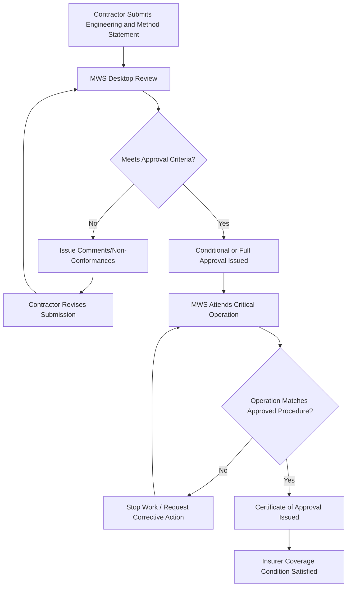

## Marine Warranty Surveyor Career Development

### Overview

Marine Warranty Surveyors (MWS) occupy a distinctive and highly specialized position within heavy-lift and specialized logistics: they act as independent technical approvers on behalf of cargo underwriters, rather than as employees of the shipper, carrier, or engineering contractor. Their approval is typically a condition of insurance coverage for marine transportation, offshore installation, and heavy-lift operations — without MWS sign-off, insurers may decline to cover the operation, making the role a de facto gatekeeper for high-value project cargo and offshore work. This independence from the operational chain of command is central to the role's professional identity and career trajectory.

### Role Definition and Function

**Marine Warranty Surveyor**

- Reviews and approves engineering plans, method statements, and procedures for marine transport, lifting, and installation operations on behalf of the cargo/hull underwriter
- Attends critical operations in person (load-out, sea-fastening, offshore lifts, float-overs) to verify compliance with approved procedures
- Issues Certificates of Approval, which insurers treat as a condition precedent to coverage for the insured operation
- Reviews weather routing, voyage planning, and seafastening/lashing calculations independently of the contractor's own engineering
- Functions as the insurer's technical eyes on the operation, distinct from classification society surveyors (who verify vessel condition against class rules) and from the contractor's own quality/engineering staff

### Distinguishing MWS from Adjacent Roles

| Aspect | Marine Warranty Surveyor | Transport Engineer | Classification Surveyor |
| --- | --- | --- | --- |
| Employer | Independent surveying firm, engaged by/on behalf of insurer | Transport contractor or EPC firm | Classification society (e.g., DNV, ABS, Lloyd's Register) |
| Primary duty | Insurer's risk approval | Client's operational solution | Vessel/structure compliance with class rules |
| Independence | Must be independent of contractor's chain of command | Part of delivery team | Independent, but focused on vessel/structure standards |
| Output | Certificate of Approval (condition of insurance) | Transport/lift plan, engineering certificate | Class certificate, survey report |

This independence requirement is a defining professional characteristic: an MWS who has financial or reporting ties to the contractor being surveyed creates a conflict of interest that undermines the entire function of the role.

### Core Technical Competencies

- Marine engineering and naval architecture fundamentals (stability, seakeeping, structural strength)
- Seafastening and lashing calculation review (grillage design, sea-fastening structural adequacy)
- Heavy-lift and rigging engineering assessment (crane capacity, rigging arrangements, lift point verification)
- Weather routing and voyage planning review, including seasonal weather window analysis
- Offshore installation methods (float-over, single-lift, module installation, pipelay operations)
- Barge and vessel motion analysis (roll/pitch criteria for cargo securing)
- Familiarity with relevant industry guidelines (e.g., Noble Denton/DNV Marine Warranty Survey guidelines, which form the de facto global standard framework for MWS scope of work)

### Typical Career Progression

1. **Marine/Naval Architecture Background (Pre-MWS)** — most entrants come from prior careers as marine engineers, naval architects, master mariners, or offshore engineers, typically 5–10+ years of prior sea-going or design experience before entering MWS work specifically
2. **Junior/Trainee Marine Warranty Surveyor** — works under supervision of a senior surveyor, attends operations as an observer, reviews straightforward transport approvals, 1–3 years
3. **Marine Warranty Surveyor** — independently reviews and approves standard marine transport and installation operations, 3–7 years
4. **Senior Marine Warranty Surveyor** — handles complex/high-value operations (major offshore installations, first-of-kind lift methodologies, complex float-overs), 7–12 years
5. **Principal Surveyor / Technical Manager** — sets technical standards within a surveying firm, reviews and mentors other surveyors, handles the most contentious or novel approval cases, 12+ years
6. **Independent Consultant / Surveying Firm Principal** — many senior MWS professionals eventually operate independently or found boutique surveying practices

### Entry Requirements and Qualifications

**Educational Background**

- Degree in naval architecture, marine engineering, or a closely related discipline is the most common foundation
- Master Mariner qualification (unlimited command) is a common alternative entry path, particularly valuable for the operational/seamanship judgment it provides

**Professional Certifications** [organization- and region-dependent — verify against current requirements from relevant bodies]

- Membership/certification through recognized marine warranty surveying bodies or classification societies offering MWS accreditation
- Chartered status through a relevant engineering or marine institution (e.g., IMarEST — Institute of Marine Engineering, Science and Technology)
- Formal training aligned with Noble Denton/DNV MWS guidelines is frequently required or strongly preferred by employing surveying firms

**Practical Prerequisites**

- Significant prior hands-on experience is effectively mandatory — MWS is rarely an entry-level career, and firms typically require substantial marine, offshore, or heavy-lift engineering experience before considering candidates
- Willingness to travel extensively and work at short notice, since operations requiring MWS attendance (weather windows, vessel schedules) do not always align with convenient planning

### Marine Warranty Approval Workflow

### Key Skills for Career Advancement

**Key Points**

- Independent technical judgment is the core professional asset — an MWS's value to the insurer rests entirely on their willingness to reject inadequate engineering even under commercial or schedule pressure from the contractor
- Broad marine and offshore engineering knowledge across multiple operation types (transport, lifting, installation, subsea) is more valuable than deep specialization in only one, since senior MWS work spans varied operation types
- Clear, defensible technical documentation is essential, since Certificates of Approval and survey reports may be scrutinized in insurance claims or disputes after the fact
- Reputation and track record matter significantly in this field — surveying firms and insurers build long-term relationships with individual surveyors whose judgment they trust
- Comfort with schedule unpredictability and field conditions (working at height, in confined spaces, in offshore or port environments, often on short notice) is a practical requirement throughout the career, not just at entry level

### Example Career Path Narrative

**Example**

A naval architecture graduate spends seven years at a shipyard, then five years as a project engineer for an offshore installation contractor, gaining hands-on experience with float-over installations and heavy-lift seafastening design. At thirty-five, they join a marine warranty surveying firm as a Junior Surveyor, initially shadowing senior surveyors on routine barge transport approvals. Within three years they are independently approving standard cargo transport and lift operations. Over the following decade, their reputation for rigorous, defensible reviews leads to assignments on increasingly complex first-of-kind operations — a novel single-lift platform installation, then a major float-over project — eventually becoming a Senior Surveyor trusted with the firm's most technically demanding approvals, and later a Principal Surveyor mentoring the next generation of MWS professionals.

### Common Challenges in This Career

- Managing the inherent tension between independence and commercial pressure, since contractors and clients often want fast approvals while the MWS's duty is to the insurer's risk standard
- Making sound judgment calls on genuinely novel operations where no established precedent or guideline directly applies
- Sustaining a career that often requires extensive travel and irregular schedules driven by weather windows and vessel availability
- Navigating liability and reputational exposure when an approved operation later results in a loss, even where the approval itself was technically sound [Inference: the degree of liability exposure for individual surveyors versus their employing firm varies by jurisdiction and contract structure]
- Keeping current across a wide range of evolving operation types as offshore wind, subsea, and other emerging sectors introduce new lift and installation methodologies

### Related Topics

- Noble Denton/DNV Marine Warranty Survey Guidelines and Scope of Work
- Seafastening and Lashing Engineering Calculations
- Float-Over Installation Methodology
- Classification Society Surveys vs. Marine Warranty Surveys
- Weather Routing and Voyage Planning for Heavy-Lift Transport
- Cargo and Hull Insurance Fundamentals for Project Logistics
- Offshore Wind Installation Career Pathways
- Rigging and Lift Plan Engineering Review