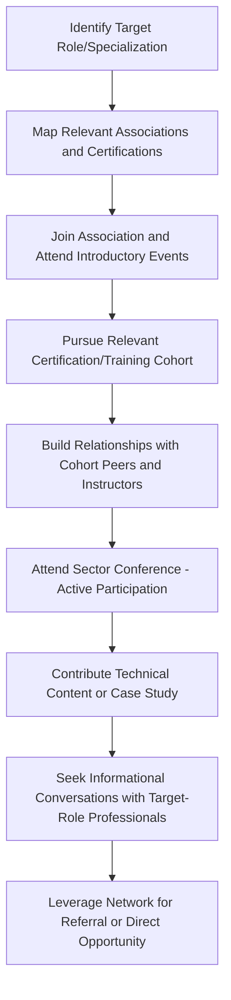

## Building a Professional Network in the Industry

### Overview

Professional networking within heavy-lift and specialized logistics carries particular weight because the industry is small, relationship-driven, and highly reputation-sensitive relative to many other engineering and logistics sectors. Complex projects require trust across organizational boundaries — a transport engineer's calculations must be trusted by a marine warranty surveyor, a route surveyor's data must be trusted by a project cargo manager, and a freight forwarder's carrier relationships determine whether a shipment moves on schedule. Building a professional network in this space is therefore not a peripheral career activity but a core mechanism through which work, credibility, and career progression actually happen.

### Why Networking Functions Differently in This Industry

- **Small talent pool**: heavy-lift, project cargo, and marine warranty surveying are niche specializations with a limited global pool of experienced professionals, meaning reputations travel quickly and repeat encounters across companies and projects are common
- **Project-based work structures**: many professionals work across multiple contractors, EPC firms, and surveying bodies over a career, making cross-company relationships more durable and consequential than in industries with more rigid organizational boundaries
- **Trust-dependent technical approvals**: roles like marine warranty surveyor depend explicitly on independent trust between parties, and reputational standing directly affects how quickly approvals move and how contentious disputes become
- **Regulatory and authority relationships**: route surveyors and project cargo managers routinely rely on established relationships with local authorities, port operators, and utility companies to expedite permits and obstruction removal

### Core Channels for Professional Network Building

**Industry Associations and Chartered Bodies**

- Chartered Institute of Logistics and Transport (CILT) and similar national/regional bodies
- Institute of Marine Engineering, Science and Technology (IMarEST) for marine and offshore-focused professionals
- Specialized Carriers & Rigging Association (SC&RA) and similar heavy-lift/rigging-focused associations
- FIATA and regional freight forwarding associations for project cargo and forwarding professionals

**Trade Conferences and Events**

- Sector-specific conferences (e.g., Breakbulk events, heavy-lift and project cargo conferences) that bring together transport engineers, forwarders, surveyors, and carriers in a concentrated setting
- Regional infrastructure and energy project conferences where project cargo logistics intersects with broader industry stakeholders
- Technical seminars hosted by classification societies or engineering institutions on lifting, marine transport, or offshore installation topics

**Professional Certifications as Network Entry Points**

- Certification courses (swept-path software training, marine warranty survey guideline training, dangerous goods certification) frequently double as networking opportunities, since cohorts often include peers from competing or complementary firms
- Chartered engineer status processes typically involve mentorship and sponsor relationships that persist well beyond the certification itself

**Online and Digital Channels**

- LinkedIn groups and forums specific to heavy-lift, project cargo, and marine warranty surveying
- Technical publications and case study platforms where professionals publish project write-ups, building visibility within the niche community
- Company and industry body newsletters that highlight project milestones and personnel moves, useful for tracking who is active where

### Networking Approaches by Career Stage

| Career Stage | Primary Networking Focus | Typical Channels |
| --- | --- | --- |
| Entry-level (0–3 years) | Building foundational relationships, finding mentors | Internal company mentorship, certification cohorts, junior association memberships |
| Mid-career (3–8 years) | Establishing cross-company credibility, specialization visibility | Conference attendance/presenting, active association involvement, project-based relationship building |
| Senior (8+ years) | Reputation management, industry influence, talent pipeline | Speaking engagements, association leadership roles, mentoring juniors, informal peer networks across firms |
| Consultant/Independent | Referral network maintenance, client relationship diversity | Direct relationship cultivation, repeat client engagement, association visibility as a subject-matter authority |

### Practical Networking Activities

**Key Points**

- **Attend, don't just register**: conference attendance yields limited value without active participation — asking questions in technical sessions, attending site visits, and engaging in informal conversations during breaks builds far more durable relationships than passive attendance
- **Contribute technical content**: publishing case studies, presenting at technical seminars, or contributing to industry guideline discussions builds visibility as a credible practitioner rather than just an attendee
- **Cultivate cross-role relationships deliberately**: because heavy-lift projects depend on coordination across transport engineers, surveyors, forwarders, and marine warranty surveyors, professionals who build relationships across these adjacent roles (not just within their own specialization) tend to have broader project opportunities
- **Maintain relationships between projects**: since project cycles can span months to years with gaps in direct contact, periodically reconnecting (congratulating a contact on a project milestone, sharing a relevant industry article) sustains relationships through the gaps
- **Seek and offer mentorship in both directions**: senior professionals who mentor juniors build a talent pipeline and reputation; junior professionals who seek mentorship gain both technical guidance and access to their mentor's existing network

### Networking Workflow for a Career Transition Example

### Common Networking Pitfalls

- Treating networking as purely transactional (only reaching out when actively job-seeking), which is noticeable in a small industry and can undermine long-term reputation
- Over-focusing on same-specialization peers while neglecting adjacent roles that heavy-lift projects inherently require coordination with
- Underestimating the reputational cost of poor conduct on shared projects, since negative reputations travel quickly in a small professional community
- Failing to maintain relationships during quiet periods between projects, leading to networks that feel "cold" when reactivated only during active job searches or urgent project needs
- Neglecting international dimensions of the network in a genuinely global industry, particularly for professionals whose career ambitions include senior or consultant-level roles that often require cross-border credibility [Inference: the degree to which international network breadth affects career ceiling likely varies by specific specialization and company type]

### Example Networking Path

**Example**

A route surveyor early in their career joins a national chartered logistics institute and attends a regional swept-path software certification course, where they build relationships with peers from two competing heavy-haul contractors. Over the next several years, they attend an annual project cargo conference, initially just observing technical sessions, then progressively taking a more active role — asking questions, participating in site visit tours, and eventually co-presenting a case study on a complex multi-jurisdiction route survey. Through relationships built at these events, they are introduced to a marine warranty surveyor working on a related offshore project, sparking an interest in that specialization. When they later decide to pursue marine warranty surveying, their existing network — cohort peers, conference contacts, and the marine warranty surveyor they met — provides both informational insight into the transition and eventual introductions to firms hiring junior surveyors.

### Related Topics

- Chartered Institute of Logistics and Transport (CILT) Membership Pathways
- Industry Conference and Trade Show Strategy for Technical Professionals
- Mentorship Structures in Heavy-Lift and Marine Engineering Careers
- Building a Personal Brand Through Technical Case Study Publication
- Cross-Disciplinary Collaboration Between Transport Engineering and Marine Warranty Surveying
- Career Transition Pathways Within Heavy-Lift Logistics Specializations
- International Industry Bodies and Global Project Cargo Networks