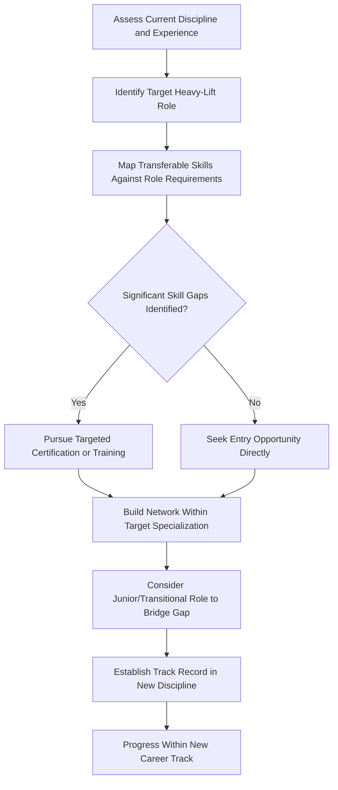

## Transitioning from Adjacent Logistics Disciplines

### Overview

Heavy-lift and specialized logistics rarely recruits primarily from dedicated entry-level pipelines; instead, a substantial portion of its workforce transitions in from adjacent disciplines where transferable skills — technical rigor, regulatory literacy, project coordination, or field operations experience — provide a foundation that can be built upon rather than started from scratch. Understanding which adjacent disciplines map most naturally onto which heavy-lift roles, and what gaps need to be closed, is valuable both for professionals considering a transition and for organizations building recruitment strategy.

### Common Source Disciplines and Their Natural Destinations

| Source Discipline | Transferable Strengths | Common Destination Role(s) |
| --- | --- | --- |
| Civil/structural engineering | Load analysis, structural assessment, technical documentation | Transport Engineer, Route Surveyor |
| Naval architecture/marine engineering | Vessel dynamics, stability, marine structural analysis | Marine Warranty Surveyor, Project Cargo Manager (marine-heavy projects) |
| Standard freight forwarding | Documentation, customs, carrier relationships, Incoterms | Project Cargo Freight Forwarder |
| Rigging and crane operations | Practical lift execution, equipment knowledge, site safety | Transport Engineer (rigging specialization), Site Operations roles |
| Highways/traffic engineering | Route planning, permit processes, authority relationships | Route Surveyor |
| Supply chain/procurement | Vendor management, cost control, contract negotiation | Project Cargo Manager |
| Classification society surveying | Independent technical assessment, compliance verification | Marine Warranty Surveyor |
| Offshore/oil & gas operations | Field operations, safety culture, project execution under constraint | Project Cargo Manager, Marine Warranty Surveyor |
| Military logistics (especially engineering corps or transport corps) | Operational planning under constraint, large-scale movement coordination | Project Cargo Manager, Transport Engineer |

### Transition Pathway: Civil/Structural Engineering to Transport Engineering

**Transferable Skills**

- Structural load calculation methodology
- Bridge and infrastructure assessment principles
- Technical documentation and certification practices

**Gaps to Close**

- Vehicle dynamics and axle load distribution specific to abnormal load transport
- Familiarity with abnormal load regulatory frameworks and permit processes
- SPMT and modular trailer configuration principles, which differ substantially from static structural design

**Typical Path**: A structural engineer working on bridge assessment or infrastructure projects develops familiarity with load rating methodology, then moves into a transport engineering role where that same load-rating skillset is applied to determine whether a specific bridge can carry a specific abnormal load — often starting in a junior capacity even with substantial prior engineering experience, since abnormal load transport engineering has its own body of specialized knowledge.

### Transition Pathway: Standard Freight Forwarding to Project Cargo

**Transferable Skills**

- Bill of lading and shipping documentation fluency
- Customs and compliance knowledge
- Carrier negotiation and booking experience
- Incoterms application

**Gaps to Close**

- Breakbulk and out-of-gauge (OOG) cargo handling procedures, which differ significantly from containerized freight workflows
- Heavy-lift vessel chartering knowledge
- Coordination with specialized transport contractors (route surveyors, transport engineers) not typically involved in standard container freight
- Project-based, multi-month coordination versus the shorter transactional cycles of standard forwarding

**Typical Path**: A freight forwarder handling containerized cargo requests exposure to a company's project cargo division, often starting by supporting documentation on breakbulk shipments under a senior project forwarder before taking on independent OOG cargo bookings.

### Transition Pathway: Classification Society Surveying to Marine Warranty Surveying

**Transferable Skills**

- Independent technical assessment mindset and professional standards
- Vessel and structural compliance verification experience
- Familiarity with marine engineering documentation and certification processes

**Gaps to Close**

- Marine warranty survey scope specifically (seafastening, lift engineering review, voyage approval) differs from classification's focus on vessel condition against class rules
- Familiarity with Noble Denton/DNV MWS guideline framework specifically
- Attendance and approval role during live critical operations, versus classification's more periodic/scheduled survey cadence

**Typical Path**: A classification society surveyor with several years of vessel survey experience moves to a marine warranty surveying firm, initially working alongside senior MWS professionals on desktop review of engineering submissions before progressing to independent approval authority and critical operation attendance.

### Transition Decision Framework

### Key Considerations When Transitioning

**Key Points**

- **Expect a step down in seniority initially**: professionals transitioning from an adjacent discipline, even with substantial prior experience, often need to accept a more junior role in the new specialization to build discipline-specific track record — this is standard rather than a sign of undervalued experience
- **Target certifications that bridge the specific gap**: rather than broad retraining, identify the specific technical or regulatory gap (e.g., abnormal load permit frameworks, MWS guideline training, OOG cargo procedures) and pursue focused certification addressing it
- **Leverage existing network deliberately**: professionals with an established reputation in an adjacent discipline often find their existing contacts provide warmer introductions into the new specialization than cold applications would
- **Highlight transferable judgment, not just technical knowledge**: hiring managers in heavy-lift roles often value the underlying professional judgment (independent assessment under pressure, structural reasoning, coordination across complex stakeholder groups) as much as or more than specific technical knowledge, which can be taught
- **Timing transitions around project cycles**: because heavy-lift and marine warranty work is often project-based, transitions timed to align with new project starts or contract renewal cycles may find more open opportunities than transitions attempted mid-project

### Common Challenges in Cross-Discipline Transitions

- Underestimating the depth of specialized regulatory knowledge required (abnormal load permit regimes, MWS guideline frameworks) that isn't easily inferred from adjacent experience
- Salary or seniority expectations mismatched against the reality of entering a new specialization at a more junior level
- Difficulty demonstrating specialized competency to hiring managers without direct project experience in the new discipline, even when underlying skills are strong
- Risk of being perceived as a "generalist" rather than a specialist in a field that often rewards deep specialization at senior levels [Inference: this perception risk likely varies by company size and role, since larger firms may value cross-disciplinary breadth differently than boutique specialist firms]

### Example Transition Narrative

**Example**

A highways engineer with eight years of experience in traffic management and road infrastructure assessment for a local government authority decides to move into route surveying for heavy-lift transport, drawn by the more technically varied and higher-stakes nature of the work. They recognize their permit process and authority relationship experience transfers directly, but they lack experience with swept-path analysis software and abnormal load-specific route constraints. They pursue AutoTrack certification while still in their highways role, then join a heavy-haul contractor as a Route Surveyor — not at a senior level despite their eight years of adjacent experience, but progressing to Senior Route Surveyor within three years due to their strong foundational understanding of highway infrastructure and authority coordination, faster than a typical entry-level trainee would.

### Related Topics

- Transport Engineer and Route Surveyor Career Paths
- Project Cargo Manager and Freight Forwarder Roles
- Marine Warranty Surveyor Career Development
- Certification and Training Pathways for Heavy-Lift Specializations
- Building a Professional Network in the Industry
- Regulatory Frameworks for Abnormal Load Transport by Jurisdiction
- Classification Society Survey Standards and Scope