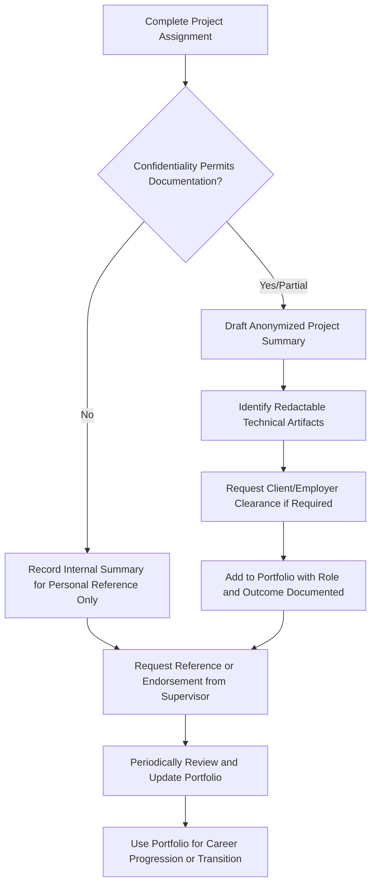

## Building a Portfolio of Heavy-Lift Project Experience

### Overview

A professional portfolio in heavy-lift and specialized logistics serves a different function than portfolios in creative or purely technical fields: rather than showcasing aesthetic output, it demonstrates verifiable involvement in complex, high-consequence operations where judgment, technical rigor, and successful coordination under constraint are the qualities being evidenced. Because much heavy-lift work is confidential, client-sensitive, or governed by non-disclosure agreements, portfolio-building in this industry requires deliberate strategy around what can be documented, how it can be presented, and how professional credibility substitutes for the kind of public work samples common in other fields.

### Why Portfolios Matter Differently in This Industry

- **Project confidentiality constraints**: engineering details, client identities, and specific methodologies are frequently protected by contract, meaning a portfolio often cannot include the level of technical detail a portfolio in, say, software engineering might
- **Verification-based trust**: because detailed work product often can't be shared, the industry relies heavily on verifiable project involvement (role, scope, outcome) corroborated by professional references and reputation rather than direct inspection of deliverables
- **Career-spanning project scarcity**: unlike fields with frequent small deliverables, a heavy-lift career may include a comparatively small number of major projects, making each one disproportionately significant to document well
- **Certification and approval trail as evidence**: certificates of approval, chartered status, and completed certifications function as a formal evidentiary layer alongside narrative project descriptions

### Core Components of a Heavy-Lift Portfolio

**Project Summary Records**

- Project name/description (anonymized if required by confidentiality terms), client sector, and general scale
- Specific role and scope of responsibility within the project
- Key technical or coordination challenges addressed
- Outcome and any measurable results (schedule performance, cost management, safety record)

**Technical Documentation Samples** (where permitted)

- Redacted or anonymized engineering calculations, method statements, or survey reports demonstrating technical approach
- Sample swept-path diagrams, load distribution calculations, or route survey summaries with client-identifying information removed
- Published case studies or conference presentations, which are inherently already cleared for public discussion

**Certifications and Credentials**

- Professional certifications (swept-path software, MWS guideline training, dangerous goods handling)
- Chartered status or progression toward it
- Completed training courses relevant to the specialization

**Professional References and Endorsements**

- Direct references from supervisors, clients, or cross-functional collaborators (e.g., a transport engineer referencing a route surveyor's work, or a marine warranty surveyor referencing a contractor's engineering quality)
- LinkedIn recommendations or association endorsements tied to specific project involvement

### Portfolio Approach by Career Stage

| Career Stage | Portfolio Focus | Primary Content |
| --- | --- | --- |
| Entry-level | Demonstrating foundational competence and learning trajectory | Certifications completed, training project work, supervised project involvement descriptions |
| Mid-career | Demonstrating independent technical ownership | Independently-led project summaries, technical problem-solving examples, growing certification set |
| Senior | Demonstrating complex project leadership and judgment | High-stakes/complex project narratives, mentorship evidence, published thought leadership, chartered status |
| Consultant/Independent | Demonstrating breadth and client trust | Client testimonials, diverse project portfolio across sectors, published case studies, association leadership |

### Practical Portfolio-Building Workflow

### Practical Guidance for Documenting Confidential Work

**Key Points**

- **Seek clearance proactively, not retroactively**: raising the question of what can be documented for portfolio purposes at project close (while institutional memory and approval processes are fresh) is more effective than trying to obtain clearance years later
- **Default to role and scope over technical specifics** when uncertain: describing "led seafastening calculation review for a 4,000-tonne module transport" is generally safer than reproducing specific numerical results, unless explicit clearance has been given
- **Distinguish personal record-keeping from public portfolio material**: maintaining a detailed private record of projects (for CV accuracy and interview preparation) is different from what gets published or shown externally, and conflating the two risks confidentiality breaches
- **Use published/public sources as anchors where possible**: if a project has been publicly discussed by the employer, client, or industry press, referencing that public discussion allows more detailed portfolio inclusion than would otherwise be appropriate
- **Treat certifications as portfolio backbone**: because project narrative detail is often constrained, a robust certification and training record provides objectively verifiable portfolio content that doesn't carry the same confidentiality risk

### Common Portfolio-Building Pitfalls

- Waiting until actively job-seeking to compile a portfolio, resulting in incomplete records and difficulty securing retroactive clearance from past employers or clients
- Including confidential technical detail without proper clearance, creating professional and legal risk
- Over-indexing on volume of projects listed rather than depth and clarity of role/impact description, which is generally less persuasive to experienced reviewers
- Neglecting to document soft coordination achievements (successful multi-stakeholder negotiation, crisis management during a delayed operation) that are highly valued in this industry but easy to omit in favor of purely technical content
- Failing to keep portfolio material current, particularly certifications that may lapse or require renewal

### Example Portfolio Entry Structure

**Example**

A mid-career route surveyor documents a project as follows: "Led route survey for a multi-jurisdiction wind turbine blade transport spanning three local authority areas. Coordinated with utility providers on temporary overhead line adjustments and conducted swept-path verification for a 65-meter blade transport configuration. Delivered survey pack ahead of permit submission deadline, enabling on-schedule project mobilization." This entry avoids client-identifying specifics and precise technical figures that might require clearance, while still conveying scope, technical method (swept-path verification), stakeholder complexity (multi-jurisdiction, utility coordination), and a measurable outcome (on-schedule delivery) — sufficient to demonstrate genuine capability to a reviewer without breaching confidentiality.

### Related Topics

- Building a Professional Network in the Industry
- Certification and Training Pathways for Heavy-Lift Specializations
- Transport Engineer and Route Surveyor Career Paths
- Confidentiality and Non-Disclosure Considerations in Project Logistics
- Chartered Engineer Status and Progression Requirements
- Case Study Publication and Industry Thought Leadership