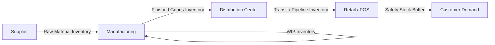

## Definition and Strategic Role of Inventory

### Definition of Inventory

Inventory refers to the stock of raw materials, work-in-progress (WIP) goods, and finished products that an organization holds at any point in time to support production, operations, or sales. It is classified on the balance sheet as a current asset because it is expected to be converted into cash within a normal operating cycle (typically one year).

Formally, inventory represents a buffer of materials or goods that decouples the timing of supply from the timing of demand. This decoupling function is the central economic reason inventory exists: without it, every unit of demand would require instantaneous production or procurement, which is rarely feasible or cost-efficient.

### Categories of Inventory

**Raw Materials**

Unprocessed inputs purchased from suppliers, awaiting conversion into finished goods (e.g., steel coils for an automotive plant, flour for a bakery).

**Work-in-Process (WIP)**

Partially completed goods that have entered the production process but are not yet ready for sale. WIP inventory ties up capital longer than raw materials because value has already been added through labor and overhead.

**Finished Goods**

Completed products ready for sale or distribution, held either at the manufacturing site, in transit, or at distribution centers/retail locations.

**MRO Inventory (Maintenance, Repair, and Operations)**

Supplies that support production but are not part of the final product — spare parts, lubricants, tools, cleaning supplies.

**Transit (Pipeline) Inventory**

Goods that are physically in movement between nodes of the supply chain (e.g., on a ship, in a truck) but are legally owned and financially accounted for by the firm.

**Buffer/Safety Stock**

Extra inventory held above expected demand specifically to absorb variability in demand or supply lead time — the central subject of later chapters in this course.

### Strategic Role of Inventory

Inventory is not merely an operational necessity; it is a strategic lever that affects customer service, capital efficiency, and competitive positioning. Its strategic functions include:

**1. Decoupling Supply and Demand**

Production and demand rarely move in perfect synchrony. Inventory allows a firm to produce at an efficient, steady rate (economies of scale) while still meeting demand that fluctuates day to day.

**2. Buffering Against Uncertainty**

Two sources of uncertainty justify holding inventory:

- Demand uncertainty (customers order more or less than forecast)
- Supply uncertainty (lead times vary, suppliers have quality issues or delays)

**3. Enabling Economies of Scale**

Ordering or producing in larger batches lowers the per-unit cost of setup, transportation, and procurement. This is formalized later through the Economic Order Quantity (EOQ) model, where cycle inventory is a direct consequence of batching decisions.

**4. Supporting Service-Level Strategy**

Inventory availability is directly tied to fill rate and order-cycle service level. A firm's target service level is a strategic choice (not just operational) because it directly trades off holding cost against stockout/lost-sales cost.

**5. Hedging Against Price and Supply Risk**

Firms may stockpile inventory in anticipation of price increases, tariffs, currency shifts, or supply disruptions — a practice known as speculative or hedge inventory.

**6. Seasonal Smoothing**

Anticipation inventory is built up ahead of predictable seasonal demand peaks (e.g., holiday retail, agricultural harvest cycles) to avoid the cost of scaling production capacity up and down.

### The Inventory Trade-off

Inventory strategy is fundamentally a balancing act between two opposing cost forces:

| Force | Description | Pushes Inventory... |
| --- | --- | --- |
| Holding (Carrying) Cost | Capital tied up, storage, insurance, obsolescence, shrinkage | Down |
| Stockout / Shortage Cost | Lost sales, backorder penalties, customer goodwill loss, expediting costs | Up |

This trade-off is the foundation for nearly all quantitative inventory models covered later in this course — EOQ, reorder point (ROP), and safety stock calculations all exist to find the cost-minimizing or service-level-optimizing point along this spectrum.

$$\text{Total Inventory Cost} = \text{Holding Cost} + \text{Ordering/Setup Cost} + \text{Stockout Cost}$$

### Strategic Role Across the Supply Chain

Each node in this chain holds inventory for a distinct strategic reason: suppliers buffer against production variability, manufacturers buffer against machine downtime and demand shifts, distribution centers buffer against transportation lead-time variability, and retailers buffer against day-to-day demand noise.

### Inventory as a Financial Metric

Inventory directly affects several key financial and operational KPIs that make it a matter of executive strategy, not just warehouse management:

- **Inventory Turnover Ratio**: $\text{COGS} / \text{Average Inventory}$ — measures how efficiently inventory is converted into sales
- **Days Sales of Inventory (DSI)**: $365 / \text{Inventory Turnover}$ — measures how many days of inventory are held on average
- **Cash Conversion Cycle (CCC)**: incorporates DSI alongside days payable and days receivable to measure working capital efficiency

Excess inventory ties up working capital and increases obsolescence risk; insufficient inventory risks stockouts, lost sales, and reputational damage. This is why inventory strategy sits at the intersection of operations, finance, and marketing/customer service functions.

### Example

A regional electronics retailer holds:

- Raw materials: none (retailer, not manufacturer)
- Finished goods at DC: 10,000 units of a popular smartphone model
- Safety stock: 1,500 units, calculated to protect against a 2-week supply lead time with variable demand
- Transit inventory: 800 units currently on a container ship

Strategically, the retailer's leadership decided to increase safety stock ahead of a competitor's product launch, accepting higher holding costs in exchange for a lower risk of stockouts during a high-demand marketing push. This exemplifies inventory as a deliberate strategic decision rather than a passive operational byproduct.

[Inference] The specific safety stock quantity in this example is illustrative; actual safety stock levels depend on the statistical demand and lead-time variability parameters covered in later chapters (e.g., service-level-driven safety stock formulas).

### Key Points

- Inventory decouples supply timing from demand timing, enabling operational flexibility
- Different inventory types (raw materials, WIP, finished goods, MRO, transit, safety stock) serve different strategic purposes
- The core trade-off is holding cost vs. stockout cost — nearly all quantitative inventory models optimize this trade-off
- Inventory levels are a strategic, not purely operational, decision — they affect financial KPIs (turnover, DSI, CCC) and competitive positioning
- Safety stock (covered in depth in subsequent chapters) is the specific inventory category designed to manage uncertainty

**Related Topics**

- Types of inventory costs (holding, ordering, shortage, and their formal cost functions)
- Demand and lead-time variability as drivers of safety stock
- Economic Order Quantity (EOQ) model
- Reorder point (ROP) formulation
- Service level metrics (cycle service level vs. fill rate)
- Inventory classification systems (ABC analysis, XYZ analysis)