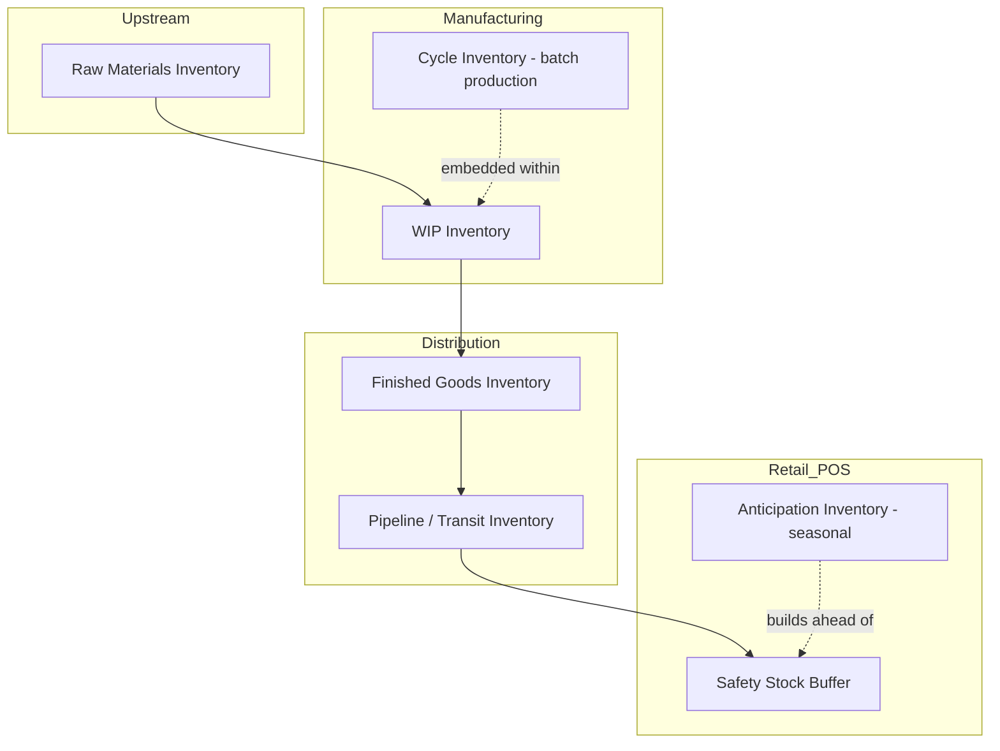

## Types of Inventory Across the Value Chain

### Overview

Inventory is not a monolithic category — its composition, purpose, and risk profile change as goods move through each stage of the value chain, from raw material extraction to final consumption. Classifying inventory by its position and function in this chain allows managers to apply the correct costing, control, and replenishment logic to each type, rather than treating all "stock" the same way.

### Classification by Stage of Production

**1. Raw Materials Inventory**

Unprocessed inputs procured from external suppliers, held before entering production. Examples: cotton for a textile mill, crude oil for a refinery, semiconductors for an electronics assembler.

- Primary risk: supplier lead-time variability, commodity price volatility
- Typical control method: reorder point (ROP) systems, supplier-managed inventory (SMI)

**2. Work-in-Process (WIP) Inventory**

Materials that have entered the production process but are not yet finished goods. WIP exists because most manufacturing processes are multi-stage and cannot be instantaneous.

- Primary risk: production bottlenecks, quality defects discovered mid-process
- Typical control method: Kanban systems, WIP caps (as in Lean/TOC methodologies)

**3. Finished Goods Inventory (FGI)

Completed products awaiting sale, shipment, or distribution.

- Primary risk: obsolescence, demand forecast error, markdown risk
- Typical control method: statistical safety stock models, S&OP (Sales and Operations Planning)

**4. MRO (Maintenance, Repair, and Operations) Inventory**

Indirect materials that support operations but do not become part of the sellable product — spare parts, tools, lubricants, PPE.

- Primary risk: unplanned equipment downtime if unavailable
- Typical control method: criticality-based stocking (not demand-based), often using a two-bin system

### Classification by Functional Purpose

Beyond stage-of-production, inventory theory classifies stock by *why* it is held — this is often more actionable for cost modeling than physical classification alone.

**Cycle (Lot-Size) Inventory**

Stock held because it is more economical to order/produce in batches than continuously. Driven by fixed ordering or setup costs. Modeled by the Economic Order Quantity (EOQ):

$$Q^* = \sqrt{\frac{2DS}{H}}$$

where $D$ = annual demand, $S$ = fixed cost per order, $H$ = holding cost per unit per year.

**Safety (Buffer) Stock**

Extra inventory held above expected demand to protect against demand and lead-time variability. This is the core subject of later chapters and is calculated using service-level targets and demand/lead-time standard deviations.

**Anticipation (Seasonal) Inventory**

Stock built up in advance of a known, predictable demand surge (holiday season) or supply constraint (agricultural harvest windows), to smooth production or avoid capacity shortfalls.

**Pipeline (Transit/In-Transit) Inventory**

Goods that are in physical transit between two nodes in the supply chain but are already owned by the firm. Quantified as:

$$\text{Pipeline Inventory} = \text{Average Demand Rate} \times \text{Lead Time}$$

This is especially significant in global supply chains with long ocean-freight transit times.

**Decoupling Inventory**

Stock held at an intermediate point specifically to allow upstream and downstream processes to operate independently at different rates (e.g., a buffer between two production stages with different cycle times).

**Speculative (Hedge) Inventory**

Stock purchased in anticipation of a price increase, tariff change, or currency shift rather than because of a demand or production need — a financially motivated inventory decision.

**Dead (Obsolete) Stock**

Inventory that no longer has expected future demand — the negative outcome of poor inventory strategy, representing pure holding cost with no offsetting service benefit.

### Value Chain Position Diagram

### Comparison Table

| Inventory Type | Location in Value Chain | Driver | Typical Holding Duration |
| --- | --- | --- | --- |
| Raw Materials | Upstream (pre-production) | Supplier lead time | Days to weeks |
| WIP | Mid-chain (in production) | Process cycle time | Hours to days |
| Cycle Stock | Mid-chain | Batch/order economics | Varies with order frequency |
| Finished Goods | Downstream (post-production) | Demand fulfillment | Days to months |
| Pipeline/Transit | Between nodes | Transportation lead time | Days to weeks (longer for ocean freight) |
| Safety Stock | Downstream, at point of sale/distribution | Demand & lead-time variability | Continuous buffer |
| Anticipation Stock | Downstream, pre-season | Forecasted seasonal demand | Weeks to months |
| MRO | Within operations (not sold) | Equipment/asset criticality | Indefinite until consumed |
| Speculative/Hedge | Anywhere, opportunistic | Price/market risk | Variable |
| Dead Stock | Anywhere (unintended) | Forecast error, obsolescence | Indefinite (negative value) |

### Example

A furniture manufacturer's value chain illustrates several types simultaneously:

- **Raw materials**: kiln-dried lumber held at the sawmill-adjacent warehouse (2-week supply)
- **WIP**: partially assembled chair frames on the production floor awaiting upholstery
- **Cycle inventory**: fabric ordered in 500-yard rolls because the supplier's minimum order quantity and per-order freight cost make smaller, more frequent orders uneconomical
- **Finished goods**: assembled chairs at the regional distribution center
- **Pipeline inventory**: a container of imported hardware components currently at sea, 18 days from arrival
- **Safety stock**: an additional 200 units of the best-selling chair model held at the DC to cover an average 3-day forecast error window
- **Anticipation inventory**: extra stock built up in July ahead of the back-to-school furniture demand spike in August/September

[Inference] The specific quantities in this example are illustrative rather than derived from a real dataset; actual sizing would require the demand and lead-time distributions covered in the safety stock and EOQ chapters.

### Key Points

- Inventory can be classified either by **stage of production** (raw materials, WIP, finished goods, MRO) or by **functional purpose** (cycle, safety, anticipation, pipeline, decoupling, speculative, dead stock)
- Functional classification is generally more useful for cost modeling because it explains *why* the inventory exists, not just *where* it sits physically
- Pipeline/transit inventory becomes strategically significant in global supply chains with long lead times
- Dead stock represents a failure state — inventory with holding cost but no remaining service value
- Each inventory type has a distinct primary risk and a distinct standard control methodology

**Related Topics**

- Economic Order Quantity (EOQ) and cycle stock optimization
- Safety stock formulas under demand and lead-time uncertainty
- ABC/XYZ inventory classification for prioritizing control effort
- Just-in-Time (JIT) and WIP minimization strategies
- Inventory valuation methods (FIFO, LIFO, weighted average) and their financial statement impact