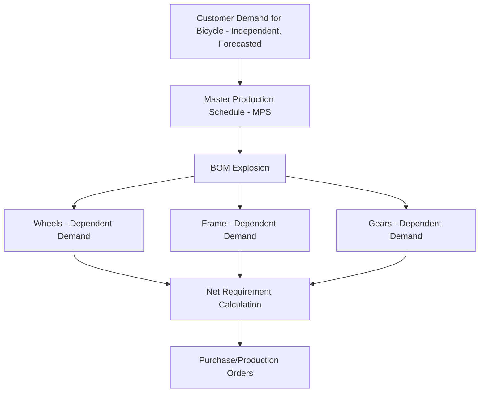

## Independent Versus Dependent Demand

### Definition

The distinction between independent and dependent demand is one of the foundational classifications in inventory management, originally formalized by Joseph Orlicky in the context of Material Requirements Planning (MRP). It determines which forecasting and replenishment methodology is appropriate for a given item.

**Independent demand** is demand for an item that is not derived from the demand for any other item — it originates directly from the external market (customers, end users) and must therefore be *forecasted*.

**Dependent demand** is demand for an item that is derived mathematically from the demand for a related item — typically a parent assembly, component structure, or bill of materials (BOM) relationship — and can therefore be *calculated* rather than forecasted.

### Core Distinction

$$\text{Independent Demand} \rightarrow \text{Forecast Required}$$

$$\text{Dependent Demand} \rightarrow \text{Calculated from Parent Item Demand}$$

This is the central conceptual pivot that separates two entire families of inventory control systems:

- Independent demand items are managed with **statistical inventory control** (EOQ, reorder point, safety stock)
- Dependent demand items are managed with **MRP (Material Requirements Planning)** logic, which computes gross and net requirements from the BOM

### Independent Demand

**Characteristics:**

- Originates from external customers or the market
- Subject to genuine uncertainty — cannot be known with certainty in advance
- Must be estimated via statistical forecasting methods (moving average, exponential smoothing, regression, etc.)
- Requires safety stock to buffer forecast error and lead-time variability

**Examples:**

- Finished goods sold directly to consumers (a retail SKU, a spare part sold as an aftermarket item)
- Service parts demand (even though the part is a "component," if it is sold independently as a replacement part, its demand is independent)

**Typical control methods:**

- Continuous review (Q, R) systems — reorder point/reorder quantity
- Periodic review (s, S) systems
- Statistical safety stock models based on service level targets

### Dependent Demand

**Characteristics:**

- Derived arithmetically from the production schedule of a parent item
- Not inherently uncertain once the parent item's production plan is fixed — the requirement is *calculated*, not forecasted
- Typically time-phased (needed at specific points aligned to the parent's production schedule)
- Excess safety stock at this level is often wasteful, since the true driver of uncertainty lies at the independent-demand level above it

**Examples:**

- Wheels required because a certain number of bicycles are scheduled for assembly
- Wiring harnesses required because a certain number of vehicles are scheduled for production
- Sub-components, raw materials, and packaging tied to a specific finished-goods production run

**Typical control methods:**

- MRP (Material Requirements Planning) — explodes the Master Production Schedule (MPS) through the BOM to compute time-phased net requirements
- Just-in-Time (JIT) / Kanban pull systems, in lean environments

### The BOM Relationship

Dependent demand is calculated via **BOM explosion**:

$$\text{Gross Requirement}_{\text{component}} = \text{Quantity per Parent} \times \text{Planned Order Release}_{\text{parent}}$$

$$\text{Net Requirement} = \text{Gross Requirement} - \text{On-Hand Inventory} - \text{Scheduled Receipts}$$

### Why the Distinction Matters

**1. Different Forecasting Requirements**

Independent demand items require investment in forecasting accuracy (demand planning, statistical models). Dependent demand items should never be independently forecasted — doing so introduces the "double-counting" of uncertainty and typically leads to overstocking, a well-documented inefficiency in MRP theory.

**2. Different Safety Stock Logic**

Safety stock is generally appropriate for independent demand items to absorb forecast error and lead-time variability. For pure dependent demand items with reliable parent scheduling, safety stock is often minimized or eliminated, since the requirement is known with precision once the parent schedule is fixed. [Inference] In practice, many firms still carry some safety stock on dependent-demand components to buffer against supply lead-time variability or yield loss, even though textbook MRP theory treats the requirement as deterministic.

**3. The Bullwhip Effect Connection**

Treating dependent demand as if it were independent (i.e., forecasting downstream demand separately at each tier of a multi-echelon supply chain rather than deriving it from the immediate downstream tier) is a primary structural cause of the bullwhip effect — the amplification of demand variability as it moves upstream through a supply chain.

### Item-Type Ambiguity

A single SKU can have **both** independent and dependent demand simultaneously. For example, a car battery may be:

- Dependent demand when consumed as a component in scheduled vehicle assembly
- Independent demand when sold directly as an aftermarket replacement part

In such cases, the two demand streams are typically modeled separately: the dependent portion is netted through MRP against the production schedule, while the independent (service parts) portion is forecasted and safety-stocked separately, then the two requirement streams are combined for total gross requirements.

### Comparison Table

| Attribute | Independent Demand | Dependent Demand |
| --- | --- | --- |
| Source | External market/customer | Internal production schedule (BOM) |
| Determination method | Forecasted (statistical) | Calculated (arithmetic, via BOM explosion) |
| Uncertainty | Genuine, irreducible | Low, if parent schedule is fixed |
| Typical control system | Reorder point, EOQ, periodic review | MRP, JIT/Kanban |
| Safety stock need | Generally necessary | Generally minimized or unnecessary |
| Example | Finished bicycles sold to consumers | Wheels needed to assemble those bicycles |

### Example

A furniture manufacturer produces a dining chair (finished good) composed of a seat frame, four legs, and a cushion.

- **Independent demand**: Demand for the finished dining chair, forecasted monthly using historical sales and seasonal indices — this is where genuine market uncertainty lives.
- **Dependent demand**: Demand for the four legs is calculated directly: if the MPS calls for 500 chairs next month, gross requirement for legs = $500 \times 4 = 2{,}000$ units, adjusted for on-hand inventory and any scheduled receipts.

If a planner incorrectly forecasted leg demand independently (ignoring the chair production schedule), the result would likely be an inventory mismatch — either excess legs relative to actual chair builds, or a shortage inconsistent with the true production plan.

### Key Points

- Independent demand originates externally and must be forecasted; dependent demand is derived internally via BOM and should be calculated, not forecasted
- This distinction determines the appropriate control system: statistical reorder methods for independent demand, MRP for dependent demand
- Forecasting a dependent-demand item independently is a common practical error that contributes to overstocking and demand distortion
- A single item can carry both demand types simultaneously (e.g., a service part that is also a production component) and must be modeled with combined/net requirements logic
- The distinction is foundational to why MRP systems exist as a separate discipline from classical (EOQ/ROP) inventory theory

**Related Topics**

- Material Requirements Planning (MRP) mechanics — gross-to-net requirement logic
- Bill of Materials (BOM) structures and explosion logic
- Master Production Schedule (MPS) development
- The bullwhip effect in multi-echelon supply chains
- Demand forecasting methods for independent-demand items
- Just-in-Time (JIT) and Kanban as alternatives to MRP for dependent demand