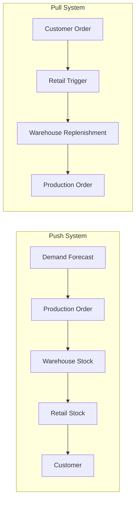

## Push Versus Pull Inventory Systems

### Definition

Push and pull systems represent two fundamentally different philosophies for deciding **when and how much inventory to produce or move** through a supply chain. The distinction is based on what triggers replenishment: a forecast (push) or actual demand (pull).

**Push system**: Production and inventory replenishment decisions are driven by long-term demand *forecasts*. Goods are manufactured and moved downstream in anticipation of future demand, before actual customer orders are received.

**Pull system**: Production and inventory replenishment decisions are driven by actual, realized demand signals. Goods are manufactured or moved only in response to an actual order or consumption event downstream.

### Conceptual Trigger Comparison

$$\text{Push: } \text{Production Trigger} = f(\text{Forecast})$$

$$\text{Pull: } \text{Production Trigger} = f(\text{Actual Demand Signal})$$

### Push Systems

**Mechanism**: Master Production Schedule (MPS) is built from a demand forecast, and MRP explodes this schedule into component and material requirements ahead of actual orders.

**Characteristics:**

- Relies on forecast accuracy — the further ahead the forecast horizon, the greater the forecast error
- Enables economies of scale in production (long batch runs, level production schedules)
- Typically results in higher finished goods inventory, since goods are built before firm demand exists
- Well-suited to products with stable, predictable demand and long production lead times

**Advantages:**

- Smooths production, avoiding costly capacity ramp-up/ramp-down
- Reduces stockout risk for high-volume, low-variability products
- Enables centralized, large-batch procurement discounts

**Disadvantages:**

- Vulnerable to the bullwhip effect — forecast errors amplify as they propagate upstream through multiple echelons
- Higher risk of obsolescence and markdown losses if forecasts are wrong
- Higher working capital tied up in inventory

### Pull Systems

**Mechanism**: Nothing is produced or moved until an actual consumption signal (a sale, a withdrawal, a Kanban card) triggers replenishment. The archetypal implementation is the **Kanban system**, developed as part of the Toyota Production System (TPS).

**Characteristics:**

- Production is triggered by actual downstream consumption, not forecast
- Typically results in lower WIP and finished goods inventory
- Requires short, reliable lead times and stable process capability to be effective
- Core to Lean Manufacturing and Just-in-Time (JIT) philosophies

**Advantages:**

- Minimizes overproduction and excess inventory (one of the 7 Lean "wastes" — muda)
- Reduces bullwhip amplification because each stage only reacts to its immediate downstream signal
- Improves inventory turnover and reduces obsolescence risk

**Disadvantages:**

- Vulnerable to supply disruption — there is little buffer to absorb an upstream shock (a key lesson from COVID-era JIT failures)
- Requires highly reliable, low-variability supplier lead times to function without excessive stockouts
- Harder to achieve economies of scale on very large batch/setup-cost items

### Kanban as the Canonical Pull Mechanism

In a Kanban pull system, a physical or digital card (kanban) authorizes replenishment only when a downstream bin is emptied, directly linking replenishment to actual consumption rather than a schedule.

$$\text{Number of Kanban Cards} = \frac{D \times L \times (1 + \alpha)}{C}$$

where $D$ = average demand rate, $L$ = replenishment lead time, $\alpha$ = safety factor, and $C$ = container/bin capacity.

### The Push-Pull Boundary (Hybrid Systems)

Most real-world supply chains are not purely push or purely pull — they operate as **hybrid (push-pull) systems**, with a defined boundary point separating the two.

- **Upstream of the boundary** (raw materials, early production stages): operates on push logic, using forecasts, because lead times are long and batching is economical
- **Downstream of the boundary** (final assembly, distribution, retail): operates on pull logic, reacting to actual customer orders

This boundary is often called the **decoupling point** or **customer order decoupling point (CODP)**, and its placement is a major strategic decision.

**Common decoupling point strategies:**

| Strategy | Decoupling Point Location | Description |
| --- | --- | --- |
| Make-to-Stock (MTS) | At finished goods | Fully push; goods built to forecast, sold from stock |
| Assemble-to-Order (ATO) | At semi-finished components | Components pushed to stock; final assembly pulled by order |
| Make-to-Order (MTO) | At raw materials | Raw materials/components pushed to stock; production pulled by order |
| Engineer-to-Order (ETO) | At design stage | Fully pull; even design begins only after order receipt |

Dell's historic build-to-order PC model is a widely cited example of an assemble-to-order hybrid: components were procured/forecasted (push) but final configuration and assembly were pulled by the actual customer order.

### Comparison Table

| Attribute | Push System | Pull System |
| --- | --- | --- |
| Trigger | Forecast | Actual demand/consumption |
| Inventory level | Generally higher | Generally lower |
| Bullwhip exposure | High | Low |
| Responsiveness to demand shifts | Slower | Faster |
| Best suited for | Stable, high-volume, predictable demand | Variable demand, short lead times achievable |
| Canonical example | Traditional MRP-driven manufacturing | Toyota Production System / Kanban |
| Supply disruption resilience | Higher (buffer absorbs shocks) | Lower (minimal buffer) |

### Example

A furniture retailer sells a popular sofa model.

- **Push approach**: The manufacturer forecasts annual demand at 12,000 units, schedules production in quarterly batches of 3,000, and ships to regional warehouses ahead of anticipated seasonal demand. If the forecast overestimates demand, the retailer accumulates excess finished goods inventory and may need markdowns.
- **Pull approach**: The manufacturer waits until a warehouse's on-hand stock drops below a Kanban-triggered threshold before authorizing a new production run, sized to actual recent sell-through rather than an annual forecast.

A realistic hybrid: fabric and frame components are procured against a rolling forecast (push, because textile lead times are long), while final sofa assembly and upholstery color are triggered only once a specific customer order is placed (pull) — an assemble-to-order model.

[Inference] Whether a pure pull system is operationally feasible depends heavily on the achievable lead time relative to customer tolerance for wait time; industries with long production lead times (e.g., large capital equipment) often cannot sustain pure pull without unacceptable delivery delays.

### Key Points

- Push systems replenish based on forecasts; pull systems replenish based on actual demand signals
- Push systems favor economies of scale but are more exposed to forecast error and the bullwhip effect
- Pull systems (exemplified by Kanban/JIT) minimize excess inventory but require reliable, short lead times and are more vulnerable to supply shocks
- Most real supply chains are hybrid, with a customer order decoupling point (CODP) separating push-based upstream stages from pull-based downstream stages
- The location of the decoupling point defines common fulfillment strategies: make-to-stock, assemble-to-order, make-to-order, and engineer-to-order

**Related Topics**

- The bullwhip effect and its structural causes
- Kanban system design and card-count calculation
- Just-in-Time (JIT) manufacturing principles
- Customer order decoupling point (CODP) strategy
- Make-to-stock vs. make-to-order vs. assemble-to-order fulfillment models
- Lean manufacturing and the seven wastes (muda)