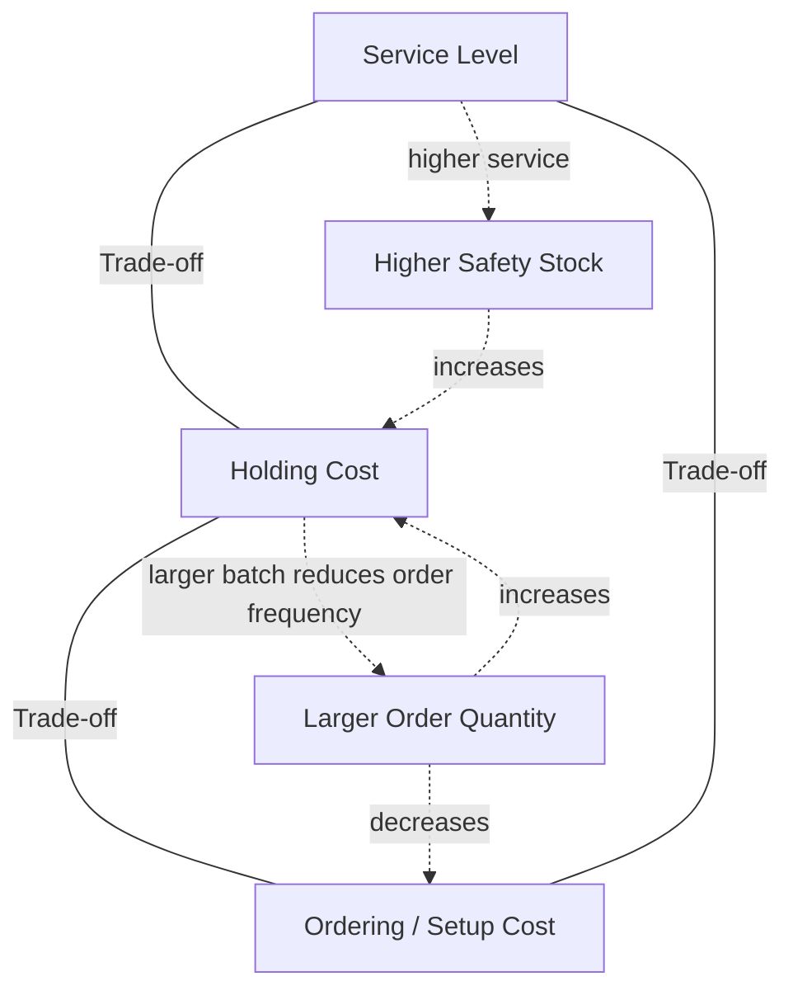

## Core Inventory Management Objectives and Trade-offs

### Overview

Inventory management exists to reconcile competing organizational goals that cannot all be simultaneously maximized. At its core, the discipline seeks to determine the right quantity of the right item, at the right place, at the right time — while minimizing total cost and risk. This chapter establishes the primary objectives that inventory systems pursue and the structural trade-offs that make inventory management a genuine optimization problem rather than a simple minimization or maximization task.

### Primary Objectives

**1. Maximize Customer Service Level**

Ensuring product availability when and where customers demand it, measured through metrics such as fill rate and cycle service level (both covered in depth in the safety stock chapters).

**2. Minimize Total Inventory-Related Cost**

Total cost is not simply "cost of goods" — it comprises several distinct cost categories that must be jointly minimized:

$$\text{Total Relevant Cost} = \text{Holding Cost} + \text{Ordering/Setup Cost} + \text{Stockout Cost} + \text{Obsolescence Cost}$$

**3. Maximize Capital Efficiency**

Inventory ties up working capital that could otherwise be deployed elsewhere. Objectives here are measured via:

$$\text{Inventory Turnover} = \frac{\text{COGS}}{\text{Average Inventory Value}}$$

$$\text{Days Sales of Inventory (DSI)} = \frac{365}{\text{Inventory Turnover}}$$

**4. Minimize Risk of Obsolescence and Shrinkage**

Particularly relevant for perishable goods, fashion/seasonal products, and technology items with short lifecycle windows.

**5. Support Operational Stability**

Buffer against variability in supply and production so that manufacturing and fulfillment operations run smoothly without constant disruption from shortages.

### The Fundamental Trade-off Structure

Nearly every inventory decision reduces to balancing opposing cost forces. The classic trade-off triangle is:

**Holding Cost vs. Ordering Cost (the EOQ trade-off)**

Larger order quantities reduce the number of orders placed per year (lowering total ordering cost) but increase average inventory on hand (raising total holding cost). This trade-off is formalized by the Economic Order Quantity model:

$$Q^* = \sqrt{\frac{2DS}{H}}$$

where $D$ = annual demand, $S$ = fixed cost per order, $H$ = annual holding cost per unit.

**Service Level vs. Holding Cost (the safety stock trade-off)**

Higher desired service levels require more safety stock, which increases holding cost. The relationship is non-linear: pushing service level toward 100% requires disproportionately large increases in safety stock, since it depends on the inverse normal CDF of the target service level:

$$SS = z \cdot \sigma_{LT}$$

where $z$ is the safety factor corresponding to the target cycle service level, and $\sigma_{LT}$ is the standard deviation of demand during lead time. As the target service level approaches 100%, $z \to \infty$, meaning that no finite safety stock can guarantee it — a critical practical insight.

**Responsiveness vs. Efficiency**

Systems optimized purely for cost efficiency (large batches, centralized stock, long lead times) tend to be slower to respond to demand shifts. Systems optimized purely for responsiveness (frequent small orders, distributed local stock) tend to sacrifice unit-cost efficiency. This trade-off underlies the broader push-pull system decision.

**Centralization vs. Local Availability**

Centralizing inventory in fewer locations reduces total safety stock needed (due to the statistical risk-pooling effect) but increases transportation lead time and cost to reach end customers. Risk pooling is quantified by:

$$\sigma_{\text{pooled}} = \sqrt{\sum_{i=1}^{n} \sigma_i^2} \quad (\text{assuming independent demand across locations})$$

Since $\sigma_{\text{pooled}} < \sum \sigma_i$, centralized safety stock is generally lower than the sum of decentralized safety stocks — but at the cost of longer replenishment lead time to each local market.

### The Cost Categories in Detail

| Cost Type | Description | Increases With |
| --- | --- | --- |
| Holding (Carrying) Cost | Capital cost, storage, insurance, taxes, obsolescence, shrinkage | Average inventory level |
| Ordering/Setup Cost | Cost of placing a purchase order or executing a production changeover | Number of orders/batches per year |
| Stockout (Shortage) Cost | Lost sales, backorder penalties, expediting cost, customer goodwill loss | Insufficient inventory relative to demand |
| Obsolescence/Excess Cost | Markdowns, write-offs, disposal cost | Inventory held beyond its useful demand window |

### Objective Function Framing

Formally, most classical inventory models are framed as a cost-minimization or profit-maximization problem subject to a service constraint:

$$\min_{Q, R} \; \mathbb{E}[\text{Holding Cost} + \text{Ordering Cost} + \text{Stockout Cost}]$$

subject to a minimum acceptable service level, or alternatively:

$$\max_{Q,R} \; \mathbb{E}[\text{Profit}] \; \text{subject to a budget or capacity constraint}$$

The choice of framing (cost-minimization vs. profit-maximization vs. service-constrained) depends on whether stockout costs can be reliably estimated — in practice, many firms use the service-constrained formulation precisely because stockout cost (especially lost customer goodwill) is difficult to quantify.

### Trade-offs Across the Organization

Inventory objectives frequently conflict across functional departments, which is why inventory strategy typically requires cross-functional governance (e.g., through Sales and Operations Planning, S&OP):

| Department | Typical Inventory Preference | Underlying Objective |
| --- | --- | --- |
| Sales/Marketing | High inventory, broad availability | Maximize service level, avoid lost sales |
| Finance | Low inventory | Minimize working capital tied up, improve cash flow |
| Manufacturing/Operations | Large batch sizes, stable production | Minimize setup cost and disruption |
| Warehouse/Logistics | Moderate, well-organized inventory | Minimize handling cost and space constraints |

This inherent conflict of interest is a key reason inventory targets are set as an organizational, cross-functional decision rather than left to any single department.

### Example

A consumer electronics retailer sets an inventory policy for a mid-range smartphone model with the following annual figures: demand $D = 24{,}000$ units/year, ordering cost $S = \$150$/order, holding cost $H = \$20$/unit/year.

$$Q^* = \sqrt{\frac{2 \times 24{,}000 \times 150}{20}} = \sqrt{360{,}000} \approx 600 \text{ units}$$

This order quantity minimizes the combined holding and ordering cost. However, if the retailer also wants a 98% cycle service level and demand during the lead time has a standard deviation of 80 units, it must add safety stock:

$$SS = z_{0.98} \times \sigma_{LT} = 2.05 \times 80 \approx 164 \text{ units}$$

The final policy — order 600 units when inventory drops to (average lead-time demand + 164 units) — represents the reconciliation of the ordering-cost/holding-cost trade-off (via EOQ) with the service-level/holding-cost trade-off (via safety stock), demonstrating how the core objectives interact in a single operational decision.

[Inference] The specific ordering cost, holding cost, and standard deviation figures are illustrative parameters chosen for demonstration; real-world values would be derived from the firm's actual cost accounting and historical demand data.

### Key Points

- Inventory management objectives (service level, cost minimization, capital efficiency, risk reduction) frequently conflict, making inventory strategy a genuine optimization problem
- The two foundational trade-offs are: (1) holding cost vs. ordering cost, formalized by EOQ, and (2) service level vs. holding cost, formalized by safety stock models
- Pushing service level toward 100% requires disproportionate, theoretically unbounded increases in safety stock
- Centralizing inventory reduces total safety stock needed via statistical risk pooling, at the cost of longer delivery lead times to end customers
- Different organizational functions have structurally conflicting inventory preferences, which is why inventory policy typically requires cross-functional governance (e.g., S&OP)

**Related Topics**

- Economic Order Quantity (EOQ) model derivation and assumptions
- Safety stock calculation under demand and lead-time variability
- Risk pooling and inventory centralization strategy
- Sales and Operations Planning (S&OP) as a cross-functional governance process
- Service level metrics: cycle service level vs. fill rate
- Multi-echelon inventory optimization