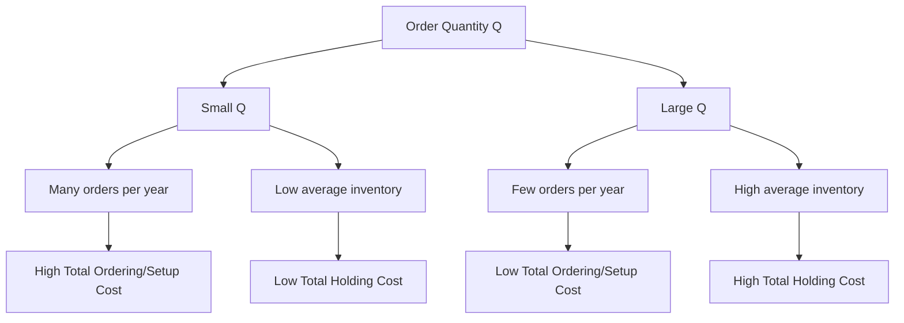

## Ordering and Setup Costs

### Definition

Ordering costs (in a procurement context) and setup costs (in a manufacturing context) are the fixed costs incurred each time a replenishment action is initiated, independent of the quantity ordered or produced. These costs are one of the two primary cost drivers — alongside holding cost — in the fundamental inventory trade-off that determines optimal batch/order size.

**Ordering cost**: The cost incurred each time a purchase order is placed with an external supplier.

**Setup (changeover) cost**: The cost incurred each time a production line is reconfigured to produce a different item or begin a new production run.

Both are treated mathematically identically in inventory models — as a fixed cost $S$ incurred per order/batch, independent of order size — which is why they are typically grouped together as a single cost category in classical inventory theory (e.g., in the EOQ model).

### Components of Ordering Cost

Ordering cost is not simply the price of the purchase order form — it encompasses the full administrative and transactional burden of executing a replenishment:

- **Requisition and purchase order processing**: labor time for procurement staff to create, review, and approve a PO
- **Supplier communication and negotiation**: time spent contacting suppliers, requesting quotes, negotiating terms
- **Receiving and inspection**: labor and administrative cost to receive, count, and quality-check incoming shipments
- **Invoice processing and accounts payable matching**: three-way matching of PO, receipt, and invoice
- **Transportation/freight costs directly tied to the order** (when charged per shipment rather than per unit)
- **IT/EDI transaction costs**: system costs for electronic data interchange or ERP transaction processing

### Components of Setup Cost

Setup cost in a manufacturing context includes:

- **Machine changeover/reconfiguration time**: labor and lost production time while equipment is retooled for a different product
- **Tooling and die changes**: physical replacement of molds, dies, or fixtures
- **Calibration and quality verification**: time to run test pieces and verify the process is in control after changeover
- **Cleaning costs**: particularly significant in food, pharmaceutical, and chemical processing, where cross-contamination must be prevented between batches
- **Lost production capacity**: the opportunity cost of machine time consumed by changeover rather than production (often the single largest component)

### Mathematical Treatment

In the Economic Order Quantity (EOQ) model, ordering/setup cost enters as the term that decreases with order size (since fewer, larger orders reduce the number of setups/orders needed per year):

$$\text{Annual Ordering/Setup Cost} = \frac{D}{Q} \times S$$

where:

- $D$ = annual demand (units/year)
- $Q$ = order quantity (units per order)
- $S$ = fixed cost per order or setup ($)

This cost decreases as $Q$ increases (fewer orders needed per year), which is precisely why it must be balanced against holding cost, which increases with $Q$:

$$\text{Annual Holding Cost} = \frac{Q}{2} \times H$$

Setting the two cost curves equal and solving for the cost-minimizing quantity yields the EOQ formula:

$$Q^* = \sqrt{\frac{2DS}{H}}$$

### The Cost Trade-off Curve

The total relevant cost curve is U-shaped in $Q$ precisely because ordering/setup cost and holding cost move in opposite directions as $Q$ changes — the minimum of this U-shaped curve is the EOQ.

### Fixed vs. Variable Nature

A defining characteristic of ordering/setup cost is that it is treated as **fixed per event, not per unit**. This distinguishes it clearly from:

- **Unit purchase price**: cost per unit of the item itself, which is typically constant (unless quantity discounts apply) and does not depend on batch size
- **Holding cost**: cost per unit per unit of time, which depends on how much and how long inventory is held

[Inference] In real-world settings, ordering cost is not always perfectly fixed per order — some components (e.g., transportation cost) may scale partially with order size if shipments are consolidated or split, so the assumption of a pure fixed cost per order is a simplification made for tractability in classical models, not a universal empirical fact.

### Reducing Ordering and Setup Costs (SMED and Lean Connections)

Because setup cost is a major driver of minimum economical batch size, reducing it directly enables smaller, more frequent batches — which in turn reduces average inventory and increases flexibility. This is the core motivation behind:

**Single-Minute Exchange of Die (SMED)**

A Lean manufacturing methodology developed by Shigeo Shingo specifically to reduce changeover/setup time, distinguishing between:

- **Internal setup**: activities that can only be performed while the machine is stopped
- **External setup**: activities that can be performed while the machine is still running the previous batch (prepared in advance)

By converting internal setup activities to external ones (preparing tooling, materials, and specifications in advance), SMED reduces the effective setup cost $S$, which lowers the EOQ and enables smaller batch sizes — directly linking cost-reduction efforts on the shop floor to inventory theory.

**Electronic Data Interchange (EDI) and Procurement Automation**

On the ordering-cost side, automating purchase order creation, approval routing, and invoice matching (via ERP/EDI systems) reduces the administrative labor cost per order, similarly lowering $S$ and enabling more frequent, smaller replenishment orders — a key enabler of Just-in-Time procurement.

### Comparison Table

| Aspect | Ordering Cost | Setup Cost |
| --- | --- | --- |
| Context | Procurement (external supplier) | Manufacturing (internal production) |
| Primary components | PO processing, receiving, inspection, AP matching | Changeover labor, tooling, lost capacity, calibration |
| Reduction lever | EDI/procurement automation, supplier consolidation | SMED, standardized tooling, dedicated production lines |
| Mathematical treatment in EOQ | Fixed cost $S$ per order | Fixed cost $S$ per setup |
| Typical measurement unit | $ per purchase order | $ per production changeover (often converted from lost machine-hours) |

### Example

A bakery manufacturer produces two products on the same production line: white bread and whole wheat bread. Switching between them requires cleaning the mixing equipment and recalibrating the oven temperature profile, consuming 45 minutes of production time.

If the line's contribution margin is $200/hour, the setup cost per changeover is approximately:

$$S = 0.75 \text{ hours} \times \$200/\text{hour} = \$150 \text{ per setup}$$

If annual demand for whole wheat bread is $D = 50{,}000$ units and holding cost is $H = \$0.60$/unit/year:

$$Q^* = \sqrt{\frac{2 \times 50{,}000 \times 150}{0.60}} = \sqrt{25{,}000{,}000} \approx 5{,}000 \text{ units per batch}$$

If the bakery invests in a SMED program that reduces changeover time from 45 minutes to 15 minutes, the setup cost falls to $50, and the new EOQ becomes:

$$Q^{*}_{\text{new}} = \sqrt{\frac{2 \times 50{,}000 \times 50}{0.60}} \approx 2{,}887 \text{ units per batch}$$

This demonstrates directly how reducing setup cost through process improvement (SMED) allows the bakery to run smaller, more frequent batches — improving flexibility and reducing average inventory — without violating the cost-minimization logic of the EOQ model.

[Inference] The specific labor rate, contribution margin, and changeover time in this example are illustrative figures for demonstration purposes rather than derived from an actual production facility.

### Key Points

- Ordering cost (procurement context) and setup cost (manufacturing context) are mathematically treated identically — as a fixed cost incurred per replenishment event, independent of quantity
- This cost decreases in total annual terms as order/batch size increases (fewer orders/setups per year), which is why it must be balanced against holding cost in the EOQ model
- Reducing setup cost (via SMED) or ordering cost (via procurement automation/EDI) directly lowers the economically optimal batch size, enabling smaller, more frequent replenishment — a key enabler of JIT and Lean strategies
- The "fixed per order" assumption is a modeling simplification; in practice some cost components may partially scale with order size

**Related Topics**

- Economic Order Quantity (EOQ) model derivation and sensitivity analysis
- Single-Minute Exchange of Die (SMED) methodology
- Holding (carrying) cost components
- Quantity discount models and their interaction with ordering cost
- Just-in-Time (JIT) procurement and small-batch production strategies