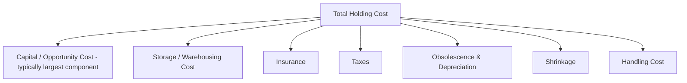
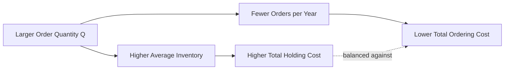

## Holding and Carrying Costs

### Definition

Holding cost (also called carrying cost) is the total cost incurred by a firm for keeping inventory in storage over a period of time. It represents the second of the two primary cost drivers — alongside ordering/setup cost — in the fundamental inventory trade-off underlying classical inventory models such as EOQ and safety stock optimization.

Unlike ordering/setup cost, which is fixed per event, holding cost is a **per-unit, per-time-period** cost: it accrues continuously for every unit sitting in inventory, for as long as it sits there.

$$\text{Total Annual Holding Cost} = \frac{Q}{2} \times H$$

where $Q$ is the order quantity (with $Q/2$ representing average cycle inventory under standard EOQ assumptions) and $H$ is the holding cost per unit per year.

### Components of Holding Cost

Holding cost is a composite of several distinct cost categories, often expressed as a percentage of unit value (the **holding cost rate**, typically 15–35% of item value annually in many industries, though this varies significantly by sector). [Inference] The specific percentage range cited is a commonly referenced industry rule of thumb rather than a fixed constant; actual holding cost rates vary substantially by industry, product category, and capital cost environment.

**1. Capital (Opportunity) Cost**

The cost of capital tied up in inventory rather than available for other investments — typically the largest single component of holding cost. Calculated as:

$$\text{Capital Cost} = \text{Inventory Value} \times \text{Cost of Capital (WACC or hurdle rate)}$$

**2. Storage/Warehousing Cost**

Physical space cost: rent or depreciation on warehouse facilities, utilities, racking/shelving systems, and material handling equipment allocated to storing the inventory.

**3. Insurance Cost**

Premiums paid to insure inventory against loss from fire, theft, flood, or other damage — scales with the value of inventory held.

**4. Taxes**

Property taxes assessed on inventory value in jurisdictions that tax business personal property, and other inventory-related tax liabilities.

**5. Obsolescence and Depreciation**

The risk-adjusted cost of inventory losing value over time due to model changes, technological obsolescence, expiration (for perishables), or fashion/seasonal irrelevance.

**6. Shrinkage**

Loss of inventory due to theft, damage, administrative error, or spoilage — typically expressed as a percentage of inventory value.

**7. Handling Cost**

Labor and equipment cost associated with moving, counting, and maintaining inventory while it is in storage (distinct from receiving/shipping, which is often allocated to ordering cost).

### Holding Cost Rate Formula

$$H = i \times C$$

where:

- $i$ = holding cost rate (annual percentage of unit value, combining capital cost, storage, insurance, taxes, obsolescence, and shrinkage)
- $C$ = unit cost (purchase or production cost per unit)

This formulation is important because it means holding cost is **proportional to the value of the item**, not simply its physical size or weight — a high-value electronics component incurs far more holding cost per unit than a low-value commodity item of similar physical footprint, primarily because the capital cost component dominates.

### Cost Composition Breakdown

### Holding Cost in the EOQ Trade-off

Holding cost increases linearly with order quantity $Q$ (since larger orders mean more average inventory on hand), which is precisely why it must be balanced against ordering/setup cost, which decreases with $Q$:

Setting the marginal increase in holding cost equal to the marginal decrease in ordering cost yields the Economic Order Quantity:

$$Q^* = \sqrt{\frac{2DS}{H}}$$

Note that $H$ appears in the denominator: **higher holding cost drives the optimal order quantity down** (favoring smaller, more frequent orders), while higher ordering cost drives it up (favoring larger, less frequent orders) — the two costs pull in opposite directions on order size.

### Holding Cost in Safety Stock Decisions

Holding cost also directly determines the cost side of the service-level trade-off in safety stock models. The marginal cost of carrying one additional unit of safety stock is exactly $H$ per year, which is weighed against the marginal reduction in expected stockout cost:

$$\text{Optimal Service Level: } P(\text{stockout}) = \frac{H}{H + p}$$

where $p$ is the unit shortage/stockout cost (this is the newsvendor-style critical ratio, covered in depth in the safety stock chapters). A higher holding cost $H$ relative to shortage cost $p$ pushes the optimal service level downward — it becomes less economical to carry extra safety stock when holding cost is high relative to the cost of occasionally running short.

### Category-Specific Holding Cost Considerations

| Inventory Category | Dominant Holding Cost Component | Notes |
| --- | --- | --- |
| High-value electronics | Capital/opportunity cost | Value depreciates fast; obsolescence risk is significant |
| Perishable food/pharma | Obsolescence (expiration) | Holding cost effectively becomes near-total loss past expiry |
| Bulk commodities (steel, grain) | Storage/warehousing | Low unit value but large physical footprint |
| Fashion/seasonal apparel | Obsolescence (markdown risk) | Value drops sharply after the selling season ends |
| Hazardous materials | Insurance and regulatory compliance | Specialized storage and handling requirements inflate cost |

### Common Estimation Approach

In practice, many firms estimate holding cost rate ($i$) by summing component percentages:

| Component | Typical Range (% of unit value/year) |
| --- | --- |
| Cost of capital | 8–15% |
| Storage/warehousing | 2–5% |
| Insurance and taxes | 1–3% |
| Obsolescence/shrinkage | 2–10% (highly category-dependent) |
| **Total holding cost rate** | **~15–35%** |

[Unverified] These percentage ranges are commonly cited industry approximations found in operations management literature and practitioner guidance; they are not universal constants, and a firm should derive its own rate from actual cost accounting data (cost of capital, actual warehouse lease/utility costs, historical shrinkage and obsolescence write-off rates) rather than relying solely on generic benchmarks.

### Example

A distributor stocks a mid-range kitchen appliance with a unit cost $C = \$120$. The firm's cost of capital is 10%, warehousing cost is estimated at 4% of unit value annually, insurance/taxes at 2%, and historical obsolescence/shrinkage losses average 3% annually for this product category.

$$i = 10\% + 4\% + 2\% + 3\% = 19\%$$

$$H = i \times C = 0.19 \times \$120 = \$22.80 \text{ per unit per year}$$

If annual demand is $D = 8{,}000$ units and ordering cost is $S = \$75$ per order:

$$Q^* = \sqrt{\frac{2 \times 8{,}000 \times 75}{22.80}} = \sqrt{52{,}631.6} \approx 229 \text{ units per order}$$

If the same product's holding cost rate rose to 30% (e.g., due to a spike in the firm's cost of capital), the new holding cost would be $H = 0.30 \times 120 = \$36$/unit/year, and the new EOQ would fall to:

$$Q^{*}_{\text{new}} = \sqrt{\frac{2 \times 8{,}000 \times 75}{36}} \approx 183 \text{ units per order}$$

This demonstrates the direct, inverse relationship between holding cost and optimal batch size — as capital becomes more expensive, the firm is economically incentivized to hold less inventory and order more frequently.

[Inference] The unit cost, cost-of-capital rate, and category-specific percentages in this example are illustrative figures chosen for demonstration; actual values should be derived from a firm's specific financial and operational cost data.

### Key Points

- Holding cost accrues continuously per unit per time period, in contrast to the fixed, per-event nature of ordering/setup cost
- Holding cost is typically expressed as a rate ($i$) applied to unit value ($C$), meaning high-value items incur disproportionately higher holding cost than low-value items of similar physical size
- Capital/opportunity cost is usually the largest single component of total holding cost
- Holding cost appears in the denominator of the EOQ formula — higher holding cost drives optimal order quantity down, favoring smaller, more frequent orders
- Holding cost directly determines the cost side of the service-level trade-off in safety stock models via the critical ratio $H/(H+p)$

**Related Topics**

- Economic Order Quantity (EOQ) model and sensitivity to cost parameters
- Ordering and setup costs
- The newsvendor model and the critical ratio for optimal service level
- Obsolescence and shrinkage measurement methods
- Cost of capital (WACC) and its role in inventory valuation decisions
- ABC analysis for prioritizing holding cost reduction efforts by item value