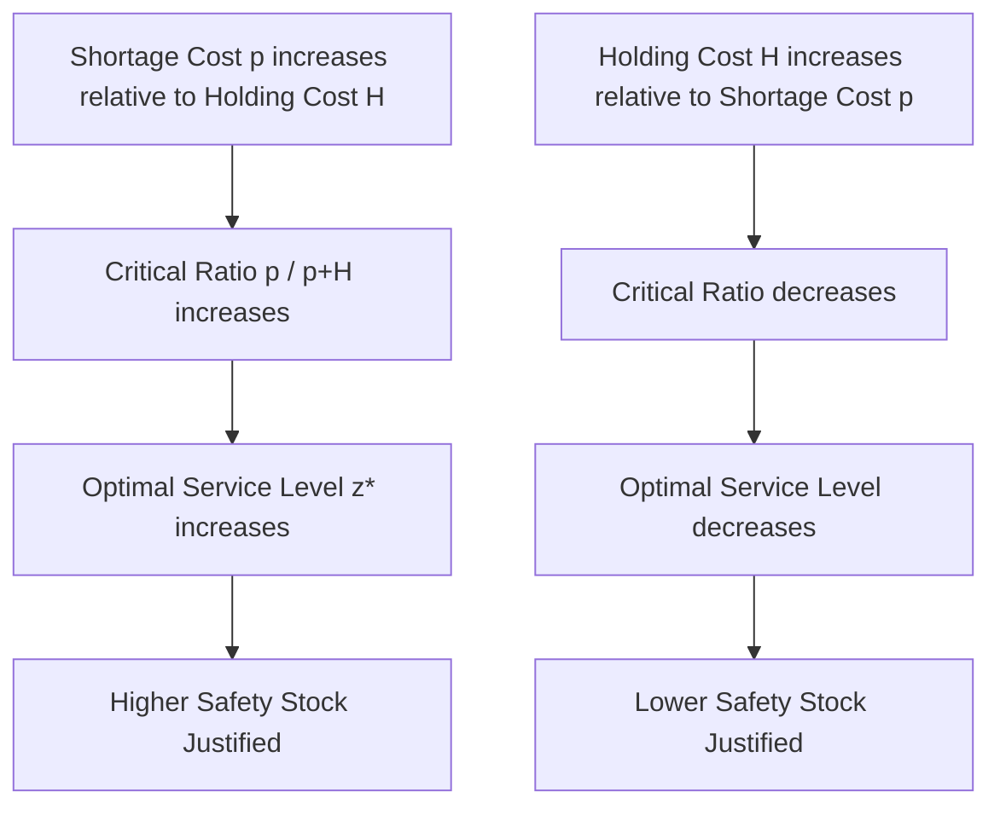

## Stockout and Shortage Costs

### Definition

Stockout cost (also called shortage cost) is the cost incurred when demand for an item exceeds available inventory, resulting in an inability to fulfill an order at the moment it is requested. It is the third major cost category in the fundamental inventory cost trade-off, alongside holding cost and ordering/setup cost, and it is generally the most difficult of the three to measure precisely.

$$\text{Total Relevant Cost} = \text{Holding Cost} + \text{Ordering/Setup Cost} + \text{Stockout Cost}$$

Stockout cost is the cost force that pushes inventory levels *up* (favoring higher safety stock and service levels), directly counterbalancing holding cost, which pushes inventory levels *down*.

### Two Fundamental Demand Response Scenarios

The nature and magnitude of stockout cost depends critically on how customers respond when a stockout occurs:

**1. Backorder (Backlog) Case**

The customer is willing to wait, and the sale is not lost — it is merely delayed until inventory is replenished. Cost consists of:

- Expediting costs to fulfill the backorder as quickly as possible (rush shipping, rush production)
- Administrative cost of managing the backorder
- Some goodwill/relationship cost, even though the sale is eventually completed

**2. Lost Sale Case**

The customer, faced with unavailability, takes their business elsewhere (to a competitor or substitute product) rather than waiting. This is the more costly and more common scenario in competitive retail/consumer contexts. Cost consists of:

- The lost contribution margin on that specific transaction
- Potential lost future business if the customer's loyalty is damaged (a much harder cost to quantify)
- Negative word-of-mouth or reputational effects at scale

### Components of Stockout Cost

**1. Lost Contribution Margin**

The most directly quantifiable component — the profit margin the firm would have earned on the unfulfilled sale:

$$\text{Lost Margin per Unit} = \text{Selling Price} - \text{Variable Cost}$$

**2. Expediting and Emergency Replenishment Cost**

Rush freight charges, overtime production labor, emergency supplier premiums — costs incurred specifically to shorten the shortage duration.

**3. Contractual Penalty Costs**

In B2B and government contracting contexts, explicit penalty clauses (e.g., liquidated damages for late delivery) may apply, making this component directly quantifiable in dollar terms.

**4. Customer Goodwill and Loyalty Erosion**

The long-term revenue impact of a customer's diminished trust or willingness to purchase again — inherently difficult to measure and typically estimated indirectly (e.g., via customer lifetime value models or churn analysis) rather than observed directly.

**5. Downstream Production Disruption Cost**

In a manufacturing or MRO context, a stockout of a critical component can halt an entire production line, creating costs far exceeding the value of the missing item itself (e.g., idle labor, missed delivery commitments to the firm's own customers).

### Why Stockout Cost Is Hard to Measure

Unlike holding cost (largely observable through accounting data) and ordering cost (traceable through process time studies), stockout cost — particularly the goodwill/loyalty component — is often **not directly observable** because:

- The lost future revenue from a dissatisfied customer is counterfactual (what would have happened absent the stockout)
- Customer response to stockouts varies by product category, brand loyalty, and availability of substitutes
- Firms often lack systematic tracking of stockout incidents and their downstream effects on customer retention

[Inference] Because of this measurement difficulty, many firms in practice sidestep explicit stockout cost estimation entirely and instead specify a target service level directly (e.g., "maintain a 98% fill rate") — using the service-level-constrained inventory model rather than the cost-minimization model that would require an explicit stockout cost input.

### The Critical Ratio (Newsvendor Model Connection)

When stockout cost *can* be estimated, classical inventory theory provides a direct link between the ratio of holding cost to shortage cost and the cost-optimal service level, via the **critical ratio** from the newsvendor model:

$$\text{Critical Ratio} = \frac{p}{p + H}$$

where $p$ is the shortage cost per unit and $H$ is the holding cost per unit. The critical ratio equals the cost-optimal probability of *not* stocking out (the cycle service level), found via the inverse standard normal distribution:

$$z^* = \Phi^{-1}\left(\frac{p}{p+H}\right)$$

This formula makes explicit the trade-off structure: as shortage cost $p$ increases relative to holding cost $H$, the critical ratio approaches 1, and the optimal service level rises toward 100%. Conversely, as holding cost dominates, the optimal service level falls, since it becomes more economical to occasionally stock out than to carry the additional inventory needed to prevent it.

### Stockout Cost vs. Service Level Metrics

In practice, stockout cost connects to two commonly used operational service metrics (covered in depth in the safety stock chapters):

| Metric | Definition | Relationship to Stockout Cost |
| --- | --- | --- |
| Cycle Service Level (CSL) | Probability of NOT stocking out during a single replenishment cycle | Directly set by the critical ratio when $p$ and $H$ are known |
| Fill Rate | Percentage of demand units fulfilled directly from stock | More directly tied to actual lost-sale volume/revenue than CSL |

Because fill rate more directly measures the *volume* of unmet demand (rather than just the probability of any shortfall occurring), it is often the more relevant metric when stockout cost is expressed per unit of unmet demand rather than per stockout *event*.

### Comparison: Backorder vs. Lost Sale Cost Structures

| Aspect | Backorder Case | Lost Sale Case |
| --- | --- | --- |
| Sale outcome | Delayed, eventually fulfilled | Permanently lost |
| Primary cost driver | Expediting/rush cost | Lost contribution margin |
| Typical industry context | B2B, industrial/MRO parts, made-to-order goods | Retail, e-commerce, fast-moving consumer goods |
| Customer behavior assumption | Willing to wait | Substitutes to competitor/alternative |
| Magnitude relative to holding cost | Often lower | Often significantly higher |

### Example

An online retailer sells a popular kitchen gadget with a selling price of $45 and a variable cost of $25, giving a contribution margin of $20/unit. The retailer estimates that when this specific item stocks out, approximately 70% of customers immediately purchase a competitor's equivalent product rather than waiting (a lost sale), while the remaining 30% place a backorder.

Blended stockout cost per unit is approximately:

$$p = (0.70 \times \$20) + (0.30 \times \$8 \text{ estimated expediting/goodwill cost}) = \$14 + \$2.40 = \$16.40$$

If the item's holding cost is $H = \$6$/unit/year, the critical ratio is:

$$\frac{p}{p+H} = \frac{16.40}{16.40 + 6} = 0.732$$

$$z^* = \Phi^{-1}(0.732) \approx 0.62$$

This corresponds to a cost-optimal cycle service level of approximately 73%, which the retailer would then use to size safety stock via $SS = z^* \times \sigma_{LT}$.

[Inference] The 70/30 backorder-versus-lost-sale split and the $8 estimated goodwill/expediting cost in this example are illustrative assumptions; in practice, these figures would need to be estimated from customer behavior data, surveys, or historical sales-recovery analysis, and are among the most uncertain inputs in any inventory cost model.

### Key Points

- Stockout cost is the cost force pushing inventory levels up, counterbalancing holding cost, which pushes them down
- The cost structure differs substantially between backorder scenarios (delayed sale, primarily expediting cost) and lost-sale scenarios (permanently lost margin, plus harder-to-quantify goodwill erosion)
- Stockout cost is inherently the hardest of the three major inventory costs to measure precisely, particularly the customer goodwill/loyalty component
- When stockout cost can be estimated, the newsvendor critical ratio $p/(p+H)$ directly determines the cost-optimal service level
- Because of measurement difficulty, many firms bypass explicit stockout cost estimation and instead specify a target service level directly as a policy constraint

**Related Topics**

- The newsvendor model and critical ratio derivation
- Cycle service level vs. fill rate as safety stock design metrics
- Safety stock calculation under demand and lead-time uncertainty
- Customer lifetime value (CLV) as an approach to estimating goodwill cost
- Backorder management and expedited replenishment strategies