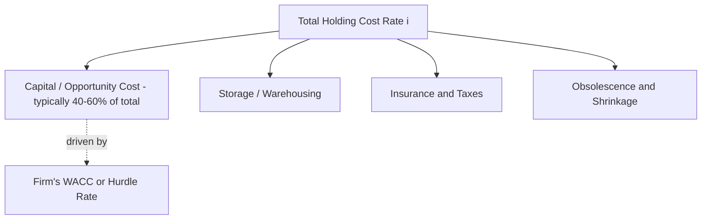

## Capital and Opportunity Cost of Inventory

### Definition

Capital cost — also referred to as the opportunity cost of inventory investment — is the cost associated with funds tied up in inventory that could otherwise be deployed toward alternative productive uses, such as other investments, debt reduction, or operational initiatives. It is typically the single largest component of total holding cost, and understanding it in isolation is essential because it connects inventory decisions directly to corporate finance concepts rather than treating inventory purely as an operations problem.

$$\text{Capital Cost} = \text{Inventory Investment Value} \times \text{Cost of Capital}$$

### Conceptual Basis: Opportunity Cost

The economic principle underlying capital cost is opportunity cost: money invested in inventory is money that cannot simultaneously be invested elsewhere. If a firm could earn a 12% return by deploying capital into another project (or by using it to pay down debt bearing 8% interest, or by returning it to shareholders who could reinvest at their own required rate of return), then holding $1 of inventory for a year "costs" the firm the foregone return it could have earned on that dollar elsewhere.

This is distinct from an *accounting* cost (like insurance premiums or warehouse rent) — no invoice arrives for opportunity cost. It is nonetheless a real economic cost that rational capital allocation must account for.

### Determining the Appropriate Capital Cost Rate

The rate used to quantify capital cost should reflect the firm's cost of capital — typically the **Weighted Average Cost of Capital (WACC)**:

$$WACC = \left(\frac{E}{V}\right) \times r_e + \left(\frac{D}{V}\right) \times r_d \times (1 - T)$$

where:

- $E$ = market value of equity, $D$ = market value of debt, $V = E + D$
- $r_e$ = cost of equity, $r_d$ = cost of debt
- $T$ = corporate tax rate

**Alternative rate choices** some firms use instead of WACC:

- **Hurdle rate**: an internally set minimum required rate of return for capital projects, often set above WACC to account for project-specific risk
- **Incremental borrowing rate**: the rate at which the firm could borrow additional short-term funds, relevant when inventory financing is explicitly debt-funded (e.g., via a revolving credit facility)
- **Return on invested capital (ROIC) benchmark**: some firms use their target ROIC as a proxy, reflecting what the capital "should" be earning if deployed in the core business

[Inference] The choice among these alternatives is a matter of financial policy rather than a settled methodological consensus — WACC is the textbook-standard approach for evaluating capital allocation, but firms with significant liquidity constraints sometimes use a higher rate that reflects the marginal cost of the specific financing source funding the inventory.

### Why Capital Cost Dominates Total Holding Cost

Recall the holding cost rate decomposition:

$$i = i_{\text{capital}} + i_{\text{storage}} + i_{\text{insurance/tax}} + i_{\text{obsolescence/shrinkage}}$$

In most industries, $i_{\text{capital}}$ (typically 8–15% for firms with moderate-to-average cost of capital) represents 40–60% or more of the total holding cost rate, particularly for high-value, low-bulk items where storage and handling costs are proportionally small relative to unit value. This is why capital cost deserves separate, explicit treatment rather than being buried inside a generic "holding cost" assumption — errors in the cost-of-capital estimate propagate directly and significantly into EOQ and safety stock calculations.

### Inventory's Role in the Cash Conversion Cycle

Capital tied up in inventory is a central driver of the **Cash Conversion Cycle (CCC)**, a key working capital efficiency metric:

$$CCC = DSI + DSO - DPO$$

where:

- $DSI$ (Days Sales of Inventory) $= 365 / \text{Inventory Turnover} = 365 \times \frac{\text{Average Inventory}}{\text{COGS}}$
- $DSO$ (Days Sales Outstanding) = average collection period for receivables
- $DPO$ (Days Payable Outstanding) = average payment period to suppliers

A longer $DSI$ (more days of inventory on hand) directly extends the CCC, meaning capital is tied up longer before it converts back into cash — this is precisely the mechanism through which inventory decisions affect a firm's overall capital efficiency and liquidity position.

$$\text{Capital Tied Up} = \text{Average Inventory Value} \times \left(\frac{DSI}{365}\right) \times WACC$$

### Sensitivity of Inventory Policy to Capital Cost Assumptions

Because capital cost enters directly into $H$ in both the EOQ and safety stock formulas, changes in a firm's cost of capital have a direct, quantifiable effect on optimal inventory policy:

$$Q^* = \sqrt{\frac{2DS}{H}} \quad \Rightarrow \quad Q^* \propto \frac{1}{\sqrt{H}}$$

Since $Q^*$ is inversely proportional to the *square root* of $H$, a doubling of holding cost (e.g., driven by a sharp rise in interest rates affecting the firm's cost of capital) does not double the optimal reduction in order quantity — it reduces $Q^*$ by a factor of $\sqrt{2} \approx 1.41$. This square-root relationship is a structurally important property: inventory policy is *less* sensitive to capital cost changes than a naive linear intuition would suggest, though the direction of the effect (higher capital cost → smaller optimal batches, lower safety stock) is unambiguous.

### Macroeconomic Context: Interest Rate Sensitivity

Because capital cost is tied to prevailing interest rates and a firm's borrowing costs, inventory policy is indirectly sensitive to the broader interest rate environment:

- In **rising interest rate environments**, WACC typically increases (higher cost of debt, and often higher required equity returns due to higher risk-free rates), which increases $H$, which — per the EOQ and safety stock relationships above — pushes firms toward smaller order quantities and lower safety stock, all else equal
- In **falling interest rate environments**, the reverse holds, making it more economical to carry larger inventory positions

[Inference] This connection is a theoretical implication of the cost formulas rather than a claim that firms mechanically re-optimize inventory policy in real time as interest rates move; in practice, many firms review holding cost assumptions only periodically (e.g., annually), so realized inventory policy may lag the theoretical optimum during periods of rapid rate change.

### Capital Cost vs. Other Holding Cost Components

| Component | Nature | Observability | Typical Magnitude (% of unit value/year) |
| --- | --- | --- | --- |
| Capital/opportunity cost | Economic (non-cash) | Requires WACC/hurdle rate estimation | 8–15% |
| Storage/warehousing | Accounting (cash) | Directly observable via facility costs | 2–5% |
| Insurance/taxes | Accounting (cash) | Directly observable via premiums/assessments | 1–3% |
| Obsolescence/shrinkage | Accounting (realized loss) | Observable via write-off history | 2–10% |

The key distinction: capital cost is the only major holding-cost component that does not appear as a direct cash outflow on the income statement, making it the component most likely to be underestimated or omitted entirely in unsophisticated cost models — a common practical pitfall.

### Example

A mid-sized distributor holds average inventory valued at $4,000,000. The firm's WACC is calculated at 11%, based on a capital structure of 60% equity (cost of equity 14%) and 40% debt (cost of debt 6%, tax rate 25%):

$$WACC = (0.60 \times 0.14) + (0.40 \times 0.06 \times (1-0.25)) = 0.084 + 0.018 = 10.2\%$$

Annual capital cost of inventory:

$$\text{Capital Cost} = \$4{,}000{,}000 \times 0.102 = \$408{,}000 \text{ per year}$$

If the firm's DSI is 60 days (inventory turns roughly 6 times per year), this represents the ongoing opportunity cost of capital tied up for an average of 60 days per inventory cycle — capital that could alternatively fund expansion, debt reduction, or be returned to shareholders.

If the firm undertakes an initiative to reduce average inventory to $3,000,000 (e.g., through improved demand forecasting and safety stock optimization) while maintaining service levels, the annual capital cost saving is:

$$\Delta \text{Capital Cost} = (\$4{,}000{,}000 - \$3{,}000{,}000) \times 0.102 = \$102{,}000 \text{ per year}$$

This example illustrates why inventory reduction initiatives are frequently justified in financial rather than purely operational terms — the capital cost savings flow directly to the firm's cost structure and can materially affect return on invested capital (ROIC).

[Inference] The specific capital structure, cost of equity, and cost of debt figures in this example are illustrative; actual WACC calculations require current market data on a firm's specific equity beta, risk-free rate, and credit spread.

### Key Points

- Capital cost represents the opportunity cost of funds tied up in inventory rather than deployed to alternative uses, and is typically the largest single component of total holding cost
- Unlike storage, insurance, or shrinkage costs, capital cost is a non-cash economic cost, making it the component most often underestimated in unsophisticated inventory cost models
- The appropriate rate is generally the firm's WACC, though hurdle rates or incremental borrowing rates are sometimes used depending on financial policy
- Capital cost directly links inventory policy to the Cash Conversion Cycle and broader working capital efficiency metrics
- Because $Q^*$ is inversely proportional to $\sqrt{H}$, inventory policy responds to capital cost changes, but less than proportionally — a structurally dampened, not linear, relationship

**Related Topics**

- Holding and carrying costs (full cost decomposition)
- Weighted Average Cost of Capital (WACC) calculation
- Cash Conversion Cycle (CCC) and working capital management
- Economic Order Quantity (EOQ) sensitivity analysis
- Inventory turnover and Days Sales of Inventory (DSI) as financial KPIs