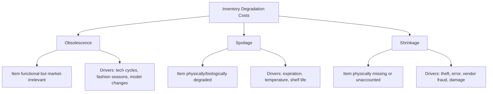

## Obsolescence, Spoilage, and Shrinkage Costs

### Definition

Obsolescence, spoilage, and shrinkage costs represent the loss of inventory value that occurs while goods sit in storage — distinct from capital cost (the cost of *money* tied up) and storage cost (the cost of *physical space*). These are the components of holding cost that arise specifically because inventory *degrades*, *becomes irrelevant*, or *disappears* over time, rather than because it is simply present.

$$i_{\text{degradation}} = i_{\text{obsolescence}} + i_{\text{spoilage}} + i_{\text{shrinkage}}$$

Although grouped together here because they share the common feature of being loss-of-value costs tied to time and physical risk, each has a distinct cause and requires a distinct mitigation strategy.

### Obsolescence Cost

**Definition**: The loss in value of inventory because it becomes technologically outdated, is superseded by a newer model, or falls out of market relevance — even though the physical item itself remains fully functional and undamaged.

**Primary drivers:**

- Technology product cycles (e.g., electronics, software-embedded hardware)
- Fashion and seasonal cycles (apparel, seasonal goods)
- Regulatory or specification changes that render a product non-compliant
- Model year transitions (automotive, consumer durables)

**Cost manifestation:**

- Markdown losses (selling at a discount to clear obsolete stock)
- Complete write-offs when items become entirely unsellable
- Reverse logistics/disposal costs

**Quantification approach:**

$$\text{Expected Obsolescence Cost} = \sum_{t} P(\text{obsolete at time } t) \times (\text{Unit Cost} - \text{Expected Salvage Value})$$

In practice, obsolescence risk is often modeled via a product lifecycle curve, where the probability of obsolescence increases sharply near a known "cliff" event (e.g., a successor product launch date) rather than accumulating smoothly over time.

### Spoilage Cost

**Definition**: The loss of inventory value due to physical or biological degradation over time — applicable specifically to perishable goods (food, pharmaceuticals, chemicals with limited shelf life, certain biological materials).

**Primary drivers:**

- Fixed shelf life / expiration dating
- Temperature, humidity, or handling sensitivity
- Chemical or biological degradation processes

**Cost manifestation:**

- Total write-off of expired stock
- Reduced sale value for near-expiry stock (secondary markets, discount channels)
- Regulatory disposal costs (particularly for pharmaceuticals and food safety compliance)

**Key connection — the Newsvendor Model**: Perishable inventory with a fixed shelf life and a single ordering opportunity per period is the classic application domain of the **newsvendor model**, where the critical ratio directly incorporates the cost of unsold, spoiled inventory ($c_o$, overage cost) against the cost of running short ($c_u$, underage cost):

$$\text{Critical Ratio} = \frac{c_u}{c_u + c_o}$$

For highly perishable goods, $c_o$ (essentially the full unit cost, since spoiled stock typically has near-zero salvage value) tends to be large relative to typical shortage cost, which drives the newsvendor-optimal service level below what would apply to a non-perishable item of similar demand characteristics.

### Shrinkage Cost

**Definition**: The loss of inventory that is unaccounted for through normal sales or documented waste — the discrepancy between recorded (book) inventory and actual physical inventory.

**Primary drivers (commonly categorized in retail loss-prevention literature):**

- **Theft**: external (shoplifting) and internal (employee theft)
- **Administrative/clerical error**: miscounts, data entry errors, receiving discrepancies, pricing errors
- **Vendor fraud**: short shipments or invoice discrepancies from suppliers
- **Operational damage**: breakage, mishandling during storage or transport not otherwise captured as spoilage

**Measurement:**

$$\text{Shrinkage Rate} = \frac{\text{Book Inventory} - \text{Physical Inventory Count}}{\text{Book Inventory}} \times 100\%$$

[Unverified] Retail industry benchmarks commonly cited in loss-prevention literature place average shrinkage in the range of roughly 1–2% of sales for general merchandise retailers, though this varies substantially by category (e.g., cosmetics, electronics, and apparel with high resale value typically show higher shrinkage rates than bulky, low-value goods) and should not be treated as a universal constant without validation against a firm's own physical inventory audits.

### Comparative Summary

| Aspect | Obsolescence | Spoilage | Shrinkage |
| --- | --- | --- | --- |
| Physical state of item | Intact, functional | Degraded, unsellable | Missing entirely |
| Root cause | Market/technology change | Time + environmental exposure | Theft, error, damage |
| Detection method | Sales velocity decline, lifecycle tracking | Expiration date tracking | Physical count vs. book reconciliation |
| Primary mitigation | Demand sensing, shorter lead times, markdown optimization | FIFO/FEFO rotation, cold chain management | Loss prevention, cycle counting, access control |
| Typical affected categories | Electronics, fashion, automotive | Food, pharma, chemicals | High-value/small/resellable items (retail) |

### Mitigation Strategies

**For Obsolescence:**

- Reduce forecast horizon and lead time to minimize speculative inventory exposed to lifecycle risk
- Implement postponement strategies (delaying product differentiation as late as possible in the supply chain)
- Use markdown optimization models to clear aging stock before it reaches zero salvage value
- Monitor sales velocity decay as an early warning signal ahead of full obsolescence

**For Spoilage:**

- **FIFO (First-In, First-Out)** or **FEFO (First-Expired, First-Out)** inventory rotation policies
- Cold chain and environmental control investment where degradation is temperature-driven
- Dynamic pricing/markdown triggers tied to remaining shelf life
- Tighter lot-sizing (smaller, more frequent orders) to reduce average age of stock on hand — directly connecting to the EOQ ordering-cost/holding-cost trade-off, since perishability effectively raises the holding cost rate $i$

**For Shrinkage:**

- Physical security measures (surveillance, electronic article surveillance tags, access controls)
- Regular cycle counting and reconciliation processes to detect discrepancies early
- Vendor compliance audits to catch systematic short-shipment issues
- Process controls and segregation of duties in receiving/put-away to reduce administrative error

### Impact on the Holding Cost Rate

These three cost categories are typically the most volatile and category-specific components of the overall holding cost rate $i$, in contrast to the relatively stable capital cost and storage cost components:

$$i = \underbrace{i_{\text{capital}}}_{\text{stable, market-driven}} + \underbrace{i_{\text{storage}}}_{\text{stable, facility-driven}} + \underbrace{i_{\text{insurance/tax}}}_{\text{stable}} + \underbrace{(i_{\text{obsolescence}} + i_{\text{spoilage}} + i_{\text{shrinkage}})}_{\text{highly category-specific and volatile}}$$

This is why holding cost rates vary so dramatically across product categories even within the same firm — a distributor selling both bulk hardware (low shrinkage, no spoilage, minimal obsolescence) and consumer electronics (moderate shrinkage, significant obsolescence risk) should apply very different effective holding cost rates to each category rather than using a single blended rate.

### Example

A grocery retailer stocks a dairy product with a 14-day shelf life. Historical data shows that under the current ordering policy, approximately 4% of received units spoil unsold before reaching expiration, while separately, physical inventory counts reveal an additional 1.5% shrinkage rate (breakage and administrative miscounts) for this product line.

With a unit cost of $3.20:

$$\text{Spoilage Cost Rate} = 4\% \times \$3.20 = \$0.128 \text{ per unit (expected)}$$

$$\text{Shrinkage Cost Rate} = 1.5\% \times \$3.20 = \$0.048 \text{ per unit (expected)}$$

If annual throughput for this SKU is 100,000 units, total expected annual loss from these two sources alone is:

$$(0.128 + 0.048) \times 100{,}000 = \$17{,}600 \text{ per year}$$

After implementing a stricter FEFO rotation policy and reducing order batch size (accepting a modest increase in ordering frequency and cost), the retailer reduces spoilage to 2%, cutting spoilage cost to $6,400/year — a direct illustration of how a shift in replenishment policy, driven by recognizing the true cost of perishability, changes the optimal trade-off point between ordering cost and holding cost.

[Inference] The specific spoilage and shrinkage percentages, and the improvement achieved through FEFO rotation, are illustrative figures for demonstration purposes; actual rates require empirical measurement through waste tracking and physical inventory audits specific to a given retailer and product category.

### Key Points

- Obsolescence, spoilage, and shrinkage are distinct in root cause (market/technology change, physical degradation, and loss/theft respectively) despite all being classified under holding cost as value-loss components
- These three components are typically the most volatile and category-specific parts of the holding cost rate, in contrast to the relatively stable capital and storage cost components
- Spoilage-prone inventory connects directly to the newsvendor model, where the overage cost of unsold, expired stock drives the optimal service level calculation
- Mitigation strategies are cause-specific: lifecycle/demand sensing for obsolescence, FIFO/FEFO rotation and cold chain management for spoilage, and physical security/cycle counting for shrinkage
- Applying a single blended holding cost rate across dissimilar product categories can significantly misstate true holding cost and distort EOQ/safety stock calculations

**Related Topics**

- The newsvendor model for perishable and single-period inventory
- FIFO/FEFO inventory rotation policies
- Markdown optimization and dynamic pricing for aging inventory
- ABC/XYZ classification for category-specific cost treatment
- Cycle counting and physical inventory reconciliation processes
- Cold chain logistics for temperature-sensitive goods