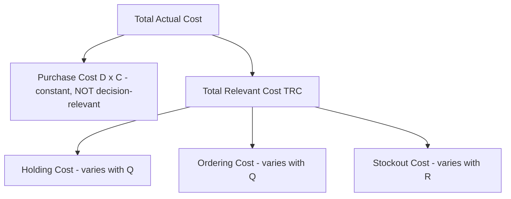
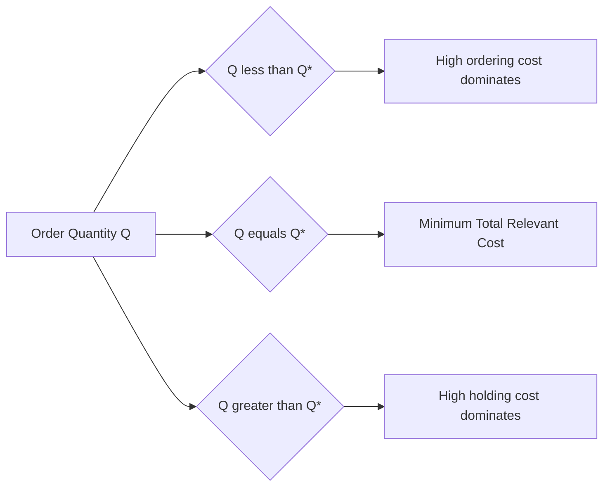

## Total Relevant Cost Modeling

### Definition

Total relevant cost (TRC) modeling is the analytical framework that combines all cost components influenced by an inventory decision — ordering/setup cost, holding cost, and stockout cost — into a single objective function, enabling the identification of a cost-minimizing (or profit-maximizing) inventory policy. It is "relevant" cost because it deliberately excludes costs that do not vary with the inventory decision being analyzed (such as the fixed purchase price of goods, in models where quantity discounts are not being considered), focusing analysis only on the costs that actually change as a function of the decision variables.

$$TRC(Q, R) = \text{Annual Holding Cost} + \text{Annual Ordering Cost} + \text{Annual Stockout Cost}$$

This chapter synthesizes the three cost categories covered individually in prior sections (ordering/setup, holding, stockout) into the unified modeling framework used to derive optimal order quantities, reorder points, and safety stock levels.

### The General Total Relevant Cost Function

For a continuous-review $(Q, R)$ inventory policy, the total relevant annual cost function is:

$$TRC(Q, R) = \underbrace{\frac{Q}{2}H}_{\text{Holding Cost}} + \underbrace{\frac{D}{Q}S}_{\text{Ordering Cost}} + \underbrace{\frac{D}{Q} \times p \times E[\text{Shortage per Cycle}]}_{\text{Stockout Cost}}$$

where:

- $D$ = annual demand
- $Q$ = order quantity
- $S$ = fixed cost per order
- $H$ = holding cost per unit per year
- $R$ = reorder point
- $p$ = shortage cost per unit
- $E[\text{Shortage per Cycle}]$ = expected number of units short per replenishment cycle, a function of $R$ and the demand distribution during lead time

This is the most general form of the model. Simpler models (like classical EOQ) emerge by making specific simplifying assumptions about which terms matter and which can be ignored.

### Why "Relevant" Cost Matters: Isolating Decision-Sensitive Costs

A core modeling discipline in TRC analysis is excluding costs that are constant regardless of the decision being optimized. For example, when finding the optimal order quantity $Q^*$ under a fixed unit price (no quantity discounts), the annual purchase cost $D \times C$ (demand times unit cost) is **not** included in the TRC function — because it does not change with $Q$, it cannot influence which $Q$ minimizes total cost, and including it only adds a constant that shifts the curve vertically without changing its minimum point.

This distinction becomes critically important precisely when quantity discounts *are* present, because at that point purchase cost *does* vary with $Q$ (different price breaks at different order sizes) and must be reincorporated into the relevant cost function — this is the core adjustment made in the quantity discount model, covered separately.

### Building the Model: From EOQ to Full Stochastic Policy

**Level 1 — Deterministic EOQ (holding + ordering cost only, no stockout term):**

$$TRC(Q) = \frac{Q}{2}H + \frac{D}{Q}S$$

This is the simplest TRC model, assuming known constant demand and no stockout risk. Minimizing with respect to $Q$ (setting $\frac{d(TRC)}{dQ} = 0$) yields:

$$Q^* = \sqrt{\frac{2DS}{H}}$$

**Level 2 — Adding Stockout Cost via Service Level Constraint:**

Once demand during lead time is treated as uncertain, a reorder point $R$ must be set to trigger replenishment before stock is exhausted. Rather than explicitly modeling stockout cost in dollar terms (which, as covered previously, is difficult to estimate), many practical models instead impose a **service level constraint** and minimize holding + ordering cost subject to that constraint:

$$\min_{Q,R} \; \frac{Q}{2}H + \frac{D}{Q}S \quad \text{subject to} \quad P(\text{stockout during lead time}) \leq 1 - \text{CSL}$$

This reformulation sidesteps the need to estimate $p$ directly, instead treating the target cycle service level (CSL) as a policy input set by management.

**Level 3 — Full Cost-Based Model (explicit stockout cost):**

When $p$ can be estimated, the fully joint optimization treats both $Q$ and $R$ as decision variables, minimizing the complete TRC function that includes the expected stockout cost term. This typically requires iterative or numerical solution methods, since $Q^*$ and $R^*$ are interdependent (the expected shortage term depends on $R$, but the per-cycle frequency term $D/Q$ that it's multiplied by depends on $Q$).

### Marginal Cost Balancing — The Core Optimization Logic

The mathematical principle underlying every TRC minimization is that, at the optimal point, the *marginal* cost of increasing the decision variable by one more unit equals the *marginal* cost saved elsewhere. For the EOQ case:

$$\text{Marginal increase in holding cost from raising } Q = \text{Marginal decrease in ordering cost from raising } Q$$

$$\frac{H}{2} = \frac{DS}{Q^2} \quad \Rightarrow \quad Q^* = \sqrt{\frac{2DS}{H}}$$

For the safety stock/reorder point decision, the analogous marginal balancing condition (from the newsvendor-style critical ratio) is:

$$\text{Marginal cost of one more unit of safety stock (holding cost)} = \text{Marginal expected reduction in stockout cost}$$

$$H = p \times \left(1 - \Phi(z)\right) \times \frac{D}{Q} \quad \text{(approximately, depending on model formulation)}$$

This "set marginal cost equal to marginal benefit" logic is the unifying mathematical principle across virtually all classical inventory optimization models — recognizing this pattern is often more valuable pedagogically than memorizing each individual formula.

### Total Relevant Cost at the Optimum

A notable analytical property: at $Q = Q^*$ in the basic EOQ model, holding cost and ordering cost are exactly equal:

$$\frac{Q^*}{2}H = \frac{D}{Q^*}S$$

This equality is not a coincidence — it follows directly from the first-order condition used to derive $Q^*$, and it provides a useful sanity check: if a firm computes its actual annual holding cost and ordering cost for an item and finds them far from equal, this signals that the firm's current order quantity is likely far from the cost-minimizing EOQ.

The resulting minimum total relevant cost is:

$$TRC(Q^*) = \sqrt{2DSH}$$

### The Cost Curve Shape and Its Practical Implication

A well-known and practically useful property of the TRC curve is that it is **relatively flat near the minimum** — meaning that moderate deviations from the exact EOQ (say, ordering 20% more or less than $Q^*$ due to practical constraints like case-pack sizes or supplier minimums) result in only small increases in total relevant cost. [Inference] This flatness is a mathematical consequence of the square-root form of the TRC function near its minimum and is a commonly cited justification in practitioner literature for why exact EOQ compliance is less critical than getting the cost *inputs* ($D$, $S$, $H$) reasonably accurate in the first place — though the degree of flatness varies with the specific ratio of $S$ to $H$ and should not be assumed uniformly negligible for all parameter combinations.

### Extending TRC Modeling: Multi-Item and Constrained Cases

Real-world total relevant cost modeling frequently must account for additional constraints beyond the single-item, unconstrained case:

**Joint Replenishment (Multi-Item) Models**

When multiple items share a common ordering cost (e.g., a joint truckload shipment or a shared supplier setup), the TRC function must account for both item-specific costs and shared fixed costs, generally favoring coordinated (rather than independent) ordering cycles across the item family.

**Budget-Constrained Models**

When total inventory investment is capped by an overall budget, the TRC minimization becomes a constrained optimization problem (often solved via Lagrangian multiplier methods), where the optimal $Q_i^*$ for each item $i$ is adjusted downward from its unconstrained EOQ to satisfy the aggregate budget limit.

**Capacity-Constrained Models**

Similarly, when warehouse space or production capacity limits total inventory that can be held, the TRC model incorporates a binding capacity constraint, again typically solved via constrained optimization techniques.

### Comparison of Modeling Approaches

| Model Level | Cost Terms Included | Decision Variables | Typical Use Case |
| --- | --- | --- | --- |
| Basic EOQ | Holding + Ordering | $Q$ only | Stable demand, negligible stockout risk |
| Service-level constrained | Holding + Ordering, with CSL constraint | $Q$ and $R$ | Uncertain demand, stockout cost hard to estimate |
| Full cost-based (newsvendor-style) | Holding + Ordering + explicit Stockout | $Q$ and $R$ jointly | Stockout cost reliably estimable |
| Budget/capacity-constrained | Holding + Ordering (+ Stockout), with constraint | $Q_i$ for all items $i$, jointly | Multi-item portfolios with shared resource limits |

### Example

A distributor sells an industrial component with annual demand $D = 15{,}000$ units, ordering cost $S = \$120$/order, and holding cost $H = \$8$/unit/year.

$$Q^* = \sqrt{\frac{2 \times 15{,}000 \times 120}{8}} = \sqrt{450{,}000} \approx 671 \text{ units}$$

$$TRC(Q^*) = \sqrt{2 \times 15{,}000 \times 120 \times 8} = \sqrt{28{,}800{,}000} \approx \$5{,}367 \text{ per year}$$

Verification via the equal-cost property:

$$\text{Holding Cost} = \frac{671}{2} \times 8 \approx \$2{,}684$$

$$\text{Ordering Cost} = \frac{15{,}000}{671} \times 120 \approx \$2{,}683$$

The two components are approximately equal (small difference due to rounding $Q^*$ to a whole number), confirming the theoretical property.

If the supplier's shipping container requires orders in multiples of 800 units, the firm might order $Q = 800$ instead of the exact $Q^* = 671$:

$$TRC(800) = \frac{800}{2}(8) + \frac{15{,}000}{800}(120) = 3{,}200 + 2{,}250 = \$5{,}450$$

This represents only an $83/year increase (about 1.5%) over the true minimum — a direct numerical demonstration of the flat-near-the-minimum property, showing that the practical constraint of rounding to a container-size multiple imposes minimal cost penalty in this case.

[Inference] The specific demand, cost, and container-size figures in this example are illustrative; the magnitude of the cost penalty from rounding $Q^*$ to a practical order size depends on how far the practical constraint is from the true optimum and on the specific ratio of $S$ to $H$ for the item in question.

### Key Points

- Total relevant cost modeling combines holding, ordering, and stockout costs into a single objective function used to derive optimal inventory policies
- "Relevant" cost deliberately excludes costs that do not vary with the decision being optimized (e.g., constant purchase price when quantity discounts are absent)
- The core mathematical principle across nearly all classical inventory models is marginal cost balancing — setting the marginal cost of increasing a decision variable equal to the marginal cost saved elsewhere
- At the EOQ optimum, holding cost and ordering cost are exactly equal — a useful diagnostic check for real-world policy evaluation
- The TRC curve is relatively flat near its minimum, meaning practical constraints (case-pack sizes, supplier minimums) typically impose only modest cost penalties relative to the exact theoretical optimum

**Related Topics**

- Economic Order Quantity (EOQ) model derivation
- Quantity discount models and relevant cost adjustments
- The newsvendor model and joint $(Q,R)$ optimization
- Joint replenishment and multi-item coordination models
- Budget- and capacity-constrained inventory optimization
- Service level metrics as a practical substitute for explicit stockout cost estimation

**Next Steps**

- Proceed to the next chapter on demand and lead-time variability, which provides the statistical foundation needed to compute the reorder point $R$ and safety stock levels referenced throughout this total relevant cost framework