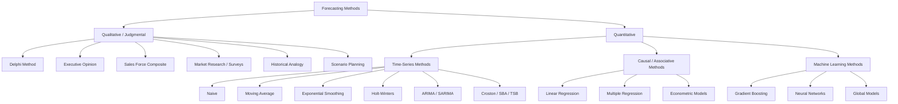
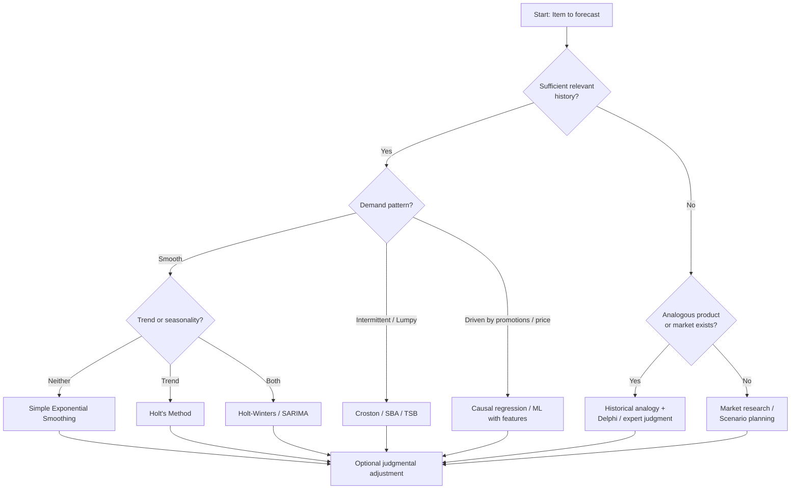

## Qualitative versus Quantitative Forecasting Approaches


### Introduction

Demand forecasting is the foundation of every inventory decision. Reorder points, order quantities, and safety stock levels all depend on an estimate of future demand and an estimate of how wrong that estimate is likely to be. Forecasting methods fall into two broad families:

- **Qualitative (judgmental) methods** rely on human expertise, opinion, and structured information gathering rather than on numerical history.
- **Quantitative methods** apply mathematical or statistical models to historical data (time-series methods) or to data about causal drivers (causal methods).

The choice of approach determines not only the forecast (the mean) but also the **forecast error distribution**, which is the direct input to safety stock calculations. A method that produces a good point forecast but an unquantifiable error is difficult to use in safety stock formulas. This is why understanding both families matters for inventory management.

**Key Points**

- Qualitative methods are used when data is absent, unreliable, or irrelevant to the future (new products, disruptive events).
- Quantitative methods are used when sufficient, relevant, and stable historical data exists.
- The two are complementary. Many mature planning processes combine them (statistical baseline plus judgmental adjustment).
- Safety stock depends on forecast error, so forecast method selection has a direct financial effect on inventory levels.

---

### Taxonomy of Forecasting Methods



---

### Qualitative Forecasting Approaches

Qualitative methods convert opinion, experience, and market intelligence into a forecast. They are structured to different degrees, and the more structured the method, the more defensible and repeatable the output.

#### Delphi Method

A panel of experts answers questionnaires anonymously over multiple rounds. After each round, a facilitator shares an anonymized summary (median, range, reasoning), and experts may revise their estimates. The process typically stops when estimates converge or stabilize.

- **Strengths:** Reduces dominance by senior individuals and groupthink; works with sparse data.
- **Weaknesses:** Time-consuming; results depend on panel quality; convergence does not guarantee accuracy.
- **Typical use:** Long-range technology or market demand forecasts, new product introductions.

#### Executive Opinion (Jury of Executive Opinion)

Senior managers from sales, marketing, finance, and operations meet and produce a consensus forecast, or average their individual forecasts.

- **Strengths:** Fast; integrates strategic knowledge.
- **Weaknesses:** Prone to authority bias, optimism bias, and political influence.

#### Sales Force Composite

Individual salespeople or account managers estimate demand for their territories or customers, and these estimates are aggregated bottom-up.

- **Strengths:** Close to the customer; captures account-level intelligence such as pending contracts or lost accounts.
- **Weaknesses:** Sandbagging (deliberately low forecasts to make quotas easy) or inflation (to secure supply); individual biases do not always cancel.

#### Market Research and Customer Surveys

Surveys, focus groups, purchase-intent studies, and test markets estimate demand from the customer's perspective.

- **Strengths:** Provides demand signals before a product exists.
- **Weaknesses:** Stated intent often overstates actual purchases; expensive and slow.

#### Historical Analogy

The demand pattern for a new product is modeled on the lifecycle of a comparable existing product, adjusted for known differences (price, channel, market size).

- **Strengths:** Gives a structured starting point when the new item has no history.
- **Weaknesses:** Choice of analog is subjective; the analog may not be representative.

#### Scenario Planning

Multiple plausible futures (for example, pessimistic, base, optimistic) are constructed from assumptions about key uncertainties, and demand is estimated for each.

- **Strengths:** Explicitly represents uncertainty; supports contingency planning.
- **Weaknesses:** Yields a range rather than a single number; probabilities are usually subjective.

#### Cognitive Biases That Affect Judgmental Forecasts

| Bias | Description | Effect on Forecast |
| --- | --- | --- |
| Anchoring | Over-reliance on an initial number (last year's actuals, budget) | Insufficient adjustment to new information |
| Optimism | Tendency toward favorable outcomes | Systematic over-forecasting |
| Recency | Overweighting recent events | Overreaction to noise |
| Overconfidence | Narrow subjective ranges | Understated uncertainty, leading to low safety stock |
| Groupthink | Suppression of dissent | Reduced diversity of views |
| Sandbagging | Strategic under-forecasting | Systematic negative bias |

---

### Quantitative Forecasting Approaches

#### Time-Series Methods

Time-series methods assume that the historical pattern of demand contains information about its future. A demand series $D_t$ is commonly decomposed into components:

$$D_t = f(T_t, S_t, C_t, \varepsilon_t)$$

where $T_t$ is trend, $S_t$ is seasonality, $C_t$ is cyclical variation, and $\varepsilon_t$ is random noise. Additive form: $D_t = T_t + S_t + C_t + \varepsilon_t$. Multiplicative form: $D_t = T_t \times S_t \times C_t \times \varepsilon_t$.

**Naive Forecast**

$$\hat{D}_{t+1} = D_t$$

The seasonal naive variant uses the value from the same season in the previous cycle: $\hat{D}_{t+1} = D_{t+1-m}$, where $m$ is the seasonal period. Naive methods serve as benchmarks; any more complex method should beat them.

**Simple Moving Average (SMA)**

$$\hat{D}_{t+1} = \frac{1}{N}\sum_{i=0}^{N-1} D_{t-i}$$

A larger $N$ smooths more but reacts more slowly to genuine level shifts.

**Simple Exponential Smoothing (SES)**

$$L_t = \alpha D_t + (1-\alpha) L_{t-1}, \qquad \hat{D}_{t+1} = L_t$$

with smoothing constant $0 < \alpha \le 1$. A high $\alpha$ responds quickly but passes more noise into the forecast.

**Holt's Linear Trend Method**

$$L_t = \alpha D_t + (1-\alpha)(L_{t-1} + b_{t-1})$$


$$b_t = \beta (L_t - L_{t-1}) + (1-\beta) b_{t-1}$$


$$\hat{D}_{t+h} = L_t + h\, b_t$$

**Holt-Winters (Triple Exponential Smoothing)**

Adds a seasonal index $S_t$ with period $m$ (multiplicative version):

$$L_t = \alpha \frac{D_t}{S_{t-m}} + (1-\alpha)(L_{t-1} + b_{t-1})$$


$$b_t = \beta (L_t - L_{t-1}) + (1-\beta) b_{t-1}$$


$$S_t = \gamma \frac{D_t}{L_t} + (1-\gamma) S_{t-m}$$


$$\hat{D}_{t+h} = (L_t + h\, b_t)\, S_{t+h-m}$$

**ARIMA / SARIMA**

An $\text{ARIMA}(p,d,q)$ model differences the series $d$ times to achieve stationarity, then fits $p$ autoregressive and $q$ moving-average terms. $\text{SARIMA}(p,d,q)(P,D,Q)_m$ extends this with seasonal terms. ARIMA is powerful for a single well-behaved series but requires careful diagnostics and is harder to scale across thousands of SKUs.

**Intermittent Demand Methods (Croston, SBA, TSB)**

Slow-moving items have many zero-demand periods, which breaks standard smoothing. Croston's method smooths two components separately: the non-zero demand size $z_t$ and the inter-demand interval $p_t$.

$$\hat{z}_t = \alpha z_t + (1-\alpha)\hat{z}_{t-1}, \qquad \hat{p}_t = \alpha p_t + (1-\alpha)\hat{p}_{t-1}$$


$$\hat{D}_{t+1} = \frac{\hat{z}_t}{\hat{p}_t}$$

Croston's original estimator is known to be biased upward; the Syntetos-Boylan Approximation (SBA) applies a correction factor of approximately $(1 - \alpha/2)$. TSB (Teunter-Syntetos-Babai) models demand probability directly and can handle obsolescence better.

#### Causal (Associative) Methods

Causal methods relate demand to explanatory variables $X_1, \dots, X_k$ such as price, promotions, weather, or economic indicators:

$$D_t = \beta_0 + \beta_1 X_{1,t} + \beta_2 X_{2,t} + \dots + \beta_k X_{k,t} + \varepsilon_t$$

- **Strengths:** Can model promotions, price changes, and external drivers; supports what-if analysis.
- **Weaknesses:** Requires forecasts of the drivers themselves; risk of spurious correlation; needs more data and maintenance.

#### Machine Learning Methods

Gradient boosting (for example, LightGBM), random forests, and neural network architectures can learn nonlinear relationships and cross-series patterns from many SKUs at once (global models).

- **Strengths:** Handle many features, hierarchical patterns, and cold-start with attributes.
- **Weaknesses:** Need feature engineering and larger datasets; probabilistic (distributional) output requires deliberate design such as quantile loss; interpretability is lower. [Inference] Performance advantages over well-tuned statistical baselines vary by dataset and are not guaranteed.

---

### Comparative Analysis

| Dimension | Qualitative | Quantitative |
| --- | --- | --- |
| Data requirement | Little or none | Historical data or driver data required |
| Speed of set-up | Quick to moderate | Moderate to slow (model building) |
| Scalability across SKUs | Poor (human effort) | Excellent (automated) |
| Repeatability / auditability | Low | High |
| Bias risk | Cognitive and political bias | Model misspecification, overfitting |
| Handles structural breaks | Well, if experts are informed | Poorly unless retrained or given drivers |
| Error quantification | Difficult, often subjective | Statistical (residual-based) |
| Best horizon | Long-term, strategic | Short to medium term |
| Cost per forecast | High per item | Low per item |

---

### Selection Criteria



Practitioners often classify demand using two statistics computed over the history:

- **Average demand interval (ADI):** mean number of periods between non-zero demands.
- **Squared coefficient of variation ($CV^2$) of non-zero demand sizes.**

The Syntetos-Boylan-Croston classification commonly uses cut-offs of $ADI = 1.32$ and $CV^2 = 0.49$ to separate four categories:

| Category | ADI | $CV^2$ | Suggested Approach |
| --- | --- | --- | --- |
| Smooth | < 1.32 | < 0.49 | SES, Holt-Winters, ARIMA |
| Erratic | < 1.32 | ≥ 0.49 | SES with careful error modeling, ML |
| Intermittent | ≥ 1.32 | < 0.49 | Croston / SBA / TSB |
| Lumpy | ≥ 1.32 | ≥ 0.49 | TSB, bootstrap, judgment on large orders |

---

### Hybrid Approaches: Statistical Baseline plus Judgmental Adjustment

Most demand planning processes generate a statistical baseline, then allow planners to override it for known events (new customer, competitor exit, price change). Research on this practice suggests that adjustments are most valuable when they are based on specific, verifiable information, and are least valuable when they are small and frequent, which mostly add noise. [Inference] The exact benefit varies by organization and item type.

**Forecast Value Added (FVA)** measures whether each step in the process improves accuracy:

$$FVA_{step} = \text{Error}_{previous\ step} - \text{Error}_{step}$$

A positive FVA means the step improved accuracy relative to the previous one; a negative FVA means it degraded it. A typical FVA stack is: Naive → Statistical → Planner Override → Consensus.

Other combination techniques include:

- **Forecast combination (averaging):** simple average of forecasts from several models often outperforms individual models.
- **Structured judgmental adjustment:** requiring a documented reason code for each override.
- **Bayesian blending:** treating expert opinion as a prior that is updated with observed demand.

---

### Measuring Forecast Accuracy

Both qualitative and quantitative forecasts should be evaluated with the same metrics.

$$e_t = D_t - \hat{D}_t$$

| Metric | Formula | Notes |
| --- | --- | --- |
| Mean Error (Bias) | $ME = \frac{1}{n}\sum e_t$ | Positive means under-forecasting under this sign convention |
| Mean Absolute Error | $MAE = \frac{1}{n}\sum \lvert e_t \rvert$ | Same units as demand |
| Root Mean Squared Error | $RMSE = \sqrt{\frac{1}{n}\sum e_t^2}$ | Penalizes large errors; directly related to $\sigma_e$ |
| Mean Absolute Percentage Error | $MAPE = \frac{100}{n}\sum \frac{\lvert e_t \rvert}{D_t}$ | Undefined when $D_t = 0$; unsuitable for intermittent demand |
| Weighted MAPE | $WMAPE = \frac{\sum \lvert e_t \rvert}{\sum D_t}$ | Robust to low-volume items |
| Mean Absolute Scaled Error | $MASE = \frac{MAE}{MAE_{naive}}$ | Scale-free; below 1 means better than naive |

The **standard deviation of forecast error**, $\sigma_e$, is what feeds safety stock, and RMSE is a natural estimator of it when bias is near zero.

---

### Link to Safety Stock

Safety stock protects against forecast error over the lead time. For a target cycle service level with $z$ the corresponding standard normal quantile, and forecast-error standard deviation $\sigma_{e}$ per period, with lead time $L$ periods (assuming independent errors):

$$SS = z \cdot \sigma_{e} \sqrt{L}$$

If lead time is variable with mean $\bar{L}$ and standard deviation $\sigma_L$, and demand has mean $\bar{d}$:

$$SS = z \sqrt{\bar{L}\,\sigma_{e}^2 + \bar{d}^2 \sigma_L^2}$$

Consequences of the forecasting approach:

- **Use forecast error, not raw demand variability.** A better forecast lowers $\sigma_e$ and therefore safety stock, even if the underlying demand is volatile.
- **Quantitative methods** give an empirical residual distribution from which $\sigma_e$ can be estimated and validated.
- **Qualitative methods** usually lack a residual history. It must be built by logging judgmental forecasts and comparing them to actuals. Without that, subjective ranges tend to be too narrow (overconfidence), producing insufficient safety stock.
- **Bias matters.** If a method is consistently biased, part of the error is systematic and should be corrected in the forecast rather than covered with safety stock.
- **Forecast at the right level.** Errors are measured at the horizon relevant to the replenishment lead time; a monthly forecast that looks accurate can hide large weekly errors.
- **Non-normal errors.** For intermittent or skewed demand, the normal assumption can be poor. Empirical or bootstrap quantiles of lead-time demand are often preferable. [Inference] The degree of deviation depends on the item's demand pattern.

---

### Worked Example: Comparing Methods and Computing Safety Stock

**Example**

Suppose weekly demand (units) for an item over 12 weeks is:

| Week | 1 | 2 | 3 | 4 | 5 | 6 | 7 | 8 | 9 | 10 | 11 | 12 |
| --- | --- | --- | --- | --- | --- | --- | --- | --- | --- | --- | --- | --- |
| Demand | 100 | 110 | 95 | 105 | 120 | 115 | 108 | 118 | 125 | 112 | 130 | 122 |

We compare a naive forecast and a 3-week moving average over weeks 4 to 12, then use the better method's error for safety stock.

**Naive forecast** ($\hat{D}_t = D_{t-1}$) for weeks 4 to 12:

| Week | Actual | Forecast | Error |
| --- | --- | --- | --- |
| 4 | 105 | 95 | 10 |
| 5 | 120 | 105 | 15 |
| 6 | 115 | 120 | -5 |
| 7 | 108 | 115 | -7 |
| 8 | 118 | 108 | 10 |
| 9 | 125 | 118 | 7 |
| 10 | 112 | 125 | -13 |
| 11 | 130 | 112 | 18 |
| 12 | 122 | 130 | -8 |

Squared errors: 100, 225, 25, 49, 100, 49, 169, 324, 64. Sum = 1105, so $RMSE_{naive} = \sqrt{1105/9} \approx 11.08$.

**3-week moving average** for weeks 4 to 12:

| Week | Actual | Forecast | Error |
| --- | --- | --- | --- |
| 4 | 105 | (100+110+95)/3 = 101.67 | 3.33 |
| 5 | 120 | (110+95+105)/3 = 103.33 | 16.67 |
| 6 | 115 | (95+105+120)/3 = 106.67 | 8.33 |
| 7 | 108 | (105+120+115)/3 = 113.33 | -5.33 |
| 8 | 118 | (120+115+108)/3 = 114.33 | 3.67 |
| 9 | 125 | (115+108+118)/3 = 113.67 | 11.33 |
| 10 | 112 | (108+118+125)/3 = 117.00 | -5.00 |
| 11 | 130 | (118+125+112)/3 = 118.33 | 11.67 |
| 12 | 122 | (125+112+130)/3 = 122.33 | -0.33 |

Squared errors: 11.09, 277.89, 69.39, 28.41, 13.47, 128.37, 25.00, 136.19, 0.11. Sum ≈ 689.92, so $RMSE_{MA} = \sqrt{689.92/9} \approx 8.76$.

**Output**

| Method | RMSE |
| --- | --- |
| Naive | 11.08 |
| 3-week moving average | 8.76 |

The moving average has a lower error on this sample. (With only nine evaluation points, this comparison is illustrative, not statistically robust.)

**Safety stock** with a 95% cycle service level ($z \approx 1.645$) and a 2-week lead time, using $\sigma_e \approx 8.76$:

$$SS = 1.645 \times 8.76 \times \sqrt{2} \approx 20.4 \approx 21 \text{ units}$$

Had the naive method been used, the corresponding value would be $1.645 \times 11.08 \times \sqrt{2} \approx 25.8 \approx 26$ units, about 27% higher. This shows how forecast accuracy directly reduces required safety stock.

---

### Practical Implementation Example (Python)

**Example**

```python
import numpy as np
import pandas as pd
from scipy.stats import norm

demand = pd.Series([100, 110, 95, 105, 120, 115, 108, 118, 125, 112, 130, 122])

# Naive forecast
naive_fc = demand.shift(1)

# 3-period moving average forecast (uses the prior 3 observations)
ma_fc = demand.shift(1).rolling(window=3).mean()

def rmse(actual, forecast):
    mask = forecast.notna()
    err = actual[mask] - forecast[mask]
    return np.sqrt((err ** 2).mean()), err

# Evaluate over the common window (weeks 4..12 -> index 3..11)
common = ma_fc.notna()
rmse_naive, _ = rmse(demand[common], naive_fc[common])
rmse_ma, err_ma = rmse(demand[common], ma_fc[common])

print(f"Naive RMSE: {rmse_naive:.2f}")
print(f"MA(3) RMSE: {rmse_ma:.2f}")

# Safety stock
service_level = 0.95
lead_time_weeks = 2
z = norm.ppf(service_level)
safety_stock = z * rmse_ma * np.sqrt(lead_time_weeks)
print(f"Safety stock: {safety_stock:.1f} units")
```

**Output**

```text
Naive RMSE: 11.08
MA(3) RMSE: 8.76
Safety stock: 20.4 units
```

Notes: the sample RMSE is used here as an estimate of $\sigma_e$. In production, use a longer rolling window, check for bias, and validate the normality assumption before applying the closed-form formula. Exact numerical results may differ slightly by library version and rounding.

---

### Advantages and Limitations Summary

**Qualitative**

- Advantages: works without data; incorporates market intelligence and upcoming events; useful for strategic and long-horizon decisions.
- Limitations: subjective; bias-prone; not scalable; hard to audit; error distribution rarely quantified.

**Quantitative**

- Advantages: objective, repeatable, scalable; error can be measured and used in safety stock; supports automation.
- Limitations: assumes the past is informative about the future; sensitive to data quality; poor at anticipating structural breaks or unprecedented events; requires model governance.

---

### Common Pitfalls

- Applying moving averages or exponential smoothing to intermittent demand, which produces biased forecasts.
- Using MAPE on low-volume or zero-demand items.
- Measuring accuracy on the wrong horizon or aggregation level relative to lead time.
- Letting planners override forecasts without tracking FVA.
- Treating in-sample fit as out-of-sample accuracy (overfitting); always evaluate on holdout or rolling-origin data.
- Ignoring demand versus sales: sales history censored by stockouts understates true demand, and forecasts trained on it inherit the bias.
- Feeding a qualitative forecast into safety stock formulas without an empirical error estimate.
- Ignoring outliers (one-time promotions, stockouts) without cleansing or flagging them.

---

### Conclusion

Qualitative and quantitative forecasting are not competing philosophies but tools suited to different information environments. Qualitative methods supply judgment where data is thin or the future differs from the past. Quantitative methods supply discipline, scale, and measurable error. The most effective inventory processes use a statistical baseline, add documented and evaluated judgmental adjustments, track forecast accuracy and bias with consistent metrics, and carry the resulting forecast-error standard deviation into safety stock calculations. Improving the forecast (lower $\sigma_e$ and lower bias) is often the most effective way to reduce safety stock without reducing service level.

---

### Related Topics

- Time-series decomposition (trend, seasonality, cyclical, irregular components)
- Exponential smoothing family and parameter optimization
- Forecast accuracy metrics and bias tracking (tracking signal, MAD, MASE)
- Forecast Value Added (FVA) analysis
- Intermittent and lumpy demand forecasting (Croston, SBA, TSB)
- New product forecasting and lifecycle curves
- Demand sensing and short-horizon forecasting
- Collaborative Planning, Forecasting and Replenishment (CPFR)
- Hierarchical forecasting and reconciliation
- Probabilistic forecasting and quantile-based safety stock
- Relationship between forecast error, lead time variability, and safety stock formulas
- Demand censoring, stockout correction, and demand cleansing