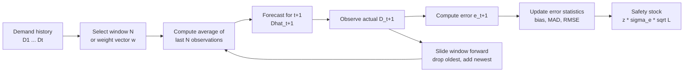
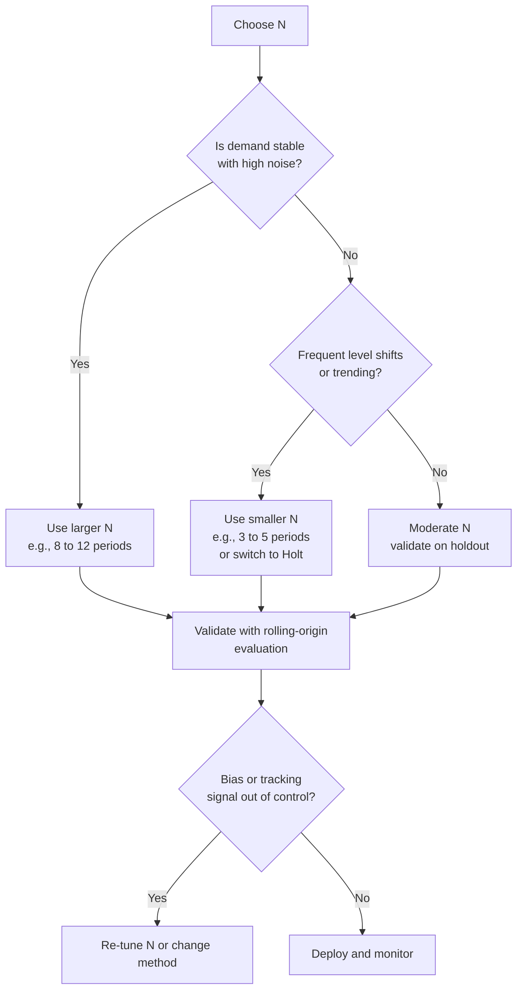

## Moving Average and Weighted Moving Average Models

### Introduction

Moving average models are among the oldest and most widely used time-series forecasting techniques in inventory management. They estimate future demand as an average of the most recent observations, discarding older data. This "sliding window" behavior gives the forecast a simple and intuitive property: it adapts to level changes in demand, but only after a delay that depends on the window length.

Two related families are covered here:

- **Simple Moving Average (SMA):** each observation in the window receives equal weight.
- **Weighted Moving Average (WMA):** observations receive unequal weights, typically larger for more recent data.

Both methods assume that demand fluctuates around a slowly changing level, with no persistent trend or seasonality. When those assumptions hold, they provide a robust baseline. When they do not, they produce systematic forecast errors, which inflate the safety stock required to hold a given service level.

**Key Points**

- The window length $N$ (or the weight vector) is the single tuning parameter that governs the trade-off between noise smoothing and responsiveness.
- Moving averages are **lagging** estimators. For a series with a linear trend, the forecast lags the true level by a predictable amount.
- Forecast error, not raw demand variability, drives safety stock. A well-tuned window lowers $\sigma_e$ and therefore lowers safety stock.
- Moving averages are unsuitable for intermittent demand and for seasonal or strongly trending series without modification.

---

### Conceptual Overview



---

### Simple Moving Average (SMA)

#### Definition

The $N$-period simple moving average forecast for the next period is the arithmetic mean of the last $N$ observations:

$$\hat{D}_{t+1} = \frac{1}{N}\sum_{i=0}^{N-1} D_{t-i} = \frac{D_t + D_{t-1} + \dots + D_{t-N+1}}{N}$$

The forecast is the same for every future horizon $h \ge 1$, because the model assumes a constant underlying level:

$$\hat{D}_{t+h} = \hat{D}_{t+1}, \quad h = 1, 2, \dots$$

#### Recursive (Efficient) Form

Rather than re-summing $N$ values every period, the average can be updated incrementally:

$$\hat{D}_{t+1} = \hat{D}_t + \frac{D_t - D_{t-N}}{N}$$

This form requires storing only the running sum (or the last forecast) and the value leaving the window, which is useful when computing forecasts for thousands of SKUs.

#### Properties of the SMA

| Property | Description |
| --- | --- |
| Weights | Equal, each $1/N$ |
| Memory | Exactly $N$ periods; older data has zero influence |
| Average age of data | $(N+1)/2$ periods |
| Smoothing | Larger $N$ reduces the variance of the forecast |
| Responsiveness | Smaller $N$ reacts faster to level shifts |
| Horizon | Flat forecast across all future periods |

#### Variance Reduction

If demand is independent with constant mean $\mu$ and variance $\sigma^2$, the variance of the SMA forecast is:

$$\text{Var}(\hat{D}_{t+1}) = \frac{\sigma^2}{N}$$

This shows why longer windows produce smoother forecasts. The corresponding one-step forecast error variance, assuming the future demand is independent of the window, is:

$$\text{Var}(e_{t+1}) = \sigma^2 + \frac{\sigma^2}{N} = \sigma^2\left(1 + \frac{1}{N}\right)$$

The error standard deviation is therefore $\sigma_e = \sigma\sqrt{1 + 1/N}$. For stationary demand, increasing $N$ reduces $\sigma_e$, but the benefit diminishes rapidly beyond a modest $N$, while the lag penalty under a level shift or trend increases.

#### Lag Under a Linear Trend

If demand follows $D_t = a + bt$ (a deterministic linear trend), the SMA forecast systematically lags. The expected forecast for period $t+1$ is:

$$E[\hat{D}_{t+1}] = a + b\left(t - \frac{N-1}{2}\right)$$

while the true value is $a + b(t+1)$. The expected bias (actual minus forecast) is:

$$E[e_{t+1}] = b\left(\frac{N+1}{2}\right)$$

So the SMA under-forecasts by $b(N+1)/2$ units per period in a rising trend, and the bias grows with the window length. This is a structural limitation, and safety stock cannot economically fix it. The appropriate remedy is a trend-capable method (for example, Holt's method) or a detrending step.

#### Response to a Step Change

If the demand level jumps by $\Delta$ at period $t_0$ and remains at the new level, the SMA forecast reaches the new level linearly over $N$ periods. After $k$ periods (for $k \le N$), the forecast has closed a fraction $k/N$ of the gap. Full adjustment takes exactly $N$ periods.

---

### Weighted Moving Average (WMA)

#### Definition

The weighted moving average assigns a weight $w_i$ to the observation $i$ periods back:

$$\hat{D}_{t+1} = \sum_{i=0}^{N-1} w_i D_{t-i}, \qquad \text{with } \sum_{i=0}^{N-1} w_i = 1,\ w_i \ge 0$$

If the weights do not sum to 1, the weighted sum must be divided by $\sum w_i$ to keep the forecast on the scale of demand:

$$\hat{D}_{t+1} = \frac{\sum_{i=0}^{N-1} w_i D_{t-i}}{\sum_{i=0}^{N-1} w_i}$$

The SMA is the special case $w_i = 1/N$ for all $i$.

#### Common Weighting Schemes

| Scheme | Weights ($i = 0$ is the most recent) | Characteristic |
| --- | --- | --- |
| Equal | $w_i = \frac{1}{N}$ | Equivalent to SMA |
| Linear declining | $w_i = \frac{N - i}{N(N+1)/2}$ | Recent data weighted most, decreasing linearly to the oldest |
| Custom (manual) | Chosen by planner, e.g., 0.5, 0.3, 0.2 | Flexible but subjective |
| Geometric (truncated) | $w_i \propto \lambda^i$, $0<\lambda<1$ | Approximates exponential smoothing over a finite window |
| Optimized | Weights fit by minimizing error | Data-driven; risk of overfitting |

For the linear declining scheme, the normalizing constant is the triangular number $\sum_{j=1}^{N} j = N(N+1)/2$. For $N = 3$ the weights are $3/6,\ 2/6,\ 1/6 = 0.500,\ 0.333,\ 0.167$.

#### Average Age of Data

The average age of the information in a WMA is:

$$\text{Age} = \sum_{i=0}^{N-1} i \cdot w_i + 1 \quad (\text{counting the most recent value as age } 1)$$

For linear declining weights the average age is smaller than the SMA's $(N+1)/2$, which is why the WMA responds faster to changes for the same $N$. The price is higher sensitivity to noise, since fewer effective observations contribute.

#### Effective Sample Size and Variance

For independent demand with variance $\sigma^2$, the variance of a WMA forecast is:

$$\text{Var}(\hat{D}_{t+1}) = \sigma^2 \sum_{i=0}^{N-1} w_i^2$$

Since $\sum w_i^2 \ge 1/N$ (with equality only for equal weights), any unequal weighting increases forecast variance relative to the SMA of the same window. This makes the trade-off explicit: unequal weights buy responsiveness at the cost of noise.

The one-step error variance becomes:

$$\sigma_e^2 = \sigma^2\left(1 + \sum_{i=0}^{N-1} w_i^2\right)$$

#### Trend Bias in the WMA

For a linear trend $D_t = a + bt$, the expected forecast bias of a WMA is:

$$E[e_{t+1}] = b \sum_{i=0}^{N-1} w_i (i + 1) = b \cdot \text{Age}$$

The bias equals the slope times the average age of the data. Because heavier recent weights lower the average age, the WMA under-forecasts a trend by less than the SMA, but it still does not eliminate the bias. Only weights that sum to 1 with a negative component can reduce it to zero, which is an unusual and unstable configuration not used in practice.

---

### Worked Examples

**Example**

Weekly demand (units) for an item over 12 weeks:

| Week | 1 | 2 | 3 | 4 | 5 | 6 | 7 | 8 | 9 | 10 | 11 | 12 |
| --- | --- | --- | --- | --- | --- | --- | --- | --- | --- | --- | --- | --- |
| Demand | 100 | 110 | 95 | 105 | 120 | 115 | 108 | 118 | 125 | 112 | 130 | 122 |

We forecast weeks 4 to 12 using a 3-week SMA and a 3-week WMA with weights $(0.5, 0.3, 0.2)$ applied to the most recent, second most recent, and third most recent weeks respectively.

#### SMA (N = 3)

$$\hat{D}_{t+1} = \frac{D_t + D_{t-1} + D_{t-2}}{3}$$

| Week | Actual | Forecast | Error (Actual − Forecast) |
| --- | --- | --- | --- |
| 4 | 105 | (110+95+100)/3 = 101.67 | 3.33 |
| 5 | 120 | (105+95+110)/3 = 103.33 | 16.67 |
| 6 | 115 | (120+105+95)/3 = 106.67 | 8.33 |
| 7 | 108 | (115+120+105)/3 = 113.33 | -5.33 |
| 8 | 118 | (108+115+120)/3 = 114.33 | 3.67 |
| 9 | 125 | (118+108+115)/3 = 113.67 | 11.33 |
| 10 | 112 | (125+118+108)/3 = 117.00 | -5.00 |
| 11 | 130 | (112+125+118)/3 = 118.33 | 11.67 |
| 12 | 122 | (130+112+125)/3 = 122.33 | -0.33 |

#### WMA (weights 0.5, 0.3, 0.2)

$$\hat{D}_{t+1} = 0.5 D_t + 0.3 D_{t-1} + 0.2 D_{t-2}$$

| Week | Actual | Forecast | Error |
| --- | --- | --- | --- |
| 4 | 105 | 0.5(95)+0.3(110)+0.2(100) = 100.50 | 4.50 |
| 5 | 120 | 0.5(105)+0.3(95)+0.2(110) = 103.00 | 17.00 |
| 6 | 115 | 0.5(120)+0.3(105)+0.2(95) = 110.50 | 4.50 |
| 7 | 108 | 0.5(115)+0.3(120)+0.2(105) = 114.50 | -6.50 |
| 8 | 118 | 0.5(108)+0.3(115)+0.2(120) = 112.50 | 5.50 |
| 9 | 125 | 0.5(118)+0.3(108)+0.2(115) = 114.40 | 10.60 |
| 10 | 112 | 0.5(125)+0.3(118)+0.2(108) = 121.50 | -9.50 |
| 11 | 130 | 0.5(112)+0.3(125)+0.2(118) = 117.10 | 12.90 |
| 12 | 122 | 0.5(130)+0.3(112)+0.2(125) = 123.60 | -1.60 |

Note: in the table above, each forecast row lists weights applied in order (most recent first). For week 4, the most recent observation is week 3 (95), then week 2 (110), then week 1 (100).

#### Error Comparison

**Output**

| Metric | SMA (N=3) | WMA (0.5, 0.3, 0.2) |
| --- | --- | --- |
| Sum of errors | 43.34 | 38.50 |
| Mean Error (bias) | 4.82 | 4.28 |
| MAE | 7.28 | 8.06 |
| RMSE | 8.76 | 9.20 |

Both methods under-forecast on average (positive mean error under the convention error = actual − forecast), consistent with a mild upward drift in this sample. The WMA has slightly lower bias because it weights recent, higher observations more, but its RMSE is higher on this sample. With only nine evaluation points, this difference should not be considered statistically meaningful.

#### Next-Period Forecast and Safety Stock

The forecast for week 13 using the SMA is:

$$\hat{D}_{13} = \frac{122 + 130 + 112}{3} = 121.33$$

Using the WMA:

$$\hat{D}_{13} = 0.5(122) + 0.3(130) + 0.2(112) = 122.40$$

For a 95% cycle service level ($z \approx 1.645$) and a 2-week lead time, using the SMA's $\sigma_e \approx 8.76$ (treating RMSE as the error standard deviation estimator):

$$SS = 1.645 \times 8.76 \times \sqrt{2} \approx 20.4 \approx 21 \text{ units}$$

The reorder point is the expected lead-time demand plus safety stock:

$$ROP = 2 \times 121.33 + 20.4 \approx 263.1 \approx 264 \text{ units}$$

Because the observed forecast error has a positive mean (bias of about 4.8 units per week), a planner might also correct the forecast for the bias or investigate a trend model, instead of absorbing the systematic component into safety stock. [Inference] With nine data points, the bias estimate itself is uncertain.

---

### Selecting the Window Length or Weights

The window length is chosen to balance two competing errors:

- **Noise error** (variance): shrinks as $N$ grows.
- **Lag error** (bias under trend or level shift): grows as $N$ grows.



Practical guidance for selection:

1. **Rolling-origin (walk-forward) evaluation.** For each candidate $N$ (for example, 2 to 12), generate forecasts on a holdout segment using only data available at each forecast origin, and compare RMSE or MAE. Avoid selecting $N$ on in-sample fit alone.
2. **Match the window to the demand cycle.** If demand has a known periodicity of length $m$ (for example, weekly patterns in daily data), an SMA with $N = m$ removes the seasonal component from the average. This is a special-purpose use, and the seasonal effect must then be reintroduced through seasonal indices.
3. **Prefer fewer degrees of freedom.** Manually selected WMA weights have limited parameters. Optimized weights with many parameters (one per lag) can overfit, especially with short histories.
4. **Segment by demand class.** Fast-moving stable items tolerate longer windows; volatile or life-cycle items need shorter ones.

---

### Relationship to Other Methods

| Method | Relationship to Moving Average |
| --- | --- |
| Naive forecast | SMA with $N = 1$ |
| Simple Exponential Smoothing (SES) | Infinite-window WMA with geometrically declining weights $w_i = \alpha(1-\alpha)^i$; needs no window storage |
| Holt's linear method | Extends level smoothing with a trend component; removes the trend lag |
| Double moving average | Applies an SMA to an SMA to estimate and correct trend lag |
| Centered moving average | Uses past and future points; used for decomposition and smoothing, not forecasting |
| Cumulative average | SMA with an ever-growing window; suits stationary series only |

**Comparison with SES.** An SMA with window $N$ and an SES with smoothing constant $\alpha$ have equivalent average data age when:

$$\frac{N+1}{2} = \frac{1}{\alpha} \quad \Rightarrow \quad \alpha = \frac{2}{N+1}$$

This is a commonly cited rule of thumb for matching responsiveness. It provides an approximate correspondence only, since the two methods weigh history differently (uniform versus geometric).

**Double Moving Average (for trended data)**

Let $M_t^{(1)}$ be the SMA of demand and $M_t^{(2)}$ be the SMA of $M_t^{(1)}$, both with window $N$. Then:

$$a_t = 2M_t^{(1)} - M_t^{(2)}, \qquad b_t = \frac{2}{N-1}\left(M_t^{(1)} - M_t^{(2)}\right)$$


$$\hat{D}_{t+h} = a_t + b_t h$$

Here $a_t$ estimates the current level and $b_t$ the per-period trend. This corrects the lag bias but amplifies noise, so it needs a larger history and is generally less used than Holt's method. [Inference] Practical accuracy relative to Holt's method depends on the data and parameter tuning.

---

### Implementation

#### Python (pandas and NumPy)

**Example**

```python
import numpy as np
import pandas as pd
from scipy.stats import norm

demand = pd.Series(
    [100, 110, 95, 105, 120, 115, 108, 118, 125, 112, 130, 122],
    index=range(1, 13),
    name="demand",
)

def sma_forecast(series: pd.Series, n: int) -> pd.Series:
    """One-step-ahead SMA forecast. Value at index t is the forecast for t,
    computed only from observations before t (no look-ahead)."""
    return series.shift(1).rolling(window=n).mean()

def wma_forecast(series: pd.Series, weights) -> pd.Series:
    """One-step-ahead WMA forecast.
    weights[0] applies to the most recent observation, weights[1] to the next, etc."""
    w = np.asarray(weights, dtype=float)
    w = w / w.sum()                     # normalize so weights sum to 1
    n = len(w)
    # rolling.apply passes the window oldest-first, so reverse the weights
    return series.shift(1).rolling(window=n).apply(
        lambda x: np.dot(x, w[::-1]), raw=True
    )

def error_metrics(actual: pd.Series, forecast: pd.Series) -> dict:
    mask = forecast.notna()
    e = actual[mask] - forecast[mask]
    return {
        "n": int(mask.sum()),
        "ME (bias)": e.mean(),
        "MAE": e.abs().mean(),
        "RMSE": np.sqrt((e ** 2).mean()),
    }

sma = sma_forecast(demand, 3)
wma = wma_forecast(demand, [0.5, 0.3, 0.2])

print("SMA:", error_metrics(demand, sma))
print("WMA:", error_metrics(demand, wma))

# Next-period forecast (week 13)
next_sma = demand.iloc[-3:].mean()
next_wma = np.dot(demand.iloc[-3:].values, np.array([0.2, 0.3, 0.5]))
print(f"Week 13 SMA forecast: {next_sma:.2f}")
print(f"Week 13 WMA forecast: {next_wma:.2f}")

# Safety stock and reorder point using SMA error
rmse_sma = error_metrics(demand, sma)["RMSE"]
service_level = 0.95
lead_time = 2
z = norm.ppf(service_level)
ss = z * rmse_sma * np.sqrt(lead_time)
rop = lead_time * next_sma + ss
print(f"Safety stock: {ss:.1f}, Reorder point: {rop:.1f}")
```

**Output**

```text
SMA: {'n': 9, 'ME (bias)': 4.82, 'MAE': 7.28, 'RMSE': 8.76}
WMA: {'n': 9, 'ME (bias)': 4.28, 'MAE': 8.06, 'RMSE': 9.20}
Week 13 SMA forecast: 121.33
Week 13 WMA forecast: 122.40
Safety stock: 20.4, Reorder point: 263.1
```

Notes: exact printed values depend on rounding and dictionary formatting in the environment. The function `rolling(...).apply(..., raw=True)` passes each window to the lambda as a NumPy array ordered oldest to newest, which is why the weight vector (defined most-recent-first) is reversed before the dot product.

#### Spreadsheet Implementation

- **SMA in Excel:** with demand in column B and the forecast in column C, cell C5 (a 3-period forecast of the period in row 5) is `=AVERAGE(B2:B4)`. Copy down the column.
- **WMA in Excel:** `=SUMPRODUCT(B2:B4, {0.2;0.3;0.5})/SUM({0.2;0.3;0.5})`, where the array order runs oldest to newest. A common practice is to store weights in a separate range and reference it absolutely.

#### SQL (Window Functions)

```sql
SELECT
    week,
    demand,
    AVG(demand) OVER (
        ORDER BY week
        ROWS BETWEEN 3 PRECEDING AND 1 PRECEDING
    ) AS sma3_forecast
FROM weekly_demand;
```

The frame `3 PRECEDING AND 1 PRECEDING` excludes the current row, which avoids using the actual value being forecast (look-ahead leakage). The syntax is broadly supported by major SQL engines, though details can vary by vendor and version.

---

### Monitoring: Bias and Tracking Signal

A moving average forecast should be monitored for drift. Two standard measures are:

$$\text{MAD} = \frac{1}{n}\sum |e_t|, \qquad \text{Tracking Signal} = \frac{\sum e_t}{\text{MAD}}$$

The tracking signal is the cumulative error divided by MAD. A widely used rule of thumb flags a signal outside roughly $\pm 4$ (some organizations use $\pm 3$ to $\pm 6$) as evidence of persistent bias. [Inference] The appropriate limit depends on the number of observations and the organization's tolerance for false alarms.

For the SMA example above, $\sum e_t = 43.34$ and $\text{MAD} = 7.28$, so the tracking signal is approximately $43.34 / 7.28 \approx 5.95$, above the typical $\pm 4$ threshold, indicating a possible systematic under-forecast. In practice, this should prompt a review, for example testing a trend model or a shorter window, after confirming the pattern persists over more observations.

**Converting MAD to $\sigma_e$.** For approximately normal errors, the standard deviation can be estimated from MAD:

$$\sigma_e \approx 1.25 \times \text{MAD}$$

For the SMA example, $1.25 \times 7.28 = 9.10$, close to the RMSE of 8.76. This shortcut is only accurate when errors are roughly normal and unbiased. When bias is present, RMSE is generally the more reliable input for safety stock.

---

### Advantages and Limitations

**Advantages**

- Simple to understand, explain, and implement without specialized software.
- Requires little data (only $N$ observations).
- Transparent and auditable, which suits collaborative planning and management review.
- Robust baseline that is often difficult to beat by a large margin on stable series.
- Computationally cheap and easy to scale (the recursive form updates in constant time).

**Limitations**

- Systematic lag under trend, producing persistent under- or over-forecasting.
- Cannot capture seasonality without additional adjustment.
- Sudden outliers enter the window at full weight and stay for $N$ periods, then drop out abruptly (the "cliff effect"), which can distort forecasts twice: when they enter and when they leave.
- Data-hungry relative to smoothing methods that use all history: older data is discarded entirely.
- Flat multi-step forecast, with no trend or seasonal projection.
- Poor fit for intermittent demand, where many zeros make the average unstable and misleading.
- Requires storing $N$ observations per SKU (unless the recursive form is used), and the choice of $N$ or weights is partly subjective.

---

### Handling Outliers and Data Issues

- **Outlier treatment.** Cap or winsorize extreme values, or replace known one-time events (promotions, stockouts, data errors) with cleansed values before they enter the window. Alternatively, use a **moving median**, which is robust to isolated spikes, at the cost of slower response to real shifts.
- **Stockout-censored demand.** If sales are recorded during stockouts, the observed values understate true demand. A moving average trained on this history inherits the downward bias, which can spiral into further stockouts. Reconstruct demand where possible before averaging.
- **Missing periods.** Treat missing data explicitly (impute or shorten the window) instead of allowing them to be silently read as zero.
- **Startup periods.** The first $N$ forecasts are unavailable. Fall back to a naive or shorter-window forecast until sufficient history accumulates.
- **Structural breaks.** After a known permanent change (price change, product reformulation, new channel), consider resetting the window so pre-break data does not bias the average.

---

### Common Pitfalls

- Applying an SMA to trending or seasonal series without adjustment, leading to persistent bias.
- Selecting $N$ on in-sample fit, which favors overfit windows; use out-of-sample evaluation.
- Look-ahead leakage: including the current period's actual demand in its own forecast, which understates error and safety stock.
- Mixing up weight ordering (most recent first versus oldest first), which silently reverses the intended emphasis.
- Forgetting to normalize weights, causing forecasts to scale incorrectly.
- Using MAPE to compare methods on low-volume or zero-demand items.
- Feeding sample RMSE from a very short evaluation window into safety stock without acknowledging its uncertainty.
- Ignoring bias: treating a persistently biased forecast error as random variability and covering it with extra safety stock.

---

### Conclusion

Moving average and weighted moving average models estimate demand as a local average of recent observations. The SMA trades noise for lag through a single window parameter $N$, while the WMA adds control over how quickly the forecast reacts by assigning unequal weights. Both are effective baselines for stable, level-type demand and produce an empirical forecast-error distribution that feeds directly into safety stock via $SS = z \cdot \sigma_e \sqrt{L}$. Their main weaknesses are structural lag under trend, blindness to seasonality, sensitivity to outliers, and unsuitability for intermittent demand. Sound practice is to select the window by out-of-sample validation, monitor bias with a tracking signal, cleanse the input history, and move to exponential smoothing or trend and seasonal models when the demand pattern requires it.

---

### Related Topics

- Simple exponential smoothing and choice of smoothing constant $\alpha$
- Holt's linear trend method and damped trend
- Holt-Winters seasonal models
- Double and triple moving averages
- Centered moving averages and classical time-series decomposition
- Forecast accuracy metrics (MAE, RMSE, MASE, WMAPE) and bias tracking
- Tracking signals and forecast monitoring limits
- Rolling-origin cross-validation for time series
- Outlier detection and demand cleansing
- Forecast error distributions and their use in safety stock
- Intermittent demand forecasting (Croston, SBA, TSB)
- Moving median and robust smoothing methods