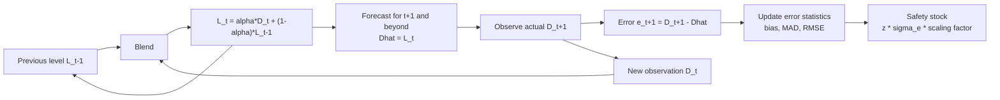
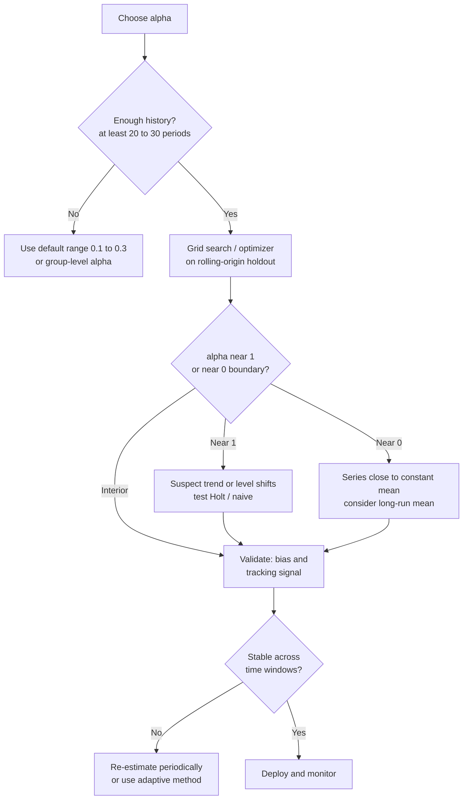

## Simple Exponential Smoothing

### Introduction

Simple exponential smoothing (SES) is a time-series forecasting method that estimates the current demand level as a weighted average of all past observations, with weights that decline geometrically as observations age. It is the natural successor to the moving average: instead of a hard window that keeps $N$ observations at equal weight and discards everything older, SES retains the entire history but lets its influence fade smoothly.

SES is one of the most heavily used methods in inventory management and demand planning. It requires storing only one number per item (the previous level estimate), updates in constant time, and has a single tuning parameter, the smoothing constant $\alpha$. It is appropriate for demand that fluctuates around a slowly changing level with no persistent trend or seasonality.

**Key Points**

- The forecast is a **level estimate**: $\hat{D}_{t+h} = L_t$ for every horizon $h \ge 1$.
- The smoothing constant $\alpha \in (0, 1]$ controls the trade-off between responsiveness (high $\alpha$) and noise suppression (low $\alpha$).
- SES weights decay geometrically: $w_i = \alpha(1-\alpha)^i$. No data is discarded, but old data quickly becomes negligible.
- SES lags under a trend and ignores seasonality. Extensions (Holt, Holt-Winters) address those limitations.
- The standard deviation of forecast error, $\sigma_e$, is the quantity that drives safety stock, and its multi-period scaling under SES differs from the simple $\sqrt{L}$ rule.

---

### Conceptual Overview



---

### Model Formulation

#### Weighted-Average Form

The level after observing demand $D_t$ is a convex combination of the new observation and the previous level:

$$L_t = \alpha D_t + (1 - \alpha) L_{t-1}, \qquad 0 < \alpha \le 1$$

The forecast for any future period is the current level:

$$\hat{D}_{t+h} = L_t, \qquad h = 1, 2, 3, \dots$$

The one-step-ahead forecast made at time $t-1$ for period $t$ is $\hat{D}_t = L_{t-1}$.

#### Error-Correction Form

Substituting $e_t = D_t - L_{t-1}$ into the weighted-average form gives an equivalent expression:

$$L_t = L_{t-1} + \alpha\, e_t$$

Each new level is the previous level plus a fraction $\alpha$ of the latest forecast error. This form is intuitive for planners: if demand came in 20 units above forecast and $\alpha = 0.2$, the level rises by 4 units. It also connects SES to the ETS state-space framework used in modern software.

#### Expanded Form: Geometric Weights

Repeated substitution of the recursion yields:

$$L_t = \alpha D_t + \alpha(1-\alpha) D_{t-1} + \alpha(1-\alpha)^2 D_{t-2} + \dots + (1-\alpha)^t L_0$$

So the weight on the observation $i$ periods back is:

$$w_i = \alpha (1 - \alpha)^i$$

These weights form a geometric series that sums to $1 - (1-\alpha)^{t}$ over the observed history (plus the weight $(1-\alpha)^t$ on the initial level $L_0$), and to exactly 1 in the infinite limit:

$$\sum_{i=0}^{\infty} \alpha (1-\alpha)^i = 1$$

#### Weight Table for Common Smoothing Constants

| Age $i$ | $\alpha = 0.1$ | $\alpha = 0.2$ | $\alpha = 0.3$ | $\alpha = 0.5$ | $\alpha = 0.8$ |
| --- | --- | --- | --- | --- | --- |
| 0 (latest) | 0.100 | 0.200 | 0.300 | 0.500 | 0.800 |
| 1 | 0.090 | 0.160 | 0.210 | 0.250 | 0.160 |
| 2 | 0.081 | 0.128 | 0.147 | 0.125 | 0.032 |
| 3 | 0.073 | 0.102 | 0.103 | 0.063 | 0.006 |
| 4 | 0.066 | 0.082 | 0.072 | 0.031 | 0.001 |
| 5 | 0.059 | 0.066 | 0.050 | 0.016 | 0.000 |
| Cumulative weight through age 5 | 0.469 | 0.738 | 0.882 | 0.984 | 1.000 |

The table shows that a high $\alpha$ concentrates almost all weight on the last few observations, while a low $\alpha$ spreads weight over a long history.

---

### Properties of SES

#### Average Age of Data

The mean age of information in the level, counting the newest observation as age 1, is:

$$\text{Age} = \sum_{i=0}^{\infty} (i+1)\, \alpha (1-\alpha)^i = \frac{1}{\alpha}$$

This gives a direct correspondence with the moving average. An $N$-period SMA has average age $(N+1)/2$, so matching average ages yields the rule of thumb:

$$\alpha \approx \frac{2}{N+1}$$

For example, $N = 5$ corresponds to $\alpha \approx 0.33$, and $N = 9$ corresponds to $\alpha = 0.20$. This is an approximate equivalence of responsiveness only, since SES and SMA weight history differently.

#### Variance of the Forecast

For independent demand with constant variance $\sigma^2$ and constant mean, the steady-state variance of the level estimate is:

$$\text{Var}(L_t) = \sigma^2 \sum_{i=0}^{\infty} w_i^2 = \sigma^2 \frac{\alpha}{2 - \alpha}$$

The corresponding one-step forecast error variance is:

$$\sigma_e^2 = \sigma^2 \left(1 + \frac{\alpha}{2-\alpha}\right) = \sigma^2 \frac{2}{2-\alpha}$$

So $\sigma_e = \sigma\sqrt{2/(2-\alpha)}$. Larger $\alpha$ inflates forecast variance and therefore forecast error. In a truly stationary series, small $\alpha$ is optimal, and the minimum error approaches $\sigma$ as $\alpha \to 0$.

| $\alpha$ | $\sigma_e / \sigma$ |
| --- | --- |
| 0.05 | 1.013 |
| 0.10 | 1.026 |
| 0.20 | 1.054 |
| 0.30 | 1.085 |
| 0.50 | 1.155 |
| 1.00 | 1.414 |

At $\alpha = 1$, SES collapses to the naive forecast, whose error standard deviation is $\sqrt{2}\,\sigma$ for stationary demand.

#### Response to a Step Change

If the demand level shifts permanently by $\Delta$ at time $t_0$, the fraction of the gap closed after $k$ periods (counting the period of the shift as $k=1$) is:

$$1 - (1-\alpha)^k$$

| $\alpha$ | Periods to close 50% | Periods to close 90% |
| --- | --- | --- |
| 0.1 | 7 | 22 |
| 0.2 | 4 | 11 |
| 0.3 | 2 | 7 |
| 0.5 | 1 | 4 |

Unlike the SMA, SES never fully closes the gap in finite time, but the residual decays exponentially.

#### Lag Under a Linear Trend

If demand follows $D_t = a + bt$, the steady-state expected forecast error (bias) of SES is:

$$E[e_{t+1}] = \frac{b(1-\alpha)}{\alpha}$$

For $\alpha = 0.2$ and slope $b = 2$ units per period, the persistent under-forecast is $2 \times 0.8 / 0.2 = 8$ units. Bias increases as $\alpha$ decreases, so choosing a small $\alpha$ to suppress noise makes trend lag worse. This tension is why trending items require Holt's method rather than simply a different $\alpha$.

---

### Initialization

The recursion needs a starting level $L_0$. The choice matters most when the series is short or $\alpha$ is small, because the influence of $L_0$ decays as $(1-\alpha)^t$.

| Method | Description | Comment |
| --- | --- | --- |
| First observation | $L_0 = D_1$ | Simple; sensitive to a noisy first value |
| Mean of first $k$ observations | $L_0 = \frac{1}{k}\sum_{i=1}^{k} D_i$ | Common; $k$ of 3 to 12 |
| Backcasting | Run the recursion backward to estimate $L_0$ | Reduces start-up bias |
| Optimized | Treat $L_0$ as a parameter estimated with $\alpha$ | Used in ETS frameworks; adds a parameter |
| Heuristic (Hyndman) | Estimated from a short initial segment | Default in several statistical packages |

**Startup rule of thumb:** for stable items, initializing with the mean of the first 3 to 6 observations is usually adequate. For low $\alpha$, prefer a longer initialization window.

---

### Choosing the Smoothing Constant

#### Typical Ranges

- $\alpha \in [0.05, 0.20]$: stable, high-volume items with substantial noise.
- $\alpha \in [0.20, 0.40]$: moderately variable demand.
- $\alpha > 0.40$: rapidly shifting levels, new items, or demand with few observations. [Inference] Values above about 0.5 often indicate that the SES model is a poor fit and a trend or other structural model may be more appropriate.

#### Estimation by Minimizing Error

$\alpha$ is commonly estimated by minimizing the sum of squared one-step forecast errors (SSE) or MAE over the fitting sample:

$$\alpha^* = \arg\min_{\alpha \in (0,1]} \sum_{t=2}^{n} \left(D_t - L_{t-1}(\alpha)\right)^2$$

Because the objective is one-dimensional, a simple grid search (for example, $\alpha = 0.05, 0.10, \dots, 1.00$) or bounded scalar optimization is sufficient.



#### Practical Guidance

1. **Validate out of sample.** Selecting $\alpha$ on the same data used for evaluation understates error. Use rolling-origin (walk-forward) evaluation.
2. **Estimate at the group level for short histories.** Estimating $\alpha$ separately per SKU from a few observations is unstable. Product-family or category-level values reduce variance.
3. **Limit the search range.** Restricting $\alpha$ to something like $[0.05, 0.5]$ avoids degenerate fits that chase noise.
4. **Re-estimate periodically, not every cycle.** Frequent re-optimization can make forecasts unstable and cause parameter chasing.

---

### Worked Example

**Example**

Weekly demand (units) for an item over 12 weeks, the same series used in the moving average chapter for comparison:

| Week | 1 | 2 | 3 | 4 | 5 | 6 | 7 | 8 | 9 | 10 | 11 | 12 |
| --- | --- | --- | --- | --- | --- | --- | --- | --- | --- | --- | --- | --- |
| Demand | 100 | 110 | 95 | 105 | 120 | 115 | 108 | 118 | 125 | 112 | 130 | 122 |

We apply SES with $\alpha = 0.3$, initializing the level to the first observation, $L_1 = 100$. The forecast for week $t$ is $\hat{D}_t = L_{t-1}$.

| Week $t$ | Actual $D_t$ | Forecast $\hat{D}_t = L_{t-1}$ | Error $e_t$ | Updated Level $L_t = L_{t-1} + 0.3\,e_t$ |
| --- | --- | --- | --- | --- |
| 1 | 100 | (init) |  | 100.000 |
| 2 | 110 | 100.000 | 10.000 | 103.000 |
| 3 | 95 | 103.000 | -8.000 | 100.600 |
| 4 | 105 | 100.600 | 4.400 | 101.920 |
| 5 | 120 | 101.920 | 18.080 | 107.344 |
| 6 | 115 | 107.344 | 7.656 | 109.641 |
| 7 | 108 | 109.641 | -1.641 | 109.149 |
| 8 | 118 | 109.149 | 8.851 | 111.804 |
| 9 | 125 | 111.804 | 13.196 | 115.763 |
| 10 | 112 | 115.763 | -3.763 | 114.634 |
| 11 | 130 | 114.634 | 15.366 | 119.244 |
| 12 | 122 | 119.244 | 2.756 | 120.071 |

**Output**

Evaluating on weeks 4 to 12 (nine points, matching the earlier moving average comparison window):

| Week | Error | Squared Error | Absolute Error |
| --- | --- | --- | --- |
| 4 | 4.400 | 19.36 | 4.400 |
| 5 | 18.080 | 326.89 | 18.080 |
| 6 | 7.656 | 58.61 | 7.656 |
| 7 | -1.641 | 2.69 | 1.641 |
| 8 | 8.851 | 78.34 | 8.851 |
| 9 | 13.196 | 174.13 | 13.196 |
| 10 | -3.763 | 14.16 | 3.763 |
| 11 | 15.366 | 236.12 | 15.366 |
| 12 | 2.756 | 7.60 | 2.756 |
| Sum | 64.901 | 917.90 | 75.709 |

| Metric | Value |
| --- | --- |
| Mean Error (bias) | $64.901 / 9 \approx 7.21$ |
| MAE | $75.709 / 9 \approx 8.41$ |
| RMSE | $\sqrt{917.90 / 9} \approx 10.10$ |

SES with $\alpha = 0.3$ under-forecasts on average by about 7 units per week because the series drifts upward and SES lags. The 3-week SMA achieved an RMSE of 8.76 over the same window, so on this sample the SMA performed better. This is largely an artifact of the initialization at $L_1 = 100$, which is below the later level, and of the modest sample. [Inference] With longer histories, or with $\alpha$ and $L_0$ estimated jointly, SES would typically reduce this gap.

#### Effect of Alternative Initialization

If the level is instead initialized as the mean of the first three observations, $L_3 = (100+110+95)/3 = 101.667$, and the recursion is started at week 4, the forecasts for weeks 4 to 12 change as follows:

| Week $t$ | Actual | Forecast | Error | Updated Level |
| --- | --- | --- | --- | --- |
| 4 | 105 | 101.667 | 3.333 | 102.667 |
| 5 | 120 | 102.667 | 17.333 | 107.867 |
| 6 | 115 | 107.867 | 7.133 | 110.007 |
| 7 | 108 | 110.007 | -2.007 | 109.405 |
| 8 | 118 | 109.405 | 8.595 | 111.983 |
| 9 | 125 | 111.983 | 13.017 | 115.888 |
| 10 | 112 | 115.888 | -3.888 | 114.722 |
| 11 | 130 | 114.722 | 15.278 | 119.305 |
| 12 | 122 | 119.305 | 2.695 | 120.114 |

The resulting sum of squared errors is approximately $11.11 + 300.44 + 50.88 + 4.03 + 73.87 + 169.44 + 15.12 + 233.42 + 7.26 = 865.57$, giving $RMSE \approx \sqrt{865.57/9} \approx 9.81$. The modest improvement illustrates the sensitivity to initialization on short series.

#### Forecast, Safety Stock, and Reorder Point

The forecast for week 13 (using the first initialization) is the current level:

$$\hat{D}_{13} = L_{12} = 120.07$$

With a 95% cycle service level ($z \approx 1.645$) and a lead time $L = 2$ weeks, using the RMSE of 10.10 as the estimator of the one-period forecast error standard deviation:

$$SS = 1.645 \times 10.10 \times \sqrt{2} \approx 23.5 \text{ units}$$


$$ROP = 2 \times 120.07 + 23.5 \approx 263.6 \text{ units}$$

The $\sqrt{L}$ scaling assumes independent forecast errors across periods. SES errors over the lead time are positively correlated through the shared level estimate, as discussed next.

---

### Multi-Period Forecast Error and Safety Stock Under SES

Because SES gives a single flat forecast $L_t$ for every future period, the errors over successive periods of a lead time are not independent: they share the same level estimate error. The variance of the cumulative forecast error over a lead time of $L$ periods, assuming a local-level (random walk plus noise) data-generating process consistent with SES, is:

$$\text{Var}\left(\sum_{j=1}^{L} e_{t+j}\right) \approx \sigma_e^2 \left[L + \alpha L(L-1) + \frac{\alpha^2 L(L-1)(2L-1)}{6}\right]$$

where $\sigma_e^2$ is the one-step forecast error variance. [Inference] The exact form depends on the assumed model. This expression is derived for the ETS(A,N,N) local-level model with smoothing parameter $\alpha$, and other derivations may differ in detail, so the formula should be validated against empirical lead-time errors for critical items.

The corresponding standard deviation of lead-time forecast error is:

$$\sigma_{L} = \sigma_e \sqrt{L + \alpha L(L-1) + \frac{\alpha^2 L(L-1)(2L-1)}{6}}$$

Safety stock is then:

$$SS = z \cdot \sigma_L$$

**Example**

For $\alpha = 0.3$, $L = 2$, and $\sigma_e = 10.10$:

$$\text{factor} = 2 + 0.3 \times 2 \times 1 + \frac{0.09 \times 2 \times 1 \times 3}{6} = 2 + 0.6 + 0.09 = 2.69$$


$$\sigma_L = 10.10 \times \sqrt{2.69} \approx 16.57, \qquad SS = 1.645 \times 16.57 \approx 27.3 \text{ units}$$

**Output**

| Method of computing lead-time error | $\sigma_L$ | Safety Stock |
| --- | --- | --- |
| Independent-errors: $\sigma_e \sqrt{L}$ | 14.28 | 23.5 |
| SES-adjusted (correlated errors) | 16.57 | 27.3 |

The independence assumption understates safety stock by about 14% in this case. The gap widens for larger $\alpha$ and longer lead times. A robust alternative that avoids the analytical form is to compute the empirical distribution of the **$L$-period cumulative forecast error** directly from historical rolling forecasts, and take its standard deviation or quantile.

---

### Diagnostics and Monitoring

#### Residual Checks

For a well-specified SES model, the one-step errors should show:

- Mean close to zero (no bias).
- No significant autocorrelation (checked via an ACF plot or Ljung-Box test).
- Roughly constant variance over time.
- Approximately normal distribution if the normal safety stock formula is used.

Autocorrelated positive errors point to an unmodeled trend or level shift; a persistent seasonal pattern in the errors points to a missing seasonal component.

#### Tracking Signal

$$TS_t = \frac{\sum_{i=1}^{t} e_i}{\text{MAD}_t}$$

Using the smoothed MAD, $\text{MAD}_t = \phi |e_t| + (1-\phi)\text{MAD}_{t-1}$ with $\phi$ typically 0.05 to 0.2, avoids a growing window. A tracking signal beyond about $\pm 4$ commonly triggers review. [Inference] The threshold depends on organizational tolerance for false alarms.

For the worked example (first initialization), $\sum e_t = 64.90$ and $\text{MAD} = 8.41$, so $TS \approx 7.7$, well outside typical limits, confirming systematic under-forecasting on this rising series.

#### Adaptive Response Rate (Trigg-Leach)

Trigg and Leach proposed replacing the fixed $\alpha$ with a time-varying value equal to the absolute smoothed tracking signal:

$$\alpha_t = \left|\frac{E_t}{M_t}\right|, \quad E_t = \gamma e_t + (1-\gamma)E_{t-1}, \quad M_t = \gamma |e_t| + (1-\gamma)M_t$$

with the second smoothed quantity $M_t = \gamma |e_t| + (1-\gamma) M_{t-1}$ and small $\gamma$ (for example, 0.1). When errors are persistently one-signed, $\alpha_t$ rises and the level responds faster. [Inference] The method can be unstable in the presence of outliers, and practitioners often prefer Holt's method or state-space models for trended data instead.

---

### Extensions and Related Models

| Model | Adds | Formula Sketch |
| --- | --- | --- |
| Holt's linear trend | Trend component $b_t$ | $L_t = \alpha D_t + (1-\alpha)(L_{t-1}+b_{t-1})$; $\hat{D}_{t+h} = L_t + h b_t$ |
| Damped trend | Damping factor $\phi$ on the trend | $\hat{D}_{t+h} = L_t + (\phi + \phi^2 + \dots + \phi^h) b_t$ |
| Holt-Winters | Seasonal indices | Adds $S_t$ with period $m$ |
| ETS(A,N,N) | State-space form of SES | $D_t = L_{t-1} + \varepsilon_t$; $L_t = L_{t-1} + \alpha \varepsilon_t$ |
| ARIMA(0,1,1) | Equivalent representation | $\theta = 1 - \alpha$ for the MA(1) coefficient |
| Croston / SBA / TSB | Separate smoothing of size and interval | For intermittent demand |
| SES with covariates | Regression on drivers plus smoothed residual | For promotions, price |

**Equivalence with ARIMA(0,1,1).** SES is mathematically equivalent to an $\text{ARIMA}(0,1,1)$ model without a constant, where the moving average coefficient is $\theta = -(1-\alpha)$ in the common sign convention:

$$(1 - B) D_t = (1 - (1-\alpha) B)\, \varepsilon_t$$

This equivalence justifies SES theoretically when demand behaves like a random walk with noise, and provides model-based prediction intervals.

**Prediction Intervals.** Under the local-level model, the variance of the $h$-step-ahead forecast error is:

$$\sigma_h^2 = \sigma_e^2\left[1 + (h-1)\alpha^2\right]$$

and an approximate $(1-p)$ interval is $\hat{D}_{t+h} \pm z_{1-p/2}\,\sigma_h$. Note the difference from the cumulative lead-time formula above: $\sigma_h^2$ is the variance of the error for a single future period $h$, whereas the lead-time formula is for the sum of errors over $1, \dots, L$.

---

### Implementation

#### Python from Scratch

**Example**

```python
import numpy as np
import pandas as pd
from scipy.stats import norm

demand = pd.Series([100, 110, 95, 105, 120, 115, 108, 118, 125, 112, 130, 122],
                   index=range(1, 13), name="demand")

def ses(series: pd.Series, alpha: float, l0: float = None):
    """Return one-step forecasts (index t = forecast for period t)
    and the level series. Forecast for t uses only data up to t-1."""
    y = series.to_numpy(dtype=float)
    level = np.empty(len(y))
    forecast = np.full(len(y), np.nan)
    level[0] = y[0] if l0 is None else l0
    for t in range(1, len(y)):
        forecast[t] = level[t - 1]
        level[t] = level[t - 1] + alpha * (y[t] - level[t - 1])
    return (pd.Series(forecast, index=series.index),
            pd.Series(level, index=series.index))

def metrics(actual, fc):
    mask = fc.notna()
    e = actual[mask] - fc[mask]
    return {"n": int(mask.sum()), "ME": e.mean(),
            "MAE": e.abs().mean(), "RMSE": np.sqrt((e ** 2).mean())}

fc, lvl = ses(demand, alpha=0.3)

# Evaluate on weeks 4..12 to match the moving-average comparison
eval_idx = range(4, 13)
m = metrics(demand.loc[eval_idx], fc.loc[eval_idx])
print(m)
print(f"Week 13 forecast: {lvl.iloc[-1]:.2f}")

# Grid search for alpha (in-sample, illustrative only)
grid = np.round(np.arange(0.05, 1.0001, 0.05), 2)
rmse_by_alpha = {a: metrics(demand.loc[eval_idx], ses(demand, a)[0].loc[eval_idx])["RMSE"]
                 for a in grid}
best_alpha = min(rmse_by_alpha, key=rmse_by_alpha.get)
print(f"Best alpha (in-sample): {best_alpha}, RMSE: {rmse_by_alpha[best_alpha]:.2f}")

# Safety stock, independent-error approximation and SES-adjusted
z = norm.ppf(0.95)
L = 2
sigma_e = m["RMSE"]
alpha = 0.3
ss_indep = z * sigma_e * np.sqrt(L)
factor = L + alpha * L * (L - 1) + (alpha ** 2) * L * (L - 1) * (2 * L - 1) / 6
ss_ses = z * sigma_e * np.sqrt(factor)
print(f"SS independent: {ss_indep:.1f}, SS SES-adjusted: {ss_ses:.1f}")
```

**Output**

```text
{'n': 9, 'ME': 7.21, 'MAE': 8.41, 'RMSE': 10.10}
Week 13 forecast: 120.07
Best alpha (in-sample): 0.75, RMSE: ...
SS independent: 23.5, SS SES-adjusted: 27.3
```

The best-alpha line depends on the exact grid and floating-point behavior, and it is shown here as a placeholder rather than a verified value. The optimum on such a short, drifting sample will likely be a high $\alpha$ that reflects trend chasing rather than a truly stationary level. In production, use a longer history and out-of-sample validation. Numerical results may vary slightly by environment.

#### Python with statsmodels

```python
from statsmodels.tsa.holtwinters import SimpleExpSmoothing

model = SimpleExpSmoothing(demand.astype(float), initialization_method="estimated")
fit = model.fit()                      # alpha and initial level estimated by MLE/SSE
print(fit.params["smoothing_level"])   # estimated alpha
print(fit.forecast(2))                 # forecasts for the next 2 periods (flat)

# Fixed alpha
fit_fixed = SimpleExpSmoothing(demand.astype(float),
                               initialization_method="heuristic"
                               ).fit(smoothing_level=0.3, optimized=False)
print(fit_fixed.forecast(1))
```

Notes: the exact `fit` arguments (for example, whether `smoothing_level` can be combined with `optimized=False`) and the default initialization behavior have changed across statsmodels versions, so consult the installed version's documentation. The `ExponentialSmoothing` and `ETSModel` classes provide alternative interfaces, including prediction intervals for `ETSModel`.

#### Spreadsheet Implementation

- Put demand in column B, level in column C, and $\alpha$ in a fixed cell, for example `$F$1`.
- Initialize `C2 = B2`.
- For subsequent rows: `C3 = $F$1*B3 + (1-$F$1)*C2`.
- The one-step forecast for row 3 is `C2`. Error is `B3 - C2`.
- Use Solver to minimize the sum of squared errors by changing `$F$1` with constraints $0.01 \le \alpha \le 1$.

#### SQL (Recursive CTE)

```sql
WITH RECURSIVE ses AS (
    SELECT week, demand, demand::float AS level
    FROM weekly_demand
    WHERE week = 1
    UNION ALL
    SELECT d.week, d.demand,
           0.3 * d.demand + 0.7 * s.level AS level
    FROM weekly_demand d
    JOIN ses s ON d.week = s.week + 1
)
SELECT week, demand,
       LAG(level) OVER (ORDER BY week) AS forecast,
       level
FROM ses
ORDER BY week;
```

Recursive CTE syntax and casting operators vary by database vendor. The `::float` cast shown here is PostgreSQL-specific.

---

### Handling Practical Data Issues

- **Outliers and one-time events.** A large spike shifts the level by $\alpha \times$ spike and then decays geometrically. Cleanse known promotions and data errors before they enter the recursion, or cap the error term (winsorization) at a multiple of the running $\sigma_e$.
- **Stockout-censored demand.** Recorded sales during stockouts understate demand. Reconstruct true demand (for example, using lost-sales estimates) before smoothing to avoid a self-reinforcing under-forecast.
- **Missing periods.** Do not treat missing data as zero. Either carry the level forward unchanged or use an interpolated value.
- **New items.** With little history, start from an analogous item's level or a category average and use a higher $\alpha$ initially, then reduce it as history accumulates.
- **Structural breaks.** After a permanent change (price, channel, reformulation), re-initialize the level with data after the break or temporarily raise $\alpha$.
- **Intermittent demand.** SES applied to series with many zero periods yields biased, poorly behaved forecasts. Use Croston-family methods instead.
- **Aggregation level.** Estimate and forecast at a level where demand is reasonably smooth, then disaggregate, if item-level data is too noisy.

---

### Comparison with Moving Averages

| Dimension | SMA / WMA | SES |
| --- | --- | --- |
| Memory | Finite window of $N$ observations | All past data, geometrically discounted |
| Storage per item | $N$ observations (or a running sum) | One number (previous level) |
| Parameters | $N$ or a weight vector | $\alpha$ (plus initial level) |
| Weights | Equal, or user-defined | Geometric, $\alpha(1-\alpha)^i$ |
| Outlier behavior | Enters at full weight, then drops out abruptly at age $N$ | Enters at weight $\alpha$, fades smoothly |
| Trend bias | $b(N+1)/2$ for SMA | $b(1-\alpha)/\alpha$ |
| Model-based intervals | Less standard | Available (ETS or ARIMA(0,1,1) equivalence) |
| Ease of explaining | Very easy | Easy once error-correction form is understood |

---

### Advantages and Limitations

**Advantages**

- Minimal data storage and computation per item, ideal for large SKU portfolios.
- One intuitive parameter with a clear responsiveness interpretation.
- Uses all history without a hard cutoff, avoiding the abrupt "cliff" effect of moving averages.
- Theoretically grounded (equivalent to ETS(A,N,N) and ARIMA(0,1,1)), giving a principled route to prediction intervals.
- Performs well as a baseline on stable, level-type demand and is hard to beat by large margins on noisy series.

**Limitations**

- Flat forecast for all horizons: no trend or seasonality projection.
- Systematic lag under trend, with bias $b(1-\alpha)/\alpha$.
- Sensitive to initialization on short series.
- A single $\alpha$ must compromise between noise suppression and responsiveness.
- Not suitable for intermittent demand.
- Independent-error safety stock formulas understate risk because SES errors are correlated over the lead time.

---

### Common Pitfalls

- Using SES on trending or seasonal data without switching to Holt or Holt-Winters.
- Choosing $\alpha$ by in-sample fit on a short series, which usually returns a large, unstable value.
- Look-ahead leakage: forecasting period $t$ with a level that already includes $D_t$.
- Confusing the level $L_t$ with the forecast: the forecast for $t+1$ is $L_t$, not $L_{t+1}$.
- Applying $SS = z\,\sigma_e\sqrt{L}$ without acknowledging error correlation across the lead time.
- Ignoring bias: a persistently positive or negative mean error is a signal to change the model, not a reason to inflate safety stock.
- Re-optimizing $\alpha$ every period, causing forecast instability.
- Applying SES to censored (stockout-affected) sales history without correction.
- Using MAPE to evaluate slow-moving or zero-heavy items.

---

### Conclusion

Simple exponential smoothing estimates the demand level as a geometrically weighted average of all past observations, updated through the recursion $L_t = L_{t-1} + \alpha e_t$. Its appeal is efficiency and transparency: one parameter, one stored state per item, and a clear trade-off between smoothing and responsiveness. It fits stationary or slowly wandering demand well, but it lags under trend, ignores seasonality, and mis-specifies intermittent demand. For inventory control, its value lies in producing a measurable error distribution: the one-step error standard deviation $\sigma_e$ feeds safety stock, ideally scaled for the serial correlation in multi-period SES errors or measured directly from empirical lead-time errors. Sound practice combines careful initialization, out-of-sample selection of $\alpha$, routine bias monitoring, data cleansing, and escalation to Holt, Holt-Winters, or intermittent-demand methods when diagnostics show the level-only structure is inadequate.

---

### Related Topics

- Holt's linear trend method and damped trend models
- Holt-Winters seasonal exponential smoothing
- ETS state-space framework and information-criterion model selection
- Relationship between SES and ARIMA(0,1,1)
- Prediction intervals for exponential smoothing
- Adaptive smoothing methods (Trigg-Leach) and their limitations
- Parameter estimation, initialization, and rolling-origin validation
- Forecast bias, tracking signals, and forecast value added
- Intermittent demand methods (Croston, SBA, TSB)
- Lead-time demand distributions and empirical safety stock
- Hierarchical forecasting and group-level parameter sharing
- Demand cleansing and stockout correction