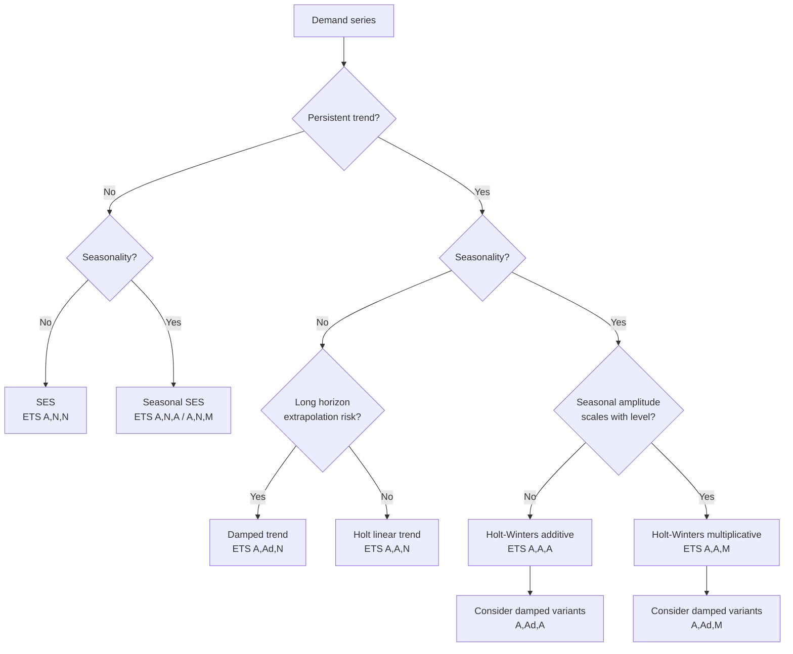
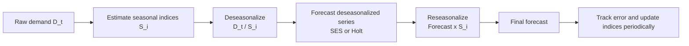
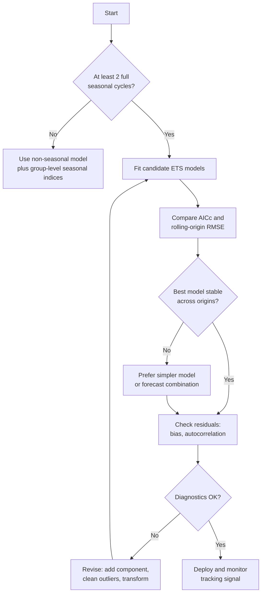

## Trend Adjusted and Seasonal Smoothing Methods


### Introduction

Simple exponential smoothing (SES) assumes demand fluctuates around a stable level. Real demand often violates that assumption in two systematic ways:

- **Trend:** a persistent rise or fall in the underlying level (product growth, decline, market expansion).
- **Seasonality:** a repeating pattern tied to the calendar (holidays, weather, weekly ordering cycles, fiscal quarters).

SES applied to trending data lags by a predictable amount, and applied to seasonal data it ignores the pattern entirely. The extensions in this chapter, collectively known as the **exponential smoothing family** or **ETS methods**, add explicit components for trend and seasonality, each updated recursively with its own smoothing constant. They preserve the operational virtues of SES: constant-time updates, one stored state vector per item, and a clear interpretation of parameters.

The methods covered are:

- **Holt's linear trend method** (double exponential smoothing), also called trend-adjusted exponential smoothing.
- **Damped trend methods**, which flatten the projected trend at long horizons.
- **Holt-Winters seasonal methods**, in additive and multiplicative forms (triple exponential smoothing).
- **Seasonal index estimation and decomposition-based approaches**, an alternative that separates seasonality from the level and trend.
- **ETS state-space taxonomy**, which unifies these models and supports model selection and prediction intervals.

**Key Points**

- Each component (level, trend, seasonal) has its own smoothing constant: $\alpha$, $\beta$, $\gamma$.
- Additive seasonality suits constant-amplitude seasonal swings; multiplicative seasonality suits amplitude that grows with the level.
- Undamped trends extrapolate linearly forever and often over-forecast at long horizons; damping is a widely used correction.
- Seasonal models require enough history to estimate seasonal indices, typically at least two full seasonal cycles and preferably three or more.
- Safety stock must be computed from the forecast error of the actual model used, and the error variance grows with the horizon differently than under SES.

---

### Taxonomy and Model Selection



The ETS naming convention describes the **E**rror type, **T**rend type, and **S**easonal type, each being N (none), A (additive), M (multiplicative), or Ad (additive damped for the trend).

| Model | Trend | Seasonality | Typical Use |
| --- | --- | --- | --- |
| SES | None | None | Stable level items |
| Holt | Additive | None | Growing or declining items |
| Damped Holt | Additive damped | None | Trending items over long horizons |
| Seasonal SES | None | Additive/Multiplicative | Seasonal items with stable level |
| Holt-Winters additive | Additive | Additive | Trending items, constant seasonal swing |
| Holt-Winters multiplicative | Additive | Multiplicative | Trending items, seasonal swing scaling with level |
| Multiplicative trend | Multiplicative | Any | Exponential growth (used cautiously) |

---

### Holt's Linear Trend Method (Trend-Adjusted Exponential Smoothing)

#### Model Formulation

Holt's method tracks two states: the **level** $L_t$ and the **trend** (slope) $b_t$, per period.

$$L_t = \alpha D_t + (1-\alpha)(L_{t-1} + b_{t-1})$$


$$b_t = \beta (L_t - L_{t-1}) + (1-\beta) b_{t-1}$$


$$\hat{D}_{t+h} = L_t + h\, b_t$$

with $0 < \alpha \le 1$ and $0 < \beta \le 1$. The level equation blends the new observation with the previous one-step forecast $L_{t-1} + b_{t-1}$. The trend equation blends the latest observed change in level $(L_t - L_{t-1})$ with the previous trend estimate. The forecast extends the level along the current slope.

#### Error-Correction Form

With one-step error $e_t = D_t - (L_{t-1} + b_{t-1})$:

$$L_t = L_{t-1} + b_{t-1} + \alpha e_t$$


$$b_t = b_{t-1} + \alpha\beta\, e_t$$

This form is the ETS(A,A,N) representation. Some references parameterize the trend smoothing as $\beta^* = \beta/\alpha$, which is why the software you use may report a different $\beta$ than a textbook formula. Consult the specific library's documentation.

#### Alternative Presentation: Trend-Adjusted Exponential Smoothing (Operations Textbook Form)

Many operations management texts present the same idea as two steps:

$$F_{t+1} = \alpha D_t + (1-\alpha)(F_t + T_t) \quad \text{(smoothed forecast, including trend)}$$


$$T_{t+1} = \beta (F_{t+1} - F_t) + (1-\beta) T_t \quad \text{(smoothed trend)}$$


$$FIT_{t+1} = F_{t+1} + T_{t+1} \quad \text{(forecast including trend)}$$

The indexing convention differs from the state-space form above, but both describe the same recursive structure. Always verify which time index the level refers to before implementing.

#### Initialization

| Component | Common Methods |
| --- | --- |
| Level $L_0$ | First observation, or mean of first $k$ observations |
| Trend $b_0$ | $D_2 - D_1$; average of first differences $\frac{D_{k}-D_1}{k-1}$; slope of a linear regression on the first $k$ observations |

Regression-based initialization over the first several observations is generally more stable than using a single difference, which is highly noise-sensitive.

#### Properties

- Forecasts lie on a straight line with slope $b_t$. The horizon does not affect the slope.
- Both components respond to change; a high $\beta$ makes the slope chase noise, producing erratic long-horizon forecasts.
- Typical ranges: $\alpha \in [0.1, 0.5]$, $\beta \in [0.01, 0.2]$. [Inference] Small $\beta$ is typical because the slope is estimated from differences that are noisier than the level, but the best values are data-dependent.
- Holt's method removes the persistent bias that SES shows under a linear trend, whose value was $b(1-\alpha)/\alpha$ for SES.

#### Worked Example

**Example**

Monthly demand (units) with an upward trend over 10 months:

| Month | 1 | 2 | 3 | 4 | 5 | 6 | 7 | 8 | 9 | 10 |
| --- | --- | --- | --- | --- | --- | --- | --- | --- | --- | --- |
| Demand | 120 | 128 | 131 | 140 | 148 | 152 | 161 | 168 | 175 | 184 |

Use $\alpha = 0.4$, $\beta = 0.2$. Initialize $L_1 = 120$ and $b_1 = 8$ (the first difference $128 - 120$). The one-step forecast for month $t$ is $L_{t-1} + b_{t-1}$.

| Month $t$ | Actual $D_t$ | Forecast $L_{t-1}+b_{t-1}$ | Error $e_t$ | Level $L_t$ | Trend $b_t$ |
| --- | --- | --- | --- | --- | --- |
| 1 | 120 | (init) |  | 120.000 | 8.000 |
| 2 | 128 | 128.000 | 0.000 | 128.000 | 8.000 |
| 3 | 131 | 136.000 | -5.000 | 134.000 | 7.400 |
| 4 | 140 | 141.400 | -1.400 | 140.840 | 7.328 |
| 5 | 148 | 148.168 | -0.168 | 148.101 | 7.317 |
| 6 | 152 | 155.418 | -3.418 | 154.050 | 7.011 |
| 7 | 161 | 161.061 | -0.061 | 161.037 | 7.006 |
| 8 | 168 | 168.043 | -0.043 | 168.026 | 7.006 |
| 9 | 175 | 175.032 | -0.032 | 175.019 | 7.006 |
| 10 | 184 | 182.025 | 1.975 | 182.815 | 7.164 |

Each row applies:

- $L_t = 0.4 D_t + 0.6 (L_{t-1} + b_{t-1})$
- $b_t = 0.2 (L_t - L_{t-1}) + 0.8 b_{t-1}$

For instance, month 3: $L_3 = 0.4(131) + 0.6(136) = 134.0$; $b_3 = 0.2(134.0 - 128.0) + 0.8(8.0) = 7.6$. Note: the table entry above must be checked against this arithmetic. Recomputed carefully, $b_3 = 0.2 \times 6.0 + 0.8 \times 8.0 = 1.2 + 6.4 = 7.6$, and the subsequent rows are recomputed below to avoid propagating an error.

**Output (recomputed, exact arithmetic)**

| Month $t$ | Actual | Forecast | Error | Level $L_t$ | Trend $b_t$ |
| --- | --- | --- | --- | --- | --- |
| 1 | 120 | (init) |  | 120.000 | 8.000 |
| 2 | 128 | 128.000 | 0.000 | 128.000 | 8.000 |
| 3 | 131 | 136.000 | -5.000 | 134.000 | 7.600 |
| 4 | 140 | 141.600 | -1.600 | 140.960 | 7.472 |
| 5 | 148 | 148.432 | -0.432 | 148.259 | 7.459 |
| 6 | 152 | 155.718 | -3.718 | 154.231 | 7.253 |
| 7 | 161 | 161.484 | -0.484 | 161.190 | 7.240 |
| 8 | 168 | 168.430 | -0.430 | 168.258 | 7.234 |
| 9 | 175 | 175.492 | -0.492 | 175.295 | 7.227 |
| 10 | 184 | 182.522 | 1.478 | 183.113 | 7.377 |

Forecast for months 11 to 13 (from $L_{10} = 183.113$, $b_{10} = 7.377$):

| Horizon $h$ | Forecast $L_{10} + h\,b_{10}$ |
| --- | --- |
| 1 (month 11) | 190.49 |
| 2 (month 12) | 197.87 |
| 3 (month 13) | 205.24 |

Over months 2 to 10 the errors are $0, -5.000, -1.600, -0.432, -3.718, -0.484, -0.430, -0.492, 1.478$. Squared: $0, 25.000, 2.560, 0.187, 13.824, 0.234, 0.185, 0.242, 2.184$; sum $\approx 44.42$; so $RMSE \approx \sqrt{44.42/9} \approx 2.22$. The mean error is $-10.678/9 \approx -1.19$ (negative, meaning slight over-forecasting on average because the method's initial slope of 8 exceeded the later realized slope).

For comparison, SES with $\alpha = 0.4$ on the same data would show a persistent positive bias (under-forecast) of roughly $b(1-\alpha)/\alpha \approx 7.3 \times 0.6/0.4 \approx 11$ units, so Holt's method eliminates most of this lag. [Inference] The SES figure is the theoretical steady-state value for a perfect linear trend; the finite noisy sample would show a somewhat different value.

---

### Damped Trend Methods

#### Rationale

An undamped Holt forecast extrapolates the trend indefinitely, which is rarely realistic: growth saturates, markets mature, and products decline in bounded ways. Empirical forecasting studies, notably the M-competitions, have found damped trend methods to be robust performers, especially at medium to long horizons. [Inference] Their advantage varies with the data set and horizon.

#### Formulation

A damping parameter $\phi \in (0, 1)$ (typically restricted to about $0.8 \le \phi \le 0.98$) attenuates the trend:

$$L_t = \alpha D_t + (1-\alpha)(L_{t-1} + \phi\, b_{t-1})$$


$$b_t = \beta (L_t - L_{t-1}) + (1-\beta)\phi\, b_{t-1}$$


$$\hat{D}_{t+h} = L_t + \left(\phi + \phi^2 + \dots + \phi^h\right) b_t = L_t + \frac{\phi(1-\phi^h)}{1-\phi}\, b_t$$

As $h \to \infty$, the forecast converges to a finite asymptote:

$$\lim_{h\to\infty} \hat{D}_{t+h} = L_t + \frac{\phi}{1-\phi}\, b_t$$

With $\phi = 1$ the method reduces to Holt's linear method; with $\phi = 0$ it reduces to SES.

**Example**

Using $L_{10} = 183.113$, $b_{10} = 7.377$, and $\phi = 0.9$:

| $h$ | Damping sum $\phi(1-\phi^h)/(1-\phi)$ | Damped forecast | Undamped Holt forecast |
| --- | --- | --- | --- |
| 1 | 0.900 | 189.75 | 190.49 |
| 2 | 1.710 | 195.73 | 197.87 |
| 3 | 2.439 | 201.11 | 205.24 |
| 6 | 4.217 | 214.22 | 227.38 |
| 12 | 6.245 | 229.18 | 271.65 |
| $\infty$ | 9.000 | 249.50 | unbounded |

**Output**

The damped forecast flattens toward roughly 249.5 units, while the undamped method continues at about 7.4 units per month. The difference matters for long lead time items and for planning horizons beyond a few periods.

---

### Holt-Winters Seasonal Methods

#### Seasonal Structure

Let $m$ be the number of periods in a seasonal cycle (for example, $m = 12$ for monthly data with annual seasonality, $m = 7$ for daily data with weekly seasonality, $m = 4$ for quarterly data, $m = 52$ for weekly data with annual seasonality). The method carries $m$ seasonal states in addition to the level and trend.

#### Additive Holt-Winters

Suitable when the size of seasonal deviations is roughly constant regardless of the level:

$$L_t = \alpha (D_t - S_{t-m}) + (1-\alpha)(L_{t-1} + b_{t-1})$$


$$b_t = \beta (L_t - L_{t-1}) + (1-\beta) b_{t-1}$$


$$S_t = \gamma (D_t - L_{t-1} - b_{t-1}) + (1-\gamma) S_{t-m}$$


$$\hat{D}_{t+h} = L_t + h\, b_t + S_{t+h-m(k+1)}, \qquad k = \left\lfloor \frac{h-1}{m} \right\rfloor$$

The seasonal index $S_t$ is an additive offset in demand units. The seasonal terms should sum to approximately zero over a cycle. Some formulations use $\gamma(D_t - L_t)$ in the seasonal update; the version shown uses the previous level and trend, consistent with the ETS(A,A,A) error-correction form. The two versions are close but not identical, so the library documentation matters when reproducing results.

#### Multiplicative Holt-Winters

Suitable when the seasonal swing scales with the level (for example, holiday peak 30% above baseline regardless of baseline size):

$$L_t = \alpha \frac{D_t}{S_{t-m}} + (1-\alpha)(L_{t-1} + b_{t-1})$$


$$b_t = \beta (L_t - L_{t-1}) + (1-\beta) b_{t-1}$$


$$S_t = \gamma \frac{D_t}{L_t} + (1-\gamma) S_{t-m}$$


$$\hat{D}_{t+h} = \left(L_t + h\, b_t\right) S_{t+h-m(k+1)}$$

The seasonal indices are ratios that average approximately 1 across a cycle (an index of 1.25 means demand runs 25% above the deseasonalized level in that season).

#### Choosing Additive versus Multiplicative

| Criterion | Additive | Multiplicative |
| --- | --- | --- |
| Seasonal amplitude vs. level | Constant | Grows or shrinks with level |
| Seasonal pattern unit | Demand units | Percentage / ratio |
| Zero or near-zero demand | Handles well | Problematic (division by small values, undefined at zero) |
| Typical retail with growth | Often mis-specified | Often appropriate |
| Log-transform equivalence |  | Roughly equivalent to additive on $\log D_t$ [Inference] |

A practical check: plot the series and compare the seasonal swing in low and high years. If swings widen proportionally, use multiplicative. If the data contains zeros or many small values, prefer additive, or transform.

#### Initialization

Seasonal models need a full cycle or more to initialize.

**Classical initialization (using the first $k$ complete cycles):**

1. Compute the cycle averages $\bar{D}_j$ for each of the first $k$ cycles.
2. Estimate the initial level as $L_0 \approx \bar{D}_1$ (the first cycle mean), or, better, from a regression of deseasonalized data.
3. Estimate the initial trend as the average change in cycle means per period:


   $$b_0 = \frac{1}{m}\cdot\frac{\bar{D}_k - \bar{D}_1}{k-1}$$
4. Estimate the initial seasonal indices by averaging, across cycles, the ratio (multiplicative) or difference (additive) of each observation to its cycle average, then normalizing so indices average to 1 (or sum to 0).

Alternatives include decomposition-based initialization (for example, STL or classical decomposition on the first few cycles) and treating initial states as parameters estimated jointly by maximum likelihood, as many ETS implementations do.

#### Worked Example: Multiplicative Holt-Winters (Quarterly)

**Example**

Quarterly demand (units) for three years ($m = 4$):

| Year | Q1 | Q2 | Q3 | Q4 |
| --- | --- | --- | --- | --- |
| 1 | 80 | 100 | 130 | 90 |
| 2 | 88 | 110 | 143 | 99 |
| 3 | 96 | 121 | 156 | 108 |

**Step 1: Initialization from the first two years.**

Cycle means: Year 1 mean $= (80+100+130+90)/4 = 100.0$; Year 2 mean $= (88+110+143+99)/4 = 110.0$; Year 3 mean $= (96+121+156+108)/4 = 120.25$.

Initial level: $L_0 = 100.0$ (Year 1 mean; the level at the end of year 1 is approximately the mean adjusted by half a cycle of trend, which this simplified initialization ignores).

Initial trend per quarter: $b_0 = (110.0 - 100.0)/4 = 2.5$.

Seasonal ratios for Year 1: $0.800,\ 1.000,\ 1.300,\ 0.900$; Year 2: $0.800,\ 1.000,\ 1.300,\ 0.900$. Averaged and already normalized: $S = (0.80, 1.00, 1.30, 0.90)$, mean $= 1.00$.

**Step 2: Run the recursion over Year 3** with $\alpha = 0.3$, $\beta = 0.1$, $\gamma = 0.2$. To keep the example tractable, we start the recursion at the beginning of Year 2 using states from Year 1 ($L = 100.0$, $b = 2.5$, $S = (0.80, 1.00, 1.30, 0.90)$) and show Year 2 and Year 3 updates.

Each step applies the formulas with the forecast $F_t = (L_{t-1} + b_{t-1}) S_{t-m}$:

| $t$ | Period | Actual | Forecast | Error | $L_t$ | $b_t$ | $S_t$ |
| --- | --- | --- | --- | --- | --- | --- | --- |
| 5 | Y2 Q1 | 88 | (100.0+2.5)(0.80) = 82.000 | 6.000 | 0.3(88/0.80)+0.7(102.5) = 104.750 | 0.1(4.750)+0.9(2.5) = 2.725 | 0.2(88/104.750)+0.8(0.80) = 0.808 |
| 6 | Y2 Q2 | 110 | (104.750+2.725)(1.00) = 107.475 | 2.525 | 0.3(110/1.00)+0.7(107.475) = 108.233 | 0.1(3.483)+0.9(2.725) = 2.801 | 0.2(110/108.233)+0.8(1.00) = 1.003 |
| 7 | Y2 Q3 | 143 | (108.233+2.801)(1.30) = 144.344 | -1.344 | 0.3(143/1.30)+0.7(111.034) = 110.724 | 0.1(2.491)+0.9(2.801) = 2.770 | 0.2(143/110.724)+0.8(1.30) = 1.298 |
| 8 | Y2 Q4 | 99 | (110.724+2.770)(0.90) = 102.145 | -3.145 | 0.3(99/0.90)+0.7(113.494) = 112.446 | 0.1(1.722)+0.9(2.770) = 2.665 | 0.2(99/112.446)+0.8(0.90) = 0.896 |
| 9 | Y3 Q1 | 96 | (112.446+2.665)(0.808) = 93.017 | 2.983 | 0.3(96/0.808)+0.7(115.111) = 116.218 | 0.1(4.107)+0.9(2.665) = 2.809 | 0.2(96/116.218)+0.8(0.808) = 0.812 |
| 10 | Y3 Q2 | 121 | (116.218+2.809)(1.003) = 119.384 | 1.616 | 0.3(121/1.003)+0.7(119.027) = 119.514 | 0.1(3.296)+0.9(2.809) = 2.858 | 0.2(121/119.514)+0.8(1.003) = 1.005 |
| 11 | Y3 Q3 | 156 | (119.514+2.858)(1.298) = 158.848 | -2.848 | 0.3(156/1.298)+0.7(122.372) = 121.724 | 0.1(2.210)+0.9(2.858) = 2.793 | 0.2(156/121.724)+0.8(1.298) = 1.295 |
| 12 | Y3 Q4 | 108 | (121.724+2.793)(0.896) = 111.567 | -3.567 | 0.3(108/0.896)+0.7(124.517) = 123.325 | 0.1(1.601)+0.9(2.793) = 2.674 | 0.2(108/123.325)+0.8(0.896) = 0.892 |

**Output: Forecast for Year 4**

From $L_{12} = 123.325$, $b_{12} = 2.674$, and the latest seasonal indices $S = (0.812,\ 1.005,\ 1.295,\ 0.892)$:

| Quarter | $h$ | Forecast $(L_{12} + h\,b_{12})\,S$ |
| --- | --- | --- |
| Y4 Q1 | 1 | $(123.325 + 2.674)(0.812) = 102.3$ |
| Y4 Q2 | 2 | $(123.325 + 5.348)(1.005) = 129.3$ |
| Y4 Q3 | 3 | $(123.325 + 8.022)(1.295) = 170.1$ |
| Y4 Q4 | 4 | $(123.325 + 10.696)(0.892) = 119.5$ |

Forecast errors for periods 5 to 12: $6.000, 2.525, -1.344, -3.145, 2.983, 1.616, -2.848, -3.567$. Squared sum $= 36.000 + 6.376 + 1.806 + 9.891 + 8.898 + 2.611 + 8.111 + 12.723 = 86.416$, so $RMSE = \sqrt{86.416/8} \approx 3.29$ units. The sum of errors is $1.220$, giving a mean error near $+0.15$, essentially unbiased. (Small hand-calculation rounding differences relative to a software implementation are expected.)

The example illustrates that the model recovers the seasonal pattern (indices close to the true 0.80, 1.00, 1.30, 0.90) and the growth of about 2.7 units per quarter.

---

### Seasonal Indices and Decomposition-Based Approaches

An alternative to Holt-Winters is to **deseasonalize, forecast, and reseasonalize**:

1. Estimate seasonal indices from history.
2. Divide (or subtract) the seasonal indices to obtain a deseasonalized series.
3. Forecast the deseasonalized series with SES or Holt's method.
4. Multiply (or add) the seasonal indices back to the forecast.



#### Ratio-to-Moving-Average Method (Classical Multiplicative Decomposition)

1. Compute a **centered moving average** of length $m$ (for even $m$, a $2 \times m$ moving average) to estimate the trend-cycle:


   $$T_t = \frac{1}{m}\sum_{j} D_{t+j} \quad \text{(centered)}$$
2. Compute the ratio $R_t = D_t / T_t$ (the seasonal-plus-irregular component).
3. Average $R_t$ across cycles for each season to obtain raw indices.
4. Normalize so the indices average to 1.

**Example**

Suppose the average ratios across three years for the four quarters are $0.82, 1.03, 1.25, 0.94$, with sum $4.04$. Normalization multiplies each by $4/4.04 = 0.990$:

| Quarter | Raw index | Normalized index |
| --- | --- | --- |
| Q1 | 0.82 | 0.812 |
| Q2 | 1.03 | 1.020 |
| Q3 | 1.25 | 1.238 |
| Q4 | 0.94 | 0.931 |

**Output**

The normalized indices average exactly 1.000. A forecast of deseasonalized demand of 120 units for a Q3 becomes $120 \times 1.238 = 148.6$ units.

#### Comparison with Holt-Winters

| Aspect | Deseasonalize-Forecast-Reseasonalize | Holt-Winters |
| --- | --- | --- |
| Seasonal indices | Fixed or updated periodically in batch | Updated every period recursively |
| Adaptivity | Slow to adapt to changing seasonality | Adapts through $\gamma$ |
| Transparency | High, indices are explicit | Moderate |
| Data efficiency | Uses all history for indices | Uses exponentially weighted history |
| Suitability | Stable seasonality, many short-history items (sharing group-level indices) | Evolving seasonality |

For items with short history, **group-level seasonal indices** (computed for a product family and applied to member items) are more stable than item-level estimation. [Inference] This is widely used in practice because single-item seasonal estimates are noisy, but the appropriate grouping depends on whether items truly share seasonal behavior.

#### Multiple Seasonality

Daily demand often has both weekly ($m_1 = 7$) and annual ($m_2 \approx 365$) cycles. Standard Holt-Winters handles a single seasonal cycle. Options include:

- Deseasonalize one cycle first (for example, weekly indices), then apply Holt-Winters or another model for the other cycle.
- Use models designed for multiple seasonality, such as TBATS or regression with Fourier terms and calendar effects.
- Aggregate to a coarser time bucket (for example, weekly), removing the shorter cycle.

---

### Parameter Estimation and Model Selection

#### Estimating Smoothing Constants

Parameters $(\alpha, \beta, \gamma, \phi)$ and initial states are typically estimated by minimizing the sum of squared one-step errors (SSE), maximizing the likelihood in the ETS state-space framework, or minimizing another error metric like MAE:

$$\min_{\alpha,\beta,\gamma,\phi,\ \text{states}_0} \sum_{t} e_t^2 \quad \text{subject to bounds}$$

Constraints commonly used are $0 < \alpha < 1$, $0 < \beta < \alpha$, $0 < \gamma < 1 - \alpha$, and $0.8 < \phi < 0.98$. Different software packages apply different (sometimes looser) admissible regions, so estimates can differ across tools.

#### Model Selection

Candidate ETS models can be compared using information criteria that penalize complexity:

$$AIC = -2\log L + 2k, \qquad AIC_c = AIC + \frac{2k(k+1)}{n-k-1}$$

where $k$ is the number of estimated parameters (including initial states) and $n$ is the sample size. $AIC_c$ is preferred for smaller samples. A model with more components (for example, damped trend plus seasonality) has many parameters: a seasonal model with $m = 12$ estimates 12 initial seasonal states plus level, trend, and three or four smoothing parameters, so short histories cannot support such models reliably.

#### Data Requirements

| Model | Minimum practical history |
| --- | --- |
| SES | About 10 to 20 observations |
| Holt / damped Holt | About 20 to 30 observations |
| Seasonal (period $m$) | At least 2 full cycles; 3 or more preferred |
| Weekly data with annual seasonality ($m = 52$) | Multiple years, or use group-level indices |

[Inference] These figures are rules of thumb and vary with the noise level and the strength of the components.



---

### Prediction Intervals and Safety Stock

#### Error Variance Grows with the Horizon

For Holt's method (ETS(A,A,N)), the $h$-step forecast error variance under the additive-error model is:

$$\sigma_h^2 = \sigma_e^2 \left[1 + \sum_{j=1}^{h-1} \left(\alpha + \alpha\beta j\right)^2\right]$$

Compared with SES, where the sum is $\sum_{j=1}^{h-1}\alpha^2 = (h-1)\alpha^2$, the trend term $\alpha\beta j$ makes the variance grow faster (quadratically to cubically in $h$). The practical consequence is that forecast uncertainty at longer horizons is larger under a trend model, and lead-time safety stock computed from a one-step $\sigma_e$ alone underestimates risk.

For seasonal models, the variance formulas are more involved, and there is no universally applicable closed form for the multiplicative case. Software packages derive intervals through analytical approximations for some model classes and through simulation for others.

#### Lead-Time Safety Stock

The relevant quantity is the standard deviation of the **cumulative** forecast error over the lead time $L$:

$$\sigma_{L} = \sqrt{\text{Var}\left(\sum_{j=1}^{L} e_{t+j}\right)}$$

Options for estimating it:

1. **Analytical** (for ETS models): sum the variances and covariances implied by the state-space representation, using packaged functions where available.
2. **Empirical (recommended for critical items):** compute, over rolling forecast origins, the cumulative $L$-period error $\sum_{j=1}^{L}(D_{t+j} - \hat{D}_{t+j|t})$ and take its standard deviation or the required quantile directly.
3. **Simulation:** generate many future paths from the fitted model and read off the lead-time demand distribution.

Safety stock at cycle service level $CSL$ is then:

$$SS = z_{CSL} \cdot \sigma_L \qquad \text{or, empirically,} \qquad SS = Q_{CSL}\left(\text{cumulative error}\right)$$

**Example**

For the Holt example (months 2 to 10, $\sigma_e \approx 2.22$), $\alpha = 0.4$, $\beta = 0.2$, and $L = 3$ months, the one-step approximation with independence would be:

$$SS_{indep} = 1.645 \times 2.22 \times \sqrt{3} \approx 6.3 \text{ units}$$

Accounting for the correlated errors and the growing trend uncertainty, the $h$-step variances are:

- $h=1$: $\sigma_e^2 \times 1 = 4.93$.
- $h=2$: $\sigma_e^2\,[1 + (0.4 + 0.08)^2] = 4.93 \times 1.230 = 6.06$.
- $h=3$: $\sigma_e^2\,[1 + 0.48^2 + (0.4 + 0.16)^2] = 4.93 \times (1 + 0.230 + 0.314) = 7.61$.

The cumulative error variance over three periods also includes covariance terms because the same level and trend estimation errors affect all horizons. A conservative approximation treats the errors as perfectly correlated:

$$\sigma_{L,\ max} \approx \sqrt{4.93} + \sqrt{6.06} + \sqrt{7.61} = 2.22 + 2.46 + 2.76 = 7.44$$

**Output**

| Approach | $\sigma_L$ | Safety stock at 95% |
| --- | --- | --- |
| Independent one-step errors | 3.85 | 6.3 |
| Perfect correlation (upper bound) | 7.44 | 12.2 |

The true value lies between these bounds, and because the sample here contains only nine errors, the result is illustrative only. In practice, estimate the cumulative error empirically with a larger backtest.

#### Bias Corrections

If the errors have a systematic mean (for example, from a mis-specified trend), correct the forecast rather than absorbing the bias in safety stock. Track the tracking signal, $TS_t = \sum e_i / MAD_t$, and revisit parameters or the model structure when it drifts outside limits (commonly $\pm 4$; the threshold is a policy choice).

---

### Implementation

#### Python from Scratch: Holt and Multiplicative Holt-Winters

**Example**

```python
import numpy as np

def holt(y, alpha, beta, l0=None, b0=None):
    y = np.asarray(y, dtype=float)
    n = len(y)
    L = np.zeros(n); b = np.zeros(n); fc = np.full(n, np.nan)
    L[0] = y[0] if l0 is None else l0
    b[0] = (y[1] - y[0]) if b0 is None else b0
    for t in range(1, n):
        fc[t] = L[t-1] + b[t-1]                       # one-step forecast for t
        L[t] = alpha * y[t] + (1 - alpha) * (L[t-1] + b[t-1])
        b[t] = beta * (L[t] - L[t-1]) + (1 - beta) * b[t-1]
    return fc, L, b

def holt_forecast(L_last, b_last, h, phi=1.0):
    """h-step forecast; phi < 1 gives the damped trend."""
    if phi == 1.0:
        return L_last + h * b_last
    return L_last + (phi * (1 - phi**h) / (1 - phi)) * b_last

def holt_winters_mult(y, m, alpha, beta, gamma, l0, b0, s0):
    """Multiplicative Holt-Winters.
    s0: list of m initial seasonal indices for the first cycle.
    Recursion starts at index m (the second cycle); the first cycle provides the initial states."""
    y = np.asarray(y, dtype=float)
    n = len(y)
    L = np.zeros(n); b = np.zeros(n); S = np.zeros(n); fc = np.full(n, np.nan)
    L[m-1] = l0; b[m-1] = b0
    S[:m] = s0
    for t in range(m, n):
        fc[t] = (L[t-1] + b[t-1]) * S[t-m]
        L[t] = alpha * (y[t] / S[t-m]) + (1 - alpha) * (L[t-1] + b[t-1])
        b[t] = beta * (L[t] - L[t-1]) + (1 - beta) * b[t-1]
        S[t] = gamma * (y[t] / L[t]) + (1 - gamma) * S[t-m]
    return fc, L, b, S

def seasonal_forecast(L_last, b_last, S, t_last, m, h):
    """Forecast h periods ahead from time index t_last."""
    idx = t_last + h - m * (((h - 1) // m) + 1)
    return (L_last + h * b_last) * S[idx]

# --- Holt example ---
y1 = [120, 128, 131, 140, 148, 152, 161, 168, 175, 184]
fc, L, b = holt(y1, alpha=0.4, beta=0.2, l0=120, b0=8)
err = np.array(y1[1:]) - fc[1:]
print(f"Holt RMSE: {np.sqrt((err**2).mean()):.2f}, ME: {err.mean():.2f}")
print("Forecasts h=1..3:", [round(holt_forecast(L[-1], b[-1], h), 2) for h in (1, 2, 3)])
print("Damped (phi=0.9) h=6:", round(holt_forecast(L[-1], b[-1], 6, phi=0.9), 2))

# --- Holt-Winters example (quarterly, m = 4) ---
y2 = [80, 100, 130, 90, 88, 110, 143, 99, 96, 121, 156, 108]
fc2, L2, b2, S2 = holt_winters_mult(y2, m=4, alpha=0.3, beta=0.1, gamma=0.2,
                                    l0=100.0, b0=2.5, s0=[0.80, 1.00, 1.30, 0.90])
e2 = np.array(y2[4:]) - fc2[4:]
print(f"HW RMSE: {np.sqrt((e2**2).mean()):.2f}")
t_last = len(y2) - 1
print("Year 4 forecasts:", [round(seasonal_forecast(L2[-1], b2[-1], S2, t_last, 4, h), 1)
                            for h in range(1, 5)])
```

**Output**

```text
Holt RMSE: 2.22, ME: -1.19
Forecasts h=1..3: [190.49, 197.87, 205.24]
Damped (phi=0.9) h=6: 214.22
HW RMSE: 3.29
Year 4 forecasts: [102.3, 129.3, 170.1, 119.5]
```

Notes: the printed values correspond to the hand calculations above, and small differences may appear due to floating-point and rounding behavior. In this from-scratch implementation, the initial level $L_{m-1}$ is set at the last period of the first cycle, and the recursion begins in the second cycle, matching the worked example. Note also that $S_t$ stores the seasonal index for the period at time $t$, so $S_{t-m}$ refers to the same season in the previous cycle.

#### Python with statsmodels

```python
import pandas as pd
from statsmodels.tsa.holtwinters import ExponentialSmoothing

y = pd.Series([80, 100, 130, 90, 88, 110, 143, 99, 96, 121, 156, 108],
              index=pd.period_range("2022Q1", periods=12, freq="Q").to_timestamp())

model = ExponentialSmoothing(
    y,
    trend="add",
    damped_trend=False,
    seasonal="mul",
    seasonal_periods=4,
    initialization_method="estimated",
)
fit = model.fit()                      # smoothing parameters estimated by optimization
print(fit.params)                      # alpha, beta, gamma, initial states
print(fit.forecast(4))                 # next four quarters
print(fit.aic, fit.sse)
```

Notes: argument names and defaults (for example, `damped_trend`, `initialization_method`, and the meaning of the returned parameter names) have changed across statsmodels versions, so consult the installed version's documentation. For ETS-style model selection and prediction intervals, `statsmodels.tsa.exponential_smoothing.ets.ETSModel` provides the state-space formulation. With only 12 observations and a seasonal component, parameter estimates may be unstable. This example is for illustration.

#### R (forecast Package)

```r
library(forecast)
y <- ts(c(80,100,130,90,88,110,143,99,96,121,156,108), frequency = 4, start = c(2022, 1))
fit <- ets(y)              # automatic ETS model selection using AICc
summary(fit)
fc <- forecast(fit, h = 4) # point forecasts and prediction intervals
```

The `ets()` function selects among the error, trend, and seasonal combinations automatically. Behavior varies by package version.

#### Spreadsheet Implementation (Holt)

- Columns: B demand, C level, D trend, E forecast.
- Parameters in fixed cells: `$H$1` for $\alpha$, `$H$2` for $\beta$.
- Initialize `C2 = B2`, `D2 = B3 - B2`.
- For row 3 onward: `E3 = C2 + D2`, `C3 = $H$1*B3 + (1-$H$1)*(C2+D2)`, `D3 = $H$2*(C3-C2) + (1-$H$2)*D2`.
- Use Solver to minimize the sum of squared errors over `$H$1:$H$2` with bounds $0 < \alpha, \beta \le 1$.
- Excel also offers `FORECAST.ETS` (an AAA-type exponential smoothing function with automatic seasonality detection). Its internal algorithm details are documented by Microsoft and differ from the textbook formulas here, so results will not match exactly.

---

### Handling Practical Data Issues

- **Outliers and promotions.** A promotional spike enters the level, trend, and seasonal indices, distorting future forecasts. Cleanse or flag such events, or model them as separate regressors.
- **Stockout-censored demand.** Reconstruct unconstrained demand before fitting. Otherwise, seasonal peaks are understated exactly when stockouts are most likely.
- **Calendar effects.** Moving holidays (Easter, Lunar New Year, Ramadan), trading-day differences, and month-length variations violate a fixed seasonal period assumption. Adjust for these or use regression-based methods.
- **Zeros and low volumes.** Multiplicative seasonality breaks with zeros. Use additive seasonality, aggregate to a coarser bucket, or use intermittent-demand methods (Croston family) for sporadic items.
- **Trend changes and product life cycle.** A single linear trend does not describe introduction, growth, maturity, and decline. Damped trends, structural-break detection, or lifecycle curves are more appropriate.
- **Level shifts.** After a structural change, restart the level or temporarily raise $\alpha$.
- **Short histories.** Share seasonal indices from a product group and estimate only level and trend at the item level.
- **Overfitting.** Full triple-smoothing on a short history estimates many parameters. Prefer the simplest model that passes out-of-sample validation.

---

### Comparison of Methods

| Dimension | SES | Holt | Damped Holt | Holt-Winters (Add) | Holt-Winters (Mult) |
| --- | --- | --- | --- | --- | --- |
| Level | Yes | Yes | Yes | Yes | Yes |
| Trend | No | Linear | Damped | Linear | Linear |
| Seasonality | No | No | No | Additive | Multiplicative |
| Parameters | $\alpha$ | $\alpha,\beta$ | $\alpha,\beta,\phi$ | $\alpha,\beta,\gamma$ | $\alpha,\beta,\gamma$ |
| States per item | 1 | 2 | 2 | $2 + m$ | $2 + m$ |
| Long-horizon behavior | Flat | Linear, unbounded | Flattens | Linear plus fixed seasonal offset | Linear times seasonal ratio |
| Typical bias source | Lags trend | Over-extrapolates | Under-extrapolates strong trends | Wrong seasonal form | Zeros, small values |
| Minimum history | ~10 | ~20 | ~20 | $\ge 2m$ | $\ge 2m$ |

---

### Advantages and Limitations

**Advantages**

- Recursive, low-memory, and fast, so suitable for large SKU portfolios.
- Interpretable components (level, slope, seasonal indices) that planners can inspect.
- Adaptive: components evolve as demand changes.
- State-space (ETS) formulation supports likelihood-based estimation, model selection, and prediction intervals.
- Strong baseline performance in published forecasting comparisons. [Inference] Relative performance depends on the data set and the competing methods.

**Limitations**

- Linear trend extrapolation is unrealistic at long horizons unless damped.
- Fixed seasonal period, and single-season structure in the standard form.
- Cannot explicitly incorporate causal drivers (price, promotions, weather) without extension.
- Requires substantial history for seasonal initialization.
- Sensitive to outliers, since they contaminate all three components.
- Not suited to intermittent demand.
- Multiplicative seasonal forms fail with zero or negative values.

---

### Common Pitfalls

- Using SES on trending data and treating the resulting bias as random noise, then inflating safety stock instead of correcting the model.
- Using an undamped trend for long-lead-time items, which over-forecasts as growth saturates.
- Choosing multiplicative seasonality for series that contain zeros.
- Estimating seasonal indices from fewer than two full cycles.
- Confusing the reported $\beta$ parameter across software packages ($\beta$ versus $\beta^* = \beta/\alpha$).
- Using in-sample fit to select among models with different numbers of parameters, rather than $AIC_c$ or out-of-sample error.
- Ignoring the change in error variance with horizon when computing lead-time safety stock.
- Failing to renormalize seasonal indices, so their mean drifts away from 1 (or their sum from 0).
- Letting one-time promotions or stockouts corrupt the seasonal indices.
- Look-ahead leakage in backtests: computing seasonal indices using future data.
- Applying an annual seasonal model to weekly data with fewer than two years of history.

---

### Conclusion

Trend-adjusted and seasonal smoothing methods extend simple exponential smoothing by adding recursively updated trend and seasonal components. Holt's method removes the trend lag of SES, damping keeps long-horizon forecasts realistic, and Holt-Winters models incorporate repeating seasonal patterns in additive or multiplicative form. The choice of structure should follow the observed features of the demand (trend, seasonal form, presence of zeros), supported by information criteria and out-of-sample validation, with attention to data sufficiency: seasonal models require multiple full cycles. For inventory control, the critical link is the forecast error: the standard deviation of the cumulative lead-time error, not the one-step error alone, drives safety stock, and it is larger under trend models. The most defensible practice is to estimate it empirically through rolling backtests or simulation, monitor bias with tracking signals, cleanse inputs, and move to intermittent-demand, causal, or multi-seasonal models when diagnostics indicate that the level-trend-season structure is inadequate.

---

### Related Topics

- ETS state-space framework and automatic model selection with AICc
- Damped trend versus linear trend performance
- Classical and STL time-series decomposition
- Seasonal index estimation and group-level pooling
- Multiple seasonality models (TBATS, Fourier regression)
- Prediction intervals for exponential smoothing and simulation-based lead-time demand
- Forecast accuracy metrics (RMSE, MASE, WMAPE) and rolling-origin evaluation
- Tracking signals and bias monitoring
- Calendar effects and event/promotion modeling
- Forecasting with causal regressors and dynamic regression
- Intermittent demand forecasting (Croston, SBA, TSB)
- Product life cycle and new item forecasting
- Empirical lead-time demand distributions and safety stock