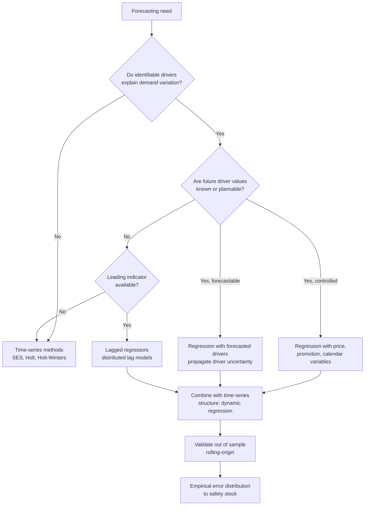
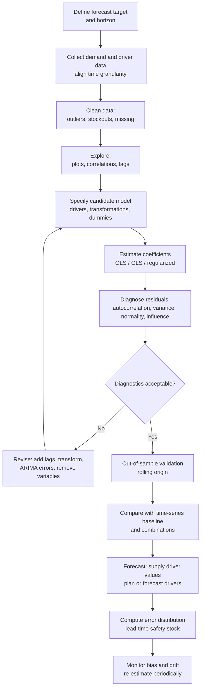

## Regression Based and Causal Forecasting


### Introduction

Time-series smoothing methods forecast demand from its own history. They implicitly assume that whatever drove past demand will continue to act in the same way. When demand is materially influenced by identifiable external or controllable factors, such as price, promotions, advertising, weather, economic indicators, competitor actions, or the calendar, a **causal (associative) model** can exploit that information. It relates demand to explanatory variables (drivers, covariates, regressors) and forecasts demand by supplying values for those drivers.

The workhorse of causal forecasting is **regression**. Regression estimates how much demand changes, on average, when a driver changes, holding other drivers constant. This supports three uses that time-series methods cannot serve well:

1. **Forecasting under planned actions.** Predict demand for a proposed price cut or promotion.
2. **What-if and scenario analysis.** Compare demand under alternative decisions or external conditions.
3. **Explaining variation.** Attribute demand changes to drivers, separating signal from noise and improving the error estimate that feeds safety stock.

The trade-off is that causal models need driver data (historical and future), more maintenance, and more care to avoid spurious relationships.

**Key Points**

- A regression forecast is only as good as the **forecast of the drivers**. Drivers that are controlled (price, promotions) can be planned; drivers that are uncontrolled (weather, GDP) must themselves be forecast, adding uncertainty.
- Correlation is not causation. Regression coefficients have a causal interpretation only under assumptions about confounding, timing, and model form.
- Regression residuals (errors) must be checked for autocorrelation, heteroskedasticity, and non-normality. Time-series data frequently violates the independence assumption of ordinary least squares.
- Safety stock must be based on the **out-of-sample forecast error** of the regression, including uncertainty in driver forecasts, which is larger than the in-sample residual standard deviation.
- Causal and time-series methods are complementary: regression with time-series errors, dynamic regression, and forecast combination often outperform either alone. [Inference] Gains depend on driver quality and data volume.

---

### Where Causal Forecasting Fits



Typical demand drivers by context:

| Driver Type | Examples | Known in Advance? |
| --- | --- | --- |
| Controlled (internal) | Price, discount depth, promotion flag, advertising spend, display placement, distribution coverage | Yes, if planned |
| Calendar | Day of week, month, holiday, payday, school terms | Yes |
| Uncontrolled (external) | Temperature, rainfall, GDP, interest rates, competitor price, fuel price | No, must be forecast |
| Lifecycle | Product age, launch indicator, end-of-life flag | Yes |
| Leading indicators | Housing starts, orders received, web searches, bookings | Available with a lead time |
| Lagged demand | $D_{t-1}$, $D_{t-7}$ | Yes for the next step; not beyond |

---

### Simple Linear Regression

#### Model

With a single driver $X$:

$$D_t = \beta_0 + \beta_1 X_t + \varepsilon_t, \qquad \varepsilon_t \sim (0, \sigma^2)$$

The intercept $\beta_0$ is the expected demand when $X = 0$ (which may lack meaning if $X = 0$ is outside the observed range). The slope $\beta_1$ is the expected change in demand per unit change in $X$.

#### Ordinary Least Squares (OLS) Estimation

OLS chooses coefficients to minimize the sum of squared residuals $\sum (D_t - \hat{D}_t)^2$. For $n$ observations:

$$\hat{\beta}_1 = \frac{\sum_{t=1}^{n} (X_t - \bar{X})(D_t - \bar{D})}{\sum_{t=1}^{n} (X_t - \bar{X})^2} = \frac{S_{XD}}{S_{XX}}, \qquad \hat{\beta}_0 = \bar{D} - \hat{\beta}_1 \bar{X}$$

#### Goodness of Fit

$$R^2 = 1 - \frac{SSE}{SST} = 1 - \frac{\sum (D_t - \hat{D}_t)^2}{\sum (D_t - \bar{D})^2}$$

$R^2$ is the share of demand variance explained in-sample. It never decreases when variables are added, so it is unsuitable for comparing models of different sizes. Use adjusted $R^2$, information criteria, or out-of-sample error.

The standard error of the regression (residual standard deviation) is:

$$s_e = \sqrt{\frac{SSE}{n - k - 1}}$$

where $k$ is the number of drivers. This is the in-sample estimate of $\sigma$.

#### Time as the Driver: Linear Trend Regression

Setting $X_t = t$ yields a deterministic linear trend model, $D_t = \beta_0 + \beta_1 t + \varepsilon_t$. It is a simple causal-style model whose "driver" is time. Unlike Holt's method, its slope is fixed over the sample, which is appropriate only if the trend is stable. [Inference] Holt's method generally adapts better when the trend evolves.

#### Worked Example: Price Sensitivity

**Example**

Weekly unit sales of an item versus its shelf price over 10 weeks:

| Week | Price $X$ ($) | Demand $D$ (units) |
| --- | --- | --- |
| 1 | 10.0 | 200 |
| 2 | 9.5 | 215 |
| 3 | 10.5 | 185 |
| 4 | 9.0 | 235 |
| 5 | 10.0 | 205 |
| 6 | 8.5 | 250 |
| 7 | 11.0 | 170 |
| 8 | 9.0 | 230 |
| 9 | 10.5 | 190 |
| 10 | 8.0 | 260 |

Summary statistics: $\bar{X} = 9.6$, $\bar{D} = 214.0$.

Deviations and products:

| Week | $X - \bar{X}$ | $D - \bar{D}$ | $(X-\bar X)(D-\bar D)$ | $(X-\bar X)^2$ |
| --- | --- | --- | --- | --- |
| 1 | 0.4 | -14 | -5.6 | 0.16 |
| 2 | -0.1 | 1 | -0.1 | 0.01 |
| 3 | 0.9 | -29 | -26.1 | 0.81 |
| 4 | -0.6 | 21 | -12.6 | 0.36 |
| 5 | 0.4 | -9 | -3.6 | 0.16 |
| 6 | -1.1 | 36 | -39.6 | 1.21 |
| 7 | 1.4 | -44 | -61.6 | 1.96 |
| 8 | -0.6 | 16 | -9.6 | 0.36 |
| 9 | 0.9 | -24 | -21.6 | 0.81 |
| 10 | -1.6 | 46 | -73.6 | 2.56 |
| Sum |  |  | -254.0 | 8.40 |

$$\hat{\beta}_1 = \frac{-254.0}{8.40} = -30.24, \qquad \hat{\beta}_0 = 214.0 - (-30.24)(9.6) = 504.3$$

The fitted model is:

$$\hat{D} = 504.3 - 30.24\,X$$

**Output**

Fitted values and residuals:

| Week | Price | Demand | Fitted | Residual |
| --- | --- | --- | --- | --- |
| 1 | 10.0 | 200 | 201.9 | -1.9 |
| 2 | 9.5 | 215 | 217.0 | -2.0 |
| 3 | 10.5 | 185 | 186.8 | -1.8 |
| 4 | 9.0 | 235 | 232.1 | 2.9 |
| 5 | 10.0 | 205 | 201.9 | 3.1 |
| 6 | 8.5 | 250 | 247.3 | 2.7 |
| 7 | 11.0 | 170 | 171.7 | -1.7 |
| 8 | 9.0 | 230 | 232.1 | -2.1 |
| 9 | 10.5 | 190 | 186.8 | 3.2 |
| 10 | 8.0 | 260 | 262.4 | -2.4 |

Squared residuals sum: $3.61 + 4.00 + 3.24 + 8.41 + 9.61 + 7.29 + 2.89 + 4.41 + 10.24 + 5.76 = 59.46$. Total sum of squares: $SST = 196 + 1 + 841 + 441 + 81 + 1296 + 1936 + 256 + 576 + 2116 = 7740$. Then:

$$R^2 = 1 - \frac{59.46}{7740} \approx 0.992, \qquad s_e = \sqrt{\frac{59.46}{8}} \approx 2.73 \text{ units}$$

Interpretation: each $1 increase in price is associated with about 30 fewer units per week, within the observed range of $8 to $11. (Fitted values are rounded, and small differences from software output are expected.) The near-perfect $R^2$ reflects an idealized, illustrative data set. Real price-demand data is noisier, and this fit should not be extrapolated outside the observed price range.

**Forecast for a planned price of $9.25:**

$$\hat{D} = 504.3 - 30.24 \times 9.25 \approx 224.6 \text{ units}$$


---

### Multiple Linear Regression

#### Model

With $k$ drivers:

$$D_t = \beta_0 + \beta_1 X_{1,t} + \beta_2 X_{2,t} + \dots + \beta_k X_{k,t} + \varepsilon_t$$

In matrix form, $\mathbf{D} = \mathbf{X}\boldsymbol{\beta} + \boldsymbol{\varepsilon}$, and the OLS estimator is:

$$\hat{\boldsymbol{\beta}} = (\mathbf{X}^\top \mathbf{X})^{-1} \mathbf{X}^\top \mathbf{D}$$

The covariance of the estimator, under classical assumptions, is $\sigma^2 (\mathbf{X}^\top\mathbf{X})^{-1}$, and $\sigma^2$ is estimated by $s_e^2 = SSE/(n-k-1)$.

Each coefficient $\beta_j$ is the expected change in demand for a one-unit change in $X_j$, holding the other drivers fixed.

#### Classical Assumptions

| Assumption | Meaning | Violation Consequence |
| --- | --- | --- |
| Linearity | $E[D \mid X]$ is linear in parameters | Bias, poor fit |
| Exogeneity | $E[\varepsilon \mid X] = 0$ | Biased, inconsistent coefficients |
| No perfect multicollinearity | Drivers not exact linear combinations | Coefficients not identifiable |
| Homoskedasticity | Constant $\text{Var}(\varepsilon)$ | Inefficient estimates; invalid standard errors |
| No autocorrelation | $\text{Cov}(\varepsilon_t, \varepsilon_s) = 0$ | Standard errors and intervals unreliable |
| Normality (for inference) | $\varepsilon \sim N(0,\sigma^2)$ | Small-sample inference and intervals approximate |

Time-series demand data commonly violates the no-autocorrelation and homoskedasticity assumptions, so diagnostics are needed.

#### Categorical Drivers: Dummy Variables

Qualitative effects are entered as indicator variables:

- **Promotion flag:** $P_t = 1$ if a promotion is running, else 0.
- **Day of week:** six dummies for seven days (one category omitted as the baseline, to avoid perfect collinearity, the "dummy variable trap").
- **Month or holiday:** 11 dummies for 12 months, or specific holiday indicators.

Seasonality can therefore be modeled inside regression, as an alternative to Holt-Winters seasonal indices. With Fourier terms, seasonality with long periods is represented compactly:

$$\sum_{j=1}^{K} \left[ a_j \sin\left(\frac{2\pi j t}{m}\right) + b_j \cos\left(\frac{2\pi j t}{m}\right) \right]$$

where $m$ is the seasonal period and $K$ (at most $m/2$) controls flexibility. This approach handles long or multiple seasonal periods, such as weekly data with $m \approx 52.18$, with far fewer parameters than a full set of dummies.

#### Worked Example: Price, Promotion, and Weekend

**Example**

Suppose a fitted model for daily unit demand of a convenience item is:

$$\hat{D} = 120 - 8.5\,\text{Price} + 45\,\text{Promo} + 30\,\text{Weekend}$$

with $s_e = 12$ units. For a planned day with price $3.00, a promotion running, on a weekend:

$$\hat{D} = 120 - 8.5(3.00) + 45(1) + 30(1) = 120 - 25.5 + 45 + 30 = 169.5 \text{ units}$$

Without the promotion at the same price on a weekday:

$$\hat{D} = 120 - 25.5 = 94.5 \text{ units}$$

**Output**

| Scenario | Forecast |
| --- | --- |
| $3.00, promo, weekend | 169.5 units |
| $3.00, no promo, weekday | 94.5 units |
| $3.50, no promo, weekend | 120 - 29.75 + 30 = 120.25 units |

The what-if capability is the practical advantage. Planners can compare demand and inventory requirements before committing to a promotion, provided the coefficients are estimated from data that cover comparable conditions.

---

### Functional Forms and Transformations

Linear-in-variables models are not always adequate. Common adjustments:

| Form | Model | Interpretation | Typical Use |
| --- | --- | --- | --- |
| Linear | $D = \beta_0 + \beta_1 X$ | Constant unit change | Narrow price ranges |
| Log-log (constant elasticity) | $\ln D = \beta_0 + \beta_1 \ln P$ | $\beta_1$ is the price elasticity | Price response |
| Semi-log | $\ln D = \beta_0 + \beta_1 X$ | $100\beta_1$ percent change per unit $X$ | Promotion depth, growth |
| Quadratic | $D = \beta_0 + \beta_1 X + \beta_2 X^2$ | Curved response, possible peak | Diminishing returns (advertising) |
| Interaction | $D = \dots + \beta_3 X_1 X_2$ | Effect of $X_1$ depends on $X_2$ | Promotion effect varies by season |
| Piecewise linear | Different slopes over ranges | Threshold effects | Price points |

In the log-log form, the coefficient is directly the **price elasticity of demand**: a value of $-1.8$ means a 1% price increase is associated with about a 1.8% decline in demand. Because $\ln D$ is modeled, back-transforming to demand introduces a retransformation bias; a common correction multiplies $\exp(\hat{y})$ by $\exp(s_e^2/2)$ when errors are approximately normal. [Inference] The correction assumes normality and homoskedasticity of log-scale errors.

The log transformation also stabilizes variance and converts multiplicative seasonal and promotional effects into additive ones, mirroring the multiplicative Holt-Winters idea.

---

### Lagged and Dynamic Effects

Demand often responds to drivers with a delay or an extended effect.

#### Distributed Lag Model

$$D_t = \beta_0 + \sum_{j=0}^{q} \gamma_j X_{t-j} + \varepsilon_t$$

Advertising or promotions may have effects that build for several periods, then fade. Lagged terms can also capture **pull-forward and post-promotion dips**: a promotion raises demand in the promoted week and depresses it in the following weeks as customers have stocked up. Including lead and lag indicators around a promotion (for example, $\text{Promo}_{t}$, $\text{Promo}_{t-1}$, $\text{Promo}_{t-2}$) prevents the baseline from being mis-estimated.

#### Adstock (Carryover) Transformation

Marketing effects are commonly modeled with a geometric decay:

$$A_t = X_t + \lambda A_{t-1}, \qquad 0 \le \lambda < 1$$

The regression then uses $A_t$ in place of $X_t$. This resembles exponential smoothing applied to the driver. The decay rate $\lambda$ is estimated by grid search or nonlinear optimization.

#### Leading Indicators

Variables that move before demand (orders booked, web traffic, housing permits) can extend the forecast horizon without needing to forecast the driver: if the indicator leads demand by $\ell$ periods, then $D_{t+\ell}$ can be predicted from $X_t$, which is already observed.

#### Cross-Correlation Analysis

To identify the lag structure, compute the sample cross-correlation between the (prewhitened or differenced) driver and demand at several lags and inspect for significant peaks. Choosing lags purely by significance in a large search inflates false positives; validate on holdout data.

---

### Regression with Time-Series Errors and Dynamic Regression

#### The Autocorrelation Problem

If residuals are serially correlated, OLS coefficient estimates remain unbiased under exogeneity but are inefficient, and the standard errors, $t$-statistics, and prediction intervals are unreliable, typically too narrow. Narrow intervals translate into **understated safety stock**.

**Detection:**

- Residual autocorrelation function (ACF) plot.
- Durbin-Watson statistic:


  $$DW = \frac{\sum_{t=2}^{n}(e_t - e_{t-1})^2}{\sum_{t=1}^{n} e_t^2}$$

  A value near 2 suggests no first-order autocorrelation; values well below 2 suggest positive autocorrelation.
- Ljung-Box test on residuals over several lags.
- Breusch-Godfrey test (valid with lagged dependent variables).

#### Remedies

1. **Regression with ARIMA errors:**


   $$D_t = \beta_0 + \sum_{j}\beta_j X_{j,t} + \eta_t, \qquad \eta_t \sim \text{ARIMA}(p,d,q)$$

   The regression captures the driver effects, while the ARIMA process models the remaining structure in the errors.
2. **Add lagged dependent variables** (ARX or ARDL models): $D_t = \beta_0 + \phi D_{t-1} + \beta_1 X_t + \varepsilon_t$. Multi-step forecasting then needs recursive substitution or direct methods.
3. **Cochrane-Orcutt or generalized least squares** for AR(1) errors.
4. **Robust (Newey-West/HAC) standard errors** to repair inference without changing point estimates.
5. **Differencing** both demand and drivers if the series are non-stationary.

#### Spurious Regression

Regressing one trending (non-stationary) series on another can produce high $R^2$ and significant coefficients even when there is no true relationship, a well-known result in time-series econometrics. Warning signs are a high $R^2$ with a very low Durbin-Watson statistic. Remedies include differencing, checking for cointegration (a stable long-run relationship between non-stationary series), and error-correction models.

---

### Model Building Workflow



#### Data Preparation

- **Align granularity.** Demand and drivers must be measured over the same period (for example, weekly demand with weekly average price).
- **Unconstrain demand.** Sales censored by stockouts understate true demand. Regressing on censored sales biases coefficients toward smaller effects.
- **Treat outliers deliberately.** Identify with residual and leverage diagnostics; do not delete without a reason. Model known events with dummies rather than removing them.
- **Handle missing driver values** through interpolation or exclusion, and document the assumption.
- **Avoid data leakage.** For forecasting, use only information that will be available at the forecast origin (for example, do not use actual future weather unless you would have a forecast of that quality in production).

#### Variable Selection

- Start from domain knowledge about plausible drivers, rather than mining hundreds of variables.
- Use adjusted $R^2$, $AIC$, $BIC$, or cross-validation to compare models. Time-series cross-validation must respect chronology.
- Stepwise selection is prone to overfitting and unstable selection. Regularization is a more stable alternative.
- Check that the sign and magnitude of each coefficient are plausible (price coefficient negative for normal goods, promotion positive).

#### Multicollinearity

When drivers are highly correlated (for example, price and promotion depth move together), individual coefficients become unstable even though joint predictions may be fine.

**Variance Inflation Factor:**

$$VIF_j = \frac{1}{1 - R_j^2}$$

where $R_j^2$ comes from regressing $X_j$ on the other drivers. Values above roughly 5 to 10 are commonly treated as a concern. [Inference] The threshold is a convention, not a strict rule. Remedies include dropping or combining variables, using ridge regression, or collecting data with more variation.

#### Regularization

For many drivers relative to observations, penalized regression stabilizes estimates:

| Method | Penalty | Behavior |
| --- | --- | --- |
| Ridge | $\lambda \sum \beta_j^2$ | Shrinks coefficients, handles collinearity |
| Lasso | $\lambda \sum \lvert\beta_j\rvert$ | Shrinks and can set coefficients to zero (selection) |
| Elastic net | Mix of both | Compromise for correlated groups |

The penalty strength $\lambda$ is selected by time-series-aware cross-validation. Standardize drivers before applying penalties.

---

### Forecasting with a Regression Model

#### Point Forecast

$$\hat{D}_{T+h} = \hat{\beta}_0 + \sum_{j} \hat{\beta}_j \hat{X}_{j,T+h}$$

where $\hat{X}_{j,T+h}$ is the planned or forecast value of driver $j$ at the target period.

#### Ex-Ante versus Ex-Post Forecasts

| Type | Driver values used | Purpose |
| --- | --- | --- |
| **Ex-post** | Actual driver values | Assess the model's structure and coefficients (an upper bound on accuracy) |
| **Ex-ante** | Forecast or planned driver values | Assess real forecasting performance |

Comparing ex-post and ex-ante accuracy reveals how much error originates from driver uncertainty rather than from the regression itself. A model can look excellent ex-post and disappoint ex-ante if its drivers are hard to forecast (for example, temperature two weeks out).

#### Prediction Interval for a New Observation

For simple linear regression, under classical assumptions, the standard error of a new observation at $X_0$ is:

$$SE_{pred} = s_e \sqrt{1 + \frac{1}{n} + \frac{(X_0 - \bar{X})^2}{\sum (X_t - \bar{X})^2}}$$

and the $(1-p)$ prediction interval is $\hat{D}_0 \pm t_{1-p/2,\ n-2}\, SE_{pred}$. The interval widens as $X_0$ moves away from $\bar{X}$, which quantifies the danger of extrapolation. For multiple regression, the analogous quantity is:

$$SE_{pred} = s_e \sqrt{1 + \mathbf{x}_0^\top (\mathbf{X}^\top\mathbf{X})^{-1} \mathbf{x}_0}$$

**Example**

Using the price example ($n = 10$, $s_e = 2.73$, $\bar{X} = 9.6$, $S_{XX} = 8.40$, $t_{0.975,8} = 2.306$), for a planned price of $9.25:

$$SE_{pred} = 2.73\sqrt{1 + 0.1 + \frac{(9.25-9.6)^2}{8.40}} = 2.73\sqrt{1 + 0.1 + 0.0146} = 2.73 \times 1.0558 \approx 2.88$$


$$\text{95\% PI} = 224.6 \pm 2.306 \times 2.88 \approx 224.6 \pm 6.6 = [218.0,\ 231.2]$$

**Output**

At a planned price of $9.25, the point forecast is about 224.6 units, with a 95% prediction interval of roughly 218 to 231 units. At a price outside the fitted range, such as $6.00, $(6 - 9.6)^2/8.40 = 1.543$, so $SE_{pred} = 2.73\sqrt{2.643} \approx 4.44$. The interval widens, and the linearity assumption becomes unverifiable, so such a forecast should not be trusted.

#### Propagating Driver Uncertainty

When $\hat{X}_{T+h}$ is itself uncertain with variance $\sigma_X^2$, a first-order (delta method) approximation of the forecast variance for a single driver is:

$$\text{Var}(D_{T+h}) \approx SE_{pred}^2 + \hat{\beta}_1^2\, \sigma_X^2$$

Ignoring the second term understates uncertainty. For multiple correlated drivers, use the full covariance matrix, or simulate: sample driver paths from their forecast distributions, run each through the model, and read off the resulting demand distribution. [Inference] This approximation assumes small driver variance and a locally linear response.

---

### From Regression Error to Safety Stock

Safety stock protects against the difference between forecast and realized demand over the lead time. For a regression model:

- **Use the out-of-sample error**, not the in-sample residual standard deviation. The in-sample $s_e$ is optimistic because the coefficients were fitted to those points, and it omits driver forecast error.
- **Estimate the lead-time error distribution directly** by rolling-origin backtests: at each origin, forecast the next $L$ periods using only data and driver forecasts available at that origin, and record the cumulative error $\sum_{j=1}^{L} (D_{t+j} - \hat{D}_{t+j|t})$.
- **Autocorrelation matters.** If residuals are positively autocorrelated, the variance of the cumulative error exceeds $L\,\sigma_e^2$, so $z\,\sigma_e\sqrt{L}$ understates safety stock.

$$SS = z_{CSL}\cdot \sigma_{L}, \qquad \sigma_{L}^2 = \text{Var}\left(\sum_{j=1}^{L} e_{t+j}\right)$$

For AR(1) residuals with parameter $\rho$ and one-step variance $\sigma_e^2$ (stationary), the cumulative variance is:

$$\text{Var}\left(\sum_{j=1}^{L} e_j\right) = \sigma_e^2\left[L + 2\sum_{k=1}^{L-1}(L-k)\rho^k\right]$$

**Example**

For $L = 3$, $\sigma_e = 12$ units, and $\rho = 0.5$:

$$\text{factor} = 3 + 2\left[(3-1)(0.5) + (3-2)(0.25)\right] = 3 + 2(1.0 + 0.25) = 5.5$$


$$\sigma_L = 12\sqrt{5.5} \approx 28.1, \qquad SS_{95\%} = 1.645 \times 28.1 \approx 46.3 \text{ units}$$

The independent-errors approximation gives $1.645 \times 12 \times \sqrt{3} \approx 34.2$ units.

**Output**

| Approach | $\sigma_L$ | Safety stock (95%) |
| --- | --- | --- |
| Independent errors | 20.8 | 34.2 |
| AR(1) errors, $\rho = 0.5$ | 28.1 | 46.3 |

Ignoring positive autocorrelation understates safety stock by about 26% in this illustration.

**Benefit of causal information.** If the drivers explain a significant part of demand variability, the residual $\sigma_e$ is smaller than the standard deviation of raw demand, reducing safety stock. But this benefit materializes only if the drivers are known or forecastable at the time of the decision. A promotion flag known months ahead is a strong advantage; weather known only three days ahead helps for short lead times but not for long ones.

---

### Regression for Specific Demand Planning Situations

#### Promotion Forecasting

- Decompose demand into **baseline** (what would sell without the promotion) and **lift**.
- Model lift as a function of discount depth, promotion mechanic (percent off, multibuy), display, and feature advertising.
- Include pre- and post-promotion effects (pull-forward, cannibalization, halo effects on related items).
- Log-log or semi-log forms are common for discount response.
- Model cannibalization by including the promotion flags and prices of substitute products.

#### New Product Forecasting

With no demand history, regression on product attributes across analogous items can produce a forecast:

$$\text{Launch demand} = \beta_0 + \beta_1\,\text{Price} + \beta_2\,\text{Category} + \beta_3\,\text{Distribution} + \dots$$

Attribute-based models are a systematic version of the historical analogy method. Their accuracy depends on how comparable the training set of products is to the new item.

#### Price Optimization Inputs

A log-log price model gives the elasticity used in revenue or margin optimization. For a constant-elasticity demand function $D = A P^{\varepsilon}$ with $\varepsilon < -1$ and unit cost $c$, the profit-maximizing price is:

$$P^* = \frac{\varepsilon}{1 + \varepsilon}\, c = \frac{|\varepsilon|}{|\varepsilon| - 1}\, c$$

For example, with $\varepsilon = -2.5$ and $c = \$4$, $P^* = \frac{2.5}{1.5}\times 4 \approx \$6.67$. Real pricing decisions require checking that the elasticity estimate is credible (identification, endogeneity of price, competitor response). [Inference] Observed price variation in retail data is often set in response to expected demand, which can bias naive elasticity estimates.

#### Macroeconomic and Industrial Demand

Business-to-business demand often depends on economic indicators (industrial production, construction activity, commodity prices). Models typically use growth rates or logs, lagged indicators, and sometimes cointegration or error-correction structure. Their uncertainty increases at long horizons because the indicators themselves must be forecast.

#### Intermittent Demand Regression

For very lumpy items, standard OLS is inadequate because demand is nonnegative, discrete, and zero-heavy. Options include Poisson or negative binomial regression (count models), zero-inflated or hurdle models, and two-stage approaches that model occurrence and size separately. These use the same idea (demand as a function of drivers) with distributions suited to the data.

---

### Generalized Linear Models and Machine Learning Extensions

| Approach | Description | Use in Demand Forecasting |
| --- | --- | --- |
| Poisson / negative binomial GLM | Log link, count distribution | Low-volume, discrete demand; overdispersion handled by negative binomial |
| Tweedie GLM | Compound Poisson-gamma | Zero-heavy, positive-skewed continuous demand |
| Quantile regression | Models conditional quantiles directly | Direct estimate of lead-time demand quantile for safety stock |
| Generalized additive models (GAM) | Smooth nonlinear terms | Nonlinear price, temperature, seasonal effects |
| Gradient boosted trees | Ensemble of trees | Many drivers, interactions, global models across SKUs |
| Neural networks | Nonlinear function approximation | Large panel data with rich features |

**Quantile regression** deserves emphasis in inventory contexts: fitting the conditional $\tau$-quantile of lead-time demand (with $\tau$ equal to the target service level) gives the reorder point directly and does not require a normality assumption:

$$\hat{\beta}(\tau) = \arg\min_{\beta} \sum_t \rho_\tau\left(D_t - \mathbf{x}_t^\top \beta\right), \qquad \rho_\tau(u) = u\,(\tau - \mathbb{1}[u < 0])$$

**Machine learning cautions.** These models need feature engineering (lags, rolling statistics, calendar features, price ratios), time-aware validation, and monitoring for drift. Interpretability and what-if reliability are lower, and causal interpretation of feature importance is not justified without further assumptions. [Inference] Whether ML beats a well-specified regression baseline depends on the data volume and driver richness, so benchmark against simple models.

---

### Implementation

#### Python from Scratch and with statsmodels

**Example**

```python
import numpy as np
import pandas as pd
from scipy import stats

# ---------- Simple regression from scratch (price example) ----------
price = np.array([10.0, 9.5, 10.5, 9.0, 10.0, 8.5, 11.0, 9.0, 10.5, 8.0])
demand = np.array([200, 215, 185, 235, 205, 250, 170, 230, 190, 260], dtype=float)

n = len(price)
xbar, ybar = price.mean(), demand.mean()
Sxx = ((price - xbar) ** 2).sum()
Sxy = ((price - xbar) * (demand - ybar)).sum()
b1 = Sxy / Sxx
b0 = ybar - b1 * xbar

fitted = b0 + b1 * price
resid = demand - fitted
sse = (resid ** 2).sum()
sst = ((demand - ybar) ** 2).sum()
r2 = 1 - sse / sst
se = np.sqrt(sse / (n - 2))

print(f"b0={b0:.1f}, b1={b1:.2f}, R2={r2:.3f}, s_e={se:.2f}")

# Prediction with 95% interval at price 9.25
x0 = 9.25
pred = b0 + b1 * x0
se_pred = se * np.sqrt(1 + 1 / n + (x0 - xbar) ** 2 / Sxx)
tcrit = stats.t.ppf(0.975, df=n - 2)
print(f"Forecast at {x0}: {pred:.1f}  PI: [{pred - tcrit*se_pred:.1f}, {pred + tcrit*se_pred:.1f}]")

# Durbin-Watson
dw = (np.diff(resid) ** 2).sum() / (resid ** 2).sum()
print(f"Durbin-Watson: {dw:.2f}")
```

**Output**

```text
b0=504.3, b1=-30.24, R2=0.992, s_e=2.73
Forecast at 9.25: 224.6  PI: [218.0, 231.2]
Durbin-Watson: 2.53
```

(Values match the hand calculation to rounding. The Durbin-Watson figure is computed from the unrounded residuals and is reported here as an approximate illustration; exact output depends on floating-point arithmetic.)

```python
import statsmodels.api as sm
import statsmodels.formula.api as smf

# ---------- Multiple regression with a log-log form and dummies ----------
# df columns: units, price, promo (0/1), weekend (0/1), temp
df = pd.DataFrame({
    "units":   [...],   # historical demand
    "price":   [...],
    "promo":   [...],
    "weekend": [...],
    "temp":    [...],
})
df["ln_units"] = np.log(df["units"])
df["ln_price"] = np.log(df["price"])

model = smf.ols("ln_units ~ ln_price + promo + weekend + temp", data=df).fit(
    cov_type="HAC", cov_kwds={"maxlags": 7}    # autocorrelation-robust standard errors
)
print(model.summary())
print("Price elasticity:", model.params["ln_price"])

# Residual diagnostics
from statsmodels.stats.diagnostic import acorr_ljungbox, het_breuschpagan
print(acorr_ljungbox(model.resid, lags=[7, 14]))
print(het_breuschpagan(model.resid, model.model.exog))

# ---------- Regression with ARIMA errors (SARIMAX) ----------
from statsmodels.tsa.statespace.sarimax import SARIMAX
exog = df[["ln_price", "promo", "weekend", "temp"]]
sarimax = SARIMAX(df["ln_units"], exog=exog, order=(1, 0, 1)).fit(disp=False)
# Forecasting requires future exog values
# fc = sarimax.get_forecast(steps=14, exog=future_exog)
```

Notes: the second block uses placeholders (`[...]`) for data and will not run until they are filled in. Method and keyword names (for example, `cov_type="HAC"`, `SARIMAX` arguments, and the return format of `acorr_ljungbox`) can vary across statsmodels versions, so consult the installed documentation.

#### Rolling-Origin Backtest Skeleton for Lead-Time Error

```python
import numpy as np

def rolling_lead_time_errors(df, fit_fn, predict_fn, start, L, step=1):
    """For each origin t >= start: fit on data up to t, forecast next L periods
    using driver values known/planned at t, record cumulative error."""
    errs = []
    for t in range(start, len(df) - L, step):
        train = df.iloc[:t]
        model = fit_fn(train)
        future = df.iloc[t:t + L]                 # in production, use planned/forecast drivers
        pred = predict_fn(model, future)
        errs.append((future["units"].values - pred).sum())
    return np.array(errs)

# errs = rolling_lead_time_errors(df, fit_fn, predict_fn, start=52, L=3)
# safety_stock = np.quantile(errs, 0.95)      # empirical 95th percentile of cumulative error
```

This directly estimates the cumulative lead-time error distribution and avoids assuming normality or independence. To reflect true ex-ante performance, `future` must contain forecast (not realized) values of uncontrolled drivers.

#### Spreadsheet Implementation

- **Simple regression:** `=SLOPE(demand_range, driver_range)`, `=INTERCEPT(...)`, `=RSQ(...)`, `=STEYX(...)`, `=FORECAST.LINEAR(x, demand_range, driver_range)`.
- **Multiple regression:** `=LINEST(demand_range, drivers_range, TRUE, TRUE)` entered as an array formula, returning coefficients (in reverse column order) and regression statistics. The Data Analysis ToolPak's Regression tool produces a full report.
- **Dummy variables:** create explicit 0/1 columns.

---

### Diagnostics and Validation

| Diagnostic | Purpose | Action if Failed |
| --- | --- | --- |
| Residuals vs. fitted plot | Nonlinearity, heteroskedasticity | Transform, add terms, weighted regression |
| Residual ACF, Ljung-Box, Durbin-Watson | Autocorrelation | ARIMA errors, lagged terms, HAC standard errors |
| Breusch-Pagan / White test | Heteroskedasticity | Log transform, weighted least squares, robust SE |
| Q-Q plot, Shapiro-Wilk | Normality of residuals | Transform, use empirical intervals |
| VIF | Multicollinearity | Drop or combine drivers, ridge |
| Cook's distance, leverage | Influential observations | Investigate, model events explicitly |
| Rolling-origin RMSE/MAE vs. baselines | Out-of-sample accuracy | Simplify, regularize, revise drivers |
| Bias and tracking signal in production | Drift | Re-estimate, check driver quality |

**Baseline comparison.** A causal model must beat at least a naive or exponential smoothing benchmark out of sample to justify its added complexity. Report **Forecast Value Added (FVA)** of the driver information.

**Structural stability.** Coefficients may change over time (new competitors, changed customer behavior). Test parameter stability with rolling estimation (for example, plotting coefficients over expanding or moving windows) or formal tests such as the Chow test, and re-estimate on a regular schedule.

---

### Combining Causal and Time-Series Approaches

| Strategy | Description |
| --- | --- |
| Regression with ARIMA/ETS errors | Regression for drivers plus a time-series model for the residual structure |
| Two-stage (baseline + lift) | Time-series baseline for underlying demand, regression for event effects on the ratio or difference |
| Forecast combination | Average or weighted average of causal and time-series forecasts; often reduces error variance |
| Hierarchical modeling | Shared coefficients across related items (partial pooling) to stabilize sparse series |
| Model on residuals | Fit regression to the errors of a time-series forecast to capture driver effects |
| Judgmental overlay | Planner adjustments for information not in the model, tracked with FVA |

---

### Advantages and Limitations

**Advantages**

- Uses information beyond demand history; can anticipate changes that smoothing methods only react to.
- Supports what-if planning for controllable drivers such as price and promotions.
- Coefficients are interpretable (elasticities, lift), which supports business discussion and validation.
- Can lower forecast error variance, and therefore safety stock, when drivers are informative and known in advance.
- Handles events, holidays, and price changes explicitly.
- Provides prediction intervals through standard theory (subject to assumptions).

**Limitations**

- Requires driver data with sufficient variation, and reliable future driver values.
- Uncontrolled drivers add forecast uncertainty that can negate their benefit.
- Risk of spurious relationships and overfitting, especially with many candidate drivers and short samples.
- Coefficients have a causal interpretation only under strong assumptions; observational price data often suffers from endogeneity.
- Assumes stable relationships; structural change degrades performance.
- Higher maintenance burden than smoothing methods (data pipelines, re-estimation, monitoring).
- Cannot extrapolate reliably beyond the observed driver range.
- Autocorrelated errors invalidate standard inference if ignored.

---

### Common Pitfalls

- Reporting ex-post accuracy (with actual driver values) as if it were forecasting accuracy.
- Ignoring forecast error in uncontrolled drivers such as weather or macroeconomic indicators.
- Fitting on stockout-censored sales and underestimating true price or promotion effects.
- Using in-sample $R^2$ or $s_e$ as the estimate of forecast error, and thereby understating safety stock.
- Treating a high $R^2$ from trending series as evidence of a relationship (spurious regression).
- Omitting the post-promotion dip or cannibalization, causing the baseline to be overstated.
- Falling into the dummy variable trap by including all categories along with an intercept.
- Extrapolating price or promotion effects beyond the range observed in the data.
- Including variables whose values will not be known at forecast time (data leakage).
- Stepwise selection among many variables without out-of-sample validation.
- Treating estimated coefficients as constant over long periods without stability checks.
- Applying independent-error safety stock formulas to autocorrelated regression residuals.
- Interpreting a price coefficient causally when price was set in reaction to expected demand.

---

### Conclusion

Regression-based and causal forecasting relate demand to explanatory drivers, enabling forecasts that respond to planned actions and known future conditions instead of only extrapolating history. Ordinary least squares provides the foundation, and extensions (dummy variables, transformations, lags, adstock, ARIMA errors, regularization, GLMs, and quantile regression) adapt it to the features of real demand data. The method's value depends on whether the drivers are informative and, critically, known or forecastable at the time decisions are made. For inventory management, the essential discipline is measuring the **out-of-sample, ex-ante** forecast error over the lead time, including driver uncertainty and residual autocorrelation, and using that distribution to set safety stock. Causal models are most effective when combined with time-series structure, benchmarked against simple baselines, validated with rolling-origin backtests, and monitored for coefficient drift.

---

### Related Topics

- Ordinary least squares theory, inference, and diagnostics
- Price elasticity estimation and endogeneity
- Promotion lift modeling, cannibalization, and pull-forward effects
- Dynamic regression, ARIMAX, and SARIMAX
- Distributed lag and adstock models
- Cointegration and error-correction models
- Generalized linear models for count and zero-heavy demand
- Quantile regression and direct reorder-point estimation
- Regularization (ridge, lasso, elastic net) and time-series cross-validation
- Machine learning global models for multi-SKU forecasting
- Leading indicators and macroeconomic forecasting
- Hierarchical and pooled models for sparse item data
- Forecast Value Added (FVA) and forecast combination
- Ex-ante driver forecasting and scenario simulation
- Empirical lead-time demand distributions and safety stock