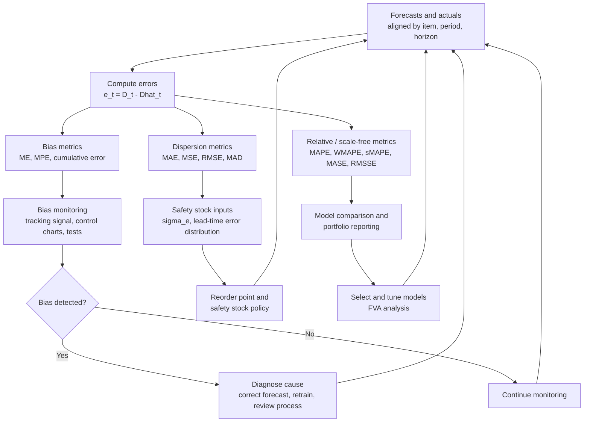
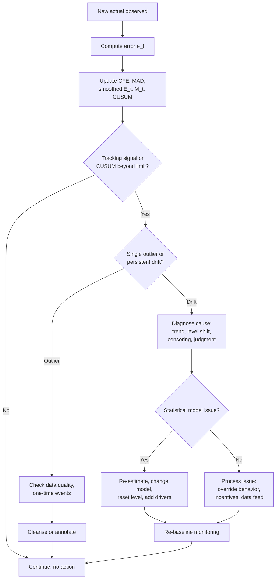
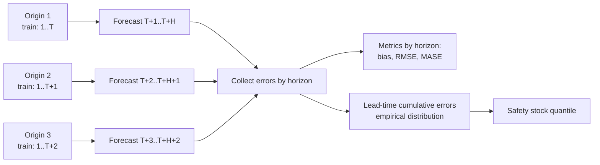

## Forecast Accuracy Metrics and Bias Detection


### Introduction

A forecast that cannot be measured cannot be improved, and a forecast whose error cannot be characterized cannot be used to set safety stock. Forecast accuracy measurement serves three distinct purposes in inventory management:

1. **Method selection and tuning.** Compare candidate models and choose smoothing constants, window lengths, or driver sets using out-of-sample error.
2. **Process monitoring.** Detect deterioration, drift, and systematic bias in production forecasts so corrective action can be taken before service level or inventory investment suffers.
3. **Safety stock calibration.** Estimate the distribution of forecast error over the replenishment lead time, which is the direct input to safety stock and reorder point calculations.

These purposes call for different metrics. A metric well suited to ranking models across thousands of SKUs (scale-free, robust to zeros) is not necessarily the metric that feeds a safety stock formula (unit-based, standard deviation of error). Using the wrong metric for the purpose is a common source of poor decisions.

Two conceptually separate error components must always be distinguished:

- **Bias:** the systematic, directional part of error (consistent over- or under-forecasting). Bias should be corrected in the forecast itself.
- **Variability (dispersion):** the random part of error. Variability is what safety stock is designed to buffer.

**Key Points**

- Error is conventionally defined as $e_t = D_t - \hat{D}_t$ (actual minus forecast), so positive error means under-forecast. Some organizations use the opposite sign, so always state the convention.
- No single metric is sufficient. Report at least one bias metric, one scale-dependent dispersion metric (for safety stock), and one scale-free or relative metric (for comparison).
- Percentage errors (MAPE) fail on zero and low-volume demand and are asymmetric. Weighted and scaled alternatives (WMAPE, MASE, RMSSE) are more robust.
- Accuracy must be measured out of sample, at the correct horizon, at the correct aggregation level, and against a naive benchmark.
- Bias detection uses cumulative and smoothed statistics (tracking signal, cumulative forecast error) with control limits, and formal tests (t-test on mean error, runs test, Mincer-Zarnowitz regression).
- The standard deviation of forecast error over the lead time, not the standard deviation of raw demand, is the appropriate input to safety stock.

---

### Framework Overview



---

### Error Definitions and Notation

For a series of $n$ forecast-actual pairs at a fixed horizon:

| Symbol | Meaning |
| --- | --- |
| $D_t$ | Actual demand in period $t$ |
| $\hat{D}_t$ | Forecast for period $t$ (made at a specified origin and horizon) |
| $e_t = D_t - \hat{D}_t$ | Forecast error (positive means under-forecast) |
| $p_t = 100\, e_t / D_t$ | Percentage error |
| $n$ | Number of evaluated periods |

**Sign convention warning.** Some references (and some ERP systems) define error as forecast minus actual, which reverses the interpretation of bias sign. Statements such as "positive bias means over-forecasting" are valid only under that alternative convention. This document uses actual minus forecast throughout.

#### Fixed-Origin versus Rolling-Origin and Horizon

A "forecast" for period $t$ is defined by when it was made:

- **One-step-ahead:** made in period $t-1$.
- **$h$-step-ahead:** made in period $t-h$.
- **Lag-$\ell$ forecast:** the forecast frozen $\ell$ periods before the target period, which is the relevant version when replenishment decisions must be committed $\ell$ periods in advance (for example, at the lead time).

Accuracy typically deteriorates with horizon. The correct evaluation lag for inventory purposes is the **replenishment lead time plus review period**, because that is when the decision is committed. Measuring one-step-ahead accuracy on a monthly series while the lead time is three months gives an optimistic error estimate.

---

### Scale-Dependent Metrics (Same Units as Demand)

These metrics are expressed in demand units, so they are meaningful for a single item or for comparing methods on the same item, but they cannot be compared across items with different volumes.

#### Mean Error (ME) / Bias

$$ME = \frac{1}{n}\sum_{t=1}^{n} e_t$$

- Positive ME: forecasts are on average too low (under-forecast).
- Negative ME: forecasts are on average too high (over-forecast).
- Errors of opposite sign cancel, so ME measures direction only and can be near zero when large errors offset each other.

#### Mean Absolute Error (MAE) and Mean Absolute Deviation (MAD)

$$MAE = \frac{1}{n}\sum_{t=1}^{n} |e_t|$$

In practice, MAD often refers to the same quantity (mean absolute deviation of forecast errors from zero). Some texts define MAD as deviation from the mean error; state the definition used. MAE is easy to interpret ("on average, the forecast misses by X units") and is less sensitive to outliers than squared-error metrics. The MAE-minimizing forecast is the conditional median.

#### Mean Squared Error (MSE) and Root Mean Squared Error (RMSE)

$$MSE = \frac{1}{n}\sum_{t=1}^{n} e_t^2, \qquad RMSE = \sqrt{MSE}$$

RMSE penalizes large errors more heavily. The MSE-minimizing forecast is the conditional mean. RMSE decomposes into bias and variance components:

$$MSE = ME^2 + \sigma_e^2 \quad \Rightarrow \quad RMSE = \sqrt{ME^2 + \sigma_e^2}$$

where $\sigma_e^2$ is the (population-form) variance of errors around their mean. For an unbiased forecast, $RMSE = \sigma_e$, which is why RMSE is the natural estimator of the error standard deviation used in safety stock.

#### Standard Deviation of Forecast Error

$$s_e = \sqrt{\frac{1}{n-1}\sum_{t=1}^{n}\left(e_t - ME\right)^2}$$

If the forecast is biased, $s_e$ (deviation around the mean error) is smaller than RMSE. Which one belongs in the safety stock formula depends on whether the bias will be corrected:

- If the forecast will be **bias-corrected**, use $s_e$.
- If the bias is **left in place**, RMSE is the more conservative and appropriate choice, since it includes the systematic component.

#### MAD to Sigma Conversion

For normally distributed errors:

$$\sigma_e \approx \sqrt{\frac{\pi}{2}}\,MAD \approx 1.2533 \times MAD$$

This is often approximated as $\sigma \approx 1.25\,MAD$. The relationship holds only for approximately normal, unbiased errors. With heavy tails or bias, it misstates $\sigma_e$.

---

### Percentage-Based Metrics

#### Mean Percentage Error (MPE)

$$MPE = \frac{100}{n}\sum_{t=1}^{n}\frac{e_t}{D_t}$$

A relative bias measure. It is undefined when any $D_t = 0$ and dominated by low-demand periods.

#### Mean Absolute Percentage Error (MAPE)

$$MAPE = \frac{100}{n}\sum_{t=1}^{n}\left|\frac{e_t}{D_t}\right|$$

MAPE is widely used because it is easy to communicate and scale-free. Its known weaknesses are serious for inventory work:

| Weakness | Explanation |
| --- | --- |
| Undefined at zero | $D_t = 0$ produces division by zero; intermittent items cannot be evaluated |
| Explodes at low volume | A miss of 2 units on demand of 1 gives 200% error |
| Asymmetric | Over-forecasts have unbounded percentage error; under-forecasts are capped at 100% |
| Favors low forecasts | A method that systematically under-forecasts can achieve a lower MAPE than an unbiased one |
| Unweighted | Averaging item-level MAPEs gives equal influence to tiny and huge items |

The asymmetry can be seen directly. If actual demand is 100 and the forecast is 150, MAPE contribution is 50%. If the forecast is 50, the contribution is also 50%; but the range differs: forecasts can be at most 100 units below actual (100% error) but arbitrarily far above.

Consider actual $D = 100$ with forecast candidates:

| Forecast | Error | Absolute % Error |
| --- | --- | --- |
| 50 | 50 | 50% |
| 150 | -50 | 50% |
| 0 | 100 | 100% (maximum for under-forecasts) |
| 300 | -200 | 200% (no upper bound) |

When the actual is the forecast target's true mean, minimizing expected MAPE pushes forecasts downward. [Inference] This is a known theoretical property of MAPE and it can encourage under-forecasting in practice if a team is evaluated on MAPE alone.

#### Weighted MAPE (WMAPE / WAPE) and Forecast Accuracy Percentage

$$WMAPE = \frac{\sum_{t=1}^{n}|e_t|}{\sum_{t=1}^{n}D_t}$$

WMAPE is the total absolute error divided by total demand. It is equivalent to MAE divided by mean demand. Advantages: defined whenever total demand is positive, robust to individual low or zero periods, and volume-weighted when aggregated across items:

$$WMAPE_{portfolio} = \frac{\sum_{i}\sum_{t}|e_{i,t}|}{\sum_{i}\sum_{t}D_{i,t}}$$

**Forecast accuracy** is commonly reported as $1 - WMAPE$ (floored at zero), though conventions vary by company. Because volume weighting is dominated by high-volume items, a portfolio WMAPE can look healthy while many slow-moving items are poorly forecast. Report distribution by segment (ABC class, demand pattern) as well.

#### Symmetric MAPE (sMAPE)

Several definitions exist. A common one:

$$sMAPE = \frac{100}{n}\sum_{t=1}^{n}\frac{|e_t|}{(|D_t| + |\hat{D}_t|)/2}$$

This bounds the metric between 0% and 200% and reduces the asymmetry of MAPE, but it is not truly symmetric (it penalizes under- and over-forecasts of the same magnitude unequally when the two are considered as ratios), and it is still unstable when both actual and forecast are near zero. [Inference] Several forecasting researchers advise against sMAPE for these reasons, so prefer scaled errors where possible.

#### Mean Absolute Percentage Error relative to a Forecast Denominator

Some supply chain practitioners divide by the forecast instead of the actual to avoid zero-actual problems, or use the maximum of the two. These variants change the behavior (dividing by the forecast penalizes over-forecasts less) and should be documented explicitly.

---

### Scaled and Relative Metrics

These metrics compare the error of the method under evaluation to the error of a benchmark, producing scale-free numbers that are defined for zero-heavy series and can be averaged across items.

#### Mean Absolute Scaled Error (MASE)

$$MASE = \frac{\frac{1}{n}\sum_{t=1}^{n}|e_t|}{\frac{1}{T-m}\sum_{t=m+1}^{T}|D_t - D_{t-m}|}$$

The denominator is the in-sample MAE of the (seasonal) naive forecast computed on the training data, with $m = 1$ for the non-seasonal naive and $m$ equal to the seasonal period for seasonal naive; $T$ is the length of the training series.

- $MASE < 1$: the method beats the in-sample naive benchmark.
- $MASE = 1$: equal to naive.
- $MASE > 1$: worse than naive.

MASE is scale-free, defined whenever the training series is not constant, handles zeros, and can be averaged across items. For intermittent series, the naive denominator can be small or zero-ish, so interpret with care.

#### Root Mean Squared Scaled Error (RMSSE)

$$RMSSE = \sqrt{\frac{\frac{1}{n}\sum_{t=1}^{n}e_t^2}{\frac{1}{T-1}\sum_{t=2}^{T}(D_t - D_{t-1})^2}}$$

RMSSE is the squared-error analog of MASE, adopted in large forecasting competitions where the squared-error criterion is preferred. [Inference] Whether MASE or RMSSE is preferable depends on whether large errors should be penalized disproportionately, which relates to the cost structure of stockouts versus excess.

#### Relative Measures and Theil's U

$$U = \sqrt{\frac{\sum_{t}(D_t - \hat{D}_t)^2}{\sum_{t}(D_t - D_{t-1})^2}}$$

A version of Theil's U statistic compares forecast error to the naive one-step error: $U < 1$ means better than naive. Different variants (U1, U2) exist with different definitions, so cite the formula used.

**Relative MAE:**

$$RelMAE = \frac{MAE_{method}}{MAE_{benchmark}}$$

Both are computed over the same out-of-sample periods. To aggregate across items, use the geometric mean of relative errors, which prevents any single item from dominating and treats improvements and deteriorations symmetrically:

$$\text{Geometric mean RelMAE} = \left(\prod_{i=1}^{N} RelMAE_i\right)^{1/N}$$

#### Forecast Value Added (FVA)

$$FVA_{step} = Error_{previous\ step} - Error_{step}$$

Positive FVA means the step (statistical forecast, planner override, consensus adjustment) reduced error relative to the prior step. A typical stack compares Naive → Statistical → Override → Final consensus using a consistent metric such as WMAPE. Steps with negative FVA destroy accuracy and should be reconsidered.

---

### Comparison of Accuracy Metrics

| Metric | Type | Units | Handles Zero Demand | Outlier Sensitivity | Detects Bias | Best Use |
| --- | --- | --- | --- | --- | --- | --- |
| ME | Scale-dependent | Units | Yes | Moderate | Yes | Bias monitoring per item |
| MAE / MAD | Scale-dependent | Units | Yes | Low | No | Communicating typical miss; tracking signal denominator |
| MSE | Scale-dependent | Units² | Yes | High | Partly | Model fitting |
| RMSE | Scale-dependent | Units | Yes | High | Partly (includes bias) | Safety stock input; comparing methods on one item |
| MPE | Relative | % | No | High | Yes | Relative bias for stable, high-volume items |
| MAPE | Relative | % | No | High | No | Reporting for high-volume, non-zero items only |
| WMAPE | Relative | % | Yes (if total > 0) | Low | No | Portfolio and aggregate reporting |
| sMAPE | Relative | % | Partly | Moderate | No | Limited; use with caution |
| MASE | Scaled | Ratio | Yes | Low | No | Cross-item and cross-method comparison |
| RMSSE | Scaled | Ratio | Yes | High | Partly | Squared-error comparison across items |
| Theil's U | Relative | Ratio | Yes | High | Partly | Benchmark comparison |
| FVA | Process | Difference | Depends on base metric | Depends | Depends | Evaluating process steps |

---

### Worked Example: Computing Accuracy Metrics

**Example**

Twelve weeks of demand and forecasts for an item:

| Week | Actual $D_t$ | Forecast $\hat{D}_t$ | Error $e_t$ | $|e_t|$ | $e_t^2$ | $|e_t|/D_t$ |

|---|---|---|---|---|---|---|

| 1 | 100 | 105 | -5 | 5 | 25 | 0.0500 |

| 2 | 110 | 104 | 6 | 6 | 36 | 0.0545 |

| 3 | 95 | 106 | -11 | 11 | 121 | 0.1158 |

| 4 | 105 | 103 | 2 | 2 | 4 | 0.0190 |

| 5 | 120 | 108 | 12 | 12 | 144 | 0.1000 |

| 6 | 115 | 107 | 8 | 8 | 64 | 0.0696 |

| 7 | 108 | 109 | -1 | 1 | 1 | 0.0093 |

| 8 | 118 | 110 | 8 | 8 | 64 | 0.0678 |

| 9 | 125 | 112 | 13 | 13 | 169 | 0.1040 |

| 10 | 112 | 114 | -2 | 2 | 4 | 0.0179 |

| 11 | 130 | 115 | 15 | 15 | 225 | 0.1154 |

| 12 | 122 | 117 | 5 | 5 | 25 | 0.0410 |

| **Sum** | 1,360 | | **50** | **88** | **882** | **0.7643** |

**Computation:**

$$ME = \frac{50}{12} = 4.17 \text{ units (under-forecast on average)}$$


$$MAE = \frac{88}{12} = 7.33 \text{ units}$$


$$MSE = \frac{882}{12} = 73.5, \qquad RMSE = \sqrt{73.5} = 8.57 \text{ units}$$


$$MAPE = \frac{100 \times 0.7643}{12} = 6.37\%$$


$$WMAPE = \frac{88}{1360} = 6.47\%$$


$$MPE = \frac{100}{12}\sum \frac{e_t}{D_t}$$

The signed percentage errors are $-5.00, 5.45, -11.58, 1.90, 10.00, 6.96, -0.93, 6.78, 10.40, -1.79, 11.54, 4.10$ (in percent), summing to $37.83$, so $MPE = 37.83/12 = 3.15\%$.

**Standard deviation of error around the mean error:**

Sum of squared deviations from $ME$: $\sum e_t^2 - n\,ME^2 = 882 - 12(4.167)^2 = 882 - 208.3 = 673.7$.

$$s_e = \sqrt{\frac{673.7}{11}} = \sqrt{61.25} = 7.83 \text{ units}$$

**Output**

| Metric | Value |
| --- | --- |
| Mean Error (bias) | +4.17 units |
| MAE | 7.33 units |
| RMSE | 8.57 units |
| Std. dev. of error, $s_e$ | 7.83 units |
| MAPE | 6.37% |
| WMAPE | 6.47% |
| MPE | +3.15% |

The RMSE (8.57) exceeds $s_e$ (7.83) because the forecast is biased: $RMSE^2 = ME^2 + \frac{n-1}{n}s_e^2 = 17.4 + 56.1 = 73.5$ (consistent within rounding). About 24% of the mean squared error is attributable to bias, which is correctable, not to random variation. This pattern (mean error of +4 with an error standard deviation of about 8) suggests a systematic under-forecast, addressed in the next section.

**MASE calculation.** Suppose the in-sample naive one-step MAE from the training history is 9.4 units. Then:

$$MASE = \frac{7.33}{9.4} = 0.78$$

The method beats the naive benchmark by about 22% on this metric.

**Safety stock implications.** With a 95% cycle service level ($z = 1.645$) and a lead time of 2 weeks, treating errors as independent for illustration:

| Estimator used for $\sigma$ | $\sigma$ | Safety stock $z\,\sigma\sqrt{L}$ |
| --- | --- | --- |
| $s_e$ (bias will be corrected) | 7.83 | $1.645 \times 7.83 \times 1.414 = 18.2$ |
| RMSE (bias retained) | 8.57 | $1.645 \times 8.57 \times 1.414 = 19.9$ |

The difference is modest here, but the correct approach is to remove the bias from the forecast, in which case safety stock should not need to cover it. If the forecast level is raised by about 4 units per week, the expected lead-time demand rises by about 8.3 units, which is covered by the cycle stock forecast, instead of relying on safety stock to cover a systematic shortfall.

---

### Bias Detection

Bias is a persistent deviation of forecasts from actuals in one direction. Unlike random error, it does not average out with more data, and it has predictable consequences:

| Bias Direction | Consequence |
| --- | --- |
| Positive bias under our convention (under-forecast) | Stockouts, backorders, expediting, lost sales |
| Negative bias (over-forecast) | Excess inventory, obsolescence, write-offs, carrying cost |

#### Common Causes of Bias

| Cause | Mechanism |
| --- | --- |
| Trend not modeled | Smoothing or moving-average methods lag trending demand |
| Structural break | Level shift not yet absorbed by the model |
| Censored demand | Stockout-constrained sales history understates demand and produces self-reinforcing under-forecasts |
| Judgmental bias | Optimism, sandbagging, quota-driven behavior in sales forecasts |
| Model misspecification | Wrong seasonal form, missing drivers, omitted promotions |
| Data errors | Unit-of-measure changes, returns netted incorrectly, late postings |
| Aggregation and disaggregation | Allocation ratios that are stale |
| Life-cycle effects | New item ramp-up or end-of-life decline |
| Incentive misalignment | Targets that reward under- or over-forecasting |

#### Bias Metrics

**Cumulative Forecast Error (CFE):**

$$CFE_t = \sum_{i=1}^{t} e_i$$

A running sum. A random, unbiased error series produces a CFE that wanders around zero; a biased series produces a CFE that trends steadily in one direction.

**Mean Error and its Standard Error:**

$$SE(ME) = \frac{s_e}{\sqrt{n}}$$

**Percent Bias (Forecast Bias Ratio):**

$$\text{Bias \%} = \frac{\sum e_t}{\sum D_t} \times 100 = \frac{n \cdot ME}{\sum D_t}\times 100$$

This is volume-weighted, defined for zero-heavy series, and can be aggregated across items. In the example, $\text{Bias\%} = 50/1360 = 3.68\%$ under-forecast.

Alternative reporting: **Forecast/Actual ratio** $= \sum \hat{D}_t / \sum D_t = 1310/1360 = 0.963$; values below 1 indicate under-forecasting under this framing.

#### Tracking Signal

$$TS_t = \frac{CFE_t}{MAD_t} = \frac{\sum_{i=1}^{t} e_i}{MAD_t}$$

The tracking signal expresses the cumulative error in units of average absolute error. It answers, "How many typical misses is the cumulative error worth?" If forecasts are unbiased, $TS$ should stay within a band around zero.

**Interpretation and limits.**

- A common rule of thumb is to investigate when $|TS| > 4$ (equivalent to roughly 3 standard deviations for some assumptions), with some organizations using $\pm 3$ for tight control or $\pm 6$ for low-value items. [Inference] The limit should be calibrated to the number of items monitored, because with many items, even unbiased forecasts will breach a fixed limit by chance.
- A sign of the same direction for consecutive periods with a rising $|TS|$ suggests persistent bias rather than noise.

**Smoothed tracking signal.** The cumulative version grows with the length of history and can be dominated by early errors. A smoothed version applies exponential smoothing:

$$E_t = \phi\, e_t + (1-\phi)E_{t-1}, \qquad M_t = \phi\,|e_t| + (1-\phi)M_{t-1}, \qquad TS_t^{sm} = \frac{E_t}{M_t}$$

with $\phi$ typically 0.05 to 0.2. This signal is bounded between $-1$ and $+1$, with a common flag threshold near $|TS^{sm}| > 0.5$ to $0.6$. [Inference] Thresholds depend on $\phi$ and the tolerance for false alarms.

**Example**

Tracking signal for the twelve-week example, computed cumulatively with MAD updated over the elapsed history:

| Week | $e_t$ | $CFE_t$ | Cumulative $\sum|e|$ | $MAD_t$ | $TS_t$ |

|---|---|---|---|---|---|

| 1 | -5 | -5 | 5 | 5.00 | -1.00 |

| 2 | 6 | 1 | 11 | 5.50 | 0.18 |

| 3 | -11 | -10 | 22 | 7.33 | -1.36 |

| 4 | 2 | -8 | 24 | 6.00 | -1.33 |

| 5 | 12 | 4 | 36 | 7.20 | 0.56 |

| 6 | 8 | 12 | 44 | 7.33 | 1.64 |

| 7 | -1 | 11 | 45 | 6.43 | 1.71 |

| 8 | 8 | 19 | 53 | 6.63 | 2.87 |

| 9 | 13 | 32 | 66 | 7.33 | 4.36 |

| 10 | -2 | 30 | 68 | 6.80 | 4.41 |

| 11 | 15 | 45 | 83 | 7.55 | 5.96 |

| 12 | 5 | 50 | 88 | 7.33 | 6.82 |

**Output**

The tracking signal first exceeds $+4$ in week 9 and climbs to $+6.8$ by week 12. The errors show a positive drift (from week 5 onward, most errors are positive), consistent with an upward demand trend that the forecast (which rose only from 105 to 117 while demand rose from about 100 to 130) failed to follow. A planner monitoring this signal would have been alerted around week 9, and a trend-capable model (Holt's method) or a level adjustment would be the appropriate response.

#### Control Charts for Forecast Error

A Shewhart-type chart plots $e_t$ against control limits at $\pm 3\sigma_e$ (with $\sigma_e$ estimated from a stable reference period) to detect outliers, and adds run rules to detect bias:

- Nine consecutive errors on the same side of zero.
- Six consecutive increases or decreases.
- Two of three consecutive points beyond $2\sigma$ on the same side.

**CUSUM (cumulative sum) charts** are better than Shewhart charts at detecting small persistent shifts in mean error. A standard two-sided tabular CUSUM:

$$C_t^{+} = \max\left(0,\ C_{t-1}^{+} + \frac{e_t}{\sigma_e} - k\right), \qquad C_t^{-} = \max\left(0,\ C_{t-1}^{-} - \frac{e_t}{\sigma_e} - k\right)$$

with reference value $k$ (commonly 0.5, targeting a shift of one standard deviation) and an alarm when either statistic exceeds a decision interval $h$ (commonly 4 or 5). CUSUM accumulates evidence of bias while ignoring in-control fluctuations, and it detects smaller shifts faster than the raw tracking signal. [Inference] Optimal $k$ and $h$ depend on the shift size to be detected and the acceptable false alarm rate.



#### Statistical Tests for Bias

**1. One-sample $t$-test on mean error**

$$t = \frac{ME}{s_e/\sqrt{n}}, \qquad df = n-1$$

The null hypothesis is $E[e_t] = 0$. Assumes errors are approximately independent and normal. If errors are positively autocorrelated, the standard error is understated and the test rejects too often (spuriously indicating bias). A remedy is to use HAC (Newey-West) standard errors, or to apply the test to a subsample separated by enough lags.

**Example**

For the twelve-week example, $ME = 4.17$, $s_e = 7.83$, $n = 12$:

$$t = \frac{4.17}{7.83/\sqrt{12}} = \frac{4.17}{2.26} = 1.84, \qquad df = 11$$

The two-sided critical value at the 5% level is $t_{0.975,11} = 2.201$. Since $1.84 < 2.201$, the test does not reject unbiasedness at the 5% level, even though the tracking signal breached its limit. The two tools answer different questions and use different thresholds (the $t$-test is based on the variance of the mean error, the tracking signal on cumulative error normalized by MAD), and with only 12 points, the test has low power. [Inference] The mismatch highlights that the tracking signal is a sensitive alarm, not a formal hypothesis test, and should prompt review rather than automatic model changes.

**2. Runs test (Wald-Wolfowitz)**

Tests whether the sequence of error signs is random. Too few runs (long strings of the same sign) indicates persistent bias or autocorrelation. For $n_+$ positive and $n_-$ negative errors, with $R$ observed runs:

$$E[R] = \frac{2 n_+ n_-}{n_+ + n_-} + 1, \qquad \text{Var}[R] = \frac{2 n_+ n_-(2 n_+ n_- - n_+ - n_-)}{(n_+ + n_-)^2 (n_+ + n_- - 1)}$$


$$z = \frac{R - E[R]}{\sqrt{\text{Var}[R]}}$$

In the example, the sign sequence of errors is $-, +, -, +, +, +, -, +, +, -, +, +$. There are $n_+ = 8$, $n_- = 4$ and $R = 8$ runs. $E[R] = \frac{2 \cdot 8 \cdot 4}{12} + 1 = 6.33$, so the observed number of runs is not unusually low. This test looks at sign patterns, not magnitudes, which is why it is complementary to the $t$-test and tracking signal.

**3. Sign test / binomial test**

Under no bias (and a continuous symmetric error distribution), the proportion of positive errors is 0.5. Compare the count of positive errors to a binomial distribution. With 8 positives out of 12, the two-sided $p$-value is about 0.39, so no evidence of sign imbalance. The sign test is robust to outliers but ignores magnitude and is sensitive to the median rather than the mean of errors.

**4. Mincer-Zarnowitz (MZ) regression**

Regress actual demand on the forecast:

$$D_t = a + b\,\hat{D}_t + u_t$$

For an efficient, unbiased forecast, $a = 0$ and $b = 1$. The joint hypothesis $(a, b) = (0, 1)$ is tested with an $F$-test. Interpretation:

| Finding | Interpretation |
| --- | --- |
| $a \ne 0$, $b = 1$ | Constant additive bias |
| $a = 0$, $b > 1$ | Forecasts too compressed (under-reacting to variation, or systematically low at high values) |
| $a = 0$, $b < 1$ | Forecasts too dispersed (over-reacting, forecast noise not predictive) |
| $b$ significantly different from 1 | Forecasts can be improved by linear recalibration |

MZ regression is a valuable diagnostic because it detects **conditional** bias (bias that depends on the forecast level) in addition to unconditional bias. It assumes stationary series and should use HAC standard errors when errors are autocorrelated, particularly for multi-step forecasts, where overlapping horizons induce moving-average error structure.

**5. Autocorrelation of errors**

Optimal one-step forecasts have uncorrelated errors. Significant autocorrelation (checked with the residual ACF or the Ljung-Box statistic) means information in past errors could improve future forecasts, which is a form of inefficiency related to bias:

$$Q = n(n+2)\sum_{k=1}^{K}\frac{r_k^2}{n-k}$$

with $r_k$ the lag-$k$ error autocorrelation and $Q$ compared to a $\chi^2_K$ distribution (with degrees-of-freedom adjustments for fitted parameters).

For the lead-time-lagged forecasts used in inventory control, errors at horizon $h > 1$ are expected to be autocorrelated up to lag $h-1$, so a significant lag-1 autocorrelation is not by itself evidence of a flaw at multi-step horizons.

**6. Diebold-Mariano test**

Tests whether two forecast methods have equal accuracy, using the loss differential $d_t = L(e_t^{A}) - L(e_t^{B})$ with a HAC variance estimator. It is used to determine whether an apparent difference in RMSE or MAE between methods (for example, planner-adjusted versus statistical) is statistically meaningful, particularly with short samples. Small-sample corrections (for example, Harvey-Leybourne-Newbold) are recommended.

#### Bias in Aggregated and Disaggregated Forecasts

- **Bias at one level can hide at another.** Item-level biases of opposite sign can cancel in a family-level total (a positive family bias metric of near zero does not imply item forecasts are unbiased). Monitor bias at the level where inventory decisions are made (SKU-location), not only in aggregate.
- **Portfolio-level bias.** Sum errors and demand across items to compute the volume-weighted bias percentage; systematic optimism in a sales team shows up here.
- **Ranking biased items.** Sort items by $|CFE|$ or by bias percentage weighted by unit cost to prioritize interventions where the financial impact is greatest.

---

### Bias Correction

Once bias is confirmed and diagnosed, address the cause:

| Situation | Correction |
| --- | --- |
| Trend lag | Switch to Holt or damped trend; add trend regressor |
| Level shift | Reset or re-initialize the level; temporarily raise the smoothing constant |
| Persistent constant bias | Add the estimated bias to the forecast (bias adjustment), $\hat{D}^{adj}_t = \hat{D}_t + ME_{recent}$ |
| Multiplicative bias | Rescale by the ratio $\sum D_t / \sum \hat{D}_t$ over a recent window |
| Conditional bias (MZ slope) | Recalibrate: $\hat{D}^{cal}_t = \hat{a} + \hat{b}\,\hat{D}_t$ |
| Censored demand | Reconstruct unconstrained demand before fitting |
| Judgmental bias | Provide feedback with FVA, remove or damp overrides for biased contributors, realign incentives |
| Data problems | Fix the data pipeline (units, returns, timing) |

**Caution against over-correction.** A bias correction based on a short window can add noise. A common safeguard is to apply the correction only if a formal test or the tracking signal has flagged bias over a sufficient number of periods, and to shrink the correction (for example, apply 50% of the estimated bias). [Inference] Optimal shrinkage depends on how persistent the bias is.

---

### Choosing Metrics by Objective

| Objective | Recommended Metrics | Notes |
| --- | --- | --- |
| Set safety stock | Standard deviation of lead-time cumulative error (empirical), RMSE or $s_e$ per item at the correct lag | Measure at lead-time lag; use out-of-sample errors |
| Detect bias per item | ME, CFE, tracking signal, smoothed tracking signal, CUSUM | Use with explicit limits and a review workflow |
| Portfolio bias reporting | Bias % (sum error / sum demand), volume weighted, by segment | Report by ABC class and by category |
| Compare methods on one item | RMSE, MAE (same evaluation window) | Use identical holdout periods |
| Compare methods across items | MASE, RMSSE, geometric mean relative error, WMAPE | Avoid MAPE on low-volume items |
| Evaluate intermittent demand | MASE/RMSSE, scaled metrics, bias, and service-level or stock-based measures (for example, achieved fill rate) | Percentage errors are unusable; MAE-based metrics favor forecasts near zero |
| Evaluate probabilistic forecasts | Pinball (quantile) loss, CRPS, coverage of prediction intervals | Align with the service-level quantile used for reorder points |
| Evaluate process steps | FVA | Same metric at each step, with a naive benchmark |
| Communicate with executives | WMAPE or forecast accuracy %, bias % | Clear definitions; accompany with FVA |

**A note on intermittent demand.** For slow-moving items, MAE and RMSE evaluated on point forecasts can reward forecasts of zero (since the median of an intermittent series is often zero), and MAPE is undefined. Point-forecast accuracy measures can therefore mislead. Bias-sensitive measures, scaled errors, and inventory-oriented evaluation (simulated stockouts, holding cost, achieved service level, or quantile losses for the lead-time demand distribution) give a more decision-relevant assessment. [Inference] The best evaluation approach for intermittent items depends on the cost structure and is still an active research area.

**Probabilistic accuracy.** When forecasts are distributions or quantiles (as when using quantile regression or simulation for safety stock), evaluate them with:

$$\text{Pinball loss at quantile } \tau: \quad PL_\tau = \frac{1}{n}\sum_{t}\max\left[\tau\,(D_t - q_t),\ (\tau - 1)(D_t - q_t)\right]$$

where $q_t$ is the forecast $\tau$-quantile. It is minimized in expectation by the true conditional quantile. Also check **calibration** (coverage): for a 95% quantile, about 95% of actual values should fall at or below the forecast quantile. Empirical coverage below target signals insufficient safety stock; coverage far above target signals excess.

---

### Aggregation, Horizon, and Evaluation Design

#### Rolling-Origin (Time-Series Cross-Validation)



Rules for sound accuracy evaluation:

1. **Out-of-sample only.** In-sample residuals understate true error because parameters were fitted to those points.
2. **Respect chronology.** Do not use random $k$-fold splits on time series; always train on the past and test on the future.
3. **Frozen forecast lag.** Use the forecast as it existed at the commitment point (lag equal to lead time plus review period), not a later, more accurate revision.
4. **No leakage.** Compute all features, seasonal indices, and cleansing rules using only information available at the origin.
5. **Same window for all methods.** Compare methods on identical evaluation periods and origins.
6. **Sufficient sample.** A small number of errors gives an unreliable estimate of $\sigma_e$ and bias. As a rough guide, the sampling error of an estimated standard deviation is about $\sigma/\sqrt{2(n-1)}$, so with $n = 12$ the relative error is around 21%; with $n = 52$ it is about 10%. [Inference] These figures assume approximately normal, independent errors.
7. **Report by horizon.** Error typically grows with the horizon; a single averaged number hides this.

#### Aggregation Level and Time Bucket

Forecast accuracy improves with aggregation because independent errors partly cancel. As a rough model, for $N$ independent items with equal error standard deviation $\sigma$, the standard deviation of the aggregate error is $\sigma\sqrt{N}$, while the aggregate demand grows in proportion to $N$, so the relative error falls as $1/\sqrt{N}$. Correlated errors reduce this benefit. Consequently:

- Monthly accuracy is usually better than weekly, and family accuracy better than SKU accuracy.
- A weekly forecast can be sound at month level yet poor at week level, and the replenishment decision uses the week-level (or lead-time-level) error.
- Always evaluate at the level where the decision is made. Reporting accuracy at a flattering aggregate level while safety stock is set at SKU-location can lead to seriously understated buffers.

#### Handling Zeros, Outliers, and Special Events

- **Zeros and near-zeros:** prefer WMAPE, MASE, RMSSE, and bias percentage to MAPE.
- **Outlier periods** (one-time promotions, data errors): decide in advance whether to exclude them from accuracy calculations and safety stock error estimation. Excluding known unforecastable events may be reasonable, but excluding all large errors understates risk, and safety stock should still cover the residual risk of such events.
- **Stockout periods:** actual demand is unobserved. Comparing forecasts to censored sales flatters under-forecasts. Use estimates of unconstrained demand where feasible, or flag periods with stockouts.
- **New and discontinued items:** evaluate separately, since ramp-up and run-out behavior differs from steady state.
- **Unit and currency choice:** volume-weighted metrics use units; value-weighted metrics (by cost or revenue) align the analysis with financial exposure.

---

### From Accuracy Metrics to Safety Stock

Safety stock is a function of the distribution of forecast error over the exposure period (lead time plus review period), not of demand variability per se.

#### Standard Formulas

With one-period error standard deviation $\sigma_e$ (measured at the appropriate lag), lead time $L$ (in periods), and independent errors:

$$SS = z_{CSL}\,\sigma_e\sqrt{L}$$

If lead time is variable with mean $\bar{L}$ and standard deviation $\sigma_L$, and mean demand $\bar{d}$ per period:

$$SS = z\sqrt{\bar{L}\,\sigma_e^2 + \bar{d}^2\,\sigma_L^2}$$

Including a review period $R$, the exposure period is $L + R$.

#### Adjustments and Cautions

1. **Estimate $\sigma_e$ from forecast errors, not from demand.** A better forecast lowers $\sigma_e$ and safety stock even when demand is volatile.
2. **Correlated errors.** If lag-1 error autocorrelation is $\rho$, the variance of the $L$-period cumulative error exceeds $L\sigma_e^2$. For AR(1) errors:


   $$\text{Var}\left(\sum_{j=1}^{L}e_j\right) = \sigma_e^2\left[L + 2\sum_{k=1}^{L-1}(L-k)\rho^k\right]$$
3. **Bias.** Use RMSE if bias cannot be corrected, or correct the bias and use $s_e$. Do not silently rely on safety stock to absorb systematic bias.
4. **Small samples.** Estimating $\sigma_e$ from a few periods is noisy. Pool across similar items (segment-level $\sigma_e / \bar{d}$ ratios), apply shrinkage, or use a floor.
5. **Non-normal errors.** For intermittent or skewed demand, the normal quantile can misstate the required buffer. Use empirical quantiles of the lead-time cumulative error, or fitted distributions such as negative binomial, gamma, or bootstrapped lead-time demand.
6. **Forecast level versus error scale.** In many retail and manufacturing data sets, error standard deviation scales with demand level (roughly proportional to $\sqrt{\text{mean}}$ for count-like demand or proportional to the mean for multiplicative noise). Modeling $\sigma_e$ as a function of the forecast (for example, $\sigma_e = c\,\hat{D}^{\kappa}$) lets safety stock adapt when the forecast level changes.
7. **Empirical validation.** Backtest the safety stock policy: check whether the achieved service level (fraction of cycles without stockout, or fill rate) matches the target. Persistent shortfalls relative to target indicate understated error, unmodeled bias, or violated assumptions.

**Example**

Item forecast errors were measured at the lead-time lag using rolling-origin backtests. Over 40 origins, the cumulative 2-week forecast error had a mean of $+6$ units (under-forecast) and a standard deviation of 19 units, with an empirical 95th percentile of 41 units.

| Approach | Safety stock at 95% |
| --- | --- |
| Normal, unbiased assumption using cumulative $s = 19$: $1.645 \times 19$ | 31.3 |
| Normal, including bias: mean $6 + 1.645 \times 19$ | 37.3 |
| Empirical 95th percentile of cumulative error | 41 |

**Output**

The empirical quantile (41) exceeds the normal approximation (31.3) because the error distribution has a heavier right tail than the normal, and the bias adds a further shift. If the forecast were bias-corrected (adding 6 units to lead-time demand), the remaining safety stock requirement would be about the empirical quantile of the centered errors, which would be close to $41 - 6 = 35$ units. The table demonstrates why a check against the empirical distribution is valuable when service-level commitments matter. (These figures are illustrative.)

---

### Implementation

#### Python: Metrics, Bias Monitoring, and Tests

**Example**

```python
import numpy as np
import pandas as pd
from scipy import stats

actual = np.array([100,110,95,105,120,115,108,118,125,112,130,122], dtype=float)
fcst   = np.array([105,104,106,103,108,107,109,110,112,114,115,117], dtype=float)

e = actual - fcst                       # convention: actual - forecast
n = len(e)

def accuracy_report(actual, fcst, naive_mae_train=None):
    e = actual - fcst
    out = {
        "n": len(e),
        "ME (bias)": e.mean(),
        "MAE": np.abs(e).mean(),
        "RMSE": np.sqrt((e ** 2).mean()),
        "s_e": e.std(ddof=1),
        "MAPE %": np.mean(np.abs(e / actual)) * 100 if np.all(actual != 0) else np.nan,
        "WMAPE %": np.abs(e).sum() / actual.sum() * 100,
        "Bias %": e.sum() / actual.sum() * 100,
    }
    if naive_mae_train is not None:
        out["MASE"] = np.abs(e).mean() / naive_mae_train
    return out

rep = accuracy_report(actual, fcst, naive_mae_train=9.4)
for k, v in rep.items():
    print(f"{k:>10}: {v:.2f}")

# ---- Tracking signal (cumulative) ----
cfe = np.cumsum(e)
mad_t = np.cumsum(np.abs(e)) / np.arange(1, n + 1)
ts = cfe / mad_t
print("Tracking signal:", np.round(ts, 2))

# ---- Smoothed tracking signal ----
phi = 0.2
E = M = 0.0
ts_sm = []
for x in e:
    E = phi * x + (1 - phi) * E
    M = phi * abs(x) + (1 - phi) * M
    ts_sm.append(E / M if M > 0 else 0.0)
print("Smoothed TS:", np.round(ts_sm, 2))

# ---- One-sample t-test on mean error ----
t_stat, p_val = stats.ttest_1samp(e, 0.0)
print(f"t = {t_stat:.2f}, p = {p_val:.3f}")

# ---- Sign (binomial) test ----
n_pos = int((e > 0).sum())
print("Sign test p:", stats.binomtest(n_pos, n=int((e != 0).sum()), p=0.5).pvalue)

# ---- CUSUM ----
sigma = e.std(ddof=1)
k, h = 0.5, 4.0
cp = cm = 0.0
for i, x in enumerate(e, 1):
    cp = max(0.0, cp + x / sigma - k)
    cm = max(0.0, cm - x / sigma - k)
    if cp > h or cm > h:
        print(f"CUSUM alarm at period {i}: C+={cp:.2f}, C-={cm:.2f}")

# ---- Mincer-Zarnowitz regression ----
import statsmodels.api as sm
X = sm.add_constant(fcst)
mz = sm.OLS(actual, X).fit(cov_type="HAC", cov_kwds={"maxlags": 2})
print(mz.params)                      # [a, b]
print(mz.f_test("const = 0, x1 = 1"))  # joint test a=0, b=1
```

**Output**

```text
         n: 12.00
 ME (bias): 4.17
       MAE: 7.33
      RMSE: 8.57
       s_e: 7.83
    MAPE %: 6.37
   WMAPE %: 6.47
    Bias %: 3.68
      MASE: 0.78
Tracking signal: [-1.    0.18 -1.36 -1.33  0.56  1.64  1.71  2.87  4.36  4.41  5.96  6.82]
t = 1.84, p = 0.093
```

The Smoothed TS, CUSUM alarm, sign-test, and MZ lines depend on the exact parameter choices and numerical details and are not reproduced here. The tracking signal and $t$-test values match the hand calculations above. Keyword names (`cov_type`, `f_test`, `binomtest`) vary across SciPy and statsmodels versions, so consult the installed documentation.

#### Python: Empirical Lead-Time Error Distribution for Safety Stock

```python
def lead_time_error_distribution(actual, forecast_by_origin, L):
    """
    forecast_by_origin[t] : array of forecasts for periods t+1..t+L, made at origin t
                            (using only information available at t).
    Returns cumulative L-period errors (actual sum minus forecast sum) per origin.
    """
    errs = []
    for t, f in forecast_by_origin.items():
        a = actual[t + 1 : t + 1 + L]
        if len(a) == L:
            errs.append(a.sum() - np.asarray(f).sum())
    return np.array(errs)

# errs = lead_time_error_distribution(actual, forecast_by_origin, L=2)
# me, s = errs.mean(), errs.std(ddof=1)
# ss_normal   = 1.645 * s
# ss_empirical = np.quantile(errs - errs.mean(), 0.95)   # bias-corrected empirical buffer
# ss_with_bias = np.quantile(errs, 0.95)                  # buffer that also absorbs bias
```

This function requires a stored history of forecasts at each origin, a data asset many organizations do not retain. Retaining forecast snapshots (forecast archiving) at the commitment lag is a prerequisite for any credible accuracy or safety stock analysis.

#### SQL: WMAPE and Bias by Item

```sql
SELECT
    item_id,
    COUNT(*)                                            AS n_periods,
    SUM(actual - forecast)                              AS cfe,
    SUM(actual - forecast) * 1.0 / NULLIF(SUM(actual),0) AS bias_pct,
    SUM(ABS(actual - forecast)) * 1.0 / NULLIF(SUM(actual),0) AS wmape,
    AVG(ABS(actual - forecast))                         AS mae,
    SQRT(AVG((actual - forecast) * (actual - forecast))) AS rmse
FROM forecast_vs_actual
WHERE lag_periods = 2                -- forecast frozen at the lead-time lag
  AND period BETWEEN '2025-01-01' AND '2025-12-31'
GROUP BY item_id;
```

Function names such as `SQRT` and the handling of integer division (hence `* 1.0`) vary slightly by database vendor.

#### Spreadsheet Implementation

- Error: `=B2-C2` (actual minus forecast) copied down.
- ME: `=AVERAGE(D2:D13)`; MAE: `=SUMPRODUCT(ABS(D2:D13))/COUNT(D2:D13)`; RMSE: `=SQRT(SUMSQ(D2:D13)/COUNT(D2:D13))`.
- WMAPE: `=SUMPRODUCT(ABS(D2:D13))/SUM(B2:B13)`; Bias %: `=SUM(D2:D13)/SUM(B2:B13)`.
- Tracking signal in row 5: `=SUM($D$2:D5)/(SUMPRODUCT(ABS($D$2:D5))/COUNT($D$2:D5))`.
- $t$-statistic: `=AVERAGE(D2:D13)/(STDEV.S(D2:D13)/SQRT(COUNT(D2:D13)))`, with `T.DIST.2T(ABS(t), COUNT(D2:D13)-1)` for the $p$-value.

---

### Operationalizing Accuracy and Bias Monitoring

#### Governance Practices

- **Define a metric standard.** Document the error sign convention, forecast lag, aggregation level, exclusions, and formulas so that teams do not compare metrics defined differently.
- **Archive forecasts** at every planning cycle and at each lag of interest.
- **Segment reporting.** Report by ABC/XYZ class, demand pattern (smooth, erratic, intermittent, lumpy), category, and location. Portfolio averages hide problems.
- **Exception-based monitoring.** Focus attention on items breaching tracking-signal limits, ranked by financial exposure (bias multiplied by unit cost, or by lost margin).
- **Review cadence.** Weekly or monthly bias reviews for high-value items, quarterly accuracy reviews of methods and parameters.
- **Benchmarking.** Always show accuracy alongside a naive or seasonal naive benchmark; targets expressed as absolute accuracy percentages without regard to forecastability are misleading, because inherent demand variability differs across items.
- **Forecastability.** Consider measures such as the coefficient of variation of demand, or the relative difficulty index, to set realistic targets per segment.

#### Tracking Signal Limits at Scale

If $N$ items are monitored and errors are unbiased, the number of false alarms per period is approximately $N \times P(|TS| > c)$. With thousands of SKUs and a fixed limit, many alarms are false, causing alert fatigue. Approaches include:

- Raising limits for large portfolios, or using statistically calibrated CUSUM parameters.
- Prioritizing alerts by financial impact.
- Requiring a persistent breach (for example, in two consecutive reviews) before action.
- Using automated re-estimation for the statistical response and reserving human review for high-impact exceptions.

---

### Common Pitfalls

- Using MAPE on low-volume or zero-demand items, or averaging item-level MAPEs without weighting.
- Reporting in-sample fit as forecast accuracy.
- Evaluating one-step-ahead accuracy while decisions are committed at the lead-time lag.
- Measuring accuracy at an aggregate level that is more forgiving than the decision level.
- Mixing sign conventions between teams, and consequently misinterpreting bias direction.
- Ignoring bias and treating it as random variation that safety stock will absorb.
- Using the standard deviation of demand instead of the standard deviation of forecast error in safety stock formulas.
- Applying $\sigma\sqrt{L}$ scaling when errors are autocorrelated or when forecasts are lagged multi-step.
- Comparing metrics across items with different scales using MAE or RMSE.
- Judging a method by a single metric (for example, low MAPE from systematically low forecasts).
- Rewarding forecasters solely on MAPE, which encourages under-forecasting.
- Using tracking signal limits blindly at scale, or treating a single breach as proof of bias.
- Concluding "no bias" from a $t$-test with too few observations; low power is not evidence of no bias.
- Evaluating on censored sales without noting stockout periods.
- Discarding forecast history, making rigorous accuracy or lead-time error analysis impossible.
- Cherry-picking evaluation windows or excluding inconvenient periods without documentation.
- Over-correcting for bias on the basis of a short window, thereby adding noise.

---

### Conclusion

Forecast accuracy measurement combines two questions that must be kept separate: **is the forecast systematically off (bias), and how much does it vary around its target (dispersion)?** Bias metrics (ME, cumulative error, bias percentage, tracking signal, CUSUM, MZ regression, and hypothesis tests) tell planners whether the forecast itself needs correction. Dispersion metrics (MAE, RMSE, standard deviation of error) quantify the residual uncertainty that safety stock must buffer. Scale-free and relative metrics (WMAPE, MASE, RMSSE, FVA) enable comparison across items and methods while avoiding the well-known failures of MAPE on low-volume and intermittent demand.

For inventory control, the most decision-relevant quantity is the distribution of forecast error over the replenishment exposure period, measured out of sample at the frozen forecast lag actually used for ordering. That requires disciplined evaluation design (rolling-origin backtests, forecast archiving, consistent definitions, decision-level aggregation), together with routine bias surveillance and a workflow that converts alarms into diagnosis and correction. Bias should be removed at its source, not buffered with extra stock, and the remaining random error should be sized using empirical or well-validated distributional assumptions and confirmed by comparing the achieved service level against the target.

---

### Related Topics

- Forecast Value Added (FVA) analysis and forecast process governance
- Tracking signals, CUSUM and control-chart design for forecast monitoring
- Rolling-origin cross-validation and backtesting design
- Probabilistic forecast evaluation (pinball loss, CRPS, calibration and coverage)
- Lead-time demand distributions and empirical safety stock estimation
- Forecast error autocorrelation and its effect on cumulative lead-time error
- Intermittent demand accuracy measurement and service-level-based evaluation
- Hierarchical forecast reconciliation and accuracy at different aggregation levels
- Forecastability metrics and target setting by demand segment
- Demand censoring, stockout correction, and unconstrained demand estimation
- Judgmental adjustment behavior, optimism bias, and incentive design
- Diebold-Mariano and other tests for comparing forecast accuracy