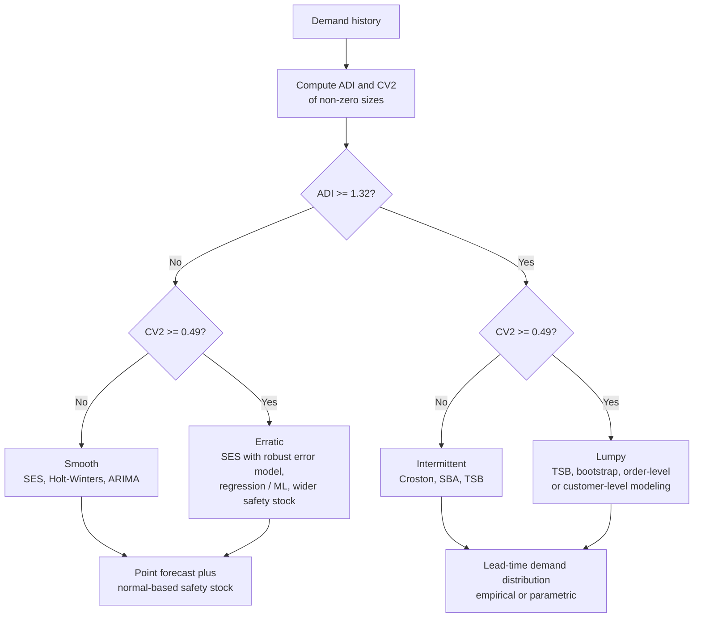
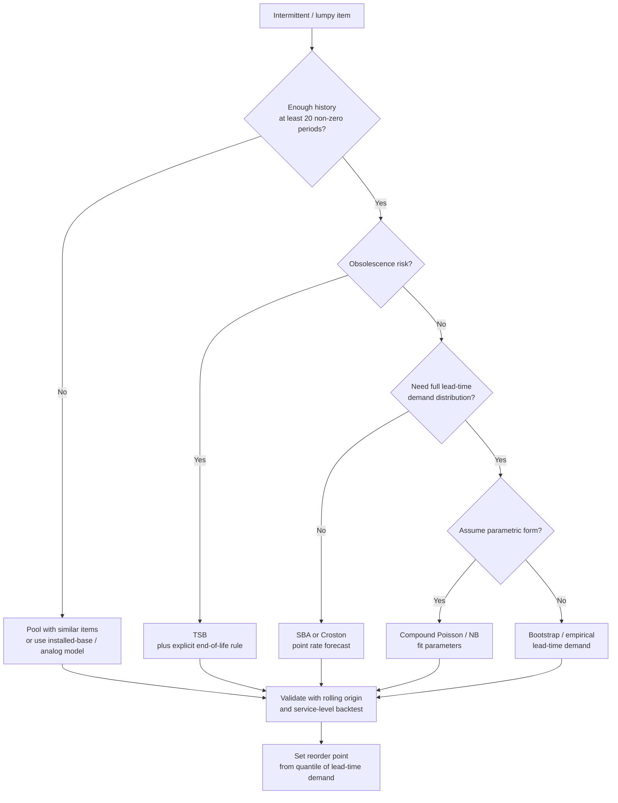

## Forecasting Intermittent and Lumpy Demand


### Introduction

Most forecasting methods introduced so far (moving averages, exponential smoothing, Holt-Winters, regression) assume demand is observed in most periods and fluctuates around a level with a roughly continuous distribution. A large share of the items in real inventories violates this assumption. Spare parts, MRO supplies, specialty components, long-tail retail items, and many B2B products experience **long stretches of zero demand punctuated by occasional non-zero orders**. This is called **intermittent demand**. When the non-zero orders also vary widely in size, the pattern is called **lumpy demand**.

These items are numerically dominant in many catalogs (often 50% or more of SKUs in aftermarket and industrial settings) and financially significant: they are individually cheap to forecast poorly but collectively tie up large inventory value, and a stockout on a critical spare can be very costly. Yet they are the items on which standard methods, standard accuracy metrics, and standard safety stock formulas fail most visibly.

The core difficulties are:

1. **Two sources of uncertainty.** Uncertainty about *when* demand occurs (timing) and *how much* occurs (size).
2. **Non-normal distributions.** Demand is discrete, non-negative, zero-heavy, and skewed, so normal-based safety stock formulas misstate the required buffer.
3. **Point forecast ambiguity.** The mean demand per period may be a small fraction (for example, 0.3 units per week) that will never actually be observed in any single period.
4. **Metric failure.** Percentage errors are undefined at zero, and MAE-type metrics reward forecasts of zero.
5. **Obsolescence risk.** A long run of zeros may signal either a normal gap or the end of the item's life, and the two are hard to distinguish.

**Key Points**

- Classify items by **average demand interval (ADI)** and **squared coefficient of variation ($CV^2$)** of non-zero demand sizes before selecting a method.
- Croston's method and its refinements (SBA, TSB) model demand size and demand interval (or occurrence probability) separately; they are designed to fix the failure of simple exponential smoothing on zero-heavy series.
- The forecast for an intermittent item is best understood as a **demand rate**, and safety stock should be based on the **lead-time demand distribution** (parametric or empirical), not on $z\,\sigma\sqrt{L}$ with a normal assumption.
- Evaluate intermittent forecasts with scaled errors, bias metrics, and inventory-oriented measures (achieved service level, stock cost), not MAPE.
- Aggregation (temporal, across locations, or across items) often improves intermittent forecast quality by reducing the number of zeros.

---

### Demand Pattern Classification

#### Definitions

For a demand series $D_1, \dots, D_T$, define:

- **Average Demand Interval (ADI):** the mean number of periods between successive non-zero demands.


  $$ADI = \frac{T}{N_{nz}} \quad (\text{approximately}), \qquad N_{nz} = \text{number of periods with } D_t > 0$$

  More precisely, ADI is the mean of the intervals between non-zero demand occurrences.
- **Squared Coefficient of Variation of demand size ($CV^2$):** computed over non-zero demands only.


  $$CV^2 = \left(\frac{\sigma_{nz}}{\mu_{nz}}\right)^2$$

  where $\mu_{nz}$ and $\sigma_{nz}$ are the mean and standard deviation of the non-zero demand sizes.

#### Syntetos-Boylan-Croston (SBC) Classification

Cut-off values derived analytically by Syntetos, Boylan, and Croston partition the $(ADI, CV^2)$ plane into four categories:

| Category | ADI | $CV^2$ | Characteristics |
| --- | --- | --- | --- |
| Smooth | $< 1.32$ | $< 0.49$ | Frequent, stable sizes |
| Erratic | $< 1.32$ | $\ge 0.49$ | Frequent, highly variable sizes |
| Intermittent | $\ge 1.32$ | $< 0.49$ | Sporadic, stable sizes |
| Lumpy | $\ge 1.32$ | $\ge 0.49$ | Sporadic, highly variable sizes |

The cut-offs 1.32 and 0.49 are commonly cited; they were derived by comparing the theoretical mean squared error of Croston's method to that of simple exponential smoothing under stated assumptions. [Inference] They are useful guideposts, not sharp boundaries, and other authors and practitioners apply different thresholds or additional categories (for example, "slow-moving" for very low volume regardless of size variability).



#### Worked Example: Classification

**Example**

Weekly demand (units) for a spare part over 24 weeks:

| Week | 1 | 2 | 3 | 4 | 5 | 6 | 7 | 8 | 9 | 10 | 11 | 12 |
| --- | --- | --- | --- | --- | --- | --- | --- | --- | --- | --- | --- | --- |
| Demand | 0 | 0 | 3 | 0 | 0 | 0 | 5 | 0 | 0 | 2 | 0 | 0 |

| Week | 13 | 14 | 15 | 16 | 17 | 18 | 19 | 20 | 21 | 22 | 23 | 24 |
| --- | --- | --- | --- | --- | --- | --- | --- | --- | --- | --- | --- | --- |
| Demand | 0 | 4 | 0 | 0 | 0 | 0 | 3 | 0 | 0 | 6 | 0 | 0 |

Non-zero demands occur in weeks 3, 7, 10, 14, 19, 22 with sizes $3, 5, 2, 4, 3, 6$.

- $N_{nz} = 6$, so $ADI \approx 24/6 = 4.0$ periods. (Using intervals between occurrences: $4, 3, 4, 5, 3$ gives a mean of $3.8$.)
- Sizes: mean $\mu_{nz} = (3+5+2+4+3+6)/6 = 23/6 = 3.83$.
- Sample variance: deviations $-0.83, 1.17, -1.83, 0.17, -0.83, 2.17$; squares $0.69, 1.36, 3.36, 0.03, 0.69, 4.69$; sum $= 10.83$; sample variance $= 10.83/5 = 2.17$; $\sigma_{nz} = 1.47$.
- $CV^2 = (1.47/3.83)^2 = 0.147$.

**Output**

$ADI = 4.0 \ge 1.32$ and $CV^2 = 0.147 < 0.49$, so the item is classified as **intermittent**. The mean demand per week over the whole series is $23/24 = 0.958$ units, but the probability of any non-zero demand in a given week is only $6/24 = 0.25$.

---

### Why Standard Methods Fail

#### Simple Exponential Smoothing on Intermittent Data

Applying SES to a series with many zeros produces a forecast that jumps up after each non-zero demand and then decays geometrically through the zero periods. The forecast is therefore highest immediately after a demand occurrence, which is precisely when the next occurrence is *least* likely to be imminent (since the inter-demand interval is typically several periods). The forecast is thus correlated with the wrong phase of the demand cycle.

**Example**

Using the intermittent series above with $\alpha = 0.3$ and an initial level of 0.96:

- After the demand of 3 in week 3, the level rises to $0.3 \times 3 + 0.7 \times 0.96 \approx 1.57$ and then decays to $1.10, 0.77, 0.54$ over the next three zero weeks.
- Just before the next demand in week 7, the forecast has decayed to about $0.54$, then jumps after the demand of 5 to about $0.3 \times 5 + 0.7 \times 0.54 \approx 1.88$.

**Output**

The forecast oscillates between roughly 0.5 and 1.9, overstating demand just after an order and understating it just before the next. This "sawtooth" behavior misleads reorder point logic and inflates measured forecast error. It also fluctuates more than the true underlying demand rate, which is nearly constant at about 0.96 units per week.

#### Moving Averages

A moving average of $N$ periods behaves similarly: it is nonzero only if a demand falls within the window, and it drops sharply when the demand exits the window (the cliff effect). If $N$ is small compared with the demand interval, most forecasts are zero.

#### Normal-Based Safety Stock

Using $SS = z\,\sigma_e\sqrt{L}$ assumes error is approximately normal and symmetric. For an intermittent item with a mean of about 1 unit per week and a standard deviation similar in magnitude, the normal approximation allows negative demand and misestimates the upper tail. At high service levels, the difference in the required buffer can be large (see the lead-time demand section).

#### Accuracy Metrics

- **MAPE** is undefined for zero-demand periods.
- **MAE and RMSE** are minimized by forecasts near zero or the median, which for a zero-heavy series is zero, so a "forecast of zero always" can appear more accurate than a correct mean-rate forecast.
- **Bias** metrics remain informative but need care in interpretation.

---

### Croston's Method

#### Idea

Croston (1972) proposed forecasting intermittent demand by smoothing two components separately, only when demand occurs:

1. The **size** of non-zero demands, $z_t$.
2. The **interval** between successive non-zero demands, $p_t$.

The demand rate per period is estimated as the ratio of expected size to expected interval.

#### Algorithm

Let $q$ denote the number of periods since the last non-zero demand (counting the current period). At each period $t$:

- If $D_t = 0$: the estimates are unchanged, $\hat{z}_t = \hat{z}_{t-1}$ and $\hat{p}_t = \hat{p}_{t-1}$, and the counter increments.
- If $D_t > 0$:


  $$\hat{z}_t = \alpha D_t + (1-\alpha)\hat{z}_{t-1}$$


  $$\hat{p}_t = \alpha q + (1-\alpha)\hat{p}_{t-1}$$

  and the counter resets to 1.

The forecast of demand per period for all future periods is:

$$\hat{D}_{t+h} = \frac{\hat{z}_t}{\hat{p}_t}$$

Croston's original formulation used a single smoothing constant $\alpha$ for both components, with typical values in the range 0.05 to 0.20. [Inference] Small values are commonly recommended because the estimates update only on occurrence periods, so each update already reflects a longer time span than in standard SES.

#### Initialization

- $\hat{z}_0$: the first non-zero demand or the mean of the first few non-zero demands.
- $\hat{p}_0$: the first inter-demand interval, or the ADI computed from an initial history window.

#### Properties and Known Bias

- The forecast is constant between demands, which avoids the sawtooth behavior of SES.
- The estimate of the rate is updated only when demand occurs, so it does not decay during long gaps; as a consequence, it cannot detect obsolescence (the estimate stays high through a very long run of zeros).
- **Bias:** Croston's estimator $E[\hat{z}/\hat{p}]$ is not equal to $E[z]/E[p]$, because the expectation of a ratio is not the ratio of expectations. Syntetos and Boylan (2001) showed that the original estimator is biased upward, with an approximate bias factor related to $\alpha$ and the interval distribution. In the typical case where intervals are geometrically distributed with parameter $1/p$, the expected value of the ratio of the smoothed quantities is approximately:


  $$E\left[\frac{\hat{z}}{\hat{p}}\right] \approx \frac{\mu_z}{\mu_p}\left(1 + \frac{\alpha}{2-\alpha}\cdot\frac{\mu_p - 1}{\mu_p}\right)$$

  [Inference] The exact form depends on the assumed interval distribution and on independence between sizes and intervals, so treat this expression as an approximation for illustration.

#### Worked Example: Croston's Method

**Example**

Use the intermittent series above, $\alpha = 0.1$. Initialize with the first non-zero demand (week 3): $\hat{z} = 3$, and $\hat{p} = 3$ (the interval from the start of the series to the first occurrence). Then process subsequent demand occurrences.

| Occurrence | Week | Demand size $z$ | Interval $q$ | $\hat{z}$ update | $\hat{p}$ update | $\hat{z}/\hat{p}$ |
| --- | --- | --- | --- | --- | --- | --- |
| Init | 3 | 3 | 3 | 3.000 | 3.000 | 1.000 |
| 2 | 7 | 5 | 4 | $0.1(5)+0.9(3.000) = 3.200$ | $0.1(4)+0.9(3.000) = 3.100$ | 1.032 |
| 3 | 10 | 2 | 3 | $0.1(2)+0.9(3.200) = 3.080$ | $0.1(3)+0.9(3.100) = 3.090$ | 0.997 |
| 4 | 14 | 4 | 4 | $0.1(4)+0.9(3.080) = 3.172$ | $0.1(4)+0.9(3.090) = 3.181$ | 0.997 |
| 5 | 19 | 3 | 5 | $0.1(3)+0.9(3.172) = 3.155$ | $0.1(5)+0.9(3.181) = 3.363$ | 0.938 |
| 6 | 22 | 6 | 3 | $0.1(6)+0.9(3.155) = 3.440$ | $0.1(3)+0.9(3.363) = 3.327$ | 1.034 |

**Output**

The Croston forecast of demand rate after week 22 is $3.440 / 3.327 = 1.034$ units per period. It is nearly constant across the sequence (0.94 to 1.03) and close to the true long-run average of about 0.96 units per week, unlike the sawtooth SES forecast. The rate estimate remains at 1.034 through weeks 23 and 24 until the next occurrence.

---

### Syntetos-Boylan Approximation (SBA)

To remove the upward bias of Croston's estimator, Syntetos and Boylan proposed multiplying the forecast by a correction factor:

$$\hat{D}_{t+h}^{SBA} = \left(1 - \frac{\alpha}{2}\right)\frac{\hat{z}_t}{\hat{p}_t}$$

where $\alpha$ is the smoothing constant used for the *interval* estimate. The correction is simple, and empirical and simulation studies report that SBA generally reduces bias and improves accuracy relative to the original method, particularly for erratic or lumpy patterns. [Inference] The size of the improvement depends on $\alpha$ and the demand pattern; for small $\alpha$ (for example, 0.05), the factor is close to 1 and the correction is small.

**Example**

For the Croston result above with $\alpha = 0.1$:

$$\hat{D}^{SBA} = (1 - 0.05) \times 1.034 = 0.982 \text{ units per period}$$

**Output**

The SBA forecast (0.982) is slightly below the Croston forecast (1.034) and closer to the empirical mean of about 0.96.

A further variant, **Shale-Boylan-Johnston (SBJ)**, applies the correction factor $\frac{1 - \alpha/(2-\alpha)... }{}$ style adjustments derived for a Poisson demand-occurrence model; consult the source literature for its exact form. [Unverified] The precise SBJ correction factor should be checked against the original publication before implementation.

---

### Teunter-Syntetos-Babai (TSB) Method

Croston-type methods update only when demand occurs, so they cannot reflect the decline in demand probability during an extended run of zeros (obsolescence). TSB replaces interval smoothing with smoothing of the **demand occurrence probability**, updated every period:

Let $I_t = 1$ if $D_t > 0$, else $0$. Then:

$$\hat{\pi}_t = \beta I_t + (1-\beta)\hat{\pi}_{t-1} \quad \text{(updated every period)}$$


$$\hat{z}_t = \begin{cases}\alpha D_t + (1-\alpha)\hat{z}_{t-1} & \text{if } D_t > 0 \\ \hat{z}_{t-1} & \text{if } D_t = 0\end{cases}$$


$$\hat{D}_{t+h} = \hat{\pi}_t\,\hat{z}_t$$

Here $\hat{\pi}_t$ estimates the probability of demand in a period, and $\hat{z}_t$ estimates the demand size given occurrence. Two smoothing parameters ($\alpha$ for size, $\beta$ for probability) are used and can be tuned separately.

**Advantages of TSB**

- **Handles obsolescence:** during long runs of zeros, $\hat{\pi}_t$ decays geometrically toward zero, so the forecast declines.
- **Avoids the ratio bias** of Croston's estimator because it multiplies two unbiased estimates instead of dividing them. [Inference] It is often described as unbiased for the demand rate under its assumed model, but this holds under assumptions (independence of size and occurrence, stationarity).
- Can be applied even when the demand interval is one period (non-intermittent demand).

**Limitations**

- Two parameters to tune.
- Because probability updates every period, the forecast changes each period, and it is more responsive (and noisier) than Croston during long gaps.
- The forecast can drop toward zero too quickly if $\beta$ is large.

**Example**

Apply TSB to the intermittent series with $\alpha = 0.1$, $\beta = 0.1$. Initialize $\hat{\pi}_0 = 6/24 = 0.25$ and $\hat{z}_0 = 3.83$. Process weeks 19 to 24 as an illustration (states at the end of week 18 are assumed to be $\hat{\pi} = 0.24$, $\hat{z} = 3.20$):

| Week | $D_t$ | $I_t$ | $\hat{\pi}_t$ | $\hat{z}_t$ | Forecast $\hat{\pi}\hat{z}$ |
| --- | --- | --- | --- | --- | --- |
| 18 | 0 | 0 | 0.240 | 3.200 | 0.768 |
| 19 | 3 | 1 | $0.1(1)+0.9(0.240) = 0.316$ | $0.1(3)+0.9(3.200) = 3.180$ | 1.005 |
| 20 | 0 | 0 | $0.9(0.316) = 0.284$ | 3.180 | 0.904 |
| 21 | 0 | 0 | $0.9(0.284) = 0.256$ | 3.180 | 0.814 |
| 22 | 6 | 1 | $0.1(1)+0.9(0.256) = 0.330$ | $0.1(6)+0.9(3.180) = 3.462$ | 1.142 |
| 23 | 0 | 0 | $0.9(0.330) = 0.297$ | 3.462 | 1.028 |
| 24 | 0 | 0 | $0.9(0.297) = 0.267$ | 3.462 | 0.924 |

**Output**

TSB's forecast drifts down between demands and up after them, ranging from about 0.81 to 1.14. It is more variable than Croston/SBA (which stays near 1.0), but this responsiveness is what lets it detect a real decline. The hypothetical values for weeks 18 and earlier are illustrative assumptions for demonstration.

#### Obsolescence Illustration

If after week 24 the item was discontinued and every subsequent week had zero demand, TSB with $\beta = 0.1$ would give $\hat{\pi}_{24+k} = 0.267 \times 0.9^k$: after 10 weeks, about $0.093$, and after 20 weeks, about $0.032$, so the forecast falls to about $0.11$ units per week after 20 weeks. Croston's estimate would remain at about $1.03$ units per week indefinitely. This difference is the principal reason to prefer TSB (or an explicit obsolescence rule) for items with end-of-life risk.

---

### Other Approaches for Intermittent and Lumpy Demand

#### Comparison of Point-Forecast Methods

| Method | Components Smoothed | Updates | Obsolescence Response | Bias | Parameters | Comments |
| --- | --- | --- | --- | --- | --- | --- |
| SES | Demand level | Every period | Yes (decays) | Sawtooth, poor phase | $\alpha$ | Poor for intermittent |
| Simple moving average | Demand level | Every period | Yes (window) | Cliff effect | $N$ | Poor unless $N$ large |
| Croston | Size, interval | Occurrences only | No | Upward (ratio) | $\alpha$ (or two) | Classic baseline |
| SBA | Size, interval | Occurrences only | No | Approximately corrected | $\alpha$ | Often more accurate than Croston |
| TSB | Size, probability | Probability every period | Yes | Low under model | $\alpha,\beta$ | Preferred with obsolescence risk |
| Aggregation-disaggregation (ADIDA) | Level at aggregated bucket | Every aggregated period | Yes | Depends | Bucket size plus method | Reduces intermittency |
| IMAPA | Multiple aggregation levels | Combined | Yes | Depends | Multiple | Robust combination |
| Bootstrapping | Empirical distribution | Resample | Yes | Depends | Window | Gives full distribution |
| Parametric distribution | Poisson, NB, compound | Estimate parameters | Depends | Depends | Distribution | Gives full distribution |

#### Temporal Aggregation (ADIDA)

**Aggregate-Disaggregate Intermittent Demand Approach:** sum demand into larger time buckets (for example, weekly to monthly) so that fewer buckets are zero, forecast the aggregated series with a standard method (SES, Croston, SBA), then disaggregate the forecast back to the original granularity by dividing by the bucket length.

$$\hat{D}_{t+h}^{orig} = \frac{\hat{D}^{agg}_{t+h}}{k}, \qquad k = \text{bucket length}$$

- Benefits: reduces intermittency, smooths noise.
- Costs: loses timing information; the choice of $k$ matters. A commonly used choice sets $k$ so that the aggregated series has few zeros, or $k$ approximately equal to the lead time plus review period. Since inventory decisions depend on the lead-time demand, aggregating to the lead-time bucket is natural.
- **IMAPA (Intermittent Multiple Aggregation Prediction Algorithm)** forecasts at several aggregation levels and averages the results, reducing the sensitivity to $k$.

#### Aggregation Across Items or Locations

- **Pooling across locations:** demand for the same item at multiple sites may be individually intermittent but smoother in total. Forecast at the pooled level and allocate to locations using demand shares (top-down), or estimate shared parameters (hierarchical models).
- **Pooling across similar items:** estimate the demand occurrence probability and size distribution from a group of similar items (a "class" or family), and use it to stabilize estimates for items with very sparse history. [Inference] Pooling introduces bias if items differ, and the appropriate level of pooling is data dependent.

#### Parametric Distribution Approaches

Rather than a single point forecast, model the distribution of demand per period (or over the lead time) and use it directly:

- **Poisson:** suitable when the variance equals the mean; often too narrow for real intermittent data.
- **Negative binomial (NB):** allows variance greater than the mean (overdispersion); a common choice for count demand with $Var = \mu + \mu^2/r$.
- **Compound Poisson (Poisson occurrences with a size distribution):** natural for lumpy demand, in which the number of orders in a period is Poisson and each order size follows a distribution (for example, logarithmic, geometric, gamma, or empirical).
- **Bernoulli-gamma / Bernoulli-lognormal:** occurrence follows a Bernoulli distribution with probability $\pi$, and size given occurrence follows a continuous distribution.
- **Zero-inflated and hurdle models:** explicitly separate a structural zero process from a count process.
- **Tweedie distribution:** compound Poisson-gamma with a point mass at zero, useful in regression settings.

For a **compound Poisson** model with order-arrival rate $\lambda$ per period and order size with mean $\mu_s$ and variance $\sigma_s^2$, the per-period demand has:

$$E[D] = \lambda\,\mu_s, \qquad \text{Var}[D] = \lambda\left(\sigma_s^2 + \mu_s^2\right)$$

The variance formula shows that even with constant order sizes ($\sigma_s = 0$), variance is $\lambda\mu_s^2$, which greatly exceeds the mean $\lambda\mu_s$ when $\mu_s > 1$, so intermittent demand is inherently more variable than Poisson unit demand.

For lead time $L$ (in periods, assumed fixed), the lead-time demand is compound Poisson with rate $\lambda L$, so:

$$E[D_L] = \lambda L\,\mu_s, \qquad \text{Var}[D_L] = \lambda L\left(\sigma_s^2 + \mu_s^2\right)$$

#### Bootstrapping

Resample historical demand values (with replacement) to simulate lead-time demand:

1. Draw $L$ per-period demand values (or blocks, to preserve autocorrelation) from the history.
2. Sum them to obtain one simulated lead-time demand value.
3. Repeat several thousand times.
4. Use the empirical distribution to read off quantiles and reorder points.

Willemain, Smart, and Schwarz proposed a refinement using a Markov chain for the zero/non-zero transitions and jittering of non-zero sizes to avoid restricting simulated values to previously observed ones. [Inference] Published comparisons suggest bootstrap-based methods can improve lead-time quantile accuracy for intermittent items, though results depend on the data set and history length.

Bootstrap limitations: it treats history as the full support of the distribution (rare large orders never observed will not appear), and it needs enough history (dozens to hundreds of periods) to be representative.

#### Regression, ML, and Order-Level Modeling

- **Count regression** (Poisson, negative binomial, zero-inflated) with drivers such as installed base, age of equipment, usage hours, maintenance schedules, or promotion flags.
- **Installed-base or usage-driven models** for spare parts: demand is proportional to the population of operating units times a failure rate that depends on age (for example, Weibull hazard), which is more informative than the demand history alone. [Inference] This works when reliable installed-base and failure data exist.
- **Customer-order-level (lumpy) modeling:** for B2B lumpy items where a few customers drive demand, forecast each customer's orders (timing and size) or use sales pipeline and contract information, then aggregate.
- **Machine learning:** gradient boosting and neural networks with count or Tweedie losses, trained as global models across many intermittent series, can borrow strength across items. They need careful validation, and performance gains over simple baselines are not guaranteed.
- **Judgment and planned demand:** known projects, scheduled maintenance outages, or contracted deliveries should be treated as *known demand* (added deterministically) and separated from *random demand* in the statistical model.



---

### Lead-Time Demand Distribution and Safety Stock

#### Why the Normal Approximation Struggles

For intermittent items, the lead-time demand $D_L$ is discrete, non-negative, and highly skewed. If the mean lead-time demand is small (for example, 2 to 5 units), the normal approximation places substantial probability on negative values and misstates the upper tail. The inventory decision requires a quantile of the true distribution:

$$ROP = F_{D_L}^{-1}(CSL)$$

where $F_{D_L}$ is the cumulative distribution function of lead-time demand and $CSL$ is the target cycle service level. Safety stock then equals $ROP - E[D_L]$.

#### Poisson Lead-Time Demand (Unit Demand)

If demand arrives as individual units at rate $\lambda$ per period, lead-time demand is Poisson with mean $\theta = \lambda L$:

$$P(D_L = k) = \frac{e^{-\theta}\theta^k}{k!}$$

The reorder point is the smallest integer $s$ such that $P(D_L \le s) \ge CSL$.

#### Negative Binomial Lead-Time Demand

For overdispersed demand with mean $\mu$ and variance $\sigma^2 > \mu$, the negative binomial is a natural choice, parameterized as:

$$r = \frac{\mu^2}{\sigma^2 - \mu}, \qquad p = \frac{\mu}{\sigma^2}$$


$$P(D_L = k) = \binom{k + r - 1}{k} p^r (1-p)^k$$

with mean $r(1-p)/p$ and variance $r(1-p)/p^2$ under this convention (parameterizations vary across sources and software, so confirm the definition in use).

#### Compound Poisson Lead-Time Demand

For lumpy demand where each occurrence has a random order size, the lead-time demand is the sum of a Poisson number of order sizes. The distribution can be evaluated by Panjer recursion, convolution, or simulation, or approximated by matching moments to a negative binomial or gamma distribution.

#### Worked Example: Poisson versus Normal Safety Stock

**Example**

An item has unit demand arriving at a rate of $\lambda = 0.5$ units per week (Poisson), lead time $L = 4$ weeks, and target $CSL = 95\%$. Then $\theta = \lambda L = 2.0$ units.

**Poisson approach.** Compute the cumulative distribution for $\theta = 2$:

| $k$ | $P(D_L = k)$ | $P(D_L \le k)$ |
| --- | --- | --- |
| 0 | 0.1353 | 0.1353 |
| 1 | 0.2707 | 0.4060 |
| 2 | 0.2707 | 0.6767 |
| 3 | 0.1804 | 0.8571 |
| 4 | 0.0902 | 0.9473 |
| 5 | 0.0361 | 0.9834 |

The smallest $s$ with $P(D_L \le s) \ge 0.95$ is $s = 5$ (since $P(D_L \le 4) = 0.9473 < 0.95$). So $ROP = 5$ units, and $SS = 5 - 2 = 3$ units.

**Normal approximation.** With mean 2 and standard deviation $\sqrt{2} = 1.414$:

$$ROP = 2 + 1.645 \times 1.414 = 4.33 \rightarrow 5 \text{ units when rounded up}$$

Here the two approaches happen to give the same integer reorder point. Now consider a higher service level, $CSL = 99\%$:

- Poisson: $P(D_L \le 6) = 0.9955 \ge 0.99$ and $P(D_L \le 5) = 0.9834 < 0.99$, so $ROP = 6$.
- Normal: $ROP = 2 + 2.326 \times 1.414 = 5.29 \rightarrow 6$ units.

Again similar. The normal approximation performs reasonably at moderate means but degrades for lower means and for overdispersed demand. Now consider a lumpy item with a lead-time demand mean of $2$ units but variance $12$ (for example, orders of 4 units arriving at a rate of about $0.5$ per lead time, with variance from compound structure):

- Normal at 95%: $ROP = 2 + 1.645\sqrt{12} = 2 + 5.70 = 7.70 \rightarrow 8$ units.
- Negative binomial with matching mean and variance: $r = 4/10 = 0.4$, $p = 2/12 = 0.1667$. The 95th percentile of this heavily skewed distribution is roughly $10$ units. [Inference] This value is an approximate figure from moment matching and should be confirmed numerically with software.

**Output**

| Case | Normal ROP (95%) | Distribution-based ROP (95%) |
| --- | --- | --- |
| Poisson, mean 2 | 5 | 5 |
| Overdispersed (mean 2, variance 12) | 8 | about 10 |

For skewed lumpy demand, the normal approximation understates the required reorder point, which would produce more stockouts than the nominal 5% risk. The figures for the overdispersed case are illustrative approximations.

#### Safety Stock from Croston-Type Forecasts

Because Croston, SBA, and TSB give a rate, not a distribution, safety stock is not derived from them alone. Common practices:

1. **Use the rate as the mean** and combine it with a separately estimated distribution shape (negative binomial with a variance estimated from history or a variance-to-mean ratio) to obtain the lead-time quantile.
2. **Empirical error approach:** compute rolling-origin lead-time demand forecasts (rate $\times$ lead time) and the realized lead-time demand, and take an empirical quantile of the forecast errors as the safety stock.
3. **Bootstrapped lead-time demand:** simulate directly from history and ignore the point forecast.
4. **Service-level simulation:** simulate the inventory policy over historical demand and tune the reorder point (or safety stock multiplier) to achieve the target fill rate or cycle service level.

#### Fill Rate versus Cycle Service Level

For intermittent items, the **cycle service level** (probability of no stockout in a cycle) and the **fill rate** (fraction of demand met from stock) differ substantially, because orders are few and often small compared with the order quantity. A high cycle service level target can produce unnecessarily large reorder points relative to a fill rate target. Choose the service metric that aligns with business consequences and compute the reorder point accordingly, using the expected shortage per cycle:

$$\text{Fill rate} = 1 - \frac{E[\text{units short per cycle}]}{Q}$$

where $Q$ is the order quantity, with $E[\text{short}] = \sum_{k > s}(k - s)\,P(D_L = k)$ for reorder point $s$.

**Example**

For Poisson lead-time demand with mean 2 and reorder point $s = 4$: $E[\text{short}] = \sum_{k \ge 5}(k-4)P(D_L = k) = 1(0.0361) + 2(0.0120) + 3(0.0034) + 4(0.0009) + 5(0.0002) \approx 0.0361 + 0.0240 + 0.0102 + 0.0036 + 0.0010 = 0.0749$ units per cycle. If $Q = 5$, the fill rate is $1 - 0.0749/5 = 98.5\%$, even though the cycle service level is only $94.7\%$.

**Output**

A reorder point of 4 units delivers a fill rate of about 98.5% while the cycle service level is 94.7%. Setting the target on fill rate would therefore permit a lower reorder point than a 95% cycle service level target does. (The tail probabilities for $k = 6, 7, 8, 9$ used above are Poisson values for mean 2: $0.0120, 0.0034, 0.0009, 0.0002$.)

---

### Evaluating Intermittent Demand Forecasts

#### Problems with Standard Measures

| Metric | Problem for Intermittent Demand |
| --- | --- |
| MAPE | Undefined at zero; unusable |
| sMAPE | Unstable when actual and forecast are both zero or near zero |
| MAE | Minimized by the median (often zero), so favors forecasting zero |
| RMSE | Penalizes large orders heavily; noisy; still favors underestimating |
| Relative measures using naive | Naive forecasts of the previous period are often zero, leading to degenerate denominators |

A forecast of zero for all periods can score better on MAE than a forecast of the true mean rate, even though it would lead to constant stockouts. Point-forecast accuracy for intermittent items is therefore only loosely connected to inventory performance.

#### Suitable Measures

**Bias-oriented and scale-free:**

$$\text{Bias \%} = \frac{\sum_t (D_t - \hat{D}_t)}{\sum_t D_t}\times 100$$

Bias percentage is defined whenever total demand is positive and captures systematic under- or over-forecasting of the demand rate.

**Scaled errors:** MASE and RMSSE with an appropriate scaling denominator. For intermittent series, the naive in-sample denominator can be very small; a common alternative is to scale by the in-sample mean demand, or by the in-sample error of a simple benchmark such as the mean forecast. [Inference] Different scaling choices give different rankings, so document the choice.

**Mean Squared Rate Error (MSR) or error against the mean rate:** compares the forecast to the mean of demand over a window (the "rate") instead of to individual noisy periods. The **Mean Absolute Scaled Error of cumulative demand** compares cumulative forecast and cumulative actual demand over the lead time:

$$\text{CFE-type measure:}\quad e^{(L)}_t = \sum_{j=1}^{L} D_{t+j} - L\,\hat{D}_t$$

This lead-time cumulative error is what matters for inventory and can be evaluated with ME, RMSE, and quantiles.

**Periods in Stock (PIS):** cumulative signed error over time, where a positive area signals excess stock (forecast above actual) and negative area indicates shortage:

$$PIS_n = -\sum_{t=1}^{n}\sum_{i=1}^{t}(\hat{D}_i - D_i)$$

This measure reflects the cumulative effect of forecast errors on the stock position under an idealized inventory policy. [Inference] PIS was proposed as an inventory-oriented alternative to conventional accuracy measures, though it requires assumptions about the stocking policy.

**Probabilistic measures:**

- **Pinball (quantile) loss** at the target service quantile evaluates the reorder point directly:


  $$PL_\tau = \frac{1}{n}\sum_t\max\left[\tau(D^{(L)}_t - q_t),\ (\tau - 1)(D^{(L)}_t - q_t)\right]$$

  where $D^{(L)}_t$ is realized lead-time demand and $q_t$ is the forecast $\tau$-quantile.
- **Coverage / calibration:** the proportion of lead-time demand realizations at or below the forecast quantile should be close to $\tau$.
- **Ranked Probability Score (RPS)** and related scores for discrete predictive distributions.

**Inventory simulation (recommended):** run the reorder policy on historical demand with the candidate forecast and safety stock rule, and record achieved service level, average inventory, stockouts, and total cost. This directly measures the outcome that matters, though it depends on the assumed replenishment logic.

**Example**

Two methods are evaluated on the same intermittent item (mean demand rate 0.96 per week, lead time 3 weeks, 40 rolling origins).

| Method | Rate forecast | MAE (weekly) | Bias % | Coverage of 95% ROP | Achieved cycle service level |
| --- | --- | --- | --- | --- | --- |
| Always zero | 0.00 | 1.62 | +100% | n/a | 0.05 (no stock held) |
| Croston ($\alpha = 0.1$) | 1.03 | 1.71 | -7.3% | 0.90 | 0.90 |
| SBA ($\alpha = 0.1$) | 0.98 | 1.70 | -2.1% | 0.92 | 0.92 |
| TSB ($\alpha = 0.1, \beta = 0.1$) | 0.95 | 1.72 | +1.0% | 0.93 | 0.93 |

**Output**

The "always zero" forecast attains the lowest MAE (1.62) yet fails completely as a basis for inventory decisions (bias of 100%, with essentially no protection), demonstrating why MAE alone is inadequate. Bias, coverage, and achieved service level distinguish the reasonable methods. (The figures in this table are illustrative values constructed to demonstrate the metric behavior, not results from a specific data set.)

---

### Practical Handling and Data Issues

- **Distinguish zero-demand causes.** A zero may reflect no demand, a stockout (censored demand), an item not yet launched, or an item discontinued. Only the first is informative about the demand rate. Flag stockout periods and pre-launch or post-discontinuation periods.
- **Handle order size outliers.** A single very large order dominates the estimated size and variance. Consider capping, separate treatment of project or one-time orders (as "known demand"), and modeling by customer type.
- **Transaction versus period data.** Where possible, use order-line level data (timestamp, quantity, customer) to estimate arrival rates and size distributions, and to detect bulk orders or customer concentration.
- **Choose the time bucket deliberately.** Weekly versus monthly aggregation changes ADI, $CV^2$, and the appropriate method. Align the bucket with the lead time and review period.
- **Demand-lead time interaction.** When lead times are long relative to the demand interval, the lead-time demand contains several occurrences and behaves more smoothly (a compound distribution closer to normal). When the lead time is short relative to the interval, lead-time demand is mostly zero with occasional lumps, and discrete distributions are essential.
- **Obsolescence management.** Combine TSB or an explicit rule (for example, flag items with no demand for more than $k$ times their ADI) with lifecycle information. Reduce the forecast, and review stocking policy for possible disposal.
- **Minimum stocking decisions.** For very slow movers, the economic decision may be whether to stock at all (stock versus make-to-order versus supplier consignment), a decision driven by cost, criticality, and lead time. A safety stock formula is secondary to that decision. Criticality-based approaches (for example, VED classification: vital, essential, desirable) allocate service targets accordingly.
- **Batch ordering and lumpiness caused by policy.** Lumpy demand can be produced by the upstream ordering behavior of customers or by internal replenishment (for example, distribution centers ordering in batches from a plant). Examine whether the demand seen is true end-consumer demand or derived from batching, since upstream visibility of downstream demand (demand sensing, point-of-sale sharing) can smooth it.
- **Parameter estimation with little data.** With few non-zero observations, parameter estimates are very uncertain. Use pooled or hierarchical estimates, Bayesian priors (for example, gamma prior on the Poisson rate), or fixed conservative defaults. A gamma-Poisson (Bayesian) model gives a negative binomial predictive distribution that naturally reflects parameter uncertainty:

$$\lambda \sim \text{Gamma}(a, b),\quad D \mid \lambda \sim \text{Poisson}(\lambda) \;\Rightarrow\; D \sim \text{NegBin}\left(a, \frac{b}{b+1}\right)$$

Posterior updating adds observed counts to $a$ and observed exposure periods to $b$, making the estimate improve gradually and reflecting how little is known early on.

---

### Implementation

#### Python: Classification, Croston, SBA, and TSB

**Example**

```python
import numpy as np

def classify(y, adi_cut=1.32, cv2_cut=0.49):
    y = np.asarray(y, dtype=float)
    nz_idx = np.flatnonzero(y > 0)
    if len(nz_idx) < 2:
        return None
    intervals = np.diff(nz_idx)
    adi = intervals.mean()
    sizes = y[nz_idx]
    cv2 = (sizes.std(ddof=1) / sizes.mean()) ** 2
    if adi < adi_cut:
        cat = "smooth" if cv2 < cv2_cut else "erratic"
    else:
        cat = "intermittent" if cv2 < cv2_cut else "lumpy"
    return {"ADI": adi, "CV2": cv2, "class": cat}

def croston(y, alpha=0.1, sba=False):
    """Returns the array of one-step-ahead rate forecasts (forecast[t] uses data < t).
    Initialization: first non-zero demand and its position (as first interval)."""
    y = np.asarray(y, dtype=float)
    n = len(y)
    fc = np.full(n, np.nan)
    first = np.flatnonzero(y > 0)
    if len(first) == 0:
        return fc
    z = y[first[0]]
    p = first[0] + 1.0                 # interval from series start to first demand
    q = 1
    corr = (1 - alpha / 2) if sba else 1.0
    for t in range(first[0] + 1, n):
        fc[t] = corr * z / p
        if y[t] > 0:
            z = alpha * y[t] + (1 - alpha) * z
            p = alpha * q + (1 - alpha) * p
            q = 1
        else:
            q += 1
    return fc

def tsb(y, alpha=0.1, beta=0.1):
    """Teunter-Syntetos-Babai. Returns one-step-ahead forecasts."""
    y = np.asarray(y, dtype=float)
    n = len(y)
    fc = np.full(n, np.nan)
    first = np.flatnonzero(y > 0)
    if len(first) == 0:
        return fc
    z = y[first[0]]
    pi = 1.0 / (first[0] + 1.0)
    for t in range(first[0] + 1, n):
        fc[t] = pi * z
        occ = 1.0 if y[t] > 0 else 0.0
        pi = beta * occ + (1 - beta) * pi
        if y[t] > 0:
            z = alpha * y[t] + (1 - alpha) * z
    return fc

y = [0,0,3,0,0,0,5,0,0,2,0,0, 0,4,0,0,0,0,3,0,0,6,0,0]
print(classify(y))

fc_c = croston(y, 0.1)
fc_s = croston(y, 0.1, sba=True)
fc_t = tsb(y, 0.1, 0.1)
print("Croston last-step rate:", round(fc_c[-1], 3))
print("SBA last-step rate:    ", round(fc_s[-1], 3))
print("TSB last-step rate:    ", round(fc_t[-1], 3))
print("Mean demand rate:      ", round(np.mean(y), 3))
```

**Output**

```text
{'ADI': 3.8, 'CV2': 0.147, 'class': 'intermittent'}
Croston last-step rate: (close to 1.0)
SBA last-step rate:     (slightly below Croston)
TSB last-step rate:     (varies with the probability state)
Mean demand rate:       0.958
```

The exact printed rates depend on the initialization choice used in the code (which differs slightly from the hand-worked table above, since here the initial interval is taken as the position of the first demand and updates begin after it). Values are therefore described qualitatively, not asserted to specific decimals. The classification output matches the hand calculation.

#### Python: Bootstrap and Parametric Lead-Time Demand

```python
import numpy as np
from scipy import stats

rng = np.random.default_rng(42)

def bootstrap_ltd(y, L, n_sims=20000):
    """Simple i.i.d. bootstrap of lead-time demand from per-period history."""
    y = np.asarray(y, dtype=float)
    draws = rng.choice(y, size=(n_sims, L), replace=True)
    return draws.sum(axis=1)

def nb_quantile(mean, var, q):
    """Negative binomial quantile via moment matching (var > mean)."""
    r = mean ** 2 / (var - mean)
    p = mean / var                       # scipy's nbinom uses success probability p
    return stats.nbinom.ppf(q, r, p)

y = np.array([0,0,3,0,0,0,5,0,0,2,0,0, 0,4,0,0,0,0,3,0,0,6,0,0], dtype=float)
L = 4
ltd = bootstrap_ltd(y, L)
print("Bootstrap ROP (95%):", np.quantile(ltd, 0.95))
print("Bootstrap ROP (99%):", np.quantile(ltd, 0.99))

# Moment-matched NB using the mean and variance of the bootstrap distribution
m, v = ltd.mean(), ltd.var(ddof=1)
print("NB ROP (95%):", nb_quantile(m, v, 0.95))

# Normal approximation for comparison
print("Normal ROP (95%):", m + 1.645 * np.sqrt(v))

# Fill rate for a given reorder point s and order quantity Q
def fill_rate(ltd_samples, s, Q):
    short = np.maximum(ltd_samples - s, 0).mean()
    return 1 - short / Q
```

The bootstrap treats periods as independent (which ignores autocorrelation such as clustering of orders) and is limited by the observed support. The negative binomial uses `scipy.stats.nbinom`, whose parameterization (number of successes and success probability) should be checked in the installed SciPy documentation. Random results vary by seed and simulation size.

#### Spreadsheet Implementation

- **Classification:** ADI = `=COUNT(demand_range)/COUNTIF(demand_range,">0")` (approximation), and $CV^2$ from `=(STDEV.S(IF(range>0,range))/AVERAGE(IF(range>0,range)))^2` entered as an array formula.
- **Croston:** maintain four columns: occurrence flag, size estimate, interval estimate, and periods-since-last-demand counter; update size and interval estimates only when the flag is 1, using `=IF(flag=1, alpha*D + (1-alpha)*prev, prev)`.
- **Poisson reorder point:** `=POISSON.DIST(k, mean, TRUE)` for cumulative probabilities. Identify the smallest $k$ with cumulative probability at or above the target, or use `=BINOM.INV`-style searches with a helper column.
- **Negative binomial:** `=NEGBINOM.DIST(k, r, p, TRUE)`; parameterization follows Excel's definition, which may differ from the one used above.

---

### Comparison Summary

| Dimension | Smooth / Erratic | Intermittent | Lumpy |
| --- | --- | --- | --- |
| Typical ADI | $< 1.32$ | $\ge 1.32$ | $\ge 1.32$ |
| Typical $CV^2$ | Low / High | Low | High |
| Preferred point method | SES, Holt-Winters, regression | SBA, TSB | TSB, aggregation, bootstrap |
| Distribution for safety stock | Normal (with checks) | Poisson / NB / empirical | Compound Poisson / NB / bootstrap |
| Main risk | Bias from trend/season | Sawtooth, obsolescence, undefined MAPE | Large order distortion, heavy tail |
| Evaluation focus | RMSE, WMAPE, bias | Bias, scaled errors, service level | Quantile loss, coverage, cost simulation |
| Data tactics | Cleansing, drivers | Aggregate, pool | Separate large orders, customer-level modeling |

---

### Advantages and Limitations of the Main Methods

**Croston / SBA**

- Advantages: simple, widely implemented, avoids SES sawtooth behavior, SBA reduces the bias of the original method.
- Limitations: not responsive to obsolescence; gives only a rate, not a distribution; assumes independence between sizes and intervals and a stationary process; the improvement over SES is not guaranteed and varies by data set. [Inference]

**TSB**

- Advantages: reacts to declining demand probability, less ratio bias, applicable to any intermittency level.
- Limitations: two parameters to tune, more volatile forecasts, may drop too fast if $\beta$ is high.

**Temporal aggregation (ADIDA / IMAPA)**

- Advantages: reduces zeros, simple, robust, often competitive.
- Limitations: loses timing detail; requires disaggregation assumptions.

**Bootstrap / parametric distributions**

- Advantages: give the lead-time demand distribution directly, aligned with inventory needs.
- Limitations: require sufficient data, may understate rare large orders; parametric forms may be mis-specified.

**Regression / installed-base / ML**

- Advantages: use explanatory information, handle new items, respond to known events.
- Limitations: need driver data and maintenance; potential overfitting; higher effort.

---

### Common Pitfalls

- Applying SES or moving averages to zero-heavy series and treating the sawtooth pattern as signal.
- Using MAPE or sMAPE on intermittent items, or judging methods solely by MAE, which rewards forecasting zero.
- Setting safety stock with $z\,\sigma\sqrt{L}$ under a normal assumption for low-volume, skewed demand.
- Confusing the per-period rate forecast with a prediction of demand in a specific period (the rate will rarely be realized in any single period).
- Using the original Croston estimate without recognizing its upward bias, or ignoring that Croston and SBA cannot detect obsolescence.
- Ignoring stockout periods that appear as zeros and understate the demand rate.
- Failing to separate one-off projects or bulk orders from regular random demand.
- Choosing the time bucket arbitrarily, or evaluating at a bucket size unrelated to lead time.
- Estimating variance or distribution parameters from very short histories without pooling or priors.
- Setting a cycle service level target when the business consequence is better reflected by fill rate (or vice versa).
- Optimizing forecast accuracy without testing the resulting inventory outcome (achieved service level and cost).
- Applying a single method to all items without classification, or applying intermittent methods to items that are not intermittent.
- Relying on classification cut-offs (1.32 and 0.49) as rigid rules without validating on the item's own data.
- Ignoring correlation between demand size and interval (for example, longer gaps followed by larger orders), which violates Croston assumptions.

---

### Conclusion

Intermittent and lumpy demand breaks the assumptions behind conventional smoothing, accuracy metrics, and safety stock formulas. The appropriate response has four parts. First, **classify** the item by demand interval and size variability. Second, **forecast the demand rate** with methods designed for zero-heavy series: Croston and SBA for stable, non-obsolescing items, TSB where end-of-life risk exists, and temporal or cross-item aggregation where data are too sparse. Third, **model the lead-time demand distribution** with Poisson, negative binomial, compound Poisson, or bootstrap approaches, and derive the reorder point from the relevant quantile (or from the fill rate criterion) in place of a normal-based safety stock. Fourth, **evaluate with measures that reflect decisions**: bias, scaled errors, quantile loss and coverage, and inventory simulation of achieved service level and cost, not MAPE or MAE alone.

Because these items are numerous and each has little data, statistical sophistication should be matched with pragmatism: pool information, separate known from random demand, handle censoring and obsolescence explicitly, and decide first whether an item should be stocked at all. The remaining stocked items then benefit from distribution-based reorder points that are validated against actual service performance.

---

### Related Topics

- Croston-family methods: variants, parameter optimization, and theoretical properties
- Temporal aggregation approaches (ADIDA, IMAPA) and multiple-aggregation forecasting
- Compound Poisson, negative binomial, and zero-inflated demand models
- Bootstrap and simulation-based lead-time demand estimation
- Fill rate versus cycle service level and their inventory-policy implications
- Spare parts forecasting: installed base, failure-rate, and lifecycle models
- Obsolescence detection and end-of-life inventory management
- (s, S) and (R, s, S) policies for slow-moving items
- Bayesian (gamma-Poisson) demand estimation and hierarchical pooling
- Quantile and probabilistic forecast evaluation (pinball loss, calibration)
- Criticality classification (VED, ABC/XYZ) for service level allocation
- Demand censoring, stockout correction, and order-level data analysis