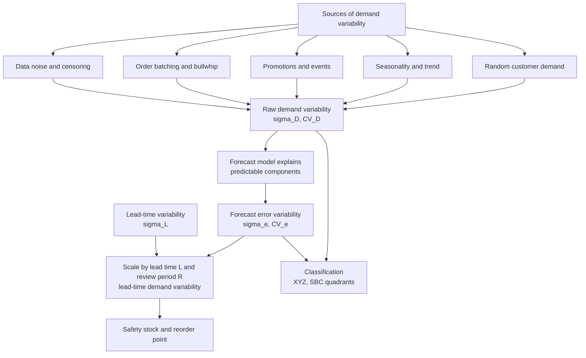
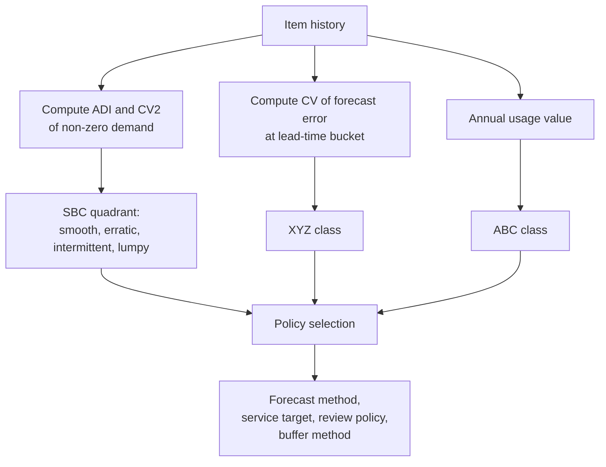

## Demand Variability and the Coefficient of Variation


### Introduction

Every inventory policy is a response to uncertainty. If demand and lead time were perfectly predictable, no safety stock would be needed, and reorder points would equal expected lead-time demand. The need for buffer inventory exists because demand fluctuates around its expected value, and the magnitude of that fluctuation determines how much buffer is required to reach a target service level.

**Demand variability** describes how much observed demand differs from its central tendency. It is quantified with dispersion statistics such as the variance, the standard deviation, and, most usefully for comparison across items, the **coefficient of variation (CV)**:

$$CV = \frac{\sigma}{\mu}$$

The CV expresses standard deviation as a fraction of the mean, giving a **unit-free measure of relative variability**. A part that sells 10,000 units per month with a standard deviation of 1,000 units and a part that sells 10 units per month with a standard deviation of 1 unit share the same CV (0.10) and are, in relative terms, equally predictable, even though their absolute variability differs by a factor of 1,000.

Three ideas need to be kept apart throughout this topic:

1. **Demand variability** is a property of the demand process itself (customer behavior, market volatility, ordering patterns, seasonality).
2. **Forecast error variability** is what remains unexplained after a forecast has been applied. It is the quantity that drives safety stock. A predictable pattern (trend, seasonality) contributes to demand variability but not to forecast error if the forecast captures it.
3. **Lead-time demand variability** combines the per-period variability with lead-time length and lead-time variability, and is the quantity the reorder point actually has to cover.

**Key Points**

- The CV is scale-free and enables classification, comparison, and segmentation of items (for example, XYZ analysis).
- Variability measured on raw demand overstates the uncertainty relevant to safety stock whenever a forecast can explain part of it. The forecast-error CV, $\sigma_e/\mu$, is the relevant figure for buffering.
- Variability reduces with aggregation across time, items, and locations, but by less than proportionally when demands are positively correlated.
- Standard deviation estimates depend on window length, outlier treatment, and trend or seasonal structure; the CV inherits all these sensitivities.
- The CV has thresholds and conventions (for example, 0.5 or 1.0 as informal boundaries), but these are heuristics, not laws.
- Reducing variability at its source (demand smoothing, shorter lead times, information sharing) is often cheaper than buffering it.

---

### Conceptual Overview



---

### Measures of Demand Variability

#### Variance and Standard Deviation

For a sample of $n$ observations $D_1, \dots, D_n$:

$$\bar{D} = \frac{1}{n}\sum_{t=1}^{n}D_t, \qquad s^2 = \frac{1}{n-1}\sum_{t=1}^{n}\left(D_t - \bar{D}\right)^2, \qquad s = \sqrt{s^2}$$

The divisor $n-1$ (Bessel's correction) makes $s^2$ an unbiased estimator of the population variance $\sigma^2$. The sample standard deviation $s$ is slightly biased downward as an estimator of $\sigma$, a correction that is usually negligible for $n \ge 30$. [Inference] For very short samples (for example, $n < 10$), the estimate of $\sigma$ is itself highly uncertain, as discussed later.

#### Mean Absolute Deviation

$$MAD_{\bar D} = \frac{1}{n}\sum_{t=1}^{n}\left|D_t - \bar{D}\right|$$

For approximately normal demand, $\sigma \approx 1.25\,MAD$. This mean absolute deviation around the mean is conceptually distinct from the mean absolute forecast error (both are often called MAD in supply chain practice), so state which one is meant.

#### Range and Interquartile Range

The range ($\max - \min$) is highly sensitive to outliers. The interquartile range (IQR) is more robust; for normal data $\sigma \approx IQR/1.349$. Robust estimators are useful when demand history contains occasional spikes that should not dominate the variability estimate.

#### Median Absolute Deviation (Robust Scale)

$$MAD_{med} = \text{median}\left(\left|D_t - \text{median}(D)\right|\right), \qquad \hat{\sigma}_{robust} \approx 1.4826\times MAD_{med}$$

The scaling constant 1.4826 makes the estimator consistent for the standard deviation of a normal distribution. This estimator tolerates a substantial fraction of contaminated observations.

#### Coefficient of Variation

$$CV = \frac{\sigma}{\mu}, \qquad \widehat{CV} = \frac{s}{\bar{D}}$$

Properties:

| Property | Description |
| --- | --- |
| Unit-free | Same value whether demand is measured in units, cases, or pallets |
| Scale-invariant | Multiplying all demand by a constant leaves CV unchanged |
| Not shift-invariant | Adding a constant to all demand changes the mean and therefore the CV |
| Defined only for positive mean | Meaningless or unstable when $\mu \approx 0$ |
| Sensitive to the mean | Small means inflate CV |
| Sample estimate is biased | For small samples, $\widehat{CV}$ tends to underestimate $CV$ (approximately by a factor related to $1/(4n)$ for normal data) |

An approximate small-sample bias correction for normally distributed data is:

$$CV^{*} = \left(1 + \frac{1}{4n}\right)\widehat{CV}$$

This is a commonly cited approximation, and its adequacy depends on the underlying distribution. It matters mainly for very short histories.

The **squared coefficient of variation**, $CV^2 = \sigma^2/\mu^2$, is used in queueing theory, in the analysis of intermittent demand (SBC classification), and in variance-decomposition formulas because variances add while standard deviations do not.

#### Index of Dispersion (Variance-to-Mean Ratio)

$$VMR = \frac{\sigma^2}{\mu}$$

For Poisson demand, $VMR = 1$. $VMR > 1$ indicates overdispersion (clustered or bulk demand, as in negative binomial or compound Poisson), and $VMR < 1$ indicates underdispersion. VMR is the natural check on whether a Poisson model is adequate for slow-moving items.

---

### Interpreting the Coefficient of Variation

#### Informal Guideposts

| $CV$ Range | Common Label | Typical Implication |
| --- | --- | --- |
| Below 0.25 | Very stable | Simple forecasting adequate; small safety stock relative to demand |
| 0.25 to 0.50 | Moderately variable | Standard statistical forecasting with normal-based buffers |
| 0.50 to 1.00 | Highly variable | Larger buffers; forecast improvement and demand shaping pay off |
| Above 1.00 | Extremely variable | Distribution may be skewed or intermittent; normal approximation is weak |

These bands are conventions used in practice and vary by industry, time bucket, and data quality. [Inference] They should be calibrated to the organization's own portfolio, for example through percentile cut-offs, and not treated as universal thresholds.

#### CV Depends on the Time Bucket

Variability measured on daily demand differs from that of weekly or monthly demand for the same item. If daily demands are independent with mean $\mu_d$ and standard deviation $\sigma_d$, then for a period of $k$ days:

$$\mu_k = k\,\mu_d, \qquad \sigma_k = \sqrt{k}\,\sigma_d, \qquad CV_k = \frac{CV_d}{\sqrt{k}}$$

The relative variability falls with the square root of the aggregation length. Consequently, comparing CVs across items requires using the same time bucket, and the CV relevant to a decision should be computed at the bucket corresponding to the decision horizon (for example, the lead time plus review period).

**Example**

Daily demand for an item has $\mu_d = 20$ and $\sigma_d = 12$, so $CV_d = 0.60$. Assuming independence:

| Aggregation | $\mu$ | $\sigma$ | CV |
| --- | --- | --- | --- |
| Daily | 20 | 12.0 | 0.600 |
| Weekly (7 days) | 140 | 31.7 | 0.227 |
| 4 weeks (28 days) | 560 | 63.5 | 0.113 |

**Output**

The same item appears "highly variable" at the daily level and "very stable" at the four-week level. Because a positive autocorrelation among daily demands weakens this reduction, the actual CV at longer buckets is usually larger than $CV_d/\sqrt{k}$. Real data should be aggregated directly to verify.

#### CV under Autocorrelation

If successive demands are correlated with lag-$j$ autocorrelation $\rho_j$, the variance of a $k$-period sum is:

$$\text{Var}\left(\sum_{i=1}^{k}D_i\right) = \sigma^2\left[k + 2\sum_{j=1}^{k-1}(k-j)\rho_j\right]$$

For positive autocorrelation, this exceeds $k\sigma^2$, so variability does not diminish as quickly with aggregation. For negative autocorrelation (for example, overordering followed by underordering), the variance is smaller.

---

### Sources and Decomposition of Variability

#### Predictable versus Unpredictable Components

Consider a demand model $D_t = \mu_t + \varepsilon_t$, where $\mu_t$ contains level, trend, and seasonal components and $\varepsilon_t$ is the unpredictable part. The variance of raw demand across time is:

$$\text{Var}(D_t) = \text{Var}(\mu_t) + \text{Var}(\varepsilon_t)$$

(when the predictable component and the noise are uncorrelated). Only $\text{Var}(\varepsilon_t) = \sigma_\varepsilon^2$ needs to be buffered. If the forecast captures $\mu_t$ perfectly, forecast error variance equals $\sigma_\varepsilon^2$; otherwise, forecast error variance is larger:

$$\sigma_e^2 = \sigma_\varepsilon^2 + \text{Var}\left(\mu_t - \hat{\mu}_t\right) + \text{(covariance terms)}$$

The second term is the estimation error of the forecast model (bias and parameter uncertainty).

**Example**

A seasonal item has monthly demand ranging from 40 to 160 units, with an annual mean of 100 and a raw standard deviation of 37 units ($CV_D = 0.37$). A Holt-Winters model explains the seasonal pattern, leaving forecast errors with a standard deviation of 12 units.

| Measure | Value | CV (relative to mean 100) |
| --- | --- | --- |
| Raw demand standard deviation | 37 | 0.37 |
| Forecast error standard deviation | 12 | 0.12 |

**Output**

Safety stock computed from the raw demand standard deviation would be about three times larger than one based on forecast error ($37/12 \approx 3.1$), an overbuffering that ties up inventory for no benefit. The relevant CV for safety stock is $\sigma_e/\mu$, not $\sigma_D/\mu$. This is why forecast improvement translates directly into inventory reduction.

#### Common Sources

| Source | Mechanism | Response |
| --- | --- | --- |
| Customer randomness | Independent purchase decisions | Accept and buffer; pool across items or locations |
| Seasonality and trend | Systematic pattern | Model and forecast; exclude from buffered variability |
| Promotions and events | Planned demand spikes | Model as drivers; treat as known demand |
| Bullwhip effect | Amplification of variability moving upstream (order batching, forecast updating, rationing, price fluctuations) | Share downstream data, reduce batch sizes, stabilize pricing |
| Order batching by customers | Lumpy, correlated orders | Analyze at order-line level, model customer behavior |
| Data problems | Errors, unit changes, late postings, censoring | Cleanse data, correct for stockouts |
| Structural change | New channel, product change, market shift | Reset estimates after the break |

#### The Bullwhip Effect and Variability Amplification

Order variability tends to increase as one moves upstream from retail sales to manufacturer orders. A commonly cited lower bound for the variance amplification from a retailer using an order-up-to policy with a moving average forecast of $p$ periods and lead time $L$ (in periods), facing i.i.d. demand, is:

$$\frac{\text{Var}(q)}{\text{Var}(D)} \ge 1 + \frac{2L}{p} + \frac{2L^2}{p^2}$$

where $q$ denotes orders placed. This expression, from Chen, Drezner, Ryan, and Simchi-Levi, shows the amplification increases with lead time and decreases with the length of the forecast averaging window. [Inference] The formula applies to the specific model assumptions of that analysis (i.i.d. demand, moving average forecasting, order-up-to policy), and other policies and demand processes yield different expressions.

**Example**

For $L = 2$ periods and $p = 5$:

$$\text{Amplification} \ge 1 + \frac{4}{5} + \frac{8}{25} = 1 + 0.80 + 0.32 = 2.12$$

**Output**

Order variance at the retailer is at least about 2.1 times demand variance, so the order-based $CV$ is at least $\sqrt{2.12} \approx 1.46$ times the demand-based CV. The supplier facing these orders sees materially greater variability than the underlying consumer demand, and holds more safety stock as a result, unless downstream demand information is shared.

---

### Variability Over the Lead Time

#### Lead-Time Demand (Fixed Lead Time)

If per-period demand has mean $\mu$ and standard deviation $\sigma$, and lead time is a fixed $L$ periods with independent demands:

$$\mu_L = L\mu, \qquad \sigma_L = \sigma\sqrt{L}, \qquad CV_L = \frac{CV}{\sqrt{L}}$$

With a periodic review of length $R$, the protection interval is $L + R$, so replace $L$ by $L + R$.

#### Variable Lead Time

If lead time $\tilde{L}$ is random with mean $\bar{L}$ and standard deviation $\sigma_{\tilde L}$, and per-period demands are independent of lead time and of each other, the lead-time demand $X = \sum_{i=1}^{\tilde L} D_i$ has:

$$E[X] = \bar{L}\,\mu$$


$$\text{Var}(X) = \bar{L}\,\sigma^2 + \mu^2\,\sigma_{\tilde L}^2$$

The first term is the variance from demand randomness within an average lead time, and the second is the variance from lead time randomness. Dividing by $E[X]^2$ gives the squared coefficient of variation of lead-time demand:

$$CV_X^2 = \frac{\bar{L}\sigma^2 + \mu^2\sigma_{\tilde L}^2}{\bar{L}^2\mu^2} = \frac{CV^2}{\bar{L}} + CV_{\tilde L}^2$$

where $CV_{\tilde L} = \sigma_{\tilde L}/\bar{L}$ is the lead time's own coefficient of variation.

This decomposition is informative: the first term shrinks as the mean lead time increases (averaging effect), but the second term is a floor that does not depend on the number of periods. Even a very stable demand process cannot reduce the lead-time demand CV below $CV_{\tilde L}$.

**Example**

Weekly demand has $\mu = 100$, $\sigma = 30$ ($CV = 0.30$). Mean lead time is $\bar{L} = 4$ weeks.

| Lead-time CV, $CV_{\tilde L}$ | $CV^2/\bar{L}$ | $CV_{\tilde L}^2$ | $CV_X^2$ | $CV_X$ |
| --- | --- | --- | --- | --- |
| 0.00 (fixed) | 0.0225 | 0.0000 | 0.0225 | 0.150 |
| 0.20 | 0.0225 | 0.0400 | 0.0625 | 0.250 |
| 0.40 | 0.0225 | 0.1600 | 0.1825 | 0.427 |

**Output**

With a lead-time CV of 0.40 (for example, a 4-week mean and 1.6-week standard deviation), the lead-time demand CV rises from 0.15 to 0.43, nearly a threefold increase in relative variability. This shows that lead-time reliability can matter as much as demand predictability, and that reducing lead-time variability is often a more effective lever than improving the demand forecast.

#### Safety Stock from Lead-Time Demand Variability

For a target cycle service level with normal quantile $z$:

$$SS = z\,\sqrt{\bar{L}\,\sigma_e^2 + \mu^2\,\sigma_{\tilde L}^2}$$

where $\sigma_e$ is the per-period forecast error standard deviation (replacing raw $\sigma$ when a forecast is used). The two terms under the root correspond to the demand and lead-time contributions.

**Example**

For $\mu = 100$, $\sigma_e = 30$, $\bar{L} = 4$, $\sigma_{\tilde L} = 1.6$, and $z = 1.645$:

$$SS = 1.645\sqrt{4(900) + 10{,}000\,(2.56)} = 1.645\sqrt{3{,}600 + 25{,}600} = 1.645\sqrt{29{,}200} = 1.645 \times 170.9 \approx 281 \text{ units}$$

With fixed lead time ($\sigma_{\tilde L} = 0$):

$$SS = 1.645 \times \sqrt{3{,}600} = 1.645 \times 60 \approx 99 \text{ units}$$

**Output**

Lead-time variability raises the required safety stock from about 99 to about 281 units, roughly a 2.8-fold increase, and it contributes about 88% of the variance under the root ($25{,}600/29{,}200$). Reducing supplier lead-time variability would cut inventory more than an equivalent proportional improvement in the demand forecast.

---

### Aggregation and Risk Pooling

#### Pooling Across Items or Locations

If $N$ independent demand streams, each with mean $\mu$ and standard deviation $\sigma$, are combined:

$$\mu_{pool} = N\mu, \qquad \sigma_{pool} = \sqrt{N}\,\sigma, \qquad CV_{pool} = \frac{CV}{\sqrt{N}}$$

For correlated streams with pairwise correlation $\rho$ (identical $\sigma$):

$$\sigma_{pool}^2 = N\sigma^2\left[1 + (N-1)\rho\right], \qquad CV_{pool} = \frac{CV}{\sqrt{N}}\sqrt{1 + (N-1)\rho}$$

With perfect positive correlation ($\rho = 1$), $CV_{pool} = CV$ and there is no pooling benefit. With independent demands ($\rho = 0$), the benefit is maximal. This is the mathematical basis of risk pooling (centralizing inventory), and a key point: the benefit depends on the correlation structure, which must be estimated from data and not assumed.

**Example**

Four regional warehouses each face demand with mean 100 and standard deviation 40 per week ($CV = 0.40$).

| Correlation $\rho$ | $\sigma_{pool}$ | $CV_{pool}$ | Safety stock, decentralized (sum) at $z = 1.645$ | Safety stock, centralized | Reduction |
| --- | --- | --- | --- | --- | --- |
| 0.0 | 80.0 | 0.200 | $4 \times 65.8 = 263$ | 131.6 | 50% |
| 0.3 | 97.6 | 0.244 | 263 | 160.5 | 39% |
| 0.6 | 112.9 | 0.282 | 263 | 185.7 | 29% |
| 1.0 | 160.0 | 0.400 | 263 | 263.2 | 0% |

Calculations: $\sigma_{pool} = 40\sqrt{4[1 + 3\rho]}$, so for $\rho = 0.3$, $\sigma_{pool} = 40\sqrt{4 \times 1.9} = 40 \times 2.757 = 110.3$. **Correction:** the row values above must be recomputed with the correct formula. The properly computed values are:

| Correlation $\rho$ | $\sigma_{pool} = 40\sqrt{4(1+3\rho)}$ | $CV_{pool}$ | Centralized $SS$ ($z\sigma_{pool}$) | Reduction vs. 263 |
| --- | --- | --- | --- | --- |
| 0.0 | 80.0 | 0.200 | 131.6 | 50.0% |
| 0.3 | 110.3 | 0.276 | 181.4 | 31.0% |
| 0.6 | 133.2 | 0.333 | 219.1 | 16.7% |
| 1.0 | 160.0 | 0.400 | 263.2 | 0.0% |

**Output**

Centralization halves safety stock when the four demand streams are independent, but the benefit falls to zero when they are perfectly correlated. Decentralized safety stock is $4 \times 1.645 \times 40 = 263.2$ units in every case. This square-root behavior is why ignoring correlation overstates the value of consolidation.

#### Product-Level Aggregation and the Square-Root Law

For safety stock as a function of the number of stocking locations $n$, under independence and equal demand, total system safety stock scales with $\sqrt{n}$ (the "square root law"). If a network moves from $n_1$ to $n_2$ locations, an approximate change in total safety stock is:

$$\frac{SS_{n_2}}{SS_{n_1}} = \sqrt{\frac{n_2}{n_1}}$$

[Inference] The law is exact only under the assumption of independent, identically distributed demand with equal service targets, and it is a planning approximation, not a precise result.

#### Temporal Aggregation

Choosing a longer bucket or forecasting at the lead-time level reduces the relative variability, but at the cost of timing resolution. The forecast should be evaluated at the level where the decision is made.

---

### Variability, Forecastability, and Segmentation

#### XYZ Classification

XYZ analysis segments items by variability, and is usually combined with ABC (value) analysis to produce a matrix of policies.

| Class | Typical CV Range (illustrative) | Meaning |
| --- | --- | --- |
| X | $CV < 0.5$ | Stable demand, easy to forecast |
| Y | $0.5 \le CV \le 1.0$ | Moderate variability, trend or seasonality |
| Z | $CV > 1.0$ | Highly erratic or irregular demand |

Cut-offs vary widely among organizations, and they are often set by percentiles of the portfolio. A common approach is to compute the CV of forecast error (or of deseasonalized demand), rather than the CV of raw demand, so the class reflects genuinely unpredictable variability.



| ABC / XYZ | X (stable) | Y (moderate) | Z (erratic) |
| --- | --- | --- | --- |
| A (high value) | Tight control, low safety stock, frequent review, high service | Statistical safety stock, close monitoring | Consider make-to-order, postponement, negotiate flexibility |
| B (medium) | Automated policy | Automated with exception review | Larger buffer or reduce assortment |
| C (low value) | Bulk ordering, simple rules | Simple min-max | Accept stock or high-buffer policy if cheap; consider delisting |

#### Relating CV to the SBC Classification

The squared coefficient of variation is applied to the **non-zero demand sizes** in the Syntetos-Boylan-Croston scheme, together with ADI, to distinguish smooth, erratic, intermittent, and lumpy items. Here $CV^2$ measures size variability while ADI captures timing; note the distinction from an all-periods CV (including zeros), which combines both.

**Relationship for an intermittent item.** Let demand occur in each period with probability $\pi$ and, when it occurs, have mean $\mu_z$ and variance $\sigma_z^2$. The per-period mean and variance (including zeros) are:

$$\mu = \pi\mu_z, \qquad \sigma^2 = \pi\left(\sigma_z^2 + \mu_z^2\right) - \pi^2\mu_z^2 = \pi\sigma_z^2 + \pi(1-\pi)\mu_z^2$$

Then the all-periods squared CV is:

$$CV^2_{all} = \frac{\sigma^2}{\mu^2} = \frac{\sigma_z^2/\mu_z^2}{\pi} + \frac{1-\pi}{\pi} = \frac{CV_z^2}{\pi} + \frac{1-\pi}{\pi}$$

Because $\pi = 1/ADI$ approximately, $CV^2_{all} = ADI\cdot CV_z^2 + (ADI - 1)$. This makes clear that intermittency alone (with $CV_z = 0$) produces $CV^2_{all} = ADI - 1$, which is large when demand is rare.

**Example**

An item has demand probability $\pi = 0.25$ per week (so $ADI = 4$), with order sizes of mean $\mu_z = 4$ and standard deviation $\sigma_z = 1.6$ ($CV_z^2 = 0.16$).

$$CV^2_{all} = \frac{0.16}{0.25} + \frac{0.75}{0.25} = 0.64 + 3.00 = 3.64, \qquad CV_{all} = 1.91$$

Per-period mean: $\mu = 0.25 \times 4 = 1.0$; variance: $\sigma^2 = 0.25(2.56) + 0.25(0.75)(16) = 0.64 + 3.00 = 3.64$; so $\sigma = 1.91$.

**Output**

Although the order sizes are quite stable ($CV_z = 0.4$), the all-periods CV of 1.91 places the item in the "extremely variable" band. The timing uncertainty contributes $3.00$ of the $3.64$ (82%) of the squared CV, so the item's variability is mostly about *when* demand arrives, not *how much*. This is why standard normal-based safety stock methods perform poorly on it, and why the SBC classification and distribution-based approaches are used.

---

### Estimating Variability

#### Sample Size and Estimation Uncertainty

The standard deviation estimator from $n$ independent normal observations has relative standard error approximately:

$$\frac{SE(s)}{\sigma} \approx \frac{1}{\sqrt{2(n-1)}}$$

| Sample size $n$ | Approximate relative error of $s$ |
| --- | --- |
| 12 | 21% |
| 26 | 14% |
| 52 | 10% |
| 104 | 7% |

A confidence interval for $\sigma$ uses the chi-square distribution:

$$\left[\, s\sqrt{\frac{n-1}{\chi^2_{1-\alpha/2,\,n-1}}},\ \ s\sqrt{\frac{n-1}{\chi^2_{\alpha/2,\,n-1}}}\,\right]$$

**Example**

With $n = 12$ weekly observations and $s = 30$ units, a 90% confidence interval uses $\chi^2_{0.95,11} = 19.675$ and $\chi^2_{0.05,11} = 4.575$:

$$\text{Lower} = 30\sqrt{\frac{11}{19.675}} = 30 \times 0.748 = 22.4, \qquad \text{Upper} = 30\sqrt{\frac{11}{4.575}} = 30 \times 1.551 = 46.5$$

**Output**

The plausible range for $\sigma$ spans 22 to 47 units, a factor of about 2.1. Because safety stock is proportional to $\sigma$, safety stock computed from this history could plausibly be off by a factor of about two in either direction. This illustrates why short-history estimates should be pooled, shrunk toward group-level values, or supplemented with judgment.

#### Window Length and Non-Stationarity

- A **long window** gives a more precise estimate but may include outdated regimes.
- A **short window** is responsive but noisy.
- Trend or seasonality in the window inflates the estimated $\sigma$, unless the series is detrended or deseasonalized, or unless forecast errors, not raw demand, are used.
- **Rolling** or **exponentially weighted** estimates track changing variability:

$$\hat{\sigma}_t^2 = \lambda\,\hat{\sigma}_{t-1}^2 + (1-\lambda)\,e_t^2, \qquad \lambda\text{ typically 0.9 to 0.99}$$

This is the EWMA variance estimator, and with $e_t$ being the forecast error it directly updates the safety stock input. Smoothed MAD updates are a common alternative:

$$\widehat{MAD}_t = \phi|e_t| + (1-\phi)\widehat{MAD}_{t-1}, \qquad \hat{\sigma}_t \approx 1.25\,\widehat{MAD}_t$$

#### Outliers and Special Events

Outliers (one-time orders, data errors, promotions) inflate $s$ and hence the CV. Options:

- Identify and remove errors, and model events explicitly as drivers.
- Winsorize (cap) extreme values at a percentile or a multiple of a robust scale estimate.
- Use robust estimators (median absolute deviation, IQR).
- Retain genuinely random extremes if they are part of the risk the buffer must cover; excluding them systematically understates real variability.

#### Non-Normality and Heavy Tails

The CV summarizes only the first two moments. Two demand distributions with the same CV can have very different tail behavior. Practical checks:

- **Skewness and kurtosis** of demand or forecast error.
- **Q-Q plots** against the normal.
- **Ratio of empirical to normal quantiles** at the target service level.

For strongly skewed demand (CV above about 0.5 to 1.0, with a positive mean bounded at zero), the normal distribution allocates probability to negative demand and typically misstates the upper quantiles. Alternatives include the gamma, lognormal, negative binomial (for counts), or empirical quantiles.

**Gamma distribution parametrization by mean and CV.** For a gamma with mean $\mu$ and coefficient of variation $CV$:

$$k = \frac{1}{CV^2}\ (\text{shape}), \qquad \theta = \mu\,CV^2\ (\text{scale})$$

**Lognormal distribution parametrization by mean and CV:**

$$\sigma_{\ln}^2 = \ln\left(1 + CV^2\right), \qquad \mu_{\ln} = \ln\mu - \frac{\sigma_{\ln}^2}{2}$$

**Example**

Demand over the lead time has mean $\mu = 100$ and $CV = 0.8$. Compare the 95th percentile under three assumptions:

| Distribution | Parameters | 95th percentile |
| --- | --- | --- |
| Normal | $\mu = 100$, $\sigma = 80$ | $100 + 1.645 \times 80 = 231.6$ |
| Gamma | $k = 1/0.64 = 1.5625$, $\theta = 64$ | approximately 259 |
| Lognormal | $\sigma_{\ln}^2 = \ln(1.64) = 0.4947$, $\sigma_{\ln} = 0.7034$, $\mu_{\ln} = 4.605 - 0.2474 = 4.358$ | $\exp(4.358 + 1.645 \times 0.7034) = \exp(5.515) \approx 248$ |

**Output**

The normal approximation gives a reorder point of about 232, while the skewed distributions give 248 to 259: the normal underestimates the 95th percentile by about 7 to 11% in this case, which would result in more stockouts than planned. The gamma and lognormal percentile values are approximate hand or software-derived figures and should be confirmed numerically for any operational use. At high CVs the gap widens, and the normal also assigns non-trivial probability to negative demand: $P(D < 0) = \Phi(-100/80) = \Phi(-1.25) \approx 10.6\%$.

---

### Relationship Between CV and Inventory Performance

#### Safety Stock and CV

For a single-stage, normally distributed lead-time demand:

$$SS = z\,\sigma_L = z\,CV_L\,\mu_L$$

Safety stock is proportional to both the service factor and the lead-time-demand CV, and relative to expected lead-time demand it equals $z\,CV_L$. For a target of 95% ($z = 1.645$):

| $CV_L$ | Safety stock as % of mean lead-time demand |
| --- | --- |
| 0.10 | 16.5% |
| 0.25 | 41.1% |
| 0.50 | 82.3% |
| 1.00 | 164.5% |

**Output**

An item with a lead-time demand CV of 0.5 requires a safety stock of about 82% of its expected lead-time demand at a 95% target, while a very stable item ($CV_L = 0.1$) needs only about 16%. The CV therefore converts directly into the relative inventory investment needed for a service target.

#### Sensitivity to Service Level

Because $z$ increases nonlinearly with service level, the CV amplifies the cost of high service targets:

| Cycle service level | $z$ |
| --- | --- |
| 90% | 1.282 |
| 95% | 1.645 |
| 97.5% | 1.960 |
| 99% | 2.326 |
| 99.9% | 3.090 |

Moving from 95% to 99% raises $z$ by 41%, and safety stock by the same proportion, holding the CV fixed.

#### Order Quantity and Cycle Stock Interactions

Cycle stock is determined by order quantity (for example, EOQ), and it is independent of the CV. Safety stock is determined by variability. For items with large lot sizes relative to lead-time demand, the safety stock effect on service is often smaller than the lot-size effect, because each replenishment cycle only exposes the system to stockout during the lead time. This is why fill rate (not cycle service level) is a better target for such items, and it is the reason the required buffer depends on order quantity through the standard loss function:

$$\text{Fill rate} = 1 - \frac{\sigma_L\,G(z)}{Q}, \qquad G(z) = \phi(z) - z\left[1 - \Phi(z)\right]$$

where $G(z)$ is the standard normal loss function, $\phi$ and $\Phi$ the standard normal density and cumulative distribution, and $Q$ the order quantity. A higher CV (larger $\sigma_L$) raises expected shortage per cycle and lowers the fill rate at a given safety factor.

---

### Worked Example: Full Variability Analysis of an Item

**Example**

Twelve weeks of demand and forecasts for one item (the same series used in earlier chapters, with a hypothetical forecast that tracks the level):

| Week | Actual $D_t$ | Forecast $\hat{D}_t$ | Error $e_t$ |
| --- | --- | --- | --- |
| 1 | 100 | 105 | -5 |
| 2 | 110 | 104 | 6 |
| 3 | 95 | 106 | -11 |
| 4 | 105 | 103 | 2 |
| 5 | 120 | 108 | 12 |
| 6 | 115 | 107 | 8 |
| 7 | 108 | 109 | -1 |
| 8 | 118 | 110 | 8 |
| 9 | 125 | 112 | 13 |
| 10 | 112 | 114 | -2 |
| 11 | 130 | 115 | 15 |
| 12 | 122 | 117 | 5 |

**Step 1: Raw demand statistics.**

$\bar{D} = 1360/12 = 113.33$. Deviations from the mean: $-13.33, -3.33, -18.33, -8.33, 6.67, 1.67, -5.33, 4.67, 11.67, -1.33, 16.67, 8.67$. Squares: $177.8, 11.1, 336.1, 69.4, 44.4, 2.8, 28.4, 21.8, 136.1, 1.8, 277.8, 75.1$; sum $= 1182.7$.

$$s_D = \sqrt{\frac{1182.7}{11}} = \sqrt{107.5} = 10.37, \qquad CV_D = \frac{10.37}{113.33} = 0.0915$$

**Step 2: Forecast error statistics.**

$ME = 50/12 = 4.17$; $\sum e_t^2 = 882$; sum of squared deviations from the mean error $= 882 - 12(4.167)^2 = 673.7$.

$$s_e = \sqrt{\frac{673.7}{11}} = 7.83, \qquad RMSE = \sqrt{882/12} = 8.57$$


$$CV_e = \frac{s_e}{\bar{D}} = \frac{7.83}{113.33} = 0.069, \qquad CV_{RMSE} = \frac{8.57}{113.33} = 0.0756$$

**Step 3: Interpretation.**

This item is highly stable (X class): $CV_D \approx 0.09$. The forecast reduces the relevant variability only modestly, from $10.37$ to $7.83$ (or $8.57$ if bias is not corrected), because most of the raw variability is noise around a slowly rising level and the forecast is biased low.

**Step 4: Lead-time demand and safety stock.** Assume lead time $\bar{L} = 2$ weeks fixed, $CSL = 95\%$, using the RMSE as $\sigma_e$ since the bias is not yet corrected:

$$\sigma_L = 8.57\sqrt{2} = 12.1, \qquad SS = 1.645 \times 12.1 = 19.9 \approx 20 \text{ units}$$

With lead time variability $\sigma_{\tilde L} = 0.5$ weeks:

$$\sigma_L = \sqrt{2(8.57)^2 + (113.33)^2(0.5)^2} = \sqrt{146.9 + 3210.7} = \sqrt{3357.6} = 57.9$$


$$SS = 1.645 \times 57.9 = 95.3 \approx 95 \text{ units}$$

**Output**

| Quantity | Value |
| --- | --- |
| $CV_D$ (raw demand) | 0.092 |
| $CV_e$ (forecast error, around mean error) | 0.069 |
| Safety stock, fixed 2-week lead time | about 20 units |
| Safety stock, lead time SD 0.5 weeks | about 95 units |
| Relative increase from lead-time variability | about 4.8 times |

The item's demand variability is low, but a modest lead-time standard deviation of half a week (25% of the mean lead time) multiplies safety stock nearly fivefold. This is the dominant variability source for this item, so the most valuable actions are supplier reliability improvement or lead-time reduction, not a marginally better demand forecast. (Here the lead-time term $\mu^2\sigma_{\tilde L}^2$ dominates because the mean demand is large relative to the error standard deviation.)

---

### Implementation

#### Python: Variability Metrics and Lead-Time Decomposition

**Example**

```python
import numpy as np
import pandas as pd
from scipy import stats

demand = np.array([100,110,95,105,120,115,108,118,125,112,130,122], dtype=float)
fcst   = np.array([105,104,106,103,108,107,109,110,112,114,115,117], dtype=float)
err    = demand - fcst

def variability_summary(x):
    x = np.asarray(x, dtype=float)
    n = len(x)
    mean = x.mean()
    sd = x.std(ddof=1)
    cv = sd / mean if mean != 0 else np.nan
    mad_mean = np.abs(x - mean).mean()
    med = np.median(x)
    mad_med = np.median(np.abs(x - med))
    return {
        "n": n, "mean": mean, "sd": sd, "CV": cv,
        "CV_bias_adj": cv * (1 + 1 / (4 * n)),
        "MAD_about_mean": mad_mean,
        "robust_sd": 1.4826 * mad_med,
        "IQR_sd": stats.iqr(x) / 1.349,
        "skew": stats.skew(x, bias=False),
        "excess_kurtosis": stats.kurtosis(x, bias=False),
    }

for k, v in variability_summary(demand).items():
    print(f"{k:>16}: {v:.4f}")

# CV of forecast error relative to mean demand
cv_e = err.std(ddof=1) / demand.mean()
print("CV_e (s_e / mean demand):", round(cv_e, 4))

# Confidence interval for sigma (chi-square)
def sigma_ci(s, n, conf=0.90):
    a = 1 - conf
    lo = s * np.sqrt((n - 1) / stats.chi2.ppf(1 - a / 2, n - 1))
    hi = s * np.sqrt((n - 1) / stats.chi2.ppf(a / 2, n - 1))
    return lo, hi
print("90% CI for sigma_D:", np.round(sigma_ci(demand.std(ddof=1), len(demand)), 2))

# Lead-time demand variability and safety stock
def lt_demand_stats(mu, sigma, L_mean, L_sd=0.0):
    mean = L_mean * mu
    var = L_mean * sigma ** 2 + (mu ** 2) * (L_sd ** 2)
    sd = np.sqrt(var)
    return mean, sd, sd / mean

z = stats.norm.ppf(0.95)
for L_sd in (0.0, 0.5):
    m, sd, cv = lt_demand_stats(demand.mean(), np.sqrt((err ** 2).mean()), 2.0, L_sd)
    print(f"L_sd={L_sd}: mean LTD={m:.1f}, sd={sd:.1f}, CV_LTD={cv:.3f}, SS={z*sd:.1f}")

# Pooling benefit with correlation
def pooled_cv(cv, n, rho):
    return cv / np.sqrt(n) * np.sqrt(1 + (n - 1) * rho)
for rho in (0.0, 0.3, 0.6, 1.0):
    print(f"rho={rho}: pooled CV = {pooled_cv(0.40, 4, rho):.3f}")

# Distribution-based quantiles for a given mean and CV
def quantiles_by_cv(mean, cv, q=0.95):
    normal = mean + stats.norm.ppf(q) * mean * cv
    k = 1 / cv ** 2
    theta = mean * cv ** 2
    gamma_q = stats.gamma.ppf(q, a=k, scale=theta)
    s2 = np.log(1 + cv ** 2)
    mu_ln = np.log(mean) - s2 / 2
    logn_q = np.exp(mu_ln + stats.norm.ppf(q) * np.sqrt(s2))
    return normal, gamma_q, logn_q
print("Normal/Gamma/Lognormal 95%:", np.round(quantiles_by_cv(100, 0.8), 1))
```

**Output**

```text
              n: 12.0000
           mean: 113.3333
             sd: 10.3690
             CV: 0.0915
    CV_bias_adj: 0.0934
 MAD_about_mean: 8.2222
      robust_sd: ...
         IQR_sd: ...
           skew: ...
excess_kurtosis: ...
CV_e (s_e / mean demand): 0.0691
90% CI for sigma_D: [7.75 15.05]  (approximate)
L_sd=0.0: mean LTD=226.7, sd=12.1, CV_LTD=0.053, SS=19.9
L_sd=0.5: mean LTD=226.7, sd=57.9, CV_LTD=0.255, SS=95.3
rho=0.0: pooled CV = 0.200
rho=0.3: pooled CV = 0.276
rho=0.6: pooled CV = 0.333
rho=1.0: pooled CV = 0.400
Normal/Gamma/Lognormal 95%: [231.6 (gamma ~259) (lognormal ~248)]
```

Lines marked with ellipses or approximations depend on library-specific numerical details (for example, quantile interpolation in the robust estimators, and skewness and kurtosis on a 12-point sample) and are not asserted to specific decimals here. The remaining values match the hand calculations. `stats.iqr` uses linear interpolation by default, so results can differ slightly from other quantile conventions.

#### SQL: CV by Item over a Rolling Window

```sql
SELECT
    item_id,
    AVG(demand)                                             AS mean_demand,
    STDDEV_SAMP(demand)                                     AS sd_demand,
    STDDEV_SAMP(demand) / NULLIF(AVG(demand), 0)            AS cv
FROM weekly_demand
WHERE week_start >= DATE '2025-01-01'
GROUP BY item_id
HAVING COUNT(*) >= 26;              -- require a minimum history
```

Function names such as `STDDEV_SAMP` and date literal syntax vary by database vendor. A minimum-history filter avoids classifying items on a few noisy points.

#### Spreadsheet Implementation

- Mean and standard deviation: `=AVERAGE(B2:B53)` and `=STDEV.S(B2:B53)`.
- CV: `=STDEV.S(B2:B53)/AVERAGE(B2:B53)`.
- Forecast-error CV: `=STDEV.S(E2:E53)/AVERAGE(B2:B53)` with column E containing errors.
- Confidence limits for $\sigma$: `=STDEV.S(B2:B53)*SQRT((COUNT(B2:B53)-1)/CHISQ.INV.RT(0.05, COUNT(B2:B53)-1))` for the lower bound (using the upper-tail critical value).
- Lead-time demand SD: `=SQRT(Lmean*sigma^2 + mu^2*Lsd^2)`.
- XYZ class: `=IF(cv<0.5,"X",IF(cv<=1,"Y","Z"))`, with thresholds referenced from cells so they can be tuned.

---

### Managing and Reducing Variability

Buffering variability with safety stock is one option among several, and it is usually the most expensive one. Levers by where they act:

| Lever | Mechanism | Effect on CV / Safety Stock |
| --- | --- | --- |
| Better forecasting | Explain predictable components (trend, seasonality, drivers) | Reduces $\sigma_e$ and $CV_e$ |
| Information sharing / POS data | Replace order-based signals with consumption signals | Reduces bullwhip amplification |
| Smaller, more frequent orders | Reduce batching upstream | Reduces order variability seen by suppliers |
| Stable pricing and promotion policy | Limit forward buying and demand spikes | Reduces variance from artificial peaks |
| Lead-time reduction | Shortens exposure, reduces $\sqrt{L}$ | Reduces $\sigma_L$ |
| Lead-time reliability | Reduces $\sigma_{\tilde L}$ | Removes the $\mu^2\sigma_{\tilde L}^2$ term |
| Pooling / centralization | Aggregate uncorrelated demand | Reduces $CV_{pool}$ by up to $1/\sqrt{N}$ |
| Postponement and commonality | Delay differentiation; share components | Pools variability at the component level |
| Demand shaping | Price, allocation, lead-time quotes, reservation | Redistributes or reduces peak demand |
| Customer collaboration (CPFR, VMI) | Visibility into planned demand | Converts random demand into known demand |
| SKU rationalization | Reduce assortment breadth | Concentrates volume, lowering the CV of each SKU |
| Data quality | Correct errors, treat censored demand | Removes artificial variability |

**Example**

Comparing the safety stock effect of two improvement projects on an item with $\mu = 100$, $\sigma_e = 30$, $\bar{L} = 4$, $\sigma_{\tilde L} = 1.6$, and $z = 1.645$ (baseline $SS \approx 281$ units from the earlier example):

| Project | Change | New $SS$ | Reduction |
| --- | --- | --- | --- |
| Forecast improvement | $\sigma_e$ from 30 to 24 (20% better) | $1.645\sqrt{4(576) + 25{,}600} = 1.645\sqrt{27{,}904} = 274.8$ | 2.2% |
| Lead-time reliability | $\sigma_{\tilde L}$ from 1.6 to 0.8 (halved) | $1.645\sqrt{3{,}600 + 6{,}400} = 1.645 \times 100 = 164.5$ | 41.5% |

**Output**

A 20% forecast error reduction lowers safety stock by only about 2%, while halving lead-time variability lowers it by about 42%. The relative payoff of a variability-reduction project depends on which term dominates the variance decomposition, which is why the decomposition should be computed before investing in a specific fix.

---

### Diagnostics and Monitoring

- **Track the CV over time** (rolling window) and flag items whose variability changes materially, since a rising CV signals a demand regime change, data problems, or forecast degradation.
- **Track $CV_e$ separately from $CV_D$** to distinguish forecast quality issues from intrinsic demand volatility.
- **Compare the safety stock formula's implied service level to achieved service level** by simulation or backtesting. Systematic shortfalls indicate understated variability (for example, from autocorrelation, heavy tails, or unmodeled lead-time variability).
- **Segment reporting** of CV by ABC class, category, and supplier reveals concentration of variability and guides where to focus.
- **Control charts** on forecast error identify shifts in mean or variance.
- **Variance decomposition** by source (demand, forecast error, lead time, supplier delivery) prioritizes improvement projects.
- **Document assumptions** (time bucket, exclusions, window length) so that CVs are comparable across time and teams.

---

### Advantages and Limitations of the CV

**Advantages**

- Unit-free and scale-independent, so items of any volume can be compared and segmented.
- Simple to compute and communicate.
- Links directly to safety stock (relative buffer equals $z \times CV_L$) and to lead-time demand decomposition.
- Supports pooling analysis, classification (XYZ, SBC), and benchmarking.

**Limitations**

- Depends heavily on the mean: small or near-zero means produce large, unstable CVs.
- Ignores distribution shape: equal CVs can hide differences in skewness and tail risk.
- Sensitive to time bucket, window, outliers, and non-stationarity.
- Mixes predictable and unpredictable variation unless computed on forecast error or deseasonalized data.
- Estimation error is large for short histories.
- Meaningless for series that can take negative values or have no natural zero.
- Cannot capture temporal structure (autocorrelation, clustering) that affects the variance of sums.
- For intermittent demand, a single CV conflates timing and size, which is why ADI and size-based $CV^2$ are used together.

---

### Common Pitfalls

- Using raw-demand CV where forecast-error CV is appropriate, which overbuffers items with strong, well-forecast seasonality or trend.
- Comparing CVs computed on different time buckets, windows, or definitions.
- Computing safety stock from the standard deviation of demand around a trending mean, so the trend is counted as random variability.
- Assuming demand variance scales as $L$ (standard deviation as $\sqrt{L}$) when demands are positively autocorrelated.
- Ignoring lead-time variability, when the $\mu^2\sigma_{\tilde L}^2$ term often dominates.
- Applying the square-root pooling benefit without checking correlation across items or locations.
- Estimating $\sigma$ from a dozen observations and treating it as precise.
- Applying normal-based buffers at high CV, where skewness and the mass below zero distort the upper quantile.
- Using a CV threshold from a textbook or another company without calibrating it to the portfolio's own distribution.
- Averaging item-level CVs across items with very different volumes and reading the result as representative.
- Leaving stockout-censored periods in the history, which understates both mean and variability.
- Treating a high CV as a reason to hold more stock without first asking whether the variability can be reduced at its source.
- Confusing MAD as a deviation around the mean with MAD as the mean absolute forecast error.
- Removing outliers to make the CV look better, and thereby understating the real risk the buffer must cover.

---

### Conclusion

Demand variability determines how much uncertainty an inventory system must absorb, and the coefficient of variation provides a common, scale-free language for comparing it across items, segments, and time. The critical discipline is choosing *which* variability to measure: the raw demand CV is useful for classification, but the buffering decision depends on the CV of **forecast error** over the **lead-time (plus review) exposure period**, combined with lead-time variability through $CV_X^2 = CV^2/\bar{L} + CV_{\tilde L}^2$. Aggregation across time, items, and locations reduces relative variability at a rate governed by correlation, not simply by $\sqrt{N}$, and estimation uncertainty in short histories can be as large as the effect being measured.

Because the CV describes only the first two moments, it should be supplemented by checks on distribution shape (skewness, tails, intermittency) and by empirical validation of achieved service levels. Finally, safety stock is the price of unresolved variability: decomposing variance by source (demand, forecast error, lead time, batching) identifies whether improved forecasting, lead-time reliability, pooling, information sharing, or demand shaping offers the best return, and in many cases the cheapest inventory is the variability that is removed instead of buffered.

---

### Related Topics

- Forecast error distributions and their role in safety stock
- Lead-time variability and its effect on reorder points
- XYZ classification and ABC-XYZ policy matrices
- SBC classification, ADI, and $CV^2$ for intermittent demand
- Risk pooling, centralization, and the square-root law
- Bullwhip effect measurement and mitigation
- Autocorrelation of demand and variance of multi-period sums
- Gamma, lognormal, and negative binomial demand models
- Robust variance estimation and outlier treatment
- EWMA variance and dynamic safety stock updating
- Postponement, commonality, and demand shaping strategies
- Demand censoring and unconstrained demand estimation