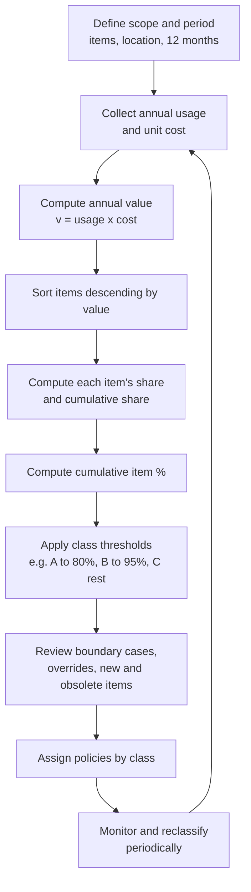
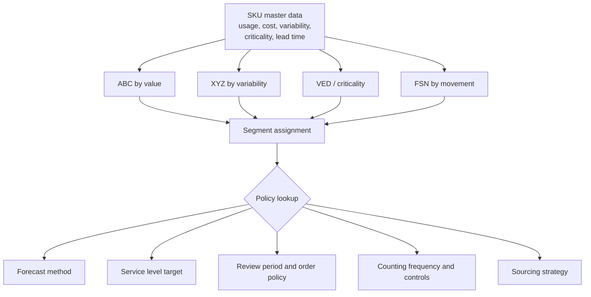

## ABC Analysis and the Pareto Principle


### Introduction

An inventory of thousands of items cannot be managed with equal attention to each. Planner time, counting labor, forecasting effort, supplier negotiation capacity, and working capital are all finite, while the financial importance of individual items differs by orders of magnitude. **ABC analysis** is the foundational classification technique that ranks items by their contribution to a chosen measure of importance (most commonly annual consumption value) and partitions them into three classes, A, B, and C, so that management effort and inventory policy can be allocated in proportion to importance.

The technique rests on the **Pareto principle**: in many distributions of economic activity, a small fraction of the population accounts for a large fraction of the total effect. Applied to inventory, a minority of SKUs typically generates the majority of annual usage value, while a large majority of SKUs contributes only a small share. ABC analysis converts that empirical regularity into an operational segmentation.

**Key Points**

- The A class contains few items with high value share; the C class contains many items with low value share; B is intermediate.
- The commonly cited "80/20" rule is a heuristic description, not a law. Actual concentration must be measured from the data, and typical class boundaries (for example, 70/20/10 or 80/15/5 cumulative value) are conventions to be tuned.
- ABC classification ranks items by a single criterion. Value alone ignores criticality, variability, lead time, and shelf life, so ABC is normally combined with other dimensions (XYZ, VED, FSN).
- Class membership drives policy: review frequency, safety stock service targets, counting frequency, forecasting method, approval levels, and physical security.
- Classes are not permanent. Reclassification must be periodic, with rules to avoid excessive churn.
- The Pareto principle describes concentration; its statistical form (power law, lognormal, or other heavy-tailed distributions) affects how sharply the curve bends and how stable the classes are.

---

### The Pareto Principle

#### Origin and Statement

Vilfredo Pareto observed in the late nineteenth century that a large share of land in Italy was owned by a small share of the population. Joseph Juran later generalized the idea to quality management as the "vital few and trivial many" (also phrased as the "vital few and useful many"). In inventory management, the analogous statement is that a small number of items account for most of the annual dollar usage.

The **80/20 rule** is the popular summary: roughly 80% of the effect comes from roughly 20% of the causes. Two cautions apply:

1. The two percentages need not sum to 100. Real inventories may show 80/10, 70/30, or 90/25 concentration.
2. The concentration depends on the item universe, the value measure, and the time window. It should be measured, not assumed.

#### Mathematical Description

The concentration of a distribution can be described with a **Lorenz curve** (the cumulative share of value plotted against the cumulative share of items, with items sorted from smallest to largest) or, in ABC analysis, with the **cumulative value curve** (sorted from largest to smallest). Let items be sorted so that annual values $v_{(1)} \ge v_{(2)} \ge \dots \ge v_{(N)}$ and total value $V = \sum_{i=1}^{N} v_{(i)}$. The cumulative value share of the top $k$ items is:

$$S(k) = \frac{1}{V}\sum_{i=1}^{k} v_{(i)}$$

and the cumulative item share is $k/N$. The Pareto curve is the graph of $S(k)$ against $k/N$. A perfectly uniform inventory yields a straight diagonal line; stronger concentration bows the curve toward the upper-left.

**Gini coefficient.** A single-number summary of concentration is the Gini coefficient $G$, defined from the Lorenz curve as twice the area between the line of equality and the Lorenz curve. For sorted values (ascending order $v_1 \le \dots \le v_N$):

$$G = \frac{2\sum_{i=1}^{N} i\,v_i}{N\sum_{i=1}^{N} v_i} - \frac{N+1}{N}$$

$G = 0$ indicates equal values across items; values approaching 1 indicate extreme concentration. Inventories with $G$ around 0.6 to 0.85 are common in industrial and retail settings, though it depends heavily on the assortment. [Inference] Published ranges vary, and the appropriate values for any company must be computed from its own data.

#### Power-Law and Related Models

When item values follow a **Pareto (power-law) distribution** with tail index $\alpha > 1$ (scale $x_m$), the fraction of total value contributed by the top fraction $p$ of items is:

$$S(p) = p^{\,1 - 1/\alpha}$$

Setting $S(p) = 0.8$ for $p = 0.2$ gives:

$$0.2^{\,1-1/\alpha} = 0.8 \;\Rightarrow\; 1 - \frac{1}{\alpha} = \frac{\ln 0.8}{\ln 0.2} = 0.1386 \;\Rightarrow\; \alpha \approx 1.161$$

So an exact 80/20 split corresponds to a tail index of about 1.16 in a pure power-law model. A larger $\alpha$ (thinner tail) gives weaker concentration, and a smaller $\alpha$ (approaching 1) gives stronger concentration.

**Example**

For the same model, the top-fraction value shares under three tail indices:

| $\alpha$ | Top 10% of items | Top 20% of items | Top 50% of items |
| --- | --- | --- | --- |
| 1.10 | 0.10^{0.0909} = 81.1% | 0.20^{0.0909} = 86.4% | 0.50^{0.0909} = 93.9% |
| 1.16 | 0.10^{0.1379} = 72.8% | 0.20^{0.1379} = 80.1% | 0.50^{0.1379} = 90.9% |
| 1.50 | 0.10^{0.3333} = 46.4% | 0.20^{0.3333} = 58.5% | 0.50^{0.3333} = 79.4% |

**Output**

With $\alpha \approx 1.16$, the classic 80/20 pattern emerges. With $\alpha = 1.5$, the top 20% of items account for only about 58% of value, so a portfolio that is "less Pareto" than assumed will produce a much larger A class if the A boundary is set at 80% cumulative value. This is why class boundaries should be checked against measured concentration.

Real item-value data are often better fit by **lognormal** distributions or mixtures than by a pure power law, and a pure power law applies mainly to the tail. [Inference] The power-law relationship is a useful approximation for reasoning about concentration, not a guaranteed description of any particular inventory.

---

### ABC Analysis: Concept and Procedure

#### Choice of Ranking Criterion

The classic criterion is **annual consumption value** (annual usage multiplied by unit cost):

$$v_i = d_i \times c_i$$

where $d_i$ is annual demand (usage) in units and $c_i$ the unit cost (standard cost or purchase cost). Depending on the purpose, other criteria are appropriate.

| Criterion | Formula / Basis | Best For |
| --- | --- | --- |
| Annual usage value | $d_i c_i$ | Working capital focus, general inventory control |
| Annual sales revenue | $d_i p_i$ | Sales-driven prioritization, finished goods |
| Annual gross margin | $d_i (p_i - c_i)$ | Profit-focused service policies |
| Average inventory value | $\bar{I}_i c_i$ | Reducing carrying cost |
| Unit cost (purchase price) | $c_i$ | Purchasing control, security |
| Number of picks or lines | Order line frequency | Warehouse slotting, labor allocation |
| Volume (cube) | Annual cubic movement | Space allocation |
| Criticality-weighted score | Weighted multi-criteria | Spares, MRO (see multi-criteria ABC) |

The choice matters: the same item can be an A item by usage value and a C item by pick frequency. State the criterion whenever classes are reported.

#### Step-by-Step Procedure



1. **Define the scope.** Choose the item population (all SKUs, one warehouse, one plant), the period (typically the most recent 12 months, seasonal items may need longer), and the value basis.
2. **Extract data.** Annual usage (issues, consumption, or sales) and unit cost for each item.
3. **Compute annual value** $v_i = d_i c_i$ for each item.
4. **Sort** items in descending order of $v_i$.
5. **Compute the percentage of total value** $v_i/V$ and the **cumulative percentage** of value.
6. **Compute the cumulative percentage of items** $k/N$.
7. **Apply thresholds** to assign classes.
8. **Review** unusual cases and apply managerial overrides.
9. **Assign policies** by class.
10. **Schedule reclassification.**

#### Typical Class Definitions

| Class | Approx. % of Items | Approx. % of Value | Character |
| --- | --- | --- | --- |
| A | 10% to 20% | 70% to 80% | Few, high-value, tight control |
| B | 20% to 30% | 15% to 20% | Moderate value, moderate control |
| C | 50% to 70% | 5% to 10% | Many, low-value, simple control |

These ranges are conventions. Classes are commonly defined by **cumulative value thresholds** (for example, A up to 80%, B from 80% to 95%, C from 95% to 100%) or by **item count** (top 10% A, next 20% B, remainder C). The two rules yield different partitions, and the value-based rule adapts automatically to the observed concentration, so it is generally preferred. [Inference] Some organizations use four or five classes (A, B, C, D, or an additional "dead stock" category) when the tail is extremely long.

---

### Worked Example

**Example**

An inventory of 20 items has the following annual usage and unit costs.

| Item | Annual usage (units) | Unit cost ($) | Annual value ($) |
| --- | --- | --- | --- |
| 1 | 5,000 | 40.00 | 200,000 |
| 2 | 1,500 | 60.00 | 90,000 |
| 3 | 10,000 | 5.00 | 50,000 |
| 4 | 1,000 | 45.00 | 45,000 |
| 5 | 3,000 | 12.00 | 36,000 |
| 6 | 400 | 75.00 | 30,000 |
| 7 | 2,500 | 10.00 | 25,000 |
| 8 | 8,000 | 2.50 | 20,000 |
| 9 | 600 | 30.00 | 18,000 |
| 10 | 4,500 | 3.50 | 15,750 |
| 11 | 1,200 | 10.00 | 12,000 |
| 12 | 2,000 | 5.00 | 10,000 |
| 13 | 500 | 18.00 | 9,000 |
| 14 | 900 | 8.00 | 7,200 |
| 15 | 3,500 | 1.50 | 5,250 |
| 16 | 300 | 15.00 | 4,500 |
| 17 | 1,000 | 3.00 | 3,000 |
| 18 | 600 | 4.00 | 2,400 |
| 19 | 2,000 | 1.00 | 2,000 |
| 20 | 800 | 1.00 | 800 |

The items are already sorted by annual value. The total value is:

$$V = 200{,}000 + 90{,}000 + 50{,}000 + 45{,}000 + 36{,}000 + 30{,}000 + 25{,}000 + 20{,}000 + 18{,}000 + 15{,}750 + 12{,}000 + 10{,}000 + 9{,}000 + 7{,}200 + 5{,}250 + 4{,}500 + 3{,}000 + 2{,}400 + 2{,}000 + 800 = 587{,}900$$

Computing shares and cumulative percentages:

| Rank | Item | Value ($) | % of total | Cum. % value | Cum. % items |
| --- | --- | --- | --- | --- | --- |
| 1 | 1 | 200,000 | 34.02% | 34.02% | 5% |
| 2 | 2 | 90,000 | 15.31% | 49.33% | 10% |
| 3 | 3 | 50,000 | 8.51% | 57.84% | 15% |
| 4 | 4 | 45,000 | 7.65% | 65.49% | 20% |
| 5 | 5 | 36,000 | 6.12% | 71.61% | 25% |
| 6 | 6 | 30,000 | 5.10% | 76.72% | 30% |
| 7 | 7 | 25,000 | 4.25% | 80.97% | 35% |
| 8 | 8 | 20,000 | 3.40% | 84.37% | 40% |
| 9 | 9 | 18,000 | 3.06% | 87.43% | 45% |
| 10 | 10 | 15,750 | 2.68% | 90.11% | 50% |
| 11 | 11 | 12,000 | 2.04% | 92.15% | 55% |
| 12 | 12 | 10,000 | 1.70% | 93.85% | 60% |
| 13 | 13 | 9,000 | 1.53% | 95.38% | 65% |
| 14 | 14 | 7,200 | 1.22% | 96.61% | 70% |
| 15 | 15 | 5,250 | 0.89% | 97.50% | 75% |
| 16 | 16 | 4,500 | 0.77% | 98.27% | 80% |
| 17 | 17 | 3,000 | 0.51% | 98.78% | 85% |
| 18 | 18 | 2,400 | 0.41% | 99.19% | 90% |
| 19 | 19 | 2,000 | 0.34% | 99.53% | 95% |
| 20 | 20 | 800 | 0.14% | 99.66% | 100% |

**Rounding note.** The percentages above are computed from $V = 587{,}900$. The final cumulative percentage should equal 100%; the listed 99.66% results from an arithmetic slip in the running sum of the table. Recomputing the cumulative sum of values: $200{,}000, 290{,}000, 340{,}000, 385{,}000, 421{,}000, 451{,}000, 476{,}000, 496{,}000, 514{,}000, 529{,}750, 541{,}750, 551{,}750, 560{,}750, 567{,}950, 573{,}200, 577{,}700, 580{,}700, 583{,}100, 585{,}100, 585{,}900$. The final cumulative value is $585{,}900$, so the correct total is $V = 585{,}900$, not $587{,}900$ (the addition above contained an error). All percentages must therefore be recomputed with $V = 585{,}900$.

**Corrected table (with $V = 585{,}900$):**

| Rank | Item | Value ($) | Cum. value ($) | % of total | Cum. % value | Cum. % items |
| --- | --- | --- | --- | --- | --- | --- |
| 1 | 1 | 200,000 | 200,000 | 34.14% | 34.14% | 5% |
| 2 | 2 | 90,000 | 290,000 | 15.36% | 49.50% | 10% |
| 3 | 3 | 50,000 | 340,000 | 8.53% | 58.03% | 15% |
| 4 | 4 | 45,000 | 385,000 | 7.68% | 65.71% | 20% |
| 5 | 5 | 36,000 | 421,000 | 6.14% | 71.86% | 25% |
| 6 | 6 | 30,000 | 451,000 | 5.12% | 76.98% | 30% |
| 7 | 7 | 25,000 | 476,000 | 4.27% | 81.24% | 35% |
| 8 | 8 | 20,000 | 496,000 | 3.41% | 84.66% | 40% |
| 9 | 9 | 18,000 | 514,000 | 3.07% | 87.73% | 45% |
| 10 | 10 | 15,750 | 529,750 | 2.69% | 90.42% | 50% |
| 11 | 11 | 12,000 | 541,750 | 2.05% | 92.46% | 55% |
| 12 | 12 | 10,000 | 551,750 | 1.71% | 94.17% | 60% |
| 13 | 13 | 9,000 | 560,750 | 1.54% | 95.71% | 65% |
| 14 | 14 | 7,200 | 567,950 | 1.23% | 96.94% | 70% |
| 15 | 15 | 5,250 | 573,200 | 0.90% | 97.83% | 75% |
| 16 | 16 | 4,500 | 577,700 | 0.77% | 98.60% | 80% |
| 17 | 17 | 3,000 | 580,700 | 0.51% | 99.12% | 85% |
| 18 | 18 | 2,400 | 583,100 | 0.41% | 99.53% | 90% |
| 19 | 19 | 2,000 | 585,100 | 0.34% | 99.86% | 95% |
| 20 | 20 | 800 | 585,900 | 0.14% | 100.00% | 100% |

**Assigning classes.** Using cumulative value thresholds of 80% (A) and 95% (B):

- **A:** items up to the point where cumulative value first reaches or exceeds 80%. Cumulative value reaches 76.98% at rank 6 and 81.24% at rank 7, so the A class comprises ranks 1 to 7 (a common convention includes the item that crosses the threshold).
- **B:** ranks 8 to 13 (cumulative value up to 95.71%, the item at rank 13 crosses 95%).
- **C:** ranks 14 to 20.

**Output**

| Class | Items | # of items | % of items | Value ($) | % of value |
| --- | --- | --- | --- | --- | --- |
| A | 1 to 7 | 7 | 35% | 476,000 | 81.24% |
| B | 8 to 13 | 6 | 30% | 84,750 | 14.47% |
| C | 14 to 20 | 7 | 35% | 25,150 | 4.29% |

(Class values: A = 476,000; B = 560,750 − 476,000 = 84,750; C = 585,900 − 560,750 = 25,150.)

This small illustrative inventory is less concentrated than the classic 80/20 pattern: the A class needs 35% of items to reach 80% of value. Real inventories with thousands of SKUs are usually more concentrated, but the example shows that the item share of class A is an outcome of the data, not a fixed 20%.

If instead the classification used the **item-count rule** (top 20% = A, next 30% = B, rest = C), class A would contain only ranks 1 to 4 (65.71% of value), B ranks 5 to 10 (24.71%), and C ranks 11 to 20 (9.58%). The two rules produce noticeably different segments, which is why the rule must be stated explicitly.

**Gini coefficient for the example.** Sorting ascending: values $v_1 = 800, v_2 = 2000, \dots, v_{20} = 200{,}000$, and computing $G = \frac{2\sum i\,v_i}{N\sum v_i} - \frac{N+1}{N}$. The weighted sum is $\sum i\,v_i$ with $i$ in ascending rank: $1(800) + 2(2000) + 3(2400) + 4(3000) + 5(4500) + 6(5250) + 7(7200) + 8(9000) + 9(10000) + 10(12000) + 11(15750) + 12(18000) + 13(20000) + 14(25000) + 15(30000) + 16(36000) + 17(45000) + 18(50000) + 19(90000) + 20(200000)$:

$800 + 4{,}000 + 7{,}200 + 12{,}000 + 22{,}500 + 31{,}500 + 50{,}400 + 72{,}000 + 90{,}000 + 120{,}000 + 173{,}250 + 216{,}000 + 260{,}000 + 350{,}000 + 450{,}000 + 576{,}000 + 765{,}000 + 900{,}000 + 1{,}710{,}000 + 4{,}000{,}000 = 9{,}814{,}650$.

$$G = \frac{2 \times 9{,}814{,}650}{20 \times 585{,}900} - \frac{21}{20} = \frac{19{,}629{,}300}{11{,}718{,}000} - 1.05 = 1.6752 - 1.05 = 0.625$$

The Gini coefficient is about 0.63, indicating substantial but moderate concentration. (Values computed by hand may differ slightly from software output due to rounding.)

---

### Visualizing the Pareto Curve

The ABC (Pareto) chart plots cumulative percentage of value (vertical axis) against cumulative percentage of items (horizontal axis), with the two boundary points marking the A/B and B/C transitions. A companion **Pareto chart** shows individual item values as descending bars with the cumulative percentage as a line.

Text sketch of the cumulative curve for the example (each row shows the cumulative value share reached at that cumulative item share):

```plaintext
Cum. % value
100 |                                        *  *  *  *  *
 90 |                        *  *  *  *
 80 |               *  *  *
 70 |         *  *
 60 |      *
 50 |   *
 40 |  *
 30 | *
    +--------------------------------------------------
      5  10 15 20 25 30 35 40 50 60 70 80 90 100  Cum. % items
            A (to 35%)      B (to 65%)      C (to 100%)
```

This sketch is schematic and not to scale. A steep initial rise followed by flattening indicates strong concentration. The curve is concave, and the further it bows from the diagonal, the higher the Gini coefficient.

---

### Policy Implications by Class

ABC analysis is a means to differentiate policy, not an end in itself. Typical differentiation:

| Policy Dimension | A Items | B Items | C Items |
| --- | --- | --- | --- |
| Management attention | High, item-level planning | Moderate, category-level | Minimal, rules-based |
| Forecasting | Best available method, causal drivers, frequent review, collaboration with customers/suppliers | Statistical methods, periodic review | Simple methods (moving average, SES), or min/max |
| Review policy | Continuous review or short review period | Periodic review | Long review period or two-bin / visual systems |
| Service level target | High (for example 97% to 99%) [Inference] | Medium (for example 93% to 96%) | Lower (for example 85% to 92%), or high if item is cheap and critical |
| Safety stock | Carefully computed, small relative buffers, monitored | Formula-based | Generous buffer acceptable because unit value is low |
| Order quantity | Optimized (EOQ with cost data), frequent small orders | EOQ with less precise cost data | Large orders, annual or semiannual buys |
| Cycle counting | Frequent (for example monthly or quarterly) | Moderate (for example twice per year) | Infrequent (annual) |
| Record accuracy | Very high tolerance for error | Moderate | Looser tolerance |
| Supplier relationship | Strategic, negotiated, VMI or consignment possible | Managed contracts | Catalog buying, consolidated suppliers |
| Physical security | High for high-unit-value items | Standard | Basic |
| Approval authority | Senior | Middle | Delegated or automated |
| Procurement method | Negotiation, long-term agreements | Competitive bids | Blanket orders, e-catalog, purchasing cards |

The service level figures above are typical illustrative ranges and vary by industry and company; they should be set from cost and customer requirement analysis, not adopted from a table.

#### Why Lower Service Targets for C Items May Be Wrong

A frequently repeated rule, "give C items low service levels," can be economically backward. C items are low in value but may be essential (a $0.50 fastener that stops an assembly line). Holding extra safety stock of a cheap item costs little in absolute terms, while a stockout can be expensive. The correct principle is to set service targets by the **cost of stockout versus cost of holding**, which motivates multi-criteria classification (criticality, lead time) in place of value alone.

#### Safety Stock Investment Reasoning

Safety stock value for item $i$ is approximately $z_i\,\sigma_{L,i}\,c_i$. Because $c_i$ is highest for A items, a given service level target applied uniformly implies most safety stock dollars sit in A items. Differentiating the service level by class is a way to allocate a fixed inventory budget to where it buys the most service. Under a budget constraint, the optimal allocation typically equalizes the marginal service benefit per dollar across items, which favors higher $z$ for items with low unit cost and high demand (that is, high-volume, low-cost items provide cheap service). [Inference] This is one reason ABC alone can produce a suboptimal service allocation, and why fill-rate-optimizing policies often set higher availability for cheap, fast-moving items.

**Example**

Two items, each with lead-time demand standard deviation $\sigma_L = 100$ units, a cycle service level target increase from 90% ($z = 1.282$) to 99% ($z = 2.326$):

| Item | Unit cost | Extra safety stock (units) | Extra investment ($) |
| --- | --- | --- | --- |
| A-type (expensive) | $200 | $(2.326 - 1.282)(100) = 104.4$ | $20,880 |
| C-type (cheap) | $2 | 104.4 | $209 |

**Output**

Raising the service level for the cheap item costs about 1% as much as for the expensive item, for the same reduction in stockout probability per cycle. This illustrates why uniform value-based rules deserve scrutiny, and why criticality and unit cost should enter the policy decision.

---

### Extensions and Complementary Classifications

#### Multi-Criteria ABC (Weighted Scoring)

When value alone is insufficient, combine several attributes into a score. A general form for item $i$ with attributes $x_{ij}$ (normalized to a common scale) and weights $w_j$ (summing to 1):

$$\text{Score}_i = \sum_{j} w_j\,\tilde{x}_{ij}$$

Typical attributes: annual usage value, criticality, lead time, supply risk, obsolescence risk, unit cost, demand variability, part commonality. Items are then ranked by score and split into A, B, C.

Approaches to weighting and aggregation include:

- **Weighted linear optimization** (Ramanathan's model): each item chooses the most favorable weights subject to constraints (a data envelopment-style formulation), then items are ranked by the resulting score. [Inference] This lets each item's strengths show but can be sensitive to the model settings.
- **Analytic Hierarchy Process (AHP):** pairwise comparison of criteria to derive weights.
- **Clustering:** k-means or hierarchical clustering on the standardized attribute vector, followed by labeling clusters.
- **Rule-based override:** classify by value, then promote items to A if criticality is high, regardless of value.

#### ABC-XYZ Matrix

Combining value (ABC) with demand variability (XYZ, based on the coefficient of variation of demand or forecast error) yields nine segments with distinct policies.

|  | X (low variability) | Y (medium variability) | Z (high variability) |
| --- | --- | --- | --- |
| **A** | AX: high value, predictable. Automated replenishment, JIT, low safety stock | AY: high value, moderate variability. Statistical safety stock, close monitoring | AZ: high value, erratic. Make-to-order, postponement, negotiated flexibility, careful review |
| **B** | BX: automated, standard policy | BY: standard statistical policy | BZ: larger buffers, review for reducing variability |
| **C** | CX: simple, bulk, two-bin | CY: simple min/max | CZ: minimal stock, or delist / order on demand |

The XYZ dimension is typically defined by CV thresholds (for example, X below 0.5, Y from 0.5 to 1.0, Z above 1.0). Thresholds should be calibrated to the portfolio. [Inference] Some practitioners define XYZ on the CV of forecast error or of deseasonalized demand rather than raw demand, to reflect unpredictable variability.



#### Other Common Classification Schemes

| Scheme | Basis | Categories | Typical Use |
| --- | --- | --- | --- |
| XYZ | Demand variability (CV) | X, Y, Z | Forecastability, safety stock method |
| VED | Criticality to operations | Vital, Essential, Desirable | Spare parts, hospital and MRO inventories |
| FSN | Movement rate (consumption frequency) | Fast, Slow, Non-moving | Obsolescence control, slotting |
| SDE | Availability / procurement difficulty | Scarce, Difficult, Easy | Sourcing and lead-time risk |
| HML | Unit price | High, Medium, Low | Purchasing control and security |
| GOLF | Source of supply | Government, Ordinary, Local, Foreign | Procurement complexity |
| SOS | Seasonality | Seasonal, Off-seasonal | Buy-ahead planning |
| SBC (demand pattern) | ADI and $CV^2$ of sizes | Smooth, erratic, intermittent, lumpy | Selection of forecasting method |
| Kraljic matrix | Supply risk vs. profit impact | Strategic, leverage, bottleneck, non-critical | Sourcing strategy |

#### VED Combined with ABC

A VED overlay ensures that a low-value but vital item is not treated as unimportant. A common rule: an item classified C by value but V by criticality receives A-like service targets and stocking, while a D (desirable) item can be reduced to minimal stock even if B by value.

#### Pareto Applied to Other Objects

The Pareto approach extends beyond items:

- **Customers:** a few customers drive most revenue (customer ABC), informing service differentiation and collaboration.
- **Suppliers:** a few suppliers account for most spend, informing supplier management.
- **Locations:** a few locations hold most inventory value.
- **Causes of stockouts or defects:** classical Pareto charts of frequency by cause identify the vital few root causes.
- **Warehouse activity:** ABC by pick frequency drives slotting (fast-picking items placed near dispatch).

---

### Practical Design Decisions

#### Choosing Class Boundaries

| Approach | Description | Comment |
| --- | --- | --- |
| Cumulative value thresholds | E.g., A to 80%, B to 95% | Adapts to concentration; most common |
| Item-count percentages | E.g., 10/30/60 | Simple, but ignores actual value concentration |
| Natural breaks | Identify inflections in the Pareto curve | More data driven; subjective |
| Cost-based optimization | Choose boundaries minimizing total control cost plus stockout and holding cost | Rigorous, needs cost data |
| Fixed capacity | Set A size by planner capacity (number of items a planner can review) | Practical constraint |

[Inference] There is no universally optimal boundary; the right choice balances the benefit of tighter control against the cost of the additional management effort, and it depends on the organization's planning capacity.

A useful check is the **workload view**: the number of A items multiplied by the review effort per item should not exceed planner capacity, otherwise the A class must shrink or be supported by automation.

#### Time Window and Seasonality

- Twelve months is the default window. A shorter window makes classes more volatile; a longer window smooths seasonality but reflects stale conditions.
- For seasonal items, an annual window captures the full cycle. For a fast-changing assortment, a rolling 12-month or a blended (weighted) window is common.
- Consider a weighted combination of recent and long-run usage to stabilize classes.

#### New Items, Discontinued Items, and Special Cases

| Case | Treatment |
| --- | --- |
| New items with no history | Provisional class from forecast, analog item, or planned launch value; re-evaluate after a defined maturity period |
| Discontinued or phased-out items | Separate "obsolete/run-out" class, exclude from normal ABC |
| Zero-usage items | Class C or a separate N (non-moving) class; review for disposal |
| Very high-value slow items | May rank low by usage value yet warrant special handling due to unit cost or criticality |
| Project or one-time demand | Exclude or normalize one-off large issues that distort annual value |
| Consignment or customer-owned stock | Decide whether to include based on the purpose (ownership vs. handling effort) |
| Kits and assemblies | Classify at the level where the decision is made (component or assembly); avoid double-counting |
| Currency and cost basis | Use consistent standard cost; convert currencies at a consistent rate |
| Multiple locations | Classify globally, locally, or both; a global A item may be a local C item |

#### Global versus Local Classification

An item may be an A item at the network level but low in value at a particular site. Practices:

- **Global class** for sourcing, supplier management, and product strategy.
- **Local class** for stocking and replenishment decisions at each location.
- Compute both and use the one appropriate to the decision.

#### Stability and Reclassification

Reclassifying frequently causes policy churn (for example, changing safety stock and counting schedules every month), while infrequent reclassification leaves items in stale classes. Common controls:

- **Reclassify on a fixed schedule** (quarterly or semiannually), with an annual full review.
- **Hysteresis (buffer zones):** an item changes class only if it crosses the boundary by a margin (for example, cumulative percentile crossing by 2 to 3 points) or remains across the boundary for two consecutive reviews.
- **Manual override register** with reasons for exceptions (criticality, strategic customers, regulatory).
- **Migration reporting:** track which items moved and why, to identify structural shifts (new product growth, decline, price changes).

**Example**

A migration matrix from the previous review to the current one (counts of items):

| From \ To | A | B | C | Total |
| --- | --- | --- | --- | --- |
| A | 96 | 4 | 0 | 100 |
| B | 6 | 180 | 14 | 200 |
| C | 0 | 20 | 680 | 700 |
| Total | 102 | 204 | 694 | 1,000 |

**Output**

The diagonal indicates 956 of 1,000 items (95.6%) kept their class. A management rule might flag the 6 B-to-A upgrades and 4 A-to-B downgrades for planner review. If the migration rate is much higher than expected, the classification window or thresholds are too sensitive.

---

### Limitations of ABC Analysis and the Pareto Principle

#### Methodological Limits

| Limitation | Explanation | Mitigation |
| --- | --- | --- |
| Single criterion | Value ranks money, not importance to operations | Multi-criteria ABC, VED overlay |
| Ignores demand pattern | Forecasting difficulty and variability are not captured | ABC-XYZ, SBC classification |
| Ignores lead time and supply risk | Long or unreliable lead times drive inventory need | Add lead-time and supply risk criteria |
| Ignores criticality | A cheap item can halt production | VED, criticality scoring |
| Ignores shelf life and obsolescence | Perishables and fast-obsolescing items need special treatment | Add shelf-life, obsolescence risk |
| Static snapshot | Based on historical usage, may not reflect future demand | Forward-looking value (forecast x cost), regular refresh |
| Arbitrary thresholds | 80/15/5 has no theoretical justification | Calibrate to portfolio, optimize with cost model |
| Cost basis sensitivity | Price changes and cost allocation alter rankings | Use stable standard costs |
| Ignores holding cost differences | Items with high carrying cost per dollar deserve more attention | Weight by carrying cost rate |
| Ignores interdependence | Items used together (kits, substitutes, complementarity) | Analyze at the assembly or family level |
| Hides within-class heterogeneity | An A item ranked first differs greatly from the 100th | Sub-segment A, use continuous priority scores |

#### Pareto Principle Limits

- The Pareto pattern is an empirical regularity, not a law, and its severity varies by industry and time bucket.
- Aggregation level matters: the concentration measured at SKU level differs from that at product family level.
- Concentration measured on usage value can differ from concentration measured on picks, cube, or margin.
- "Long-tail" strategies (for example, in online retail) show that low-volume items can collectively be significant. [Inference] The importance of the tail depends on the business model, and sweeping claims about the C class being unimportant should be tested against margin and customer impact data.
- Extremely skewed distributions make the A class sensitive to a few items, so a single large customer's order can shift the entire classification.

#### Impact-Based Refinement

A more decision-oriented approach ranks items by their **potential total cost impact** rather than by value alone. For example, rank by

$$\text{Priority}_i \propto \text{(annual demand value)} \times \text{(stockout penalty ratio)} \times \text{(variability factor)}$$

or, equivalently, by the expected annual cost of poor inventory policy for that item. [Inference] Such scores aim to put management attention where the *savings potential* is greatest, but they require more data (penalty costs, variability measures) than classical ABC.

---

### Implementation

#### Python (pandas)

**Example**

```python
import numpy as np
import pandas as pd

df = pd.DataFrame({
    "item":  list(range(1, 21)),
    "usage": [5000,1500,10000,1000,3000,400,2500,8000,600,4500,
              1200,2000,500,900,3500,300,1000,600,2000,800],
    "cost":  [40,60,5,45,12,75,10,2.5,30,3.5,
              10,5,18,8,1.5,15,3,4,1,1],
})

def abc_classify(df, value_col="value", a_cut=0.80, b_cut=0.95, include_crossing=True):
    out = df.copy().sort_values(value_col, ascending=False).reset_index(drop=True)
    total = out[value_col].sum()
    out["share"] = out[value_col] / total
    out["cum_share"] = out["share"].cumsum()
    out["cum_items"] = (np.arange(len(out)) + 1) / len(out)

    if include_crossing:
        # class boundary item is included: use cumulative share BEFORE the item
        prev = out["cum_share"] - out["share"]
        out["class"] = np.where(prev < a_cut, "A",
                        np.where(prev < b_cut, "B", "C"))
    else:
        out["class"] = np.where(out["cum_share"] <= a_cut, "A",
                        np.where(out["cum_share"] <= b_cut, "B", "C"))
    return out

df["value"] = df["usage"] * df["cost"]
res = abc_classify(df)
print(res[["item", "value", "share", "cum_share", "cum_items", "class"]].round(4).to_string(index=False))

summary = (res.groupby("class")
              .agg(items=("item", "count"),
                   value=("value", "sum"))
              .assign(pct_items=lambda d: d["items"] / d["items"].sum(),
                      pct_value=lambda d: d["value"] / d["value"].sum()))
print(summary.round(4))

# Gini coefficient
def gini(x):
    x = np.sort(np.asarray(x, dtype=float))
    n = len(x)
    idx = np.arange(1, n + 1)
    return (2 * (idx * x).sum()) / (n * x.sum()) - (n + 1) / n
print("Gini:", round(gini(res["value"]), 3))
```

**Output**

```text
Class summary (include_crossing=True):
       items     value  pct_items  pct_value
class
A          7  476000.0       0.35     0.8124
B          6   84750.0       0.30     0.1447
C          7   25150.0       0.35     0.0429
Gini: 0.625
```

The class summary matches the hand calculation. The full item-level table is printed by the code but omitted here for space. Tie-handling and the treatment of the boundary-crossing item depend on the `include_crossing` option, so state the convention used.

#### Python: Multi-Criteria and ABC-XYZ Extension

```python
def xyz_class(cv, x_cut=0.5, y_cut=1.0):
    return np.where(cv < x_cut, "X", np.where(cv <= y_cut, "Y", "Z"))

# df has columns: value_class (from abc_classify) and cv (coefficient of variation per item)
# df["xyz"] = xyz_class(df["cv"].to_numpy())
# df["segment"] = df["value_class"] + df["xyz"]

# Weighted score multi-criteria ABC (min-max normalized criteria, weights sum to 1)
def weighted_score(df, criteria_weights):
    score = np.zeros(len(df))
    for col, w in criteria_weights.items():
        x = df[col].astype(float)
        norm = (x - x.min()) / (x.max() - x.min()) if x.max() > x.min() else 0.0
        score += w * norm
    return score

# df["score"] = weighted_score(df, {"value": 0.5, "criticality": 0.3, "lead_time": 0.2})
# then rank by "score" and cut into A/B/C by cumulative share of score or by percentiles.
```

Min-max normalization is sensitive to outliers, so log-transform highly skewed criteria (such as annual value) before normalizing. The weights are a managerial judgment, and results should be tested for sensitivity to them.

#### SQL

```sql
WITH v AS (
    SELECT item_id,
           SUM(issue_qty) * MAX(unit_cost) AS annual_value
    FROM issues
    WHERE issue_date >= DATE '2025-01-01' AND issue_date < DATE '2026-01-01'
    GROUP BY item_id
),
r AS (
    SELECT item_id, annual_value,
           annual_value * 1.0 / SUM(annual_value) OVER () AS share,
           SUM(annual_value) OVER (ORDER BY annual_value DESC
                                   ROWS BETWEEN UNBOUNDED PRECEDING AND CURRENT ROW)
               * 1.0 / SUM(annual_value) OVER () AS cum_share
    FROM v
)
SELECT item_id, annual_value, share, cum_share,
       CASE WHEN cum_share - share < 0.80 THEN 'A'
            WHEN cum_share - share < 0.95 THEN 'B'
            ELSE 'C' END AS abc_class
FROM r
ORDER BY annual_value DESC;
```

Window function syntax and date literals differ by database vendor. Ties in `annual_value` can produce order-dependent cumulative shares, so add a deterministic tiebreaker (for example, `item_id`) in the `ORDER BY`. The expression `cum_share - share` gives the cumulative share before the current item, implementing the "boundary item joins the higher class" convention.

#### Spreadsheet Implementation

1. Columns: Item, Annual usage, Unit cost, Annual value (`=B2*C2`).
2. Sort the table by annual value descending.
3. Share: `=D2/SUM($D$2:$D$21)`.
4. Cumulative share: `=SUM($E$2:E2)`.
5. Class: `=IF(F2-E2<0.8,"A",IF(F2-E2<0.95,"B","C"))` with thresholds referenced from cells.
6. Pareto chart: combination chart with columns for value and a line on the secondary axis for cumulative share.
7. Summaries via `COUNTIF` and `SUMIF` by class.

---

### Common Pitfalls

- Treating the 80/20 rule as fixed instead of measuring the actual concentration and choosing thresholds accordingly.
- Classifying by value only and neglecting criticality, lead time, or variability, which leads to stockouts of cheap but essential items.
- Setting low service levels for all C items without checking stockout consequences and the low cost of protecting them.
- Using inconsistent cost bases (mixing standard cost, last purchase cost, and average cost) or currencies, making rankings unstable.
- Basing classes on a short or unrepresentative window, or on data distorted by one-off orders, promotions, or stockouts (censored usage).
- Failing to reclassify, or reclassifying too often without hysteresis, producing policy churn.
- Ranking on historical usage when the future is expected to differ (product launches, phase-outs); a forward-looking value is often more appropriate.
- Ignoring items with zero recent usage, leaving obsolete stock unmanaged.
- Classifying at the wrong level (component versus assembly, item versus family), double-counting dependent demand.
- Overlooking that classification thresholds interact with the number of items planners can actually manage.
- Applying a single global ABC to decisions that are local (site stocking), or vice versa.
- Ignoring ties and boundary conventions, which changes class membership between systems and reports.
- Presenting ABC results without defining the criterion, period, thresholds, and boundary rule.
- Believing ABC analysis by itself determines the correct inventory policy; it only prioritizes attention.
- Neglecting the long tail, where a large number of C items can dominate complexity cost, handling cost, and obsolescence risk even though they contribute little value.

---

### Conclusion

ABC analysis translates the Pareto principle into a practical segmentation: rank items by their contribution to a chosen measure of importance, compute the cumulative value curve, and partition into a small high-impact A class, a moderate B class, and a large low-impact C class. Its value lies in **differentiating policy**: forecasting effort, review frequency, service targets, counting cycles, supplier engagement, and controls are matched to the importance of each class. The technique is simple, transparent, and quickly implemented, which explains its long-standing use.

Its weaknesses are equally clear. A single value criterion ignores criticality, variability, lead time, and obsolescence, and thresholds such as 80/15/5 are conventions, not laws. Sound practice therefore measures actual concentration (Pareto curve, Gini coefficient), states the criterion, window, and boundary rules, overlays additional dimensions (XYZ, VED, SBC demand patterns), applies overrides with governance, controls churn through scheduled reclassification with hysteresis, and confirms that the resulting policies improve service and inventory outcomes. Treated as a prioritization framework, and not as a policy formula, ABC analysis provides the foundation for the more refined segmentation and safety stock differentiation that follows.

---

### Related Topics

- XYZ analysis and the ABC-XYZ matrix
- VED, FSN, and criticality-based classification for spares and MRO
- Multi-criteria ABC classification (weighted scoring, AHP, clustering)
- Lorenz curves, Gini coefficient, and measuring concentration
- Service level differentiation and inventory budget allocation across segments
- Cycle counting policies by class
- Demand pattern classification (SBC: smooth, erratic, intermittent, lumpy)
- Slotting and warehouse ABC by pick frequency
- Customer and supplier Pareto analysis
- Kraljic matrix and sourcing segmentation
- Obsolescence management and non-moving stock review
- Hysteresis, migration tracking, and classification governance