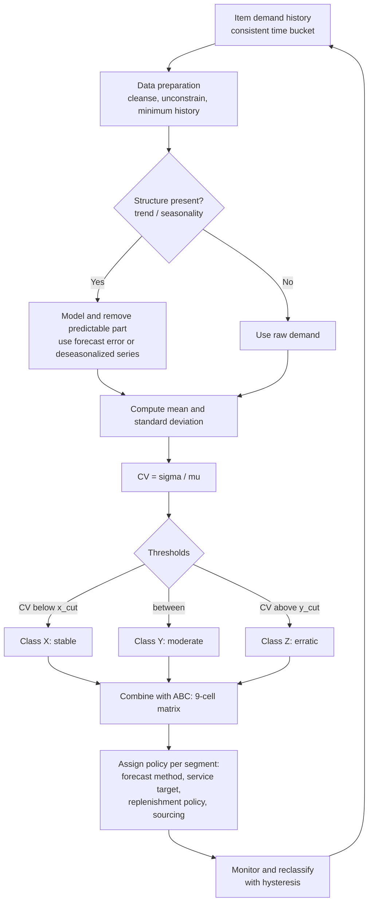
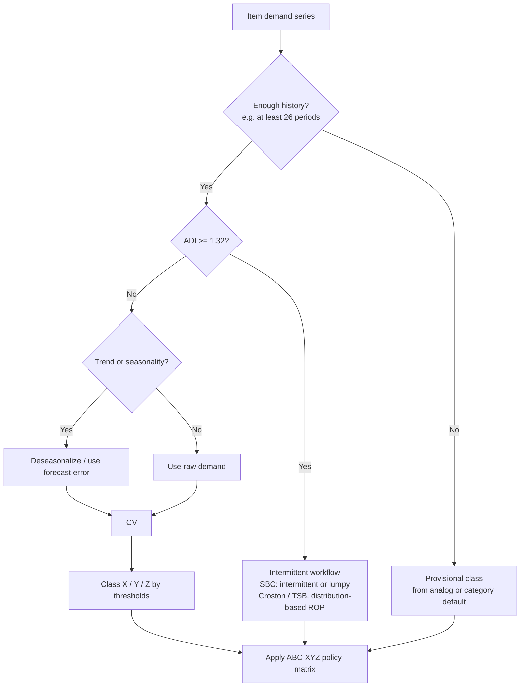
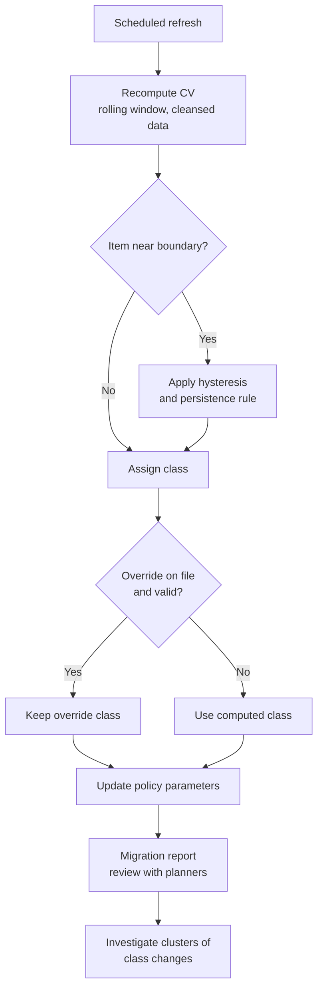

## XYZ Analysis for Demand Variability


### Introduction

ABC analysis ranks items by how much money they represent. It says nothing about how *predictable* their demand is, and predictability is what determines how hard an item is to forecast, how much safety stock it needs, and which replenishment policy suits it. **XYZ analysis** is the classification technique that fills this gap. It segments items by the variability (or, equivalently, the forecastability) of their demand, conventionally using the **coefficient of variation (CV)**, into three classes:

- **X:** stable, regular demand with low variability; easy to forecast.
- **Y:** moderately variable demand, typically with trend, seasonality, or moderate irregularity; forecastable with more effort.
- **Z:** highly variable, irregular, or sporadic demand; difficult to forecast, and expensive to protect with buffer stock.

XYZ analysis is rarely used alone. Combined with ABC (value) it produces the **ABC-XYZ matrix**, a nine-cell segmentation in which each cell implies a distinct combination of forecasting method, replenishment policy, service target, and sourcing strategy. The matrix answers two questions at once: *how much does this item matter?* and *how uncertain is it?*

**Key Points**

- The XYZ dimension is defined on a **variability measure**, usually $CV = \sigma/\mu$ of demand over a stated time bucket and window. Cut-offs (commonly around 0.5 and 1.0) are conventions and must be calibrated to the portfolio.
- The relevant variability for buffering decisions is the variability of **forecast error**, not raw demand. Raw-demand CV mixes predictable structure (trend, seasonality) with unpredictable noise, so it can misclassify a strongly seasonal but well-forecast item as "Z".
- Because CV depends on the time bucket, the classification must be computed at a bucket consistent with the decision (for example, weekly or lead-time-level demand).
- CV is unreliable for intermittent items and for short histories; supplement with ADI and the SBC classification, and with minimum-history rules.
- XYZ classes are **not permanent**. Governance (window, refresh cadence, hysteresis, override register) prevents policy churn.
- The purpose of XYZ analysis is **policy differentiation**, so every class should map to explicit forecasting, safety stock, and replenishment rules.

---

### Conceptual Overview



XYZ analysis sits at the junction of three earlier ideas: demand variability and the CV (variability measurement), forecast error (what safety stock actually buffers), and ABC analysis (value-based prioritization). It converts variability measurements into an actionable segmentation.

---

### Defining Variability for Classification

#### The Coefficient of Variation

For a demand series $D_1, \dots, D_n$ measured in a fixed time bucket:

$$\bar{D} = \frac{1}{n}\sum_{t=1}^{n} D_t, \qquad s = \sqrt{\frac{1}{n-1}\sum_{t=1}^{n}\left(D_t - \bar{D}\right)^2}, \qquad CV = \frac{s}{\bar{D}}$$

The CV is unit-free, so items of any volume can be compared. It is undefined or unstable when $\bar{D}$ is near zero, and it is sensitive to the time bucket, window length, outliers, and non-stationarity.

#### Which Variability Measure to Use

| Measure | Definition | Advantages | Drawbacks |
| --- | --- | --- | --- |
| Raw-demand CV | $s_D/\bar{D}$ | Simple, widely understood | Counts trend and seasonality as "variability"; misclassifies predictable seasonal items |
| Deseasonalized/detrended CV | CV of demand after removing seasonal indices and trend | Isolates irregular variation | Needs a decomposition step and adequate history |
| Forecast-error CV | $s_e/\bar{D}$, where $e_t = D_t - \hat{D}_t$ | Directly reflects what safety stock must buffer; embeds forecast quality | Depends on the forecast method used; needs archived forecasts |
| Relative RMSE / WMAPE | $RMSE/\bar{D}$ or $\sum | e_t | /\sum D_t$ |
| CV of non-zero sizes plus ADI | SBC pair $(ADI, CV_z^2)$ | Separates timing from size for intermittent items | Two dimensions, not one class |
| Robust CV | $1.4826 \cdot MAD_{med} / \text{median}$ | Resistant to outliers | Less standard; can understate genuine spikes |
| Entropy or forecastability measures | E.g., spectral or approximate entropy | Captures predictability beyond scale | Complex; less transparent for planners |

**Recommended practice.** Use the **CV of forecast error, or of the deseasonalized series**, as the XYZ criterion whenever a forecast exists. Use raw-demand CV only where no forecast model is available or where a quick screening classification is sufficient, and label it accordingly.

**Example**

A seasonal item has monthly demand with annual mean 100 units and a raw standard deviation of 37 units ($CV_D = 0.37$). A Holt-Winters model explains the seasonal pattern and leaves forecast errors with a standard deviation of 12 units ($CV_e = 0.12$).

| Criterion | CV | Class (X below 0.25? example cuts: X < 0.25, Y 0.25 to 0.5, Z > 0.5) |
| --- | --- | --- |
| Raw demand | 0.37 | Y |
| Forecast error | 0.12 | X |

**Output**

The raw-demand CV places the item in Y, but the forecast-error CV places it in X because the variability is predictable. Policy decisions based on the raw CV would over-buffer this item. The cut-offs used in this example are illustrative and differ from the more common 0.5 and 1.0 boundaries; the point is the change in class, not the specific thresholds.

#### The Time Bucket Effect

For independent daily demands with coefficient of variation $CV_d$, aggregation over $k$ days gives $CV_k = CV_d/\sqrt{k}$. The same item can be "Z" at the daily level and "X" at the monthly level. Classification should therefore be computed at the bucket that matches the planning decision, typically the replenishment lead time plus review period, or the standard planning bucket (weekly or monthly). Comparing items requires the same bucket for every item.

| Aggregation | $\mu$ | $\sigma$ | CV | Class under X < 0.5, Y ≤ 1.0 |
| --- | --- | --- | --- | --- |
| Daily | 20 | 24 | 1.20 | Z |
| Weekly (7 days) | 140 | 63.5 | 0.454 | X |
| Four weeks (28 days) | 560 | 127.0 | 0.227 | X |

(These values assume independent daily demand with $\mu_d = 20$ and $\sigma_d = 24$: $\sigma_7 = 24\sqrt{7} = 63.5$, $\sigma_{28} = 24\sqrt{28} = 127.0$. Positive autocorrelation makes the reduction weaker, so real data should be aggregated directly.)

---

### Classification Thresholds

#### Common Conventions

| Class | Typical CV Range | Interpretation |
| --- | --- | --- |
| X | Below 0.5 | Stable, regular demand; high forecast accuracy |
| Y | 0.5 to 1.0 | Moderate variability; trend, seasonality, or irregular fluctuation |
| Z | Above 1.0 | Very erratic, sporadic, or lumpy demand |

Some sources use tighter cut-offs (for example, X below 0.25 and Y from 0.25 to 0.5, with Z above 0.5) for weekly or monthly data on fast-moving goods. Others define classes by the share of total demand in the class or by forecast accuracy (for example, X: forecast accuracy above 90%). [Inference] Cut-offs are conventions, not laws of nature, and the appropriate values depend on industry, time bucket, and the amount of noise tolerated by the supply chain.

#### Threshold-Setting Approaches

| Approach | Description | Comment |
| --- | --- | --- |
| Fixed absolute cut-offs | E.g., 0.5 and 1.0 | Simple and comparable over time; may produce lopsided classes |
| Percentile-based | E.g., lowest 50% of CV = X, next 30% = Y, top 20% = Z | Guarantees class sizes; thresholds drift with the portfolio |
| Natural breaks | Locate gaps or inflections in the CV distribution | Data-driven, but subjective |
| Cost-based | Choose cut-offs where the optimal policy changes | Rigorous; needs cost and service data |
| Forecastability-based | Cut-offs on forecast accuracy (for example, WMAPE) | Ties classes to a KPI planners understand |
| Capacity-based | Set Z size to what planners can manage manually | Practical constraint |

A percentile approach may hide the fact that a portfolio is uniformly stable or uniformly erratic, so pair it with the absolute CV values when reporting.

#### Worked Example: Classification of Ten Items

**Example**

Weekly demand statistics over the last 52 weeks (computed from the actual series, deseasonalized where a seasonal profile exists):

| Item | Mean (units/week) | Std. dev. | CV | Class (X < 0.5, Y 0.5 to 1.0, Z > 1.0) |
| --- | --- | --- | --- | --- |
| 1 | 500 | 60 | 0.12 | X |
| 2 | 220 | 70 | 0.32 | X |
| 3 | 90 | 42 | 0.47 | X |
| 4 | 150 | 78 | 0.52 | Y |
| 5 | 60 | 39 | 0.65 | Y |
| 6 | 35 | 30 | 0.86 | Y |
| 7 | 20 | 21 | 1.05 | Z |
| 8 | 12 | 17 | 1.42 | Z |
| 9 | 5 | 9 | 1.80 | Z |
| 10 | 2 | 5 | 2.50 | Z |

**Output**

Classes: X = items 1 to 3 (30%), Y = items 4 to 6 (30%), Z = items 7 to 10 (40%). Items 3 (CV 0.47) and 4 (CV 0.52) sit on either side of the X/Y boundary, and their difference is well within estimation noise; a hysteresis rule (discussed later) would prevent them from flipping between classes on small changes. Note also that low-volume items tend to have high CVs, which correlates the XYZ classification with volume and complicates its interpretation, as discussed in the limitations section.

---

### Relationship Between CV, Forecast Error, and Safety Stock

The XYZ classes matter because CV maps directly into the relative safety stock investment. For a single-stage normally distributed lead-time demand with mean $\mu_L$ and standard deviation $\sigma_L$:

$$SS = z\,\sigma_L = z\,CV_L\,\mu_L$$

Safety stock relative to expected lead-time demand is therefore $z \times CV_L$. For a 95% cycle service level ($z = 1.645$):

| $CV_L$ | Safety stock as % of mean lead-time demand | Typical class |
| --- | --- | --- |
| 0.10 | 16.5% | X |
| 0.25 | 41.1% | X |
| 0.50 | 82.3% | Y (boundary) |
| 1.00 | 164.5% | Y/Z (boundary) |
| 1.50 | 246.8% | Z |

**Output**

A Z item with a lead-time demand CV of 1.5 needs a buffer of about 2.5 times its expected lead-time demand at a 95% target, compared with about 16% for a very stable X item. The XYZ classes therefore correspond to order-of-magnitude differences in the relative cost of protecting service.

The lead-time demand CV combines demand variability and lead time variability:

$$CV_L^2 = \frac{CV^2}{\bar{L}} + CV_{\tilde L}^2$$

where $\bar{L}$ is the mean lead time (in periods) and $CV_{\tilde L}$ is the coefficient of variation of the lead time. A Z classification on demand alone may therefore understate the difficulty of an item with an unreliable supplier, and an X item with a highly variable lead time may need Z-like buffering. This is why lead-time variability is a common additional dimension in extended segmentation.

**Normality caveat.** For CV above roughly 0.5 to 1.0 with demand bounded below by zero, the normal approximation assigns probability to negative demand and typically understates the upper tail. For Z items, safety stock should be derived from a skewed or empirical distribution (gamma, negative binomial, bootstrap), not from $z\,\sigma_L$. [Inference] The size of the error depends on the distribution shape, and it should be checked empirically for the items that matter.

---

### The ABC-XYZ Matrix

#### Structure

Combining the value class (A, B, C) with the variability class (X, Y, Z) yields nine segments:

|  | **X** (stable) | **Y** (moderate) | **Z** (erratic) |
| --- | --- | --- | --- |
| **A** (high value) | **AX**: high value, predictable | **AY**: high value, moderate variability | **AZ**: high value, erratic |
| **B** (medium value) | **BX** | **BY** | **BZ** |
| **C** (low value) | **CX**: low value, predictable | **CY** | **CZ**: low value, erratic |

#### Policy Guidance by Segment

| Segment | Character | Forecasting | Replenishment Policy | Service / Safety Stock | Sourcing and Other Actions |
| --- | --- | --- | --- | --- | --- |
| **AX** | High value, stable | Statistical (SES, Holt-Winters), high accuracy, minimal manual intervention | Continuous or short-period review; frequent small orders; JIT or kanban where feasible | High service; small relative buffer, tightly monitored | Long-term agreements, VMI, consignment, supplier integration |
| **AY** | High value, moderate variability | Statistical with seasonal/trend components and causal drivers; planner review | Periodic review, order-up-to; forecast-driven | Calculated statistical safety stock; monitor bias | Collaborative planning with customers/suppliers; flexible capacity agreements |
| **AZ** | High value, erratic | Best-effort forecasting, judgmental input, demand sensing; consider order-level modeling | Make-to-order, postponement, or small buffers with rapid replenishment; case-by-case review | Careful, costly buffering; consider negotiated lead-time reductions or shared risk | Reduce variability at source; late differentiation; supplier flexibility; consider stock/no-stock decision |
| **BX** | Medium value, stable | Automated statistical | Automated (s, Q) or (R, S) with standard parameters | Standard service targets | Standard contracts; routine review |
| **BY** | Medium value, moderate | Statistical with seasonal effects | Periodic review, automated with exception review | Formula-based safety stock | Periodic supplier review |
| **BZ** | Medium value, erratic | Simple methods, group-level pooling | Larger buffers or made-to-order for slow lines; review assortment | Higher safety factor or fill-rate targeting | Assess whether item should be stocked; consolidate |
| **CX** | Low value, stable | Simple (moving average, SES) or fixed rules | Two-bin, kanban, large lot sizes, min/max | Generous buffer; cheap to protect | E-catalog, blanket orders, vendor-managed replenishment |
| **CY** | Low value, moderate | Simple statistical | Min/max, periodic review | Generous buffer | Consolidate suppliers, automate ordering |
| **CZ** | Low value, erratic | Minimal effort | Order on demand, or hold a flat stock; consider delisting | Accept stockouts if non-critical; hold buffer if critical | SKU rationalization; substitution; standardization |

These policy prescriptions are general guidance, not universal rules. Criticality (VED), lead time, shelf life, and contractual obligations may override the matrix, and a low-value item that halts production (CZ but vital) may deserve a robust buffer despite the matrix suggestion.

#### Illustrative Segment Distribution

A commonly observed pattern, though not universal, is that A items tend toward X and Y (high-volume products are more stable due to aggregation) and Z items concentrate among C. [Inference] This is an empirical tendency linked to the mean-CV relationship, since aggregation over many small demands reduces relative variability, and it may not hold for project-driven or highly seasonal businesses.

**Example**

Segment counts for a 1,000-item portfolio:

|  | X | Y | Z | Total |
| --- | --- | --- | --- | --- |
| **A** | 60 | 30 | 10 | 100 |
| **B** | 80 | 90 | 30 | 200 |
| **C** | 120 | 180 | 400 | 700 |
| **Total** | 260 | 300 | 440 | 1,000 |

Share of annual value in each segment (illustrative):

|  | X | Y | Z | Total |
| --- | --- | --- | --- | --- |
| **A** | 48% | 22% | 8% | 78% |
| **B** | 7% | 8% | 3% | 18% |
| **C** | 1% | 2% | 1% | 4% |

**Output**

Only 100 of 1,000 items (10%) are in class A, but the AX cell (60 items) alone carries 48% of value, and it is the cell best suited to automation and lean replenishment. The AZ cell has just 10 items but 8% of value; these are the items where planner attention and structural fixes (postponement, make-to-order) yield the highest return. The CZ cell holds 400 items (40% of the count) but only 1% of value, making it the natural target for assortment rationalization. (The distribution is illustrative, constructed to show how attention is prioritized across cells.)

---

### Extending the Basic XYZ Approach

#### Forecast-Error-Based XYZ

Define the class from the accuracy of the item's forecast, for example the weighted MAPE at the lead-time lag:

$$WMAPE = \frac{\sum_t |D_t - \hat{D}_t|}{\sum_t D_t}$$

| Class | WMAPE (illustrative) |
| --- | --- |
| X | Below 20% |
| Y | 20% to 50% |
| Z | Above 50% |

This ties the classification to the metric planners already report. Because it depends on the forecast method, an item's class can improve when the forecast improves, which is a feature (measuring achieved forecastability) and a risk (changing the class changes the policy, which may mask the true underlying variability). Decide whether the class is meant to describe intrinsic demand behavior (use deseasonalized CV against a benchmark such as naive) or current process performance (use actual forecast error).

#### Forecastability Measures

A benchmark-relative measure avoids conflating scale and predictability. For example, the **relative error against a naive or seasonal naive forecast**:

$$\text{RelMAE} = \frac{MAE_{method}}{MAE_{naive}}$$

An item with a high CV but a strong seasonal pattern will have a low RelMAE for a seasonal model and would be judged forecastable even though its raw CV is high. [Inference] Forecastability-based classification is increasingly proposed in the literature, but practitioners still overwhelmingly use CV thresholds because of their simplicity.

#### Handling Intermittent Demand: The SBC Overlay

For items with many zero periods, a single all-periods CV combines two distinct phenomena: irregular timing and variable sizes. The relationship (derived earlier) for an item with occurrence probability $\pi$ per period, and non-zero size with mean $\mu_z$ and coefficient of variation $CV_z$:

$$CV^2_{all} = \frac{CV_z^2}{\pi} + \frac{1-\pi}{\pi}$$

Because $\pi = 1/ADI$ approximately, $CV^2_{all} = ADI\cdot CV_z^2 + (ADI - 1)$. Intermittency alone inflates the all-periods CV, so almost every intermittent item lands in Z, even if its demand *size* is perfectly stable. The **Syntetos-Boylan-Croston** classification uses ADI and $CV_z^2$ (non-zero sizes) to distinguish smooth, erratic, intermittent, and lumpy items.

| SBC Category | ADI | $CV_z^2$ | Relation to XYZ | Method |
| --- | --- | --- | --- | --- |
| Smooth | < 1.32 | < 0.49 | Mostly X or Y | SES, Holt-Winters |
| Erratic | < 1.32 | ≥ 0.49 | Y or Z | SES with robust error model, regression/ML |
| Intermittent | ≥ 1.32 | < 0.49 | Z (by all-periods CV) | Croston, SBA, TSB |
| Lumpy | ≥ 1.32 | ≥ 0.49 | Z | TSB, bootstrap, aggregation |

**Example**

An item has occurrence probability $\pi = 0.25$ per week ($ADI = 4$), order sizes with mean 4 and standard deviation 1.6 ($CV_z^2 = 0.16$):

$$CV^2_{all} = \frac{0.16}{0.25} + \frac{0.75}{0.25} = 0.64 + 3.00 = 3.64, \qquad CV_{all} = 1.91$$

**Output**

The item is a Z class item by all-periods CV (1.91 > 1.0), yet its order sizes are quite stable ($CV_z = 0.4$). The timing component contributes about 82% of the squared CV ($3.00/3.64$). A good practice is to run the XYZ classification on items with sufficient demand frequency and to route sporadic items into a **separate intermittent workflow** (SBC classification, Croston-family forecasting, distribution-based safety stock) instead of treating them as ordinary Z items.



#### Multi-Dimensional Extensions

XYZ is often extended with other attributes to reflect a richer picture of inventory difficulty.

| Extension | Added Dimension | Purpose |
| --- | --- | --- |
| ABC-XYZ-VED | Criticality | Ensure vital low-value items keep robust buffers |
| ABC-XYZ with lead time | Lead time level and variability | Identify items whose buffer need stems from supply, not demand |
| ABC-XYZ with shelf life | Perishability or obsolescence risk | Limit buffers where holding risk is high |
| ABC-XYZ with FSN | Movement frequency | Identify non-moving stock for disposition |
| Lifecycle-aware XYZ | Product stage (introduction, growth, maturity, decline) | Avoid misclassifying trend as randomness |
| Cluster-based segmentation | Multivariate clustering (k-means, hierarchical) on CV, ADI, value, lead time | Data-driven segments not limited to 3 levels |

**Weighted variability index.** When several variability sources matter, combine them into one index:

$$VI_i = w_1\,CV^{(demand)}_i + w_2\,CV^{(lead\ time)}_i + w_3\,CV^{(supply)}_i \qquad \text{with}\ \sum w_j = 1$$

The weights are a managerial judgment, and the result should be tested for sensitivity. [Inference] A weighted sum of CVs has no strict statistical meaning, whereas the lead-time demand CV formula above has a derivation, so prefer the latter when the purpose is buffering.

---

### Estimating the CV Reliably

#### Sample Size and Uncertainty

The relative standard error of the estimated standard deviation from $n$ independent normal observations is approximately $1/\sqrt{2(n-1)}$:

| Observations $n$ | Approx. relative error of $s$ |
| --- | --- |
| 12 | 21% |
| 26 | 14% |
| 52 | 10% |
| 104 | 7% |

With 12 observations, an item with true $CV = 0.5$ has an estimated CV that could plausibly range from about 0.4 to 0.6, which crosses class boundaries. Practices to improve reliability:

- **Minimum history rule:** require at least 26 observations (for example, 26 weeks) before assigning a permanent class; otherwise assign provisionally.
- **Confidence-aware assignment:** classify using a confidence bound, or route items near a boundary to "review" status.
- **Pooling and shrinkage:** shrink an item's CV estimate toward its category average when data are scarce.
- **Bias correction** for small samples: $CV^{*} \approx (1 + \tfrac{1}{4n})\widehat{CV}$ (an approximation for normally distributed data). [Inference] Its adequacy depends on the demand distribution.

#### Window Selection

- A 52-week window captures a full seasonal cycle but reflects stale conditions if demand has shifted.
- A rolling or exponentially weighted estimate reacts faster:

$$\hat{\sigma}^2_t = \lambda\,\hat{\sigma}^2_{t-1} + (1-\lambda)\,(D_t - \hat{\mu}_t)^2, \qquad \hat{\mu}_t = \lambda\hat{\mu}_{t-1} + (1-\lambda) D_t$$

with $\lambda$ typically 0.9 to 0.99 for weekly data.

#### Data Preparation

| Issue | Effect on CV | Treatment |
| --- | --- | --- |
| Stockout-censored demand | Understates mean and variability | Reconstruct unconstrained demand or flag periods |
| One-time large orders | Inflates CV | Separate as known/project demand or winsorize |
| Promotions and events | Add predictable spikes | Model as drivers; use forecast error or deseasonalized CV |
| Trend | Inflates raw CV | Detrend or use forecast error |
| Seasonality | Inflates raw CV | Deseasonalize or use forecast error |
| New items | Short history, unstable CV | Provisional class; analog item; delayed permanent class |
| Discontinued items | Trailing zeros distort CV | Exclude from window after end-of-life date |
| Unit-of-measure changes | Artificial variability | Normalize units |
| Returns and negative demand | Distort mean | Net appropriately or model separately |

#### Robust Alternatives

When outliers are common, a robust CV may better represent typical variability:

$$CV_{robust} = \frac{1.4826\times \text{median}\left(|D_t - \text{median}(D)|\right)}{\text{median}(D)}$$

The trade-off is that robust estimators can understate the real tail risk that a safety stock must cover. Use a robust CV for classification and an empirical, tail-aware estimate for buffer sizing.

---

### Worked Example: End-to-End ABC-XYZ Segmentation

**Example**

Eight items, with annual value and weekly demand statistics over 52 weeks.

| Item | Annual value ($) | Weekly mean | Weekly std. dev. (forecast error) | $CV_e$ |
| --- | --- | --- | --- | --- |
| 1 | 420,000 | 400 | 48 | 0.12 |
| 2 | 260,000 | 180 | 90 | 0.50 |
| 3 | 150,000 | 60 | 84 | 1.40 |
| 4 | 90,000 | 300 | 66 | 0.22 |
| 5 | 40,000 | 90 | 72 | 0.80 |
| 6 | 20,000 | 40 | 60 | 1.50 |
| 7 | 12,000 | 250 | 35 | 0.14 |
| 8 | 8,000 | 15 | 27 | 1.80 |

Total annual value: $420 + 260 + 150 + 90 + 40 + 20 + 12 + 8 = 1{,}000$ thousand dollars.

**Step 1: ABC by cumulative value** (thresholds 80% and 95%, boundary-crossing item included in the higher class):

| Rank | Item | Value ($K) | Cum. value ($K) | Cum. % | Class |
| --- | --- | --- | --- | --- | --- |
| 1 | 1 | 420 | 420 | 42% | A |
| 2 | 2 | 260 | 680 | 68% | A |
| 3 | 3 | 150 | 830 | 83% | A (crosses 80%) |
| 4 | 4 | 90 | 920 | 92% | B |
| 5 | 5 | 40 | 960 | 96% | B (crosses 95%) |
| 6 | 6 | 20 | 980 | 98% | C |
| 7 | 7 | 12 | 992 | 99.2% | C |
| 8 | 8 | 8 | 1,000 | 100% | C |

**Step 2: XYZ by forecast-error CV** (X < 0.5, Y 0.5 to 1.0, Z > 1.0; a value exactly at 0.50 is treated as Y):

| Item | $CV_e$ | XYZ |
| --- | --- | --- |
| 1 | 0.12 | X |
| 2 | 0.50 | Y |
| 3 | 1.40 | Z |
| 4 | 0.22 | X |
| 5 | 0.80 | Y |
| 6 | 1.50 | Z |
| 7 | 0.14 | X |
| 8 | 1.80 | Z |

**Step 3: Combine and assign policy.**

| Item | Segment | Suggested Policy Direction |
| --- | --- | --- |
| 1 | AX | Automated statistical forecast, frequent replenishment, high service, low relative buffer, supplier integration |
| 2 | AY | Statistical forecast with drivers, periodic review, computed safety stock, collaborative planning; note CV sits on the X/Y boundary |
| 3 | AZ | Structural approach: postponement, make-to-order, or negotiated flexibility; distribution-based buffer; high planner attention |
| 4 | BX | Automated (s, Q); standard service target |
| 5 | BY | Periodic review with formula safety stock; monitor variability |
| 6 | CZ | Consider stock/no-stock decision, minimal effort; if critical, hold a flat buffer |
| 7 | CX | Two-bin or min/max with large lots; blanket order |
| 8 | CZ | Candidate for order-on-demand or delisting; review criticality |

**Step 4: Safety stock illustration.** Lead time is 2 weeks (fixed), target 95% ($z = 1.645$), normal approximation, and the weekly forecast-error standard deviation from the table:

| Item | $\sigma_e$ | $SS = 1.645\,\sigma_e\sqrt{2}$ (units) | Unit cost ($) | SS value ($) |
| --- | --- | --- | --- | --- |
| 1 | 48 | 111.7 | 20.2 | 2,256 |
| 3 | 84 | 195.4 | 48.1 | 9,399 |

Unit costs are derived as annual value divided by annual demand ($52 \times$ weekly mean): item 1: $420{,}000/(52 \times 400) = \$20.19$; item 3: $150{,}000/(52 \times 60) = \$48.08$.

**Output**

| Item | Segment | Safety stock (units) | Safety stock as % of 2-week mean demand | Safety stock value ($) |
| --- | --- | --- | --- | --- |
| 1 | AX | about 112 | $111.7/800 = 14.0\%$ | about 2,256 |
| 3 | AZ | about 195 | $195.4/120 = 162.8\%$ | about 9,399 |

The AZ item holds a buffer larger than 1.6 times its expected lead-time demand, and its safety stock value is about four times that of the AX item despite a far lower turnover. Since the normal approximation is weak at CV = 1.4, an empirical or gamma-based quantile would give an even larger reorder point. This contrast is why AZ items justify structural attention (variability reduction, postponement) rather than simply more stock.

---

### Governance: Refresh, Stability, and Overrides

#### Reclassification Cadence

| Aspect | Guidance |
| --- | --- |
| Refresh frequency | Quarterly or semiannual for ABC-XYZ, monthly for fast-moving or volatile portfolios; align with S&OP |
| Data window | Rolling 52 weeks (or 26 weeks for short-lifecycle items), with deseasonalization where seasonal |
| Trigger-based review | Immediate review on structural events (new channel, price change, supplier change, product redesign) |
| Provisional classes | New items get a class from analogs, upgraded after a minimum maturity period |

#### Hysteresis to Prevent Flipping

An item near a boundary can oscillate between classes due to estimation noise. Controls:

- **Buffer zone:** an item moves from X to Y only if its CV exceeds the cut-off by a margin (for example, 10%), and from Y back to X only if it falls below by the same margin.
- **Persistence rule:** require two consecutive reviews beyond the boundary.
- **Smoothing:** classify on an exponentially smoothed CV rather than the raw window value.

**Example**

Boundary between X and Y at $CV = 0.5$ with a 10% hysteresis band (0.45 to 0.55):

| Review | Measured CV | Current class | New class |
| --- | --- | --- | --- |
| 1 | 0.49 | X | X |
| 2 | 0.52 | X | X (inside band) |
| 3 | 0.56 | X | Y (above 0.55) |
| 4 | 0.53 | Y | Y (inside band) |
| 5 | 0.44 | Y | X (below 0.45) |

**Output**

Without hysteresis, the item would change class at reviews 2, 4, and 5 (on the raw threshold), producing three policy changes; with the band, it changes twice, and only after a clear movement.

#### Override Register

Record and review exceptions where the class is manually set (criticality, strategic customer, regulatory requirement, known upcoming structural change), with an owner, reason, and expiry date, so overrides do not silently persist.

#### Migration Reporting

Track class migrations (X to Y, Y to Z, and so on) and analyze their causes. A cluster of X-to-Z migrations in one category may signal a market shift, a data problem, or a forecasting failure, not individual item issues.



---

### Implementation

#### Python (pandas): CV, XYZ Class, and ABC-XYZ Matrix

**Example**

```python
import numpy as np
import pandas as pd

# weekly demand history in long format: item, week, demand
# hist = pd.read_csv("weekly_demand.csv")   # columns: item, week, demand

def xyz_table(hist, x_cut=0.5, y_cut=1.0, min_periods=26):
    g = hist.groupby("item")["demand"]
    out = pd.DataFrame({
        "n": g.count(),
        "mean": g.mean(),
        "sd": g.std(ddof=1),
        "nz_share": g.apply(lambda s: (s > 0).mean()),
    })
    out["cv"] = out["sd"] / out["mean"].replace(0, np.nan)
    out["xyz"] = np.select(
        [out["cv"] < x_cut, out["cv"] <= y_cut, out["cv"] > y_cut],
        ["X", "Y", "Z"], default="NA")
    out.loc[out["n"] < min_periods, "xyz"] = "PROV"      # provisional, insufficient history
    return out

def abc_table(values, a_cut=0.80, b_cut=0.95):
    s = values.sort_values(ascending=False)
    share = s / s.sum()
    prev_cum = share.cumsum() - share                      # cumulative share before item
    cls = np.where(prev_cum < a_cut, "A", np.where(prev_cum < b_cut, "B", "C"))
    return pd.Series(cls, index=s.index, name="abc")

# --- Example with the eight-item case ---
items = pd.DataFrame({
    "item":  range(1, 9),
    "value": [420000, 260000, 150000, 90000, 40000, 20000, 12000, 8000],
    "mean":  [400, 180, 60, 300, 90, 40, 250, 15],
    "sd_e":  [48, 90, 84, 66, 72, 60, 35, 27],
}).set_index("item")

items["cv"] = items["sd_e"] / items["mean"]
items["xyz"] = np.select([items["cv"] < 0.5, items["cv"] <= 1.0], ["X", "Y"], default="Z")
items["abc"] = abc_table(items["value"])
items["segment"] = items["abc"] + items["xyz"]
print(items[["value", "cv", "abc", "xyz", "segment"]].round(3))

# Matrix of counts and value shares
count_matrix = pd.crosstab(items["abc"], items["xyz"])
value_matrix = (items.pivot_table(index="abc", columns="xyz", values="value", aggfunc="sum")
                     .fillna(0) / items["value"].sum())
print(count_matrix)
print(value_matrix.round(3))

# Safety stock example (normal approximation, fixed 2-week lead time, 95%)
from scipy.stats import norm
z, L = norm.ppf(0.95), 2
items["ss_units"] = z * items["sd_e"] * np.sqrt(L)
print(items["ss_units"].round(1))
```

**Output**

```text
      value     cv abc xyz segment
item
1    420000  0.120   A   X      AX
2    260000  0.500   A   Y      AY
3    150000  1.400   A   Z      AZ
4     90000  0.220   B   X      BX
5     40000  0.800   B   Y      BY
6     20000  1.500   C   Z      CZ
7     12000  0.140   C   X      CX
8      8000  1.800   C   Z      CZ

xyz  X  Y  Z
abc
A    1  1  1
B    1  1  0
C    1  0  2
```

The item-level segments match the hand-worked table above. Item 2's CV is exactly 0.50, so its class depends on whether the code treats the boundary as "below 0.5" for X (as here, giving Y) or "at most 0.5". The value-share matrix and safety stock lines print values consistent with the earlier hand calculation; they are omitted here for space. Boundary handling for ties should be documented.

#### Python: Deseasonalized CV and Hysteresis

```python
from statsmodels.tsa.seasonal import seasonal_decompose

def deseasonalized_cv(series, period=52):
    """CV of the residual-plus-trend after removing multiplicative seasonal indices.
    Requires at least 2 full periods of data and strictly positive values."""
    dec = seasonal_decompose(series, model="multiplicative", period=period,
                             extrapolate_trend="freq")
    deseason = series / dec.seasonal
    return deseason.std(ddof=1) / deseason.mean()

def classify_with_hysteresis(cv, prev_class, x_cut=0.5, y_cut=1.0, band=0.10):
    """Change class only when CV moves beyond the cut-off by the relative band."""
    up_x = x_cut * (1 + band); dn_x = x_cut * (1 - band)
    up_y = y_cut * (1 + band); dn_y = y_cut * (1 - band)
    if prev_class == "X":
        if cv > up_y: return "Z"
        if cv > up_x: return "Y"
        return "X"
    if prev_class == "Y":
        if cv > up_y: return "Z"
        if cv < dn_x: return "X"
        return "Y"
    if prev_class == "Z":
        if cv < dn_x: return "X"
        if cv < dn_y: return "Y"
        return "Z"
    # no previous class: use plain thresholds
    return "X" if cv < x_cut else ("Y" if cv <= y_cut else "Z")
```

`seasonal_decompose` requires a regularly spaced series with at least two complete seasonal periods, and its multiplicative mode requires positive data. For a 52-week period with less than two years of history, use group-level seasonal indices or forecast-error CV instead. Argument names (`extrapolate_trend`) may differ across statsmodels versions.

#### SQL

```sql
WITH stats AS (
    SELECT item_id,
           COUNT(*)                          AS n_weeks,
           AVG(weekly_demand)                AS mean_d,
           STDDEV_SAMP(weekly_demand)        AS sd_d
    FROM weekly_demand
    WHERE week_start >= DATE '2025-09-01'     -- rolling 52-week window (adjust dynamically)
    GROUP BY item_id
)
SELECT item_id, n_weeks, mean_d, sd_d,
       sd_d / NULLIF(mean_d, 0) AS cv,
       CASE
           WHEN n_weeks < 26                          THEN 'PROV'
           WHEN sd_d / NULLIF(mean_d, 0) < 0.5        THEN 'X'
           WHEN sd_d / NULLIF(mean_d, 0) <= 1.0       THEN 'Y'
           ELSE 'Z'
       END AS xyz_class
FROM stats;
```

Function names and date literals vary by database vendor. The minimum-history guard produces a provisional class for short histories, and a mean of zero yields a null CV (unclassified) via `NULLIF`.

#### Spreadsheet Implementation

1. Columns: Item, Mean (`=AVERAGE(range)`), Std. dev. (`=STDEV.S(range)`), CV (`=C2/B2`).
2. XYZ: `=IF(D2<0.5,"X",IF(D2<=1,"Y","Z"))`, referencing threshold cells.
3. ABC class from a separate value-based calculation (`=IF(cum_prev<0.8,"A",IF(cum_prev<0.95,"B","C"))`).
4. Segment: `=ABCcell&XYZcell`.
5. Count matrix: `=COUNTIFS(abc_range,"A",xyz_range,"X")` for each cell, or a PivotTable with ABC as rows and XYZ as columns; add a second pivot with SUM of annual value for the value matrix.
6. Conditional formatting to shade high-priority cells (for example AZ) for review.

---

### Advantages and Limitations

**Advantages**

- Simple, transparent, and quick to compute; easily understood by planners and management.
- Complements ABC by adding a forecastability dimension, enabling differentiated forecasting and replenishment rules.
- Directly linked to safety stock through the relationship $SS/\mu_L = z\,CV_L$.
- Identifies where variability-reduction effort (postponement, demand shaping, supplier flexibility) has the greatest potential.
- Scales to large item counts and integrates naturally into ERP and planning systems.
- Supports automation: X items can be fully automated, freeing planner time for Y and Z exceptions.

**Limitations**

- **Threshold arbitrariness:** 0.5 and 1.0 are conventions with no universal justification.
- **Scale correlation:** low-volume items naturally have higher CV (Poisson-type demand has $CV = 1/\sqrt{\mu}$), so class Z partly reflects low volume, not inherent unpredictability. For a Poisson item with weekly mean 4, $CV = 0.5$ purely from randomness; with mean 1, $CV = 1.0$.
- **Structure ignored by raw CV:** trend and seasonality inflate CV; forecast-error or deseasonalized CV is preferable.
- **Time bucket dependence:** classification changes with aggregation level.
- **Not suited to intermittent demand:** all-periods CV conflates timing and size; use SBC and ADI.
- **Estimation noise:** short histories give unstable classes, and items near boundaries flip.
- **Forecast-method dependence:** forecast-error-based classes change as the forecasting method changes, which can confuse cause and effect.
- **Ignores non-normal shape:** two items with the same CV can have very different tail behavior.
- **Ignores lead time and supply variability:** an X demand item with unreliable supply still needs buffers.
- **Ignores criticality and cost of stockout:** class alone should not set service targets.
- **Static snapshot:** reflects the past window and may not anticipate structural change.

**Poisson scale illustration.**

| Mean per period $\mu$ | Poisson $CV = 1/\sqrt{\mu}$ | Class under X < 0.5, Y ≤ 1.0 |
| --- | --- | --- |
| 100 | 0.10 | X |
| 16 | 0.25 | X |
| 4 | 0.50 | Y (boundary) |
| 2 | 0.71 | Y |
| 1 | 1.00 | Y (boundary) |
| 0.5 | 1.41 | Z |

A perfectly Poisson item (the least variable a count process can be, for a given mean, among models with independent events) is classified Z when its mean falls below 1 per period, simply because of its low count, not because it is erratic. When comparing items with very different volumes, consider adjusting for this baseline, for example by using the ratio of observed variance to the Poisson variance (the index of dispersion $\sigma^2/\mu$) as a secondary check on excess variability.

---

### Common Pitfalls

- Classifying on raw-demand CV for strongly seasonal or trending items, then over-buffering because the predictable pattern was read as randomness.
- Comparing CVs computed at different time buckets, windows, or definitions.
- Applying XYZ to intermittent items without an SBC/ADI check, so nearly all slow movers become "Z".
- Treating the 0.5 and 1.0 thresholds as universal instead of calibrating them to the portfolio and bucket.
- Assigning permanent classes from a dozen observations, when estimation error is comparable to the class width.
- Leaving stockout-censored periods or one-off orders in the history, distorting the mean and standard deviation.
- Classifying by forecast error and then changing the forecast method without recognizing that the classes will shift as a result.
- Cutting service targets for Z items automatically, without checking criticality and cost-of-stockout, or using normal-based safety stock for high-CV items.
- Letting items flip between classes each review because of noise, causing policy churn (no hysteresis).
- Ignoring lead-time variability, so an X-demand item with an unreliable supplier is under-buffered.
- Ignoring the correlation between low volume and high CV, and reading Z as "erratic" when it is only "small".
- Building the nine-cell matrix but not attaching explicit, owned policies to each cell.
- Classifying at the wrong hierarchy level (family instead of SKU-location, or the reverse), when the replenishment decision is made at a different level.
- Using XYZ results without rechecking after promotions, assortment changes, or supplier changes.

---

### Conclusion

XYZ analysis classifies items by the variability, and therefore the forecastability and buffering cost, of their demand, using the coefficient of variation with conventional cut-offs. Where ABC analysis answers *which items matter financially*, XYZ answers *which items are hard to predict*, and the combined ABC-XYZ matrix turns the two answers into differentiated policies: automated, lean replenishment for stable high-value items; forecasting effort and collaboration for moderately variable ones; structural variability reduction (postponement, make-to-order, supplier flexibility) or assortment decisions for erratic ones.

The technique's usefulness depends on measurement discipline. The variability measure should reflect unpredictable variation (forecast-error or deseasonalized CV), computed at a decision-relevant time bucket, with cleansed and unconstrained data, a minimum history, and a distinct workflow for intermittent items. Thresholds should be calibrated and documented, classes stabilized with hysteresis and scheduled refresh, exceptions governed by an override register, and results supplemented with lead-time variability and criticality. Treated as a prioritization and policy-routing framework, and not as a formula for buffers, XYZ analysis provides the bridge between demand analysis and the safety stock and replenishment methods that follow.

---

### Related Topics

- ABC analysis and the Pareto principle
- ABC-XYZ matrix policy design and segment-level service targets
- SBC classification (ADI and $CV^2$) for intermittent and lumpy demand
- Coefficient of variation, variance decomposition, and lead-time demand variability
- Forecastability measures and benchmark-relative error (RelMAE, MASE)
- Criticality-based classification (VED) and multi-criteria segmentation
- Cluster-based inventory segmentation (k-means, hierarchical clustering)
- Safety stock differentiation across segments and inventory budget allocation
- Risk pooling, postponement, and demand-variability reduction strategies
- Hysteresis, migration reporting, and classification governance
- Demand censoring correction and unconstrained demand estimation
- Distribution-based reorder points for high-variability items