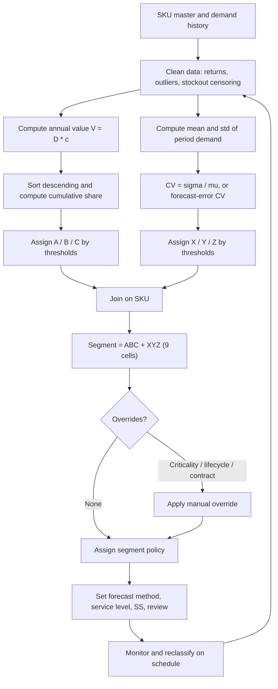

## Combined ABC-XYZ Segmentation Matrix

### Overview

The **combined ABC-XYZ segmentation matrix** cross-classifies every SKU along two independent dimensions:

- **ABC** (value axis): how much a SKU contributes to total consumption value, typically annual usage value or revenue (Pareto principle)
- **XYZ** (variability axis): how predictable a SKU's demand is, typically measured by the coefficient of variation (CV) of demand

The result is a $3\times3$ grid of nine segments (AX, AY, AZ, BX, BY, BZ, CX, CY, CZ). Each segment receives a distinct inventory policy: forecasting method, service level target, safety stock approach, review frequency, and replenishment mode. ABC alone ignores forecastability, and XYZ alone ignores financial materiality; the matrix resolves both.

**Key Points**

- ABC answers "how much does this SKU matter financially?"; XYZ answers "how hard is it to forecast?"
- The two axes are computed independently, then joined on SKU
- Safety stock burden depends on both value (holding cost of buffer) and variability ($\sigma$ driving buffer size)
- The matrix drives **policy differentiation**, not just reporting: service levels ($z$-scores), review cycles, forecast methods, and make-to-order vs. make-to-stock decisions vary by cell
- Thresholds are conventions, not laws; they must be calibrated to the portfolio

---

### ABC Dimension

**Annual consumption value** for SKU $i$:

$$V_i = D_i \cdot c_i$$

where $D_i$ is annual demand (units) and $c_i$ is unit cost (or unit revenue/margin, depending on the objective).

**Procedure**

1. Compute $V_i$ for all SKUs
2. Sort descending by $V_i$
3. Compute each SKU's share $s_i = V_i / \sum_j V_j$
4. Compute the cumulative share $S_k = \sum_{i=1}^{k} s_i$ in sorted order
5. Assign classes by cumulative share thresholds

**Typical thresholds**

| Class | Cumulative value share | Typical share of SKU count |
| --- | --- | --- |
| A | 0% to 80% | about 10% to 20% |
| B | 80% to 95% | about 20% to 30% |
| C | 95% to 100% | about 50% to 70% |

Other conventions (70/20/10, 80/15/5, 75/20/5) are used. Thresholds are applied to cumulative *value*, and SKU-count percentages are outcomes, not inputs. [Inference: the typical SKU-count ranges above are illustrative and depend on the distribution of values across the portfolio.]

---

### XYZ Dimension

**Coefficient of variation** of demand for SKU $i$:

$$CV_i = \frac{\sigma_i}{\mu_i}$$

where $\mu_i$ and $\sigma_i$ are the mean and standard deviation of demand per period (weekly or monthly), estimated over a consistent window (commonly 12 to 52 periods).

**Typical thresholds**

| Class | Range | Interpretation |
| --- | --- | --- |
| X | $CV \le 0.5$ | Stable, highly predictable demand |
| Y | $0.5 < CV \le 1.0$ | Moderate variability, trend or seasonality |
| Z | $CV > 1.0$ | Highly erratic, sporadic, or lumpy demand |

Some organizations use tighter cutoffs (for example, X below 0.25, Y from 0.25 to 0.5, Z above 0.5). The choice must match the period granularity, because $CV$ is not scale invariant across aggregation levels: aggregating to longer periods generally lowers $CV$ for independent demand.

**Important refinements**

- **Forecast-error-based XYZ**: replace $\sigma_i$ with the standard deviation of forecast error, giving $CV^{e}_i = \sigma_{e,i}/\mu_i$. This separates predictable seasonality or trend from true unpredictability, so a seasonal but forecastable SKU is not misclassified as Z.
- **Intermittency**: SKUs with many zero-demand periods produce large $CV$ mechanically. Complement XYZ with the **average demand interval** (ADI) and the squared coefficient of variation of nonzero demand sizes ($CV^2$) for Syntetos-Boylan style categorization (smooth, erratic, intermittent, lumpy).
- **Sample length**: with fewer than about 12 observations, $CV$ is unstable [Inference: rule-of-thumb threshold].

---

### The $3\times 3$ Matrix

<svg xmlns="http://www.w3.org/2000/svg" viewBox="0 0 640 400" role="img">
<title>ABC-XYZ Segmentation Matrix (svg_diagram)</title>
<text x="320" y="26" text-anchor="middle" font-family="sans-serif" font-size="16" font-weight="bold">ABC-XYZ Segmentation Matrix (svg_diagram)</text>
<text x="330" y="58" text-anchor="middle" font-family="sans-serif" font-size="13">Demand variability (XYZ)</text>
<text x="250" y="86" text-anchor="middle" font-family="sans-serif" font-size="13" font-weight="bold">X (CV ≤ 0.5)</text>
<text x="380" y="86" text-anchor="middle" font-family="sans-serif" font-size="13" font-weight="bold">Y (0.5 to 1.0)</text>
<text x="510" y="86" text-anchor="middle" font-family="sans-serif" font-size="13" font-weight="bold">Z (CV &gt; 1.0)</text>
<text x="70" y="160" text-anchor="middle" font-family="sans-serif" font-size="13" font-weight="bold">A</text>
<text x="70" y="250" text-anchor="middle" font-family="sans-serif" font-size="13" font-weight="bold">B</text>
<text x="70" y="340" text-anchor="middle" font-family="sans-serif" font-size="13" font-weight="bold">C</text>
<text x="34" y="250" text-anchor="middle" font-family="sans-serif" font-size="12" transform="rotate(-90 34 250)">Value (ABC)</text>
<rect x="185" y="100" width="130" height="80" fill="#2ca02c" fill-opacity="0.55" stroke="#333" />
<rect x="315" y="100" width="130" height="80" fill="#ffbf00" fill-opacity="0.55" stroke="#333" />
<rect x="445" y="100" width="130" height="80" fill="#ff7f0e" fill-opacity="0.55" stroke="#333" />
<rect x="185" y="180" width="130" height="80" fill="#8fd14f" fill-opacity="0.55" stroke="#333" />
<rect x="315" y="180" width="130" height="80" fill="#ffd966" fill-opacity="0.55" stroke="#333" />
<rect x="445" y="180" width="130" height="80" fill="#f4a261" fill-opacity="0.55" stroke="#333" />
<rect x="185" y="260" width="130" height="80" fill="#c5e0b4" fill-opacity="0.75" stroke="#333" />
<rect x="315" y="260" width="130" height="80" fill="#ffe699" fill-opacity="0.75" stroke="#333" />
<rect x="445" y="260" width="130" height="80" fill="#f8cbad" fill-opacity="0.75" stroke="#333" />
<text x="250" y="145" text-anchor="middle" font-family="sans-serif" font-size="15" font-weight="bold">AX</text>
<text x="380" y="145" text-anchor="middle" font-family="sans-serif" font-size="15" font-weight="bold">AY</text>
<text x="510" y="145" text-anchor="middle" font-family="sans-serif" font-size="15" font-weight="bold">AZ</text>
<text x="250" y="225" text-anchor="middle" font-family="sans-serif" font-size="15" font-weight="bold">BX</text>
<text x="380" y="225" text-anchor="middle" font-family="sans-serif" font-size="15" font-weight="bold">BY</text>
<text x="510" y="225" text-anchor="middle" font-family="sans-serif" font-size="15" font-weight="bold">BZ</text>
<text x="250" y="305" text-anchor="middle" font-family="sans-serif" font-size="15" font-weight="bold">CX</text>
<text x="380" y="305" text-anchor="middle" font-family="sans-serif" font-size="15" font-weight="bold">CY</text>
<text x="510" y="305" text-anchor="middle" font-family="sans-serif" font-size="15" font-weight="bold">CZ</text>
<text x="250" y="163" text-anchor="middle" font-family="sans-serif" font-size="11">Automate</text>
<text x="380" y="163" text-anchor="middle" font-family="sans-serif" font-size="11">Tight control</text>
<text x="510" y="163" text-anchor="middle" font-family="sans-serif" font-size="11">Manage risk</text>
<text x="250" y="243" text-anchor="middle" font-family="sans-serif" font-size="11">Automate</text>
<text x="380" y="243" text-anchor="middle" font-family="sans-serif" font-size="11">Standard policy</text>
<text x="510" y="243" text-anchor="middle" font-family="sans-serif" font-size="11">Review often</text>
<text x="250" y="323" text-anchor="middle" font-family="sans-serif" font-size="11">Min/max</text>
<text x="380" y="323" text-anchor="middle" font-family="sans-serif" font-size="11">Simple rules</text>
<text x="510" y="323" text-anchor="middle" font-family="sans-serif" font-size="11">Rationalize</text>
</svg>

---

### Segment-by-Segment Policy Guide

| Segment | Profile | Forecasting | Service level target ($\alpha$) | Safety stock | Review policy | Replenishment |
| --- | --- | --- | --- | --- | --- | --- |
| **AX** | High value, stable | Statistical (exponential smoothing, ARIMA) | High (95% to 99%) | Low relative to volume; small $\sigma$ | Continuous or frequent periodic | Automated, JIT, VMI, or kanban candidate |
| **AY** | High value, moderate variability | Statistical with trend and seasonality, collaborative input | High (95% to 98%) | Moderate; forecast-error-based $\sigma_e$ | Frequent (weekly) | Tightly monitored, supplier collaboration |
| **AZ** | High value, erratic | Judgmental plus statistical; demand sensing | Deliberately chosen (90% to 97%) balanced against cost | Large $\sigma$ inflates buffer at high unit value; consider postponement | Frequent, exception-based | Consider make-to-order, capacity or expedite options |
| **BX** | Medium value, stable | Statistical, automated | Medium-high (93% to 97%) | Low to moderate | Periodic (weekly to bi-weekly) | Automated |
| **BY** | Medium value, moderate variability | Statistical, periodic review | Medium (90% to 95%) | Moderate | Periodic | Standard $(R,S)$ or $(s,Q)$ |
| **BZ** | Medium value, erratic | Simple statistical, judgment overlay | Medium (85% to 92%) | Moderate to large | Periodic, watch exceptions | Reduced stock depth, negotiated lead times |
| **CX** | Low value, stable | Naive or moving average | Medium (90% to 95%) | Low | Infrequent | Min/max, bulk orders, two-bin |
| **CY** | Low value, moderate variability | Simple methods | Medium (85% to 92%) | Low to moderate; buffer is cheap | Infrequent | Min/max, larger safety factors acceptable |
| **CZ** | Low value, erratic | Minimal; often no forecast | Low (80% to 90%) or MTO | Minimal or none; consider MTO or delisting | Infrequent or on demand | Make-to-order, rationalize, or hold a generous buffer if very cheap |

**Key Points**

- Service level targets are illustrative ranges; final values follow from margin, criticality, and cost trade-offs
- A single high $z$ is cheap for low-value C items and costly for A items, so service targets do not have to rise monotonically with value if criticality or margin is low
- Criticality overrides the matrix: a low-value part that halts production (for example, a CZ spare) may require a high service level regardless of cell

---

### Worked Example: Classification Pipeline

Ten SKUs with annual demand, unit cost, and monthly demand CV:

| SKU | Annual demand $D_i$ | Unit cost $c_i$ | $V_i = D_i c_i$ | $CV_i$ |
| --- | --- | --- | --- | --- |
| S1 | 12,000 | $50 | $600,000 | 0.20 |
| S2 | 8,000 | $40 | $320,000 | 0.65 |
| S3 | 2,500 | $90 | $225,000 | 1.30 |
| S4 | 6,000 | $20 | $120,000 | 0.35 |
| S5 | 4,000 | $25 | $100,000 | 0.80 |
| S6 | 1,500 | $30 | $45,000 | 1.50 |
| S7 | 3,000 | $10 | $30,000 | 0.30 |
| S8 | 1,200 | $15 | $18,000 | 0.70 |
| S9 | 800 | $12 | $9,600 | 1.20 |
| S10 | 500 | $6 | $3,000 | 0.45 |

**Step 1: ABC.** Total value $=\$1{,}470{,}600$.

| Rank | SKU | $V_i$ | Share $s_i$ | Cumulative $S_k$ | Class |
| --- | --- | --- | --- | --- | --- |
| 1 | S1 | 600,000 | 40.80% | 40.80% | A |
| 2 | S2 | 320,000 | 21.76% | 62.56% | A |
| 3 | S3 | 225,000 | 15.30% | 77.86% | A |
| 4 | S4 | 120,000 | 8.16% | 86.02% | B |
| 5 | S5 | 100,000 | 6.80% | 92.82% | B |
| 6 | S6 | 45,000 | 3.06% | 95.88% | C |
| 7 | S7 | 30,000 | 2.04% | 97.92% | C |
| 8 | S8 | 18,000 | 1.22% | 99.14% | C |
| 9 | S9 | 9,600 | 0.65% | 99.79% | C |
| 10 | S10 | 3,000 | 0.20% | 99.99% | C |

Class boundaries use the convention that the SKU that first pushes the cumulative share past a threshold is assigned to the lower-priority class only when the prior cumulative share had already reached the threshold. Here, S3 ends at 77.86% (below 80%), so A ends at S3; S4 crosses 80% but starts below it, so it opens B under the rule "assign to the class in which the cumulative share *before* the SKU falls". Boundary rules differ by implementation and must be documented. Small rounding differences in the final cumulative total are expected (99.99% is rounding drift).

**Step 2: XYZ** using $CV\le0.5\to$ X, $0.5<CV\le1.0\to$ Y, $CV>1.0\to$ Z:

**Step 3: Combine**

| SKU | ABC | XYZ | Segment |
| --- | --- | --- | --- |
| S1 | A | X | **AX** |
| S2 | A | Y | **AY** |
| S3 | A | Z | **AZ** |
| S4 | B | X | **BX** |
| S5 | B | Y | **BY** |
| S6 | C | Z | **CZ** |
| S7 | C | X | **CX** |
| S8 | C | Y | **CY** |
| S9 | C | Z | **CZ** |
| S10 | C | X | **CX** |

**Output (segment counts and value share)**

| Segment | SKUs | Value share |
| --- | --- | --- |
| AX | 1 | 40.80% |
| AY | 1 | 21.76% |
| AZ | 1 | 15.30% |
| BX | 1 | 8.16% |
| BY | 1 | 6.80% |
| BZ | 0 | 0.00% |
| CX | 2 | 2.24% |
| CY | 1 | 1.22% |
| CZ | 2 | 3.71% |

**Conclusion**: Three SKUs (S1, S2, S3) carry about 77.9% of value, but S3 (AZ) is erratic, so it consumes disproportionate planning attention and safety stock cost. Two CZ items and two CX items together represent roughly 6% of value and are candidates for simplified control.

---

### Safety Stock Economics by Segment

For an SKU with lead-time demand standard deviation $\sigma_{L}$, unit holding cost $h_i = r\,c_i$ (holding rate $r$ times unit cost), and safety factor $z$, the annual cost of safety stock is:

$$C^{SS}_i = h_i\, z_i\, \sigma_{L,i} = r\, c_i\, z_i\, \sigma_{L,i}$$

**Worked comparison** (holding rate $r=20\%$, cycle service 95%, $z=1.645$, weekly lead time equal to 4 periods, $\sigma_{L}=\sigma_d\sqrt{L}$):

| SKU | Segment | $\mu_d$ (weekly) | $CV$ | $\sigma_d$ | $\sigma_L=\sigma_d\sqrt{4}$ | $SS=1.645\,\sigma_L$ | Annual SS cost $=0.2\,c\,SS$ |
| --- | --- | --- | --- | --- | --- | --- | --- |
| S1 | AX | 230.8 | 0.20 | 46.2 | 92.3 | 151.9 | $1,519 |
| S3 | AZ | 48.1 | 1.30 | 62.5 | 125.0 | 205.6 | $3,701 |
| S7 | CX | 57.7 | 0.30 | 17.3 | 34.6 | 57.0 | $114 |
| S9 | CZ | 15.4 | 1.20 | 18.5 | 37.0 | 60.8 | $146 |

(Weekly mean $=D_i/52$; values rounded.)

**Conclusion**: S3 (AZ) holds a buffer about 35% larger than S1 (AX) despite having about one-fifth the mean demand, and costs over twice as much annually to protect. This is the core reason AZ items attract strategic attention (postponement, shorter lead times, demand sensing), while CZ items are managed by simple rules because the absolute cost is small.

---

### Implementation

**Python (pandas)**

```python
import numpy as np
import pandas as pd

def abc_classify(df, value_col="annual_value", thresholds=(0.80, 0.95)):
    """Assign ABC by cumulative value share; class set by cumulative share BEFORE the SKU."""
    out = df.sort_values(value_col, ascending=False).copy()
    total = out[value_col].sum()
    out["share"] = out[value_col] / total
    out["cum_share"] = out["share"].cumsum()
    prior = out["cum_share"] - out["share"]          # cumulative share before this SKU
    out["ABC"] = np.select(
        [prior < thresholds[0], prior < thresholds[1]],
        ["A", "B"],
        default="C",
    )
    return out

def xyz_classify(series_by_sku: pd.DataFrame, x_max=0.5, y_max=1.0):
    """series_by_sku: rows = periods, columns = SKUs. CV with sample std (ddof=1)."""
    mu = series_by_sku.mean()
    sigma = series_by_sku.std(ddof=1)
    cv = (sigma / mu.replace(0, np.nan)).rename("CV")
    xyz = pd.cut(cv, bins=[-np.inf, x_max, y_max, np.inf], labels=["X", "Y", "Z"])
    return pd.DataFrame({"CV": cv, "XYZ": xyz})

# --- Example ---
sku = pd.DataFrame({
    "sku": [f"S{i}" for i in range(1, 11)],
    "annual_demand": [12000, 8000, 2500, 6000, 4000, 1500, 3000, 1200, 800, 500],
    "unit_cost":     [50, 40, 90, 20, 25, 30, 10, 15, 12, 6],
    "CV":            [0.20, 0.65, 1.30, 0.35, 0.80, 1.50, 0.30, 0.70, 1.20, 0.45],
}).set_index("sku")
sku["annual_value"] = sku["annual_demand"] * sku["unit_cost"]

abc = abc_classify(sku)
sku["XYZ"] = pd.cut(sku["CV"], bins=[-np.inf, 0.5, 1.0, np.inf], labels=["X", "Y", "Z"])
abc["XYZ"] = sku["XYZ"]
abc["segment"] = abc["ABC"] + abc["XYZ"].astype(str)

print(abc[["annual_value", "share", "cum_share", "ABC", "CV", "XYZ", "segment"]])

matrix = pd.crosstab(abc["ABC"], abc["XYZ"], values=abc["annual_value"], aggfunc="sum", normalize=True)
print((matrix * 100).round(2))
```

**Output**: a per-SKU table matching the worked example, and a value-share matrix by ABC and XYZ cell (values in percent, blank/NaN cells become 0 after `fillna(0)`). `pd.cut` uses right-inclusive bins by default, so $CV=0.5$ falls in X and $CV=1.0$ in Y.

**Building the count and value matrices**

```python
counts = pd.crosstab(abc["ABC"], abc["XYZ"]).reindex(index=list("ABC"), columns=list("XYZ"), fill_value=0)
value_share = (pd.crosstab(abc["ABC"], abc["XYZ"], values=abc["annual_value"], aggfunc="sum")
               .reindex(index=list("ABC"), columns=list("XYZ"))
               .fillna(0) / abc["annual_value"].sum() * 100).round(2)
print(counts, value_share, sep="\n\n")
```

**Excel / Google Sheets**



```
Value:            =D2*C2
Share:            =E2/SUM($E$2:$E$100)
Cum share (sorted): =SUM($F$2:F2)
Prior share:      =G2-F2
ABC:              =IF(H2<0.8,"A",IF(H2<0.95,"B","C"))
CV:               =STDEV.S(B2:M2)/AVERAGE(B2:M2)
XYZ:              =IF(N2<=0.5,"X",IF(N2<=1,"Y","Z"))
Segment:          =I2&O2
Cell count:       =COUNTIFS($P:$P,"AX")
```

**SQL (window functions)**

```sql
WITH v AS (
  SELECT sku, annual_demand * unit_cost AS value
  FROM sku_master
), r AS (
  SELECT sku, value,
         value / SUM(value) OVER () AS share,
         SUM(value) OVER (ORDER BY value DESC
                          ROWS BETWEEN UNBOUNDED PRECEDING AND CURRENT ROW)
           / SUM(value) OVER () AS cum_share
  FROM v
)
SELECT sku, value, share, cum_share,
       CASE WHEN cum_share - share < 0.80 THEN 'A'
            WHEN cum_share - share < 0.95 THEN 'B'
            ELSE 'C' END AS abc
FROM r;
```

---

### Classification Workflow



---

### Threshold Selection and Calibration

| Decision | Options | Guidance |
| --- | --- | --- |
| ABC basis | Usage value, revenue, gross margin, profit contribution | Use margin or contribution when profitability differs sharply across SKUs |
| ABC cutoffs | 80/15/5, 70/20/10, 75/20/5 | Inspect the Pareto curve; cut at natural inflection points |
| XYZ basis | $CV$ of raw demand, $CV$ of forecast error | Prefer forecast-error $CV$ where seasonality or trend is strong |
| XYZ cutoffs | 0.5/1.0, 0.25/0.5, percentile-based | Percentile-based cutoffs (for example, bottom third, middle third, top third of $CV$) guarantee balanced cells but lose absolute meaning |
| Time window | 12 to 52 periods | Match the planning horizon; shorter windows adapt faster but are noisier |
| Period granularity | Weekly, monthly | State it explicitly; $CV$ changes with aggregation |
| Reclassification frequency | Monthly to annually | Quarterly is common; more frequent risks segment flapping |
| Hysteresis | Move only after crossing threshold by a margin or for $k$ consecutive periods | Prevents churn near boundaries |

**Key Points**

- Document the exact rule (basis, window, cutoffs, boundary treatment) so segmentation is reproducible
- Recompute both axes on a schedule and log transitions for audit
- Segment migration (for example, BX to BZ) is an early warning of demand pattern change

---

### Extensions and Variants

- **Additional dimensions**: add **criticality (VED)** (vital, essential, desirable) or **lead time / lifecycle** (new, mature, end-of-life), producing 3D segmentations. The number of cells grows multiplicatively, so consolidate cells that share a policy.
- **ABC by multiple criteria**: weighted scoring (value, margin, criticality, strategic importance) before Pareto ranking.
- **Demand-pattern overlay**: for intermittent items, use ADI/CV$^2$ classes (smooth, erratic, intermittent, lumpy) inside Z cells to choose Croston, SBA, or TSB rather than moving-average methods.
- **Supply-side overlay**: combine with **supplier reliability** or **lead time variability** classes when supply uncertainty rather than demand drives buffers.
- **FSN / XYZ hybrids**: FSN (fast, slow, non-moving) classifies by movement frequency and is useful for obsolescence control; it is complementary, not identical, to XYZ.
- **Dynamic policy mapping**: compute $z$ per SKU via a cost model and use the matrix only as a default when cost data is missing.
- **Multi-echelon segmentation**: classify at the network level (total demand) and location level separately, since a globally AX item can be locally CZ at small stocking points.

---

### Common Pitfalls

- **Ignoring intermittency**: high $CV$ from many zero periods classifies as Z, but the appropriate policy differs from erratic-but-continuous demand
- **Using unit volume instead of value** for ABC, which puts cheap high-volume items in A
- **Mixing period granularities** when comparing $CV$ across SKUs
- **Treating seasonal SKUs as Z** when a seasonal forecast would render them predictable
- **Stockout-censored history**, which understates demand and distorts $CV$; correct or flag periods with zero inventory
- **Static classification**: never reclassifying after launches, promotions, or lifecycle changes
- **Applying the matrix mechanically**: strategic, safety-critical, or contractual items need overrides
- **Segment flapping** near thresholds without hysteresis, causing unstable policy parameters
- **New products with short history**: unreliable $CV$; classify provisionally using analogs
- **Confusing XYZ with variability of value**: XYZ measures demand-quantity variability, not price variability
- **Boundary inconsistency**: differing treatment of the SKU that straddles a cutoff between systems or reports
- **Over-fine service targets**: assigning a distinct service level to each cell without evidence that the differentiation pays off; start with 3 to 4 policy tiers

---

### Interpreting the Matrix Strategically

| Pattern | Signal | Typical action |
| --- | --- | --- |
| Heavy AZ population | Large value exposed to unpredictable demand | Invest in demand sensing, shorten lead times, postponement, flexible capacity |
| Large CZ tail | Many low-value erratic SKUs | Rationalize range, MTO, consolidate suppliers |
| AX dominance | Stable high-value core | Automate replenishment, negotiate VMI, minimize safety stock through supplier integration |
| Migration toward Z | Rising variability | Investigate causes (promotions, competition, forecasting drift) |
| Many BY items | Broad middle | Standard periodic policies with periodic tuning |

**Conclusion**: The ABC-XYZ matrix converts a large, heterogeneous SKU population into a small number of policy classes. Its value lies in linking *financial materiality* to *forecastability* so that planning effort, forecasting sophistication, and safety stock investment are allocated where they yield the largest return.

---

**Related Topics**

- ABC analysis and Pareto principle refinements
- XYZ analysis and coefficient of variation estimation
- Demand pattern classification: ADI and CV$^2$ (smooth, erratic, intermittent, lumpy)
- VED analysis (vital, essential, desirable) and criticality-based overrides
- FSN (fast, slow, non-moving) and obsolescence management
- Service level differentiation across segments
- Safety stock computation per segment (continuous vs. periodic review)
- Forecasting method selection by segment (exponential smoothing, Croston, SBA, TSB)
- Segment migration tracking and reclassification governance
- Multi-criteria and multi-echelon classification