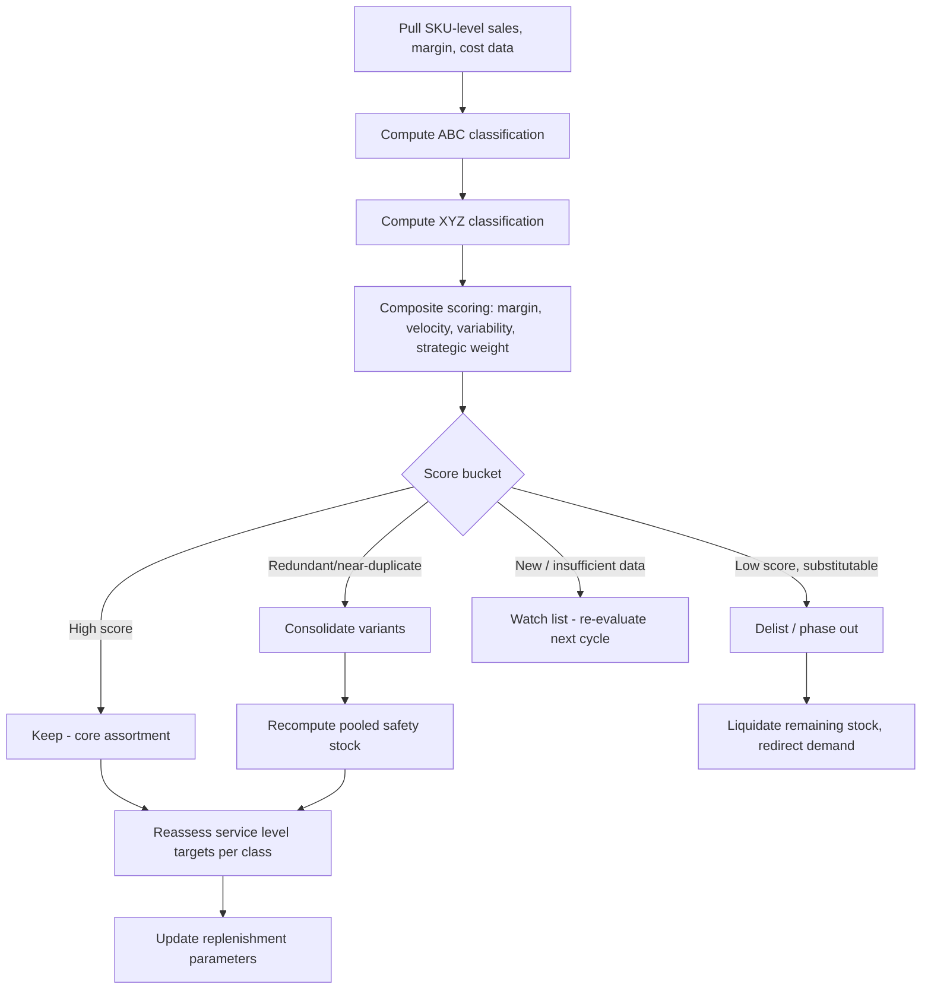

## SKU Rationalization and Assortment Complexity

### Definition and Scope

SKU rationalization is the systematic process of evaluating, consolidating, or eliminating stock-keeping units (SKUs) within a product assortment to optimize profitability, reduce operational complexity, and improve inventory efficiency. It sits at the intersection of merchandising strategy and inventory management, directly influencing safety stock requirements, forecast accuracy, and total cost to serve.

Assortment complexity refers to the operational and financial burden imposed by the breadth (number of product lines), depth (number of variants per line), and interaction effects of a product catalog. As SKU count grows, complexity does not scale linearly — it compounds through combinatorial interactions in demand forecasting, warehouse slotting, replenishment planning, and safety stock aggregation.

### Why SKU Proliferation Happens

- **Demand-driven expansion**: New variants (size, color, flavor, packaging) added to capture incremental market segments
- **Channel-driven expansion**: Separate SKUs created per channel (e-commerce, retail, wholesale) or per customer (private label)
- **Innovation cycles**: New product introductions without corresponding delisting of legacy items
- **Organizational incentives**: Sales teams rewarded for revenue growth, not complexity cost, leading to unchecked SKU addition
- **Lack of governance**: No formal SKU rationalization cadence or ownership, so tail SKUs accumulate indefinitely

### The Cost of Complexity

Each additional SKU imposes costs that are frequently invisible in standard P&L reporting because they are distributed across shared cost pools:

- **Forecasting cost**: Lower-volume SKUs have proportionally higher demand variability (coefficient of variation), degrading forecast accuracy and inflating safety stock
- **Safety stock cost**: Because safety stock does not scale linearly with SKU count (see aggregation effects below), fragmenting one high-volume SKU into several low-volume variants increases total safety stock investment for the same aggregate demand
- **Transaction cost**: Purchase orders, receiving, cycle counts, and system maintenance scale with SKU count, not with revenue
- **Warehouse cost**: Slotting, picking travel time, and space allocation degrade as SKU density increases, especially for slow-moving items occupying prime pick locations
- **Working capital cost**: Capital tied up in long-tail inventory with low turn rates
- **Obsolescence risk**: Higher SKU count increases exposure to markdown and write-off risk for items that fail to sell through

### The Pareto Pattern in Assortments

Most assortments exhibit a Pareto (80/20) or more extreme distribution: a small fraction of SKUs generates the majority of revenue and margin, while a long tail contributes marginally but consumes disproportionate resources.

**Typical pattern:**

| SKU Segment | % of SKUs | % of Revenue | % of Handling Cost |
| --- | --- | --- | --- |
| Top (A) | 10–20% | 60–80% | 20–30% |
| Middle (B) | 20–30% | 15–25% | 25–35% |
| Tail (C) | 50–70% | 5–15% | 40–55% |

This inversion — the tail consuming more handling cost than revenue — is the central economic argument for rationalization.

### ABC-XYZ Classification as a Rationalization Framework

SKU rationalization decisions are typically anchored to a two-dimensional classification:

- **ABC dimension**: Value contribution (revenue, margin, or COGS-weighted volume), typically via Pareto analysis
- **XYZ dimension**: Demand variability/predictability, typically via coefficient of variation (CV)

$$CV = \frac{\sigma_D}{\mu_D}$$

where $\sigma_D$ is the standard deviation of demand and $\mu_D$ is mean demand over a reference period.

**Classification thresholds (illustrative, commonly used):**

- X: $CV < 0.5$ (stable, highly predictable)
- Y: $0.5 \le CV < 1.0$ (moderate variability)
- Z: $CV \ge 1.0$ (erratic, unpredictable)

**Resulting 9-cell matrix and typical rationalization posture:**

```mermaid
quadrantChart
    title ABC-XYZ Rationalization Posture
    x-axis Low Variability --> High Variability
    y-axis Low Value --> High Value
    quadrant-1 AX: Protect, tight SS
    quadrant-2 AZ: Protect, high SS buffer
    quadrant-3 CX: Consolidate/simplify
    quadrant-4 CZ: Prime delist candidates
```

- **AX/AY**: High value, predictable — core assortment, protect service level, minimize safety stock via tight forecasting
- **AZ**: High value, erratic — retain but manage with elevated safety stock or postponement strategies
- **CX/CY**: Low value, predictable — candidates for consolidation (merge variants) or vendor-managed inventory
- **CZ**: Low value, erratic — prime delisting/rationalization candidates unless strategically mandated (e.g., assortment completeness for a category captain role)

### Rationalization Decision Framework

A defensible rationalization process should not rely on revenue or volume alone. A multi-criteria scoring approach is standard practice:

**Step 1 — Data assembly per SKU:**

- Revenue and gross margin contribution (trailing 12–24 months)
- Unit volume and velocity (turns per year)
- Demand variability (CV, XYZ class)
- Cross-sell/basket affinity (does removing this SKU depress sales of other SKUs?)
- Strategic role (loss leader, new launch still ramping, contractual/private-label obligation, category-captain requirement)
- Substitutability (can demand be redirected to a near-identical SKU with minimal customer loss?)
- Carrying cost and obsolescence risk
- Supplier/MOQ constraints

**Step 2 — Composite scoring:**

$$Score_i = w_1 \cdot Margin_i + w_2 \cdot Velocity_i - w_3 \cdot Variability_i - w_4 \cdot ComplexityCost_i + w_5 \cdot StrategicWeight_i$$

Weights ($w_1 \ldots w_5$) are calibrated by category management based on business priorities; this is a decision-support heuristic, not a universal formula [Inference — weighting schemes vary significantly by industry and are typically tuned empirically].

**Step 3 — Action bucketing:**

- **Keep** — core, high-scoring SKUs
- **Consolidate** — near-duplicate SKUs merged into one representative item (e.g., collapsing five near-identical pack sizes into two)
- **Delist/phase out** — low-scoring, substitutable, non-strategic SKUs
- **Watch** — new items still in ramp-up, insufficient data to classify

### Impact on Safety Stock Calculus

This is the direct mechanical link between assortment strategy and safety stock formulas.

**Safety stock aggregation (risk pooling) effect:**

When $n$ independent SKU variants (e.g., color variants of one style) are consolidated into fewer SKUs, or when demand is pooled at a higher node (e.g., holding one safety stock pool instead of per-SKU pools), total safety stock required decreases because variances add sub-additively relative to standard deviations, while means add linearly.

For $n$ independent demand streams pooled together:

$$SS_{pooled} = z \cdot \sqrt{\sum_{i=1}^{n} \sigma_i^2} \cdot \sqrt{L}$$

versus the sum of independently held safety stocks:

$$SS_{separate} = z \cdot \sqrt{L} \cdot \sum_{i=1}^{n} \sigma_i$$

Since $\sqrt{\sum \sigma_i^2} \le \sum \sigma_i$ for $n > 1$ (with equality only when $n=1$), pooling always yields $SS_{pooled} \le SS_{separate}$. This is the statistical basis for why SKU rationalization (fewer, more aggregated demand streams) mechanically reduces total safety stock investment even when total unit volume is held constant.

**Numerical example:**

Five color variants of a shirt, each with weekly demand $\sigma_i = 10$ units, lead time $L = 4$ weeks, $z = 1.65$ (95% service level):

$$SS_{separate} = 1.65 \times \sqrt{4} \times (10+10+10+10+10) = 1.65 \times 2 \times 50 = 165 \text{ units}$$

If demand is pooled (e.g., via late differentiation or postponement, holding generic stock and dyeing/labeling on demand):

$$SS_{pooled} = 1.65 \times 2 \times \sqrt{5 \times 10^2} = 1.65 \times 2 \times \sqrt{500} = 1.65 \times 2 \times 22.36 \approx 73.8 \text{ units}$$

This is a reduction of roughly 55% in safety stock units for the same total expected demand — illustrating why consolidating variants (or delaying differentiation) is a powerful lever, not merely a merchandising simplification. [Behavior may vary — this assumes independence and identical variance across SKUs; correlated demand across variants reduces the pooling benefit.]

### Interaction with Forecast Error and CV

Long-tail SKUs typically exhibit higher CV, which directly inflates the safety stock multiplier since:

$$SS = z \cdot \sigma_{LT} \quad \text{where} \quad \sigma_{LT} \approx \mu_D \cdot CV \cdot \sqrt{L}$$

(under a simplified demand-during-lead-time approximation with fixed lead time). As CV rises, the safety stock required per unit of average demand rises proportionally, meaning tail SKUs require disproportionately higher relative buffer stock to hit the same target service level — reinforcing the case for either delisting, consolidating, or applying a lower service-level target to Z-class tail items.

### Assortment Complexity Metrics

Beyond SKU count, practitioners track:

- **SKU productivity**: Revenue or margin per SKU per period
- **SKU-to-sales ratio trend**: Growth in SKU count relative to growth in revenue (a rising ratio signals dilution)
- **Effective SKU count / entropy measure**: An information-theoretic complexity index, e.g., Shannon entropy of the sales distribution across SKUs:

$$H = -\sum_{i=1}^{n} p_i \log_2(p_i)$$

where $p_i$ is SKU $i$'s share of total sales. Higher $H$ indicates a flatter, more fragmented (complex) distribution; lower $H$ indicates concentration in fewer SKUs. [Inference — entropy-based complexity indices are used in some advanced merchandising analytics practices but are not as universally standardized as ABC/XYZ classification.]

- **Substitution rate**: % of demand for a delisted SKU successfully captured by a substitute SKU (measures cannibalization vs. true demand loss)
- **Assortment overlap ratio**: Degree of functional redundancy between SKUs (e.g., two SKUs differing only in packaging size serving the same use case)

### Process Flow for Rationalization Cycles



### Practical Rationalization Levers

- **Variant consolidation**: Merge low-differentiation SKUs (e.g., near-identical shades) into fewer, more distinct options
- **Postponement/late differentiation**: Hold generic upstream inventory, defer SKU-specific customization until closer to demand signal — directly enables the safety stock pooling benefit shown above
- **Minimum viable assortment (MVA) analysis**: Identify the smallest SKU set that captures a target percentage (e.g., 95%) of category revenue without disproportionate share loss
- **Phase-out sequencing**: Structured delisting (stop replenishment → sell through existing stock → clear via markdown → formal delist) rather than abrupt discontinuation, to avoid stockout-driven customer dissatisfaction on items still selling
- **New SKU gating**: Require a business case (projected volume, margin, cannibalization estimate) before a new SKU is approved, often tied to a "one-in-one-out" governance rule
- **Service-level differentiation**: Apply lower target service levels (and thus lower $z$-values and safety stock) to tail SKUs by design, rather than applying a uniform service level across the whole assortment

### Risks and Trade-offs of Over-Rationalization

- **Customer-perceived assortment loss**: Reducing SKUs too aggressively can reduce basket size or drive customers to competitors offering broader choice
- **Cannibalization miscalculation**: Assuming 100% demand transfer to substitute SKUs when actual substitution rates are often 40–70% [Unverified — substitution rates are highly category- and context-dependent and should be measured empirically, not assumed]
- **Strategic SKU removal**: Delisting a low-volume SKU that serves a category-captain or completeness role (e.g., a full-size range requirement from a retail partner) can jeopardize shelf space or contractual standing
- **Innovation pipeline disruption**: Overly strict gating can slow legitimate new product testing

### Governance Cadence

Rationalization is not a one-time project but a recurring cycle, commonly run:

- **Quarterly**: Tactical review of tail SKUs (C/Z class) for delisting candidates
- **Annually**: Full ABC-XYZ re-classification and strategic assortment review
- **Event-triggered**: Post-launch review (e.g., 6 months after a new SKU introduction) to confirm it has moved out of "Watch" status

**Next Steps**

- Demand aggregation and risk pooling strategies (multi-echelon and multi-location pooling)
- Coefficient of variation and its role in safety stock formulas
- ABC-XYZ classification methodology (deep dive on classification and thresholds)
- Postponement and late-differentiation supply chain design
- Service-level differentiation by inventory class
- New product introduction (NPI) forecasting under sparse historical data
- Markdown optimization and end-of-life inventory liquidation strategy