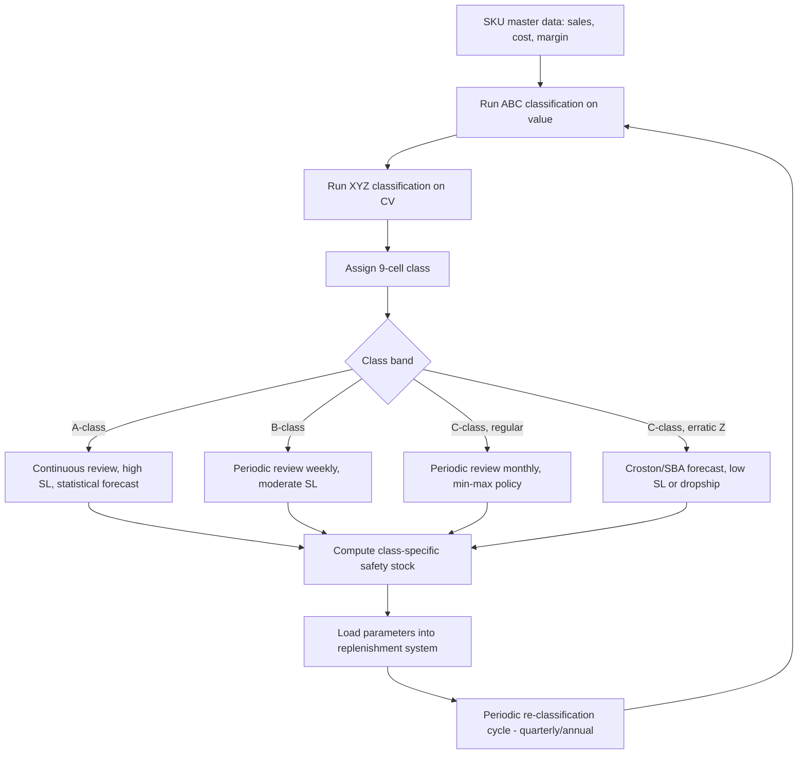

## Differentiated Inventory Policies by Item Class

### Definition and Rationale

Differentiated inventory policy is the practice of assigning distinct replenishment rules, service level targets, review methods, and safety stock formulas to different segments of a product catalog, rather than applying a single uniform policy across all SKUs. It is the operational execution layer that follows directly from inventory classification (ABC, XYZ, ABC-XYZ, or other segmentation schemes): classification identifies *which group* a SKU belongs to; differentiated policy determines *how that group is managed*.

The core rationale is economic: applying a single, uniform service level or review policy across a heterogeneous assortment is provably suboptimal. High-value, predictable items are typically over-served (wasting less capital would achieve the same service outcome), while low-value, erratic items are often under-served or over-buffered inconsistently. Differentiated policy design allocates working capital and management attention proportional to the value-at-risk and complexity of each segment.

### Why Uniform Policies Fail

- **Capital misallocation**: A flat 98% service level applied to both an A-class bestseller and a C-class slow mover ties up disproportionate capital in the tail, where the marginal value of the extra unit of safety stock is low
- **Ignoring the marginal cost/benefit curve**: The optimal service level is where marginal holding cost equals marginal stockout cost; this ratio differs by item, so the optimum differs by item
- **Operational review capacity**: Continuous review (real-time monitoring) is justified for high-velocity A-items but is wasteful overhead for low-velocity C-items, which are more efficiently managed via periodic review
- **Forecast method mismatch**: Applying a sophisticated statistical forecasting model to an intermittent-demand tail SKU produces poor results; simpler heuristics (e.g., min-max) often outperform complex models on erratic, low-volume series

### Policy Dimensions That Get Differentiated

A complete differentiated policy framework specifies, per class, values for each of the following dimensions:

1. **Target service level** (cycle service level or fill rate)
2. **Review policy type** (continuous review (s,Q) vs. periodic review (s,S) or (R,S))
3. **Safety stock formula/method** (statistical z-based, min-max heuristic, or judgment-based buffer)
4. **Forecasting method** (exponential smoothing, moving average, croston's method for intermittent demand, or manual override)
5. **Review frequency/cycle** (daily, weekly, monthly)
6. **Order sizing rule** (EOQ-based, fixed lot, supplier MOQ-driven)
7. **Ownership/escalation** (planner attention level, exception reporting threshold)

### Standard Policy Matrix by ABC-XYZ Class

The most common industry pattern maps the 9-cell ABC-XYZ matrix to differentiated policy sets:

| Class | Service Level Target | Review Policy | Forecasting Approach | Safety Stock Method |
| --- | --- | --- | --- | --- |
| AX | High (98–99%) | Continuous review (s,Q) | Statistical (exp. smoothing) | Statistical $z \cdot \sigma$ |
| AY | High (95–98%) | Continuous review | Statistical with trend/seasonality | Statistical, wider buffer |
| AZ | Moderate-high (90–97%), case-by-case | Continuous review, tight monitoring | Judgment-assisted, causal factors | Statistical + manual buffer overlay |
| BX | Moderate (92–96%) | Periodic review (weekly) | Statistical | Statistical $z \cdot \sigma$ |
| BY | Moderate (90–95%) | Periodic review | Statistical, monitored | Statistical, moderate buffer |
| BZ | Moderate (85–92%) | Periodic review, exception-based | Simple heuristic or Croston's | Min-max or heuristic buffer |
| CX | Lower-moderate (85–92%) | Periodic review (monthly) | Simple moving average | Min-max |
| CY | Lower (80–90%) | Periodic review, infrequent | Simple heuristic | Min-max, wide bands |
| CZ | Lowest acceptable, or make-to-order | Periodic/reactive, or eliminate stock | Croston's/intermittent demand model, or none | Minimal or zero; consider dropship |

[Inference — exact percentage bands vary substantially by industry, margin structure, and competitive service expectations; the table represents commonly observed directional patterns, not fixed prescriptive values.]

### Service Level Differentiation: The Economic Logic

The theoretically optimal service level per item, under a newsvendor-style single-period framing (and commonly extended heuristically to continuous review), is derived from the critical ratio:

$$CR = \frac{C_u}{C_u + C_o}$$

where $C_u$ is the underage cost (stockout cost: lost margin, expedite cost, customer goodwill loss) and $C_o$ is the overage cost (holding cost, obsolescence risk, markdown risk).

High-margin, high-demand-urgency A-items typically have a high $C_u / C_o$ ratio, justifying a high critical ratio and thus a high target service level. Low-margin or highly substitutable C-items often have a lower ratio, justifying acceptance of more frequent, lower-cost stockouts in exchange for lower carrying cost.

The target service level maps to the safety factor $z$ via the inverse standard normal CDF:

$$z = \Phi^{-1}(SL)$$

**Example service-level-to-z mapping:**

| Service Level | z-value |
| --- | --- |
| 90% | 1.28 |
| 95% | 1.65 |
| 97.5% | 1.96 |
| 99% | 2.33 |
| 99.9% | 3.09 |

Because safety stock scales with $z$ (linearly) and with demand/lead-time variability (via $\sigma_{LT}$), even modest differentiation in target service level between classes produces materially different safety stock investment per unit of average demand.

### Review Policy Differentiation

**Continuous review (s, Q)** — reorder point $s$, fixed order quantity $Q$:

$$s = \mu_{LT} + z \cdot \sigma_{LT}$$

Triggered the instant inventory position drops to $s$. Appropriate for A-class items where stockout cost is high and real-time inventory visibility (POS/ERP integration) is available to justify the monitoring overhead.

**Periodic review (R, S)** — review every $R$ periods, order up to $S$:

$$S = \mu_{L+R} + z \cdot \sigma_{L+R}$$

where demand and variability are computed over the longer $(L+R)$ exposure period (lead time plus review interval), since inventory position is only checked periodically. This inherently requires *more* safety stock than continuous review for the same service level, because of the added exposure window — making it more capital-intensive per unit but far cheaper to administer, which is why it is typically reserved for B/C-class items where transaction cost savings outweigh the extra buffer cost.

**Hybrid (s, S)** — min-max policy: review continuously or periodically, but only place an order when inventory falls to or below $s$, ordering up to $S$. Common default for C-class items due to simplicity of administration.

### Forecasting Method Differentiation

- **A-class (smooth, high-volume demand)**: Exponential smoothing (single, double/Holt for trend, triple/Holt-Winters for seasonality), regression with causal factors (promotions, price, weather)
- **B-class**: Simpler exponential smoothing or moving averages, less frequent re-parameterization
- **C-class, regular demand**: Simple moving average or naive forecast (last period = next period)
- **Intermittent/lumpy demand (common in CZ)**: Croston's method or Syntetos-Boylan Approximation (SBA), which separately forecast demand size and inter-demand interval rather than applying standard smoothing directly to a series with many zero-demand periods, since standard exponential smoothing is biased upward immediately following a demand occurrence in intermittent series [documented limitation of standard smoothing methods on intermittent demand data]

### Worked Example: Differentiated Safety Stock Across Classes

Assume lead time $L = 2$ weeks (fixed), weekly demand data as follows:

| SKU | Class | $\mu_D$ (units/wk) | $\sigma_D$ | Target SL | z |
| --- | --- | --- | --- | --- | --- |
| SKU-101 | AX | 500 | 50 | 98% | 2.05 |
| SKU-205 | BY | 80 | 40 | 92% | 1.41 |
| SKU-390 | CZ | 10 | 12 | 85% | 1.04 |

Using $SS = z \cdot \sigma_D \cdot \sqrt{L}$:

$$SS_{101} = 2.05 \times 50 \times \sqrt{2} = 2.05 \times 50 \times 1.414 \approx 145 \text{ units}$$

$$SS_{205} = 1.41 \times 40 \times \sqrt{2} \approx 1.41 \times 40 \times 1.414 \approx 79.8 \text{ units}$$

$$SS_{390} = 1.04 \times 12 \times \sqrt{2} \approx 1.04 \times 12 \times 1.414 \approx 17.6 \text{ units}$$

Note that SKU-390, despite having the lowest absolute demand, carries the highest *relative* safety stock as a percentage of average demand (SS/$\mu_D$ ≈ 176% vs. ~29% for SKU-101), illustrating why tail items are disproportionately buffer-heavy per unit sold — reinforcing the case (from SKU rationalization) for either lower service targets or make-to-order approaches for CZ-class items, rather than applying full statistical safety stock treatment uniformly.

### Policy Assignment Workflow

### System Implementation Considerations

- **Parameter tables, not hardcoded logic**: ERP/MRP systems should store service level, review type, and forecast method as SKU-class attributes in a parameter table, so reclassification automatically cascades policy changes rather than requiring manual per-SKU reconfiguration
- **Exception-based planner workflows**: Planner attention (dashboards, alerts) should be weighted toward A-class and Z-class items, since these carry the highest financial or variability risk per unit of planning effort; C-X items can run largely on autopilot
- **Class migration handling**: SKUs shift class over time (seasonality, lifecycle stage, promotional spikes); policy engines should re-evaluate classification on a defined cadence and flag material class changes for review rather than applying stale parameters indefinitely
- **New SKU cold-start policy**: Items with insufficient sales history cannot be reliably classified by CV; a default conservative policy (moderate-high service level, simple forecast) is typically applied until sufficient data (commonly 6–12 months, [Unverified — exact threshold is organization-specific]) accumulates

### Interaction with Multi-Echelon and Location Segmentation

Differentiated policy is often layered further by location tier (e.g., central DC vs. forward store) and channel (e-commerce vs. retail), meaning the same SKU can carry different policies at different network nodes — an A-class SKU at the DC may be B-class in velocity terms at a low-traffic store location. This is a distinct but related complexity layer beyond single-echelon ABC-XYZ classification. [Inference — multi-echelon differentiation is a widely used extension in mature supply chain organizations but adds significant parameter management overhead and is not universally implemented, particularly in smaller operations.]

### Risks of Poor Differentiation Design

- **Over-fragmentation**: Creating too many distinct policy tiers (e.g., 20+ micro-segments) increases system complexity without proportional benefit; most mature practices converge on 6–12 policy tiers
- **Static classification drift**: Failing to re-run classification regularly causes policies to lag actual demand behavior, especially after promotions, seasonality shifts, or supply disruptions
- **Ignoring correlation between class dimensions and lead time variability**: A policy framework based only on demand-side CV but ignoring supply-side lead time variability will under-buffer items with unreliable suppliers even if demand is stable

**Related Topics**

- ABC-XYZ classification methodology and threshold calibration
- Continuous vs. periodic review system design and trade-offs
- Croston's method and intermittent demand forecasting
- Multi-echelon inventory optimization and location-tier segmentation
- Critical ratio and newsvendor model derivation for service level setting
- Cold-start inventory policy for new product introductions
- Exception-based planning and planner workload allocation