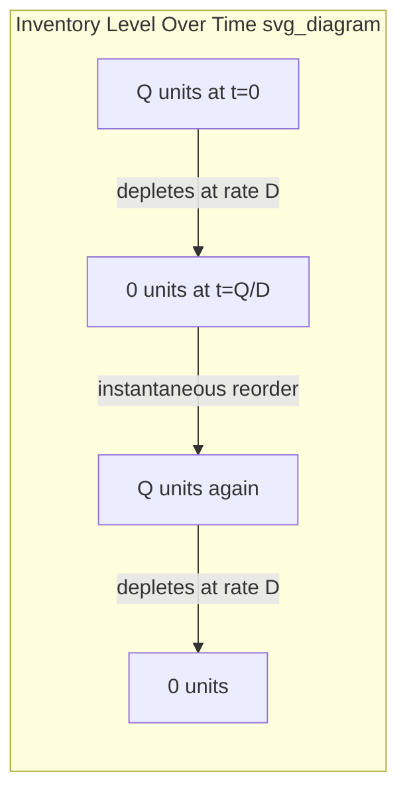

## Economic Order Quantity Derivation and Assumptions

### Definition and Purpose

The Economic Order Quantity (EOQ) model determines the order quantity that minimizes the total relevant cost of inventory — the sum of ordering (setup) costs and holding (carrying) costs — under a set of simplifying deterministic assumptions. It is the foundational model of classical inventory theory, originally formalized by Ford W. Harris (1913), and serves as the baseline against which more complex stochastic and multi-echelon models are built.

EOQ answers a single question: *given a constant, known demand rate, how large should each replenishment order be to minimize total annual inventory-related cost?*

### Core Assumptions

The classical EOQ model rests on a specific set of simplifying assumptions. Understanding these is essential because every deviation from them motivates a distinct extended model (EPQ, EOQ with backorders, EOQ with quantity discounts, stochastic reorder point models, etc.).

1. **Demand is deterministic and constant** over the planning horizon (known rate $D$ per unit time, no variability)
2. **Lead time is constant and known** (often simplified to zero or a fixed constant in the base model)
3. **No stockouts allowed** — full service, replenishment always arrives before inventory reaches zero
4. **Instantaneous replenishment** — the entire order quantity $Q$ arrives at once (not a gradual production rate)
5. **Fixed ordering cost per order** ($S$), independent of order size
6. **Linear holding cost** — constant holding cost per unit per unit time ($H$), proportional to quantity held
7. **No quantity discounts** — unit purchase cost $C$ is constant regardless of order size
8. **Infinite planning horizon / continuous, steady-state operation** — the model considers long-run average cost, not finite-horizon transient effects
9. **Single item, single location** — no interaction effects with other SKUs or network nodes

These assumptions are almost never fully true in practice; the model's value lies in providing a tractable closed-form baseline and directional intuition (the classic "square root law" relationship), not a literal operational prescription. [Behavior may vary — real-world applicability depends on how closely actual demand and supply conditions approximate these assumptions.]

### Inventory Position Over Time (Sawtooth Pattern)

Under the assumptions above, inventory follows a deterministic sawtooth pattern: instantaneous jump to $Q$ at each order arrival, linear depletion at rate $D$ down to zero, immediately followed by the next instantaneous replenishment.

Average inventory held over a cycle, given the linear sawtooth depletion from $Q$ to $0$, is:

$$\bar{I} = \frac{Q}{2}$$

This average-inventory result is the mechanical basis for the holding cost term in the total cost function below.

### Total Relevant Cost Function

Two cost components trade off against each other as $Q$ varies:

**Annual ordering cost** — decreases as $Q$ increases (fewer, larger orders):

$$TC_{order} = \frac{D}{Q} \cdot S$$

where $D/Q$ is the number of orders placed per year.

**Annual holding cost** — increases as $Q$ increases (more average inventory held):

$$TC_{hold} = \frac{Q}{2} \cdot H$$

**Total relevant annual cost:**

$$TC(Q) = \frac{D}{Q} S + \frac{Q}{2} H$$

(Purchase cost $D \cdot C$ is often omitted from the relevant cost function in the base model because it is constant regardless of $Q$ when there are no quantity discounts — it does not affect the optimization, though it is retained when discounts are introduced.)

### Derivation via Calculus (First-Order Condition)

To find the $Q$ that minimizes $TC(Q)$, take the derivative with respect to $Q$ and set it to zero:

$$\frac{d(TC)}{dQ} = -\frac{DS}{Q^2} + \frac{H}{2} = 0$$

Solving for $Q$:

$$\frac{H}{2} = \frac{DS}{Q^2}$$

$$Q^2 = \frac{2DS}{H}$$

$$Q^* = \sqrt{\frac{2DS}{H}}$$

**Second-order condition (confirming minimum, not maximum):**

$$\frac{d^2(TC)}{dQ^2} = \frac{2DS}{Q^3} > 0 \quad \text{for all } Q > 0$$

Since the second derivative is positive for all positive $Q$, the function is convex, and the critical point $Q^*$ is confirmed to be a global minimum over the feasible domain.

### The EOQ Formula and Its Properties

$$\boxed{Q^* = \sqrt{\frac{2DS}{H}}}$$

**Key structural property — the "square root law":** $Q^*$ scales with the square root of demand, not linearly. This means doubling demand does not double the optimal order quantity; it increases it by a factor of $\sqrt{2} \approx 1.41$. This sub-linear scaling is the theoretical basis for economies of scale in consolidated ordering and for risk-pooling arguments in broader inventory theory.

**Minimum total cost at $Q^*$:**

Substituting $Q^*$ back into $TC(Q)$ and simplifying:

$$TC(Q^*) = \sqrt{2DSH}$$

**A useful identity at the optimum:** ordering cost equals holding cost exactly at $Q^*$:

$$\frac{D}{Q^*} S = \frac{Q^*}{2} H$$

This equal-cost-split property is a quick sanity check when verifying an EOQ calculation — at the optimal quantity, the two cost curves intersect.

### Related Derived Metrics

**Optimal number of orders per year:**

$$N^* = \frac{D}{Q^*}$$

**Optimal cycle time (time between orders):**

$$T^* = \frac{Q^*}{D} = \sqrt{\frac{2S}{DH}}$$

**Reorder point (base model, deterministic lead time $L$, no safety stock needed since demand is certain):**

$$ROP = D \cdot L$$

### Worked Numerical Example

A distributor sells a SKU with:

- Annual demand $D = 12{,}000$ units/year
- Ordering cost $S = \$50$ per order
- Holding cost $H = \$4$ per unit per year (often derived as $H = i \cdot C$, where $i$ is the holding cost rate and $C$ is unit cost — e.g., 20% × $20)

$$Q^* = \sqrt{\frac{2 \times 12{,}000 \times 50}{4}} = \sqrt{\frac{1{,}200{,}000}{4}} = \sqrt{300{,}000} \approx 547.7 \text{ units}$$

Rounding to a practical lot size, $Q^* \approx 548$ units.

**Number of orders per year:**

$$N^* = \frac{12{,}000}{547.7} \approx 21.9 \text{ orders/year}$$

**Cycle time:**

$$T^* = \frac{547.7}{12{,}000} \approx 0.0456 \text{ years} \approx 16.6 \text{ days}$$

**Total minimum annual relevant cost:**

$$TC(Q^*) = \sqrt{2 \times 12{,}000 \times 50 \times 4} = \sqrt{4{,}800{,}000} \approx \$2{,}190.89$$

**Verification (ordering cost = holding cost at optimum):**

$$TC_{order} = \frac{12{,}000}{547.7} \times 50 \approx \$1{,}095.45$$

$$TC_{hold} = \frac{547.7}{2} \times 4 \approx \$1{,}095.45$$

Both components equal approximately $1,095.45, confirming the equal-split property and summing to the total cost of ≈$2,190.89.

### Cost Curve Sensitivity and the Flat-Bottom Property

A well-known practical property of the EOQ total cost curve is that it is relatively flat near the minimum — meaning moderate deviations from $Q^*$ (e.g., rounding to a supplier's case-pack size or pallet quantity) produce only small increases in total cost. This can be shown formally: for an order quantity $Q = k \cdot Q^*$ (a scaling factor $k$ applied to the optimum), the percentage cost penalty relative to the minimum is:

$$\frac{TC(kQ^*)}{TC(Q^*)} = \frac{1}{2}\left(k + \frac{1}{k}\right)$$

For example, at $k = 1.25$ (ordering 25% more than optimal) or $k = 0.8$ (ordering 20% less), the cost penalty ratio is:

$$\frac{1}{2}(1.25 + 0.8) = \frac{1}{2}(2.05) = 1.025$$

meaning only a 2.5% cost increase despite a 25%/20% deviation from the exact optimum — a mathematically documented property of the convex cost function, not merely a rule of thumb. This is the formal justification for rounding EOQ results to practical lot sizes (case packs, pallet quantities, supplier minimums) without material cost penalty.

### Sensitivity to Parameter Estimation Error

Because $Q^*$ depends on a square root, EOQ is relatively insensitive to estimation errors in $D$, $S$, or $H$. A 21% overestimate of $D$, for instance, only shifts $Q^*$ by about 10% ($\sqrt{1.21} \approx 1.10$), which — combined with the flat-bottom property above — means the total cost impact of moderate parameter mis-estimation is typically small. This robustness is frequently cited as a practical strength of the model despite its restrictive assumptions. [Inference — the magnitude of real-world robustness depends on how far actual parameter errors deviate from the ranges illustrated here; very large estimation errors still produce material cost impact.]

### Common Extensions Motivated by Relaxed Assumptions

Each classical assumption, when relaxed, generates a well-known extended model:

| Assumption Relaxed | Resulting Model |
| --- | --- |
| Instantaneous replenishment → finite production rate | Economic Production Quantity (EPQ) |
| No stockouts allowed → backorders permitted | EOQ with planned backorders/shortages |
| No quantity discounts → price breaks by volume | EOQ with quantity discounts |
| Deterministic demand → demand uncertainty | Stochastic reorder point / (s,Q) and (R,S) models with safety stock |
| Deterministic lead time → variable lead time | Lead time variability incorporated into safety stock formula |
| Single item → multiple items sharing a supplier/truck | Joint replenishment / EOQ with joint ordering |
| Fixed holding cost rate → capital constraints | Constrained EOQ (budget or space-limited) |

### Holding Cost Component Detail

The holding cost rate $H$ is frequently decomposed rather than used as a flat figure:

$$H = i \cdot C$$

where $i$ is the annual holding cost rate (expressed as a percentage of unit value, typically incorporating cost of capital, storage, insurance, taxes, obsolescence risk, and shrinkage — commonly in the range of 15–30% annually across industries [Unverified — actual rates vary substantially by industry, capital cost environment, and product category; organizations should calculate this from their own cost structure rather than relying on generic benchmarks]), and $C$ is the unit purchase or production cost. This decomposition matters because it links EOQ directly to the firm's cost of capital and category-specific risk factors, rather than treating holding cost as an arbitrary constant.

### Ordering Cost Component Detail

$S$ (setup or ordering cost) typically includes costs that are fixed per order regardless of quantity: purchase order processing labor, supplier communication, inbound freight fixed fees (if flat-rate per shipment), receiving/inspection setup labor, and — in a manufacturing context — machine changeover/setup cost (this is the direct analog that motivates the EPQ model). It explicitly excludes per-unit variable costs, which belong in $C$, not $S$.

### Limitations in Practical Application

- **Demand rarely constant**: Most real demand exhibits seasonality, trend, and randomness, which the base EOQ model ignores entirely — practitioners typically layer EOQ logic on top of a separately-derived safety stock buffer to handle this gap
- **Lead time variability ignored**: The base model assumes certainty, so it provides no guidance on buffer stock; this is addressed by combining EOQ (lot-sizing decision) with a separate stochastic reorder point calculation (timing/buffer decision) — the two are complementary, not competing, models
- **Space and budget constraints not modeled**: Base EOQ may recommend a quantity that exceeds available warehouse space or working capital limits, requiring constrained optimization variants
- **Supplier minimums and case-pack rounding**: Real orders must often be rounded to MOQs or case-pack multiples, which the flat-bottom property (above) shows is usually low-cost, but not always negligible for high-value items
- **Joint ordering effects ignored**: When multiple SKUs share a supplier or transportation mode, independently optimizing each SKU's EOQ can produce a sub-optimal aggregate ordering pattern compared to joint replenishment models

**Related Topics**

- Economic Production Quantity (EPQ) for finite production rate scenarios
- EOQ with planned backorders and shortage cost trade-offs
- EOQ with quantity discounts and price-break optimization
- Reorder point and safety stock formulas under demand uncertainty
- Holding cost rate decomposition and cost of capital estimation
- Joint replenishment and multi-item order coordination
- Constrained EOQ under budget or storage space limitations