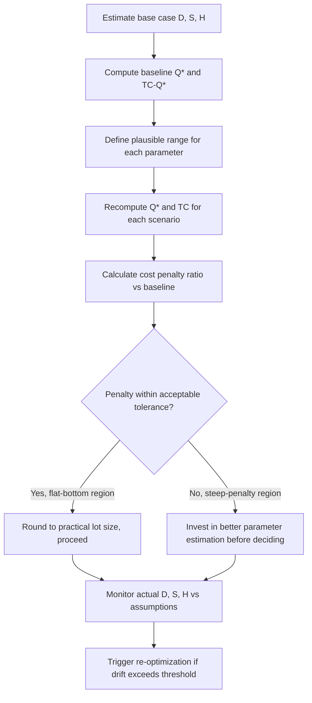

## Sensitivity Analysis of the EOQ Model

### Purpose and Scope

Sensitivity analysis of the EOQ model examines how the optimal order quantity $Q^*$ and the resulting total relevant cost $TC(Q^*)$ respond to errors, uncertainty, or deliberate deviations in the model's input parameters — demand rate $D$, ordering cost $S$, holding cost $H$, and the chosen order quantity itself. Because EOQ inputs are rarely known with perfect precision in practice (forecasted demand, estimated holding cost rates, negotiated ordering costs), understanding the model's sensitivity is essential for assessing how much precision is actually required and how much risk is embedded in a given EOQ-based decision.

This builds directly on the EOQ derivation: $Q^* = \sqrt{2DS/H}$ and $TC(Q^*) = \sqrt{2DSH}$.

### Why Sensitivity Analysis Matters Here

- Parameters like $D$, $S$, and $H$ are typically estimates, not certainties — $D$ comes from a forecast, $H$ from an assumed capital cost rate, $S$ from an averaged administrative cost
- Practical order quantities are often rounded to case packs, pallet quantities, or supplier MOQs, which deviate from the exact mathematical optimum
- Decision-makers need to know whether small errors in inputs produce small or large cost consequences, to prioritize estimation effort accordingly
- It provides the formal justification for common practitioner heuristics (e.g., "close enough" rounding of EOQ results)

### Sensitivity of Q* to Individual Parameters

Because $Q^*$ is a square-root function of $D$, $S$, and $H$, its elasticity with respect to each parameter is exactly $\pm 0.5$ — a direct mathematical consequence of the functional form, not an approximation.

**Elasticity of $Q^*$ with respect to $D$:**

$$\frac{\partial Q^*}{\partial D} = \frac{1}{2}\sqrt{\frac{2S}{DH}}$$

Expressed as elasticity (percentage change in $Q^*$ per percentage change in $D$):

$$E_{Q^*,D} = \frac{\partial Q^*}{\partial D} \cdot \frac{D}{Q^*} = \frac{1}{2}$$

This means a 1% increase in demand produces approximately a 0.5% increase in $Q^*$ — this sub-proportional response is the "square root law" property in elasticity form.

**Elasticity of $Q^*$ with respect to $S$:**

$$E_{Q^*,S} = \frac{1}{2}$$

**Elasticity of $Q^*$ with respect to $H$:**

$$E_{Q^*,H} = -\frac{1}{2}$$

(Negative, since higher holding cost pushes toward smaller, more frequent orders.)

**General rule:** for any parameter $D$, $S$ appearing in the numerator under the square root, or $H$ in the denominator, a $p\%$ error in that parameter produces approximately a $\frac{p}{2}\%$ error in $Q^*$, for small to moderate $p$. This is the single most important sensitivity result of the classical EOQ model: all three primary cost drivers have identical (in magnitude) 0.5 elasticity.

### Cost Penalty Function for Non-Optimal Order Quantities

The more operationally important sensitivity result concerns the *cost consequence* of ordering a quantity $Q \ne Q^*$, since this is the scenario planners actually face (rounding to pack sizes, supplier constraints, forecast error propagating into the wrong $Q$).

Define $k = Q / Q^*$ as the ratio of the actual order quantity to the true optimum. Substituting $Q = kQ^*$ into the total cost function and simplifying against $TC(Q^*)$ yields the **cost penalty ratio**:

$$\frac{TC(kQ^*)}{TC(Q^*)} = \frac{1}{2}\left(k + \frac{1}{k}\right)$$

This closed-form result is derived directly from the total cost function $TC(Q) = \frac{D}{Q}S + \frac{Q}{2}H$ and the identity $TC(Q^*) = \sqrt{2DSH}$; it depends only on $k$, not on the specific values of $D$, $S$, or $H$ — making it a universal diagnostic applicable to any EOQ scenario.

**Cost penalty table:**

| $k$ (Q/Q*) | Deviation from Q* | Cost Penalty Ratio | % Cost Increase |
| --- | --- | --- | --- |
| 0.5 | −50% | 1.25 | 25.0% |
| 0.7 | −30% | 1.114 | 11.4% |
| 0.8 | −20% | 1.025 | 2.5% |
| 0.9 | −10% | 1.006 | 0.6% |
| 1.0 | 0% (exact optimum) | 1.000 | 0.0% |
| 1.1 | +10% | 1.005 | 0.5% |
| 1.2 | +20% | 1.017 | 1.7% |
| 1.25 | +25% | 1.025 | 2.5% |
| 1.5 | +50% | 1.083 | 8.3% |
| 2.0 | +100% | 1.250 | 25.0% |

**Key interpretation — the "flat bottom" property:** the cost curve is markedly asymmetric-tolerant near $k=1$; deviations of ±20% from $Q^*$ produce only about a 2.5% cost penalty. This is the formal basis for rounding EOQ results to practical lot sizes without material financial consequence.

**Symmetry property:** note that $k$ and $1/k$ produce identical cost penalties (e.g., $k=0.8$ and $k=1.25$ both yield 1.025), since $\frac{1}{2}(k + 1/k) = \frac{1}{2}(1/k + k)$. This means underordering by a given percentage and overordering by the reciprocal percentage are cost-equivalent — a useful symmetry when deciding whether to round a lot size up or down.

### Worked Sensitivity Example

Base case (from the EOQ derivation topic): $D = 12{,}000$, $S = \$50$, $H = \$4$, giving $Q^* \approx 547.7$, $TC(Q^*) \approx \$2{,}190.89$.

**Scenario 1 — Demand forecast is 20% higher than assumed ($D = 14{,}400$):**

$$Q^*_{new} = \sqrt{\frac{2 \times 14{,}400 \times 50}{4}} = \sqrt{360{,}000} \approx 600.0$$

Elasticity check: $\%\Delta D = 20\%$, predicted $\%\Delta Q^* \approx 10\%$; actual: $(600.0 - 547.7)/547.7 \approx 9.55\%$ — closely matching the 0.5-elasticity prediction (small discrepancy due to the linear elasticity approximation versus the exact nonlinear square-root function).

**Scenario 2 — Planner rounds Q* to a supplier case-pack multiple of 500 instead of 547.7:**

$$k = \frac{500}{547.7} \approx 0.913$$

$$\text{Cost penalty ratio} = \frac{1}{2}\left(0.913 + \frac{1}{0.913}\right) = \frac{1}{2}(0.913 + 1.095) = \frac{1}{2}(2.008) \approx 1.004$$

Only a 0.4% cost increase — confirming that rounding to a practical case-pack size in this example is essentially costless relative to the exact mathematical optimum.

**Scenario 3 — Holding cost rate was underestimated; true $H = \$6$ instead of $\$4$ (50% underestimate):**

$$Q^*_{true} = \sqrt{\frac{2 \times 12{,}000 \times 50}{6}} = \sqrt{200{,}000} \approx 447.2$$

If the planner continues ordering the originally-computed $Q = 547.7$ (based on the wrong $H$) while true $H = 6$:

$$k = \frac{547.7}{447.2} \approx 1.225$$

$$\text{Cost penalty ratio} = \frac{1}{2}\left(1.225 + \frac{1}{1.225}\right) = \frac{1}{2}(1.225 + 0.816) = \frac{1}{2}(2.041) \approx 1.020$$

A 50% error in the holding cost estimate produces only about a 2% cost penalty when following the (wrong) resulting order quantity — again illustrating the model's structural robustness to input estimation error, given the square-root relationship.

### Combined Multi-Parameter Sensitivity

When multiple parameters are simultaneously uncertain, the effects compound, but not linearly, since $Q^* \propto \sqrt{D \cdot S / H}$. If $D$ is overestimated by $x\%$ and $H$ is underestimated by $y\%$ simultaneously, the combined effect on $Q^*$ approximates:

$$\%\Delta Q^* \approx \frac{1}{2}(\%\Delta D) - \frac{1}{2}(\%\Delta H \text{ in denominator direction})$$

For rigorous analysis of compounded parameter uncertainty, practitioners commonly use Monte Carlo simulation — sampling $D$, $S$, $H$ from assumed probability distributions and computing the resulting distribution of $Q^*$ and $TC(Q^*)$ — rather than relying solely on the closed-form elasticity approximations, since interaction effects between simultaneously varying parameters are not fully captured by single-parameter sensitivity alone. [Inference — the choice between closed-form approximation and simulation is a practitioner judgment call depending on the required precision and the degree of parameter correlation in a given context.]

### Sensitivity Analysis Process Flow

### Practical Decision Rules Derived from Sensitivity Results

- **Rounding tolerance**: Deviations of up to ±20% from the exact $Q^*$ typically cost less than 3% in total relevant cost — a widely usable rule of thumb for rounding to case packs, pallets, or supplier lot-size constraints
- **Estimation effort allocation**: Because all three parameters ($D$, $S$, $H$) have equal (0.5) elasticity, no single parameter deserves disproportionately more estimation precision than another on purely mathematical grounds — practical prioritization should instead follow which parameter has the *largest plausible estimation error* in a given business context (demand forecast error is often the largest source of real-world uncertainty)
- **When sensitivity analysis flags real risk**: The flat-bottom property weakens as $k$ moves further from 1 — at $k=2$ or $k=0.5$, the penalty jumps to 25%, meaning gross misestimation (not minor rounding) is where financial risk becomes material, warranting more rigorous demand planning or cost-rate validation
- **Break-even reasoning for negotiating parameters**: The same cost penalty formula can be inverted to evaluate whether negotiating a reduced ordering cost $S$ (e.g., via EDI automation reducing administrative overhead) or a reduced holding cost rate $i$ justifies the investment, by comparing the resulting $TC(Q^*)$ before and after the change

### Relationship to Broader Model Robustness Literature

The result that EOQ cost is relatively insensitive to quantity and parameter errors is a well-established property of the classical model and is frequently cited as a primary justification for its continued practical use despite its restrictive assumptions (constant demand, zero lead time variability, no discounts) — the model's prescriptive value lies less in delivering an exact $Q^*$ and more in providing a robust, low-regret order-of-magnitude answer even under meaningful parameter uncertainty. [Inference — this characterization reflects a common practitioner and textbook framing of EOQ's value proposition, not a universally quantified claim across all industry contexts.]

### Limitations of the Sensitivity Results

- **Assumes the cost function form itself is correct**: If the true holding or ordering cost relationship is nonlinear (e.g., step-function ordering costs from shipping container capacity, or holding costs with storage-space nonlinearities), the elegant $\frac{1}{2}(k+1/k)$ penalty formula no longer applies directly
- **Single-scenario sensitivity, not full distributional risk**: Basic sensitivity analysis (varying one parameter at a time) does not capture correlated risk (e.g., demand and holding cost both moving adversely at once) — full risk quantification requires simulation-based approaches
- **Does not address service-level risk**: EOQ sensitivity analysis concerns cost efficiency of lot sizing only; it says nothing about stockout risk, which is governed separately by safety stock and reorder point parameters under demand uncertainty — the two forms of risk (lot-sizing cost risk vs. stockout risk) must be evaluated with distinct frameworks

**Related Topics**

- Economic order quantity derivation and assumptions
- Monte Carlo simulation for inventory parameter uncertainty
- EOQ with quantity discounts and step-cost sensitivity
- Reorder point and safety stock under demand uncertainty (stochastic risk, distinct from EOQ cost sensitivity)
- Holding cost rate estimation and cost of capital sensitivity
- Lot-size rounding heuristics and supplier MOQ negotiation
- Joint replenishment sensitivity across correlated SKUs