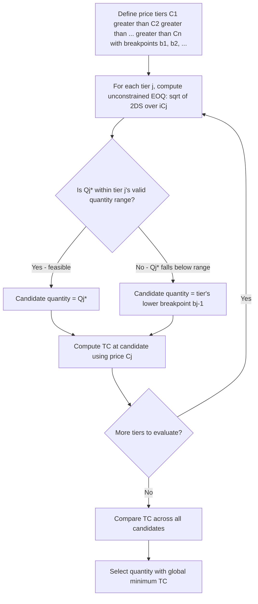

## EOQ with Quantity Discounts

### Definition and Purpose

The EOQ with quantity discounts model extends the classical EOQ framework to situations where a supplier offers a reduced unit purchase price for orders that meet or exceed specified quantity breakpoints. Unlike the base EOQ model, which excludes purchase cost from the relevant cost function (since it is invariant to $Q$ when price is constant), this extension must explicitly include purchase cost, because it now varies with the order quantity chosen — creating a genuine trade-off between unit price savings, holding cost increases, and ordering cost reductions.

Two standard variants exist: **all-units discounts** (the reduced price applies to every unit in the order once the breakpoint is reached) and **incremental discounts** (the reduced price applies only to units beyond the breakpoint, with earlier units still priced at the higher tier). All-units discounts are far more common in practice and are the primary focus of the standard algorithm.

### Total Cost Function with Purchase Cost Included

$$TC(Q) = \frac{D}{Q}S + \frac{Q}{2}H(C) + D \cdot C$$

where $C$ is the unit purchase price for the relevant price tier, and $D \cdot C$ is annual purchase cost — now a decision-relevant term because $C$ depends on which price break is selected. Because holding cost is frequently defined as a percentage of unit value ($H = i \cdot C$), $H$ itself changes across price tiers, which is the key mechanical complication versus the base EOQ model.

$$TC(Q) = \frac{D}{Q}S + \frac{Q}{2}(iC) + DC$$

### Price Break Structure (All-Units Discount)

A typical discount schedule specifies quantity ranges, each with its own unit price:

| Price Break (j) | Quantity Range | Unit Price $C_j$ |
| --- | --- | --- |
| 1 | $0 \le Q < b_1$ | $C_1$ (highest) |
| 2 | $b_1 \le Q < b_2$ | $C_2$ |
| 3 | $b_2 \le Q < b_3$ | $C_3$ |
| ... | ... | ... |
| n | $Q \ge b_{n-1}$ | $C_n$ (lowest) |

where $b_1 < b_2 < \ldots < b_{n-1}$ are the breakpoint quantities and $C_1 > C_2 > \ldots > C_n$.

### The Standard Solution Algorithm

Because $H$ varies by price tier (when $H = iC$), a separate EOQ must be computed for each price tier, and each result must be checked for **feasibility** — whether the computed $Q^*_j$ actually falls within the quantity range that qualifies for price $C_j$. This feasibility check is the step most often mishandled in naive application of the base EOQ formula to a discount schedule.

**Step 1 — Compute the EOQ for each price tier, from the lowest price upward (or all tiers, per convention):**

$$Q^*_j = \sqrt{\frac{2DS}{iC_j}}$$

**Step 2 — Check feasibility of each $Q^*_j$ against its own tier's quantity range:**

- If $Q^*_j$ falls within tier $j$'s valid range → **feasible**, retain as a candidate
- If $Q^*_j$ falls *below* tier $j$'s range → infeasible; the true cost-minimizing quantity for that tier is the tier's lower breakpoint $b_{j-1}$ (the smallest quantity that still qualifies for price $C_j$) — because total cost is convex and the unconstrained minimum lies to the left of the feasible region, so the constrained minimum sits at the boundary
- If $Q^*_j$ falls *above* tier $j$'s range → this case cannot occur under standard all-units discount structures where $H$ decreases as $C$ decreases, since a lower price tier's unconstrained EOQ is always larger, not smaller, than the tier below it [standard property of the algorithm under the conventional assumption that price decreases and EOQ increases monotonically across tiers]

**Step 3 — Compute total cost $TC(Q)$ at each feasible candidate quantity (either the tier's own $Q^*_j$ if feasible, or the tier's lower breakpoint if the unconstrained EOQ was infeasible), using that tier's price $C_j$ throughout the cost formula.**

**Step 4 — Select the quantity with the globally lowest total cost across all evaluated candidates.**

### Algorithm Flow Diagram

### Worked Numerical Example

A retailer purchases a SKU with:

- Annual demand $D = 5{,}000$ units/year
- Ordering cost $S = \$40$ per order
- Holding cost rate $i = 20\%$ of unit value annually

**Price schedule:**

| Tier | Quantity Range | Unit Price $C_j$ |
| --- | --- | --- |
| 1 | 1–499 | $10.00 |
| 2 | 500–999 | $9.80 |
| 3 | 1000+ | $9.60 |

**Tier 1 ($C_1 = \$10.00$):**

$$Q^*_1 = \sqrt{\frac{2 \times 5{,}000 \times 40}{0.20 \times 10.00}} = \sqrt{\frac{400{,}000}{2}} = \sqrt{200{,}000} \approx 447.2$$

Feasibility check: 447.2 falls within the range 1–499 → **feasible**. Candidate: $Q = 447.2$.

**Tier 2 ($C_2 = \$9.80$):**

$$Q^*_2 = \sqrt{\frac{2 \times 5{,}000 \times 40}{0.20 \times 9.80}} = \sqrt{\frac{400{,}000}{1.96}} \approx \sqrt{204{,}082} \approx 451.8$$

Feasibility check: 451.8 falls *below* the range 500–999 → **infeasible**. Candidate becomes the tier's lower breakpoint: $Q = 500$.

**Tier 3 ($C_3 = \$9.60$):**

$$Q^*_3 = \sqrt{\frac{2 \times 5{,}000 \times 40}{0.20 \times 9.60}} = \sqrt{\frac{400{,}000}{1.92}} \approx \sqrt{208{,}333} \approx 456.4$$

Feasibility check: 456.4 falls below the range 1000+ → **infeasible**. Candidate becomes the tier's lower breakpoint: $Q = 1{,}000$.

**Step 3 — Compute total cost at each candidate:**

*Candidate A: $Q = 447.2$, $C = \$10.00$*

$$TC = \frac{5{,}000}{447.2}(40) + \frac{447.2}{2}(0.20 \times 10.00) + 5{,}000(10.00)$$

$$= 447.21 + 447.20 + 50{,}000 = \$50{,}894.41$$

*Candidate B: $Q = 500$, $C = \$9.80$*

$$TC = \frac{5{,}000}{500}(40) + \frac{500}{2}(0.20 \times 9.80) + 5{,}000(9.80)$$

$$= 400.00 + 490.00 + 49{,}000 = \$49{,}890.00$$

*Candidate C: $Q = 1{,}000$, $C = \$9.60$*

$$TC = \frac{5{,}000}{1{,}000}(40) + \frac{1{,}000}{2}(0.20 \times 9.60) + 5{,}000(9.60)$$

$$= 200.00 + 960.00 + 48{,}000 = \$49{,}160.00$$

**Result:** Candidate C ($Q = 1{,}000$ at the top price tier) yields the lowest total cost, $49,160.00 — even though it is far from that tier's own unconstrained EOQ (456.4) and far larger than the mathematically "ideal" tier-1 quantity. This illustrates the central insight of the discount model: **the globally optimal quantity is often driven by the price break structure itself, not by the holding/ordering cost balance alone** — the purchase cost savings ($800/year moving from tier 2 to tier 3 pricing) outweigh the additional holding cost incurred from carrying more average inventory.

### Key Structural Insights

- **The purchase cost term typically dominates the decision** when price differentials between tiers are meaningful relative to $S$ and $H$, since $D \cdot C$ scales with total annual volume while the ordering/holding trade-off operates on a much smaller cost base — this is why the "obvious" EOQ from the base formula is frequently not the actual optimal quantity once discounts are introduced
- **Only boundary quantities and true unconstrained optima are ever candidates** — the total cost function within each price tier is convex, so the minimum within a feasible tier is either the interior unconstrained EOQ (if it falls in range) or the tier's lower boundary (if the unconstrained EOQ falls below the range); no other quantity within a tier can be optimal
- **Higher price tiers are never worth exceeding their minimum efficient quantity** — once a tier's price is locked in, ordering more than the interior EOQ for that tier (when feasible) only adds unnecessary holding cost without further price benefit

### Incremental Discount Variant (Brief Contrast)

In an incremental discount schedule, the discounted price applies only to units purchased beyond the breakpoint, not to the entire order. The total purchase cost function becomes piecewise and requires computing an *effective average unit cost* $\bar{C}(Q)$ for a given $Q$, since the average price paid depends on how many units fall into each price segment:

$$\bar{C}(Q) = C_1 + \sum_{k=1}^{j-1}(C_{k+1} - C_k)\frac{(b_k)}{Q} \quad \text{[schedule-dependent; exact form depends on breakpoint structure]}$$

The optimization proceeds similarly (piecewise EOQ per segment, with feasibility checks), but the cost function's shape differs from the all-units case, and the resulting incentive to reach a breakpoint is weaker than under all-units discounts, since only the marginal units — not the whole order — benefit from the lower price. [Inference — incremental discount structures are considerably less common in standard commercial purchasing than all-units discounts, so this variant is presented for conceptual completeness rather than as the primary operational case.]

### Practical Extensions and Considerations

- **Freight/transportation breaks**: Many real-world "discounts" are effectively freight cost breaks (e.g., free freight over a threshold, full truckload economics) rather than formal unit-price discounts — these can be modeled analogously by treating the freight savings as an adjustment to effective $S$ or $C$ at the relevant threshold
- **Cash flow and working capital limits**: Selecting a larger $Q$ to capture a price break increases upfront capital commitment; organizations with capital constraints may need to evaluate the discount decision against a budget constraint, not purchase cost alone
- **Obsolescence and shelf-life risk**: For perishable or fashion/seasonal goods, a larger order quantity to capture a discount carries elevated markdown or write-off risk not captured in the standard holding cost term — this risk should be evaluated qualitatively or via an inflated effective holding cost rate for such categories
- **Supplier-side motivations**: Quantity discount schedules are often designed by suppliers to shift inventory holding costs onto the buyer or to secure larger, less frequent orders that reduce the supplier's own production/changeover costs — recognizing this can inform negotiation strategy, though this is a commercial rather than purely mathematical consideration

### Common Implementation Errors

- **Applying the base EOQ formula using only the lowest tier's price** without checking feasibility, which can recommend an infeasible (too-small) quantity that would not actually qualify for the assumed discount
- **Failing to recompute $H$ per tier** when holding cost is defined as $i \times C$ — since $C$ changes by tier, using a single fixed $H$ across all tiers understates the true holding cost differential between price levels
- **Omitting the boundary-quantity candidates** and only evaluating each tier's unconstrained $Q^*_j$, which misses the true optimum when (as in the worked example) the unconstrained EOQ for a tier falls outside that tier's valid range

**Related Topics**

- Economic order quantity derivation and assumptions
- Sensitivity analysis of the EOQ model
- Incremental (marginal) quantity discount cost structures
- Freight and transportation cost breaks in lot-sizing decisions
- Working capital constraints in inventory ordering decisions
- Supplier negotiation strategy and total cost of ownership
- Joint replenishment across multiple SKUs from a single supplier