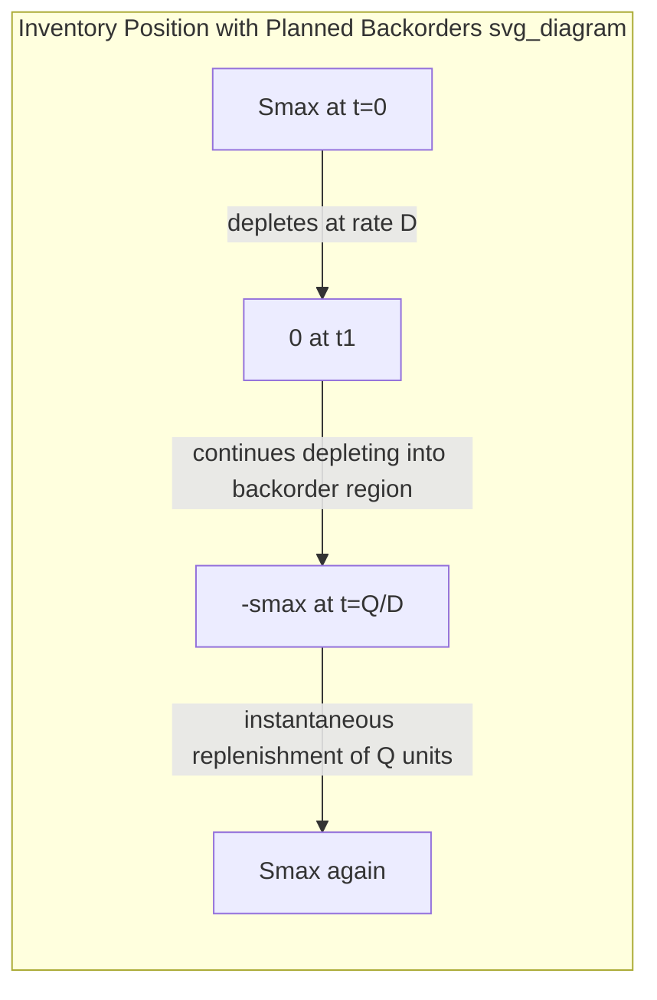
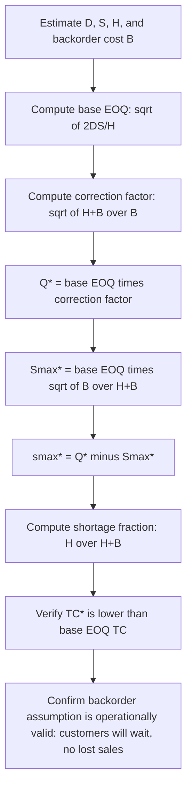

## EOQ with Planned Backorders

### Definition and Purpose

The EOQ with planned backorders model (also called the EOQ with shortages or backorder model) extends the classical EOQ by relaxing the "no stockouts allowed" assumption. Instead of requiring inventory to remain non-negative at all times, this model deliberately permits inventory to run out for a controlled portion of each order cycle, with unmet demand accumulated as backorders that are fulfilled immediately upon the next replenishment arrival. This is appropriate when customers are willing to wait (backorder rather than lost sale) and when the shortage cost is low enough relative to holding cost that planned, bounded stockouts reduce total system cost.

This model remains fully deterministic — demand rate, lead time, and all costs are known with certainty. The uncertainty-driven stockout risk addressed by safety stock models is a distinct problem; here, shortages are a *planned, scheduled* feature of the cycle, not a response to demand variability.

### Additional Assumption Beyond Base EOQ

All base EOQ assumptions still apply (constant demand rate $D$, instantaneous replenishment, fixed ordering cost $S$, linear holding cost $H$), with one assumption relaxed:

- **Shortages are permitted and fully backordered** — no sales are lost; every unit of unmet demand is recorded as a backorder and shipped as soon as new stock arrives
- **A backorder cost $B$ (or $\pi$) is incurred per unit backordered per unit time** it remains unfulfilled, representing goodwill loss, expediting cost, or contractual penalty — analogous in structure to holding cost but applied to the shortage quantity instead of the on-hand quantity

### Inventory Position Over Time (Modified Sawtooth with Negative Region)

Under this model, inventory position now cycles between a positive maximum $S_{max}$ (inventory level immediately after replenishment) and a negative minimum $-s_{max}$ (maximum backorder quantity, reached immediately before the next replenishment arrives). The full order quantity $Q$ replenishes both the positive on-hand stock and simultaneously clears the accumulated backorders.

The cycle divides into two phases:

- **Phase 1 (duration $t_1$)**: Inventory positive, depleting from $S_{max}$ to 0 — holding cost accrues
- **Phase 2 (duration $t_2$)**: Inventory negative (backorders accumulating), from 0 down to $-s_{max}$ — backorder cost accrues

### Decision Variables

Unlike base EOQ (one decision variable, $Q$), this model has **two** decision variables:

- $Q$ — the total order quantity per cycle
- $S_{max}$ — the maximum on-hand inventory level reached immediately after replenishment (equivalently, $s_{max} = Q - S_{max}$ is the maximum backorder level reached just before replenishment)

### Total Cost Function

The relevant annual cost now has three components: ordering cost, holding cost (computed only over the positive-inventory phase), and backorder cost (computed only over the negative-inventory phase).

**Average inventory during the positive phase:**

$$\bar{I}_{+} = \frac{S_{max}^2}{2Q}$$

**Average backorder level during the negative phase:**

$$\bar{I}_{-} = \frac{(Q - S_{max})^2}{2Q}$$

**Total annual relevant cost:**

$$TC(Q, S_{max}) = \frac{D}{Q}S + \frac{H \cdot S_{max}^2}{2Q} + \frac{B \cdot (Q - S_{max})^2}{2Q}$$

### Derivation via Joint Optimization

Taking partial derivatives with respect to both decision variables and setting them to zero:

**Partial derivative with respect to $S_{max}$:**

$$\frac{\partial TC}{\partial S_{max}} = \frac{H \cdot S_{max}}{Q} - \frac{B(Q - S_{max})}{Q} = 0$$

Solving:

$$H \cdot S_{max} = B(Q - S_{max})$$

$$S_{max}(H + B) = BQ$$

$$S_{max}^* = Q \cdot \frac{B}{H+B}$$

**Partial derivative with respect to $Q$**, after substituting $S_{max}^*$ back in and simplifying, yields the optimal order quantity:

$$Q^* = \sqrt{\frac{2DS}{H}} \cdot \sqrt{\frac{H+B}{B}}$$

Substituting $Q^*$ back into the $S_{max}^*$ expression:

$$S_{max}^* = \sqrt{\frac{2DS}{H}} \cdot \sqrt{\frac{B}{H+B}}$$

### Structural Relationship to Base EOQ

Both formulas contain the base EOQ term $\sqrt{2DS/H}$ multiplied by a correction factor driven by the ratio of backorder cost to holding cost:

$$Q^* = Q_{EOQ} \cdot \sqrt{\frac{H+B}{B}}$$

$$S_{max}^* = Q_{EOQ} \cdot \sqrt{\frac{B}{H+B}}$$

where $Q_{EOQ} = \sqrt{2DS/H}$ is the classical (no-backorder) EOQ.

**Key structural insight:** since $\sqrt{(H+B)/B} > 1$ for any finite positive $B$, the optimal order quantity under planned backorders is always **larger** than the classical no-shortage EOQ. This is intuitive: allowing shortages effectively lets the firm "stretch" each order cycle longer, spreading the fixed ordering cost $S$ over more units while trading a portion of holding cost for (cheaper, by assumption) backorder cost.

**Limiting behavior — sanity checks:**

- As $B \to \infty$ (backorders infinitely costly — equivalent to backorders effectively prohibited): $\sqrt{(H+B)/B} \to 1$, so $Q^* \to Q_{EOQ}$ and $S_{max}^* \to Q_{EOQ}$ — the model collapses back to classical EOQ with zero shortages, as expected
- As $B \to 0$ (backorders costless): $Q^* \to \infty$ and $S_{max}^* \to 0$ — the model degenerates toward never holding inventory at all and always backordering, which is the mathematically correct (if operationally extreme) limiting case

### Minimum Total Cost

$$TC(Q^*, S_{max}^*) = \sqrt{2DSH} \cdot \sqrt{\frac{B}{H+B}}$$

Since $\sqrt{B/(H+B)} < 1$ for finite $H, B > 0$, the minimum total cost under the backorder model is always **lower** than the base EOQ's minimum cost $\sqrt{2DSH}$ — confirming that relaxing the no-shortage constraint can only weakly improve (never worsen) the achievable minimum cost, since the backorder model is a generalization that includes the no-shortage case as a limiting scenario.

### Derived Metrics

**Maximum backorder level:**

$$s_{max}^* = Q^* - S_{max}^* = Q_{EOQ}\sqrt{\frac{H+B}{B}} - Q_{EOQ}\sqrt{\frac{B}{H+B}} = Q_{EOQ} \cdot \frac{H}{\sqrt{B(H+B)}}$$

**Fraction of cycle time in stockout (shortage fraction):**

$$\frac{t_2}{T} = \frac{s_{max}^*}{Q^*} = \frac{H}{H+B}$$

This is a particularly interpretable result: the proportion of each cycle spent in a stockout state depends *only* on the ratio of holding cost to the sum of holding and backorder costs — not on $D$ or $S$ directly. A low backorder cost relative to holding cost pushes this fraction higher (more time spent deliberately out of stock); a high backorder cost pushes it toward zero.

### Worked Numerical Example

A distributor with:

- Annual demand $D = 10{,}000$ units/year
- Ordering cost $S = \$60$ per order
- Holding cost $H = \$5$ per unit per year
- Backorder cost $B = \$20$ per unit per year (customers tolerate short waits but expediting/goodwill cost applies)

**Base EOQ (no backorders, for comparison):**

$$Q_{EOQ} = \sqrt{\frac{2 \times 10{,}000 \times 60}{5}} = \sqrt{240{,}000} \approx 489.9$$

**Optimal order quantity with backorders:**

$$Q^* = 489.9 \times \sqrt{\frac{5+20}{20}} = 489.9 \times \sqrt{1.25} = 489.9 \times 1.118 \approx 547.7$$

**Optimal maximum on-hand level:**

$$S_{max}^* = 489.9 \times \sqrt{\frac{20}{25}} = 489.9 \times \sqrt{0.8} = 489.9 \times 0.894 \approx 438.2$$

**Maximum backorder level:**

$$s_{max}^* = 547.7 - 438.2 = 109.5 \text{ units}$$

**Shortage fraction of cycle:**

\frac{t_2}{T} = \frac{5}{5+20} = \frac{5}{25} = 0.20 \text{ (20% of each cycle spent in backorder status)}

**Minimum total cost:**

$$TC^* = \sqrt{2 \times 10{,}000 \times 60 \times 5} \times \sqrt{\frac{20}{25}} = \sqrt{6{,}000{,}000} \times 0.894 \approx 2{,}449.49 \times 0.894 \approx \$2{,}190.03$$

For comparison, the base EOQ total cost would be $\sqrt{2{,}400{,}000} \approx \$1{,}549.19$ — wait, recomputing consistently: $TC_{EOQ} = \sqrt{2DSH} = \sqrt{2 \times 10{,}000 \times 60 \times 5} = \sqrt{6{,}000{,}000} \approx \$2{,}449.49$. The backorder model's minimum cost of ≈$2,190.03 is indeed lower than the no-shortage EOQ cost of ≈$2,449.49, confirming the expected direction of the result — permitting planned shortages reduces total system cost by roughly 10.6% in this example, given the assumed backorder cost structure.

### Solution Process Flow

### When This Model Is Appropriate vs. Inappropriate

**Appropriate when:**

- Customers reliably wait for backordered items rather than switching to a competitor (common in B2B, made-to-order, or contractually obligated supply relationships)
- Backorder cost can be reasonably estimated (e.g., expedite shipping cost, contractual penalty clauses, quantifiable goodwill impact)
- The item is not subject to a hard service-level requirement or SLA that prohibits stockouts entirely

**Inappropriate or requires caution when:**

- Demand is not actually deterministic — in reality, most "backorder" scenarios involve demand uncertainty, in which case this model should be treated as a stylized deterministic approximation, not a direct substitute for stochastic backorder/lost-sales inventory models that explicitly incorporate demand variability and safety stock
- Lost sales (rather than backorders) are the realistic customer response to a stockout — a different model (EOQ with lost sales, sometimes formulated as a special limiting case) applies instead, since the cost structure and optimal policy differ meaningfully when unmet demand is lost rather than deferred
- Backorder cost is difficult to quantify with confidence — since the optimal solution is sensitive to the $B/H$ ratio, a poorly estimated $B$ can materially mis-specify the recommended policy

### Sensitivity to the Backorder Cost Ratio

The shortage fraction $t_2/T = H/(H+B)$ and the correction factors are both governed entirely by the ratio $B/H$, meaning the practical planning question reduces to estimating this ratio accurately rather than each cost in isolation. A low $B/H$ ratio (backorder cost similar to or lower than holding cost) pushes the model toward large order quantities and substantial planned stockout time; a high $B/H$ ratio (backorders much more costly than holding) pushes the solution back toward the classical no-shortage EOQ. [Inference — because this ratio is often difficult to estimate precisely in practice (goodwill and reputational costs are inherently soft), practitioners frequently treat the backorder EOQ model as a conceptual/directional tool rather than a source of a precise operational order quantity.]

### Distinction from Stochastic Safety Stock Models

It is important not to conflate this deterministic backorder model with stochastic inventory models that address demand uncertainty (e.g., reorder point models with safety stock, or the newsvendor model). This model assumes perfect knowledge of demand and deliberately schedules shortages as a cost-minimization choice within a fully predictable cycle. Stochastic models, by contrast, address *unplanned* shortage risk arising from demand or lead-time variability, and their safety stock calculations are a fundamentally separate mechanism from the $S_{max}$/$s_{max}$ split derived here. In practice, a firm might apply both frameworks in combination — using the deterministic backorder-adjusted $Q^*$ for lot sizing, while separately layering a safety stock buffer to protect against demand variability within each cycle. [Inference — combining the two frameworks in this way is a common practitioner extension, but the classical backorder EOQ model itself does not formally integrate demand variability.]

### Limitations

- **Requires accurate backorder cost estimation**: Unlike holding cost, which has relatively observable components (capital cost, storage, insurance), backorder/goodwill cost is often intangible and difficult to quantify with confidence
- **Assumes unlimited customer patience within the model's shortage window**: The model does not cap how long a customer will tolerate waiting; if real customers have a maximum patience threshold, $s_{max}^*$ should be checked against that threshold as a feasibility constraint
- **Deterministic demand assumption remains a significant simplification**, as with base EOQ — real-world application typically requires layering stochastic considerations on top

**Related Topics**

- Economic order quantity derivation and assumptions
- Sensitivity analysis of the EOQ model
- EOQ with lost sales (stockout without backorder fulfillment)
- Stochastic reorder point models and safety stock under demand uncertainty
- Newsvendor model and critical ratio for single-period shortage decisions
- Service level differentiation and acceptable stockout policy by item class
- Economic Production Quantity (EPQ) for finite replenishment rate scenarios