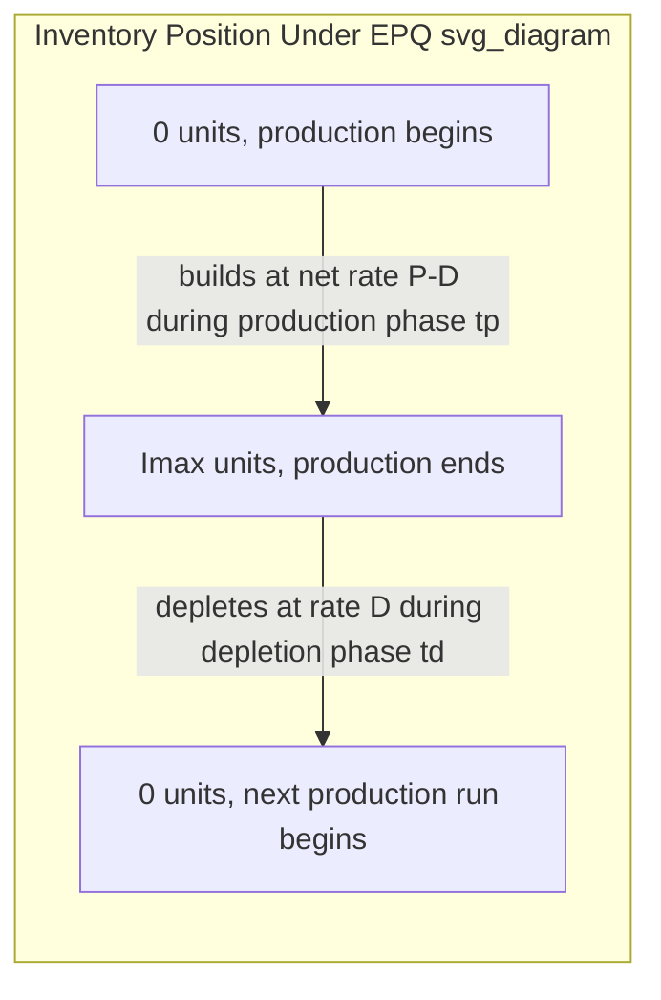
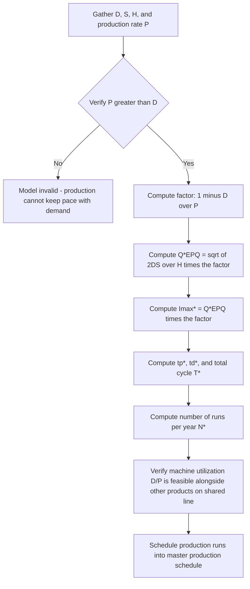

## Economic Production Quantity for Batch Manufacturing

### Definition and Purpose

The Economic Production Quantity (EPQ) model — also called the Economic Manufacturing Quantity (EMQ) or, in some texts, the "EOQ with finite replenishment rate" — extends the classical EOQ by relaxing the instantaneous replenishment assumption. Instead of an entire order quantity arriving at once, EPQ models a scenario where units are produced (or received) gradually at a finite production rate $P$, while demand simultaneously depletes inventory at rate $D$, with the constraint that $P > D$ (production must outpace consumption, or inventory could never accumulate). This model directly applies to internal batch manufacturing decisions — determining the optimal production run/batch size — rather than external supplier purchase order sizing, which is EOQ's traditional domain.

### The Key Structural Difference from EOQ

In base EOQ, inventory arrives instantaneously and depletes linearly, forming a sharp sawtooth. In EPQ, inventory builds up gradually during the **production phase** (while the machine/line is actively producing and demand is simultaneously being drawn down), then depletes linearly during the **depletion-only phase** (after production stops, once the batch is complete), forming a trapezoidal/triangular pattern with a shallower rise than the base EOQ's instantaneous jump.

### Inventory Position Over Time

During the production phase (duration $t_p$), inventory accumulates at the **net rate** $(P - D)$, not at $P$ alone, because demand continues to draw down stock even while production is adding to it. Once the batch quantity $Q$ has been produced, production stops, and inventory depletes at rate $D$ alone during the depletion phase (duration $t_d$) until it reaches zero, at which point the next production run begins.

### Deriving Maximum Inventory Level

Production phase duration:

$$t_p = \frac{Q}{P}$$

Maximum inventory level reached at the end of the production phase (accumulated at net rate $P-D$ over duration $t_p$):

$$I_{max} = (P - D) \cdot t_p = (P-D) \cdot \frac{Q}{P} = Q\left(1 - \frac{D}{P}\right)$$

This is the central structural result of the EPQ model: unlike base EOQ where maximum inventory equals the full batch quantity $Q$, here maximum inventory is only a *fraction* of $Q$, scaled down by the factor $(1 - D/P)$. As $P \to \infty$ (production becomes instantaneous), this factor approaches 1, and $I_{max} \to Q$ — correctly collapsing back to the base EOQ sawtooth pattern, confirming EPQ is a proper generalization of EOQ.

### Average Inventory Level

Because the inventory pattern is triangular (linear rise during production, linear fall during depletion) rather than the simple sawtooth of base EOQ, average inventory is half of the *maximum* level, not half of $Q$:

$$\bar{I} = \frac{I_{max}}{2} = \frac{Q}{2}\left(1 - \frac{D}{P}\right)$$

This is the key modification to the holding cost term relative to base EOQ.

### Total Cost Function

**Annual setup cost** (identical in form to ordering cost in EOQ, but representing machine/production line setup or changeover cost per batch, denoted $S$ or sometimes $C_s$):

$$TC_{setup} = \frac{D}{Q}S$$

**Annual holding cost** (using the reduced average inventory):

$$TC_{hold} = \frac{Q}{2}\left(1 - \frac{D}{P}\right)H$$

**Total annual relevant cost:**

$$TC(Q) = \frac{D}{Q}S + \frac{Q}{2}\left(1 - \frac{D}{P}\right)H$$

### Derivation of the Optimal Batch Size

Taking the derivative with respect to $Q$ and setting it to zero, following the identical calculus approach used in base EOQ:

$$\frac{d(TC)}{dQ} = -\frac{DS}{Q^2} + \frac{H}{2}\left(1 - \frac{D}{P}\right) = 0$$

Solving for $Q$:

$$\frac{H}{2}\left(1-\frac{D}{P}\right) = \frac{DS}{Q^2}$$

$$Q^2 = \frac{2DS}{H\left(1 - \frac{D}{P}\right)}$$

$$\boxed{Q^*_{EPQ} = \sqrt{\frac{2DS}{H\left(1 - \dfrac{D}{P}\right)}}}$$

**Second-order condition:** $\frac{d^2(TC)}{dQ^2} = \frac{2DS}{Q^3} > 0$ for all $Q>0$, confirming convexity and that the critical point is a global minimum, exactly as in base EOQ.

### Relationship to Base EOQ

$$Q^*_{EPQ} = Q_{EOQ} \cdot \frac{1}{\sqrt{1 - D/P}}$$

Since $0 < D/P < 1$ (production rate must exceed demand rate for the model to be valid), the term $1/\sqrt{1-D/P}$ is always greater than 1. **This means the optimal EPQ batch size is always larger than the equivalent base EOQ order quantity**, for identical $D$, $S$, and $H$ — an intuitive result: because inventory only accumulates at the slower net rate $(P-D)$ rather than arriving all at once, larger batches are needed to achieve the same effective holding cost trade-off against setup cost.

**Limiting behavior — sanity checks:**

- As $P \to \infty$: $D/P \to 0$, so $1/\sqrt{1-D/P} \to 1$, and $Q^*_{EPQ} \to Q_{EOQ}$ — correctly collapsing to base EOQ, confirming EOQ is the special case of EPQ with instantaneous replenishment
- As $P \to D$ (production rate barely exceeds demand): $D/P \to 1$, so $Q^*_{EPQ} \to \infty$ — the model correctly signals that batch size must grow unboundedly as the production system loses its capacity buffer relative to demand, since inventory can barely accumulate at all

### Minimum Total Cost

$$TC(Q^*_{EPQ}) = \sqrt{2DSH\left(1-\frac{D}{P}\right)}$$

This is the EOQ minimum cost formula $\sqrt{2DSH}$ scaled down by the factor $\sqrt{1-D/P}$, which is always less than or equal to 1 — meaning the achievable minimum total relevant cost under EPQ is always lower than or equal to the base EOQ minimum cost for the same $D$, $S$, $H$, reflecting the benefit of the reduced average inventory that gradual production accumulation provides.

### Derived Metrics

**Maximum inventory level at optimum:**

$$I^*_{max} = Q^*_{EPQ}\left(1 - \frac{D}{P}\right)$$

**Production run (batch) duration:**

$$t_p^* = \frac{Q^*_{EPQ}}{P}$$

**Depletion-only phase duration:**

$$t_d^* = \frac{I^*_{max}}{D}$$

**Total cycle time:**

$$T^* = t_p^* + t_d^* = \frac{Q^*_{EPQ}}{D}$$

**Number of production runs per year:**

$$N^* = \frac{D}{Q^*_{EPQ}}$$

**Machine/line utilization fraction** (proportion of each cycle the line is actively producing this item — relevant for capacity planning when the line also produces other items):

$$\text{Utilization} = \frac{t_p^*}{T^*} = \frac{D}{P}$$

### Worked Numerical Example

A manufacturer produces a component in-house with:

- Annual demand $D = 20{,}000$ units/year
- Production rate $P = 100{,}000$ units/year (line capacity)
- Setup cost $S = \$150$ per production run (labor, changeover, calibration)
- Holding cost $H = \$3$ per unit per year

**Check validity condition:** $P = 100{,}000 > D = 20{,}000$ ✓ (required for the model to be applicable)

**Base EOQ (for comparison, hypothetically treating replenishment as instantaneous):**

$$Q_{EOQ} = \sqrt{\frac{2 \times 20{,}000 \times 150}{3}} = \sqrt{2{,}000{,}000} \approx 1{,}414.2$$

**EPQ calculation:**

$$1 - \frac{D}{P} = 1 - \frac{20{,}000}{100{,}000} = 1 - 0.20 = 0.80$$

$$Q^*_{EPQ} = \sqrt{\frac{2 \times 20{,}000 \times 150}{3 \times 0.80}} = \sqrt{\frac{6{,}000{,}000}{2.4}} = \sqrt{2{,}500{,}000} = 1{,}581.1$$

Confirming the relationship: $Q_{EOQ}/\sqrt{0.80} = 1{,}414.2 / 0.894 \approx 1{,}581.1$ ✓

**Maximum inventory level:**

$$I^*_{max} = 1{,}581.1 \times 0.80 \approx 1{,}264.9 \text{ units}$$

**Production run duration:**

$$t_p^* = \frac{1{,}581.1}{100{,}000} \approx 0.01581 \text{ years} \approx 5.77 \text{ days}$$

**Depletion phase duration:**

$$t_d^* = \frac{1{,}264.9}{20{,}000} \approx 0.06325 \text{ years} \approx 23.09 \text{ days}$$

**Total cycle time:**

$$T^* = 5.77 + 23.09 \approx 28.85 \text{ days}$$

**Number of production runs per year:**

$$N^* = \frac{20{,}000}{1{,}581.1} \approx 12.65 \text{ runs/year}$$

**Minimum total annual cost:**

$$TC^* = \sqrt{2 \times 20{,}000 \times 150 \times 3 \times 0.80} = \sqrt{4{,}800{,}000} \approx \$2{,}190.89$$

For comparison, the (hypothetical, not actually applicable here) base EOQ cost would be $\sqrt{2 \times 20{,}000 \times 150 \times 3} = \sqrt{18{,}000{,}000} \approx \$4{,}242.64$ — nearly double — illustrating how significantly the finite production rate reduces achievable minimum cost by lowering average inventory carried.

### Solution Process Flow

### Practical Applications and Interpretation

- **In-house batch manufacturing lot sizing**: The primary use case — determining production batch sizes for items made internally rather than purchased, where setup/changeover cost plays the role of ordering cost
- **Shared production line capacity planning**: The utilization fraction $D/P$ is directly relevant when a single line produces multiple SKUs; the sum of utilization fractions across all products sharing the line cannot exceed available capacity, which can create a joint scheduling constraint beyond what the single-item EPQ model addresses in isolation
- **Setup cost reduction initiatives (lean/SMED linkage)**: Because $Q^*_{EPQ}$ scales with $\sqrt{S}$, investments in reducing setup/changeover time (e.g., Single-Minute Exchange of Die methodology) directly reduce optimal batch size, enabling smaller, more frequent runs — this is the classical mathematical link between EPQ theory and lean manufacturing's drive toward reduced batch sizes and setup times
- **Make-vs-buy cost comparison**: Comparing $TC^*_{EPQ}$ (internal production) against $TC^*_{EOQ}$ using an external supplier's price and ordering cost provides a structured, though partial, quantitative input to make-vs-buy decisions — though such decisions typically also require broader considerations (quality control, capacity flexibility, strategic sourcing) beyond the cost-minimization scope of this model

### Sensitivity Characteristics

Because $Q^*_{EPQ}$ retains the same square-root functional form as base EOQ (with the added $(1-D/P)$ factor also under the root), it inherits the same 0.5-elasticity property with respect to $D$, $S$, and $H$ individually, and the identical flat-bottom cost-penalty property $\frac{1}{2}(k+1/k)$ for deviations from the optimal batch size — meaning the sensitivity analysis results derived for base EOQ apply directly to EPQ with no structural modification, since $(1-D/P)$ simply rescales the effective holding cost term without changing the cost function's mathematical shape. [Inference — this extension of the sensitivity result is a direct mathematical consequence of the identical functional form and is not typically restated separately in standard treatments, but follows straightforwardly from the derivation.]

### Limitations

- **Assumes constant, known production rate $P$**: Real production lines experience downtime, yield loss, and rate variability, which this deterministic model does not capture — practitioners often apply an effective (derated) $P$ to partially account for this, though this is an approximation
- **Single-item, single-line assumption**: The base model does not account for shared-resource scheduling conflicts when multiple products compete for the same production line's capacity — this requires extension to multi-item scheduling or economic lot scheduling problem (ELSP) formulations
- **No explicit quality or yield loss term**: Defective units produced during the run are not modeled separately; if scrap rates are significant, $D$ or $P$ should be adjusted to reflect effective good-unit output
- **Deterministic demand assumption carried over from EOQ**: As with base EOQ, no allowance is made for demand variability; safety stock considerations must be layered on separately if demand uncertainty is material

**Related Topics**

- Economic order quantity derivation and assumptions
- Sensitivity analysis of the EOQ model
- Single-Minute Exchange of Die (SMED) and setup time reduction
- Economic Lot Scheduling Problem (ELSP) for shared production lines
- Make-vs-buy analysis and total cost of ownership comparison
- Capacity utilization and production scheduling constraints
- EOQ with planned backorders (contrasting finite-rate vs. instantaneous replenishment with shortages)