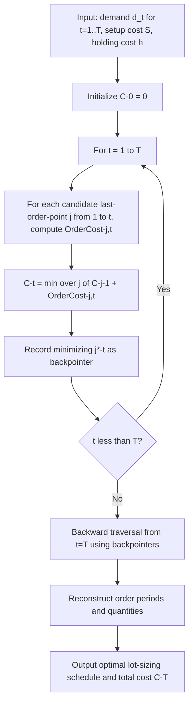

## Discrete Lot Sizing and the Wagner-Whitin Algorithm

### Definition and Purpose

Discrete lot sizing addresses the problem of determining production or order quantities across a finite planning horizon of discrete time periods (e.g., weeks or months) when demand is known but **time-varying** (dynamic), rather than constant as assumed in classical EOQ. The Wagner-Whitin algorithm, developed by Harvey M. Wagner and Thomson M. Whitin (1958), provides an exact, optimal solution to this problem using dynamic programming, guaranteeing the true minimum-cost ordering/production schedule over the entire horizon — in contrast to the heuristic lot-sizing rules (Silver-Meal, Part-Period Balancing, Lot-for-Lot) commonly used in practice as computationally cheaper approximations.

This model directly addresses a gap left by classical EOQ: EOQ assumes constant demand and produces a single repeating order quantity; Wagner-Whitin explicitly handles the case where known demand fluctuates period to period (common in MRP-driven production environments with lumpy, dependent demand), and determines potentially *different* order quantities in different periods.

### Problem Setup

**Given:**

- A finite planning horizon of $T$ discrete periods
- Known (deterministic) demand $d_t$ for each period $t = 1, 2, \ldots, T$ (not necessarily constant across periods)
- Fixed ordering/setup cost $S$ per period in which an order is placed (independent of order size)
- Holding cost $h$ per unit per period, charged on ending inventory carried from period $t$ to period $t+1$
- No backorders/shortages allowed (all demand in each period must be satisfied, either from that period's order or from inventory carried forward)

**Find:** the sequence of order quantities $Q_1, Q_2, \ldots, Q_T$ that minimizes total ordering plus holding cost over the horizon.

### The Zero-Inventory Ordering (ZIO) Property

The Wagner-Whitin algorithm rests on a foundational theoretical result: **in an optimal solution, an order is placed only in periods where starting inventory is exactly zero.** This is known as the Zero-Inventory Ordering property, and it can be proven that any optimal solution must satisfy it — if inventory were positive at the start of a period in which an order is also placed, the order could be reduced (moved earlier or later) to strictly reduce holding cost without violating any constraint, contradicting optimality.

This property is what makes the problem tractable via dynamic programming: instead of searching over all possible quantities for every period, the algorithm only needs to determine, for each period $t$, which *prior* period's order should cover demand through period $t$ — collapsing a continuous quantity-search problem into a discrete period-selection problem.

### The Dynamic Programming Formulation

Define $C(t)$ as the minimum total cost to satisfy demand for periods $1$ through $t$, given that an order is placed in period 1 (the horizon start) and the ZIO property holds throughout.

The algorithm evaluates, for each period $t$, every possible "last order point" $j \le t$ — meaning an order placed in period $j$ that covers demand for periods $j, j+1, \ldots, t$ with no additional orders in between — and selects the $j$ that minimizes cumulative cost.

**Cost of covering periods $j$ through $t$ with a single order placed in period $j$:**

$$\text{OrderCost}(j,t) = S + h\sum_{k=j+1}^{t} (k-j) \cdot d_k$$

This represents the fixed setup cost $S$ for the single order, plus holding cost for each unit of demand in periods after $j$, held in inventory for the number of periods between when it was ordered (period $j$) and when it is consumed (period $k$).

**Recursive relation:**

$$C(t) = \min_{1 \le j \le t} \left[ C(j-1) + \text{OrderCost}(j,t) \right]$$

with the base case $C(0) = 0$.

The algorithm computes $C(1), C(2), \ldots, C(T)$ sequentially, and at each step retains the optimal "last order point" $j^*(t)$ that achieved the minimum — this backpointer information is used to reconstruct the actual optimal ordering schedule via backward traversal once $C(T)$ is computed.

### Algorithm Steps

1. **Initialize** $C(0) = 0$
2. **For each period $t = 1$ to $T$:** evaluate $C(j-1) + \text{OrderCost}(j,t)$ for every $j = 1, \ldots, t$, and set $C(t)$ to the minimum, recording the minimizing $j^*(t)$
3. **After computing $C(T)$:** reconstruct the optimal order schedule by backward traversal — starting from $t=T$, find $j^*(T)$ (the period of the last order, covering through period $T$), then recursively find $j^*(j^*(T)-1)$, and so on, until reaching period 1
4. **Translate the order points into order quantities**: an order placed at period $j$ covering through the period just before the next order point equals the sum of demand over that covered span

### Worked Numerical Example

A planning horizon of 4 periods with demand:

| Period $t$ | 1 | 2 | 3 | 4 |
| --- | --- | --- | --- | --- |
| Demand $d_t$ | 50 | 60 | 30 | 70 |

Setup cost $S = \$100$ per order; holding cost $h = \$2$ per unit per period.

**Step 1 — Compute $C(1)$** (only one option: order in period 1 to cover period 1):

$$\text{OrderCost}(1,1) = 100 + 2(0) = 100$$

$$C(1) = C(0) + 100 = 100, \quad j^*(1) = 1$$

**Step 2 — Compute $C(2)$**, evaluating $j=1$ (single order covers periods 1–2) and $j=2$ (separate order for period 2):

*$j=1$:* $\text{OrderCost}(1,2) = 100 + 2 \times (2-1) \times 60 = 100 + 120 = 220$; total $= C(0) + 220 = 220$

*$j=2$:* $\text{OrderCost}(2,2) = 100$; total $= C(1) + 100 = 100 + 100 = 200$

$$C(2) = \min(220, 200) = 200, \quad j^*(2) = 2$$

**Step 3 — Compute $C(3)$**, evaluating $j=1,2,3$:

*$j=1$:* $\text{OrderCost}(1,3) = 100 + 2[(2-1)(60) + (3-1)(30)] = 100 + 2[60+60] = 100+240=340$; total $= C(0)+340=340$

*$j=2$:* $\text{OrderCost}(2,3) = 100 + 2 \times (3-2) \times 30 = 100+60=160$; total $= C(1)+160=100+160=260$

*$j=3$:* $\text{OrderCost}(3,3) = 100$; total $= C(2)+100=200+100=300$

$$C(3) = \min(340, 260, 300) = 260, \quad j^*(3) = 2$$

**Step 4 — Compute $C(4)$**, evaluating $j=1,2,3,4$:

*$j=1$:* $\text{OrderCost}(1,4) = 100+2[(1)(60)+(2)(30)+(3)(70)] = 100+2[60+60+210]=100+660=760$; total$=0+760=760$

*$j=2$:* $\text{OrderCost}(2,4) = 100+2[(1)(30)+(2)(70)]=100+2[30+140]=100+340=440$; total$=C(1)+440=100+440=540$

*$j=3$:* $\text{OrderCost}(3,4) = 100+2\times(1)\times70=100+140=240$; total$=C(2)+240=200+240=440$

*$j=4$:* $\text{OrderCost}(4,4)=100$; total$=C(3)+100=260+100=360$

$$C(4) = \min(760, 540, 440, 360) = 360, \quad j^*(4) = 4$$

**Step 5 — Backward reconstruction:**

Starting at $t=4$: $j^*(4)=4$ → order placed in period 4 covers only period 4 (quantity = 50... wait, demand in period 4 is 70).

Order at period 4 covers period 4 only: quantity = $d_4 = 70$.

Move to $t = j^*(4)-1 = 3$: $j^*(3) = 2$ → order placed in period 2 covers periods 2–3: quantity $= d_2+d_3 = 60+30=90$.

Move to $t=j^*(3)-1=1$: $j^*(1)=1$ → order placed in period 1 covers period 1 only: quantity $=d_1=50$.

**Optimal schedule:** Order 50 units in period 1, order 90 units in period 2, no order in period 3, order 70 units in period 4. **Total minimum cost = $360.**

**Verification against Lot-for-Lot (naive: order exactly demand each period):**

$$TC_{LFL} = 4 \times S = 4 \times 100 = \$400 \text{ (no holding cost since nothing carried over)}$$

The Wagner-Whitin optimal solution ($360) beats naive lot-for-lot ($400) by consolidating periods 2–3 into a single order, trading a small amount of holding cost (2 periods × 30 units × $2 = $60 holding cost for period 3's units held one period early — wait, checking: units for period 3 held from period 2 to period 3 is 1 period × 30 units × $2 = $60) against one fewer setup cost ($100 saved), a net benefit of $40 — consistent with the $40 gap between $400 and $360.

### Algorithm Complexity

The basic Wagner-Whitin algorithm as described has computational complexity $O(T^2)$, since for each of the $T$ periods, up to $T$ prior order points must be evaluated. More efficient implementations using the **planning horizon theorem** (a property proven by Wagner and Whitin allowing early elimination of dominated order points) can reduce this in practice, and further algorithmic refinements have achieved $O(T \log T)$ in some formulations [Unverified — exact complexity improvements depend on the specific algorithmic refinement and implementation; the classical textbook presentation is $O(T^2)$].

### Planning Horizon Theorem

A key theoretical property that improves practical efficiency: if, in the optimal solution to periods $1$ through $t$, the last order was placed at period $j^*(t)$, then this decision **remains optimal** for all future extensions of the horizon beyond $t$ — meaning earlier order-point decisions never need to be revisited as new periods are added or as the algorithm progresses forward. This property justifies rolling-horizon implementations, where the algorithm can be run period-by-period as new demand information becomes available, without needing to re-solve the entire historical horizon from scratch each time. [Inference — practical rolling-horizon implementations must still handle forecast revisions and horizon truncation effects carefully; the theorem guarantees consistency only for the deterministic-demand assumption holding exactly as originally specified.]

### Algorithm Process Flow

### Comparison to Heuristic Lot-Sizing Rules

Wagner-Whitin guarantees the mathematically optimal solution but requires full knowledge of demand across the entire horizon and $O(T^2)$ computation, which can be a practical constraint in large-scale MRP systems with thousands of SKUs. Several heuristics trade optimality guarantees for computational simplicity:

| Method | Approach | Optimality |
| --- | --- | --- |
| Lot-for-Lot (LFL) | Order exactly the period's demand each period | No holding cost, but maximizes setup cost frequency |
| Fixed Order Quantity | Order a constant $Q$ (e.g., EOQ-derived) regardless of period demand variation | Simple but ignores demand timing pattern |
| Silver-Meal heuristic | Minimize average cost per period, extend order coverage while average cost per period decreases | Near-optimal in most cases, not guaranteed optimal |
| Part-Period Balancing | Extend order coverage until cumulative holding cost approximately equals setup cost | Heuristic, not guaranteed optimal |
| Wagner-Whitin | Full dynamic programming search | Guaranteed globally optimal |

[Inference — the degree of cost gap between heuristics and the true Wagner-Whitin optimum varies by demand pattern; heuristics like Silver-Meal are widely reported in operations research literature to perform close to optimal in most practical demand patterns, but this is not a universal guarantee across all possible demand sequences.]

### Practical Implementation Considerations

- **MRP system integration**: Wagner-Whitin is most naturally applied to dependent-demand items in Material Requirements Planning systems, where the demand schedule $d_t$ is derived from a master production schedule via bill-of-materials explosion, making the "known future demand" assumption more defensible than for independent-demand (forecast-driven) items
- **Rolling horizon re-planning**: Because real planning horizons extend indefinitely while the algorithm requires a finite $T$, practical implementations typically re-run the algorithm on a rolling basis (e.g., recomputing weekly with an updated horizon window) rather than solving once for an entire multi-year horizon
- **Capacity constraints not included in the base model**: The classical Wagner-Whitin formulation assumes unlimited production/ordering capacity in any period; capacitated variants exist but substantially increase problem complexity and generally require different solution techniques (e.g., mixed-integer programming) rather than the simple dynamic programming recursion
- **Demand certainty assumption**: As with all deterministic lot-sizing models, forecast error in practice means the "known" demand schedule $d_t$ is itself an estimate — the algorithm's optimality guarantee holds only relative to the assumed demand inputs, not against real future uncertainty

### Limitations

- **No shortages/backorders permitted** in the base formulation — all demand must be met from either current-period order or carried inventory; extensions exist that incorporate backordering but add complexity to the recursion
- **Assumes stationary, known cost parameters** ($S$ and $h$ constant across the horizon) — time-varying costs require model modification
- **Computational burden at scale**: While $O(T^2)$ is tractable for a single item over a modest horizon, applying exact Wagner-Whitin across thousands of SKUs in a large MRP system can be computationally expensive relative to heuristic methods, which is a primary practical reason heuristics remain common in commercial ERP/MRP software despite Wagner-Whitin's optimality guarantee
- **No explicit treatment of demand uncertainty**: Like EOQ and EPQ, this is a fully deterministic model; it does not produce a safety stock recommendation and is not a substitute for stochastic inventory control models when demand is genuinely uncertain

**Related Topics**

- Economic order quantity derivation and assumptions
- Material Requirements Planning (MRP) and dependent demand systems
- Silver-Meal heuristic and part-period balancing lot-sizing rules
- Dynamic programming applications in operations research
- Capacitated lot-sizing problem formulations
- Master production scheduling and bill-of-materials explosion
- Rolling horizon planning and forecast revision handling