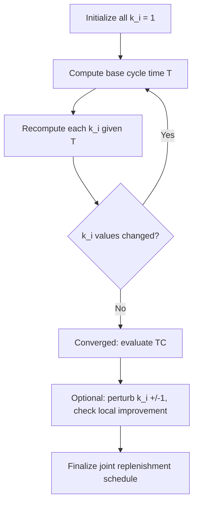

## Joint Replenishment and Multi-Item Ordering

### Overview

Joint replenishment addresses the problem of coordinating order timing and quantities across multiple items (SKUs) that share a common ordering resource — a supplier, a warehouse, a truck, or a purchasing department. Instead of applying the classical Economic Order Quantity (EOQ) independently to each item, joint replenishment exploits **economies of scope** in ordering: a single "major" setup or fixed cost (e.g., placing a purchase order, dispatching a truck) is incurred once per joint order, while each item incurs its own smaller "minor" setup cost (e.g., picking, quality inspection, item-specific paperwork).

This is a deterministic extension of the single-item EOQ model, situated between pure independent-item lot sizing and full multi-echelon coordination.

### Motivation

**Key Points**

- Independent EOQ per item ignores shared fixed costs, leading to excessive total ordering frequency across a portfolio of items.
- Coordinating replenishment reduces the number of major setups (deliveries, purchase orders) while still allowing item-specific cycle lengths.
- Common in practice: multiple products from the same supplier, multiple components requiring the same machine setup, or items sharing transportation capacity.

### Problem Formulation

Consider $n$ items indexed $i = 1, \dots, n$, each with:

- Demand rate $D_i$ (units per unit time)
- Holding cost rate $h_i$ (cost per unit per unit time)
- Minor (item-specific) setup cost $s_i$
- Major (joint) setup cost $S$, incurred whenever *any* order is placed

The total cost function per unit time for a joint replenishment policy is:

$$TC = \frac{S}{T} \sum_{i} \delta_i(T) + \sum_i \left( \frac{s_i}{T_i} + \frac{h_i D_i T_i}{2} \right)$$

where $T$ is the base cycle time and $\delta_i(T)$ indicates whether item $i$ is ordered in a given base cycle. The core decision is **which items to order together, and how often**.

### The Indirect Grouping Strategy (Policy Class)

The most widely used deterministic framework is the **indirect grouping (integer-ratio) policy**:

1. Choose a base cycle time $T$.
2. Assign each item $i$ an integer multiplier $k_i \geq 1$, so item $i$ is reordered every $k_i T$ time units.
3. Every $T$ time units, a joint order is placed; item $i$ is included only in cycles where $k_i$ divides the cycle count.

This reduces the multi-dimensional continuous optimization to two coupled problems: finding optimal $T$ given the $\{k_i\}$, and finding optimal $\{k_i\}$ given $T$.

### Cost Function Under Indirect Grouping

$$TC(T, k_1, \dots, k_n) = \frac{S}{T} + \sum_{i=1}^n \left( \frac{s_i}{k_i T} + \frac{h_i D_i k_i T}{2} \right)$$

**Key Points**

- The first term $S/T$ is the major setup cost rate — paid once per base cycle regardless of which items are included.
- The second term aggregates each item's own minor setup and holding cost, scaled by its individual multiplier $k_i$.
- Larger $k_i$ means the item is ordered less frequently (larger batches, higher holding cost, lower per-cycle minor setup burden).

### Solving for the Base Cycle Time

For fixed integers $k_i$, taking $\partial TC / \partial T = 0$ gives:

$$T^* = \sqrt{\dfrac{2\left(S + \sum_i s_i/k_i\right)}{\sum_i h_i D_i k_i}}$$

This is a direct generalization of the single-item EOQ cycle time formula, where the "effective setup cost" is $S + \sum_i s_i/k_i$ and the "effective holding rate" is $\sum_i h_i D_i k_i$.

### Solving for the Multipliers (Heuristic Procedure)

Finding optimal integer $k_i$ jointly with $T$ has no closed form because the two decisions are coupled through a non-convex integer program. The standard deterministic heuristic (commonly attributed to the RAND/Silver-Meal-style joint replenishment literature, e.g., Goyal's and Silver's heuristics) proceeds iteratively:

1. **Initialize**: Set $k_i = 1$ for all items (every item ordered every cycle).
2. **Compute base cycle** $T$ using the formula above.
3. **Recompute each $k_i$** independently, treating $T$ as fixed:

   $$k_i = \max\left(1, \; \text{round}\left(\sqrt{\frac{2 s_i}{h_i D_i T^2}}\right)\right)$$
4. **Repeat** steps 2–3 until the $\{k_i\}$ stabilize (typically converges in 2–4 iterations).
5. **Evaluate** total cost $TC$; optionally perturb individual $k_i \pm 1$ to check for local improvement (since rounding can miss the discrete optimum).

[Inference] Convergence to the discrete global optimum is not guaranteed by this heuristic; it typically yields a solution within a small percentage of optimality for well-behaved cost parameters, but pathological cost structures can require enumeration or more advanced integer programming.

### Worked Example

**Example**

Three items share a supplier with major setup cost $S = \$100$ per order.

| Item | $D_i$ (units/yr) | $h_i$ ($/unit/yr) | $s_i$ ($) |
| --- | --- | --- | --- |
| A | 1,000 | 2.00 | 10 |
| B | 5,000 | 1.00 | 15 |
| C | 2,000 | 4.00 | 5 |

**Step 1 — Initialize** $k_A = k_B = k_C = 1$.

**Step 2 — Compute $T$**:

$$T = \sqrt{\frac{2(100 + 10 + 15 + 5)}{(2)(1000) + (1)(5000) + (4)(2000)}} = \sqrt{\frac{260}{15000}} \approx 0.1317 \text{ yr}$$

**Step 3 — Recompute $k_i$**:

- $k_A = \text{round}\left(\sqrt{\frac{2(10)}{2(1000)(0.1317)^2}}\right) = \text{round}\left(\sqrt{0.577}\right) \approx \text{round}(0.76) = 1$
- $k_B = \text{round}\left(\sqrt{\frac{2(15)}{1(5000)(0.1317)^2}}\right) = \text{round}\left(\sqrt{0.346}\right) \approx \text{round}(0.59) = 1$
- $k_C = \text{round}\left(\sqrt{\frac{2(5)}{4(2000)(0.1317)^2}}\right) = \text{round}\left(\sqrt{0.0721}\right) \approx \text{round}(0.27) = 1$

All multipliers remain 1, so the procedure has converged: order all three items jointly every $T \approx 0.132$ years (~48 days), i.e., no further stratification is beneficial given these cost ratios.

**Output**

$$TC^* = \frac{100}{0.1317} + \sum_i\left(\frac{s_i}{1 \cdot 0.1317} + \frac{h_i D_i (1)(0.1317)}{2}\right) \approx \$759.3 + \$227.8 + \$1974.2 \approx \$2,961.3/\text{yr}$$

[Unverified] The precise dollar total depends on rounding at each intermediate step; recompute with unrounded intermediate values for procurement-grade precision.

### Direct Grouping Strategy (Alternative)

An alternative deterministic approach is **direct grouping**, where items are partitioned into disjoint subgroups, and each subgroup is treated as an independent joint-replenishment problem with its own shared major setup cost. This is useful when items naturally cluster by supplier, product family, or shared machine setup, and is often solved via clustering heuristics or by comparing total cost across candidate partitions.

### Relationship to Classical EOQ

**Key Points**

- Setting $n = 1$ (single item) and $s_1 = 0$ collapses the model to the standard EOQ formula $Q^* = \sqrt{2DS/h}$.
- If $S = 0$ (no shared cost), each item reverts to independent EOQ — joint replenishment offers no benefit.
- The value of coordination grows with the ratio $S / \sum s_i$: the more dominant the shared fixed cost, the greater the savings from synchronization.

### Diagram: Joint Replenishment Ordering Timeline (svg_diagram)

<svg xmlns="http://www.w3.org/2000/svg" viewBox="0 0 760 320">
<text x="380" y="24" text-anchor="middle" font-size="16" font-weight="bold" fill="#1a1a1a">Joint Replenishment Timeline (svg_diagram)</text>
<line x1="60" y1="280" x2="720" y2="280" stroke="#333" stroke-width="2" />
<text x="690" y="300" font-size="12" fill="#333">time</text>

<line x1="120" y1="270" x2="120" y2="290" stroke="#333" stroke-width="1.5" />
<line x1="240" y1="270" x2="240" y2="290" stroke="#333" stroke-width="1.5" />
<line x1="360" y1="270" x2="360" y2="290" stroke="#333" stroke-width="1.5" />
<line x1="480" y1="270" x2="480" y2="290" stroke="#333" stroke-width="1.5" />
<line x1="600" y1="270" x2="600" y2="290" stroke="#333" stroke-width="1.5" />

<text x="120" y="305" font-size="11" text-anchor="middle">T</text>

<text x="240" y="305" font-size="11" text-anchor="middle">2T</text>

<text x="360" y="305" font-size="11" text-anchor="middle">3T</text>

<text x="480" y="305" font-size="11" text-anchor="middle">4T</text>

<text x="600" y="305" font-size="11" text-anchor="middle">5T</text>

<text x="60" y="90" font-size="12" font-weight="bold" fill="`#2b6cb0`">Item A (k=1)</text>

<circle cx="120" cy="90" r="8" fill="`#2b6cb0`" />

<circle cx="240" cy="90" r="8" fill="`#2b6cb0`" />

<circle cx="360" cy="90" r="8" fill="`#2b6cb0`" />

<circle cx="480" cy="90" r="8" fill="`#2b6cb0`" />

<circle cx="600" cy="90" r="8" fill="`#2b6cb0`" />

<text x="60" y="150" font-size="12" font-weight="bold" fill="`#38a169`">Item B (k=2)</text>

<circle cx="120" cy="150" r="8" fill="`#38a169`" />

<circle cx="360" cy="150" r="8" fill="`#38a169`" />

<circle cx="600" cy="150" r="8" fill="`#38a169`" />

<text x="60" y="210" font-size="12" font-weight="bold" fill="`#dd6b20`">Item C (k=3)</text>

<circle cx="120" cy="210" r="8" fill="`#dd6b20`" />

<circle cx="480" cy="210" r="8" fill="`#dd6b20`" />

<line x1="120" y1="60" x2="120" y2="270" stroke="#999" stroke-dasharray="4,3" stroke-width="1" />
<line x1="240" y1="60" x2="240" y2="270" stroke="#ccc" stroke-dasharray="4,3" stroke-width="1" />
<line x1="360" y1="60" x2="360" y2="270" stroke="#999" stroke-dasharray="4,3" stroke-width="1" />
<line x1="480" y1="60" x2="480" y2="270" stroke="#999" stroke-dasharray="4,3" stroke-width="1" />
<line x1="600" y1="60" x2="600" y2="270" stroke="#999" stroke-dasharray="4,3" stroke-width="1" />

<text x="60" y="50" font-size="11" fill="#666">Major setup S paid at every joint order event (dashed lines)</text>

</svg>

### Process Flow: Iterative Heuristic (svg_diagram / Mermaid)

### Extensions and Variants

**Key Points**

- **Can-order policies (s, c, S)**: A probabilistic/stochastic extension where an item is opportunistically added to a joint order if its inventory drops below a "can-order" threshold $c_i$, even if it hasn't hit its own reorder point $s_i$. This blends deterministic joint replenishment with reactive triggering.
- **Continuous review joint replenishment**: Instead of a fixed base cycle, orders are triggered when a "family" or "coordinated" reorder point is breached, with member items following differing consumption patterns.
- **Capacitated joint replenishment**: Adds constraints such as truck capacity, budget limits, or warehouse space, transforming the problem into a constrained optimization (often solved via Lagrangian relaxation or mixed-integer programming).
- **Multi-echelon joint replenishment**: Extends coordination up the supply chain (e.g., synchronizing supplier-to-warehouse and warehouse-to-store replenishment), closely related to the One-Warehouse-Multi-Retailer (OWMR) problem.

### Practical Implementation Considerations

**Key Points**

- Grouping decisions should be revisited periodically as demand rates $D_i$ drift, since the optimal $k_i$ partition is sensitive to relative cost ratios.
- In ERP/procurement systems, joint replenishment is often implemented as **consolidated purchase orders** or **milk-run scheduling** for logistics.
- [Inference] In real-world civic/government procurement contexts (e.g., LGU document/asset management systems), joint replenishment logic is more likely to appear as batched purchase-request consolidation rules than as a continuously optimized $(T, k_i)$ solver, given procurement cycles are often bound by budget/appropriation periods rather than pure cost minimization.

### Conclusion

Joint replenishment generalizes EOQ to portfolios of items sharing a fixed ordering cost, formalizing the trade-off between consolidating orders (to amortize the major setup cost $S$) and holding excess inventory for infrequently-needed items. The indirect grouping (power-of-two or integer-ratio) heuristic remains the standard deterministic solution approach due to its tractability and near-optimal empirical performance, despite lacking a closed-form global optimum.

**Next Steps / Related Topics**

- Power-of-two policies for joint replenishment (restricting $k_i$ to powers of 2 for schedule simplicity)
- (s, c, S) can-order policies under stochastic demand
- One-Warehouse-Multi-Retailer (OWMR) coordinated replenishment
- Lot-sizing with shared capacity constraints (Wagner-Whitin extensions)
- Vehicle routing and milk-run scheduling as a physical realization of joint replenishment
- Lagrangian relaxation methods for capacitated multi-item lot sizing