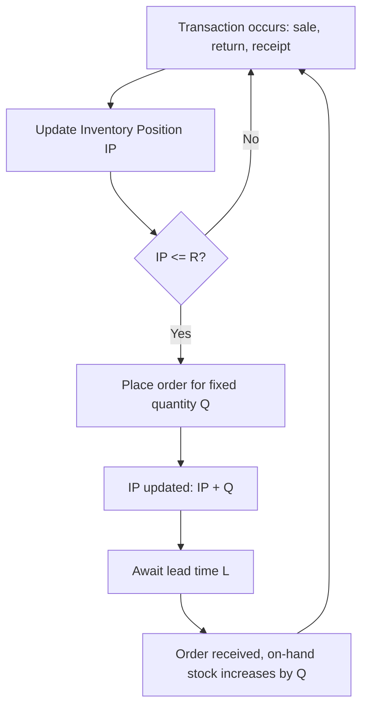

## Continuous Review Reorder Point Policy

### Overview

The continuous review reorder point policy — commonly denoted the $(s, Q)$ or $(R, Q)$ policy — is an inventory control structure in which inventory position is monitored continuously (i.e., after every transaction), and a fixed order quantity $Q$ is triggered the instant inventory position drops to or below a predefined reorder point $R$ (also denoted $s$). This contrasts with periodic review policies, where inventory is checked only at fixed time intervals.

### Core Definitions

**Key Points**

- **Inventory Position (IP)**: On-hand inventory + outstanding orders − backorders. This is the trigger variable, not on-hand stock alone.
- **Reorder Point ($R$ or $s$)**: The inventory position threshold that triggers a new order.
- **Order Quantity ($Q$)**: The fixed lot size placed each time $R$ is breached, typically set to the EOQ.
- **Lead Time ($L$)**: The time between placing an order and its receipt.
- **Lead Time Demand (LTD)**: The stochastic demand realized during $L$; this is the quantity the reorder point must protect against.

### Policy Mechanics

$$\text{Reorder triggered when } IP \leq R$$

Upon trigger, an order of fixed size $Q$ is placed, so inventory position immediately jumps to $IP + Q$. Because review is continuous, the policy reacts instantaneously to demand — unlike periodic policies, there is no risk exposure window beyond the lead time itself.

### Determining the Reorder Point

Under deterministic demand, $R$ simply equals the lead time demand:

$$R = \bar{d} \cdot L$$

where $\bar{d}$ is the average demand rate. Under stochastic demand — the realistic case this policy is designed for — $R$ must also cover demand variability during the lead time via **safety stock (SS)**:

$$R = \bar{d} L + SS$$

### Safety Stock and Service Level

**Key Points**

- Safety stock exists to buffer against the risk of stockout during the lead time, since $R$ is set *before* lead-time demand is known.
- The two dominant service-level metrics are **Type 1 (cycle service level)** — probability of no stockout in a replenishment cycle — and **Type 2 (fill rate)** — proportion of demand met directly from stock.

Assuming lead time demand is normally distributed with mean $\mu_{LTD} = \bar{d}L$ and standard deviation $\sigma_{LTD}$, and targeting a Type 1 cycle service level $\alpha$:

$$SS = z_\alpha \cdot \sigma_{LTD}$$

$$R = \bar{d}L + z_\alpha \sigma_{LTD}$$

where $z_\alpha$ is the standard normal inverse CDF value corresponding to $\alpha$ (e.g., $z_{0.95} = 1.645$, $z_{0.99} = 2.326$).

### Computing Lead-Time Demand Variability

If daily demand has standard deviation $\sigma_d$ and lead time $L$ is deterministic:

$$\sigma_{LTD} = \sigma_d \sqrt{L}$$

If lead time itself is stochastic (mean $\bar{L}$, standard deviation $\sigma_L$) in addition to stochastic demand:

$$\sigma_{LTD} = \sqrt{L \cdot \sigma_d^2 + \bar{d}^2 \cdot \sigma_L^2}$$

**Key Points**

- This combined formula shows that lead-time variability $\sigma_L$ contributes disproportionately to $\sigma_{LTD}$ when demand rate $\bar{d}$ is high — supplier reliability becomes a major safety-stock driver for fast-moving items.
- [Inference] In practice, lead time uncertainty is frequently the dominant source of stockout risk for high-volume SKUs, even when day-to-day demand variance is modest, because the $\bar{d}^2 \sigma_L^2$ term scales quadratically with demand rate.

### Worked Example

**Example**

An item has:

- Average daily demand $\bar{d} = 50$ units/day
- Daily demand standard deviation $\sigma_d = 8$ units/day
- Deterministic lead time $L = 6$ days
- Target cycle service level $\alpha = 95\%$ ($z_{0.95} = 1.645$)

**Step 1 — Expected lead-time demand**:

$$\mu_{LTD} = 50 \times 6 = 300 \text{ units}$$

**Step 2 — Lead-time demand standard deviation**:

$$\sigma_{LTD} = 8\sqrt{6} \approx 19.60 \text{ units}$$

**Step 3 — Safety stock**:

$$SS = 1.645 \times 19.60 \approx 32.2 \text{ units}$$

**Output**

$$R = 300 + 32.2 = 332.2 \approx 333 \text{ units}$$

Order quantity $Q$ is determined separately via EOQ: $Q^* = \sqrt{2\bar{d} \cdot 365 \cdot K / h}$ (annualized), where $K$ is the fixed ordering cost and $h$ the annual holding cost per unit.

**Interpretation**: Whenever inventory position falls to 333 units, place an order for $Q$ units. The 33 units above the deterministic lead-time demand (300) constitute the safety buffer protecting against a 95% service level.

### Fill Rate (Type 2 Service) Alternative

For fill-rate-based safety stock, the relationship uses the **loss function** of the standard normal distribution rather than a direct $z$-lookup:

$$E[\text{Shortage per cycle}] = \sigma_{LTD} \cdot L(z)$$

$$1 - \text{Fill Rate} = \frac{E[\text{Shortage per cycle}]}{Q}$$

where $L(z) = \phi(z) - z[1-\Phi(z)]$ is the standard normal loss function. Solving this requires iterating on $z$ (often via lookup tables or numerical root-finding), since $Q$ and $SS$ are interdependent — this is why fill-rate-based $(R,Q)$ design is typically solved jointly with EOQ in an iterative procedure.

[Unverified] Closed-form solutions exist only for specific demand distributions; for non-normal lead-time demand (e.g., heavily right-skewed or intermittent demand), the normal approximation above can materially misstate required safety stock, and empirical or gamma/negative-binomial-based models are preferred.

### Order-Up-To Variant: $(R, S)$ vs $(R, Q)$

**Key Points**

- $(R, Q)$: fixed order quantity every time $R$ is breached — simpler to administer, common for standard-pack-size or container-load ordering.
- $(R, S)$ continuous review (less common in pure form): order enough to bring inventory position up to an order-up-to level $S$ — used when order quantity should vary in response to the size of the position gap, though this is more typical of periodic review.
- The continuous-review reorder point structure is most naturally paired with fixed $Q$ because the trigger is event-driven (a single transaction crossing $R$), not time-driven.

### Diagram: Sawtooth Inventory Profile (svg_diagram)

<svg xmlns="http://www.w3.org/2000/svg" viewBox="0 0 760 340">
<text x="380" y="24" text-anchor="middle" font-size="16" font-weight="bold" fill="#1a1a1a">Continuous Review (R,Q) Inventory Profile (svg_diagram)</text>

<line x1="60" y1="300" x2="720" y2="300" stroke="#333" stroke-width="2" />
<line x1="60" y1="40" x2="60" y2="300" stroke="#333" stroke-width="2" />
<text x="690" y="320" font-size="12" fill="#333">time</text>
<text x="20" y="45" font-size="12" fill="#333">units</text>

<line x1="60" y1="200" x2="720" y2="200" stroke="#e53e3e" stroke-dasharray="6,4" stroke-width="1.5" />
<text x="65" y="195" font-size="12" fill="#e53e3e" font-weight="bold">R (reorder point)</text>

<line x1="60" y1="260" x2="720" y2="260" stroke="#805ad5" stroke-dasharray="3,3" stroke-width="1.2" />
<text x="65" y="255" font-size="11" fill="#805ad5">Safety Stock</text>

<line x1="60" y1="60" x2="250" y2="200" stroke="#2b6cb0" stroke-width="2.5" />
<line x1="250" y1="200" x2="250" y2="60" stroke="#2b6cb0" stroke-width="2.5" stroke-dasharray="2,2" />

<line x1="250" y1="60" x2="440" y2="200" stroke="#2b6cb0" stroke-width="2.5" />
<line x1="440" y1="200" x2="440" y2="60" stroke="#2b6cb0" stroke-width="2.5" stroke-dasharray="2,2" />

<line x1="440" y1="60" x2="630" y2="200" stroke="#2b6cb0" stroke-width="2.5" />
<line x1="630" y1="200" x2="630" y2="60" stroke="#2b6cb0" stroke-width="2.5" stroke-dasharray="2,2" />
<line x1="630" y1="60" x2="700" y2="130" stroke="#2b6cb0" stroke-width="2.5" />

<circle cx="250" cy="200" r="6" fill="#e53e3e" />
<circle cx="440" cy="200" r="6" fill="#e53e3e" />
<circle cx="630" cy="200" r="6" fill="#e53e3e" />

<text x="250" y="225" font-size="10" text-anchor="middle" fill="`#e53e3e`">order</text>

<text x="440" y="225" font-size="10" text-anchor="middle" fill="`#e53e3e`">order</text>

<text x="630" y="225" font-size="10" text-anchor="middle" fill="`#e53e3e`">order</text>

<line x1="250" y1="320" x2="250" y2="305" stroke="#333" stroke-width="1" />
<line x1="330" y1="320" x2="330" y2="305" stroke="#333" stroke-width="1" />
<line x1="250" y1="312" x2="330" y2="312" stroke="#333" stroke-width="1" />
<text x="290" y="330" font-size="10" text-anchor="middle" fill="#333">L</text>

<text x="60" y="66" font-size="10" fill="#666">Q added</text>

</svg>

### Process Flow: Continuous Review Trigger Logic (svg_diagram / Mermaid)

### Comparison with Periodic Review Policy

| Aspect | Continuous Review $(R,Q)$ | Periodic Review $(T,S)$ |
| --- | --- | --- |
| Monitoring | Every transaction | Fixed intervals |
| Risk exposure window | Lead time $L$ only | Review period $T$ + lead time $L$ |
| Safety stock requirement | Lower (shorter exposure) | Higher (longer exposure) |
| Administrative overhead | Higher (requires real-time tracking) | Lower (batch review) |
| Order quantity | Fixed $Q$ | Variable (up to order-up-to level $S$) |
| Best suited for | High-value items, real-time POS/ERP systems | Items ordered jointly, low monitoring cost contexts |

[Inference] The lower safety stock requirement under continuous review is the primary economic justification for investing in real-time inventory tracking systems (e.g., barcode/RFID-integrated ERP), since the protection interval shrinks from $T+L$ to just $L$.

### Practical Implementation Considerations

**Key Points**

- Requires a transaction-processing system capable of updating inventory position in real time — point-of-sale integration, warehouse management system (WMS) hooks, or ERP triggers.
- $R$ and $Q$ should be recalculated periodically as demand statistics ($\bar{d}$, $\sigma_d$) drift, since a stale reorder point silently erodes the target service level.
- In a document/records management or asset-tracking context (e.g., LGU systems), the analogous pattern is a threshold-triggered replenishment or renewal alert — e.g., auto-flagging when available stock of a consumable (forms, seals, ID stock) crosses a minimum threshold — implemented as an event-driven check on every recorded transaction rather than a scheduled batch job.

### Conclusion

The continuous review reorder point policy formalizes a reactive, transaction-triggered replenishment rule that minimizes the demand-uncertainty exposure window to the lead time alone. Its reorder point $R$ decomposes cleanly into expected lead-time demand plus a safety stock term calibrated to a target service level, making it the standard baseline policy against which periodic review and more advanced stochastic control policies are compared.

**Next Steps / Related Topics**

- Periodic review $(T, S)$ policy and its safety stock inflation relative to $(R,Q)$
- $(s, S)$ min-max hybrid policy
- Fill rate vs cycle service level trade-offs in safety stock design
- Newsvendor model as the single-period analog
- Demand forecasting error propagation into $\sigma_{LTD}$
- Multi-echelon safety stock placement (guaranteed service vs stochastic service models)