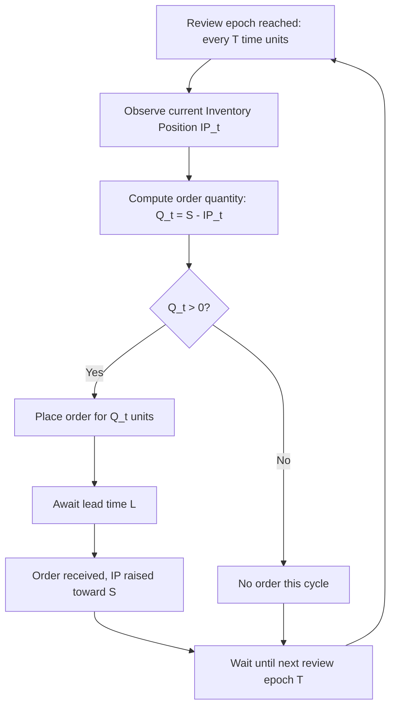

## Periodic Review Order-Up-To Policy

### Overview

The periodic review order-up-to policy — denoted $(T, S)$ or sometimes $(R, S)$ in a periodic-time sense — is an inventory control structure in which inventory position is reviewed only at fixed time intervals $T$, and at each review, an order is placed to bring inventory position up to a target level $S$ (the "order-up-to level" or "base-stock level"). Unlike continuous review $(R,Q)$, the order quantity is variable each cycle, determined by however much is needed to close the gap to $S$.

### Core Definitions

**Key Points**

- **Review Period ($T$)**: The fixed time interval between successive inventory reviews; no monitoring occurs between reviews.
- **Order-Up-To Level ($S$)**: The target inventory position after ordering, sized to cover expected demand plus safety stock over the **protection interval**.
- **Protection Interval**: The exposure window between review points, spanning $T + L$ — the review period *plus* the subsequent lead time — since an order placed at review $t$ won't arrive until $t + L$, and the next opportunity to react isn't until $t + T$.
- **Order Quantity (variable)**: $Q_t = S - IP_t$, where $IP_t$ is inventory position at the review epoch.

### Policy Mechanics

At each review epoch (every $T$ time units):

$$\text{Order } Q_t = S - IP_t \text{ units, bringing } IP_t \to S$$

This is fundamentally different from $(R,Q)$: the trigger is time-based, not event-based, and the quantity ordered varies cycle to cycle depending on how much demand occurred since the last review.

### Determining the Order-Up-To Level

Because the policy must protect against demand uncertainty over the full protection interval $T + L$ (not just $L$ as in continuous review), $S$ is computed analogously to the continuous-review reorder point but over the longer window:

$$S = \bar{d}(T + L) + SS$$

$$SS = z_\alpha \cdot \sigma_{T+L}$$

where $\bar{d}$ is the average demand rate and $\sigma_{T+L}$ is the standard deviation of demand over the protection interval $T + L$.

### Computing Protection-Interval Demand Variability

If daily demand has standard deviation $\sigma_d$ and both $T$ and $L$ are deterministic:

$$\sigma_{T+L} = \sigma_d \sqrt{T + L}$$

If lead time is also stochastic (mean $\bar{L}$, standard deviation $\sigma_L$):

$$\sigma_{T+L} = \sqrt{(T + L)\sigma_d^2 + \bar{d}^2 \sigma_L^2}$$

**Key Points**

- Because $\sigma_{T+L}$ scales with $\sqrt{T+L}$ rather than $\sqrt{L}$, safety stock under periodic review is structurally higher than under continuous review for the same lead time and service target — the longer protection interval is the direct cost of not monitoring continuously.
- This makes $T$ a direct design lever: shortening the review period reduces required safety stock but increases review/ordering administrative frequency — a trade-off central to review-period selection.

### Worked Example

**Example**

An item has:

- Average daily demand $\bar{d} = 40$ units/day
- Daily demand standard deviation $\sigma_d = 10$ units/day
- Review period $T = 14$ days
- Deterministic lead time $L = 5$ days
- Target cycle service level $\alpha = 97.5\%$ ($z_{0.975} = 1.960$)

**Step 1 — Protection interval**:

$$T + L = 14 + 5 = 19 \text{ days}$$

**Step 2 — Expected demand over protection interval**:

$$\bar{d}(T+L) = 40 \times 19 = 760 \text{ units}$$

**Step 3 — Protection-interval demand standard deviation**:

$$\sigma_{T+L} = 10\sqrt{19} \approx 43.6 \text{ units}$$

**Step 4 — Safety stock**:

$$SS = 1.960 \times 43.6 \approx 85.4 \text{ units}$$

**Output**

$$S = 760 + 85.4 = 845.4 \approx 846 \text{ units}$$

**Interpretation**: Every 14 days, inspect inventory position and order enough to raise it to 846 units. If, at a given review, $IP_t = 300$, then order $Q_t = 846 - 300 = 546$ units that cycle. The order size fluctuates review to review, unlike the fixed $Q$ of continuous review.

### Comparison to Continuous Review Reorder Point

Reusing the same underlying demand process, the continuous-review analog would only need to cover lead time $L=5$ days rather than $T+L=19$:

$$\sigma_L = 10\sqrt{5} \approx 22.4, \quad SS_{(R,Q)} = 1.960 \times 22.4 \approx 43.9$$

**Key Points**

- Safety stock nearly doubles under periodic review (85.4 vs 43.9) purely because of the added review-period exposure — this is the structural cost of batch/periodic monitoring versus real-time monitoring, holding the service target constant.
- [Inference] This differential is the standard economic argument for adopting continuous or near-continuous review (e.g., daily ERP-driven review approximating continuous review) when holding costs are high relative to the cost of more frequent review/ordering administration.

### Fill Rate (Type 2 Service) Formulation

As with continuous review, fill-rate-targeted order-up-to levels require the normal loss function:

$$E[\text{Shortage per cycle}] = \sigma_{T+L} \cdot L(z)$$

$$1 - \text{Fill Rate} = \frac{E[\text{Shortage per cycle}]}{\bar{d} \cdot T}$$

Here the denominator is expected demand *per review cycle* ($\bar{d}T$), not per order quantity $Q$, since $Q$ is variable under this policy — the natural cycle length is the review period itself.

[Unverified] As with continuous review, the normal approximation for lead-time-plus-review-period demand can be materially inaccurate for intermittent, lumpy, or heavily right-skewed demand patterns; gamma or empirical-distribution-based safety stock calculations are preferred in those cases.

### Choosing the Review Period $T$

**Key Points**

- $T$ is often set by operational or contractual constraints (e.g., weekly supplier visit schedule, monthly budget cycle) rather than pure cost optimization.
- When $T$ is a free decision variable, it can be optimized similarly to EOQ, treating the ordering/review fixed cost $K$ and holding cost $h$: $T^* \approx \sqrt{2K/(h\bar{d})}$, then evaluating the resulting safety stock inflation as a secondary cost.
- Shorter $T$ trades administrative/review cost for reduced safety stock; longer $T$ trades the reverse.

### Diagram: Order-Up-To Inventory Profile (svg_diagram)

<svg xmlns="http://www.w3.org/2000/svg" viewBox="0 0 760 340">
<text x="380" y="24" text-anchor="middle" font-size="16" font-weight="bold" fill="#1a1a1a">Periodic Review (T,S) Inventory Profile (svg_diagram)</text>
<line x1="60" y1="300" x2="720" y2="300" stroke="#333" stroke-width="2" />
<line x1="60" y1="40" x2="60" y2="300" stroke="#333" stroke-width="2" />
<text x="690" y="320" font-size="12" fill="#333">time</text>
<text x="20" y="45" font-size="12" fill="#333">units</text>

<line x1="60" y1="70" x2="720" y2="70" stroke="#2f855a" stroke-dasharray="6,4" stroke-width="1.5" />
<text x="65" y="65" font-size="12" fill="#2f855a" font-weight="bold">S (order-up-to level)</text>

<line x1="60" y1="260" x2="720" y2="260" stroke="#805ad5" stroke-dasharray="3,3" stroke-width="1.2" />
<text x="65" y="255" font-size="11" fill="#805ad5">Safety Stock</text>

<line x1="180" y1="40" x2="180" y2="300" stroke="#a0aec0" stroke-dasharray="2,3" stroke-width="1" />
<line x1="340" y1="40" x2="340" y2="300" stroke="#a0aec0" stroke-dasharray="2,3" stroke-width="1" />
<line x1="500" y1="40" x2="500" y2="300" stroke="#a0aec0" stroke-dasharray="2,3" stroke-width="1" />
<line x1="660" y1="40" x2="660" y2="300" stroke="#a0aec0" stroke-dasharray="2,3" stroke-width="1" />

<text x="180" y="330" font-size="10" text-anchor="middle" fill="#666">review</text>

<text x="340" y="330" font-size="10" text-anchor="middle" fill="#666">review</text>

<text x="500" y="330" font-size="10" text-anchor="middle" fill="#666">review</text>

<text x="660" y="330" font-size="10" text-anchor="middle" fill="#666">review</text>

<line x1="60" y1="70" x2="180" y2="150" stroke="#2b6cb0" stroke-width="2.5" />
<line x1="180" y1="150" x2="180" y2="70" stroke="#2b6cb0" stroke-width="2.5" stroke-dasharray="2,2" />
<line x1="180" y1="70" x2="340" y2="210" stroke="#2b6cb0" stroke-width="2.5" />
<line x1="340" y1="210" x2="340" y2="70" stroke="#2b6cb0" stroke-width="2.5" stroke-dasharray="2,2" />
<line x1="340" y1="70" x2="500" y2="120" stroke="#2b6cb0" stroke-width="2.5" />
<line x1="500" y1="120" x2="500" y2="70" stroke="#2b6cb0" stroke-width="2.5" stroke-dasharray="2,2" />
<line x1="500" y1="70" x2="660" y2="190" stroke="#2b6cb0" stroke-width="2.5" />
<line x1="660" y1="190" x2="660" y2="70" stroke="#2b6cb0" stroke-width="2.5" stroke-dasharray="2,2" />
<line x1="660" y1="70" x2="710" y2="130" stroke="#2b6cb0" stroke-width="2.5" />

<text x="120" y="330" font-size="9" fill="#999">T</text>

<text x="280" y="330" font-size="9" fill="#999">T</text>

<text x="440" y="330" font-size="9" fill="#999">T</text>

<text x="600" y="330" font-size="9" fill="#999">T</text>

</svg>

### Process Flow: Periodic Review Cycle Logic (svg_diagram / Mermaid)

### Comparison with Continuous Review $(R,Q)$

| Aspect | Periodic Review $(T,S)$ | Continuous Review $(R,Q)$ |
| --- | --- | --- |
| Monitoring | Fixed intervals only | Every transaction |
| Protection interval | $T + L$ | $L$ only |
| Safety stock | Higher | Lower |
| Order quantity | Variable ($S - IP_t$) | Fixed ($Q$) |
| Administrative pattern | Batch, scheduled | Event-driven, real-time |
| Natural fit | Joint ordering across multiple SKUs, scheduled supplier visits | High-value or fast-moving single SKUs with real-time tracking |

### Practical Implementation Considerations

**Key Points**

- Naturally suited to **joint replenishment** contexts: since review already happens on a fixed schedule, multiple items can be reviewed and ordered together at the same review epoch, amortizing a shared major setup cost.
- Common in retail settings with scheduled delivery routes (e.g., weekly supplier truck) and in systems where continuous inventory tracking infrastructure is unavailable or costly.
- $S$ must be recalculated as demand statistics drift, and re-derived immediately if $T$ or $L$ change, since both directly inflate the protection interval and thus required safety stock.
- In a civic records/document management context, the periodic-review analog appears as scheduled stock-taking or batch reconciliation cycles (e.g., a fixed-interval audit of consumable supplies — forms, security paper, seals) where replenishment requests are generated only at defined checkpoints rather than continuously, making the $T+L$ exposure window directly relevant to how much buffer stock must be held between audits.

### Conclusion

The periodic review order-up-to policy trades the administrative simplicity of scheduled, batch-style inventory review for a structurally larger safety stock requirement, since uncertainty must be absorbed over the review period plus lead time rather than lead time alone. It is the natural policy structure for environments with fixed review cadences, joint ordering opportunities, or infrastructure constraints that preclude continuous monitoring, and its order-up-to level $S$ generalizes the continuous-review reorder point formula by substituting the longer protection interval $T+L$ for $L$.

**Next Steps / Related Topics**

- Continuous review $(R,Q)$ reorder point policy (protection interval comparison)
- $(s, S)$ min-max hybrid policy combining trigger threshold with order-up-to sizing
- Joint replenishment under shared periodic review schedules
- Optimal review period selection and its trade-off against safety stock cost
- Fill rate vs cycle service level under variable order quantities
- Base-stock policy in multi-echelon and make-to-stock production contexts