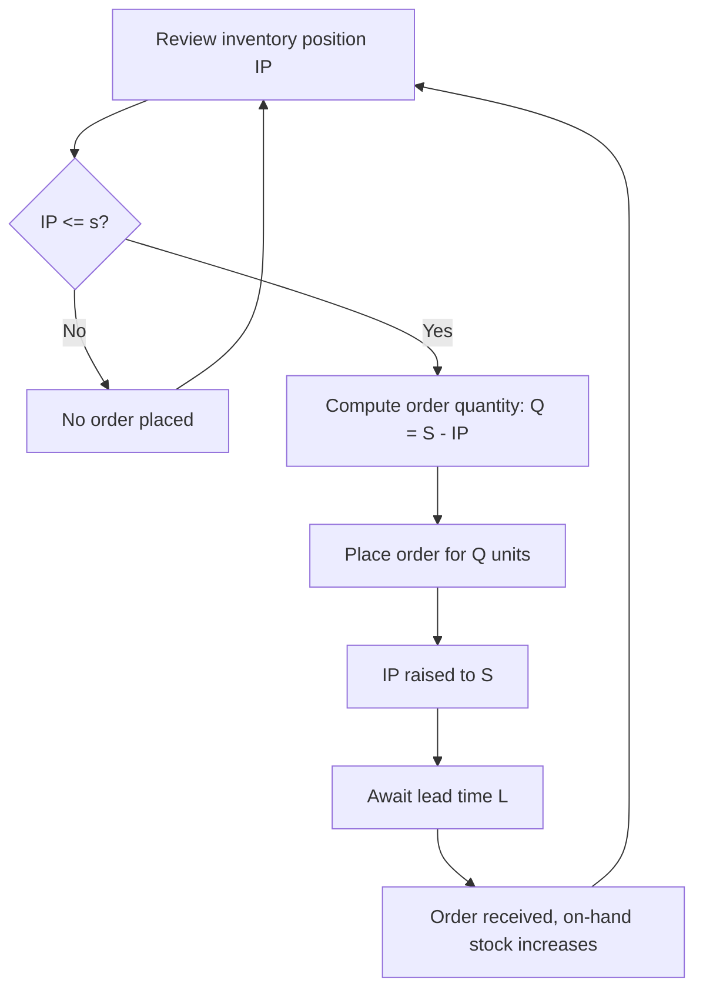

## Min-Max Inventory Policy

### Overview

The min-max policy — formally the $(s, S)$ policy in inventory theory — is a hybrid control structure that combines the event-triggered logic of a reorder point with the order-up-to sizing of a periodic review policy. Inventory is reviewed (continuously or periodically), and whenever inventory position falls to or below a **minimum** threshold $s$, an order is placed to bring inventory position up to a **maximum** level $S$. Unlike $(R,Q)$, the order quantity is variable; unlike pure $(T,S)$, ordering is only triggered when the position genuinely needs replenishing, not automatically every review.

### Core Definitions

**Key Points**

- **Min ($s$)**: The reorder trigger threshold — equivalent in role to the reorder point $R$ in continuous review policies.
- **Max ($S$)**: The order-up-to ceiling — the target inventory position after an order is placed.
- **Order Quantity (variable)**: $Q = S - IP$, placed only when $IP \leq s$; if $IP > s$ at a review, no order is placed at all.
- **Review Cadence**: Can be continuous (transaction-triggered, converging to true $(s,S)$) or periodic (checked only at fixed intervals, sometimes called $(s, S)$ periodic or "min-max with review period").

### Policy Mechanics

$$\text{If } IP \leq s: \text{ order } Q = S - IP, \text{ raising } IP \to S$$

$$\text{If } IP > s: \text{ no order}$$

This is the key structural distinction from $(T,S)$: at $(T,S)$, an order is placed at *every* review regardless of how small the gap to $S$ is. At $(s,S)$, an order is placed *only* when position has dropped meaningfully — avoiding excessive small, frequent orders when demand has been light.

### Relationship to Other Policies

**Key Points**

- $(s, S)$ generalizes $(R, Q)$: if $S - s$ is fixed and demand is such that $IP$ always lands exactly at $s$ when triggered, $(s,S)$ collapses to $(R,Q)$ with $R = s$ and $Q = S - s$.
- $(s, S)$ generalizes $(T, S)$: if $s$ is set high enough that every review triggers an order (i.e., $s \to S^-$), $(s,S)$ collapses to always-order-up-to-$S$ behavior.
- $(s, S)$ is provably optimal (minimizes expected cost) for the single-item, periodic-review stochastic inventory problem with fixed ordering cost, under fairly general demand distributions — a classical result (Scarf, 1960) establishing $K$-convexity of the cost function.

### Determining $s$ and $S$

The **min ($s$)** is computed exactly like a continuous-review reorder point, covering the relevant protection interval (lead time $L$ for continuous review, or $T+L$ for periodic review):

$$s = \bar{d} \cdot PI + z_\alpha \cdot \sigma_{PI}$$

where $PI$ is the protection interval ($L$ or $T+L$ depending on review mode).

The **max ($S$)** is set to cover the same protection interval *plus* an additional order-cycle's worth of expected demand, reflecting that once triggered, the order must last until the *next* likely reorder trigger:

$$S = s + Q^*$$

where $Q^*$ is typically the EOQ-style economic batch size:

$$Q^* = \sqrt{\frac{2 K \bar{d}}{h}}$$

with $K$ the fixed ordering cost and $h$ the holding cost rate. This gives:

$$S = \bar{d} \cdot PI + z_\alpha \sigma_{PI} + \sqrt{\frac{2K\bar{d}}{h}}$$

**Key Points**

- The gap $S - s$ functions as the effective batch size, analogous to $Q$ in $(R,Q)$, but is realized as a variable order quantity rather than fixed.
- Because $s$ absorbs the safety-stock role and $S-s$ absorbs the batching-economics role, min-max cleanly separates *risk protection* from *ordering efficiency* — a property that makes it intuitive for practitioners even without deep familiarity with the underlying math.

### Worked Example

**Example**

An item under continuous-review min-max control has:

- Average daily demand $\bar{d} = 30$ units/day
- Daily demand standard deviation $\sigma_d = 6$ units/day
- Lead time $L = 7$ days
- Target cycle service level $\alpha = 95\%$ ($z_{0.95} = 1.645$)
- Fixed ordering cost $K = \$40$, annual holding cost $h = \$3$/unit/year, annual demand $= 30 \times 365 = 10{,}950$ units/year

**Step 1 — Compute min ($s$)**:

$$\mu_{LTD} = 30 \times 7 = 210$$

$$\sigma_{LTD} = 6\sqrt{7} \approx 15.87$$

$$s = 210 + 1.645(15.87) \approx 210 + 26.1 = 236.1 \approx 236 \text{ units}$$

**Step 2 — Compute economic batch size ($Q^*$)**:

$$Q^* = \sqrt{\frac{2(40)(10950)}{3}} = \sqrt{292{,}000} \approx 540.4 \text{ units}$$

**Step 3 — Compute max ($S$)**:

$$S = s + Q^* = 236 + 540.4 \approx 776 \text{ units}$$

**Output**

$$\boxed{s = 236, \quad S = 776}$$

**Interpretation**: Whenever inventory position drops to 236 units or below, place an order to bring position up to 776 units. If position is checked and reads, say, 220 (having dropped slightly below the trigger), the order placed is $776 - 220 = 556$ units — slightly more than the nominal $Q^*$ because of the overshoot below $s$.

### Overshoot and Its Effect

**Key Points**

- In continuous-time stochastic demand, inventory position rarely lands *exactly* on $s$ when a trigger is checked — it typically dips slightly below due to discrete transaction sizes, causing "overshoot."
- Overshoot means realized order quantities are $Q^* $ plus a small random increment, and realized min levels are effectively slightly below the nominal $s$, marginally eroding the intended service level unless accounted for.
- [Inference] For high-frequency, small-transaction-size demand (e.g., unit-at-a-time retail sales), overshoot is typically negligible; for lumpy or large-batch demand, overshoot can be substantial and warrants explicit correction (e.g., increasing $s$ by an overshoot-adjustment term).

### Periodic vs Continuous Review Variants

| Aspect | Continuous $(s,S)$ | Periodic $(s,S)$ |
| --- | --- | --- |
| Trigger check | Every transaction | Every review interval $T$ |
| Protection interval for $s$ | $L$ | $T + L$ |
| Safety stock | Lower | Higher |
| Overshoot risk | Lower (checked frequently) | Higher (position can drop well past $s$ between reviews) |
| Common use case | ERP/POS-integrated systems, high-value SKUs | Manual/scheduled stock counts, less critical items |

### Diagram: Min-Max Inventory Profile (svg_diagram)

<svg xmlns="http://www.w3.org/2000/svg" viewBox="0 0 760 340">
<text x="380" y="24" text-anchor="middle" font-size="16" font-weight="bold" fill="#1a1a1a">Min-Max (s,S) Inventory Profile (svg_diagram)</text>
<line x1="60" y1="300" x2="720" y2="300" stroke="#333" stroke-width="2" />
<line x1="60" y1="40" x2="60" y2="300" stroke="#333" stroke-width="2" />
<text x="690" y="320" font-size="12" fill="#333">time</text>
<text x="20" y="45" font-size="12" fill="#333">units</text>

<line x1="60" y1="70" x2="720" y2="70" stroke="#2f855a" stroke-dasharray="6,4" stroke-width="1.5" />
<text x="65" y="65" font-size="12" fill="#2f855a" font-weight="bold">S (max)</text>

<line x1="60" y1="200" x2="720" y2="200" stroke="#e53e3e" stroke-dasharray="6,4" stroke-width="1.5" />
<text x="65" y="195" font-size="12" fill="#e53e3e" font-weight="bold">s (min)</text>

<line x1="60" y1="70" x2="160" y2="200" stroke="#2b6cb0" stroke-width="2.5" />
<line x1="160" y1="200" x2="160" y2="70" stroke="#2b6cb0" stroke-width="2.5" stroke-dasharray="2,2" />
<circle cx="160" cy="200" r="5" fill="#e53e3e" />
<line x1="160" y1="70" x2="380" y2="200" stroke="#2b6cb0" stroke-width="2.5" />
<line x1="380" y1="200" x2="380" y2="70" stroke="#2b6cb0" stroke-width="2.5" stroke-dasharray="2,2" />
<circle cx="380" cy="200" r="5" fill="#e53e3e" />
<line x1="380" y1="70" x2="450" y2="200" stroke="#2b6cb0" stroke-width="2.5" />
<line x1="450" y1="200" x2="450" y2="70" stroke="#2b6cb0" stroke-width="2.5" stroke-dasharray="2,2" />
<circle cx="450" cy="200" r="5" fill="#e53e3e" />
<line x1="450" y1="70" x2="640" y2="200" stroke="#2b6cb0" stroke-width="2.5" />
<line x1="640" y1="200" x2="640" y2="70" stroke="#2b6cb0" stroke-width="2.5" stroke-dasharray="2,2" />
<circle cx="640" cy="200" r="5" fill="#e53e3e" />
<line x1="640" y1="70" x2="700" y2="150" stroke="#2b6cb0" stroke-width="2.5" />

<text x="110" y="330" font-size="10" fill="#666" text-anchor="middle">short cycle</text>

<text x="270" y="330" font-size="10" fill="#666" text-anchor="middle">long cycle (light demand)</text>

<text x="415" y="330" font-size="10" fill="#666" text-anchor="middle">short cycle</text>

<text x="545" y="330" font-size="10" fill="#666" text-anchor="middle">medium cycle</text>

</svg>

### Process Flow: Min-Max Trigger Logic (svg_diagram / Mermaid)

### Comparison Across the Three Core Policy Structures

| Aspect | $(R,Q)$ Continuous | $(T,S)$ Periodic | $(s,S)$ Min-Max |
| --- | --- | --- | --- |
| Trigger | Event (IP crosses $R$) | Time (every $T$) | Event or time, only if $IP \leq s$ |
| Order quantity | Fixed | Variable | Variable |
| Orders every review? | N/A (event-driven) | Always | Only if triggered |
| Optimality (single item, fixed cost) | Special case | Suboptimal if $K>0$ vs (s,S) | Provably optimal (Scarf 1960) |
| Complexity to administer | Moderate | Low | Moderate-High |

### Practical Implementation Considerations

**Key Points**

- Min-max is the most common policy structure implemented in commercial inventory/ERP software specifically because it avoids the two failure modes of its simpler cousins: unnecessary small orders (as in $(T,S)$ when demand is light) and stockout risk between fixed reorder triggers (as in poorly-tuned $(R,Q)$ systems with static $Q$).
- Parameter drift management is critical: both $s$ and $S$ must be recalculated as demand statistics, lead time, or cost parameters change, since a stale $S-s$ gap silently degrades either service level (if $s$ is too low) or holding cost efficiency (if $S$ is too high).
- In a document/records management or civic procurement context, min-max logic is a natural fit for consumable stock control (forms, security paper, ID stock, seals): set a min threshold that triggers a purchase requisition and a max ceiling bounded by storage/budget constraints, letting the system auto-generate variable-size replenishment requests only when genuinely needed rather than on a rigid schedule.

### Conclusion

The min-max $(s,S)$ policy is the general-purpose workhorse of inventory control structures, subsuming both fixed-order-quantity and always-reorder periodic policies as special cases, and is the theoretically optimal structure for single-item stochastic demand under fixed ordering costs. Its two parameters cleanly separate the risk-protection function (the min, covering the protection interval) from the batching-economics function (the gap to the max, approximating the economic order quantity), making it both mathematically well-founded and operationally intuitive.

**Next Steps / Related Topics**

- Scarf's (1960) K-convexity proof of $(s,S)$ optimality
- Overshoot correction techniques in continuous-review $(s,S)$ systems
- $(s, S)$ under batch-size-constrained or minimum-order-quantity supplier terms
- Multi-echelon extensions of min-max policies (echelon inventory position)
- Parameter re-estimation cadence and demand statistics drift monitoring
- ABC/XYZ classification for tiering policy structure by item criticality